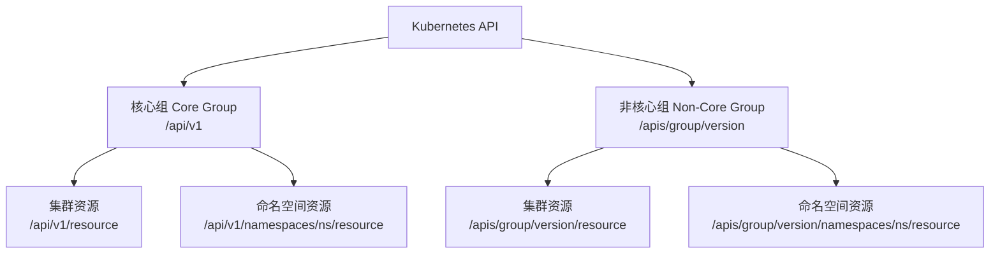

#kubernetes #restful

相关笔记：[[kubernetes-basics]] | [[api-resource]] | [[rbac]]

## Kubernetes RESTful API 概述

Kubernetes 的 RESTful API 是与集群交互的核心接口，通过不同的路由操作资源（如 Pod、Service、Deployment 等）。所有 kubectl 命令最终都会转化为对 API Server 的 REST 调用。

## API 路由格式

Kubernetes 的 API 路由分为两大类：**核心组（Core Group）**和**非核心组（Non-Core Group）**，每类又分为**集群资源**和**命名空间资源**。



### 路由对照表

| 类别 | 集群资源（Cluster-scoped） | 命名空间资源（Namespace-scoped） |
| --- | --- | --- |
| **核心组** | `/api/v1/{resource}` | `/api/v1/namespaces/{namespace}/{resource}` |
| **非核心组** | `/apis/{group}/{version}/{resource}` | `/apis/{group}/{version}/namespaces/{namespace}/{resource}` |

### 核心组（Core Group）

管理 Kubernetes 的基础资源，如 Pod、Service、Node，通常使用 `/api/v1` 进行访问。

### 非核心组（Non-Core Group）

管理扩展资源，如 Deployment、Ingress、CRD，使用 `/apis/{group}/{version}` 路由格式访问。

### 查看集群中的所有 API 资源

```bash
kubectl api-resources
```

## 常见 API 路由示例

| 路由 | 功能 |
| --- | --- |
| `/api/v1/pods` | 查询所有 Pod |
| `/api/v1/pods/mypod` | 查看名为 mypod 的 Pod 详情 |
| `/apis/apps/v1/deployments` | 管理 Deployment 资源 |
| `/api/v1/namespaces/myns/services` | 查看命名空间 myns 下的所有 Service |
| `/api/v1/nodes/mynode/proxy` | 访问某个节点的代理服务 |

## HTTP 方法与操作

| HTTP 方法 | 作用 | 举例 |
| --- | --- | --- |
| `GET` | 查询资源 | `GET /api/v1/pods` |
| `POST` | 创建新资源 | `POST /api/v1/pods` |
| `PUT` | 替换整个资源 | `PUT /api/v1/pods/mypod` |
| `PATCH` | 修改部分内容 | `PATCH /api/v1/pods/mypod` |
| `DELETE` | 删除资源 | `DELETE /api/v1/pods/mypod` |

## 实战示例

### 查所有的 Pod

```bash
curl -X GET https://<k8s-server>/api/v1/pods
```

### 创建一个 Pod

```bash
curl -X POST https://<k8s-server>/api/v1/pods \
  -H "Content-Type: application/json" \
  -d '{
    "apiVersion": "v1",
    "kind": "Pod",
    "metadata": {
      "name": "mypod"
    },
    "spec": {
      "containers": [
        {
          "name": "mycontainer",
          "image": "nginx"
        }
      ]
    }
  }'
```

### 获取一个 Pod 的日志

```bash
curl -X GET https://<k8s-server>/api/v1/pods/mypod/log
```

## 多集群场景下的 API 设计

Kubernetes RESTful API 的路由设计不仅灵活，还能帮助轻松实现扩展，比如支持多集群场景。在多集群环境中，可以基于 Kubernetes 的 API 设计实现高效的资源管理，同时无缝继承其认证与授权机制（RBAC），确保安全性和规范性。

### 示例：双集群管理

假设有两个 Kubernetes 集群：
- **集群 A**（`https://cluster-a.example.com`）: 用于开发环境
- **集群 B**（`https://cluster-b.example.com`）: 用于生产环境

```bash
# 在集群 A 创建一个 Pod
curl -X POST https://cluster-a.example.com/api/v1/namespaces/dev/pods \
  -H "Authorization: Bearer <TOKEN>" \
  -H "Content-Type: application/json" \
  -d '{
    "apiVersion": "v1",
    "kind": "Pod",
    "metadata": { "name": "mypod" },
    "spec": {
      "containers": [{ "name": "app", "image": "nginx" }]
    }
  }'

# 在集群 B 中查询所有 Pods
curl -X GET https://cluster-b.example.com/api/v1/namespaces/prod/pods \
  -H "Authorization: Bearer <TOKEN>"
```

通过 RBAC 的 Role 和 RoleBinding 配置，可以精细化控制每个集群的用户权限：
- 开发人员权限（集群 A）：仅允许访问 `dev` 命名空间
- 运维人员权限（集群 B）：仅允许访问 `prod` 命名空间

## 总结

- **灵活扩展**: 通过 API 路由设计，无论是单集群还是多集群都可以轻松管理
- **安全可靠**: RBAC 与 API 无缝结合，确保多集群环境下的资源隔离与权限管理

## 面试要点

### 高频问题

**Q: Kubernetes API 的核心组（Core Group）和命名组（Named/API Group）在 URL 路径上有什么区别？**
A: Core Group（也叫 legacy group）的 group 名为空字符串，路径前缀是 `/api/v1`，包含 Pod、Service、Node、ConfigMap 等最基础资源。其余资源都属于命名 API Group，路径前缀是 `/apis/{group}/{version}`，例如 Deployment 在 `/apis/apps/v1`、Ingress 在 `/apis/networking.k8s.io/v1`。这种分组设计便于 API 独立演进和扩展。

**Q: 如何从 URL 区分集群级资源和命名空间级资源？**
A: 命名空间资源的路径中带有 `namespaces/{namespace}` 段，如 `/api/v1/namespaces/dev/pods`；集群级资源（如 Node、PersistentVolume、ClusterRole、Namespace 本身）没有这一段，如 `/api/v1/nodes`。一个资源是否 namespaced 由其 RESTMapping 决定，可用 `kubectl api-resources --namespaced=true/false` 查看。

**Q: PUT 和 PATCH 在更新资源时有什么区别？**
A: PUT 是整体替换（full replacement），需要提交完整对象，且依赖 `resourceVersion` 做乐观并发控制，version 不匹配会返回 409 Conflict。PATCH 只提交变更部分，支持三种 Content-Type：Strategic Merge Patch（K8s 默认、靠 patchMergeKey 正确处理数组合并）、JSON Merge Patch（RFC 7386）、JSON Patch（RFC 6902）。注意 `kubectl apply` 默认走的是 client-side apply（基于 `last-applied-configuration` 注解做三方合并），只有加 `--server-side` 才走 Server-Side Apply（基于字段所有权 managedFields，对应 PATCH 的 `application/apply-patch+yaml`）。

**Q: kubectl 执行一条命令，背后是如何转换成 API 请求的？**
A: kubectl 通过本地的 RESTMapper / discovery 信息把 `kind`（如 Deployment）映射到对应的 GroupVersionResource 和 REST 路径，再用 client-go 构造带认证信息的 HTTPS 请求发往 API Server。可以加 `kubectl get pods -v=8` 看到完整的 URL、HTTP 方法、请求/响应体，本质就是对 RESTful API 的封装。

**Q: 像 `pods/log`、`pods/exec`、`nodes/proxy` 这类路径属于什么，和普通 GET Pod 有什么不同？**
A: 它们是资源的 subresource（子资源）。`log` 返回容器日志流；`exec`/`attach` 通过 SPDY 或 WebSocket 升级协议建立交互式连接；`proxy` 把请求转发到目标对象。subresource 在 RBAC 里需要单独授权（resource 写成 `pods/log`、`pods/exec`），还有 `status`、`scale` 等用于分离权限的子资源。

**Q: API Server 对 RESTful 请求的处理链路（认证、鉴权、准入）是怎样的？**
A: 请求进来后依次经过 Authentication（识别 user/group，支持客户端证书、Bearer Token、OIDC 等）、Authorization（RBAC/Node/Webhook 判断是否有权限）、Admission Control（先 Mutating 后 Validating webhook，做修改和校验），最后做 schema 校验并持久化到 etcd。笔记中多集群示例里的 `Authorization: Bearer <TOKEN>` 就是在认证阶段使用，RBAC 在鉴权阶段生效。

**Q: 同一个对象出现多个 apiVersion（如 v1beta1 和 v1）时，API Server 如何处理？**
A: 每个内置资源有一个内部版本（internal version）作为 hub，所有外部版本通过 conversion 互转。etcd 中以指定的 storage version 存储，客户端用任意已注册版本读写都会被自动转换。CRD 则通过声明 `storage: true` 的版本落盘、并可用 conversion webhook 实现多版本转换，这保证了 API 升级时的向后兼容。

### 面试加分点

- 能说清 GVK（GroupVersionKind，面向用户/对象）和 GVR（GroupVersionResource，面向 REST 路径）的区别，以及 RESTMapper 在两者间做映射的作用。
- 了解 List/Watch 机制：`GET /api/v1/pods?watch=true&resourceVersion=...` 基于 HTTP chunked streaming（新版本也支持 WebSocket）持续推送增量事件，是 Informer 和控制器 reconcile 的底层基础，比轮询高效得多。
- 知道 `kubectl proxy` 和 `kubectl --raw` 可以直接调原始 REST API 做调试，以及 `?dry-run=All`、`?fieldSelector`、`?labelSelector`、分页 `?limit=&continue=` 等查询参数的用途。
- 理解 Aggregated API（APIService 聚合，如 metrics-server）和 CRD 两种 API 扩展方式的差异：CRD 由 kube-apiserver 内置的 apiextensions-apiserver 处理、无需独立服务，Aggregated API 需要部署独立的 extension apiserver。
- 能补充常见状态码语义：创建成功返回 201、同步删除返回 200/异步删除返回 202、乐观锁冲突返回 409、schema 或 ValidatingWebhook 校验失败返回 422（普通拒绝也可能是 400/403），并配合 `Status` 对象返回结构化错误信息。
- 了解 subresource 在权限隔离上的价值，例如把 `status` 子资源单独授权给控制器、`scale` 子资源授权给 HPA，避免直接放开整个对象的写权限。
