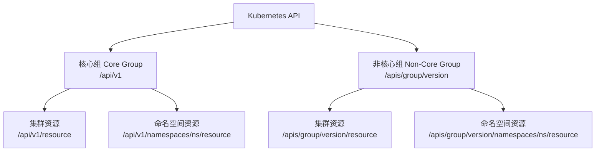

#kubernetes #restful

相关笔记：[[kubernetes-basics]] | [[api-resource]] | [[rbac]]

## Kubernetes RESTful API 概述

Kubernetes 的 RESTful API 是与集群交互的核心接口，通过不同的路由操作资源（如 Pod、Service、Deployment 等）。所有 kubectl 命令最终都会转化为对 API Server 的 REST 调用。

## API 路由格式

Kubernetes 的 API 路由分为两大类：**核心组（Core Group）**和**非核心组（Non-Core Group）**，每类又分为**集群资源**和**命名空间资源**。



### 路由对照表

| 类别 | 集群资源（Cluster-scoped） | 命名空间资源（Namespace-scoped） |
| --- | --- | --- |
| **核心组** | `/api/v1/{resource}` | `/api/v1/namespaces/{namespace}/{resource}` |
| **非核心组** | `/apis/{group}/{version}/{resource}` | `/apis/{group}/{version}/namespaces/{namespace}/{resource}` |

### 核心组（Core Group）

管理 Kubernetes 的基础资源，如 Pod、Service、Node，通常使用 `/api/v1` 进行访问。

### 非核心组（Non-Core Group）

管理扩展资源，如 Deployment、Ingress、CRD，使用 `/apis/{group}/{version}` 路由格式访问。

### 查看集群中的所有 API 资源

```bash
kubectl api-resources
```

## 常见 API 路由示例

| 路由 | 功能 |
| --- | --- |
| `/api/v1/pods` | 查询所有 Pod |
| `/api/v1/pods/mypod` | 查看名为 mypod 的 Pod 详情 |
| `/apis/apps/v1/deployments` | 管理 Deployment 资源 |
| `/api/v1/namespaces/myns/services` | 查看命名空间 myns 下的所有 Service |
| `/api/v1/nodes/mynode/proxy` | 访问某个节点的代理服务 |

## HTTP 方法与操作

| HTTP 方法 | 作用 | 举例 |
| --- | --- | --- |
| `GET` | 查询资源 | `GET /api/v1/pods` |
| `POST` | 创建新资源 | `POST /api/v1/pods` |
| `PUT` | 替换整个资源 | `PUT /api/v1/pods/mypod` |
| `PATCH` | 修改部分内容 | `PATCH /api/v1/pods/mypod` |
| `DELETE` | 删除资源 | `DELETE /api/v1/pods/mypod` |

## 实战示例

### 查所有的 Pod

```bash
curl -X GET https://<k8s-server>/api/v1/pods
```

### 创建一个 Pod

```bash
curl -X POST https://<k8s-server>/api/v1/pods \
  -H "Content-Type: application/json" \
  -d '{
    "apiVersion": "v1",
    "kind": "Pod",
    "metadata": {
      "name": "mypod"
    },
    "spec": {
      "containers": [
        {
          "name": "mycontainer",
          "image": "nginx"
        }
      ]
    }
  }'
```

### 获取一个 Pod 的日志

```bash
curl -X GET https://<k8s-server>/api/v1/pods/mypod/log
```

## 多集群场景下的 API 设计

Kubernetes RESTful API 的路由设计不仅灵活，还能帮助轻松实现扩展，比如支持多集群场景。在多集群环境中，可以基于 Kubernetes 的 API 设计实现高效的资源管理，同时无缝继承其认证与授权机制（RBAC），确保安全性和规范性。

### 示例：双集群管理

假设有两个 Kubernetes 集群：
- **集群 A**（`https://cluster-a.example.com`）: 用于开发环境
- **集群 B**（`https://cluster-b.example.com`）: 用于生产环境

```bash
# 在集群 A 创建一个 Pod
curl -X POST https://cluster-a.example.com/api/v1/namespaces/dev/pods \
  -H "Authorization: Bearer <TOKEN>" \
  -H "Content-Type: application/json" \
  -d '{
    "apiVersion": "v1",
    "kind": "Pod",
    "metadata": { "name": "mypod" },
    "spec": {
      "containers": [{ "name": "app", "image": "nginx" }]
    }
  }'

# 在集群 B 中查询所有 Pods
curl -X GET https://cluster-b.example.com/api/v1/namespaces/prod/pods \
  -H "Authorization: Bearer <TOKEN>"
```

通过 RBAC 的 Role 和 RoleBinding 配置，可以精细化控制每个集群的用户权限：
- 开发人员权限（集群 A）：仅允许访问 `dev` 命名空间
- 运维人员权限（集群 B）：仅允许访问 `prod` 命名空间

## 总结

- **灵活扩展**: 通过 API 路由设计，无论是单集群还是多集群都可以轻松管理
- **安全可靠**: RBAC 与 API 无缝结合，确保多集群环境下的资源隔离与权限管理
