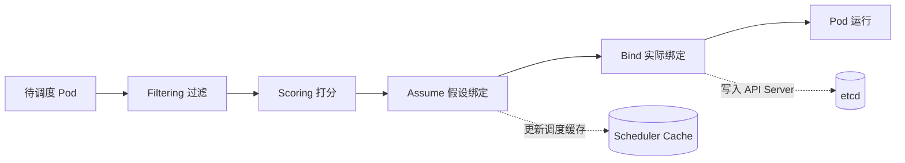

#kubernetes #scheduler

相关笔记：[[kubernetes-basics]] | [[k8s-interview]] | [[informer]]

## Scheduler 调度流程概述

在 Kubernetes 中，`kube-scheduler` 是负责将 Pod 调度到适当节点上的组件。调度过程分为多个阶段，其中 `assume` 和 `bind` 是两个关键阶段。

### 详细流程

1. **过滤（Filtering）**: 通过节点选择器、亲和性、资源限制等策略过滤不符合条件的节点
2. **打分（Scoring）**: 根据资源使用情况、节点负载等因素，为候选节点评分，选出最优节点
3. **假设（Assume）**: 调度器选择一个候选节点，假设将 Pod 安排到该节点上（更新缓存，不写 etcd）
4. **绑定（Bind）**: 最终将 Pod 与选定节点绑定，写入 API Server 和 etcd

## 为什么要设计 Assume 阶段

Assume 阶段的设计主要是为了提高调度的效率和灵活性：

### 1. 提前锁定节点信息
- 在 assume 阶段，调度器假设将 Pod 绑定到某个节点，但并不立即执行绑定操作
- 避免由于竞争条件或不确定性导致在 bind 阶段发生冲突
- 确保在后续操作中，如果某个节点被多次选中，仍然能保持一致性

### 2. 允许预先执行检查
- 假设阶段会将节点状态、资源使用情况进行缓存或记录，为后续 bind 阶段提供更快的执行效率
- 如果在 assume 阶段发现问题（比如节点资源不够），调度器可以及时放弃该节点

### 3. 异步与并发优化
- 在 assume 阶段，调度器可以通过并行操作提高调度效率
- 提前锁定节点，进行 assume 操作，在等待异步事件时不阻塞调度过程
- 与 bind 阶段的同步操作相比，提供了更高的并发度和响应能力

### 4. 增加调度灵活性
- assume 阶段允许调度器在多个候选节点中进行选择和假设
- 即使最终绑定操作失败或需要重新调度，调度器可以根据 assume 阶段的信息重新评估其他节点

### 5. 避免资源过度竞争
- 如果没有 assume 阶段，多个调度器可能在 bind 阶段同时将 Pod 绑定到同一个节点
- assume 通过锁定节点状态，避免了这种竞争情况

## Assume 与 Bind 对比

| 特性 | Assume | Bind |
| --- | --- | --- |
| 作用范围 | Scheduler 本地缓存 | API Server / etcd |
| 是否持久化 | 否 | 是 |
| 是否阻塞 | 否（异步） | 是（同步写入） |
| 失败处理 | 回滚缓存，重新调度 | 返回错误，触发重试 |

## 总结

Assume 阶段主要用于在调度过程中进行临时假设和预判，它是为了确保调度过程的高效、稳定，并避免因资源竞争和状态不一致而导致的问题。在调度器做出最终决定（即 bind）之前，assume 提供了一种过渡机制，允许调度器提前锁定和评估节点，并为后续的绑定操作做好准备。
