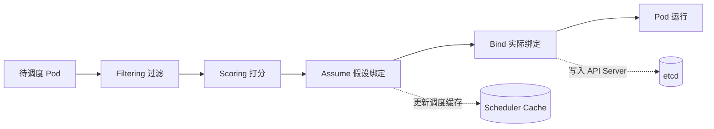

#kubernetes #scheduler

相关笔记：[[kubernetes-basics]] | [[k8s-interview]] | [[informer]]

## Scheduler 调度流程概述

在 Kubernetes 中，`kube-scheduler` 是负责将 Pod 调度到适当节点上的组件。调度过程分为多个阶段，其中 `assume` 和 `bind` 是两个关键阶段。

### 详细流程

1. **过滤（Filtering）**: 通过节点选择器、亲和性、资源限制等策略过滤不符合条件的节点
2. **打分（Scoring）**: 根据资源使用情况、节点负载等因素，为候选节点评分，选出最优节点
3. **假设（Assume）**: 调度器选择一个候选节点，假设将 Pod 安排到该节点上（更新缓存，不写 etcd）
4. **绑定（Bind）**: 最终将 Pod 与选定节点绑定，写入 API Server 和 etcd

## 为什么要设计 Assume 阶段

Assume 阶段的设计主要是为了提高调度的效率和灵活性：

### 1. 提前锁定节点信息
- 在 assume 阶段，调度器假设将 Pod 绑定到某个节点，但并不立即执行绑定操作
- 避免由于竞争条件或不确定性导致在 bind 阶段发生冲突
- 确保在后续操作中，如果某个节点被多次选中，仍然能保持一致性

### 2. 允许预先执行检查
- 假设阶段会将节点状态、资源使用情况进行缓存或记录，为后续 bind 阶段提供更快的执行效率
- 如果在 assume 阶段发现问题（比如节点资源不够），调度器可以及时放弃该节点

### 3. 异步与并发优化
- 在 assume 阶段，调度器可以通过并行操作提高调度效率
- 提前锁定节点，进行 assume 操作，在等待异步事件时不阻塞调度过程
- 与 bind 阶段的同步操作相比，提供了更高的并发度和响应能力

### 4. 增加调度灵活性
- assume 阶段允许调度器在多个候选节点中进行选择和假设
- 即使最终绑定操作失败或需要重新调度，调度器可以根据 assume 阶段的信息重新评估其他节点

### 5. 避免资源过度竞争
- 如果没有 assume 阶段，多个调度器可能在 bind 阶段同时将 Pod 绑定到同一个节点
- assume 通过锁定节点状态，避免了这种竞争情况

## Assume 与 Bind 对比

| 特性 | Assume | Bind |
| --- | --- | --- |
| 作用范围 | Scheduler 本地缓存 | API Server / etcd |
| 是否持久化 | 否 | 是 |
| 是否阻塞 | 否（异步） | 是（同步写入） |
| 失败处理 | 回滚缓存，重新调度 | 返回错误，触发重试 |

## 总结

Assume 阶段主要用于在调度过程中进行临时假设和预判，它是为了确保调度过程的高效、稳定，并避免因资源竞争和状态不一致而导致的问题。在调度器做出最终决定（即 bind）之前，assume 提供了一种过渡机制，允许调度器提前锁定和评估节点，并为后续的绑定操作做好准备。

## 面试要点

### 高频问题

**Q: kube-scheduler 的调度周期分为哪几个阶段？assume 和 bind 处于哪个环节？**
A: 整体分为 Scheduling Cycle（同步、串行）和 Binding Cycle（异步、并发）两大周期。Scheduling Cycle 依次经过 PreFilter/Filter（过滤）→（找不到节点时）PostFilter（抢占）→ PreScore/Score（打分）→ Reserve（预留）→ **assume（更新缓存）**→ Permit；Binding Cycle 包含 WaitOnPermit → PreBind → Bind → PostBind，由 goroutine 异步执行真正的 `bind`。注意 assume 紧跟在 Reserve 之后、Permit 之前，是 Scheduling Cycle 的尾声步骤而非最后一步；bind 是 Binding Cycle 的核心步骤。

**Q: 为什么要设计 assume 阶段？不能调度完直接 bind 吗？**
A: bind 是对 API Server 的同步网络写入，耗时可能达几十毫秒。如果串行等待 bind 返回才调度下一个 Pod，吞吐量会很低。assume 先在本地 SchedulerCache 中假定 Pod 已落到目标节点（更新该节点的资源占用），让调度主循环立即处理下一个 Pod，而真正的 bind 异步进行，从而解耦调度决策与持久化、提升并发度。

**Q: assume 之后 bind 失败了怎么办？缓存状态如何保证一致？**
A: bind 失败会触发 `forgetPod`（`Cache.ForgetPod`），把之前 assume 写入缓存的临时状态回滚（释放该节点上为此 Pod 预占的资源），同时调用 Reserve 插件的 `Unreserve` 钩子，并把 Pod 重新放回调度队列等待重新调度。此外 SchedulerCache 里每个 assumed Pod 都带 TTL（默认 30s），若长时间未收到绑定成功事件确认，过期清理协程（`cleanupAssumedPods`）也会把它 forget 掉，避免缓存里堆积幽灵 Pod 占用资源。

**Q: assume 阶段更新的是什么？真的写 etcd 吗？**
A: assume 只更新 scheduler 进程内存中的 SchedulerCache（把 Pod 的 `Spec.NodeName` 设为目标节点并计入该节点的已分配资源），不写 API Server 也不写 etcd。真正的持久化在 bind 阶段：scheduler 默认创建一个 `Binding` 子资源对象发给 API Server，由 API Server 把 nodeName 写入 Pod 并落 etcd，最终目标节点的 kubelet watch 到该 Pod 后拉起它。

**Q: 既然 assume 只写本地缓存，多个并发的 binding 周期会不会把同一节点资源算重？**
A: 不会。Scheduling Cycle 本身是串行的，assume 在串行阶段就已经把资源预占记入缓存；后续的 Binding Cycle 是异步并发的，但它不再改变资源账本。所以下一个 Pod 在 Filter/Score 时看到的节点剩余资源已经扣减了前面 assume 的 Pod，从而避免了对同一节点的资源超卖。

**Q: assume 的资源占用什么时候才会被 etcd 中的真实状态确认？**
A: bind 成功后 API Server 会产生带 nodeName 的 Pod 更新事件，scheduler 的 Informer 监听到后调用 `Cache.AddPod`，把缓存里这个 assumed Pod 转为已确认态（从 `assumedPods` 集合移除）。在确认之前它处于"假定态"，并带有 TTL 兜底（`durationToExpireAssumedPod`，默认 30s，可配置），超时仍未确认会被清理回滚——这道兜底就是为了应对 bind 卡住或 scheduler 重启等异常。

**Q: assume 阶段和 Reserve 插件、抢占（Preemption）有什么关系？**
A: Reserve 插件在 assume 之前执行，用于为 Pod 预留特定资源（如 VolumeBinding 把 PVC/PV 绑定关系记入缓存），并提供 Unreserve 回滚钩子；若 Permit 被 deny 或 bind 失败，会调用 Unreserve 释放预留。抢占发生在 PostFilter（Filter 找不到可用节点时），它在抢占者 Pod 上写 `NominatedNodeName` 标记其提名节点，并驱逐低优先级 victim Pod；这与 assume 是不同环节，但都依赖缓存维护一致性。

### 面试加分点

- 能点出 assume/bind 对应的代码路径：`Cache.AssumePod`（内部 `addPod(pod, assumePod=true)`，立即扣减 NodeInfo 的 `Requested`）和异步 `runBindingCycle` 中的 `sched.bind`，并说明 bind 默认通过创建 `Binding` 子资源完成，Pod 真正运行还要等 kubelet watch 到 nodeName。
- 理解 assume 是"乐观调度"的体现：先假定成功、异步落库、失败回滚，本质是用本地缓存换吞吐，与数据库乐观锁/乐观并发控制思路一致。
- 能讲清缓存过期机制（`assumedPods` 集合 + `durationToExpireAssumedPod`，默认 30s）的必要性：防止 bind 卡住或 scheduler 重启时缓存里的假定 Pod 永久占用节点资源，导致后续 Pod 调度不上来。注意别把它和 Permit 插件的 wait timeout 混为一谈。
- 知道 Scheduling Cycle 串行、Binding Cycle 并发的设计取舍：串行保证资源账本一致与无超卖，并发的 bind 把慢速网络 I/O 移出关键路径，这是 scheduler 高吞吐的关键。
- 能延伸到多调度器/调度器扩展场景：自定义 scheduler 通过 schedulerName 区分，多个调度器若都管理同一节点，assume 只在各自缓存中生效，真正的冲突仍由 API Server 写 nodeName 时的乐观并发（resourceVersion）兜底。
- 了解 Framework 扩展点全景（QueueSort/PreFilter/Filter/PostFilter/PreScore/Score/Reserve/Permit/PreBind/Bind/PostBind），并能指出 assume 卡在 Reserve 与 Permit 之间、横跨 Scheduling 与 Binding 两周期交界处的关键位置。
