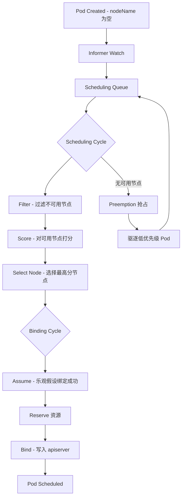
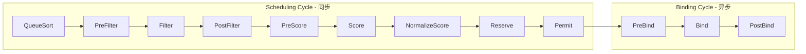
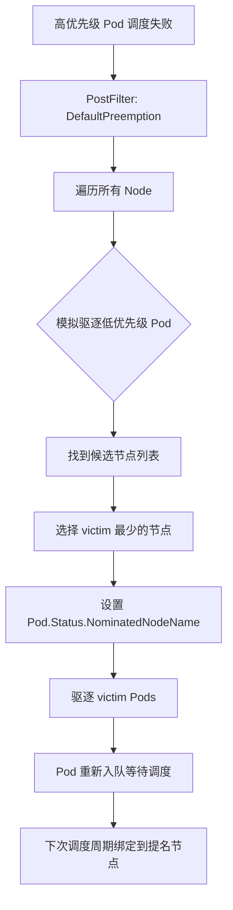

#kubernetes #scheduler

相关笔记：[[kubernetes-basics]] | [[scheduler-assume]] | [[k8s-interview]]

# Kube-Scheduler 深度解析

## 1. kube-scheduler 整体架构与工作流程

kube-scheduler 是 Kubernetes control plane 的核心组件之一，负责将未调度的 Pod（即 `spec.nodeName` 为空的 Pod）分配到合适的 Node 上。

### 核心工作流程

1. **Watch**：通过 Informer 机制监听 apiserver，获取未调度的 Pod（放入 scheduling queue）
2. **Schedule**：从队列中取出 Pod，执行调度周期（scheduling cycle）
3. **Bind**：异步执行绑定周期（binding cycle），将 Pod 绑定到选中的 Node



### Scheduling Queue 的三级队列

- **activeQ**：待调度的 Pod 队列（基于优先级的 heap）
- **backoffQ**：调度失败后退避的 Pod 队列
- **unschedulablePods**：当前无法调度的 Pod 集合，等待集群状态变化后重新入队

### 关键机制：Assume

调度器在 Bind 操作（写 apiserver）之前，先在本地 cache 中 **assume**（乐观假设）该 Pod 已经绑定成功。这样后续 Pod 的调度可以立即基于最新状态进行，无需等待 apiserver 的确认。如果 Bind 失败，cache 会通过 Informer 的事件进行修正。

## 2. Scheduling Framework（调度框架）

从 Kubernetes v1.19 开始，Scheduling Framework 成为调度器的核心架构。它定义了一系列 **扩展点（Extension Points）**，允许以 plugin 形式实现调度逻辑。



### 各扩展点详解

| 扩展点 | 阶段 | 说明 |
|--------|------|------|
| **QueueSort** | 排队 | 控制 Pod 在 scheduling queue 中的排序方式，同时只能启用一个 QueueSort plugin |
| **PreFilter** | 预过滤 | 在 Filter 之前执行，用于预处理 Pod 信息或检查前置条件，失败则 Pod 标记为 Unschedulable |
| **Filter** | 过滤 | 等价于旧版 Predicates，过滤掉不满足 Pod 要求的 Node |
| **PostFilter** | 后过滤 | 当 Filter 后无可用节点时执行，通常用于 Preemption（抢占） |
| **PreScore** | 预打分 | 在 Score 之前执行，用于预处理共享数据 |
| **Score** | 打分 | 等价于旧版 Priorities，对通过 Filter 的 Node 打分 |
| **NormalizeScore** | 归一化 | 将 Score 结果归一化到 [0, 100] 区间 |
| **Reserve** | 预留 | 为 Pod 预留资源（如 volume），有对应的 Unreserve 回调用于失败回滚 |
| **Permit** | 准入 | 最终决定是否允许绑定：approve / deny / wait（可实现 Gang Scheduling） |
| **PreBind** | 预绑定 | 绑定前的准备工作，如挂载 volume |
| **Bind** | 绑定 | 执行实际的 Pod-to-Node 绑定，调用 apiserver |
| **PostBind** | 后绑定 | 绑定成功后的清理/通知操作 |

### 内置 Plugin 示例

```
NodeResourcesFit      → Filter + Score （资源是否满足）
NodeAffinity          → Filter + Score （节点亲和性）
PodTopologySpread     → PreFilter + Filter + PreScore + Score （拓扑分散约束）
TaintToleration       → Filter + Score （污点容忍）
InterPodAffinity      → PreFilter + Filter + PreScore + Score （Pod 间亲和/反亲和）
VolumeBinding         → PreFilter + Filter + Reserve + PreBind （存储卷绑定）
```

## 3. 调度算法：Predicates 和 Priorities

虽然新版使用 Scheduling Framework，但核心逻辑仍沿用 Predicates（Filter）和 Priorities（Score）的思路。

### Filter（Predicates）核心策略

| 策略 | 说明 |
|------|------|
| **NodeResourcesFit** | 检查 Node 剩余资源（CPU、Memory、ephemeral-storage）是否满足 Pod 的 requests |
| **NodePorts** | 检查 Pod 请求的 hostPort 在 Node 上是否已被占用 |
| **NodeAffinity** | 检查 Node 是否匹配 Pod 的 nodeAffinity 规则 |
| **TaintToleration** | 检查 Pod 是否容忍 Node 的所有 NoSchedule Taints |
| **PodTopologySpread** | 检查 Pod 调度后是否违反 topology spread constraints |
| **InterPodAffinity** | 检查与已有 Pod 的亲和/反亲和规则 |
| **VolumeZone** | 检查 PV 的 zone 约束是否匹配 Node 所在的 zone |

### Score（Priorities）核心策略

| 策略 | 说明 |
|------|------|
| **LeastAllocated** | 倾向于资源使用率低的 Node（默认策略，spread 模式） |
| **MostAllocated** | 倾向于资源使用率高的 Node（pack 模式，适合节约成本） |
| **RequestedToCapacityRatio** | 基于自定义函数计算资源利用率得分 |
| **NodeAffinity** | 对 preferredDuringScheduling 的 Node 加分 |
| **TaintToleration** | 容忍的 Taint 越少得分越高 |
| **InterPodAffinity** | 满足 preferred Pod affinity 的 Node 加分 |
| **PodTopologySpread** | 使 Pod 在拓扑域中分布更均匀的 Node 加分 |
| **ImageLocality** | Node 上已有 Pod 所需镜像的，加分（减少拉取时间） |

### NodeResourcesFit 三种策略配置

```yaml
apiVersion: kubescheduler.config.k8s.io/v1
kind: KubeSchedulerConfiguration
profiles:
  - schedulerName: default-scheduler
    pluginConfig:
      - name: NodeResourcesFit
        args:
          scoringStrategy:
            type: LeastAllocated  # 或 MostAllocated / RequestedToCapacityRatio
            resources:
              - name: cpu
                weight: 1
              - name: memory
                weight: 1
```

## 4. Priority 和 Preemption（优先级与抢占）

### PriorityClass

Pod 可以通过 `priorityClassName` 指定优先级。优先级高的 Pod 在调度队列中排在前面，且可以抢占低优先级 Pod。

```yaml
apiVersion: scheduling.k8s.io/v1
kind: PriorityClass
metadata:
  name: high-priority
value: 1000000
globalDefault: false
preemptionPolicy: PreemptLowerPriority  # 或 Never
description: "用于关键业务 Pod"
---
apiVersion: v1
kind: Pod
metadata:
  name: critical-app
spec:
  priorityClassName: high-priority
  containers:
    - name: app
      image: nginx
      resources:
        requests:
          cpu: "2"
          memory: "4Gi"
```

### Preemption 抢占流程

当高优先级 Pod 无法调度时（所有节点 Filter 失败），进入 PostFilter 阶段执行抢占：



### 抢占中的关键细节

- **NominatedNode**：被抢占的 Pod 不会立即绑定，而是设置 `nominatedNodeName`，等 victim Pod 优雅退出后再调度
- **PDB 保护**：抢占会尽量避免违反 PodDisruptionBudget
- **同优先级不抢占**：默认只抢占严格低于自身优先级的 Pod
- **preemptionPolicy: Never**：设置后该 Pod 不会触发抢占，只在队列中排在前面

## 5. Node Affinity / Pod Affinity / Taints & Tolerations

### Node Affinity（节点亲和性）

```yaml
apiVersion: v1
kind: Pod
metadata:
  name: node-affinity-demo
spec:
  affinity:
    nodeAffinity:
      # 硬性要求：必须满足
      requiredDuringSchedulingIgnoredDuringExecution:
        nodeSelectorTerms:
          - matchExpressions:
              - key: topology.kubernetes.io/zone
                operator: In
                values:
                  - us-east-1a
                  - us-east-1b
      # 软性偏好：尽量满足
      preferredDuringSchedulingIgnoredDuringExecution:
        - weight: 80
          preference:
            matchExpressions:
              - key: node-type
                operator: In
                values:
                  - high-memory
  containers:
    - name: app
      image: nginx
```

**operator 支持的值**：`In`, `NotIn`, `Exists`, `DoesNotExist`, `Gt`, `Lt`

### Pod Affinity / Anti-Affinity（Pod 间亲和/反亲和）

```yaml
apiVersion: v1
kind: Pod
metadata:
  name: pod-affinity-demo
spec:
  affinity:
    # Pod 亲和：希望和 cache Pod 在同一个 zone
    podAffinity:
      requiredDuringSchedulingIgnoredDuringExecution:
        - labelSelector:
            matchExpressions:
              - key: app
                operator: In
                values:
                  - cache
          topologyKey: topology.kubernetes.io/zone
    # Pod 反亲和：不要和同 app 的 Pod 在同一个 Node
    podAntiAffinity:
      preferredDuringSchedulingIgnoredDuringExecution:
        - weight: 100
          podAffinityTerm:
            labelSelector:
              matchExpressions:
                - key: app
                  operator: In
                  values:
                    - web-server
            topologyKey: kubernetes.io/hostname
  containers:
    - name: app
      image: nginx
```

**注意事项**：
- `topologyKey` 定义了亲和/反亲和的拓扑域范围（hostname = 节点级别，zone = 可用区级别）
- Pod anti-affinity 的 `requiredDuringScheduling` 要求 `topologyKey` 必须是 `kubernetes.io/hostname`（默认 admission 限制）
- Pod affinity/anti-affinity 在大规模集群中性能开销较大（需要遍历已有 Pod）

### Taints & Tolerations（污点与容忍）

```yaml
# 给 Node 添加 Taint
# kubectl taint nodes node1 key=value:NoSchedule

apiVersion: v1
kind: Pod
metadata:
  name: toleration-demo
spec:
  tolerations:
    # 精确匹配
    - key: "dedicated"
      operator: "Equal"
      value: "gpu"
      effect: "NoSchedule"
    # 存在匹配（不检查 value）
    - key: "special-node"
      operator: "Exists"
      effect: "NoExecute"
      tolerationSeconds: 3600  # 容忍 1 小时后驱逐
  containers:
    - name: app
      image: nvidia/cuda:11.0-base
```

**三种 effect**：
| Effect | 调度阶段 | 已运行 Pod |
|--------|----------|-----------|
| `NoSchedule` | 不允许调度 | 不影响 |
| `PreferNoSchedule` | 尽量不调度（软性） | 不影响 |
| `NoExecute` | 不允许调度 | 驱逐不容忍的 Pod |

**内置 Taints**（由 Node Controller 自动添加）：
- `node.kubernetes.io/not-ready` — Node 状态为 NotReady
- `node.kubernetes.io/unreachable` — Node 不可达
- `node.kubernetes.io/memory-pressure` — 内存压力
- `node.kubernetes.io/disk-pressure` — 磁盘压力
- `node.kubernetes.io/unschedulable` — Node 被 cordon

## 6. Topology Spread Constraints（拓扑分散约束）

Topology Spread Constraints 用于控制 Pod 在不同拓扑域（zone、node、rack 等）之间的分布均匀性，比 Pod anti-affinity 更灵活。

```yaml
apiVersion: apps/v1
kind: Deployment
metadata:
  name: web-server
spec:
  replicas: 6
  selector:
    matchLabels:
      app: web
  template:
    metadata:
      labels:
        app: web
    spec:
      topologySpreadConstraints:
        # 约束1：跨 zone 分散
        - maxSkew: 1
          topologyKey: topology.kubernetes.io/zone
          whenUnsatisfiable: DoNotSchedule  # 硬性约束
          labelSelector:
            matchLabels:
              app: web
        # 约束2：跨 node 分散
        - maxSkew: 1
          topologyKey: kubernetes.io/hostname
          whenUnsatisfiable: ScheduleAnyway  # 软性约束
          labelSelector:
            matchLabels:
              app: web
      containers:
        - name: web
          image: nginx
```

### 关键参数

- **maxSkew**：允许的最大不均匀度。值为 1 表示各拓扑域的 Pod 数量差不能超过 1
- **topologyKey**：按哪个 Node label 划分拓扑域
- **whenUnsatisfiable**：
  - `DoNotSchedule` — 不满足则不调度（硬性）
  - `ScheduleAnyway` — 尽量满足（软性，Score 阶段影响打分）
- **matchLabelKeys**（v1.27+）：自动基于 Pod label 值匹配，适配 rolling update 场景
- **nodeAffinityPolicy** / **nodeTaintsPolicy**（v1.26+）：控制是否将被 affinity/taint 排除的节点纳入 skew 计算

### 集群级别默认约束

可以通过 KubeSchedulerConfiguration 设置全局默认 topology spread constraints：

```yaml
apiVersion: kubescheduler.config.k8s.io/v1
kind: KubeSchedulerConfiguration
profiles:
  - schedulerName: default-scheduler
    pluginConfig:
      - name: PodTopologySpread
        args:
          defaultConstraints:
            - maxSkew: 3
              topologyKey: topology.kubernetes.io/zone
              whenUnsatisfiable: ScheduleAnyway
          defaultingType: List  # 或 System
```

## 7. 自定义调度器和 Scheduler Extender

### 方式一：多调度器部署

Kubernetes 支持同时运行多个调度器。Pod 通过 `schedulerName` 指定使用哪个调度器：

```yaml
apiVersion: v1
kind: Pod
metadata:
  name: custom-scheduled-pod
spec:
  schedulerName: my-custom-scheduler  # 默认为 default-scheduler
  containers:
    - name: app
      image: nginx
```

自定义调度器可以基于 `k8s.io/kubernetes/pkg/scheduler` 包构建，注册自定义 plugin：

```go
package main

import (
    "os"
    "k8s.io/kubernetes/cmd/kube-scheduler/app"
    "k8s.io/kubernetes/pkg/scheduler/framework"
)

type MyPlugin struct{}

func (p *MyPlugin) Name() string { return "MyPlugin" }

func (p *MyPlugin) Filter(ctx context.Context, state *framework.CycleState, 
    pod *v1.Pod, nodeInfo *framework.NodeInfo) *framework.Status {
    // 自定义过滤逻辑
    if nodeInfo.Node().Labels["gpu"] != "true" && needsGPU(pod) {
        return framework.NewStatus(framework.Unschedulable, "node has no GPU")
    }
    return framework.NewStatus(framework.Success, "")
}

func main() {
    command := app.NewSchedulerCommand(
        app.WithPlugin("MyPlugin", func(obj runtime.Object, fh framework.Handle) (framework.Plugin, error) {
            return &MyPlugin{}, nil
        }),
    )
    if err := command.Execute(); err != nil {
        os.Exit(1)
    }
}
```

### 方式二：Scheduler Extender（Webhook 扩展）

Scheduler Extender 通过 HTTP webhook 的方式扩展调度逻辑，无需修改调度器代码。适合不想重新编译调度器的场景。

```yaml
apiVersion: kubescheduler.config.k8s.io/v1
kind: KubeSchedulerConfiguration
extenders:
  - urlPrefix: "http://my-extender.kube-system:8888"
    filterVerb: "filter"
    prioritizeVerb: "prioritize"
    bindVerb: "bind"          # 可选，接管 bind 操作
    weight: 5
    enableHTTPS: false
    nodeCacheCapable: true    # extender 是否能处理 node 信息缓存
    managedResources:
      - name: "example.com/gpu"
        ignoredByScheduler: true  # 该资源由 extender 管理
    ignorable: true           # extender 不可用时是否跳过
```

**Extender vs Framework Plugin 对比**：

| 维度 | Scheduler Extender | Framework Plugin |
|------|-------------------|-----------------|
| 扩展方式 | HTTP webhook | 进程内 Go 插件 |
| 性能 | 较差（网络调用） | 优秀（进程内） |
| 扩展点 | 仅 Filter / Score / Bind | 所有扩展点 |
| 部署难度 | 简单（独立服务） | 需要编译自定义调度器 |
| 适用场景 | 轻量扩展、遗留系统对接 | 高性能、深度定制 |

## 8. 调度性能优化：percentageOfNodesToScore

在大规模集群（数千节点）中，调度器如果对所有节点执行 Score 操作，会导致调度延迟过高。

### percentageOfNodesToScore

该参数控制 Score 阶段参与打分的节点比例。调度器在 Filter 阶段找到足够数量的可用节点后即停止 Filter，然后只对这些节点进行 Score。

```yaml
apiVersion: kubescheduler.config.k8s.io/v1
kind: KubeSchedulerConfiguration
percentageOfNodesToScore: 50  # 默认值根据集群规模动态计算
```

**默认行为**（未显式设置时）：
- 节点数 <= 100：Score 全部节点（100%）
- 节点数 > 100：`max(50 - numNodes/125, 5)%`，最低 5%
- 例如：5000 节点集群 → `max(50 - 5000/125, 5)` = 10%

**注意**：该参数只影响 Score 阶段。Filter 阶段仍会检查所有节点（但找到足够数量后会提前停止）。

### 其他性能优化手段

- **Parallelism**：调度器支持并行调度多个 Pod（通过 `parallelism` 配置）
- **Node 排序优化**：调度器将节点按 zone 分组，每次 Filter 从不同 zone 开始轮询，确保候选节点分布均匀
- **Scheduling Queue 优化**：只有集群状态发生相关变化时，unschedulable Pod 才重新入队（通过 `QueueingHint` 机制判断）

## 面试要点

### 高频问题

**Q: kube-scheduler 的调度流程？**
> 从 scheduling queue 取出 Pod → Filter（过滤不可用节点）→ Score（对可用节点打分）→ 选最高分节点 → Assume（乐观写入 cache）→ Bind（写 apiserver）。整个过程分为同步的 scheduling cycle 和异步的 binding cycle。

**Q: Scheduling Framework 有哪些扩展点？**
> QueueSort → PreFilter → Filter → PostFilter → PreScore → Score → NormalizeScore → Reserve → Permit → PreBind → Bind → PostBind。Scheduling cycle 是同步的，Binding cycle 是异步的。

**Q: Preemption 是怎么工作的？**
> 高优先级 Pod Filter 失败后，PostFilter 阶段执行 DefaultPreemption plugin。模拟在每个节点上驱逐低优先级 Pod，找到代价最小的节点，设置 nominatedNodeName，发起 victim Pod 的驱逐请求。被抢占 Pod 优雅退出后，调度器在下一轮将 Pod 调度到该节点。

**Q: Node Affinity 和 Taints/Tolerations 的区别？**
> Node Affinity 是 Pod 主动选择 Node（"我想去哪"），Taints/Tolerations 是 Node 主动排斥 Pod（"我不欢迎谁"）。两者互补使用：Taint 让 Node 拒绝普通 Pod，Toleration 让特定 Pod 能够调度上去。

**Q: Pod Affinity 和 Topology Spread Constraints 的区别？**
> Pod Anti-Affinity 只能表达"不要和某个 Pod 在一起"的二元关系。Topology Spread Constraints 能表达"在各拓扑域之间均匀分布"的多域平衡关系，控制粒度更细（通过 maxSkew），且性能更好。

**Q: 如何扩展调度器？**
> 三种方式：1）编写 Scheduling Framework Plugin（推荐，性能最好）；2）Scheduler Extender（HTTP webhook，无需编译）；3）部署多个调度器，Pod 通过 schedulerName 选择。

**Q: percentageOfNodesToScore 的作用？**
> 控制 Score 阶段参与打分的节点比例。大集群中避免对所有节点打分导致延迟过高。默认值根据集群规模自动计算，100 节点以下全量打分，超过后按公式递减，最低 5%。

### 经验性问题

- 生产环境中通常用 `podAntiAffinity` + `topologySpreadConstraints` 配合确保服务高可用
- `PreferNoSchedule` 在 GPU 节点等特殊资源上使用，避免普通 Pod 抢占贵资源
- Scheduler Extender 有网络延迟和单点问题，生产中推荐使用 Framework Plugin
- 调度器的 Assume 机制是性能关键——它允许调度器不等 apiserver 确认就继续处理下一个 Pod
