#kubernetes #csi #demo

相关笔记：[[csi-source]] | [[csi]] | [[k8s-development-roadmap]]

## 概述

本笔记是 `cloud-native/kubernetes/demos/csi-hostpath/` 这个 demo 的**走读说明**：用最少代码实现一个 hostPath 风格的 CSI driver，覆盖 Identity / Node / Controller 三个 service，能在 kind 集群里完成"PVC → dynamic provisioning → bind mount → 容器读写"的端到端链路。读完这篇你会知道：(1) CSI driver 的 gRPC server 怎么起；(2) sidecar 与 driver 怎么通过 emptyDir 共享 socket；(3) CSIDriver / StorageClass / DaemonSet 各自承担什么角色；(4) 真实生产驱动相对本骨架多做了哪些事。

源码走读详见 [[csi-source]]，本 demo 是它的**配套实践**。

## 一、目录结构

```
demos/csi-hostpath/
├── main.go              gRPC server bootstrap + 信号处理
├── identity.go          Identity service
├── node.go              Node service
├── controller.go        Controller service (stub)
├── csidriver.yaml       CSIDriver 对象
├── storageclass.yaml    StorageClass
├── daemonset.yaml       Controller StatefulSet + Node DaemonSet + RBAC
├── pvc.yaml             测试用 PVC + Pod
├── go.mod
└── README.md            详细使用文档
```

## 二、核心调用链

```mermaid
flowchart LR
    PVC[用户 kubectl apply pvc.yaml]
        --> Prov[external-provisioner sidecar<br/>watch PVC]
        --> Create[driver.CreateVolume<br/>mkdir dataRoot/<volId>]
        --> PV[external-provisioner 创建 PV]
    PV --> Bound[PVC Bound]
    Bound --> PodApply[kubectl apply pod.yaml]
    PodApply --> Sched[kube-scheduler 选节点]
    Sched --> Kubelet[kubelet 在节点上准备挂载]
    Kubelet --> Publish[driver.NodePublishVolume<br/>unix.Mount source -> targetPath<br/>MS_BIND]
    Publish --> Mount[Pod 容器看到 /data]
```



CSIDriver.spec.attachRequired=false 让整条链路跳过了 attach 阶段（不创建 VolumeAttachment 对象，也不需要 external-attacher）—— hostPath 卷源就在节点本地，没有可 attach 的远端块设备。

## 三、main.go 入口走读

```go
lis, _ := net.Listen("unix", "/csi/csi.sock")
server := grpc.NewServer()
csi.RegisterIdentityServer(server, newIdentityServer())
csi.RegisterNodeServer(server, newNodeServer(*nodeID, *dataRoot))
csi.RegisterControllerServer(server, newControllerServer(*dataRoot))
server.Serve(lis)
```

关键点：

1. **永远 unix socket 不走 TCP**。emptyDir 把 socket 文件夹分享给 sidecar，零配置发现，且天然不会跨节点暴露。
2. **同一份二进制里同时注册 Identity + Controller + Node**。生产 driver 也常用这种"all-in-one binary + 不同启动参数区分模式"的设计，例如加 `--mode=controller` / `--mode=node` 分支决定要不要注册 Controller service。
3. **优雅停止**：监听 `SIGTERM` 并调 `srv.GracefulStop()`，给进行中的 NodePublishVolume 留时间完成——滚动更新时这一步能避免挂载抖动。

## 四、Identity service：自我描述

```go
func (s *identityServer) GetPluginInfo(...) (*csi.GetPluginInfoResponse, error) {
    return &csi.GetPluginInfoResponse{
        Name:          "learning-notes.csi.k8s.io",  // 全局唯一 driverName
        VendorVersion: "0.1.0",
    }, nil
}
```

`Name` 必须与 `CSIDriver.metadata.name`、`StorageClass.provisioner`、`VolumeAttachment.spec.attacher` 完全一致——任何一处对不上 sidecar 都看不到事件。

`Probe` 返回 `Ready=true` 让 livenessprobe sidecar 满意；`GetPluginCapabilities` 声明 `CONTROLLER_SERVICE` 让 K8s 知道可以调 Controller RPC。

## 五、Node service：bind mount 的最小实现

```go
func (s *nodeServer) NodePublishVolume(_ context.Context, req *csi.NodePublishVolumeRequest) (*csi.NodePublishVolumeResponse, error) {
    source := filepath.Join(s.dataRoot, req.GetVolumeId())
    os.MkdirAll(source, 0750)
    os.MkdirAll(req.GetTargetPath(), 0750)

    flags := uintptr(unix.MS_BIND)
    if req.GetReadonly() { flags |= unix.MS_RDONLY }
    err := unix.Mount(source, req.GetTargetPath(), "", flags, "")
    if err == unix.EBUSY {
        return &csi.NodePublishVolumeResponse{}, nil // 幂等：已挂载
    }
    return &csi.NodePublishVolumeResponse{}, err
}
```

值得拎出来讲的细节：

1. **`os.MkdirAll(source)` 在 `NodePublishVolume` 里也做一次**——CreateVolume 已经创建过这个目录，但生产代码常常防御性地再做一次，避免人手清理 dataRoot 后 driver 崩。MkdirAll 已存在视为成功，天然幂等。
2. **`MS_BIND` 是 Linux 特有的 mount flag**——把已经存在的目录/文件再"挂"到另一个路径，等价于 `mount --bind`。这是 CSI driver 在用户态实现卷映射最常用的手法。
3. **`EBUSY` 错误吃掉**：driver Pod 重启时 kubelet 会重新调一次 NodePublishVolume；如果 targetPath 还挂着，`Mount` 会返回 `EBUSY`，认作幂等成功避免误报错。**生产驱动会读 /proc/mounts 严格判断**，本 demo 简化。

`NodeUnpublishVolume` 对称：`unix.Unmount` + `os.Remove`，错误吞掉 `EINVAL`（未挂载）和 `ENOENT`（目录已不在）。

```go
func (s *nodeServer) NodeGetInfo(...) (*csi.NodeGetInfoResponse, error) {
    return &csi.NodeGetInfoResponse{NodeId: s.nodeID}, nil
}
```

`NodeGetInfo` 在 driver 注册阶段被 kubelet 调一次（不是被业务流量调）。返回的 NodeId 是"驱动眼中的节点标识"——hostPath driver 用 hostname 就够了；EBS driver 会返回 EC2 `instance-id`，因为它要在 ControllerPublishVolume 里把 EBS volume attach 到那个 instance。

## 六、Controller service：幂等的关键

```go
func (s *controllerServer) CreateVolume(_ context.Context, req *csi.CreateVolumeRequest) (*csi.CreateVolumeResponse, error) {
    volumeID := hashVolumeID(req.GetName())  // 同一 name -> 同一 id
    os.MkdirAll(filepath.Join(s.dataRoot, volumeID), 0750)
    return &csi.CreateVolumeResponse{
        Volume: &csi.Volume{
            VolumeId:      volumeID,
            CapacityBytes: req.GetCapacityRange().GetRequiredBytes(),
        },
    }, nil
}
```

**幂等性是 CSI spec 的强制契约**。external-provisioner 用 PVC UID 算出稳定的 `req.Name`，重试时会带同一个 name 过来——如果 driver 每次都算出不同的 volumeId，重试就会在后端创建多个孤儿卷。本 demo 用 `sha1(name)[:8]` 算 volumeId，自然幂等；`os.MkdirAll` 也幂等。

EBS driver 的做法：调 `aws.CreateVolume` 时打 tag `kubernetes.io/csi/volume-name=<req.Name>`，重试前先 `DescribeVolumes` 按 tag 查重——存在就复用，不存在才真创建。

## 七、部署清单要点

### CSIDriver 对象

```yaml
spec:
  attachRequired: false        # 跳过 attach 阶段
  podInfoOnMount: true         # 在 publish 请求里塞 pod.namespace / pod.name / pod.uid
  volumeLifecycleModes:
    - Persistent
  fsGroupPolicy: File
```

`attachRequired=false` 是 hostPath 驱动的标配——本地卷源无远端块设备可 attach。EBS 这种必须 `true`，否则 K8s 直接跳过 ControllerPublishVolume，挂载会失败。

### Node DaemonSet 的关键 mount

```yaml
volumeMounts:
  - name: pods-mount-dir
    mountPath: /var/lib/kubelet/pods
    mountPropagation: Bidirectional   # ← 关键
  - name: plugin-dir
    mountPath: /csi
  - name: data-root
    mountPath: /var/lib/csi-hostpath
securityContext:
  privileged: true                    # ← 关键
```

`mountPropagation: Bidirectional` 让 driver 在 `/var/lib/kubelet/pods/...` 里做的 mount **能被 host mount namespace 看到**——否则 Pod 容器进去看到的还是空目录。这是 CSI driver 部署里最经典的坑：忘配 propagation 时 driver 报"挂载成功"但 Pod 里没文件。

`privileged: true` + `SYS_ADMIN` 是因为 bind mount 系统调用需要这个权限。生产环境会用更细粒度的 seccomp / AppArmor profile 收紧。

### node-driver-registrar 的 socket 路径

```yaml
args:
  - --csi-address=/csi/csi.sock
  - --kubelet-registration-path=/var/lib/kubelet/plugins/learning-notes.csi.k8s.io/csi.sock
```

两个路径的区别：

- `--csi-address` 是 **driver 容器内**的 driver socket 路径（同一个 Pod 共享 emptyDir，对 driver 容器和 registrar sidecar 是同一个 `/csi/csi.sock`）。
- `--kubelet-registration-path` 是 **kubelet 主机上**看到的 socket 路径。因为 driver 容器把 host 的 `/var/lib/kubelet/plugins/learning-notes.csi.k8s.io/` 挂载到自己的 `/csi`，所以两者指向同一个 socket 文件，只是观察者视角不同。

弄不清这两个 path 是部署 CSI driver 的另一个高频坑。

## 八、面试要点

**Q1：CSI driver 怎么注册到 kubelet？**
> 通过 node-driver-registrar sidecar。它在 `/var/lib/kubelet/plugins_registry/<driver>-reg.sock` 起一个注册 socket；kubelet 用 fsnotify 监听这个目录，发现新 socket 后调 `ValidatePlugin` + `RegisterPlugin` + driver 的 `NodeGetInfo`，最终把驱动信息写到 Node annotation + CSINode 对象。这套机制对应 `pkg/volume/csi/csi_plugin.go` 里的 `RegistrationHandler`。

**Q2：为什么 driver Pod 必须 privileged + Bidirectional mount propagation？**
> bind mount 系统调用需要 `CAP_SYS_ADMIN`，所以 driver 容器必须 privileged 或显式 add SYS_ADMIN。`Bidirectional` 让 driver 在容器 mount namespace 里做的 mount 反向传播到 host，这样 kubelet（运行在 host namespace）和最终的 Pod 容器才能看到那个挂载——否则 driver 报成功但 Pod 里看不到文件。

**Q3：CreateVolume 重试时怎么不创建出多个卷？**
> 靠插件作者保证幂等。external-provisioner 用 PVC UID 算出稳定的 `req.Name`，重试都带同一个 name。driver 实现 `CreateVolume` 时必须按 name 在后端做查重——hostPath 用 `sha1(name)` 算固定 id 是最简手段；EBS 用 EC2 tag `kubernetes.io/csi/volume-name=<name>` 查重。如果不做幂等，sidecar 偶尔重试一次就会泄漏孤儿卷。

**Q4：本 demo 和 csi-driver-host-path 主要差在哪？**
> csi-driver-host-path 多做了：(1) 完整实现 NodeStageVolume / NodeUnstageVolume，支持 STAGE_UNSTAGE_VOLUME capability；(2) 实现 CreateSnapshot / DeleteSnapshot 接入 external-snapshotter；(3) ControllerExpandVolume 支持扩容；(4) 真正的容量管理（按 dataRoot 剩余空间 reject 创建）；(5) 完整的 gRPC 错误码区分（Aborted / FailedPrecondition / DeadlineExceeded）；(6) 用 `mount-utils` 严格判断 mount point 状态。本 demo 把这些全部省略，只留最小可运行链路。

**Q5：driver 在节点上没卸载干净会发生什么？**
> 节点上的 mount 残留 + 卷源数据残留。kubelet 在 Pod 删除时会调 NodeUnpublishVolume，driver 里没正确 unmount 的话，那个 targetPath 会一直挂着，主机的 `/var/lib/kubelet/pods/<uid>/...` 不能被回收，Node 上会有"幽灵挂载"。常见排查手段：`cat /proc/mounts | grep csi`，找到残留点 `umount -l` 强卸。生产驱动会用 mount-utils 做幂等清理 + 在 driver 启动时扫一次孤儿挂载点。

**Q6：CSIDriver.spec.attachRequired 决定了什么？**
> 决定 K8s 要不要走 attach 阶段。`true`：AD Controller 会创建 VolumeAttachment 对象，external-attacher 调 driver 的 ControllerPublishVolume；`false`：直接跳过 attach，kubelet 看到 PV 后立刻进入 NodeStage/NodePublish。hostPath 驱动设 false 因为没有远端块设备可 attach；EBS / RBD 设 true，否则 driver 收不到 attach 通知，挂载会失败。
