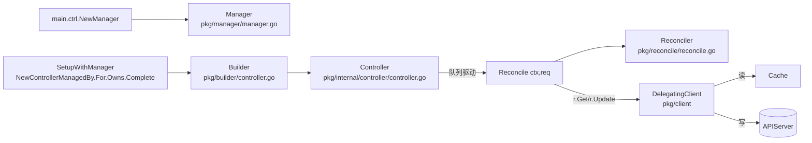

#kubernetes #controller-runtime #operator #demo

相关笔记：[[controller-runtime-source]] | [[kubebuilder]] | [[operator-pattern]] | [[informer]]

## 简介

`cloud-native/kubernetes/demos/kubebuilder-operator/` 下的最小 Operator 骨架，用于配合 [[controller-runtime-source]] 源码走读。**不依赖 CRD**，只监听 `ConfigMap`，所以任何集群都能跑，避免 `kubebuilder init` / `make install` 的环境摩擦。

## 它做什么

监听一个 namespace 下带 `demo.learning-notes/source=true` label 的 ConfigMap：

- 若 CM 有 `demo.learning-notes/payload` annotation → 同步到 `<name>-mirror` ConfigMap。
- mirror 上写 `ownerReferences` 指回源 CM。
- 源 CM 被删 → 级联删除 mirror。
- mirror 被人为修改 → Controller 通过 `Owns(...)` 反向链路被触发，改回去（**这一条最能体现 Operator "声明式收敛" 的本质**）。

## 文件分工

```
main.go                    Manager 装配、Logger、Scheme、SignalHandler、mgr.Start
configmap_controller.go    ConfigMapReconciler.Reconcile + SetupWithManager
go.mod                     依赖 controller-runtime v0.18.x、client-go v0.31.x
README.md                  跑法 + 验证步骤
```

## 与源码的对应关系



## 跑法（速查）

```bash
cd cloud-native/kubernetes/demos/kubebuilder-operator
go mod tidy
go run . --kubeconfig ~/.kube/config --namespace default

# 另一个终端
kubectl create configmap demo-src -n default --from-literal=x=1
kubectl label  configmap demo-src demo.learning-notes/source=true -n default
kubectl annotate configmap demo-src demo.learning-notes/payload="hello" -n default
kubectl get configmap demo-src-mirror -n default -o yaml
```

详细验证步骤见 `README.md`。

## 阅读建议

跑通这个 demo 后，按以下顺序回头读 controller-runtime 源码会非常顺：

1. `main.go: ctrl.NewManager` → `pkg/manager/manager.go: New` 与 `internal.go: Start`
2. `SetupWithManager` → `pkg/builder/controller.go: Build` → `doController` + `doWatch`
3. `For/Owns` 注册的 EventHandler → `pkg/handler/enqueue.go`、`enqueue_owner.go`
4. 事件入 WorkQueue → worker 取 → `pkg/internal/controller/controller.go: processNextWorkItem`
5. `r.Get/r.Update` 的读写分流 → `pkg/client/client.go: delegatingClient`

## 面试要点

**Q: 这个 demo 里 `Owns(&corev1.ConfigMap{})` 和 `For(&corev1.ConfigMap{})` 都监听 ConfigMap，会冲突吗？**
A: 不会。`For` 用 `EnqueueRequestForObject` 入队对象自身 key（且通过 Predicate 过滤出 source label）；`Owns` 用 `EnqueueRequestForOwner`，看 mirror CM 的 `ownerReferences`，反向把 source 的 key 入队。两条路径生成的都是 source 的 Request，WorkQueue 会去重，所以最终调用同一个 Reconcile。

**Q: 为什么修改 mirror 后 Controller 会改回去？这不是 Mutating Webhook 吧？**
A: 不是。这是 `Owns(...)` 的核心机制：mirror 写了 ownerRef → mirror 的 Update 事件经 `EnqueueRequestForOwner` 翻译成 source 的 Reconcile Request → Reconcile 读 source 期望状态 → 发现 mirror 状态不一致 → `r.Update` 改回。整个过程是"声明式期望 + 持续收敛"。

**Q: 为什么这个 Reconciler 是幂等的？**
A: 它做的是"对比 mirror 当前 annotation 与 source 期望 annotation，相同则跳过，不同则 Update"，没有依赖前一次执行的状态。即使被重复触发或并发调用同 key（实际上 WorkQueue 保证同 key 串行），结果也只与"当前 source CM 内容"相关。

**Q: 如果改 namespace 监听全部 ConfigMap 会有什么后果？**
A: Cache 会全量 List 集群里所有 ConfigMap 并保持 Watch，内存占用按对象数线性增长（大集群可能几百 MB）。生产做法是用 `Options.Cache.DefaultNamespaces` 或 `ByObject.Label/Field` 在 Informer 层就限制范围，避免拉无关数据。
