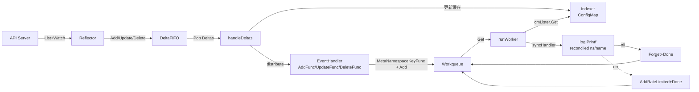

#kubernetes #client-go #demo

相关笔记：[[client-go-source]] | [[informer]] | [[k8s-development-roadmap]]

## 概述

这是一个最小化、可直接运行的 client-go 控制器示例，监听集群中所有 `ConfigMap` 资源，每次变更只在日志里打印一条 `reconciled <ns>/<name>`。代码不到 200 行，覆盖了标准 sample-controller 模式的完整骨架：SharedInformerFactory、EventHandler、Workqueue、WaitForCacheSync、runWorker 循环、syncHandler 幂等处理。配套笔记 [[client-go-source]] 详解了每一层组件的源码实现，本 demo 用于把那些抽象组件串成一条可观察、可调试的真实控制流。

选择 ConfigMap 是因为它是内置资源，**无需 CRD、无需 RBAC 改动**，本地 `kind` / `minikube` / `docker-desktop` 集群直接就能跑。

## 数据流



## 运行

```bash
cd cloud-native/kubernetes/demos/sample-controller
go mod tidy
go run . --kubeconfig ~/.kube/config
```

默认 2 个 worker；可用 `--workers=N` 调整。不传 `--kubeconfig` 时读取 `$HOME/.kube/config`。

启动后输出：

```
Starting sample-controller (watching ConfigMaps)
Caches synced, starting workers
reconciled kube-system/kube-root-ca.crt (resourceVersion=..., keys=1)
...
```

新建/改/删 ConfigMap 测试：

```bash
kubectl create configmap demo --from-literal=foo=bar
kubectl patch configmap demo -p '{"data":{"foo":"baz"}}'
kubectl delete configmap demo
```

预期看到：

```
reconciled default/demo (resourceVersion=..., keys=1)
reconciled default/demo (resourceVersion=..., keys=1)
reconciled default/demo (deleted)
```

## 代码要点

- **EventHandler 轻量**：`AddFunc/UpdateFunc/DeleteFunc` 内只算 key + `queue.Add`，业务逻辑全部留到 `syncHandler`。UpdateFunc 里过滤 `oldRV == newRV`（说明是 Resync 而非真实变更），按需可保留也可丢弃，演示里选择跳过以减少重复日志。
- **以 key 入队而非对象**：用 `cache.MetaNamespaceKeyFunc` 生成 `ns/name` 字符串入队；Worker 在 `syncHandler` 里通过 `cmLister` 取最新对象，避免处理过期对象。
- **WaitForCacheSync 在 worker 启动前**：若不等同步，`cmLister.Get` 可能返回 NotFound 而被误判为「对象已删除」。
- **syncHandler 幂等**：对 NotFound 返回 nil（视为「成功删除」），其他错误返回 err 触发 `AddRateLimited` 退避重试。
- **失败重试 5 次封顶**：`NumRequeues(key) >= 5` 后调用 `Forget` 放弃，避免热失败打爆 API Server。
- **泛型 Workqueue**：使用 `workqueue.NewTypedRateLimitingQueue[string](...)` 与 `DefaultTypedControllerRateLimiter[string]()`，client-go v0.31+ 的新签名，元素类型在编译期固定，省掉 `interface{}` 断言。

## 与笔记对应

| 代码片段 | 笔记章节 |
| --- | --- |
| `informers.NewSharedInformerFactory(...)` + `factory.Start` | client-go-source.md → SharedInformerFactory 共享机制 |
| `cmInformer.Informer().AddEventHandler(...)` | client-go-source.md → processorListener：事件分发 |
| `cache.WaitForCacheSync(...)` | client-go-source.md → Resync 与 HasSynced |
| `workqueue.NewTypedRateLimitingQueue` | client-go-source.md → Workqueue：去重、限速、重试 |
| `processNextItem` 的 Get/Done/Forget/AddRateLimited | client-go-source.md → RateLimiter 与指数退避 + 手写简化复现 |
| `cmLister.ConfigMaps(ns).Get(name)` | client-go-source.md → Indexer 与 ThreadSafeStore |
| `syncHandler` 处理 NotFound | client-go-source.md → 自定义控制器骨架 |

## 面试要点

| 问题 | 回答要点 |
| --- | --- |
| **demo 里为什么选 ConfigMap 而不是 CRD？** | ConfigMap 是内置资源，无需 CRD/Operator 注册、无需 RBAC 改动，本地集群即开即用，让重点落在 sample-controller 模式本身。 |
| **EventHandler 为什么只做 enqueue？** | EventHandler 同步执行于 `processDeltas` 链路，DeltaFIFO 持锁；EventHandler 阻塞会卡住整个队列。所以业务交给异步 Worker 的 syncHandler。 |
| **入队 key 而不是对象的好处？** | 1) 字符串可去重；2) Worker 处理时通过 Lister 取最新对象，避免处理过期数据；3) Workqueue 不持有对象指针，便于 GC。 |
| **WaitForCacheSync 不等会怎样？** | Lister 基于本地 Indexer，未同步前缓存不完整，`cmLister.Get` 可能误返 NotFound，syncHandler 会把存在的对象当成「已删除」。 |
| **syncHandler 失败为什么调 AddRateLimited 而不是 Add？** | `Add` 会立即重入队，热失败下 1ms 内重试上千次会打爆 API Server。`AddRateLimited` 按指数退避（默认 5ms→1000s）+ 全局令牌桶（10QPS）限速。 |
| **NumRequeues 超限后调 Forget 而不是 Add？** | Forget 清空该 key 的失败计数。如果只是不再入队但不清计数，下次该 key 真正出问题时退避会从超高值继续累加。 |
| **Resync 在 demo 里表现是什么？** | factory 设了 30s Resync，每 30s Indexer 中全部 ConfigMap 会以 Sync Delta 重新入队，触发 UpdateFunc。demo 中按 `oldRV == newRV` 过滤掉了 Resync，避免重复日志。 |
| **泛型 Workqueue 相比旧 API 的差别？** | 旧 `workqueue.RateLimitingInterface` 的 Add/Get 入参/出参是 `interface{}`，需要 type assertion。`TypedRateLimitingInterface[T]` 在编译期固定类型，省去断言并避免运行时类型错误。 |
