#kubernetes #scheduler #demo

相关笔记：[[scheduler-framework-source]] | [[scheduler-deep-dive]] | [[k8s-development-roadmap]]

## 概述

本笔记是 `cloud-native/kubernetes/demos/scheduler-plugin/` 这个 demo 的**走读说明**：用 out-of-tree 的方式给 kube-scheduler 注入一个自定义 `Score` 插件 `NodeLabelScore`，作为**第二调度器**部署到集群，与原生 default-scheduler 共存，只对 `spec.schedulerName: learning-notes-scheduler` 的 Pod 生效。读完本笔记你会知道：(1) 如何写一个标准的 ScorePlugin；(2) 如何编出 out-of-tree scheduler 二进制；(3) 如何写 `KubeSchedulerConfiguration` 把插件挂进 profile；(4) 多调度器部署时哪些细节会踩坑。

源码走读详见 [[scheduler-framework-source]]，本 demo 是它的**配套实践**。

## 一、目录结构

```
demos/scheduler-plugin/
├── main.go                    cmd 入口：app.NewSchedulerCommand + app.WithPlugin
├── pkg/nodelabel/nodelabel.go ScorePlugin 实现
├── config.yaml                KubeSchedulerConfiguration v1
├── go.mod                     依赖说明（含 staging replace 注意事项）
└── README.md                  详细使用文档与部署 YAML
```

## 二、核心调用链

```mermaid
flowchart LR
    Main[main.go<br/>app.NewSchedulerCommand]
        --> WithPlugin[app.WithPlugin<br/>NodeLabelScore, New]
        --> Cobra[执行 cobra Command]
        --> SchedRun[kube-scheduler 主循环<br/>ScheduleOne]
    SchedRun --> Cycle[scheduling cycle]
    Cycle --> Score[RunScorePlugins]
    Score --> NL[NodeLabelScore.Score<br/>读 node.Labels]
    NL --> Norm[NodeLabelScore.NormalizeScore<br/>映射到 0~100]
    Norm --> Weight[× weight=5<br/>加到 TotalScore]
```



把 `app.WithPlugin` 想成"对 out-of-tree registry 的一行注册"——它把 `nodelabel.New`（一个 `framework.PluginFactory`）以名字 `NodeLabelScore` 加入 registry，之后 KubeSchedulerConfiguration 里就可以通过这个名字启用它。

## 三、插件实现走读

```go
// pkg/nodelabel/nodelabel.go
const Name = "NodeLabelScore"

type NodeLabelScore struct { handle framework.Handle }

var (
    _ framework.ScorePlugin     = &NodeLabelScore{}
    _ framework.ScoreExtensions = &NodeLabelScore{}
)

func New(_ context.Context, _ runtime.Object, h framework.Handle) (framework.Plugin, error) {
    return &NodeLabelScore{handle: h}, nil
}

func (pl *NodeLabelScore) Name() string { return Name }

func (pl *NodeLabelScore) Score(ctx context.Context, state *framework.CycleState,
    pod *v1.Pod, nodeName string) (int64, *framework.Status) {
    nodeInfo, err := pl.handle.SnapshotSharedLister().NodeInfos().Get(nodeName)
    if err != nil {
        return 0, framework.NewStatus(framework.Error, fmt.Sprintf("get node %q: %v", nodeName, err))
    }
    if nodeInfo.Node().Labels["learning-notes/preferred"] == "true" {
        return 100, nil
    }
    return 0, nil
}

func (pl *NodeLabelScore) ScoreExtensions() framework.ScoreExtensions { return pl }

func (pl *NodeLabelScore) NormalizeScore(ctx context.Context, state *framework.CycleState,
    pod *v1.Pod, scores framework.NodeScoreList) *framework.Status {
    var highest int64
    for _, s := range scores { if s.Score > highest { highest = s.Score } }
    if highest == 0 { return nil }
    for i := range scores {
        scores[i].Score = scores[i].Score * framework.MaxNodeScore / highest
    }
    return nil
}
```

值得注意的几个点：

1. **`handle framework.Handle`** 是插件接触调度器内部能力的唯一入口。常用的：
   - `handle.SnapshotSharedLister()` —— 当前周期的不可变 snapshot，**不要直接读 Informer**。
   - `handle.ClientSet()` —— 访问 apiserver（在 Bind/PreBind 阶段才常用）。
   - `handle.SharedInformerFactory()` —— 注册 informer 监听对象变化。
   - `handle.EventRecorder()` —— 发 Event。
2. **编译期断言** `var _ framework.ScorePlugin = &NodeLabelScore{}` 是 Go 习惯做法，能在重构时尽早暴露接口签名错位。
3. **`ScoreExtensions()` 返回 `pl` 自己**：因为 NodeLabelScore 也实现了 `NormalizeScore`，让 framework 知道"本插件需要归一化"。如果原始分本来就在 `[0, MaxNodeScore]` 区间，可以直接 `return nil` 跳过这一步。

## 四、main 入口

```go
// main.go
func main() {
    command := app.NewSchedulerCommand(
        app.WithPlugin(nodelabel.Name, nodelabel.New),
    )
    code := cli.Run(command)
    os.Exit(code)
}
```

这就是 out-of-tree scheduler 的全部"非业务"代码。`app.NewSchedulerCommand` 内部会：

- 解析 `--config`、`--kubeconfig`、`--leader-elect` 等命令行参数。
- 起 leader election 选主（防止两个 replica 同时调度）。
- 用 `runtime.NewFramework` 把内置插件 + 自定义插件按 profile 构造出 `framework.Framework`。
- 启动 informer、cache、scheduling queue。
- 进 `Scheduler.Run` → `wait.UntilWithContext(ctx, sched.ScheduleOne, 0)` 主循环。

我们什么都没改，只是多塞了一行 `WithPlugin`。

## 五、KubeSchedulerConfiguration

```yaml
apiVersion: kubescheduler.config.k8s.io/v1
kind: KubeSchedulerConfiguration
leaderElection:
  leaderElect: true
  resourceName: learning-notes-scheduler        # 必须与 default-scheduler 不同！
  resourceNamespace: kube-system
profiles:
  - schedulerName: learning-notes-scheduler
    plugins:
      score:
        enabled:
          - name: NodeLabelScore
            weight: 5
```

要点：

- `schedulerName` 是 **Pod 选择该 profile 的钥匙**；Pod `spec.schedulerName` 必须与之精确匹配。
- `weight: 5` 决定 `NodeLabelScore` 在总分里的权重。最终得分公式 `score = Σ weight_i × normalized_i`，所以 weight=5 意味着这个插件"说话的分量"是 weight=1 插件的 5 倍。
- 默认所有 in-tree 插件仍然启用——如果只想看自定义打分的效果，可以 `disabled: [{name: "*"}]` 把全部 in-tree Score 插件关掉再观察。

## 六、部署为第二调度器

完整 Deployment YAML 见 README.md，关键点：

1. **独立的 ServiceAccount + RBAC**：复制 default-scheduler 的 ClusterRoleBinding。
2. **独立 leaderElection.resourceName**：否则会去抢 default-scheduler 的 lease，两个调度器互相挤掉。
3. **业务 Pod 通过 `spec.schedulerName` 路由**：写了 `learning-notes-scheduler` 才走自定义调度器，其他 Pod 走默认。
4. **缓存隔离**：自定义调度器有自己的 `Scheduler.Cache`，看不到 default-scheduler 的 assume 结果——所以如果两个调度器能调度到同一节点，理论上存在资源并发误判风险，生产中通常按节点 label / nodeAffinity 把节点池划清。

## 七、为什么 go.mod 这么"麻烦"

`k8s.io/kubernetes` 主仓的 `go.mod` 里把所有 staging 子模块都标记为 `v0.0.0` 占位版本。out-of-tree 用户必须自己在 `go.mod` 里加一长串 `replace` 把它们指向真实版本号（与 K8s 版本一一对应：v1.34 → v0.34）。这也是为什么社区 demo 都建议直接 fork `kubernetes-sigs/scheduler-plugins`——它的 go.mod 已经写好了完整的 replace 列表。本 demo 的 `go.mod` 里完整罗列了这份 replace 模板，按需取用即可。

## 八、面试要点

**Q1：自定义 Score 插件最少要实现哪几个方法？**

> [!question]- 参考答案（点击展开）
>
> `Name() string`（来自 `framework.Plugin`）+ `Score(ctx, state, pod, nodeName) (int64, *Status)` + `ScoreExtensions() framework.ScoreExtensions`。如果原始分已经在 `[0, MaxNodeScore]` 区间且不需要归一化，`ScoreExtensions()` 可以返回 `nil`；否则就实现 `NormalizeScore` 并让 `ScoreExtensions()` 返回自己（或一个单独的 normalize 类型）。

**Q2：`PluginFactory.New` 签名长什么样？参数都用来干嘛？**

> [!question]- 参考答案（点击展开）
>
> `func(ctx context.Context, args runtime.Object, handle framework.Handle) (framework.Plugin, error)`。`args` 是 `KubeSchedulerConfiguration.pluginConfig[].args`，用来给插件传配置；`handle` 是插件访问调度器能力（snapshot lister、clientset、informer factory、event recorder）的入口。返回值是构造好的 plugin 实例。

**Q3：插件里能直接 `clientset.CoreV1().Nodes().List(...)` 读节点吗？**

> [!question]- 参考答案（点击展开）
>
> 能但不该。`Score` 阶段必须读 `handle.SnapshotSharedLister()`，它是本次调度周期的不可变快照，与 Filter 阶段看到的状态一致；直接读 Informer 或 apiserver 会和 snapshot 不一致，可能让"过了 Filter 的节点 Score 阶段读到不同状态"，调度决策会出现行为漂移。

**Q4：`app.WithPlugin` 和"把插件加进 in-tree registry"有什么区别？**

> [!question]- 参考答案（点击展开）
>
> `app.WithPlugin` 把工厂注入 **out-of-tree registry**——只对本进程生效，不需要改 kubernetes/kubernetes 主仓代码。插件名空间和 in-tree 平起平坐，所以 KubeSchedulerConfiguration 写法完全一样。In-tree 改法需要给 kubernetes 主仓提 PR、合进 `pkg/scheduler/framework/plugins/`，对个人使用太重，社区也劝退（KEP "no new in-tree plugins"）。

**Q5：第二调度器为什么必须用不同的 `leaderElection.resourceName`？**

> [!question]- 参考答案（点击展开）
>
> leader election 本质是一把 Kubernetes Lease 锁。如果两个调度器进程用同一个 resourceName，它们会去抢同一把锁——只有一个能当 leader，另一个被锁住一直 standby，结果就是你的自定义调度器看起来"启动了但什么都不做"。换不同的 resourceName 后两边各有各的 leader，互不相干。

**Q6：业务 Pod 怎么决定走哪个调度器？**

> [!question]- 参考答案（点击展开）
>
> 完全靠 `pod.spec.schedulerName`。这个字段默认值是 `default-scheduler`，你也可以写成 `learning-notes-scheduler`。`Scheduler.ScheduleOne` 在 `frameworkForPod` 里按这个字段选 profile，**找不到对应 profile 的 Pod 会被该调度器忽略**（不是失败，是直接不处理，留给其他调度器）。这样多个 scheduler 之间天然不会争抢同一个 Pod。
