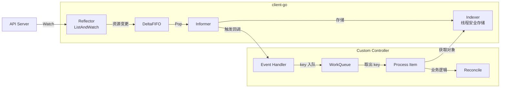
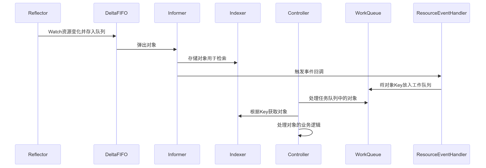
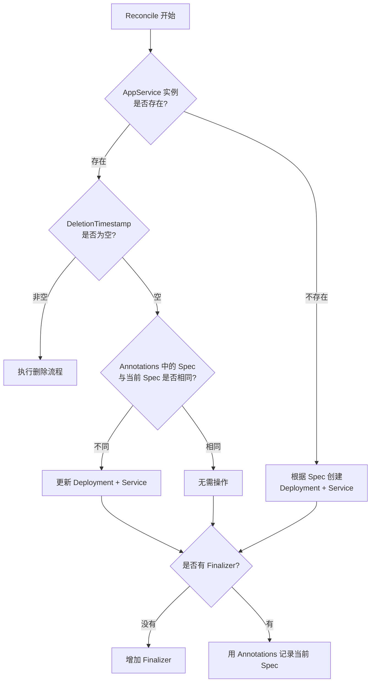
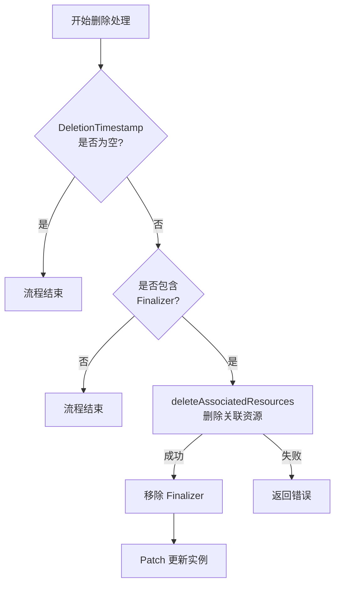

#kubernetes #kubebuilder

相关笔记：[[informer]] | [[kubernetes-basics]] | [[api-resource]]

## 背景

在 Kubernetes 中，部署一个 Deployment 时，通常还需要创建一个 Service 以便外部可以访问这个 Deployment。为了简化这个过程，可以创建一个自定义的 Controller，使其在部署 Deployment 的同时自动创建相应的 Service。

## 自定义 Controller 运行原理

自定义控制器能够完成业务逻辑，最主要是依赖 client-go 库的各个组件的交互。

![[自定义controller运行原理.png]]

通过图示，可以看到几个核心组件的交互流程（蓝色表示 client-go，黄色是自定义 controller）。



### client-go 组件

- **Reflector**: 用来 watch 特定的 K8s API 资源。通过 ListAndWatch 方法，当 Reflector 通过 watch API 接收到新资源实例存在的通知时，使用相应的 list API 获取新创建的对象，并将其放入 DeltaFIFO 队列中
- **Informer**: 从 DeltaFIFO 队列中弹出对象。base controller 的作用是保存对象以供以后检索，并调用我们的控制器将对象传递给它
- **Indexer**: 提供对象的索引功能。典型的索引用例是基于对象标签创建索引。Indexer 使用线程安全的数据存储，默认函数 MetaNamespaceKeyFunc 生成对象的键为 namespace/name 组合

### 自定义 Controller 组件

- **Informer reference**: Informer 实例的引用，定义如何使用自定义资源对象
- **Indexer reference**: Indexer 实例的引用
- **Resource Event Handlers**: 资源事件回调函数，获取调度对象的 key 并将该 key 排入工作队列
- **Work queue**: 任务队列，存储需要处理的对象 Key
- **Process Item**: 处理任务队列中对象的函数，通常使用 Indexer 引用来重试与该 key 对应的对象

### 完整处理流程



简单来说：Reflector 通过检测 Kubernetes API 来跟踪资源变化，一旦发现有变化，就将该 Object 存储到队列中。Informer 循环取出该 Object 并将其存入 Indexer 进行检索，同时触发 Callback 回调函数，并将变更的 Object Key 信息放入到工作队列中。此时自定义 Controller 里面的 Process Item 就会获取工作队列里面的 Key，并从 Indexer 中获取 Key 对应的 Object，从而进行相关的业务处理。

## 环境准备

```bash
# 依赖工具
brew install golang      # go1.21+
brew install kubectl
brew install kubebuilder
```

## 创建项目

```bash
mkdir controller-demo
cd controller-demo
kubebuilder init --domain appservice.com --owner appservice
```

## 创建 API

### Kubebuilder 注释

在 Kubebuilder 中，使用注释定义自定义资源（CRD）和控制器的元数据。这些注释指导代码生成工具生成正确的 Kubernetes CRD 和控制器逻辑。

| 注释 | 作用 |
| --- | --- |
| `// +kubebuilder:object:root=true` | 声明该类型是自定义资源的根对象 |
| `// +kubebuilder:subresource:status` | 启用 status 子资源 |
| `// +kubebuilder:resource:scope=Cluster` | 设置资源范围为集群级 |
| `// +kubebuilder:resource:path=<p>,shortName=<s>` | 设置资源路径和短名称 |
| `// +kubebuilder:printcolumn:name=<n>,type=<t>,JSONPath=<j>` | 定义 kubectl get 输出的额外列 |
| `// +kubebuilder:validation:Minimum=<v>` | 字段最小值验证 |
| `// +kubebuilder:validation:Maximum=<v>` | 字段最大值验证 |
| `// +kubebuilder:validation:Enum=<v1>;<v2>` | 字段枚举值验证 |
| `// +kubebuilder:validation:Pattern=<regex>` | 字段正则表达式验证 |
| `// +kubebuilder:default=<value>` | 设置字段默认值 |

### 生成 API

```bash
kubebuilder create api --group batch --version v1 --kind AppService
```

### 定义 Spec 和 Status

```go
// AppServiceSpec defines the desired state of AppService
type AppServiceSpec struct {
    Replicas  *int32                      `json:"replicas"`
    Image     string                      `json:"image"`
    Resources corev1.ResourceRequirements `json:"resources,omitempty"`
    Envs      []corev1.EnvVar             `json:"envs,omitempty"`
    Ports     []corev1.ServicePort        `json:"ports,omitempty"`
}

// AppServiceStatus defines the observed state of AppService
type AppServiceStatus struct {
    appsv1.DeploymentStatus `json:",inline"`
}
```

```bash
# 确保 Kubernetes 资源定义文件是最新的
make manifests
```

## 设计自定义 Controller

### Reconcile 流程

Controller 的 Reconcile 逻辑如下：



![[AppService控制器流程.png]]

### 创建资源

- 如果 AppService 实例不存在，则根据 AppServiceSpec 创建:
  - 创建 Deployment 资源
  - 创建 Service 资源
- 如果 AppService 实例存在，则将 Annotations 中记录的 Spec 值与当前的 Spec 比较:
  - 如果前后的 Spec 不同: 更新 Deployment 和 Service 资源
  - 如果前后的 Spec 相同: 无需额外操作
- 判断是否有 Finalizer:
  - 没有: 增加 Finalizer
  - 有: 使用 Annotations 记录当前 Spec 的值

### 删除资源



![[删除关联资源.png]]

- 检查 DeletionTimestamp 是否为空: 判断资源是否被标记为删除
- 检查是否包含 Finalizer: 如果包含，调用 `deleteAssociatedResources` 方法删除关联资源
  - 成功: 移除 Finalizer，通过 Patch 更新实例
  - 失败: 返回错误信息

## 面试要点

### 高频问题

**Q: Kubebuilder 和 client-go 裸写 Controller 是什么关系？**
A: Kubebuilder 是基于 controller-runtime 的脚手架工具，底层依然是 client-go 的 Informer/WorkQueue 那一套机制。它通过 `kubebuilder init` / `create api` 生成项目骨架、CRD 类型、Manager 和 Reconciler，并用 controller-gen 根据 marker 注释生成 CRD YAML（`make manifests`）与 DeepCopy 代码（`make generate`），把 Reflector、Informer、Indexer、缓存这些样板封装起来，开发者只需聚焦实现 Reconcile 业务逻辑。

**Q: 自定义 Controller 的核心组件和数据流是怎样的？**
A: client-go 侧由 Reflector 通过 ListAndWatch 监听 API Server，把变更对象写入 DeltaFIFO；Informer 从 DeltaFIFO 弹出对象存入 Indexer（线程安全存储，默认 `MetaNamespaceKeyFunc` 按 namespace/name 建索引）并触发 Event Handler。自定义 Controller 侧在回调里把对象的 key 放入 WorkQueue，Process Item 取出 key 后从 Indexer 的本地缓存读取对象执行 Reconcile，避免每次都直接打 API Server。

**Q: 为什么 Reconcile 入队的是 key（namespace/name）而不是对象本身？**
A: 入队 key 有几个好处：WorkQueue 能对相同 key 自动去重与限速，多次抖动只触发一次有效处理；处理时通过 Indexer 重新获取最新对象，避免拿到队列里的过期快照；这也强制 Reconcile 写成幂等的「水平触发」模型，即只关心期望状态与实际状态的差异，而不依赖某次具体事件。

**Q: Reconcile 为什么必须幂等？怎么保证幂等？**
A: 因为同一对象可能被多次入队、重试或在 Informer resync 时重复触发，Reconcile 不能假设自己只跑一次。幂等的做法是每次都读取当前实际状态（Deployment/Service 是否存在、Spec 是否一致），再决定创建、更新还是无操作；笔记中用 Annotations 记录上一次的 Spec，与当前 Spec 比较，相同就跳过，避免无意义的重复更新。

**Q: Finalizer 是做什么的？和 DeletionTimestamp 如何配合实现优雅删除？**
A: Finalizer 是对象 metadata 中的一个字符串列表，只要非空，API Server 在收到删除请求时不会真正删掉对象，而是设置 `DeletionTimestamp` 让其进入「删除中」状态。Controller 监测到 DeletionTimestamp 非空且含有自己的 Finalizer 时，执行 `deleteAssociatedResources` 清理关联的 Deployment/Service，成功后移除 Finalizer 并 Patch 更新；当最后一个 Finalizer 被移除时，API Server 才真正删除该对象，从而保证关联资源被可靠清理。

**Q: status 子资源（subresource:status）有什么用？为什么要单独拆出来？**
A: 启用 `// +kubebuilder:subresource:status` 后，status 成为独立子资源，对 status 的更新走 `/status` 端点且不会改变 spec，反之更新 spec 也不会动 status。这实现了「用户/控制器写 spec，控制器写 status」的职责分离，避免两边互相覆盖；`/status` 更新同样基于 resourceVersion 做乐观并发控制。

**Q: Kubebuilder 的 marker 注释（如 +kubebuilder:validation、+kubebuilder:default）是怎么生效的？**
A: 这些注释是给 controller-gen 读取的代码生成指令，并非运行时逻辑。执行 `make manifests` 时，controller-gen 解析 Go 类型上的 marker，生成对应的 CRD OpenAPI v3 schema（Minimum/Maximum/Enum/Pattern 等校验、default 默认值、printcolumn 额外列、resource scope 等），由 API Server 在写入时做 schema 校验和默认值填充（defaulting 需要 structural schema 支持）。

### 面试加分点

- 能区分 Reflector 的 List 全量同步与 Watch 增量同步：Watch 基于 resourceVersion，watch 过期（410 Gone）后用 list 重新建立基线，DeltaFIFO 会合并同一对象的连续变更（含 resync 合成的 Sync 事件），以保证状态最终收敛。
- 理解 WorkQueue 的限速能力：controller-runtime 默认使用组合限速器（按 item 指数退避 + 全局 token bucket）的 RateLimitingQueue，Reconcile 返回 error 或 `Result{Requeue: true}` 时会重新入队重试，`RequeueAfter` 可实现定时 resync。
- 清楚本地缓存（Indexer）读、API Server 写的模式：Reconcile 中读对象走 Manager 的 cache，写操作（Create/Update/Patch）才打到 API Server，能减轻 API Server 压力，但要注意 cache 可能短暂落后导致读到旧数据的问题。
- 能讲清 Annotations 记录 Spec 做 diff 的局限：这是简化实现，生产中更推荐用 `observedGeneration` 配合 status conditions，或直接对实际资源做 server-side apply / 三方合并，避免 Annotation 体积膨胀和 diff 不准确。
- 了解 OwnerReferences 与 Finalizer 的分工：OwnerReferences 让 GC 自动级联删除 Controller 创建的 Deployment/Service，Finalizer 则用于需要执行额外清理逻辑（如释放外部/云资源）的场景，两者常配合使用。
- 知道 webhook 的存在：Kubebuilder 还能用 `create webhook` 生成 admission webhook，实现 defaulting 与 validating 的复杂校验逻辑，弥补 CRD schema 校验表达能力的不足，并支持多版本 CRD 的 conversion webhook。
