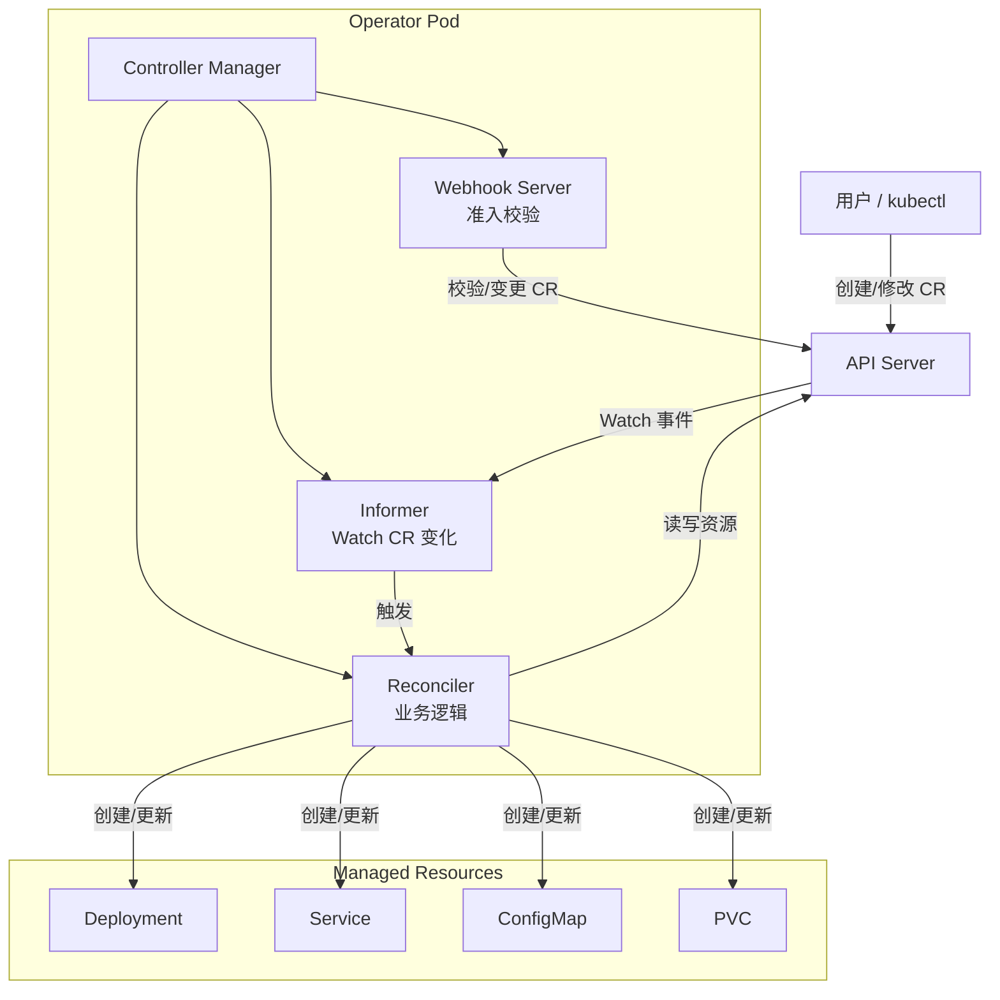
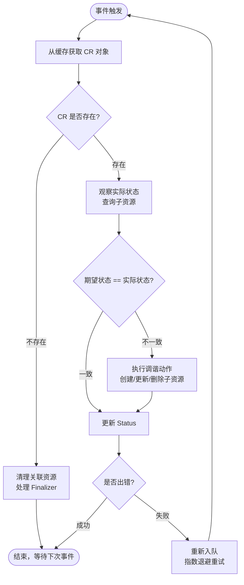
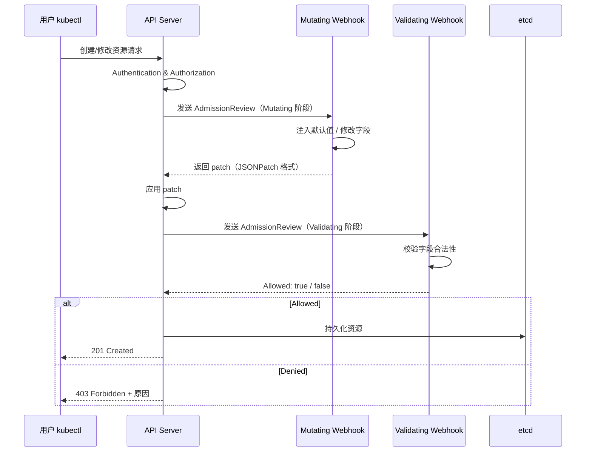

#kubernetes #operator #crd

相关笔记：[[kubebuilder]] | [[informer]] | [[restful-api-design]] | [[k8s-interview]]

## Operator Pattern 是什么

Operator 是 Kubernetes 的一种扩展模式，核心思想是 **CRD + Custom Controller**：用 CRD 声明"期望状态"，用 Controller 驱动"实际状态"向期望状态收敛。这一模式由 CoreOS 在 2016 年提出，目的是将运维领域知识编码为软件，实现复杂有状态应用的自动化管理。

### 核心公式

```
Operator = CRD (Custom Resource Definition) + Custom Controller
```

- **CRD**：扩展 Kubernetes API，定义新的资源类型（如 `MySQLCluster`）
- **Custom Controller**：监听 CRD 资源的变化，执行 Reconcile 逻辑使实际状态与期望状态一致

### Operator 整体架构



## CRD（Custom Resource Definition）

CRD 是 Kubernetes 提供的扩展机制，允许用户在不修改 Kubernetes 源码的情况下注册新的 API 资源类型。注册 CRD 后，就可以像使用内置资源（Pod、Service）一样通过 kubectl 和 API 操作自定义资源（CR）。

### CRD YAML 示例

```yaml
apiVersion: apiextensions.k8s.io/v1
kind: CustomResourceDefinition
metadata:
  name: mysqlclusters.database.example.com
spec:
  group: database.example.com
  versions:
    - name: v1alpha1
      served: true
      storage: true
      schema:
        openAPIV3Schema:
          type: object
          properties:
            spec:
              type: object
              properties:
                replicas:
                  type: integer
                  minimum: 1
                  maximum: 5
                version:
                  type: string
                  enum: ["5.7", "8.0"]
                storage:
                  type: string
              required: ["replicas", "version"]
            status:
              type: object
              properties:
                phase:
                  type: string
                readyReplicas:
                  type: integer
      subresources:
        status: {}       # 启用 /status 子资源
      additionalPrinterColumns:
        - name: Replicas
          type: integer
          jsonPath: .spec.replicas
        - name: Version
          type: string
          jsonPath: .spec.version
        - name: Phase
          type: string
          jsonPath: .status.phase
  scope: Namespaced
  names:
    plural: mysqlclusters
    singular: mysqlcluster
    kind: MySQLCluster
    shortNames:
      - mc
```

### CR（Custom Resource）实例

```yaml
apiVersion: database.example.com/v1alpha1
kind: MySQLCluster
metadata:
  name: my-mysql
  namespace: default
spec:
  replicas: 3
  version: "8.0"
  storage: "10Gi"
```

### CRD 关键设计点

| 设计点 | 说明 |
|--------|------|
| `subresources.status` | 分离 spec/status 更新权限，避免用户误改 status |
| `additionalPrinterColumns` | kubectl get 时显示自定义列 |
| `openAPIV3Schema` | 服务端校验，拒绝不合法的 CR |
| `versions` | 支持多版本共存和 Conversion Webhook |
| `scope: Namespaced` | 资源归属 namespace，便于 RBAC 控制 |

## Controller 核心循环：Reconcile Loop

Controller 的核心是一个 **Reconcile Loop**（调谐循环），不断比较资源的期望状态（spec）与实际状态（status），并执行操作使两者一致。

### Reconcile Loop 流程



### Reconcile 函数骨架（Go）

```go
func (r *MySQLClusterReconciler) Reconcile(ctx context.Context, req ctrl.Request) (ctrl.Result, error) {
    log := log.FromContext(ctx)

    // 1. Fetch：获取 CR 对象
    var cluster databasev1alpha1.MySQLCluster
    if err := r.Get(ctx, req.NamespacedName, &cluster); err != nil {
        if apierrors.IsNotFound(err) {
            log.Info("MySQLCluster resource not found, skipping")
            return ctrl.Result{}, nil
        }
        return ctrl.Result{}, err
    }

    // 2. Handle Finalizer：处理删除逻辑
    if !cluster.DeletionTimestamp.IsZero() {
        return r.handleDeletion(ctx, &cluster)
    }
    if !controllerutil.ContainsFinalizer(&cluster, finalizerName) {
        controllerutil.AddFinalizer(&cluster, finalizerName)
        if err := r.Update(ctx, &cluster); err != nil {
            return ctrl.Result{}, err
        }
    }

    // 3. Observe：获取实际状态
    existingSts := &appsv1.StatefulSet{}
    err := r.Get(ctx, types.NamespacedName{
        Name:      cluster.Name,
        Namespace: cluster.Namespace,
    }, existingSts)

    // 4. Diff + Act：比较并执行调谐
    if apierrors.IsNotFound(err) {
        // 子资源不存在，创建
        sts := r.buildStatefulSet(&cluster)
        if err := controllerutil.SetControllerReference(&cluster, sts, r.Scheme); err != nil {
            return ctrl.Result{}, err
        }
        if err := r.Create(ctx, sts); err != nil {
            return ctrl.Result{}, err
        }
        log.Info("Created StatefulSet", "name", sts.Name)
    } else if err != nil {
        return ctrl.Result{}, err
    } else {
        // 子资源存在，检查是否需要更新
        if *existingSts.Spec.Replicas != int32(cluster.Spec.Replicas) {
            existingSts.Spec.Replicas = pointer.Int32(int32(cluster.Spec.Replicas))
            if err := r.Update(ctx, existingSts); err != nil {
                return ctrl.Result{}, err
            }
        }
    }

    // 5. Update Status
    cluster.Status.ReadyReplicas = existingSts.Status.ReadyReplicas
    cluster.Status.Phase = computePhase(&cluster, existingSts)
    if err := r.Status().Update(ctx, &cluster); err != nil {
        return ctrl.Result{}, err
    }

    return ctrl.Result{}, nil
}
```

### Reconcile 返回值语义

| 返回值 | 含义 |
|--------|------|
| `ctrl.Result{}, nil` | 成功，等待下一个事件 |
| `ctrl.Result{Requeue: true}, nil` | 立即重新入队 |
| `ctrl.Result{RequeueAfter: 30*time.Second}, nil` | 延迟重新入队（定期巡检） |
| `ctrl.Result{}, err` | 出错，按 WorkQueue 指数退避重试 |

## client-go 核心组件

### Informer

Informer 是 Controller 监听资源变化的基础，内部封装了 List+Watch 机制。详细原理参见 [[informer]]。

- **Reflector**：通过 ListAndWatch 从 API Server 获取资源变化事件
- **DeltaFIFO**：有序事件队列，保证 Add/Update/Delete 事件按序处理
- **Indexer**：本地缓存，支持按 namespace/name、label 等维度索引
- **SharedInformerFactory**：多个 Controller 共享同一套 Watch 连接和缓存，减轻 API Server 压力

### Lister

Lister 是 Informer 本地缓存的只读接口，所有 Get/List 操作都直接查缓存，不走 API Server。

```go
// 通过 Lister 从缓存读取，零 API Server 压力
pod, err := podLister.Pods("default").Get("my-pod")
pods, err := podLister.Pods("default").List(labels.Everything())
```

### WorkQueue

WorkQueue 是 Controller 处理事件的核心队列，client-go 提供三种实现：

| 类型 | 说明 | 使用场景 |
|------|------|----------|
| `Queue` | 基础 FIFO 队列，自动去重 | 简单场景 |
| `DelayingQueue` | 支持延迟入队 `AddAfter(item, delay)` | 定时重试 |
| `RateLimitingQueue` | 支持速率限制 + 指数退避 | **Controller 默认使用** |

WorkQueue 的关键特性：
- **去重**：同一个 key 在队列中只会出现一次，避免重复处理
- **并发安全**：多个 goroutine 可以安全地 Add/Get
- **指数退避**：失败后重试间隔 5ms → 10ms → 20ms → ... → 最大 1000s

## 开发工具对比

### kubebuilder vs operator-sdk vs controller-runtime

| 维度 | kubebuilder | operator-sdk | controller-runtime |
|------|-------------|--------------|-------------------|
| 定位 | 脚手架工具 | 脚手架工具 | 底层运行时库 |
| 维护方 | Kubernetes SIG | Red Hat / CNCF | Kubernetes SIG |
| 底层依赖 | controller-runtime | controller-runtime | - |
| 语言支持 | Go | Go / Ansible / Helm | Go |
| 脚手架命令 | `kubebuilder init` | `operator-sdk init` | 无，纯库 |
| OLM 集成 | 需手动 | 内置 `operator-sdk olm` | 无 |
| 适用场景 | 纯 Go Operator | 多语言 / 需要 OLM | 自定义框架 |

### 选型建议

- **纯 Go 开发 + 不需要 OLM** → kubebuilder（社区主流，文档齐全）
- **需要 OLM 发布到 OperatorHub** → operator-sdk
- **非 Go 语言 / 已有 Helm Chart** → operator-sdk（Helm/Ansible 模式）
- **深度自定义框架** → 直接使用 controller-runtime

### kubebuilder 项目结构

```
my-operator/
├── api/
│   └── v1alpha1/
│       ├── mysqlcluster_types.go    # CRD Go 类型定义
│       └── zz_generated.deepcopy.go # 自动生成的 DeepCopy
├── config/
│   ├── crd/                         # CRD YAML
│   ├── rbac/                        # RBAC 配置
│   ├── manager/                     # Controller Manager 部署
│   └── webhook/                     # Webhook 配置
├── controllers/
│   └── mysqlcluster_controller.go   # Reconcile 逻辑
├── main.go                          # 入口
├── Dockerfile
└── Makefile
```

## Webhook：Admission Webhook

Admission Webhook 是 Kubernetes 的准入控制扩展点，在资源持久化到 etcd 之前对请求进行拦截。分为两种：

- **Mutating Webhook**：修改请求内容（如注入 sidecar、设置默认值）
- **Validating Webhook**：校验请求合法性（如拒绝不合规配置）

### Admission Webhook 处理流程



### Webhook 实现示例（kubebuilder）

```go
// Defaulter 接口 - Mutating Webhook
func (r *MySQLCluster) Default() {
    if r.Spec.Version == "" {
        r.Spec.Version = "8.0"
    }
    if r.Spec.Storage == "" {
        r.Spec.Storage = "10Gi"
    }
}

// Validator 接口 - Validating Webhook
func (r *MySQLCluster) ValidateCreate() (admission.Warnings, error) {
    if r.Spec.Replicas%2 == 0 {
        return nil, fmt.Errorf("replicas must be odd for MySQL HA, got %d", r.Spec.Replicas)
    }
    return nil, nil
}

func (r *MySQLCluster) ValidateUpdate(old runtime.Object) (admission.Warnings, error) {
    oldCluster := old.(*MySQLCluster)
    if r.Spec.Version < oldCluster.Spec.Version {
        return nil, fmt.Errorf("version downgrade is not allowed: %s -> %s",
            oldCluster.Spec.Version, r.Spec.Version)
    }
    return nil, nil
}
```

### Webhook 部署要点

- Webhook Server 需要 TLS 证书，通常用 cert-manager 自动签发
- `failurePolicy: Fail` 表示 Webhook 不可用时拒绝请求（生产环境推荐）
- `failurePolicy: Ignore` 表示 Webhook 不可用时放行（开发环境）
- Webhook 超时默认 10s，建议保持处理逻辑轻量

## 实际案例：设计一个 MySQL Operator

以管理 MySQL 实例为例，展示一个完整 Operator 的设计思路。

### 需求拆解

| 功能 | 对应 Kubernetes 资源 |
|------|---------------------|
| MySQL 实例运行 | StatefulSet + PVC |
| 网络访问 | Headless Service + ClusterIP Service |
| 配置管理 | ConfigMap（my.cnf） |
| 密码管理 | Secret |
| 主从复制 | 自定义逻辑（init container + sidecar） |

### Reconcile 逻辑伪代码

```go
func (r *MySQLClusterReconciler) Reconcile(ctx context.Context, req ctrl.Request) (ctrl.Result, error) {
    cluster := &v1alpha1.MySQLCluster{}
    if err := r.Get(ctx, req.NamespacedName, cluster); err != nil {
        return ctrl.Result{}, client.IgnoreNotFound(err)
    }

    // 按固定顺序 reconcile 子资源（顺序很重要）
    for _, fn := range []reconcileFunc{
        r.reconcileConfigMap,   // 1. 配置
        r.reconcileSecret,      // 2. 密码
        r.reconcileService,     // 3. 网络
        r.reconcileStatefulSet, // 4. 实例
        r.reconcileStatus,      // 5. 状态
    } {
        if result, err := fn(ctx, cluster); err != nil || result.Requeue {
            return result, err
        }
    }

    return ctrl.Result{RequeueAfter: 30 * time.Second}, nil // 定期巡检
}
```

### OwnerReference 与级联删除

通过 `SetControllerReference` 将子资源的 OwnerReference 指向 CR，删除 CR 时 Kubernetes GC 自动清理所有子资源：

```go
controllerutil.SetControllerReference(cluster, statefulSet, r.Scheme)
```

## 最佳实践

### 幂等性（Idempotency）

Reconcile 函数可能被反复调用（事件重复、重试等），**必须保证多次执行结果一致**：

- 创建资源前先检查是否已存在（Get → 不存在 → Create）
- 使用 `CreateOrUpdate` / `CreateOrPatch` 替代裸 Create
- 避免在 Reconcile 中使用递增计数器或追加列表等非幂等操作
- Status 更新使用最终计算值，而非增量修改

### 状态管理（Status Management）

- Spec 由用户写入，Controller 只读；Status 由 Controller 写入，用户只读
- 启用 `/status` 子资源，使 spec 和 status 更新走不同的 API 端点
- 使用 Conditions 数组表示多维状态（Ready、Degraded、Progressing）
- Status 更新失败不应阻塞整个 Reconcile，可以单独重试

### 错误重试（Error Retry）

- 返回 `error` 时 WorkQueue 自动指数退避重试（默认最大 1000s）
- 临时性错误（网络抖动）：直接返回 error，依赖自动重试
- 永久性错误（配置错误）：记录 Event + 更新 Status Condition，**不要返回 error**（否则无限重试）
- 使用 `RequeueAfter` 做定期巡检，发现并修复 drift

### 其他实践

- **Finalizer**：需要外部清理（如删除云资源）时，添加 Finalizer 阻止 CR 被立即删除
- **Event Recording**：关键操作记录 Event，方便 `kubectl describe` 排查
- **Metrics**：暴露 Reconcile 延迟、错误率、队列深度等 Prometheus 指标
- **Leader Election**：多副本部署时启用 leader election，只有 leader 执行 Reconcile

## 面试要点

### 高频问题

**Q: Operator Pattern 的核心思想是什么？**

> [!question]- 参考答案（点击展开）
>
> CRD 定义期望状态，Controller 通过 Reconcile Loop 持续驱动实际状态向期望状态收敛。本质是将运维知识编码为声明式 API + 自动化控制循环。

**Q: Reconcile 函数为什么必须是幂等的？**

> [!question]- 参考答案（点击展开）
>
> 因为同一个资源的 Reconcile 可能被多次触发（Watch 事件重复、手动 Requeue、informer resync 等）。非幂等操作会导致资源重复创建或状态错乱。

**Q: Informer 的 List-Watch 机制如何减轻 API Server 压力？**

> [!question]- 参考答案（点击展开）
>
> 首次 List 全量数据缓存到本地，之后通过 Watch 长连接只接收增量事件。所有读操作走本地缓存（Lister），不请求 API Server。SharedInformerFactory 让多个 Controller 共享连接。

**Q: Mutating Webhook 和 Validating Webhook 的执行顺序？**

> [!question]- 参考答案（点击展开）
>
> 先 Mutating 后 Validating。Mutating 可以修改请求内容（如注入默认值），Validating 只做校验。这样 Validating 校验的是 Mutating 修改后的最终对象。

**Q: Controller 处理失败时的重试策略是什么？**

> [!question]- 参考答案（点击展开）
>
> 返回 error 后由 RateLimitingQueue 自动重试，默认指数退避（5ms → 10ms → 20ms → ... → 最大 1000s）。也可以通过 `RequeueAfter` 指定固定延迟重试。永久性错误不应返回 error，而是记录到 Status Condition。

**Q: 如何处理 CR 删除时的外部资源清理？**

> [!question]- 参考答案（点击展开）
>
> 使用 Finalizer 机制。创建 CR 时添加 Finalizer，删除 CR 时 Kubernetes 不会立即删除而是设置 `DeletionTimestamp`。Controller 检测到后执行清理逻辑，完成后移除 Finalizer，资源才真正被删除。

### 面试加分点

- 能说出 kubebuilder 和 operator-sdk 的区别和选型依据
- 理解 OwnerReference 与 GC 级联删除的关系
- 知道 Informer resync 机制和 ResourceVersion 的作用
- 能解释为什么 Status 要用子资源（权限隔离 + 乐观锁冲突减少）
- 了解 Operator 的成熟度模型（Operator Capability Levels 1-5）
