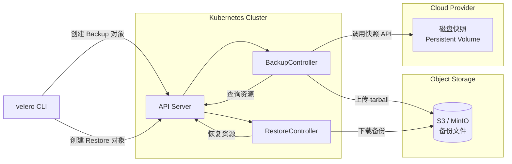
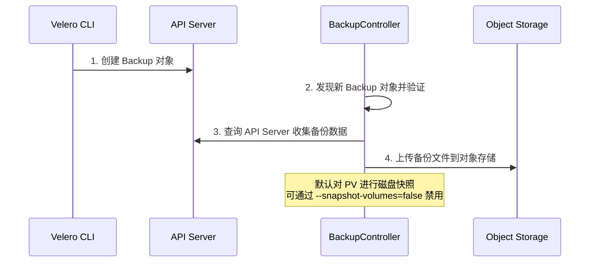

#kubernetes #velero

相关笔记：[[kubernetes-basics]] | [[etcd]]

## Velero 概述

Velero 是一个开源的 Kubernetes 集群备份和恢复工具，支持按需备份、定时备份以及集群迁移。



## 按需备份

备份操作流程：
1. 上传一个包含复制的 Kubernetes 对象的 tarball 到云对象存储
2. 调用云提供商的 API 来对持久卷进行磁盘快照（如果指定）
3. 可以选择在备份期间执行备份钩子（例如告诉数据库将其内存缓冲区刷新到磁盘）

> 注意：集群备份并非严格原子化。如果在备份时创建或编辑了 Kubernetes 对象，它们可能不会包含在备份中。

## 定时备份

定时操作允许在定期间隔内备份数据，间隔时间由 Cron 表达式指定。

Velero 保存从定时任务创建的备份，名称格式为 `<SCHEDULE NAME>-<TIMESTAMP>`，其中 `<TIMESTAMP>` 的格式为 `YYYYMMDDhhmmss`。

## 备份工作流程

当你运行 `velero backup create test-backup` 时：



## 恢复

恢复操作允许从先前创建的备份中恢复所有对象和持久卷。支持：
- 恢复对象和持久卷的过滤子集
- 多个命名空间重新映射（例如 namespace "abc" 恢复到 "def"）

### 恢复工作流程

当你运行 `velero restore create` 时：

1. Velero 客户端调用 Kubernetes API 创建一个 Restore 对象
2. RestoreController 发现新的 Restore 对象并进行验证
3. RestoreController 从对象存储获取备份信息，对备份资源进行预处理（如验证 API 版本兼容性）
4. RestoreController 开始恢复过程，一次恢复每个符合条件的资源

默认情况下，Velero 执行**非破坏性恢复**（不会删除目标集群中的数据）。如果备份中的资源在目标集群中已存在，Velero 将跳过该资源。可通过 `--existing-resource-policy=update` 配置更新策略。

## 备份的 API 版本

Velero 使用 Kubernetes API Server 的每个 group/resource 的首选版本来备份资源。恢复时，目标集群中必须存在相同的 API group/version 才能恢复成功。

例如：如果备份集群中 gizmos 资源的首选版本为 `things/v1`，则恢复时目标集群必须有 `things/v1` 端点（不需要是首选版本，但必须存在）。

## 备份过期（TTL）

创建备份时，可以通过 `--ttl <DURATION>` 指定生存时间。过期后 Velero 会删除：
- 备份资源
- 云对象存储中的备份文件
- 所有持久卷快照
- 所有相关的恢复

```bash
# 设置 TTL 为 24 小时
velero backup create my-backup --ttl 24h0m0s
```

默认 TTL 为 30 天。过期效果在 gc-controller 每小时的对帐循环中应用。

如果备份未能删除，会在备份自定义资源上添加标签 `velero.io/gc-failure=<Reason>`，可能的原因包括：
- `BSLNotFound`: 备份存储位置未找到
- `BSLCannotGet`: 备份存储位置无法从 API 服务器检索
- `BSLReadOnly`: 备份存储位置为只读

## 对象存储同步

Velero 将对象存储视为事实来源（Source of Truth），不断检查以确保始终存在正确的备份资源：
- 如果存储桶中有格式正确的备份文件，但 Kubernetes API 中没有相应的备份资源，Velero 会将信息从对象存储同步到 Kubernetes
- 如果 Kubernetes 中存在已完成的备份对象但在对象存储中不存在，它将从 Kubernetes 中删除（失败或部分失败的备份不会被同步删除）

这使得在集群迁移场景中恢复功能能够工作。

## 常用命令

```bash
# 创建按需备份
velero backup create my-backup

# 创建定时备份（每天凌晨 2 点）
velero schedule create daily-backup --schedule="0 2 * * *"

# 查看备份列表
velero backup get

# 从备份恢复
velero restore create --from-backup my-backup

# 从备份恢复到不同命名空间
velero restore create --from-backup my-backup \
  --namespace-mappings old-ns:new-ns

# 查看恢复状态
velero restore get

# 删除备份
velero backup delete my-backup
```
