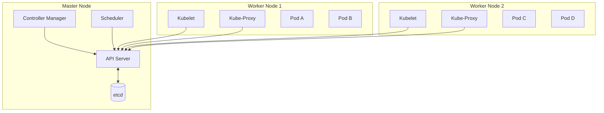
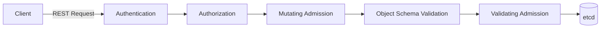
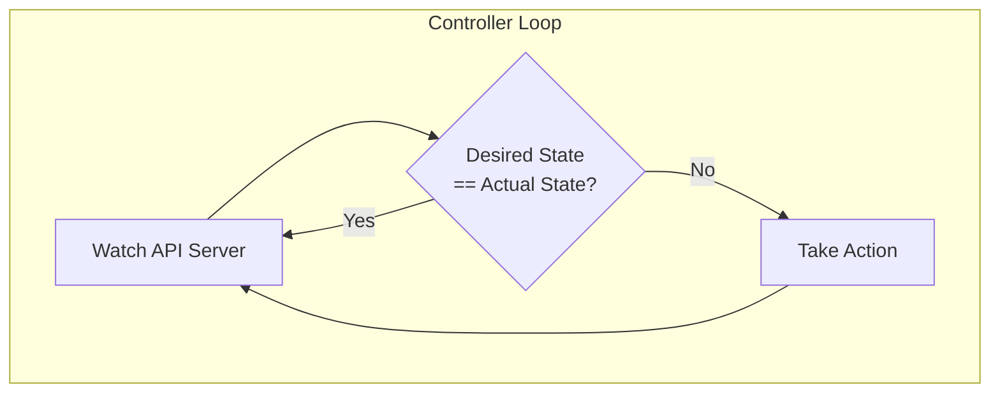

#kubernetes

相关笔记：[[docker-basics]] | [[etcd]] | [[informer]] | [[kubebuilder]] | [[cni]] | [[csi]] | [[k8s-interview]] | [[service]] | [[rbac]] | [[scheduler-deep-dive#关键机制：Assume 与 Bind|Assume 与 Bind]] | [[probes]]

## [[google-borg]]

| Workload | Cell | Job 和 Task | Naming |
| :---: | --- | :---: | :---: |
| prod:在线任务，长期运行、对延时敏感、面向终端用户等，比如Gmail、Google Docs、WebSearch 服务等。 | 一个 Cell 上跑一个集群管理系统 Borg。 | 用户以 Job 的形式提交应用部署请求。一个 Job 包含一个或多个相同的 Task，每个Task 运行相同的应用程序，Task 数量就是应用的副本数。 | Borg的服务发现通过BNS（Borg Name Service）来实现 |
| non-prod:离线任务，也称为批处理任务(Batch)，比如一些分布式计算服务等。 | 通过定义 Cell 可以让Borg 对服务器资源进行统一抽象，作为用户就无需知道自己的应用跑在哪台机器上，也不用关心资源分配、程序安装、依赖管理、健康检查及故障恢复等。 | 每个 Job 可以定义属性、元信息和优先级，涉及到抢占式调度过程。 | 50.jfoo.ubar.cc.borggoogle.com 可表示在一个名为 cc 的 Cell中由用户 uBar 部署名为 jFoo 的 Job下的第50个 Task。 |

## 什么是 Kubernetes

Kubernetes 是谷歌开源的容器集群管理系统，是 Google 多年大规模容器管理技术 Borg 的开源版本，主要功能包括:
- 基于容器的应用部署、维护和滚动升级
- 负载均衡和服务发现
- 跨机器和跨地区的集群调度
- 自动伸缩
- 无状态服务和有状态服务
- 插件机制保证扩展性

![[Kubernetes架构具体.png|750*]]

![[Kubernetes 集群.png]]

## Kubernetes 整体架构



## Kubernetes: 声明式系统

Kubernetes 的所有管理能力构建在对象抽象的基础上，核心对象包括:
- **Node**: 计算节点的抽象，用来描述计算节点的资源抽象、健康状态等
- **[[namespace]]**: 资源隔离的基本单位，可以简单理解为文件系统中的目录结构
- **Pod**: 用来描述应用实例，包括镜像地址、资源需求等。Kubernetes 中最核心的对象，也是打通应用和基础架构的秘密武器
- **Service**: 服务如何将应用发布成服务，本质上是负载均衡和域名服务的声明

## [[etcd]]

etcd 是 CoreOS 基于 Raft 开发的分布式 key-value 存储，可用于服务发现、共享配置以及一致性保障(如数据库选主、分布式锁等)。
- 基本的 key-value 存储
- watch 监听机制
- key 的过期及续约机制，用于监控和服务发现
- 原子 CAS 和 CAD，用于分布式锁和 leader 选举

## APIServer

Kube-APIServer 是 Kubernetes 最重要的核心组件之一，主要提供以下功能：
- 提供集群管理的 REST API 接口，包括:
	- 认证 Authentication
	- 授权 Authorization
	- 准入 Admission（Mutating & Validating）
- 提供其他模块之间的数据交互和通信的枢纽（其他模块通过 APIServer 查询或修改数据，只有 APIServer 才直接操作 etcd）
- APIServer 提供 etcd 数据缓存以减少集群对 etcd 的访问



![[APIServer展开 1.png]]

## Controller Manager

- Controller Manager 是集群的大脑，是确保整个集群动起来的关键
- 作用是确保 Kubernetes 遵循声明式系统规范，确保系统的真实状态（Actual State）与用户定义的期望状态（Desired State）一致
- Controller Manager 是多个控制器的组合，每个 Controller 事实上都是一个 control loop，负责侦听其管控的对象，当对象发生变更时完成配置
- Controller 配置失败通常会触发自动重试，整个集群会在控制器不断重试的机制下确保最终一致性（Eventual Consistency）



## Informer 的内部机制

![[Informer的内部机制.png]]

## 控制器协同工作

![[协同器工作原理.png]]

查看文件的 hash 值和原来比对不一样，控制器就认为改变了

### Scheduler

特殊的 Controller，工作原理与其他控制器无差别。

Scheduler 的特殊职责在于监控当前集群所有未调度的 Pod，并且获取当前集群所有节点的健康状况和资源使用情况，为待调度 Pod 选择最佳计算节点，完成调度。

调度阶段分为:
1. **Predicate（预选）**: 过滤不能满足业务需求的节点，如资源不足、端口冲突等
2. **Priority（优选）**: 按既定要素将满足调度需求的节点评分，选择最佳节点
3. **Bind（绑定）**: 将计算节点与 Pod 绑定，完成调度

## Kubelet

Kubernetes 的初始化系统（init system）
- 从不同源获取 Pod 清单，并按需求启停 Pod 的核心组件:
	- Pod 清单可从本地文件目录、给定的 HTTPServer 或 Kube-APIServer 等源头获取
	- Kubelet 将运行时、网络和存储抽象成了 CRI、CNI、CSI
- 负责汇报当前节点的资源信息和健康状态
- 负责 Pod 的健康检查和状态汇报

## Kube-Proxy

- 监控集群中用户发布的服务，并完成负载均衡配置
- 每个节点的 Kube-Proxy 都会配置相同的负载均衡策略，使得整个集群的服务发现建立在分布式负载均衡器之上，服务调用无需经过额外的网络跳转（Network Hop）
- 负载均衡配置基于不同插件实现:
	- userspace
	- 操作系统网络协议栈不同的 Hooks 点和插件:
		- iptables
		- ipvs

## 推荐的 Add-ons

- **kube-dns**: 负责为整个集群提供 DNS 服务
- **Ingress Controller**: 为服务提供外网入口
- **MetricsServer**: 提供资源监控
- **Dashboard**: 提供 GUI
- **Fluentd-Elasticsearch**: 提供集群日志采集、存储与查询

## Kubectl 命令和 kubeconfig

- kubectl 是一个 Kubernetes 的命令行工具，它允许 Kubernetes 用户以命令行的方式与 Kubernetes 交互，其默认读取配置文件 `~/.kube/config`
- kubectl 会将接收到的用户请求转化为 REST 调用以 REST client 的形式与 apiserver 通讯
- apiserver 的地址、用户信息等配置在 kubeconfig

### 常用命令

```bash
# 查看资源（多种输出格式）
kubectl get pods -oyaml          # YAML 格式输出
kubectl get pods -owide          # 显示更多列（IP、Node 等）
kubectl get pods -w              # Watch 模式，实时监控变化

# 查看资源详情
kubectl describe pod <pod-name>

# 进入容器
kubectl exec -it <pod-name> -- bash

# 查看日志
kubectl logs <pod-name> -f       # -f 实时跟踪日志
kubectl logs <pod-name> -c <container>  # 指定容器
```

## 面试要点

### 高频问题

**Q: Kubernetes 的核心组件有哪些？分别部署在哪里？**

> [!question]- 参考答案（点击展开）
>
> Master（control plane）组件包括 kube-apiserver、etcd、kube-controller-manager、kube-scheduler；每个 Worker Node 上运行 kubelet 和 kube-proxy。其中只有 APIServer 直接读写 etcd，其余组件都通过 APIServer 间接访问数据，APIServer 是整个集群的通信枢纽。

**Q: 一次 `kubectl create` 请求经过 APIServer 时会经历哪些处理阶段？**

> [!question]- 参考答案（点击展开）
>
> 依次是 Authentication（认证身份）、Authorization（鉴权，判断是否有权限，典型用 RBAC）、Mutating Admission（变更准入，可注入默认值/sidecar）、Object Schema Validation（schema 校验）、Validating Admission（验证准入），最后才写入 etcd。Mutating 在 Validating 之前，因为要先修改对象再做最终校验。

**Q: 什么是声明式系统（Declarative）？Controller 如何保证最终一致性？**

> [!question]- 参考答案（点击展开）
>
> 用户只描述期望状态（Desired State），不关心如何达成。Controller Manager 由多个 Controller 组成，每个 Controller 是一个 control loop，持续 watch 对象，对比 Desired State 与 Actual State，不一致就采取动作（reconcile）。配置失败会自动重试，因此集群在不断重试中达到 Eventual Consistency，而非强一致。

**Q: Scheduler 的调度流程分哪几个阶段？**

> [!question]- 参考答案（点击展开）
>
> 分三步：Predicate（预选）过滤掉不满足需求的节点，如资源不足、端口冲突、节点亲和性不匹配；Priority（优选）对剩余节点打分排序，选出最优节点；Bind（绑定）把 Pod 与目标节点绑定写回 APIServer。Scheduler 本质也是一个特殊的 Controller，它 watch 所有未调度（spec.nodeName 为空）的 Pod。

**Q: etcd 在 Kubernetes 中扮演什么角色？为什么选 etcd？**

> [!question]- 参考答案（点击展开）
>
> etcd 是 CoreOS 基于 Raft 开发的分布式 key-value 存储，保存集群所有对象的状态，是唯一的持久化数据源（source of truth）。它提供 watch 监听机制（Informer 的底层基础）、key 的过期及续约（lease）、原子 CAS/CAD（支持分布式锁与 leader 选举），强一致性保证了集群状态的可靠性。

**Q: kube-proxy 有哪几种代理模式？它们有什么区别？**

> [!question]- 参考答案（点击展开）
>
> 主要有 userspace、iptables、ipvs 三种（新版本另有 nftables 模式，1.31 起 beta、1.33 GA，目标是替代 iptables）。userspace 性能最差已基本废弃；iptables 用 Netfilter 规则做 NAT，规则数随 Service 数线性增长、匹配是 O(n)；ipvs 基于内核 LVS，用哈希表查找，大规模 Service 场景下性能和延迟明显优于 iptables。每个节点的 kube-proxy 配置相同策略，构成分布式负载均衡，服务调用无需额外 network hop。

**Q: Kubelet 的主要职责是什么？CRI/CNI/CSI 是什么？**

> [!question]- 参考答案（点击展开）
>
> Kubelet 是节点上的"init system"，从 APIServer、本地静态文件目录或 HTTP server 获取 Pod 清单，按需启停 Pod，并上报节点资源与 Pod 健康状态（执行 liveness/readiness/startup probe）。它把运行时、网络、存储抽象成三个标准接口：CRI（Container Runtime Interface，如 containerd）、CNI（网络）、CSI（存储），实现可插拔。

### 面试加分点

- 能点出 Kubernetes 源自 Google 的 Borg：Borg 中的 Cell 对应集群、Job 对应一组相同副本的 Task，这种"用户只提交期望、平台负责调度与故障恢复"的思想直接演化为 K8s 的声明式 API 与 Pod 副本模型。
- 理解 APIServer 的缓存层：APIServer 对 etcd 数据做缓存（watch cache），各组件通过 Informer 的 List-Watch 从 APIServer 获取增量事件，大幅降低对 etcd 的直接压力；Informer 内部由 Reflector、DeltaFIFO、Indexer/Local Store 组成。
- 区分 Mutating 与 Validating Admission 的顺序和用途：Mutating 可以改对象（注入默认值、sidecar 注入用的就是 MutatingWebhook），Validating 只能拒绝不能改；放在 schema validation 两侧保证既能改又能在改后做最终校验。
- 能解释为什么 Controller 用 control loop + 重试而不是事务：分布式环境下外部系统不可靠，level-triggered（基于当前状态对账）比 edge-triggered（基于事件）更健壮，即使丢事件也能在下一轮 reconcile 中纠正，这是 K8s 容错的核心设计哲学。
- 了解控制器靠对比对象的实际内容（如配置 hash）判断是否变更，避免无意义的重复 reconcile，体现幂等设计。
- 知道大规模集群的优化方向：kube-proxy 用 ipvs/nftables 替代 iptables、Scheduler 用调度框架（Scheduling Framework）扩展插件、APIServer 开启 watch cache 与 APF（API Priority and Fairness）限流。
