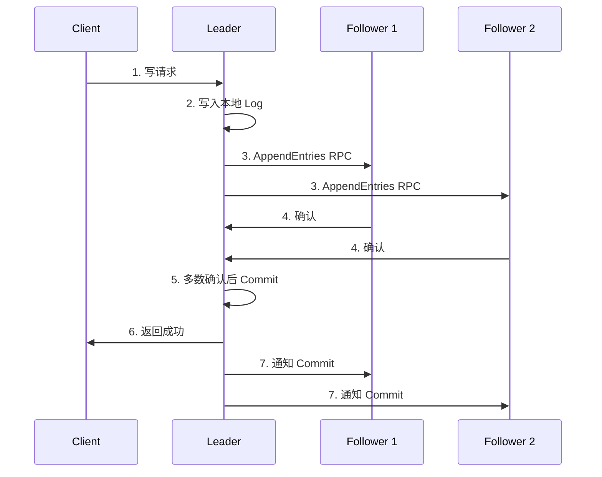

#etcd

相关笔记：[[kubernetes-basics]] | [[informer]] | [[api-resource]]

## Etcd 概述

Etcd 是 CoreOS 基于 Raft 开发的分布式 key-value 存储，可用于服务发现、共享配置以及一致性保障（如数据库选主、分布式锁等）。

在分布式系统中如何管理节点间的状态一直是一个难题，etcd 专门为集群环境的服务发现和注册而设计，它提供了数据 TTL 失效、数据改变监视、多值、目录监听、分布式锁原子操作等功能，可以方便地跟踪并管理集群节点的状态。

### 核心特性

- **键值对存储**: 将数据存储在分层组织的目录中，如同在标准文件系统中
- **监测变更**: 监测特定的键或目录以进行更改，并对值的更改做出反应
- **简单**: curl 可访问的用户 API（HTTP+JSON）
- **安全**: 可选的 SSL 客户端证书认证
- **快速**: 单实例每秒 1000 次写操作，2000+ 次读操作
- **可靠**: 使用 Raft 算法保证一致性

## 键值对存储

etcd 是一个键值存储的组件，其他的应用都是基于其键值存储的功能展开。
- 采用 kv 型数据存储，一般情况下比关系型数据库快
- 支持动态存储（内存）以及静态存储（磁盘）
- 分布式存储，可集成为多节点集群
- 存储方式采用类似目录结构（B+tree）
	- 只有叶子节点才能真正存储数据，相当于文件
	- 叶子节点的父节点一定是目录，目录不能存储数据

## 服务注册与发现

- **强一致性、高可用的服务存储目录**: 基于 Raft 算法的 etcd 天生就是强一致性、高可用的服务存储目录
- **注册服务和健康状况监控**: 用户可以在 etcd 中注册服务，并对注册的服务配置 key TTL，定时保持服务的心跳以达到监控健康状态的效果

## 消息发布与订阅

在分布式系统中，最适用的一种组件间通信方式就是消息发布与订阅。即构建一个配置共享中心，数据提供者在这个配置中心发布消息，而消息使用者则订阅他们关心的主题，一旦主题有消息发布，就会实时通知订阅者。

通过这种方式可以做到分布式系统配置的集中式管理与动态更新：
- 应用中用到的一些配置信息放到 etcd 上进行集中管理
- 应用在启动的时候主动从 etcd 获取一次配置信息，同时在 etcd 节点上注册一个 Watcher 并等待
- 以后每次配置有更新的时候，etcd 都会实时通知订阅者，以此达到获取最新配置信息的目的

## 核心机制: TTL & CAS

### TTL（Time To Live）

给一个 key 设置一个有效期，到期后这个 key 就会被自动删掉，这在很多分布式锁的实现上都会用到，可以保证锁的实时有效性。

### CAS（Atomic Compare-and-Swap）

在对 key 进行赋值的时候，客户端需要提供一些条件，当这些条件满足后，才能赋值成功。这些条件包括：
- **prevExist**: key 当前赋值前是否存在
- **prevValue**: key 当前赋值前的值
- **prevIndex**: key 当前赋值前的 Index

这样 key 的设置是有前提的，需要知道这个 key 当前的具体情况才可以对其设置。

## Raft 协议

[Raft 可视化](https://thesecretlivesofdata.com/raft/)

## 写入数据流程

![[etcd写入数据.png]]

## Watch 机制

etcd v3 的 watch 机制支持 watch 某个固定的 key，也支持 watch 一个范围（可以用于模拟目录结构的 watch）。

watchGroup 包含两种 watcher:
- **key watchers**: 数据结构是每个 key 对应一组 watcher
- **range watchers**: 数据结构是一个 IntervalTree，方便通过区间查找到对应的 watcher

每个 WatchableStore 包含两种 watcherGroup:
- **synced**: 该 group 的 watcher 数据都已经同步完毕，在等待新的变更
- **unsynced**: 该 group 的 watcher 数据同步落后于当前最新变更，还在追赶

当 etcd 收到客户端的 watch 请求，如果请求携带了 revision 参数，则比较请求的 revision 和 store 当前的 revision，如果大于当前 revision，则放入 synced 组中，否则放入 unsynced 组。同时 etcd 会启动一个后台的 goroutine 持续同步 unsynced 的 watcher，然后将其迁移到 synced 组。

etcd v3 支持从任意版本开始 watch，没有 v2 的 1000 条历史 event 限制的问题（在没有 compact 的情况下）。

## etcd 在 Kubernetes 中的位置

![[etcd在kubernetes所处的位置.png]]

![[Kubernetes如何使用etcd.png]]

K8s 中支持将配置写到不同的 etcd 中（例如将频繁变更的数据放到另一个节点中）。

## etcd 在 K8s 中的实践

### 部署拓扑

![[etcd在k8s中堆叠式.png]]

![[外部etcd集群的高可用拓扑.png]]

### 运维最佳实践

![[etcd与apiserve通讯.png]]

![[etcdstorage最佳实践.png]]

![[etcd安全性.png]]

![[etcd数据中心.png]]

![[etcd磁盘io.png]]

![[etcd日志.png]]

![[etcd备份.png]]
