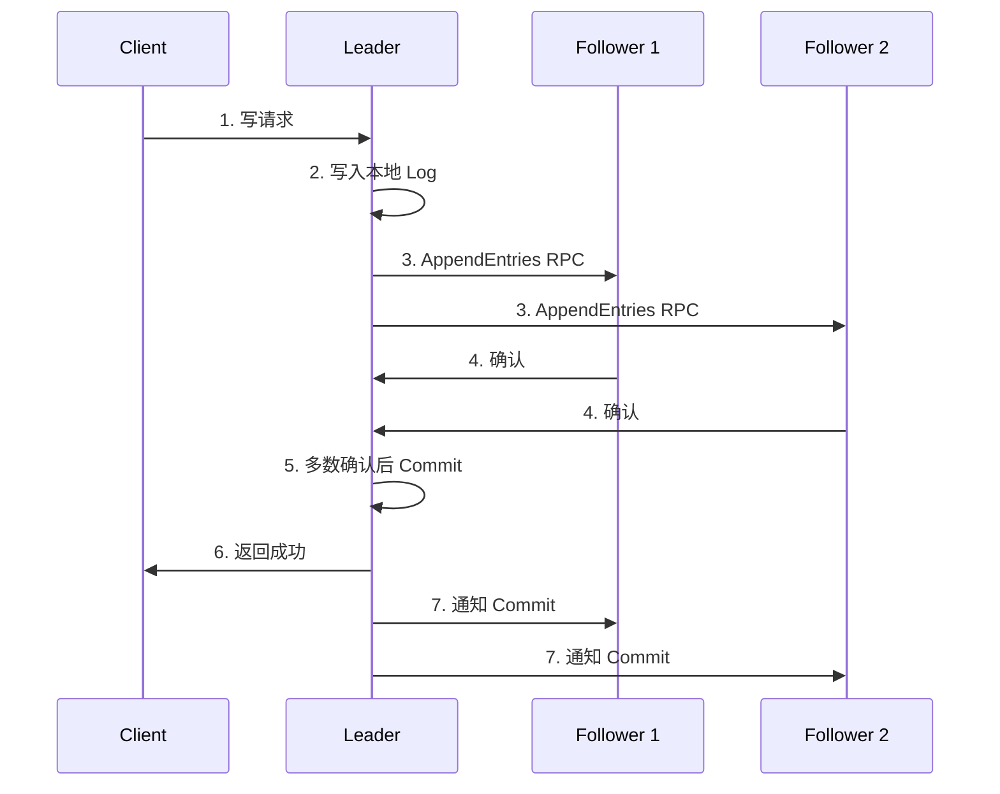

#etcd

相关笔记：[[kubernetes-basics]] | [[informer]] | [[api-resource]]

## Etcd 概述

Etcd 是 CoreOS 基于 Raft 开发的分布式 key-value 存储，可用于服务发现、共享配置以及一致性保障（如数据库选主、分布式锁等）。

在分布式系统中如何管理节点间的状态一直是一个难题，etcd 专门为集群环境的服务发现和注册而设计，它提供了数据 TTL 失效、数据改变监视、多值、目录监听、分布式锁原子操作等功能，可以方便地跟踪并管理集群节点的状态。

### 核心特性

- **键值对存储**: 将数据存储在分层组织的目录中，如同在标准文件系统中
- **监测变更**: 监测特定的键或目录以进行更改，并对值的更改做出反应
- **简单**: curl 可访问的用户 API（HTTP+JSON）
- **安全**: 可选的 SSL 客户端证书认证
- **快速**: 单实例每秒 1000 次写操作，2000+ 次读操作
- **可靠**: 使用 Raft 算法保证一致性

## 键值对存储

etcd 是一个键值存储的组件，其他的应用都是基于其键值存储的功能展开。
- 采用 kv 型数据存储，一般情况下比关系型数据库快
- 支持动态存储（内存）以及静态存储（磁盘）
- 分布式存储，可集成为多节点集群
- 存储方式采用类似目录结构（B+tree）
	- 只有叶子节点才能真正存储数据，相当于文件
	- 叶子节点的父节点一定是目录，目录不能存储数据

## 服务注册与发现

- **强一致性、高可用的服务存储目录**: 基于 Raft 算法的 etcd 天生就是强一致性、高可用的服务存储目录
- **注册服务和健康状况监控**: 用户可以在 etcd 中注册服务，并对注册的服务配置 key TTL，定时保持服务的心跳以达到监控健康状态的效果

## 消息发布与订阅

在分布式系统中，最适用的一种组件间通信方式就是消息发布与订阅。即构建一个配置共享中心，数据提供者在这个配置中心发布消息，而消息使用者则订阅他们关心的主题，一旦主题有消息发布，就会实时通知订阅者。

通过这种方式可以做到分布式系统配置的集中式管理与动态更新：
- 应用中用到的一些配置信息放到 etcd 上进行集中管理
- 应用在启动的时候主动从 etcd 获取一次配置信息，同时在 etcd 节点上注册一个 Watcher 并等待
- 以后每次配置有更新的时候，etcd 都会实时通知订阅者，以此达到获取最新配置信息的目的

## 核心机制: TTL & CAS

### TTL（Time To Live）

给一个 key 设置一个有效期，到期后这个 key 就会被自动删掉，这在很多分布式锁的实现上都会用到，可以保证锁的实时有效性。

### CAS（Atomic Compare-and-Swap）

在对 key 进行赋值的时候，客户端需要提供一些条件，当这些条件满足后，才能赋值成功。这些条件包括：
- **prevExist**: key 当前赋值前是否存在
- **prevValue**: key 当前赋值前的值
- **prevIndex**: key 当前赋值前的 Index

这样 key 的设置是有前提的，需要知道这个 key 当前的具体情况才可以对其设置。

## Raft 协议

[Raft 可视化](https://thesecretlivesofdata.com/raft/)

## 写入数据流程

![[etcd写入数据.png]]

## Watch 机制

etcd v3 的 watch 机制支持 watch 某个固定的 key，也支持 watch 一个范围（可以用于模拟目录结构的 watch）。

watchGroup 包含两种 watcher:
- **key watchers**: 数据结构是每个 key 对应一组 watcher
- **range watchers**: 数据结构是一个 IntervalTree，方便通过区间查找到对应的 watcher

每个 WatchableStore 包含两种 watcherGroup:
- **synced**: 该 group 的 watcher 数据都已经同步完毕，在等待新的变更
- **unsynced**: 该 group 的 watcher 数据同步落后于当前最新变更，还在追赶

当 etcd 收到客户端的 watch 请求，如果请求携带了 revision 参数，则比较请求的 revision 和 store 当前的 revision，如果大于当前 revision，则放入 synced 组中，否则放入 unsynced 组。同时 etcd 会启动一个后台的 goroutine 持续同步 unsynced 的 watcher，然后将其迁移到 synced 组。

etcd v3 支持从任意版本开始 watch，没有 v2 的 1000 条历史 event 限制的问题（在没有 compact 的情况下）。

## etcd 在 Kubernetes 中的位置

![[etcd在kubernetes所处的位置.png]]

![[Kubernetes如何使用etcd.png]]

K8s 中支持将配置写到不同的 etcd 中（例如将频繁变更的数据放到另一个节点中）。

## etcd 在 K8s 中的实践

### 部署拓扑

![[etcd在k8s中堆叠式.png]]

![[外部etcd集群的高可用拓扑.png]]

### 运维最佳实践

![[etcd与apiserve通讯.png]]

![[etcdstorage最佳实践.png]]

![[etcd安全性.png]]

![[etcd数据中心.png]]

![[etcd磁盘io.png]]

![[etcd日志.png]]

![[etcd备份.png]]

## 面试要点

### 高频问题

**Q: Kubernetes 为什么选择 etcd 作为存储后端？**
A: etcd 基于 Raft 协议提供强一致性（线性一致读）和高可用，天然适合存储集群元数据这类对一致性要求极高的数据。它原生支持 Watch 机制，APIServer 可以通过 Watch 实时感知数据变更并推送给 Informer，这是 K8s 声明式控制循环（list-watch）的基石。同时它提供 MVCC、TTL（lease）、事务（txn）等能力，满足注册、配置、选主等场景。

**Q: etcd 用 Raft 是如何保证数据一致性的？写入流程是怎样的？**
A: 写请求统一路由到 Leader，Leader 先把操作写入本地 Raft Log，再通过 AppendEntries RPC 复制给 Follower；当多数派（quorum，即 (N/2)+1 个节点）确认后，Leader 才 Commit 并应用到状态机，然后返回客户端成功并通知 Follower 提交。因此只要多数节点存活就能正常工作，3 节点容忍 1 个故障，5 节点容忍 2 个。

**Q: etcd v3 相比 v2 在 Watch 机制上有哪些改进？**
A: v2 基于 HTTP long-polling 且只保留固定 1000 条历史 event（超出窗口的 revision 被清除后会返回 EventIndexCleared/“too old event” 错误，需要重新 GET 再续 watch）；v3 改用 gRPC 双向流，支持从任意历史 revision 开始 watch（未 compact 的前提下），且支持 range watch（基于 IntervalTree 实现区间/前缀监听）。WatchableStore 把 watcher 分为 synced 和 unsynced 两组，后台 goroutine 持续把落后的 unsynced watcher 追平后迁入 synced 组。

**Q: TTL 和 CAS 分别解决什么问题，常用于哪些场景？**
A: TTL 给 key 设置有效期，到期自动删除，常用于服务健康检测（定时续约保活）和分布式锁的自动释放，避免持锁进程崩溃导致死锁。CAS（Compare-and-Swap）是带前置条件（prevExist / prevValue / prevIndex）的原子赋值，只有条件满足才写入成功，是实现分布式锁、leader 选举和乐观并发控制的核心原语。

**Q: 在 Kubernetes 集群中，etcd 有哪几种部署拓扑？各有什么权衡？**
A: 主要分两种：堆叠式（stacked），etcd 与 control-plane 组件同节点部署，节省机器但故障域耦合，一个节点宕机同时损失一个 etcd 成员和一套控制面；外部式（external），etcd 独立集群部署，故障隔离更好、运维更清晰，但需要更多机器。生产高可用一般部署奇数个（3 或 5）成员，避免脑裂并优化 quorum。

**Q: etcd 的性能瓶颈通常在哪里？如何优化？**
A: etcd 对磁盘 IO 极其敏感，因为每次 commit 都要 fsync 持久化 WAL，磁盘 fsync 延迟直接决定写延迟，因此强烈建议使用 SSD 并保证较低的磁盘延迟。其次是网络延迟（影响 Raft 复制 RPC），跨数据中心部署会显著拉高写延迟。此外要监控 DB 大小，及时 compact 历史 revision 并 defrag 回收空间，避免触及空间配额（quota-backend-bytes，默认 2GB，8GB 是官方建议的上限）触发 NOSPACE 告警导致集群转为只读。

**Q: etcd 如何做备份与恢复？为什么重要？**
A: etcd 存储了整个集群的所有状态，一旦数据丢失等于集群被毁，因此必须定期快照备份。可用 `etcdctl snapshot save` 生成快照，恢复时用 `etcdctl snapshot restore` 重建数据目录后重启成员。备份与恢复时应配合 SSL/TLS 证书做安全访问，并将快照异地存储；恢复后需注意 member 列表和集群 ID 的一致性。

### 面试加分点

- 能说清 etcd v3 的 MVCC 模型：每次修改生成新的 revision，key 的多个版本通过 revision 索引，配合后台 compaction 回收旧版本，这正是 v3 支持任意历史版本 watch 和一致性快照读的底层基础。
- 理解 lease 机制：v3 用 lease 替代 v2 的单 key TTL，多个 key 可绑定同一 lease 共享生命周期，客户端通过 KeepAlive 续约，是 K8s 中实现 Lease 对象（如组件心跳、leader-election）的底层支撑。
- 清楚 quorum 与脑裂：写必须多数派确认，所以推荐奇数节点；偶数节点不仅不提升容错能力（4 节点和 3 节点都只容忍 1 个故障），还增加了多数派达成成本。
- 能区分线性一致读与串行读：etcd 默认提供线性一致读（需经过 Raft ReadIndex 确认 Leader 身份，保证读到最新已提交数据），而 serializable 读直接读本地状态机，延迟低但可能读到稍旧数据。
- 知道 etcd 是 APIServer 唯一的有状态依赖，所有其他 control-plane 组件都是无状态的，这也是为什么 etcd 的高可用和备份是整个 K8s 集群可靠性的关键。
- 了解可以为不同资源配置独立的 etcd（如把 Events 这类高频变更数据拆到单独 etcd 集群），减轻主 etcd 压力，提升整体稳定性。
