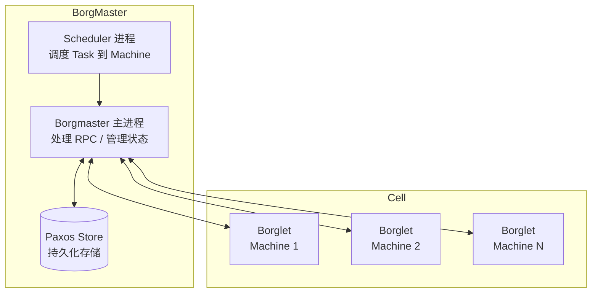

#borg

相关笔记：[[kubernetes-basics]]

## Google Borg 概述

Borg 是 Google 内部的大规模集群管理系统，Kubernetes 的前身。它管理着 Google 数万台服务器上的数十万个 Job，是 Google 基础设施的核心。

## Borg 架构

### Borgmaster

Borgmaster 主进程:
- 处理客户端 RPC 请求，比如创建 Job，查询 Job 等
- 维护系统组件和服务的状态，比如服务器、Task 等
- 负责与 Borglet 通信

Borgmaster 包含两类进程：主 Borgmaster 进程和分离的调度器进程。主 Borgmaster 进程处理客户端 RPC；管理系统中所有对象 Object 的状态机，包括 machines、tasks、allocs；与 Borglet 通信；提供 WebUI。

Borgmaster 逻辑上一个进程，但是拥有 5 个副本。每个副本维护 cell 状态的一份内存副本，cell 状态同时在高可用、分布式、基于 Paxos 的存储系统中做本地磁盘持久化存储。一个单一的被选举 master 既是 Paxos leader，也是状态管理者。选举机制按照 **Paxos 算法**流程进行。

> Borgmaster 基于高可用、分布式、基于 Paxos 的存储系统进行元数据持久化和热备份，以此实现 Borg 系统的高可用。开源界 etcd 最近比较火，但是 etcd 没有采用 Paxos 算法，而是使用更为简单且易于理解的 **Raft**。

Borgmaster 的状态会定时设置 checkpoint，具体形式就是在 Paxos store 中存储周期性的镜像 snapshot 和增量更改日志。

### Scheduler 进程

调度策略:
- **Worst Fit**: 将任务分散到不同的机器上
- **Best Fit**: 尽量"紧凑"地使用机器，以减少资源碎片
- **Hybrid**: 混合模型，尽量减少"受困资源"

调度优化:
- **Score caching**: 当服务器或者任务的状态未发生变更或者变更很少时，直接采用缓存数据，避免重复计算
- **Equivalence classes**: 调度同一 Job 下多个相同的 Task 只需计算一次
- **Relaxed randomization**: 引入一些随机性，每次随机选择一些机器，只要符合需求的服务器数量达到一定值时，就可以停止计算

### 调度 Scheduling 流程

当作业被提交，Borgmaster 将其记录到 Paxos store 中，并将作业的任务增加到等待队列中。调度器异步浏览该队列，并将任务分配给机器。调度算法包括两个部分：
1. **可行性检查（Feasibility Checking）**: 找到满足任务约束、具备足够可用资源的一组机器
2. **打分（Scoring）**: 在"可行机器"中根据用户偏好为机器打分（如挑选具有任务软件包的机器、分散任务到不同的失败域中）

### Borglet

Borglet 是部署在所有服务器上的 Agent，负责接收 Borgmaster 进程的指令。

- Borgmaster 会周期性地向每一个 Borglet 拉取当前状态，这样更易于控制通信速度，避免"恢复风暴"
- 为了性能可扩展性，每个 Borgmaster 副本会运行一个无状态的 link shard 去处理与部分 Borglet 通信
- 如果 Borglet 多轮没有响应资源查询，则会被标记为 down，运行其上的任务会被重新调度到其他机器

![[Borg架构.png]]

## 可用性 Availability

1. 自动重新调度被驱逐的任务
2. 为了降低相关失败，将任务分散到不同的失败域中
3. 限制一个作业中任务的个数和中断率
4. 限制任务重新调度的速率，因为不能区分大规模机器故障和网络分区
5. 避免引发错误的任务-机器匹配对
6. 关键数据持久化，写入磁盘

## 利用率 Utilization

混合部署（prod 负载和 non-prod 负载）比独立部署具有更高的利用率。

![[混合部署（prod负载和non-prod负载）.png]]

提高集群利用率的方法：
- **Cell sharing**: 共享 Cell 资源
- **Large cell**: 使用大 Cell
- **Fine-grained resource requests**: 细粒度资源请求
- **Resource reclamation**: 资源回收

### Resource Reclamation（资源回收）

一个 Job 可以定义一个资源上限（resource limit），Borg 会 kill 掉一个尝试使用更多 RAM 和 disk 空间资源（相比于其申请的资源）的 task，或者节流 CPU 资源。

> 用户总是会出于"心理安全"和负载高峰波动等原因，申请较多的资源，但大部分时候，任务不会真正使用如此之多的资源，这就造成了资源浪费。

对于可以容忍低质量资源的工作（例如批处理作业），Borg 会评估任务将使用的资源，并回收空闲资源。评估过程称为任务预留（task reservation），最初的预留值与其资源请求一致，然后 300 秒之后，会慢慢降低到实际使用率外加一个安全边缘。

## 隔离 Isolation

### 安全性隔离
- 早期采用 Chroot jail，后期版本基于 [[namespace]]

### 性能隔离
- 采用基于 [[cgroup]] 的容器技术实现
- 在线任务（prod）是延时敏感（latency-sensitive）型的，优先级高，而离线任务（non-prod/Batch）优先级低
- Borg 通过不同优先级之间的抢占式调度来优先保障在线任务的性能，牺牲离线任务
- Borg 将资源类型分成两类:
	- **可压榨的（compressible）**: CPU 是可压资源，资源耗尽不会终止进程
	- **不可压榨的（non-compressible）**: 内存是不可压资源，资源耗尽进程会被终止
