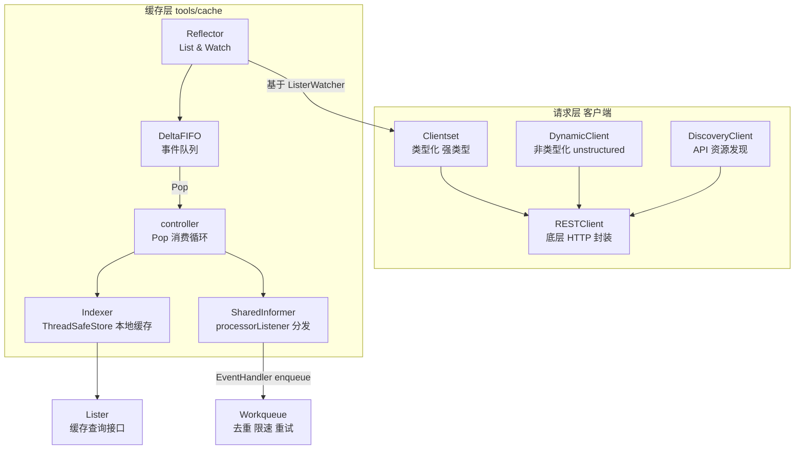
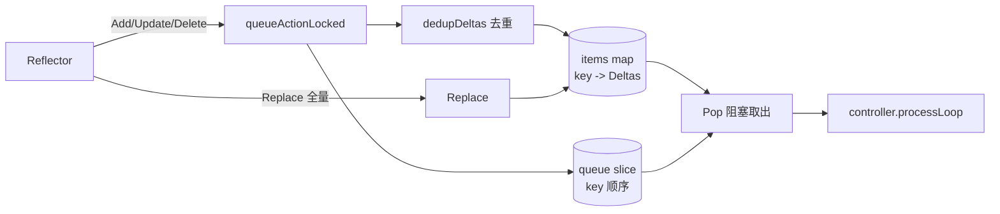
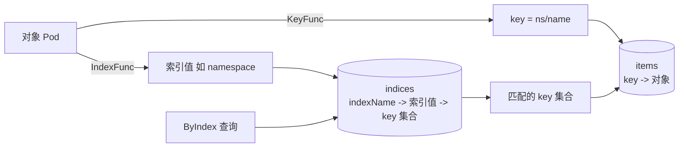
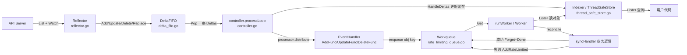

#kubernetes #client-go #源码导读

相关笔记：[[informer]] | [[kubebuilder]] | [[operator-pattern]] | [[k8s-interview]] | [[k8s-development-roadmap]] | [[demo-sample-controller]]

## 概述

client-go 是 Kubernetes 官方提供的 Go 语言客户端库，是编写 Controller、Operator 的基石。它向上提供 RESTClient/Clientset/DynamicClient/DiscoveryClient 等多种访问 API Server 的方式，向下通过 `tools/cache` 包实现了一整套 List-Watch 缓存机制：Reflector 负责与 API Server 通信并把事件灌入 DeltaFIFO，Controller 从 DeltaFIFO 中 Pop 出 Delta 并同步到 Indexer（本地缓存），同时回调用户注册的 EventHandler；SharedInformer 让多个控制器共享同一份缓存与 Watch 连接；Workqueue 提供去重、限速、重试能力，把事件处理与缓存更新解耦。本文按源码模块逐层走读 client-go 在 `staging/src/k8s.io/client-go/` 下的关键实现，最后给出标准自定义控制器骨架。

> 源码路径以 kubernetes/kubernetes 仓库为准，根目录为 `staging/src/k8s.io/client-go/`（独立发布时即 `k8s.io/client-go/`），下文路径均省略该前缀。

## client-go 整体架构

client-go 大致分为两层：上层是对 API Server 的「请求层」客户端，下层是 `tools/cache` 提供的「缓存层」List-Watch 机制。



### 请求层客户端

| 客户端                 | 包路径                       | 说明                                                                                                            |
| ------------------- | ------------------------- | ------------------------------------------------------------------------------------------------------------- |
| **RESTClient**      | `rest/`                   | 最底层，封装 HTTP 动词（Get/Post/Put/Delete/Watch），处理认证、序列化、限流（`rest.Config` + `flowcontrol.RateLimiter`）。其他客户端都基于它构建。 |
| **Clientset**       | `kubernetes/clientset.go` | 强类型客户端，按 Group/Version 划分（`CoreV1()`、`AppsV1()`…），返回 `*v1.Pod` 等具体类型。编译期类型安全，最常用。                             |
| **DynamicClient**   | `dynamic/`                | 非类型化客户端，操作 `unstructured.Unstructured`（本质是 `map[string]interface{}`），无需编译期类型，适合处理 CRD 与通用工具。                  |
| **DiscoveryClient** | `discovery/`              | 发现 API Server 支持的 GroupVersion 与 Resource 列表（`kubectl api-resources` 背后即它），用于 RESTMapper、版本协商。                |

```go
// 构建 Clientset 的典型流程
config, _ := clientcmd.BuildConfigFromFlags("", kubeconfig) // 或 rest.InClusterConfig()
clientset, _ := kubernetes.NewForConfig(config)
pods, _ := clientset.CoreV1().Pods("default").List(ctx, metav1.ListOptions{})
```

### 缓存层 tools/cache

`tools/cache` 是 Informer 机制的核心实现目录，关键文件：

| 文件                                 | 职责                                         |
| ---------------------------------- | ------------------------------------------ |
| `tools/cache/reflector.go`         | Reflector：执行 List+Watch，维护 ResourceVersion |
| `tools/cache/delta_fifo.go`        | DeltaFIFO：有序事件队列，去重                        |
| `tools/cache/controller.go`        | controller：驱动 Reflector + Pop 循环           |
| `tools/cache/shared_informer.go`   | SharedIndexInformer / processorListener    |
| `tools/cache/store.go`             | Store/Indexer 接口、KeyFunc                   |
| `tools/cache/thread_safe_store.go` | ThreadSafeStore：带索引的并发安全 map               |
| `tools/cache/index.go`             | Indexers/Indices 索引实现                      |

## Reflector：List-Watch 引擎

Reflector 是缓存的「数据源」，负责通过 `ListerWatcher` 接口与 API Server 通信，把对象变化写入 DeltaFIFO（即 `Reflector.store`）。

### 核心结构

```go
// tools/cache/reflector.go
type Reflector struct {
    name          string
    expectedType  reflect.Type        // 期望的资源类型
    store         Store               // 实际是 DeltaFIFO
    listerWatcher ListerWatcher       // List 与 Watch 的能力来源
    // 最近一次从 API Server 看到的 ResourceVersion
    lastSyncResourceVersion string
    resyncPeriod  time.Duration
}

// ListerWatcher 接口：通常由 Clientset 适配而来
type ListerWatcher interface {
    List(options metav1.ListOptions) (runtime.Object, error)
    Watch(options metav1.ListOptions) (watch.Interface, error)
}
```

### ListAndWatch 关键流程

`Run()` 会反复调用 `ListAndWatch()`，这是 Reflector 的主循环：

```go
// tools/cache/reflector.go （简化）
func (r *Reflector) ListAndWatch(stopCh <-chan struct{}) error {
    // 1. List：用 RV="0" 拿全量快照（也可分页 chunking）
    list, _ := r.listerWatcher.List(metav1.ListOptions{ResourceVersion: "0"})
    items, _ := meta.ExtractList(list)
    resourceVersion := listMetaInterface.GetResourceVersion()

    // 2. Replace：用全量快照覆盖 DeltaFIFO，并记录 RV
    r.syncWith(items, resourceVersion)
    r.setLastSyncResourceVersion(resourceVersion)

    // 3. Watch：从该 RV 起持续监听增量
    for {
        w, err := r.listerWatcher.Watch(metav1.ListOptions{
            ResourceVersion: resourceVersion,
            AllowWatchBookmarks: true,
        })
        if err != nil { /* 退避后重试或 relist */ }
        if err := r.watchHandler(w, &resourceVersion, ...); err != nil {
            return nil // watch 中断 -> 退出 -> 由 Run 触发重新 ListAndWatch（relist）
        }
    }
}
```

`watchHandler` 消费 Watch 事件流，按事件类型把 Delta 写入 DeltaFIFO，并实时更新 `resourceVersion`：

```go
// tools/cache/reflector.go watchHandler（简化）
func (r *Reflector) watchHandler(w watch.Interface, resourceVersion *string, ...) error {
    for event := range w.ResultChan() {
        newRV := meta.GetResourceVersion(event.Object)
        switch event.Type {
        case watch.Added:
            r.store.Add(event.Object)
        case watch.Modified:
            r.store.Update(event.Object)
        case watch.Deleted:
            r.store.Delete(event.Object)
        case watch.Bookmark:
            // 仅用于推进 RV，不产生 Delta
        case watch.Error:
            return apierrors.FromObject(event.Object)
        }
        *resourceVersion = newRV
    }
    return nil
}
```

### 源码实证

下面贴出当前 master 分支（Go 1.26，2026-03）的真实代码，关注新版本几处与早期文档不同的演化点。

```go
// 文件: staging/src/k8s.io/client-go/tools/cache/reflector.go:463-509
func (r *Reflector) ListAndWatch(stopCh <-chan struct{}) error {
    return r.ListAndWatchWithContext(wait.ContextForChannel(stopCh))
}

// ListAndWatchWithContext first lists all items and get the resource version at the moment of call,
// and then use the resource version to watch.
func (r *Reflector) ListAndWatchWithContext(ctx context.Context) error {
    logger := klog.FromContext(ctx)
    logger.V(3).Info("Listing and watching", "type", r.typeDescription, "reflector", r.name)
    var err error
    var w watch.Interface
    fallbackToList := !r.useWatchList

    defer func() {
        if w != nil {
            w.Stop()
        }
    }()

    if r.useWatchList {
        w, err = r.watchList(ctx)
        if w == nil && err == nil {
            return nil // stopCh was closed
        }
        if err != nil {
            // ... 省略：watchlist 失败 fallback 日志 ...
            fallbackToList = true
            w = nil
        }
    }

    if fallbackToList {
        err = r.list(ctx)
        if err != nil {
            return err
        }
    }
    logger.V(2).Info("Caches populated", "type", r.typeDescription, "reflector", r.name)
    return r.watchWithResync(ctx, w)
}
```

新版本的 `ListAndWatch` 已经退化为一个兼容入口，真正的实现在 `ListAndWatchWithContext`，并引入了两条互斥路径：

- `useWatchList=true`：走 `WatchList`（KEP-3157）。一次 Watch 即可获取「初始全量 + 后续增量」，省掉一次单独的 List RPC。
- 否则走老路：先 `r.list(ctx)` 拿全量灌入 DeltaFIFO，再 `watchWithResync` 进 Watch 循环。
- `defer w.Stop()` 保证 Reflector 退出时一定关闭 Watch，避免 API Server 留下泄露的连接。

```go
// 文件: staging/src/k8s.io/client-go/tools/cache/reflector.go:972-1076
func handleAnyWatch(
    ctx context.Context,
    start time.Time,
    w watch.Interface,
    store ReflectorStore,
    expectedType reflect.Type,
    expectedGVK *schema.GroupVersionKind,
    name string,
    expectedTypeName string,
    setLastSyncResourceVersion func(string, bool),
    exitOnWatchListBookmarkReceived bool,
    clock clock.Clock,
    errCh chan error,
) (bool, error) {
    // ... 省略：变量与 ticker 初始化 ...
loop:
    for {
        select {
        case <-ctx.Done():
            return watchListBookmarkReceived, errorStopRequested
        case err := <-errCh:
            return watchListBookmarkReceived, err
        case event, ok := <-w.ResultChan():
            if !ok {
                break loop
            }
            if event.Type == watch.Error {
                return watchListBookmarkReceived, apierrors.FromObject(event.Object)
            }
            // ... 省略：expectedType / expectedGVK / Table 校验 ...
            meta, err := meta.Accessor(event.Object)
            if err != nil { /* 省略 */ continue }
            resourceVersion := meta.GetResourceVersion()
            switch event.Type {
            case watch.Added:
                store.Add(event.Object)
            case watch.Modified:
                eventReceivedBesidesAdded = true
                store.Update(event.Object)
            case watch.Deleted:
                eventReceivedBesidesAdded = true
                store.Delete(event.Object)
            case watch.Bookmark:
                eventReceivedBesidesAdded = true
                if meta.GetAnnotations()[metav1.InitialEventsAnnotationKey] == "true" {
                    watchListBookmarkReceived = true
                }
                if bookmarkStore, ok := store.(ReflectorBookmarkStore); ok {
                    _ = bookmarkStore.Bookmark(resourceVersion)
                }
            }
            setLastSyncResourceVersion(resourceVersion, eventReceivedBesidesAdded)
            // ... 省略：WatchList Bookmark 退出分支 ...
        }
    }
    // ... 省略：循环退出处理 ...
}
```

`watchHandler` 早期版本在新代码里被拆成 `handleWatch`（普通 Watch）与 `handleAnyWatch`（同时服务 WatchList），实现在 `handleAnyWatch`：

- `eventReceivedBesidesAdded` 标志：只在收到 `Modified/Deleted/Bookmark` 后才置 true，搭配后面的 `setLastSyncResourceVersion(rv, eventReceivedBesidesAdded)` 让外部判断「是否已经过了初始 List 阶段」。
- `watch.Added` 不会触发该标志，因为初始 List 的全量回放看起来也是 Added。
- `InitialEventsAnnotationKey == "true"` 的 Bookmark 是 WatchList 用来标记「初始事件流结束」的特殊事件，配合 `exitOnWatchListBookmarkReceived` 让 Reflector 在 WatchList 模式下知道何时初始同步完成。
- `watch.Error` 直接 `return apierrors.FromObject` 把 `410 Gone` 这类「RV 失效」错误抛回上层，由 `Run` 决定 relist。

### 关键设计点

- **ResourceVersion（RV）**：API Server 的乐观并发版本号。List 用 `RV="0"` 表示「允许返回缓存中的任意较新版本」；Watch 携带上次 RV，只接收之后的增量。
- **relist（重新 List）**：Watch 连接因网络抖动、API Server 重启而中断时，`ListAndWatch` 返回，`Run` 重新进入完整的 List+Watch。
- **`Expired`（RV 过旧）**：若 Watch 报 `410 Gone`（etcd compaction 后 RV 失效），Reflector 会清空 RV 重新 List。
- **Bookmark 事件**：API Server 周期性推送 Bookmark 仅用于推进客户端 RV，减少 relist 时需要重传的数据量。

## DeltaFIFO：有序事件队列

DeltaFIFO 是连接 Reflector（生产者）与 controller（消费者）的队列，特点是「按对象 key 聚合一串 Delta」，既是 FIFO 又能去重。

### 核心结构

```go
// tools/cache/delta_fifo.go
type DeltaFIFO struct {
    lock sync.RWMutex
    cond sync.Cond
    // items：key -> 该对象累积的 Delta 列表（最老在前）
    items map[string]Deltas
    // queue：保存 key 的顺序，保证 FIFO
    queue []string
    // knownObjects：通常指向 Indexer，用于 Replace 时检测「删除遗漏」
    knownObjects KeyListerGetter
    populated    bool
    initialPopulationCount int
}

type Delta struct {
    Type   DeltaType
    Object interface{}
}
type Deltas []Delta // 同一对象的多个 Delta
```

### Delta 类型

```go
// tools/cache/delta_fifo.go
const (
    Added    DeltaType = "Added"    // Watch 新增
    Updated  DeltaType = "Updated"  // Watch 修改
    Deleted  DeltaType = "Deleted"  // Watch 删除
    Replaced DeltaType = "Replaced" // List/relist 全量替换（新版本，旧版本叫 Sync）
    Sync     DeltaType = "Sync"     // Resync 周期性重新入队 / 旧版全量替换
)
```

### Add / Update / Delete / Replace / Pop 语义



- **Add/Update/Delete**：统一走 `queueActionLocked(actionType, obj)`：算出对象 key，把 `Delta{Type, obj}` 追加到 `items[key]`，若 key 首次出现则 append 到 `queue`，最后 `cond.Broadcast()` 唤醒 Pop。
- **dedupDeltas（去重）**：append 后检查队尾两个 Delta，若是「连续两个 Deleted」（尤其其中一个是 `DeletedFinalStateUnknown`）则合并为一个，避免重复删除事件。注意它**不会**合并 Added/Updated。
- **Replace（全量替换）**：relist 时用全量列表覆盖。为每个对象生成 `Replaced` Delta；并对比 `knownObjects`（Indexer）中存在但本次列表里没有的 key，补发一个 `Deleted{DeletedFinalStateUnknown}` Delta —— 这是为了修复 Watch 中断期间「漏掉的删除事件」。
- **Pop**：加锁后若 `queue` 为空则 `cond.Wait()` 阻塞；非空则取出队首 key 对应的整串 `Deltas`，从 `items`/`queue` 删除，交给传入的 `process` 回调处理。若 `process` 返回 `ErrRequeue`，则把这串 Delta 重新放回队列。
- **HasSynced**：当 `populated == true` 且 `initialPopulationCount == 0`（首批 List 的对象全部被 Pop 完）时返回 true。

> 关键点：DeltaFIFO 的去重发生在「同一对象」维度——每个 key 对应一串 Delta，Pop 时一次性把这一串都交给消费者，消费者只需根据最后一个 Delta 决定缓存状态即可。

### 源码实证

```go
// 文件: staging/src/k8s.io/client-go/tools/cache/delta_fifo.go:443-478
func dedupDeltas(deltas Deltas) Deltas {
    n := len(deltas)
    if n < 2 {
        return deltas
    }
    a := &deltas[n-1]
    b := &deltas[n-2]
    if out := isDup(a, b); out != nil {
        deltas[n-2] = *out
        return deltas[:n-1]
    }
    return deltas
}

func isDup(a, b *Delta) *Delta {
    if out := isDeletionDup(a, b); out != nil {
        return out
    }
    return nil
}

// keep the one with the most information if both are deletions.
func isDeletionDup(a, b *Delta) *Delta {
    if b.Type != Deleted || a.Type != Deleted {
        return nil
    }
    if _, ok := b.Object.(DeletedFinalStateUnknown); ok {
        return a
    }
    return b
}
```

`dedupDeltas` 只看「队尾两个」，这意味着同一对象的 `Added → Updated → Deleted → Deleted` 序列里，前两个永远不会被合并，体现「保留中间状态供消费者审计」的设计。`isDeletionDup` 优先保留 **不是** `DeletedFinalStateUnknown` 的那个——前者来自 Watch 删除事件携带完整对象，后者是 Replace 时通过 `knownObjects` 比对补出的「兜底删除」只有 key，信息量更少。

```go
// 文件: staging/src/k8s.io/client-go/tools/cache/delta_fifo.go:482-540
func (f *DeltaFIFO) queueActionLocked(actionType DeltaType, obj interface{}) error {
    return f.queueActionInternalLocked(actionType, actionType, obj)
}

func (f *DeltaFIFO) queueActionInternalLocked(actionType, internalActionType DeltaType, obj interface{}) error {
    id, err := f.KeyOf(obj)
    if err != nil {
        return KeyError{obj, err}
    }
    // ... 省略：可选的 transformer 调用 ...
    oldDeltas := f.items[id]
    newDeltas := append(oldDeltas, Delta{actionType, obj})
    newDeltas = dedupDeltas(newDeltas)

    if len(newDeltas) > 0 {
        if _, exists := f.items[id]; !exists {
            f.queue = append(f.queue, id)
        }
        f.items[id] = newDeltas
        f.cond.Broadcast()
    } else {
        // ... 省略：理论上不可达的 invariant 违反分支 ...
    }
    return nil
}
```

注意 `queue` 只在 `items[id]` **首次出现**时 append——这是 DeltaFIFO「按 key 聚合」的核心：同一 key 的多次变更挂在 `items[id]` 这一串 Deltas 里，但在 `queue` 中只占一个位置，保持 FIFO 顺序不被同一对象的多次更新打乱。

```go
// 文件: staging/src/k8s.io/client-go/tools/cache/delta_fifo.go:562-608
func (f *DeltaFIFO) Pop(process PopProcessFunc) (interface{}, error) {
    f.lock.Lock()
    defer f.lock.Unlock()
    for {
        for len(f.queue) == 0 {
            if f.closed {
                return nil, ErrFIFOClosed
            }
            f.cond.Wait()
        }
        isInInitialList := !f.hasSynced_locked()
        id := f.queue[0]
        f.queue = f.queue[1:]
        depth := len(f.queue)
        if f.initialPopulationCount > 0 {
            f.initialPopulationCount--
            f.checkSynced_locked()
        }
        item, ok := f.items[id]
        if !ok {
            // This should never happen
            continue
        }
        delete(f.items, id)
        // ... 省略：慢消费 trace ...
        err := process(item, isInInitialList)
        return item, err
    }
}
```

Pop 的核心动作有三：从 `queue` 弹 key、从 `items` 删整串 Deltas、把这串 Deltas 交给 `process`。值得注意：

- `f.lock.Lock()` 持有期间调用 `process`，意味着 `HandleDeltas` 在执行 Indexer 更新和事件分发时，DeltaFIFO 是被锁住的。如果 EventHandler 阻塞，整个队列也会阻塞——这正是 EventHandler 必须只做 `enqueue` 的根本原因。
- `initialPopulationCount` 在首次 Replace 时被设置为列表长度，每 Pop 一次减一，归零意味着「首批 List 的对象全部交给消费者了」，`HasSynced` 由此返回 true。

### 手写简化复现

下面用 80 行还原 DeltaFIFO 的核心不变式：`items` 按 key 聚合 Deltas、`queue` 保 FIFO、Pop 加锁阻塞等待。省略了 Replace/knownObjects/transformer 等工程细节，只保留 Add/Pop 的语义。

```go
package mini

import (
    "errors"
    "sync"
)

type DeltaType string

const (
    Added   DeltaType = "Added"
    Updated DeltaType = "Updated"
    Deleted DeltaType = "Deleted"
)

type Delta struct {
    Type DeltaType
    Obj  any
}
type Deltas []Delta

type KeyFunc func(any) (string, error)

type MiniFIFO struct {
    lock    sync.Mutex
    cond    *sync.Cond
    keyFn   KeyFunc
    items   map[string]Deltas // key -> 累积 Delta 串
    queue   []string          // key 顺序（首次出现才追加）
    closed  bool
}

func New(keyFn KeyFunc) *MiniFIFO {
    f := &MiniFIFO{keyFn: keyFn, items: map[string]Deltas{}}
    f.cond = sync.NewCond(&f.lock)
    return f
}

func (f *MiniFIFO) enqueue(t DeltaType, obj any) error {
    key, err := f.keyFn(obj)
    if err != nil {
        return err
    }
    f.lock.Lock()
    defer f.lock.Unlock()
    if _, exists := f.items[key]; !exists {
        f.queue = append(f.queue, key) // 同一 key 在 queue 中只占一个位置
    }
    f.items[key] = dedup(append(f.items[key], Delta{t, obj}))
    f.cond.Broadcast()
    return nil
}

func (f *MiniFIFO) Add(o any) error    { return f.enqueue(Added, o) }
func (f *MiniFIFO) Update(o any) error { return f.enqueue(Updated, o) }
func (f *MiniFIFO) Delete(o any) error { return f.enqueue(Deleted, o) }

// dedup：合并队尾两个连续 Deleted（模拟 DeletedFinalStateUnknown 合并）
func dedup(ds Deltas) Deltas {
    n := len(ds)
    if n >= 2 && ds[n-1].Type == Deleted && ds[n-2].Type == Deleted {
        return ds[:n-1]
    }
    return ds
}

var ErrClosed = errors.New("fifo closed")

// Pop 阻塞取出一个 key 的全部 Deltas，交给 process。
func (f *MiniFIFO) Pop(process func(Deltas) error) (Deltas, error) {
    f.lock.Lock()
    defer f.lock.Unlock()
    for len(f.queue) == 0 {
        if f.closed {
            return nil, ErrClosed
        }
        f.cond.Wait()
    }
    key := f.queue[0]
    f.queue = f.queue[1:]
    ds := f.items[key]
    delete(f.items, key)
    return ds, process(ds)
}
```

不变式：「`items` 有的 key，`queue` 中必有且仅有一个对应槽位」。Add/Update/Delete 只在 key 首次出现时往 `queue` append，Pop 时同时删除 `items[key]` 与 `queue[0]`。

## Indexer 与 ThreadSafeStore：本地缓存

Indexer 是带「索引」能力的 Store，是 Informer 的本地缓存，也是 Lister 的数据来源。

### 哪些 client 走本地缓存？

> [!question]- 参考答案（点击展开）
>
> client-go 提供的访问入口里只有「基于 Indexer 的那一类」走本地缓存，其它直连 APIServer：
>
> | Client | 读路径 | 写路径 | 何时用 |
> | --- | --- | --- | --- |
> | **`Lister`**（`podLister.Pods(ns).Get(name)`） | ✅ 本地 Indexer | — 只读 | 控制器 syncHandler 里读资源的首选 |
> | **`Indexer.ByIndex` / `GetByKey`** | ✅ 本地 Indexer | — 只读 | 按 label / field 索引查询 |
> | `kubernetes.Clientset`（如 `clientset.CoreV1().Pods(ns).Get(...)`） | ❌ 直连 APIServer | ❌ 直连 APIServer | 写操作、apiserver 自身、非控制器场景 |
> | `dynamic.Interface` | ❌ 直连 APIServer | ❌ 直连 APIServer | 处理 unstructured / CRD 通用工具 |
> | `RESTClient` | ❌ 直连 APIServer | ❌ 直连 APIServer | 上面两者的底层封装 |
>
> 简单原则：**写永远走 Clientset 直连 APIServer**；控制器里的读优先走 Lister，写完后由 Informer 的 Watch 事件触发下一轮 Reconcile，闭环成立。Reconcile 必须幂等 —— Update 完立刻 Get 可能读到旧值（缓存还没收到自己刚写的 Watch 事件）。
>
> controller-runtime 把这两条路合成了一个 split client，详见 [[controller-runtime-source]] 的「split client」章节。

### Store / Indexer 接口

```go
// tools/cache/store.go
type Store interface {
    Add(obj interface{}) error
    Update(obj interface{}) error
    Delete(obj interface{}) error
    List() []interface{}
    GetByKey(key string) (item interface{}, exists bool, err error)
    Replace([]interface{}, string) error
}

type Indexer interface {
    Store
    Index(indexName string, obj interface{}) ([]interface{}, error)
    ByIndex(indexName, indexedValue string) ([]interface{}, error)
    GetIndexers() Indexers
    AddIndexers(newIndexers Indexers) error
}
```

### KeyFunc：对象如何变成 key

```go
// tools/cache/store.go
// 默认 KeyFunc，绝大多数 Informer 使用它
func MetaNamespaceKeyFunc(obj interface{}) (string, error) {
    meta, _ := meta.Accessor(obj)
    if len(meta.GetNamespace()) > 0 {
        return meta.GetNamespace() + "/" + meta.GetName(), nil // namespace/name
    }
    return meta.GetName(), nil // 集群级资源仅 name
}

// 逆操作：从 key 拆出 namespace 与 name
func SplitMetaNamespaceKey(key string) (namespace, name string, err error)
```

### ThreadSafeStore：索引的实现

`cache` 类型只是 `ThreadSafeStore` + `KeyFunc` 的薄封装，真正存数据与索引的是 `ThreadSafeStore`。

```go
// tools/cache/thread_safe_store.go
type threadSafeMap struct {
    lock  sync.RWMutex
    items map[string]interface{} // key(namespace/name) -> 完整对象
    // indexers：索引名 -> IndexFunc（如何从对象算出索引值）
    indexers Indexers
    // indices：索引名 -> (索引值 -> 该值下所有对象 key 的集合)
    indices Indices
}

type IndexFunc func(obj interface{}) ([]string, error)
type Indexers map[string]IndexFunc
type Index    map[string]sets.String   // 索引值 -> key 集合
type Indices  map[string]Index         // 索引名 -> Index
```



- **更新对象时同步维护索引**：`Add/Update/Delete` 在写 `items` 的同时调用 `updateIndices`，从旧索引值移除 key、加入新索引值，保证索引一致。
- **默认命名空间索引**：client-go 注册了 `namespace` 索引（`NamespaceIndex` + `MetaNamespaceIndexFunc`），Lister 的 `Pods("ns").List()` 即走 `ByIndex("namespace", "ns")`，避免全表扫描。
- **Lister**：codegen 生成的 `PodLister` 等只是对 Indexer 的封装，`List(selector)` → `Indexer.List()` 后用 label selector 过滤；`Get(key)` → `Indexer.GetByKey()`。读全部走本地缓存，不访问 API Server。

### 源码实证

```go
// 文件: staging/src/k8s.io/client-go/tools/cache/thread_safe_store.go:301-327
func (c *threadSafeMap) Add(key string, obj interface{}) {
    c.Update(key, obj)
}

func (c *threadSafeMap) Update(key string, obj interface{}) {
    rv, rvErr := rvFromObject(obj)
    rvInt, parseErr := parseRVForMetricsWithTruncation(rv)
    c.lock.Lock()
    defer c.lock.Unlock()
    c.updateLocked(key, obj)
    if rvErr == nil {
        c.rv = rv
        if parseErr == nil {
            c.metrics.storeResourceVersion.Set(float64(rvInt))
        }
    }
}

func (c *threadSafeMap) updateLocked(key string, obj interface{}) {
    oldObject := c.items[key]
    c.items[key] = obj
    c.index.updateIndices(oldObject, obj, key)
}
```

`Add` 直接复用 `Update`——对 ThreadSafeStore 而言 Add 和 Update 没有区别，都是「写 map + 更新索引」。`updateLocked` 先取出旧对象再写入新对象，把 `(oldObj, newObj, key)` 一起交给 `updateIndices` —— 旧对象必须保留，否则旧索引值的清理就无从下手。

```go
// 文件: staging/src/k8s.io/client-go/tools/cache/thread_safe_store.go:174-230
func (i *storeIndex) updateSingleIndex(name string, oldObj interface{}, newObj interface{}, key string) {
    var oldIndexValues, indexValues []string
    indexFunc, ok := i.indexers[name]
    if !ok {
        panic(fmt.Errorf("indexer %q does not exist", name))
    }
    if oldObj != nil {
        oldIndexValues, _ = indexFunc(oldObj)
    }
    if newObj != nil {
        indexValues, _ = indexFunc(newObj)
    }

    idx := i.indices[name]
    if idx == nil {
        idx = index{}
        i.indices[name] = idx
    }
    // 最常见的情况：索引函数只返回单值且未变化，直接短路
    if len(indexValues) == 1 && len(oldIndexValues) == 1 && indexValues[0] == oldIndexValues[0] {
        return
    }
    for _, value := range oldIndexValues {
        i.deleteKeyFromIndex(key, value, idx)
    }
    for _, value := range indexValues {
        i.addKeyToIndex(key, value, idx)
    }
}

func (i *storeIndex) updateIndices(oldObj interface{}, newObj interface{}, key string) {
    for name := range i.indexers {
        i.updateSingleIndex(name, oldObj, newObj, key)
    }
}
```

非显然之处：

- 索引值数量是「集合」而非「单值」——一个对象可能命中多个 index（比如 `byNode + byNamespace`，或同一个 IndexFunc 返回多 label）。`oldIndexValues` 集合差集 `indexValues` 是要删除的索引项，反之是新增。
- 那个 `len==1 && len==1 && 相等` 的快速路径是热点优化：绝大多数对象的 namespace 索引值在 Update 时不变，直接 return 省掉两次集合操作。这个短路是阅读源码时最容易忽视但性能关键的地方。
- 删除对象时调用方传 `newObj=nil`，新增时传 `oldObj=nil`，更新时两者都有。一个函数三种语义。

## Informer 与 SharedInformerFactory

### controller：把 Reflector 与 DeltaFIFO 串起来

`tools/cache/controller.go` 的 `controller` 是最基础的 Informer 引擎：

```go
// tools/cache/controller.go （简化）
func (c *controller) Run(stopCh <-chan struct{}) {
    fifo := NewDeltaFIFOWithOptions(DeltaFIFOOptions{
        KeyFunction:  c.config.KeyFunc,
        KnownObjects: c.config.Queue.(KeyListerGetter),
    })
    r := NewReflector(c.config.ListerWatcher, c.config.ObjectType, fifo, c.config.FullResyncPeriod)
    go r.Run(stopCh)               // Reflector 持续灌数据
    wait.Until(c.processLoop, time.Second, stopCh) // 持续 Pop
}

func (c *controller) processLoop() {
    for {
        // Pop 出一串 Deltas，交给 config.Process（即 HandleDeltas）
        obj, err := c.config.Queue.Pop(PopProcessFunc(c.config.Process))
        if err == ErrRequeue { c.config.Queue.AddIfNotPresent(obj) }
    }
}
```

`HandleDeltas` 是 SharedIndexInformer 提供的 `Process` 回调，它做两件事：**更新 Indexer** + **分发事件给监听器**。

```go
// tools/cache/shared_informer.go HandleDeltas（简化）
func (s *sharedIndexInformer) HandleDeltas(obj interface{}) error {
    for _, d := range obj.(Deltas) {
        switch d.Type {
        case Sync, Replaced, Added, Updated:
            if old, exists, _ := s.indexer.Get(d.Object); exists {
                s.indexer.Update(d.Object)
                s.processor.distribute(updateNotification{old, d.Object}, isSync)
            } else {
                s.indexer.Add(d.Object)
                s.processor.distribute(addNotification{d.Object}, isSync)
            }
        case Deleted:
            s.indexer.Delete(d.Object)
            s.processor.distribute(deleteNotification{d.Object}, false)
        }
    }
    return nil
}
```

### processorListener：事件分发

每个通过 `AddEventHandler` 注册的回调都会包装成一个 `processorListener`，内部用 `addCh` / `nextCh` 两个 channel 加 `pendingNotifications`（一个无界 ring buffer）做缓冲，保证慢消费者不会阻塞 `HandleDeltas`。

```go
// tools/cache/shared_informer.go
type processorListener struct {
    nextCh chan interface{}
    addCh  chan interface{}
    handler ResourceEventHandler
    pendingNotifications buffer.RingGrowing // 无界缓冲
    requestedResyncPeriod time.Duration
}
// run() goroutine：从 nextCh 取通知，调用对应 handler 的 OnAdd/OnUpdate/OnDelete
```

### 源码实证

新版本里 `HandleDeltas` 被改名为小写 `handleDeltas`，真正的状态机搬到了 `controller.go:processDeltas` 这个独立函数，便于复用：

```go
// 文件: staging/src/k8s.io/client-go/tools/cache/controller.go:605-665
// Multiplexes updates in the form of a list of Deltas into a Store, and informs
// a given handler of events OnUpdate, OnAdd, OnDelete
func processDeltas(
    logger klog.Logger,
    handler ResourceEventHandler,
    clientState Store,
    deltas Deltas,
    isInInitialList bool,
    keyFunc KeyFunc,
) error {
    // from oldest to newest
    for _, d := range deltas {
        obj := d.Object

        switch d.Type {
        case ReplacedAll:
            // ... 省略：批量替换分支 ...
        case SyncAll:
            // ... 省略：批量 sync 分支 ...
        case Sync, Replaced, Added, Updated:
            if old, exists, err := clientState.Get(obj); err == nil && exists {
                if err := clientState.Update(obj); err != nil {
                    return err
                }
                handler.OnUpdate(old, obj)
            } else {
                if err := clientState.Add(obj); err != nil {
                    return err
                }
                handler.OnAdd(obj, isInInitialList)
            }
        case Deleted:
            if err := clientState.Delete(obj); err != nil {
                return err
            }
            handler.OnDelete(obj)
        case Bookmark:
            // ... 省略：Bookmark 处理 ...
        }
    }
    return nil
}
```

关键设计点（非显然部分）：

- 一次 Pop 拿出的 `Deltas` 是「同一对象的累积变更」，按时间序逐个 apply 到 `clientState`（Indexer）。即使中间有 `Added` 然后 `Updated`，缓存里最终留下的也是最新版本，而 EventHandler 会被回调多次——这给了用户 hooks 观察中间状态的能力。
- `Sync/Replaced/Added/Updated` 共用同一分支：是 Add 还是 Update 取决于 **缓存中是否已存在**，而不是 Delta 类型本身。`Sync` Delta 因为对象一定在缓存里，所以一定走 Update 分支，`OnUpdate(old, new)` 中 `old == new`。
- `Replaced` 来自 relist，缓存里可能有也可能没有——这是 Watch 中断重连时「补齐缺失对象」的关键。

```go
// 文件: staging/src/k8s.io/client-go/tools/cache/shared_informer.go:1330-1372
func (p *processorListener) run() {
    // this call blocks until the channel is closed.  When a panic happens during the notification
    // we will catch it, **the offending item will be skipped!**, and after a short delay (one second)
    // the next notification will be attempted.
    sleepAfterCrash := false
    for next := range p.nextCh {
        if sleepAfterCrash {
            time.Sleep(time.Second)
        }
        func() {
            sleepAfterCrash = true
            defer utilruntime.HandleCrashWithLogger(p.logger)
            // ... 省略：pendingNotifications trace ...
            switch notification := next.(type) {
            case updateNotification:
                p.handler.OnUpdate(notification.oldObj, notification.newObj)
            case addNotification:
                p.handler.OnAdd(notification.newObj, notification.isInInitialList)
                if notification.isInInitialList {
                    p.syncTracker.Finished()
                }
            case deleteNotification:
                p.handler.OnDelete(notification.oldObj)
            }
            sleepAfterCrash = false
        }()
    }
}
```

`processorListener.run` 的细节有两处容易被忽略：

- **panic 隔离**：用 `defer utilruntime.HandleCrashWithLogger` + `sleepAfterCrash` 模式。EventHandler 抛 panic 不会终止整个 Informer，而是跳过当前事件、睡 1 秒、继续下一个——这就是注释里那句「the offending item will be skipped!」。`sleepAfterCrash` 在进入业务逻辑前置 true、在函数末尾置 false，只有 panic 才会让它保持 true 进入下一轮。
- **isInInitialList 的语义**：只有走 `addNotification` 且来自初始 List 的事件才会调用 `syncTracker.Finished()`，由此实现「每个 listener 自己的 HasSynced」：它必须看到所有初始对象的 OnAdd 都完成后才算 synced。这是 `cache.WaitForCacheSync` 能精确等到「所有 handler 都消化完初始数据」的底层机制。

### Resync 与 HasSynced

- **Resync**：`SharedInformerFactory(client, resyncPeriod)` 的周期参数会让 DeltaFIFO 定期把 Indexer 中全部对象重新入队为 `Sync` Delta，触发 `UpdateFunc`（old==new）。**不访问 API Server**，目的是给控制器最终一致性兜底与重试机会。
- **HasSynced**：`sharedIndexInformer.HasSynced()` 转发到 `DeltaFIFO.HasSynced()`，表示「首批 List 的对象已全部进入缓存」。控制器启动时必须 `cache.WaitForCacheSync(stopCh, informer.HasSynced)` 等它返回 true 后再开始 reconcile，否则会基于不完整缓存做错误决策。

### SharedInformerFactory 共享机制

```go
factory := informers.NewSharedInformerFactory(clientset, 30*time.Second)
podInformer := factory.Core().V1().Pods().Informer() // 同一资源多次调用返回同一实例
factory.Start(stopCh)                                 // 启动所有已创建的 Informer
factory.WaitForCacheSync(stopCh)                       // 等所有缓存同步完成
```

`SharedInformerFactory` 用 `map[reflect.Type]SharedIndexInformer` 缓存 Informer 实例：同一 GVR 的 Informer 全局唯一，多个控制器复用一份 Reflector / DeltaFIFO / Indexer 与一条 Watch 连接，显著降低 API Server 压力和内存占用。

## Workqueue：去重、限速、重试

`util/workqueue/` 提供与 Informer 解耦的队列，控制器在 EventHandler 里只把对象 key enqueue，真正的处理由 Worker 异步完成。

### 三层接口

| 类型 | 文件 | 能力 |
| --- | --- | --- |
| **Interface（基础队列）** | `util/workqueue/queue.go` | `Add/Get/Done`，去重 + 保证同一 item 不被并发处理 |
| **DelayingInterface（延迟队列）** | `util/workqueue/delaying_queue.go` | 在 Interface 基础上加 `AddAfter(item, duration)`，到期后入队 |
| **RateLimitingInterface（限速队列）** | `util/workqueue/rate_limiting_queue.go` | 在 DelayingInterface 基础上加 `AddRateLimited`，按 RateLimiter 计算延迟；`Forget` 清空某 item 的失败计数 |

### 基础队列的去重与并发安全

```go
// util/workqueue/queue.go
type Type struct {
    queue      []t            // 顺序，保证 FIFO
    dirty      set            // 所有「待处理」的 item（去重靠它）
    processing set            // 正在被某个 Worker 处理的 item
    cond       *sync.Cond
}

func (q *Type) Add(item interface{}) {
    if q.dirty.has(item) { return }    // 已在待处理集合 -> 去重
    q.dirty.insert(item)
    if q.processing.has(item) { return } // 正在处理 -> 等 Done 后再入队
    q.queue = append(q.queue, item)
    q.cond.Signal()
}

func (q *Type) Get() (item interface{}, shutdown bool) {
    // 取队首，从 dirty 移除，加入 processing
}

func (q *Type) Done(item interface{}) {
    q.processing.delete(item)
    // 若处理期间该 item 又被 Add（仍在 dirty），重新入队 —— 保证不丢更新
    if q.dirty.has(item) { q.queue = append(q.queue, item); q.cond.Signal() }
}
```

> 三个集合的配合：同一 key 在 `processing` 期间再次 `Add`，只标记 `dirty` 不立刻入队；`Done` 时发现 `dirty` 里还有它，才重新入队。由此保证：同一 key **永远不会被两个 Worker 并发处理**，但处理期间发生的新变更也**不会丢失**。

### 源码实证

新版本里 `Type` 已经是 `Typed[T comparable]` 泛型（Go 1.18+ 后逐步演进，到 Go 1.26 master 已稳定）。下面 Add/Get/Done 三个方法清晰展示了「dirty/processing/queue」三集合协议。

```go
// 文件: staging/src/k8s.io/client-go/util/workqueue/queue.go:227-302
// Add marks item as needing processing.
func (q *Typed[T]) Add(item T) {
    q.cond.L.Lock()
    defer q.cond.L.Unlock()
    if q.shuttingDown {
        return
    }
    if q.dirty.Has(item) {
        // the same item is added again before it is processed
        if !q.processing.Has(item) {
            q.queue.Touch(item) // 还在 queue 里 -> 仅触发 Touch（用于优先级队列重置）
        }
        return // 关键：已在 dirty 集合 -> 直接 return，绝不重复入队
    }
    q.metrics.add(item)
    q.dirty.Insert(item)
    if q.processing.Has(item) {
        return // 正在被 Worker 处理 -> 只标记 dirty，等 Done 时再入队
    }
    q.queue.Push(item)
    q.cond.Signal()
}

func (q *Typed[T]) Get() (item T, shutdown bool) {
    q.cond.L.Lock()
    defer q.cond.L.Unlock()
    for q.queue.Len() == 0 && !q.shuttingDown {
        q.cond.Wait()
    }
    if q.queue.Len() == 0 {
        return *new(T), true // 真的关闭了
    }
    item = q.queue.Pop()
    q.metrics.get(item)
    q.processing.Insert(item) // 同时从 dirty 移到 processing
    q.dirty.Delete(item)
    return item, false
}

func (q *Typed[T]) Done(item T) {
    q.cond.L.Lock()
    defer q.cond.L.Unlock()
    q.metrics.done(item)
    q.processing.Delete(item)
    if q.dirty.Has(item) {
        // 处理期间被再次 Add 过 -> 现在才真正入队
        q.queue.Push(item)
        q.cond.Signal()
    } else if q.processing.Len() == 0 {
        q.cond.Signal() // 唤醒可能在 ShutDownWithDrain 等待的协程
    }
}
```

阅读要点：

- `Add` 里两次 `return`，对应两个不同状态：「已在 queue 等待」与「正在 processing」。前者什么都不做，后者只动 `dirty` 集合——Done 时通过检查 `dirty` 决定是否补入队。
- `Get` 是「从 dirty 转入 processing」的唯一入口，保证 `dirty` 与 `processing` 在任意时刻不同时持有同一 item（除非 Add 在 processing 期间发生）。
- `Done` 的 `else if q.processing.Len() == 0` 这条看似无关紧要的 Signal，是为 `ShutDownWithDrain` 服务的：drain 模式下要等 processing 全部清空才能退出，需要这个唤醒。

```go
// 文件: staging/src/k8s.io/client-go/util/workqueue/rate_limiting_queue.go:137-147
// AddRateLimited AddAfter's the item based on the time when the rate limiter says it's ok
func (q *rateLimitingType[T]) AddRateLimited(item T) {
    q.TypedDelayingInterface.AddAfter(item, q.rateLimiter.When(item))
}

func (q *rateLimitingType[T]) NumRequeues(item T) int {
    return q.rateLimiter.NumRequeues(item)
}

func (q *rateLimitingType[T]) Forget(item T) {
    q.rateLimiter.Forget(item)
}
```

`AddRateLimited` 实现极短，本质是「问 RateLimiter 该等多久」+ 「调用 DelayingQueue 的 AddAfter」。所有复杂度都在 `rateLimiter.When(item)` 里——这是 `MaxOf(ItemExponentialFailure, BucketRateLimiter)` 取最大值的地方。`Forget` 不直接操作队列，只清空该 item 在 RateLimiter 内部的失败计数；如果业务忘了调 Forget，下次失败的退避会从上次失败的计数继续累加，导致越来越慢。

### 手写简化复现

下面 50 行复刻 Workqueue 的 dirty/processing/queue 不变式，省略 metrics、shutdown drain、rate limiter，但保留「同一 key 不并发 + 处理期间变更不丢失」的核心语义。

```go
package mini

import "sync"

type set map[string]struct{}

func (s set) has(k string) bool { _, ok := s[k]; return ok }
func (s set) add(k string)      { s[k] = struct{}{} }
func (s set) del(k string)      { delete(s, k) }

type Workqueue struct {
    lock       sync.Mutex
    cond       *sync.Cond
    queue      []string // FIFO 顺序
    dirty      set      // 所有待处理 key（去重）
    processing set      // 当前正在被 Worker 处理的 key
    closed     bool
}

func NewWQ() *Workqueue {
    q := &Workqueue{dirty: set{}, processing: set{}}
    q.cond = sync.NewCond(&q.lock)
    return q
}

// Add 标记 key 需要被处理。
func (q *Workqueue) Add(key string) {
    q.lock.Lock()
    defer q.lock.Unlock()
    if q.closed || q.dirty.has(key) {
        return // 去重：已经在待处理集合里
    }
    q.dirty.add(key)
    if q.processing.has(key) {
        return // 正在处理：只打 dirty 标记，等 Done 时再入队
    }
    q.queue = append(q.queue, key)
    q.cond.Signal()
}

// Get 阻塞取出一个 key，调用方处理完后必须调用 Done。
func (q *Workqueue) Get() (key string, shutdown bool) {
    q.lock.Lock()
    defer q.lock.Unlock()
    for len(q.queue) == 0 && !q.closed {
        q.cond.Wait()
    }
    if len(q.queue) == 0 {
        return "", true
    }
    key, q.queue = q.queue[0], q.queue[1:]
    q.processing.add(key)
    q.dirty.del(key) // 从 dirty 转入 processing
    return key, false
}

// Done 标记 key 处理完成。若处理期间被 Add 过，则重新入队。
func (q *Workqueue) Done(key string) {
    q.lock.Lock()
    defer q.lock.Unlock()
    q.processing.del(key)
    if q.dirty.has(key) { // 处理期间又被 Add：补入队
        q.queue = append(q.queue, key)
        q.cond.Signal()
    }
}
```

不变式：**任意时刻同一 key 至多出现在 `queue ∪ processing` 中一次**。`Add` 在 `dirty` 已存在时 short-circuit；`Get` 把 key 从 `queue` 弹出同时插入 `processing` 并从 `dirty` 移除；`Done` 在发现 `dirty` 还有该 key 时（即处理期间被 Add 过）才补入队。由此保证「不并发 + 不丢更新」。

### RateLimiter 与指数退避

```go
// util/workqueue/default_rate_limiters.go
// 默认限速器：取「指数退避」与「整体令牌桶」两者的较大延迟
func DefaultControllerRateLimiter() RateLimiter {
    return NewMaxOfRateLimiter(
        // 每个 item 独立指数退避：5ms, 10ms, 20ms ... 上限 1000s
        NewItemExponentialFailureRateLimiter(5*time.Millisecond, 1000*time.Second),
        // 全局令牌桶：10 QPS，桶容量 100
        &BucketRateLimiter{Limiter: rate.NewLimiter(rate.Limit(10), 100)},
    )
}
```

- **`AddRateLimited(key)`**：处理失败时调用，让 RateLimiter 计算下次重试延迟（失败次数越多退避越久），通过 `AddAfter` 延迟入队。
- **`Forget(key)`**：处理成功后调用，清零该 key 的失败计数，避免下次出问题时直接用很大的退避。
- **`Done(key)`**：无论成败都要调用，把 key 从 `processing` 移除。

## 全流程数据流



1. **Reflector** 通过 List+Watch 从 API Server 拿数据，写入 **DeltaFIFO**。
2. **controller** 的 `processLoop` 不断 `Pop`，调用 `HandleDeltas`。
3. `HandleDeltas` 一边更新 **Indexer**（本地缓存），一边通过 `processor.distribute` 把事件分发给注册的 **EventHandler**。
4. EventHandler 不做重活，只把对象 key 放进 **Workqueue**（去重、限速）。
5. **Worker** goroutine 从 Workqueue `Get` 出 key，用 **Lister** 从 Indexer 读最新对象，执行 `syncHandler`（reconcile）。
6. 成功则 `Forget + Done`；失败则 `AddRateLimited` 按指数退避重新入队。

## 自定义控制器骨架

标准自定义控制器 = Informer（监听）+ Lister（读缓存）+ Workqueue（解耦/重试）+ syncHandler（业务）。下面是社区惯例的 `sample-controller` 风格骨架。

```go
type Controller struct {
    kubeclient   kubernetes.Interface
    podLister    corelisters.PodLister
    podSynced    cache.InformerSynced
    workqueue    workqueue.RateLimitingInterface
}

func NewController(kubeclient kubernetes.Interface, podInformer coreinformers.PodInformer) *Controller {
    c := &Controller{
        kubeclient: kubeclient,
        podLister:  podInformer.Lister(),
        podSynced:  podInformer.Informer().HasSynced,
        workqueue:  workqueue.NewRateLimitingQueue(workqueue.DefaultControllerRateLimiter()),
    }
    // EventHandler 只负责 enqueue，不做业务逻辑
    podInformer.Informer().AddEventHandler(cache.ResourceEventHandlerFuncs{
        AddFunc: c.enqueue,
        UpdateFunc: func(old, new interface{}) {
            // ResourceVersion 相同说明是 Resync，可按需过滤
            if old.(*v1.Pod).ResourceVersion == new.(*v1.Pod).ResourceVersion {
                return
            }
            c.enqueue(new)
        },
        DeleteFunc: c.enqueue,
    })
    return c
}

// enqueue：把对象转成 namespace/name key 后入队
func (c *Controller) enqueue(obj interface{}) {
    key, err := cache.MetaNamespaceKeyFunc(obj)
    if err != nil {
        utilruntime.HandleError(err)
        return
    }
    c.workqueue.Add(key)
}

func (c *Controller) Run(workers int, stopCh <-chan struct{}) error {
    defer c.workqueue.ShutDown()

    // 1. 等待缓存同步完成后再开始处理
    if !cache.WaitForCacheSync(stopCh, c.podSynced) {
        return fmt.Errorf("failed to wait for cache sync")
    }
    // 2. 启动 N 个 Worker goroutine
    for i := 0; i < workers; i++ {
        go wait.Until(c.runWorker, time.Second, stopCh)
    }
    <-stopCh
    return nil
}

// runWorker：死循环消费队列
func (c *Controller) runWorker() {
    for c.processNextItem() {
    }
}

func (c *Controller) processNextItem() bool {
    key, shutdown := c.workqueue.Get()
    if shutdown {
        return false
    }
    defer c.workqueue.Done(key) // 无论成败都要 Done

    err := c.syncHandler(key.(string))
    switch {
    case err == nil:
        c.workqueue.Forget(key)         // 成功：清空失败计数
    case c.workqueue.NumRequeues(key) < 5:
        c.workqueue.AddRateLimited(key) // 失败且重试未超限：指数退避重入队
    default:
        c.workqueue.Forget(key)         // 重试超限：放弃
        utilruntime.HandleError(err)
    }
    return true
}

// syncHandler：真正的 reconcile 逻辑（必须幂等）
func (c *Controller) syncHandler(key string) error {
    namespace, name, err := cache.SplitMetaNamespaceKey(key)
    if err != nil {
        return err
    }
    // 从本地缓存读对象（不访问 API Server）
    pod, err := c.podLister.Pods(namespace).Get(name)
    if apierrors.IsNotFound(err) {
        // 对象已删除：执行清理逻辑，视为成功
        return nil
    }
    if err != nil {
        return err
    }
    // 对比期望状态与实际状态，做出收敛动作（创建/更新/删除子资源等）
    _ = pod
    return nil
}
```

控制器编写要点：

- **EventHandler 轻量**：只做 `enqueue`，所有重活放到 syncHandler，避免阻塞事件分发。
- **以 key 入队而非对象**：Workqueue 存 `namespace/name` 字符串，处理时再用 Lister 取最新对象，避免处理到过期对象。
- **syncHandler 必须幂等**：同一 key 可能因 Resync、重试、多次变更被处理多次；NotFound 也要当成正常分支处理。
- **WaitForCacheSync**：Worker 启动前务必等缓存同步，否则 Lister 读到的是不完整数据。
- **重试用 RateLimited**：失败走 `AddRateLimited` 指数退避，成功/放弃走 `Forget`，三者配合避免热重试打爆 API Server。

## 面试要点

### Q：client-go 有哪几种客户端，区别是什么？

> [!question]- 参考答案（点击展开）
>
> RESTClient（最底层 HTTP 封装）；Clientset（强类型，按 GVK 划分，编译期安全，最常用）；DynamicClient（操作 unstructured，无需编译期类型，适合 CRD/通用工具）；DiscoveryClient（发现 API 资源列表）。前三者都基于 RESTClient。

### Q：Informer 的整体数据流是怎样的？

> [!question]- 参考答案（点击展开）
>
> Reflector List+Watch → DeltaFIFO → controller.processLoop Pop → HandleDeltas 更新 Indexer 并 distribute 事件 → EventHandler enqueue key 到 Workqueue → Worker 用 Lister 取对象执行 syncHandler。

### Q：DeltaFIFO 为什么是「Delta」队列？如何去重？

> [!question]- 参考答案（点击展开）
>
> items 是 `key -> Deltas`（同一对象累积多个 Delta），queue 保存 key 顺序。Pop 时一次取出某 key 的整串 Delta。dedupDeltas 只合并队尾「连续的 Deleted」（如 Deleted + DeletedFinalStateUnknown），不会合并 Added/Updated。

### Q：DeltaFIFO 的 Replace 做了什么？为什么需要它？

> [!question]- 参考答案（点击展开）
>
> relist 时用全量列表覆盖：为每个对象发 Replaced Delta；并对比 knownObjects（Indexer）中存在但本次列表没有的 key，补发 Deleted（DeletedFinalStateUnknown），修复 Watch 中断期间漏掉的删除事件。

### Q：Indexer 如何实现快速查询？

> [!question]- 参考答案（点击展开）
>
> ThreadSafeStore 维护 items（key→对象）和 indices（indexName→索引值→key 集合）。增删改对象时 updateIndices 同步维护索引。client-go 默认注册 namespace 索引，Lister 按命名空间查询走 ByIndex 而非全表扫描。

### Q：Resync 是什么？会不会访问 API Server？

> [!question]- 参考答案（点击展开）
>
> DeltaFIFO 周期性把 Indexer 中全部对象重新入队为 Sync Delta，触发 UpdateFunc（old==new）。完全在本地进行，不访问 API Server，目的是给控制器最终一致性兜底和重试机会。

### Q：HasSynced / WaitForCacheSync 的作用？

> [!question]- 参考答案（点击展开）
>
> HasSynced 表示首批 List 的对象已全部进入本地缓存。控制器启动 Worker 前必须 WaitForCacheSync，否则 Lister 读到不完整数据会做出错误 reconcile 决策。

### Q：Workqueue 如何保证同一 key 不被并发处理又不丢更新？

> [!question]- 参考答案（点击展开）
>
> 用 dirty/processing/queue 三个集合：item 在 processing 期间再次 Add 只标记 dirty 不立即入队；Done 时若 dirty 仍有它则重新入队。保证同一 key 串行处理，且处理期间的新变更不丢失。

### Q：Workqueue 的限速/重试机制？

> [!question]- 参考答案（点击展开）
>
> RateLimitingQueue 在 DelayingQueue 上加 AddRateLimited，默认 RateLimiter 取「每 item 指数退避(5ms~1000s)」与「全局令牌桶(10QPS/100)」的较大延迟。失败 AddRateLimited、成功 Forget、收尾 Done。

### Q：为什么 Workqueue 入队 key 而不是对象？EventHandler 为什么不做业务逻辑？

> [!question]- 参考答案（点击展开）
>
> 入队 key 可去重，且处理时用 Lister 取最新对象，避免处理过期对象。EventHandler 同步执行于事件分发链路，做重活会阻塞分发，所以只负责 enqueue，业务逻辑交给异步 Worker 的 syncHandler。

### Q：SharedInformerFactory 共享了什么？

> [!question]- 参考答案（点击展开）
>
> 用 `map[reflect.Type]Informer` 保证同一 GVR 的 Informer 全局唯一，多个控制器复用同一份 Reflector/DeltaFIFO/Indexer 与一条 Watch 连接，降低 API Server 压力与内存。

### Q：自定义控制器的标准结构？

> [!question]- 参考答案（点击展开）
>
> Informer 监听 → EventHandler enqueue key → Workqueue 去重限速 → runWorker 循环 processNextItem → Lister 读缓存 → syncHandler 幂等 reconcile，失败 AddRateLimited 重试。即 sample-controller 模式。

> **总结**：client-go 通过 `tools/cache` 把 List-Watch 抽象为 Reflector→DeltaFIFO→Indexer 的数据通路，用 SharedInformer 共享缓存、用 Workqueue 解耦事件与处理并提供限速重试。理解这条链路上每个组件的源码职责，是编写可靠 Controller/Operator 的前提。
