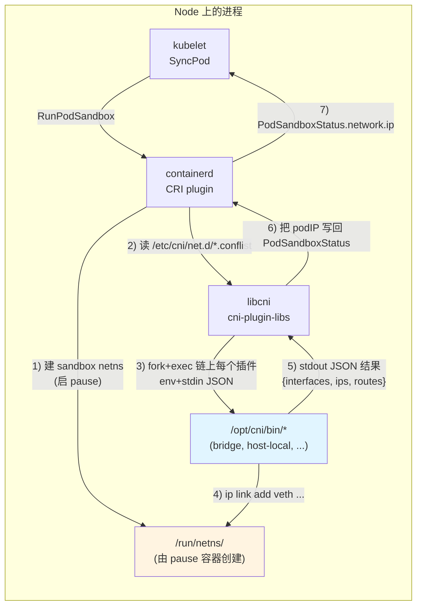
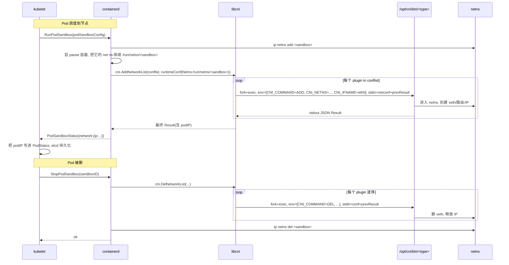

#kubernetes #cni #源码导读

相关笔记：[[cni]] | [[calico]] | [[cilium]] | [[cilium-deep-dive]] | [[flannel]] | [[weave]] | [[multus]] | [[network-model]] | [[service]] | [[kube-proxy]] | [[cni-troubleshooting]] | [[k8s-development-roadmap]] | [[demo-cni-bridge]] | [[kubelet-cri-source]] | [[k8s-interview]]

## 概述

本篇是 **Container Network Interface（CNI）** 的源码导读笔记，覆盖三个层面：(1) 上游 CNI 规范本身（`github.com/containernetworking/cni`），定义二进制插件的 **env + stdin/stdout JSON** 契约；(2) 参考实现 `containernetworking/plugins` 仓库，提供 `bridge` / `host-local` / `loopback` / `portmap` 等真实可用的插件；(3) Kubernetes 客户端 `pkg/kubelet/dockershim/network/cni/` 与 `pkg/kubelet/cm/dns/`（dockershim 已删，逻辑迁到 CRI 实现里），即 kubelet 与 containerd/CRI-O 如何在 `RunPodSandbox` 时调 CNI 插件给 Pod 拉一根 veth、分一个 IP、配一条默认路由。CNI 解决的核心问题是把"容器网络的实现"从 K8s/runtime 主干彻底拆出去——网络厂商写**任意语言**的可执行文件，放到 `/opt/cni/bin/`，runtime 通过 fork+exec 调用，不挂任何运行时库依赖。每个 CNI 插件需要实现 **四个命令**：`ADD` / `DEL` / `CHECK` / `VERSION`；runtime 侧通过 **`libcni`**（Go 库）把"运行时命令"翻译成"对插件可执行文件的 exec 调用"。同时 K8s 主干在 CRI 实现里维护了 **CNI 调用客户端**，负责在 Pod sandbox 创建/销毁时驱动整条 `.conflist` 中的插件链。本文按"CNI 规范 → libcni → 参考插件 (bridge/host-local) → containerd 端到端时序 → kubelet 入口 → 主流 CNI（Calico/Cilium/Flannel）数据面入口 → 手写复现 → CNI 1.0 与 NRI 演进"的顺序通读，并在 `cloud-native/kubernetes/demos/cni-bridge/` 给出一个 100 行 bash 写的 bridge 插件。



整张架构图最容易看漏的两点：
1. **kubelet 不直接调 CNI**。1.24 删掉 dockershim 之后，kubelet 把网络的事完全外包给 CRI runtime（containerd / CRI-O）；CNI 是 runtime 的事，不是 kubelet 的事。kubelet 只在 `PodSandboxStatus` 里读到 podIP。
2. **CNI 调用是 fork+exec 的"短命进程"**。每个 Pod 创建 / 销毁都会 fork 一次 `/opt/cni/bin/<type>`，跑完即退；插件没法用"长跑进程"维护内存状态，所有状态要么走 IPAM 文件（`host-local`）、要么走自家中心化 daemon（Calico Felix、Cilium Agent）。

## 一、CNI 规范：env + stdin/stdout JSON

CNI 协议在 `github.com/containernetworking/cni/SPEC.md` 定义；Go 类型在 `github.com/containernetworking/cni/pkg/types/` 与 `pkg/types/100/`（按 spec 版本拆子包）。

### 1.1 输入：env 传命令，stdin 传配置

```go
// 文件: github.com/containernetworking/cni/pkg/invoke/args.go
type CNIArgs interface {
    // AsEnv 返回 [k=v,...]
    AsEnv() []string
}

type Args struct {
    Command       string  // ADD / DEL / CHECK / VERSION
    ContainerID   string
    NetNS         string  // /run/netns/<sandbox-id>
    PluginArgs    [][2]string
    PluginArgsStr string
    IfName        string  // 容器内的网卡名, runtime 总传 "eth0"
    Path          string  // 插件搜索路径, 多个用 ":" 分隔
}
```

| env 变量 | 含义 |
| :--- | :--- |
| `CNI_COMMAND` | `ADD` / `DEL` / `CHECK` / `VERSION` |
| `CNI_CONTAINERID` | runtime 给的容器 ID（kubelet 用 sandbox ID） |
| `CNI_NETNS` | netns 路径，bind-mount 形式 |
| `CNI_IFNAME` | 容器内网卡名，kubelet/containerd 恒为 `eth0` |
| `CNI_ARGS` | `K1=V1;K2=V2`，runtime 透传一些可选 key |
| `CNI_PATH` | 插件二进制搜索路径，`/opt/cni/bin` |

**stdin 是 JSON**，结构：

```json
{
  "cniVersion": "0.4.0",
  "name": "k8s-pod-network",
  "type": "bridge",
  "bridge": "cni0",
  "isDefaultGateway": true,
  "ipam": {"type": "host-local", "subnet": "10.244.0.0/24"}
}
```

`type` 字段告诉 `libcni` 应该 exec 哪个二进制；`ipam.type` 告诉 bridge 插件应该 chain 调用哪个 IPAM 插件（典型的"插件链"）。

### 1.2 输出：stdout JSON

```go
// 文件: github.com/containernetworking/cni/pkg/types/100/types.go
type Result struct {
    CNIVersion string       `json:"cniVersion,omitempty"`
    Interfaces []*Interface `json:"interfaces,omitempty"`
    IPs        []*IPConfig  `json:"ips,omitempty"`
    Routes     []*types.Route `json:"routes,omitempty"`
    DNS        types.DNS    `json:"dns,omitempty"`
}

type Interface struct {
    Name    string `json:"name"`
    Mac     string `json:"mac,omitempty"`
    Mtu     int    `json:"mtu,omitempty"`
    Sandbox string `json:"sandbox,omitempty"`  // netns 路径; 空表示 host-side
}

type IPConfig struct {
    Interface *int     `json:"interface,omitempty"`  // 索引到 Interfaces[]
    Address   net.IPNet `json:"address"`
    Gateway   net.IP   `json:"gateway,omitempty"`
}
```

`Sandbox` 字段是判断"这个 interface 是 host 端 veth 还是 container 端 eth0"的关键 —— 空就是 host 端。

### 1.3 四个命令的语义

| 命令 | 何时被调 | 必须做的事 | 副作用是否可幂等 |
| :--- | :--- | :--- | :--- |
| `ADD` | RunPodSandbox 后 | 给 netns 配 IP / veth / 路由；输出 Result | **必须幂等**（runtime 可能重试） |
| `DEL` | StopPodSandbox 后 | 清理 ADD 的副作用；netns 不存在也要返回成功 | **必须幂等** |
| `CHECK` | runtime 周期性巡检（1.0 强制） | 验证 ADD 写入仍然生效 | 只读 |
| `VERSION` | libcni 初始化 | 返回支持的 spec 版本列表 | 纯函数 |

幂等性这点 90% 的 CNI bug 都在这上面：runtime 失败重试 / kubelet 重启都会让 `ADD` 被调两次，第二次插件必须知道"已经 ADD 过"。`bridge` 插件的做法是"操作前先 query 当前状态"，`host-local` IPAM 的做法是"以 ContainerID 为 key 在 /var/lib/cni/networks/ 写文件"。

## 二、libcni：runtime 端的"调度器"

`libcni` 是 `github.com/containernetworking/cni/libcni` 提供的 Go 库，containerd / CRI-O / kubelet（老的 dockershim 时代）都 import 它。它干两件事：(1) 解析 `/etc/cni/net.d/*.conflist`；(2) 按 chain 顺序 fork+exec 插件。

### 2.1 conflist：插件链

```go
// 文件: github.com/containernetworking/cni/libcni/conf.go
type NetworkConfigList struct {
    Name         string
    CNIVersion   string
    DisableCheck bool
    Plugins      []*NetworkConfig
    Bytes        []byte
}
```

一个真实的 `/etc/cni/net.d/10-calico.conflist` 长这样：

```json
{
  "name": "k8s-pod-network",
  "cniVersion": "0.3.1",
  "plugins": [
    {"type": "calico", "ipam": {"type": "calico-ipam"}, ...},
    {"type": "portmap", "capabilities": {"portMappings": true}},
    {"type": "bandwidth", "capabilities": {"bandwidth": true}}
  ]
}
```

libcni 会按顺序对每个 plugin 调一次 ADD —— **后一个插件的 stdin 收的是前一个插件的 stdout 结果 + 当前插件的配置**（这个机制叫"prevResult chain"）。

### 2.2 AddNetworkList：调用入口

```go
// 文件: github.com/containernetworking/cni/libcni/api.go
type CNI interface {
    AddNetworkList(ctx, net *NetworkConfigList, rt *RuntimeConf) (types.Result, error)
    DelNetworkList(ctx, net *NetworkConfigList, rt *RuntimeConf) error
    CheckNetworkList(ctx, net *NetworkConfigList, rt *RuntimeConf) error
    ...
}

// 实现: cniConfig.AddNetworkList
func (c *cniConfig) AddNetworkList(ctx, list *NetworkConfigList, rt *RuntimeConf) (types.Result, error) {
    var prevResult types.Result
    for _, net := range list.Plugins {
        prevResult, err = c.addNetwork(ctx, list.Name, list.CNIVersion, net, prevResult, rt)
        if err != nil {
            return nil, err
        }
    }
    return prevResult, nil
}
```

`addNetwork` 最后一步会 fork+exec：

```go
// 文件: github.com/containernetworking/cni/pkg/invoke/exec.go
func ExecPluginWithResult(ctx, pluginPath string, netconf []byte,
    args CNIArgs, exec Exec) (types.Result, error) {

    stdoutBytes, err := exec.ExecPlugin(ctx, pluginPath, netconf, args.AsEnv())
    // 解析 stdout JSON 为 types.Result
    ...
}
```

**关键**：`exec.ExecPlugin` 用 `os/exec` 包 fork 一个新进程，传 env、把 netconf 写到 stdin、读 stdout。这就是为什么 CNI 插件可以用任意语言写 —— 它只需要遵守"读 env、读 stdin JSON、写 stdout JSON、按 exit code 0 表示成功"四条约定。

## 三、参考实现：bridge + host-local

### 3.1 bridge 插件：完整 ADD 流程

```go
// 文件: github.com/containernetworking/plugins/plugins/main/bridge/bridge.go
func cmdAdd(args *skel.CmdArgs) error {
    n, cniVersion, err := loadNetConf(args.StdinData, args.Args)
    if err != nil { return err }

    // 1) 在 host 上 ensure bridge
    br, brInterface, err := setupBridge(n)
    if err != nil { return err }

    // 2) 进入 netns 创建 veth pair
    netns, err := ns.GetNS(args.Netns)
    hostInterface, containerInterface, err := setupVeth(netns, br, args.IfName, n.MTU, ...)

    // 3) 链式调 IPAM 插件 (host-local / dhcp / static / 厂商 IPAM)
    r, err := ipam.ExecAdd(n.IPAM.Type, args.StdinData)

    // 4) 把 IPAM 返回的 IP 配到 container 的 veth 端
    if err := netns.Do(func(_ ns.NetNS) error {
        return ipam.ConfigureIface(args.IfName, result)
    }); err != nil { return err }

    // 5) 输出 Result
    return types.PrintResult(result, cniVersion)
}
```

对照 [[demo-cni-bridge]] 那个 100 行 bash 版本，每一步都能一一对上。Go 版多出来的主要是：MTU 协商、hairpin/promisc 配置、IPv6、跨命名空间的错误传播。

### 3.2 host-local IPAM：以 ContainerID 为 key 的文件锁

```go
// 文件: github.com/containernetworking/plugins/plugins/ipam/host-local/backend/disk/backend.go
func (s *Store) Reserve(id string, ifname string, ip net.IP, rangeID string) (bool, error) {
    fname := GetEscapedPath(s.dataDir, ip.String())
    f, err := os.OpenFile(fname, os.O_RDWR|os.O_EXCL|os.O_CREATE, 0644)
    if os.IsExist(err) {
        return false, nil   // 别人占了
    }
    if _, err := f.WriteString(strings.TrimSpace(id) + LineBreak + ifname); err != nil {
        f.Close()
        os.Remove(fname)
        return false, err
    }
    ...
}
```

每个 IP 一个文件，文件名 = IP 地址，内容 = `containerID\nifname`。这个简单的 ext4 inode 互斥就是 host-local 全部的"分布式锁" —— 在单节点上工作完美，跨节点就要换成 etcd / 自家中心化 IPAM。Calico 就是用 etcd / kdd（CRD）做集群级 IPAM。

## 四、kubelet → containerd → CNI 端到端时序



**最容易踩的两个坑**：
1. **kubelet 没启动 CNI 不会让节点 NotReady**（containerd 自己感知 CNI 不通）—— `kubectl get nodes` 看是 Ready 的，但 `kubectl describe node` 的 `Conditions.NetworkUnavailable=true`。
2. **DEL 失败 runtime 不会重试**，所以 DEL 在插件实现里必须容错：netns 不存在 → 当成功；veth 已删 → 当成功。否则你会看到一堆"孤儿 IP"占着 IPAM。

## 五、kubelet / containerd 调 CNI 的客户端代码

dockershim 删了之后这块代码迁到了 containerd 的 CRI plugin。

```go
// 文件: github.com/containerd/containerd/pkg/cri/server/sandbox_run.go
func (c *criService) RunPodSandbox(ctx context.Context, r *runtime.RunPodSandboxRequest) (*runtime.RunPodSandboxResponse, error) {
    ...
    // (1) 创建 sandbox container (pause)
    // (2) 创建 netns
    podNetwork := cni.NetworkNamespace(sandbox.NetNSPath)
    ...
    // (3) 调 CNI
    result, err := c.netPlugin[defaultNetwork].Setup(ctx, sandbox.ID, podNetwork, opts...)
    if err != nil {
        return nil, errors.Wrap(err, "failed to setup network for sandbox")
    }
    // (4) 把 IP 写到 sandbox status
    sandbox.IP, sandbox.AdditionalIPs = selectPodIPs(result.Interfaces)
    ...
}
```

`c.netPlugin` 就是 `libcni`。containerd 启动时读 `/etc/cni/net.d/`，把每个 `.conflist` 包装成一个 plugin instance。

## 六、主流 CNI 数据面入口

**所有正经 CNI 都遵守上面的 ADD/DEL 协议，差异在于"插件二进制的实现细节"**。源码入口给你贴出来：

### 6.1 Flannel：bridge + VXLAN

```go
// 文件: github.com/flannel-io/flannel/main.go
// flanneld 进程: 监听 K8s Node 事件, 维护本节点的 vxlan 设备 + 路由
//
// CNI 二进制 (cni-plugin-flannel): /opt/cni/bin/flannel
// 文件: github.com/flannel-io/cni-plugin/main.go
// 它做的事极少: 读 /run/flannel/subnet.env (flanneld 写的),
// 然后拼一个 bridge plugin 的 netconf, 调 delegate (= 真实的 bridge plugin) 来干活.
```

→ **Flannel 是 bridge 插件 + 一个跨节点 vxlan overlay 的薄壳**。读懂 [[demo-cni-bridge]] 就读懂了一半 Flannel。

### 6.2 Calico：每个 Pod 独立 veth + BGP

```go
// 文件: github.com/projectcalico/cni-plugin/pkg/plugin/plugin.go
func cmdAdd(args *skel.CmdArgs) (err error) {
    // 1) 通过 calico-ipam 分 IP
    // 2) 直接给 Pod 创建一个 /32 路由的 veth, host 端不入网桥 (这是 Calico 关键差异)
    // 3) 在 host 上挂一条 "ip route add <podIP>/32 dev veth..."
    // 4) Felix 通过 BGP 把这条 /32 路由播给其他节点 -> 跨节点免封装通信
}
```

`Felix` 是 Calico 的数据面 agent（DaemonSet），它在每个节点上维护 BGP peer + iptables/eBPF 规则。CNI 插件本身很薄，重活在 Felix。

### 6.3 Cilium：完全不用 bridge / iptables

```go
// 文件: github.com/cilium/cilium/plugins/cilium-cni/main.go
func cmdAdd(args *skel.CmdArgs) (err error) {
    // 1) gRPC 调 cilium-agent (本地 daemon) 申请 endpoint
    //    agent 分配 IP, 创建 veth, 把 eBPF 程序挂到 host 端 tc/xdp hook
    // 2) Pod 出/入流量在 tc ingress/egress 被 eBPF 程序拦截 -> 决定转发 / NetworkPolicy / Service NAT
    // 3) 完全不依赖 iptables / kube-proxy
}
```

→ **Cilium 用 eBPF 替代了 iptables，CNI 插件本身依然是个"申请资源"的薄壳**，重活在 cilium-agent + eBPF 程序。

## 七、手写复现：100 行 bash CNI bridge

→ [[demo-cni-bridge]] 完整实现 + walkthrough + `run-in-docker.sh`。

核心思路（与 containernetworking-plugins 的 bridge 完全对齐）：

1. ensure bridge：`ip link add cni0 type bridge` + 设网关 + 开 `ip_forward` + SNAT
2. IPAM：从 `/tmp/learning-bridge.next` 拿下一个 IP（host-local 的最简化版）
3. veth pair：`ip link add ... type veth` + host 端入网桥 + container 端 `ip link set ... netns ...` + 重命名 `eth0` + 配 IP + 默认路由
4. 输出 JSON：`{cniVersion, interfaces, ips, routes}`

读完这个 demo 再回头看 `containernetworking-plugins` 的 `plugins/main/bridge/bridge.go`，每一行都能对上。

## 八、CNI 演进：1.0 → DRA 网络 → NRI

### 8.1 CNI 1.0（2021）

- `CHECK` 命令从可选变强制（runtime 现在敢真用它做 healthcheck）
- 引入 `gc` / `status` 命令（清理 / 状态查询）
- spec 字段去除一些历史包袱

### 8.2 KEP-3698：DRA Networking（1.32 alpha）

把"网络资源"按 DRA 框架建模，让 Pod 像申请 GPU 一样申请 SR-IOV VF、RDMA NIC。CNI 不会被替换，但**多网卡场景 / 特殊硬件网卡场景** Multus 可能会被 DRA driver 取代。

### 8.3 NRI（Node Resource Interface）

containerd 1.7+ 引入的 plugin 机制，让"网络配置 hook"不必走 CNI fork+exec，可以走长跑 gRPC plugin —— 性能更好。但 CNI 因为生态太厚，短期不会被换掉，NRI 更多用在 sidecar 注入、cgroup 调整这类细粒度场景。

## 学习路径建议

1. **跑** [[demo-cni-bridge]] 的 `./run-in-docker.sh`，理解协议 + 网络模型
2. **读** 本笔记 § 1-4，把 CNI 协议、libcni、bridge 插件、containerd 调用入口串一遍
3. **clone** `github.com/containernetworking/plugins`，对照 § 3 的源码片段读 `plugins/main/bridge/bridge.go`（不超过 600 行）
4. **clone** `github.com/projectcalico/cni-plugin` 与 `github.com/cilium/cilium/plugins/cilium-cni`，对照 § 6 看不同流派的实现差异
5. **改造**：把 [[demo-cni-bridge]] 加个 `portmap` 链插件，模拟 hostport 注入

## 面试要点

| 问题 | 回答要点 |
| :--- | :--- |
| **CNI 是什么？怎么被调用的？** | 一种容器网络规范：可执行文件 + env + stdin/stdout JSON。runtime（kubelet→containerd）在 RunPodSandbox 时 fork+exec `/opt/cni/bin/<type>`，传 `CNI_COMMAND=ADD` + netconf JSON，插件配好 netns 后 stdout 返回 IP/路由/接口信息。 |
| **CNI 的 4 个命令是什么？** | ADD（建网）/ DEL（拆网）/ CHECK（巡检）/ VERSION（声明 spec 版本）。ADD 和 DEL 必须幂等，runtime 会重试。 |
| **conflist 是什么？为什么是数组？** | `/etc/cni/net.d/*.conflist` 描述插件链：libcni 按顺序调每个插件，**后一个插件的 stdin 包含前一个的 stdout 结果**（prevResult chain）。典型链：calico/bridge → portmap → bandwidth。 |
| **kubelet 1.24+ 删了 dockershim，CNI 还归 kubelet 管吗？** | 不归。CNI 的调用完全在 CRI runtime（containerd/CRI-O）里，kubelet 只在 `PodSandboxStatus.network.ip` 读到结果。这也是为什么换 CNI 不需要重启 kubelet，只要重启 containerd。 |
| **bridge 插件做了哪些事？** | (1) ensure 网桥 (2) 创建 veth pair (3) 链式调 IPAM 拿 IP (4) 进 netns 配 IP + 默认路由 (5) 输出 Result。 |
| **host-local IPAM 怎么避免分重 IP？** | 每个 IP 一个文件 `/var/lib/cni/networks/<network>/<ip>`，用 ext4 `O_EXCL` 创建做互斥锁；同节点完美，跨节点不行（所以 Calico 用 etcd 做集群 IPAM）。 |
| **Calico 跟 bridge 模式的本质差异？** | Calico 不用网桥，每个 Pod 一根 veth + host 端一条 `/32` 路由；Felix 通过 BGP 把 `/32` 播给其他节点 → 跨节点免封装。bridge 模式跨节点需要 overlay（Flannel VXLAN）或外层路由器。 |
| **Cilium 跟 iptables 的关系？** | Cilium 完全不用 iptables，把网络策略 / Service NAT 编译成 eBPF 程序挂到 tc/xdp hook；可选 kube-proxy replacement 完全替换 iptables-based Service。 |
| **CNI 插件失败会导致什么？** | RunPodSandbox 失败 → Pod 状态 ContainerCreating，事件里有 `FailedCreatePodSandBox: ... cni ...`。kubelet 不会自动清理，要靠下一次 sync 重试。 |
| **DEL 必须幂等是什么意思？** | runtime 可能在 DEL 已经成功后又调一次（重启、超时重试），插件碰到"netns 不存在 / veth 已删"必须返回成功而不是报错，否则会有孤儿 IP / 失败重试风暴。 |
| **CNI 怎么承担 NetworkPolicy？** | CNI 协议本身不管 NetworkPolicy；由具体插件实现：Calico 走 iptables / eBPF 链，Cilium 走 eBPF 程序，Flannel 不实现（要配 Calico 做策略层）。 |
| **CNI 跟 CSI 设计上有什么相似点？** | 都是"K8s 主干不实现，定个协议让外部按协议接"。差异：CSI 用 gRPC + sidecar，CNI 用 fork+exec + 链式插件。CSI 更复杂因为存储语义多（attach/mount/snapshot/expand），CNI 只管"配好 Pod 的网络"。 |
