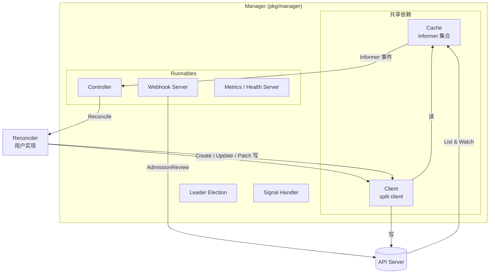
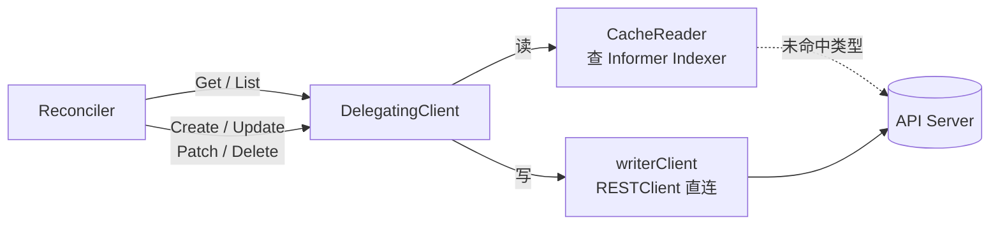
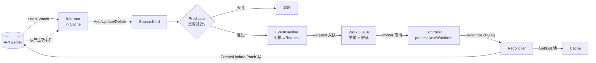
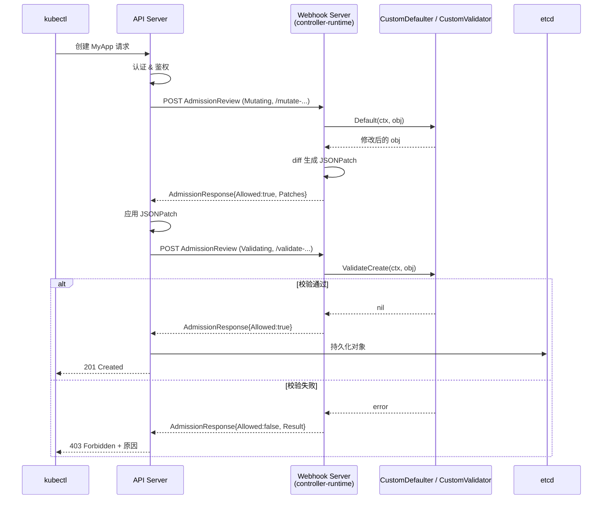

#kubernetes #controller-runtime #operator #源码导读

相关笔记：[[kubebuilder]] | [[operator-pattern]] | [[client-go-source]] | [[informer]] | [[k8s-interview]] | [[k8s-development-roadmap]] | [[demo-kubebuilder-operator]]

## 概述

controller-runtime（`sigs.k8s.io/controller-runtime`）是 Kubernetes SIG 维护的 Operator 开发底层运行时库，kubebuilder、operator-sdk 都基于它生成脚手架。它在 client-go 的 Informer / WorkQueue / RESTClient 之上做了一层封装，把"写一个 Controller"的样板代码收敛为几个核心抽象：**Manager** 统一管理生命周期、共享 Cache 和 Client；**Controller** 内部维护 WorkQueue 与 worker goroutine；**Reconciler** 是用户唯一需要实现的业务接口（`Reconcile(ctx, Request) (Result, error)`）；**Source / EventHandler / Predicate** 描述"监听什么资源、如何转换成 Request、是否过滤"；**Cache** 是 Informer 支撑的本地缓存，**Client** 是"读走缓存、写走 APIServer"的 split client；**Builder** 提供链式 DSL 把上述组件粘合起来。此外 `pkg/webhook` 提供 Admission Webhook（Mutating / Validating）的服务端框架。本文按源码目录逐层走读，定位关键文件与接口，理解事件从 APIServer 流到 Reconciler 的完整链路。

## 整体架构

controller-runtime 的对象关系可以分为三层：Manager 是顶层容器，Controller + Cache + Client 是运行时核心，Reconciler 是用户业务。



要点：

- **一个 Manager 管理多个 Controller**，它们共享同一个 Cache（同一份 Informer，避免对同一资源建立多个 Watch）和同一个 Client。
- **Cache 既是 Controller 的事件来源，也是 Client 读操作的后端**——这就是为什么 `r.Get` / `r.List` 默认不打 APIServer。
- Manager 把 Controller、Webhook Server、Metrics Server 都抽象成 `Runnable`，统一 `Start()`。

## Manager：生命周期与共享依赖

源码：`pkg/manager/manager.go`、`pkg/manager/internal.go`。

Manager 是整个进程的根对象，职责有四个：托管 Runnable、提供共享 Cache/Client、做 Leader Election、处理退出信号。

### Manager 接口

```go
// pkg/manager/manager.go
type Manager interface {
    cluster.Cluster // 提供 GetClient / GetCache / GetScheme ...

    // Add 把一个 Runnable 注册进来，由 Manager 统一启动
    Add(Runnable) error
    // AddHealthzCheck / AddReadyzCheck 注册健康检查
    AddHealthzCheck(name string, check healthz.Checker) error
    // Start 阻塞运行，直到 ctx 取消；启动所有 Runnable
    Start(ctx context.Context) error
    // GetWebhookServer 返回 webhook server（懒加载）
    GetWebhookServer() webhook.Server
    Elected() <-chan struct{}
}
```

### Runnable 抽象

任何实现了 `Start(ctx) error` 的对象都是 Runnable，Controller、Webhook Server、Metrics Server 都是 Runnable。Manager 内部用 `runnables` 结构（`pkg/manager/runnable_group.go`）按类别分组并控制启动顺序：

```go
// 概念性结构（pkg/manager/runnable_group.go）
type runnables struct {
    HTTPServers    *runnableGroup // metrics / pprof / health，不依赖 leader
    Webhooks       *runnableGroup // webhook server，不依赖 leader
    Caches         *runnableGroup // Cache，必须先于 Controller 启动
    LeaderElection *runnableGroup // 需要 leader 才运行的 Runnable（Controller 默认在这里）
}
```

启动顺序：HTTP Server → Webhook Server → Caches（并等待 `WaitForCacheSync`）→ 竞选 Leader → 启动 LeaderElection 组里的 Controller。这保证了 Controller 跑 Reconcile 前缓存已经同步、并且只有 leader 在干活。

### 创建 Manager 与 Start

```go
mgr, err := ctrl.NewManager(ctrl.GetConfigOrDie(), ctrl.Options{
    Scheme:                 scheme,
    LeaderElection:         true,
    LeaderElectionID:       "my-operator-lock",
    HealthProbeBindAddress: ":8081",
    Metrics:                metricsserver.Options{BindAddress: ":8080"},
})
// ...注册 Controller、Webhook...

// SetupSignalHandler 返回一个会在 SIGTERM/SIGINT 时取消的 ctx
if err := mgr.Start(ctrl.SetupSignalHandler()); err != nil {
    os.Exit(1)
}
```

- **Leader Election**：基于 client-go 的 `leaderelection`，用一个 Lease 对象抢锁。非 leader 副本只启动不依赖 leader 的 Runnable（如 webhook），Controller 处于等待。
- **Signal Handling**：`ctrl.SetupSignalHandler()`（`pkg/manager/signals`）监听 SIGTERM/SIGINT，第一次信号 cancel ctx 触发优雅退出，第二次信号直接 `os.Exit(1)`。
- **优雅退出**：`Start` 返回前会等待 Runnable 退出，受 `GracefulShutdownTimeout` 控制。

## Cache 与 Client

源码：`pkg/cache/cache.go`、`pkg/client/`。

### Cache：Informer 的集合

Cache 本质是一组按 GVK 组织的 SharedIndexInformer。第一次对某个类型发起 `Get/List`，或某个 Controller `Watch` 该类型时，Cache 会惰性创建对应 Informer 并启动 List-Watch。

```go
// pkg/cache/cache.go
type Cache interface {
    client.Reader          // Get / List 走本地缓存
    Informers              // GetInformer / WaitForCacheSync / IndexField
}
```

- Cache 内部对每个 GVK 维护一个 Informer，Informer 的 Indexer 就是缓存数据。
- 可以通过 `Options.Cache.ByObject` 配置按 namespace、label selector 限定缓存范围，减少内存占用。
- `WaitForCacheSync` 保证 Controller 启动前缓存已经全量同步（Informer 完成首次 List）。

### Client：split client（读缓存 / 写直连）

Manager 提供的默认 Client 是 **DelegatingClient**：读操作（Get/List）委托给 Cache，写操作（Create/Update/Patch/Delete）委托给直连 APIServer 的 typed client。



设计原因：

- **读走缓存**：Reconcile 频繁读资源，走 Informer 本地缓存可零 APIServer 压力、低延迟。
- **写直连**：写必须落到 APIServer，且写完后通过 Watch 事件再次触发 Reconcile，形成闭环。
- 注意"写后立即读"可能读到旧值（缓存尚未收到 Watch 更新），这是 Reconcile 必须**幂等**的根本原因。
- 需要强一致读时可用 `mgr.GetAPIReader()`（直连 APIServer 的 Reader）。

`r.Status().Update()` 走的是 `/status` 子资源端点，与 `r.Update()` 分离，避免 spec 与 status 互相覆盖。

### 哪些 client 走本地缓存？哪些直连 APIServer？

这是 controller-runtime / client-go 最容易混淆的点。一张表分清：

```
读           ┌─ Lister (client-go)              → Indexer 本地缓存
            ├─ Indexer / Cache 直接调用         → 本地缓存
            ├─ controller-runtime 默认 Client    → 本地缓存（Cache 后端）
            │   .Get() / .List()
            ├─ ClientReader (Reader 接口实现)    → 本地缓存
            └─ Clientset.CoreV1().Pods().Get()  → ❌ 直连 APIServer

写           Clientset / DynamicClient / 默认 Client.Create/Update/Delete
                                                → ❌ 直连 APIServer（写不能走缓存）
```

| Client | 读路径 | 写路径 | 何时用 |
| --- | --- | --- | --- |
| `Lister`（如 `podLister.Pods(ns).Get(name)`） | 本地 Indexer | — 只读 | client-go 控制器里读资源的首选 |
| `Indexer.ByIndex` / `GetByKey` | 本地 Indexer | — 只读 | 需要按 label/field 索引时 |
| **controller-runtime `mgr.GetClient()`** | 本地 Cache（informer 后端） | 直连 APIServer | Operator 的 `r.Client` 默认就是这个 |
| `mgr.GetAPIReader()` | ❌ 直连 APIServer | — 只读 | 启动阶段缓存未 sync、或绕过缓存读最新值 |
| `client.New(cfg, Options{})`（不传 Cache） | 直连 APIServer | 直连 APIServer | 一次性脚本、init 阶段 |
| `kubernetes.Clientset` | 直连 APIServer | 直连 APIServer | apiserver 自身、非控制器场景、写操作 |
| `dynamic.Interface` | 直连 APIServer | 直连 APIServer | 处理 unstructured / CRD 通用工具 |

具体到代码层面：

```go
// Reconciler 里 r.Client 实际是 DelegatingClient
type DelegatingClient struct {
    Reader       // 来自 Cache（informer 缓存）
    Writer       // 来自 typed client（直连 APIServer）
    StatusClient
}

r.Client.Get(ctx, key, &pod)        // ✅ 走缓存
r.Client.List(ctx, &podList)        // ✅ 走缓存
r.Client.Create(ctx, &pod)          // ❌ 直连 APIServer
r.Client.Update(ctx, &pod)          // ❌ 直连 APIServer
r.Client.Status().Update(ctx, &pod) // ❌ 直连 APIServer（/status 子资源）
```

源码见本文「关键源码片段 → 5. split client」。

### 三个常踩的坑

**1. 缓存延迟 → 读到旧值**
Reconcile 里 `Update` 完立刻 `Get`，可能读到的还是旧版本（Informer 还没 watch 到自己刚写的事件）。所以 Reconcile 必须**幂等**，下一次循环自然修正。

**2. 启动阶段缓存未 sync**
Manager 启动后到 `WaitForCacheSync` 完成之间，缓存可能为空。如果非要在 init 钩子里读最新数据，用 `mgr.GetAPIReader()` 绕过缓存：

```go
// ❌ 启动阶段可能读不到
mgr.GetClient().Get(ctx, key, &cm)

// ✅ 绕过缓存
mgr.GetAPIReader().Get(ctx, key, &cm)
```

**3. 没声明 watch 的类型，缓存里没有**
默认 Cache 只缓存通过 `.For()` / `.Owns()` / `.Watches()` 声明过的 GVK。读没声明的类型会 fallback 到 APIServer 并触发警告日志。要缓存额外类型可显式触发 Informer 创建：

```go
mgr.GetCache().GetInformer(ctx, &corev1.Secret{})
```

或在 `Options.Cache.ByObject` 里配置按 namespace / label selector 限定范围。

### 怎么判断当前代码走的是哪条路

```bash
# Reconciler 里看 r.Client 是怎么注入的
grep -rn "r.Client\s*=" --include='*.go'
```

```go
r.Client = mgr.GetClient()         // → 读缓存
r.Client = mgr.GetAPIReader()      // → 直连（少见，通常只用于 fallback）
r.Client, _ = client.New(cfg, ...) // → 直连（脚本 / 工具 / 测试）
```

**简单原则**：控制器里的读默认走缓存，写永远直连；脚本、工具、apiserver 自身代码用 Clientset 直连。

## Controller 与 Reconciler

源码：`pkg/controller/controller.go`、`pkg/internal/controller/controller.go`。

### Controller 内部结构

`pkg/internal/controller/controller.go` 中的 `Controller` 是真正干活的对象，核心字段：

```go
// pkg/internal/controller/controller.go（简化）
type Controller[request comparable] struct {
    Name                    string
    MaxConcurrentReconciles int                // worker goroutine 数量，默认 1
    Do                      reconcile.Reconciler // 用户的 Reconciler
    Queue                   workqueue.TypedRateLimitingInterface[request]
    startWatches            []source.Source      // 待启动的 Watch
    CacheSyncTimeout        time.Duration
    RateLimiter             workqueue.TypedRateLimiter[request]
}
```

### 启动流程：Start()

`Controller.Start` 做三件事：启动所有 Source（让事件开始流入 WorkQueue）→ 等待 Cache 同步 → 拉起 `MaxConcurrentReconciles` 个 worker goroutine。

```go
// pkg/internal/controller/controller.go（简化）
func (c *Controller[request]) Start(ctx context.Context) error {
    c.Queue = c.NewQueue(c.Name, c.RateLimiter)

    // 1. 启动所有 Source，把事件 handler 接到 Informer 上
    for _, watch := range c.startWatches {
        watch.Start(ctx, c.Queue)
    }
    // 2. 等待这些 Source 背后的 Informer 缓存同步完成
    for _, watch := range c.startWatches {
        syncingSource, ok := watch.(source.SyncingSource)
        if ok { syncingSource.WaitForSync(ctx) }
    }
    // 3. 拉起 worker
    for i := 0; i < c.MaxConcurrentReconciles; i++ {
        go wait.UntilWithContext(ctx, func(ctx context.Context) {
            for c.processNextWorkItem(ctx) {
            }
        }, time.Second)
    }
    <-ctx.Done()
    return nil
}
```

### Reconcile 循环：processNextWorkItem

这是整个库的心脏。每个 worker 不断从 WorkQueue 取 key、调用 Reconciler、根据返回值决定重新入队还是丢弃。

```go
// pkg/internal/controller/controller.go（简化）
func (c *Controller[request]) processNextWorkItem(ctx context.Context) bool {
    obj, shutdown := c.Queue.Get()
    if shutdown {
        return false
    }
    defer c.Queue.Done(obj) // 标记处理完，允许同 key 再次入队

    c.reconcileHandler(ctx, obj)
    return true
}

func (c *Controller[request]) reconcileHandler(ctx context.Context, req request) {
    result, err := c.Do.Reconcile(ctx, req) // 调用用户 Reconciler

    switch {
    case err != nil:
        // 出错：按 RateLimiter 指数退避重新入队
        c.Queue.AddRateLimited(req)
    case result.RequeueAfter > 0:
        // 延迟重新入队，并清除该 key 的限速计数
        c.Queue.Forget(req)
        c.Queue.AddAfter(req, result.RequeueAfter)
    case result.Requeue: // 注意：新版本中 Requeue 字段已弃用
        c.Queue.AddRateLimited(req)
    default:
        // 成功：清除限速计数，事件彻底处理完
        c.Queue.Forget(req)
    }
}
```

### Reconciler 接口与返回值契约

用户唯一必须实现的接口：

```go
// pkg/reconcile/reconcile.go
type Reconciler interface {
    Reconcile(ctx context.Context, req Request) (Result, error)
}

type Request struct {
    types.NamespacedName // Namespace + Name，注意只有 key，没有对象本身
}

type Result struct {
    Requeue      bool          // 已弃用，等价于 RequeueAfter 极小值
    RequeueAfter time.Duration // 延迟重新入队
}
```

| 返回值 | WorkQueue 行为 | 语义 |
|--------|---------------|------|
| `Result{}, nil` | `Forget`，不再入队 | 成功，等下一个事件 |
| `Result{}, err` | `AddRateLimited`，指数退避重试 | 临时错误，自动重试 |
| `Result{RequeueAfter: d}, nil` | `Forget` + `AddAfter(d)` | 固定延迟巡检，不算失败 |
| `Result{Requeue: true}, nil` | `AddRateLimited` | 立即重试（已弃用，改用 RequeueAfter） |

关键点：

- **Reconcile 只拿到 `Request`（namespace/name），不拿对象**。必须自己 `r.Get` 获取最新对象——因为入队到出队之间对象可能已变化。
- **返回 error 会无限指数退避重试**。永久性错误（如配置非法）不要返回 error，应记录 Event / Status Condition 后返回 `nil`，否则队列被该 key 反复占用。
- WorkQueue 自带**去重**：同一个 key 在队列中只存一份；处理期间再次入队会在 `Done` 后才真正可取，避免并发处理同一对象。
- `MaxConcurrentReconciles > 1` 时多个 worker 并发，但**同一个 key 仍串行**（WorkQueue 保证）。

## Builder：把组件粘起来

源码：`pkg/builder/controller.go`、`pkg/builder/webhook.go`。

Builder 提供链式 DSL，把 Reconciler、Watch、Predicate 组装成 Controller 并注册到 Manager。

```go
func (r *MyAppReconciler) SetupWithManager(mgr ctrl.Manager) error {
    return ctrl.NewControllerManagedBy(mgr).
        For(&webappv1.MyApp{}).                       // 主资源：用 EnqueueRequestForObject
        Owns(&appsv1.Deployment{}).                   // 从资源：用 EnqueueRequestForOwner
        Owns(&corev1.Service{}).
        Watches(&corev1.ConfigMap{},                  // 额外资源：自定义 handler
            handler.EnqueueRequestsFromMapFunc(r.mapConfigMapToApp)).
        WithEventFilter(predicate.GenerationChangedPredicate{}). // 全局 Predicate
        WithOptions(controller.Options{MaxConcurrentReconciles: 3}).
        Complete(r)
}
```

Builder 各方法对应的语义：

| 方法 | 作用 | 底层 EventHandler |
|------|------|------------------|
| `For(&T{})` | 声明主资源，Reconcile 的 Request 指向它 | `EnqueueRequestForObject` |
| `Owns(&T{})` | 声明被主资源拥有的从资源 | `EnqueueRequestForOwner`（沿 ownerRef 找回主资源） |
| `Watches(&T{}, h)` | 监听任意资源，自定义映射 | 自定义 handler（常用 `EnqueueRequestsFromMapFunc`） |
| `WithEventFilter(p)` | 给所有 Watch 加全局 Predicate | - |
| `WithOptions(o)` | 设置并发度、RateLimiter 等 | - |
| `Complete(r)` | 收尾，构建 Controller 并 `mgr.Add` | - |

`Complete` 内部：调用 `controller.New` 创建 Controller，对每个 `For/Owns/Watches` 调用 `c.Watch(source.Kind(...))`，最后把 Controller 作为 Runnable 加进 Manager。

## Source / EventHandler / Predicate：事件如何进队列

源码：`pkg/source/source.go`、`pkg/handler/`、`pkg/predicate/predicate.go`。

这三者决定"哪个 Informer 事件、经过什么过滤、转换成哪个 Request 入队"。

### Source

`source.Kind[T]` 把一个 GVK 的 Informer 包装成 Source。它的 `Start` 把一个 `cache.ResourceEventHandler` 注册到对应 Informer 上：Informer 收到 Add/Update/Delete 事件 → 调用 Predicate 过滤 → 调用 EventHandler 把对象转换成 Request 投进 WorkQueue。

```go
// 使用 Kind source 监听一个类型
src := source.Kind(mgr.GetCache(), &corev1.Pod{},
    &handler.EnqueueRequestForObject{},
    predicate.ResourceVersionChangedPredicate{})
```

### EventHandler：对象 → Request

`pkg/handler` 提供几种把"变更的对象"映射为"要 Reconcile 的 Request"的策略：

```go
// pkg/handler/enqueue.go —— 直接用对象自身的 namespace/name
type EnqueueRequestForObject struct{}

// pkg/handler/enqueue_owner.go —— 沿 ownerReference 找到 owner，入队 owner 的 key
handler.EnqueueRequestForOwner(scheme, mapper, &webappv1.MyApp{}, handler.OnlyControllerOwner())

// pkg/handler/enqueue_mapped.go —— 自定义任意映射函数
handler.EnqueueRequestsFromMapFunc(func(ctx context.Context, o client.Object) []reconcile.Request {
    return []reconcile.Request{{NamespacedName: types.NamespacedName{
        Namespace: o.GetNamespace(), Name: "the-app",
    }}}
})
```

- **`EnqueueRequestForObject`**：用于 `For()` 的主资源——Pod 变了就 Reconcile 这个 Pod。
- **`EnqueueRequestForOwner`**：用于 `Owns()` 的从资源——子 Deployment 被改/删，需要找到拥有它的 CR（通过 `metadata.ownerReferences`）并 Reconcile CR，从而让 Controller 把子资源修回去。这正是 `SetControllerReference` 写入 ownerRef 的意义。
- **`EnqueueRequestsFromMapFunc`**：用于 `Watches()`——一个 ConfigMap 变化影响多个 CR 时，自定义返回多个 Request。

### Predicate：事件过滤

`pkg/predicate` 在事件入队前过滤，避免无意义的 Reconcile：

```go
predicate.GenerationChangedPredicate{}       // 只在 spec 变化(metadata.generation 改变)时触发；忽略 status 更新
predicate.ResourceVersionChangedPredicate{}  // 只要 resourceVersion 变就触发
predicate.LabelChangedPredicate{}            // 只在 label 变化时触发
predicate.NewPredicateFuncs(func(o client.Object) bool { ... }) // 自定义
```

`GenerationChangedPredicate` 最常用：Controller 自己 `Status().Update()` 会改 resourceVersion 但不改 generation，用它可避免"自己改 status → 触发自己 Reconcile"的无效循环。

### 完整事件流



整个链路是闭环：Reconciler 写资源 → APIServer 产生新事件 → Informer 收到 → 再次入队 → 再次 Reconcile，直到实际状态收敛到期望状态。

## Reconciler 代码骨架

```go
// +kubebuilder:rbac:groups=webapp.example.com,resources=myapps,verbs=get;list;watch;update;patch
// +kubebuilder:rbac:groups=apps,resources=deployments,verbs=get;list;watch;create;update;patch;delete

type MyAppReconciler struct {
    client.Client                  // 内嵌 split client：Get/List/Create/Update/Patch
    Scheme   *runtime.Scheme
    Recorder record.EventRecorder
}

func (r *MyAppReconciler) Reconcile(ctx context.Context, req ctrl.Request) (ctrl.Result, error) {
    log := log.FromContext(ctx)

    // 1. 取对象（走 Cache）。NotFound 说明已被删除，结束即可
    var app webappv1.MyApp
    if err := r.Get(ctx, req.NamespacedName, &app); err != nil {
        return ctrl.Result{}, client.IgnoreNotFound(err)
    }

    // 2. 处理删除（Finalizer）
    if !app.DeletionTimestamp.IsZero() {
        if controllerutil.ContainsFinalizer(&app, finalizerName) {
            if err := r.cleanupExternal(ctx, &app); err != nil {
                return ctrl.Result{}, err // 返回 err 触发重试
            }
            controllerutil.RemoveFinalizer(&app, finalizerName)
            if err := r.Update(ctx, &app); err != nil {
                return ctrl.Result{}, err
            }
        }
        return ctrl.Result{}, nil
    }
    if controllerutil.AddFinalizer(&app, finalizerName) {
        if err := r.Update(ctx, &app); err != nil {
            return ctrl.Result{}, err
        }
    }

    // 3. 调谐子资源（幂等：CreateOrUpdate）
    deploy := &appsv1.Deployment{ObjectMeta: metav1.ObjectMeta{
        Name: app.Name, Namespace: app.Namespace,
    }}
    op, err := controllerutil.CreateOrUpdate(ctx, r.Client, deploy, func() error {
        deploy.Spec = r.desiredDeploymentSpec(&app)
        return controllerutil.SetControllerReference(&app, deploy, r.Scheme) // 写 ownerRef
    })
    if err != nil {
        return ctrl.Result{}, err
    }
    log.Info("reconciled deployment", "op", op)

    // 4. 更新 Status（走 /status 子资源）
    app.Status.ReadyReplicas = deploy.Status.ReadyReplicas
    if err := r.Status().Update(ctx, &app); err != nil {
        return ctrl.Result{}, err
    }

    // 5. 定期巡检，发现并修复 drift
    return ctrl.Result{RequeueAfter: 5 * time.Minute}, nil
}

func (r *MyAppReconciler) SetupWithManager(mgr ctrl.Manager) error {
    return ctrl.NewControllerManagedBy(mgr).
        For(&webappv1.MyApp{}).
        Owns(&appsv1.Deployment{}).
        WithEventFilter(predicate.GenerationChangedPredicate{}).
        Complete(r)
}
```

## Admission Webhook

源码：`pkg/webhook/`、`pkg/webhook/admission/`。

### Admission Webhook 机制

Admission Webhook 是 APIServer 在请求"认证授权之后、持久化到 etcd 之前"的扩展点，分两类：

- **MutatingAdmissionWebhook**：可修改对象（注入 sidecar、设置默认值），先执行。
- **ValidatingAdmissionWebhook**：只校验、不修改（拒绝不合规对象），后执行——校验的是 Mutating 改完后的最终对象。

APIServer 通过 `MutatingWebhookConfiguration` / `ValidatingWebhookConfiguration` 配置发现 webhook，以 HTTPS POST 发送 `AdmissionReview` 请求，webhook 返回 `AdmissionResponse`。

### Webhook Server 与 admission.Handler

controller-runtime 的 webhook server（`pkg/webhook/server.go`）本质是一个 HTTPS server，按路径路由到不同的 `admission.Handler`。核心接口：

```go
// pkg/webhook/admission/webhook.go
type Handler interface {
    Handle(context.Context, Request) Response
}

// Request 包装 admissionv1.AdmissionRequest
// Response 包装 admissionv1.AdmissionResponse（含 Allowed、Result、Patches）
```

请求/响应基于 `AdmissionReview`：请求里有 `Object`（新对象）、`OldObject`（旧对象）、`Operation`（CREATE/UPDATE/DELETE）、`UserInfo` 等；响应里有 `Allowed`（放行与否）、`Patches`（Mutating 的 JSONPatch）、`Result`（拒绝原因）。

### CustomDefaulter 与 CustomValidator

直接写 `Handler` 较底层。controller-runtime 提供两个高层接口，由 Builder 自动包装成 Handler：

```go
// pkg/webhook/admission/defaulter_custom.go —— Mutating
type CustomDefaulter interface {
    Default(ctx context.Context, obj runtime.Object) error
}

// pkg/webhook/admission/validator_custom.go —— Validating
type CustomValidator interface {
    ValidateCreate(ctx context.Context, obj runtime.Object) (warnings Warnings, err error)
    ValidateUpdate(ctx context.Context, oldObj, newObj runtime.Object) (warnings Warnings, err error)
    ValidateDelete(ctx context.Context, obj runtime.Object) (warnings Warnings, err error)
}
```

- `CustomDefaulter.Default` 修改传入对象，框架自动 diff 出 JSONPatch 填进响应。
- `CustomValidator` 返回 `error` → `Allowed: false`（拒绝）；返回 `nil` → 放行；`Warnings` 会显示给用户但不阻止请求。

### Webhook 注册

```go
func SetupMyAppWebhookWithManager(mgr ctrl.Manager) error {
    return ctrl.NewWebhookManagedBy(mgr).
        For(&webappv1.MyApp{}).
        WithDefaulter(&MyAppDefaulter{}).
        WithValidator(&MyAppValidator{}).
        Complete()
}
```

### Validator 示例

```go
type MyAppValidator struct{}

func (v *MyAppValidator) ValidateCreate(ctx context.Context, obj runtime.Object) (admission.Warnings, error) {
    app, ok := obj.(*webappv1.MyApp)
    if !ok {
        return nil, fmt.Errorf("expected a MyApp object, got %T", obj)
    }
    if app.Spec.Replicas < 1 || app.Spec.Replicas > 10 {
        // 返回 error → AdmissionResponse.Allowed=false，APIServer 回 403
        return nil, fmt.Errorf("replicas must be in [1,10], got %d", app.Spec.Replicas)
    }
    var warnings admission.Warnings
    if app.Spec.Image == "latest" {
        warnings = append(warnings, "using 'latest' tag is discouraged")
    }
    return warnings, nil
}

func (v *MyAppValidator) ValidateUpdate(ctx context.Context, oldObj, newObj runtime.Object) (admission.Warnings, error) {
    oldApp := oldObj.(*webappv1.MyApp)
    newApp := newObj.(*webappv1.MyApp)
    if newApp.Spec.StorageClass != oldApp.Spec.StorageClass {
        return nil, fmt.Errorf("storageClass is immutable")
    }
    return nil, nil
}

func (v *MyAppValidator) ValidateDelete(ctx context.Context, obj runtime.Object) (admission.Warnings, error) {
    return nil, nil
}
```

### Defaulter 示例

```go
type MyAppDefaulter struct{}

func (d *MyAppDefaulter) Default(ctx context.Context, obj runtime.Object) error {
    app, ok := obj.(*webappv1.MyApp)
    if !ok {
        return fmt.Errorf("expected a MyApp object, got %T", obj)
    }
    if app.Spec.Replicas == 0 {
        app.Spec.Replicas = 1 // 修改对象，框架自动生成 JSONPatch
    }
    if app.Spec.Image == "" {
        app.Spec.Image = "nginx:1.25"
    }
    return nil
}
```

### Admission Webhook 请求时序



### 证书与 failurePolicy

- **TLS 证书**：webhook server 跑 HTTPS，APIServer 必须信任其证书。证书放在 `--webhook-cert-dir`（默认 `/tmp/k8s-webhook-server/serving-certs`），`tls.crt` / `tls.key`。CA bundle 写进 `WebhookConfiguration.clientConfig.caBundle`。生产常用 **cert-manager** 自动签发并通过注入注解填充 caBundle。
- **failurePolicy**：webhook 不可达或超时时的兜底策略。`Fail`（默认）→ 拒绝请求（安全，生产推荐）；`Ignore` → 放行请求（可用性优先）。
- **timeoutSeconds**：默认 10s，webhook 逻辑要轻量，避免拖慢所有 API 写请求。
- **objectSelector / namespaceSelector**：限定 webhook 作用范围，务必排除 kube-system，避免把控制面锁死。
- **sideEffects / reinvocationPolicy**：声明 webhook 是否有副作用、Mutating 是否需要在其他 webhook 改完后重新调用。

## controller-runtime 关键源码目录速查

| 目录 / 文件 | 职责 |
|------------|------|
| `pkg/manager/manager.go` | Manager 接口与构造 |
| `pkg/manager/internal.go` | Manager 实现、Start、Leader Election |
| `pkg/manager/signals/` | 信号处理 `SetupSignalHandler` |
| `pkg/controller/controller.go` | Controller 对外构造 `controller.New` |
| `pkg/internal/controller/controller.go` | Controller 实现、Reconcile 循环、WorkQueue |
| `pkg/reconcile/reconcile.go` | `Reconciler` 接口、`Request` / `Result` |
| `pkg/builder/controller.go` | `NewControllerManagedBy` 链式 DSL |
| `pkg/builder/webhook.go` | `NewWebhookManagedBy` webhook DSL |
| `pkg/cache/cache.go` | Cache 接口与 Informer 集合 |
| `pkg/client/` | split client、DelegatingClient |
| `pkg/source/source.go` | `source.Kind` 等事件来源 |
| `pkg/handler/` | EventHandler：`EnqueueRequestForObject` 等 |
| `pkg/predicate/predicate.go` | 事件过滤 Predicate |
| `pkg/webhook/server.go` | Webhook HTTPS server |
| `pkg/webhook/admission/` | `Handler`、`CustomDefaulter`、`CustomValidator` |

## 关键源码片段

> 说明：controller-runtime 未被 `kubernetes/kubernetes` 主仓 vendored（其 `vendor/sigs.k8s.io/` 下不含 controller-runtime），本节代码摘自 `sigs.k8s.io/controller-runtime` 上游仓库 v0.18+ 的对应文件。**行号为近似值（v0.18 系列），未来版本可能微调**；函数签名与控制流是稳定的，按文件路径定位即可。

### 1. Controller.Start：启动 Source + 拉起 worker

```go
// 文件: sigs.k8s.io/controller-runtime/pkg/internal/controller/controller.go:约 175-260
// 行号近似，基于 v0.18+
func (c *Controller[request]) Start(ctx context.Context) error {
    c.mu.Lock()
    if c.Started {
        return errors.New("controller was started more than once. This is likely to be caused by being added to a manager multiple times")
    }
    c.initMetrics()

    // 创建 WorkQueue（带 RateLimiter）
    c.Queue = c.NewQueue(c.Name, c.RateLimiter)
    go func() {
        <-ctx.Done()
        c.Queue.ShutDown()
    }()

    wg := &sync.WaitGroup{}
    err := func() error {
        defer c.mu.Unlock()

        // 1) 启动所有 Source（把 EventHandler 接到 Informer 上）
        //    Source.Start 内部会调用 Informer.AddEventHandler，使事件开始流入 Queue
        for _, watch := range c.startWatches {
            if err := watch.Start(ctx, c.Queue); err != nil {
                return err
            }
        }

        // 2) 等待这些 Source 背后的 Informer 缓存同步完成
        //    避免 Reconcile 一上来就读到空缓存
        for _, watch := range c.startWatches {
            syncingSource, ok := watch.(source.SyncingSource)
            if !ok {
                continue
            }
            if err := func() error {
                sourceStartCtx, cancel := context.WithTimeout(ctx, c.CacheSyncTimeout)
                defer cancel()
                return syncingSource.WaitForSync(sourceStartCtx)
            }(); err != nil {
                return fmt.Errorf("failed to wait for %s caches to sync: %w", c.Name, err)
            }
        }

        c.startWatches = nil // 释放，避免重复启动

        // 3) 拉起 MaxConcurrentReconciles 个 worker goroutine
        wg.Add(c.MaxConcurrentReconciles)
        for i := 0; i < c.MaxConcurrentReconciles; i++ {
            go func() {
                defer wg.Done()
                // wait.UntilWithContext: panic 时自动重启 worker
                for c.processNextWorkItem(ctx) {
                }
            }()
        }
        c.Started = true
        return nil
    }()
    if err != nil {
        return err
    }

    <-ctx.Done()
    wg.Wait() // 等 worker 退出
    return nil
}
```

**要点**：`Start` 必须做"启动 Source → 等缓存 sync → 起 worker"三步顺序，缺一会导致 Reconcile 看到不完整状态。一个 Controller 只能 Start 一次（`c.Started` 守护），这也是为什么 `Builder.Complete` 必须 `mgr.Add` 而不是直接调 `Start`——由 Manager 统一启动。

### 2. processNextWorkItem 与 reconcileHandler：心脏循环

```go
// 文件: sigs.k8s.io/controller-runtime/pkg/internal/controller/controller.go:约 280-360
// 行号近似，基于 v0.18+
func (c *Controller[request]) processNextWorkItem(ctx context.Context) bool {
    obj, shutdown := c.Queue.Get()
    if shutdown {
        // Queue.ShutDown 被调用，worker 该退出了
        return false
    }
    // Done 必须在 Get 之后无条件调用——告诉 Queue 这个 key 处理完成，
    // 处理期间再次入队的同 key 才能被下一次 Get 取到
    defer c.Queue.Done(obj)

    ctx = logf.IntoContext(ctx, c.LogConstructor(&obj))

    c.reconcileHandler(ctx, obj)
    return true
}

func (c *Controller[request]) reconcileHandler(ctx context.Context, req request) {
    log := logf.FromContext(ctx)
    reconcileStartTS := time.Now()
    defer func() {
        c.updateMetrics(ctx, time.Since(reconcileStartTS))
    }()

    // 调用用户实现的 Reconcile，包了一层 panic recover（默认开启）
    result, err := c.Reconcile(ctx, req)

    switch {
    case err != nil:
        // 处理出错：交给 RateLimiter 决定下次重试时间（指数退避）
        if errors.Is(err, reconcile.TerminalError(nil)) {
            // TerminalError：永久错误，只记录指标，不重试
            ctrlmetrics.TerminalReconcileErrors.WithLabelValues(c.Name).Inc()
        } else {
            c.Queue.AddRateLimited(req)
        }
        ctrlmetrics.ReconcileErrors.WithLabelValues(c.Name).Inc()
        log.Error(err, "Reconciler error")
    case result.RequeueAfter > 0:
        // 固定延迟巡检：清掉限速计数，按 RequeueAfter 延迟入队
        log.V(5).Info(fmt.Sprintf("Reconcile done, requeueing after %s", result.RequeueAfter))
        c.Queue.Forget(req)
        c.Queue.AddAfter(req, result.RequeueAfter)
    case result.Requeue: //nolint: staticcheck // Requeue 字段已弃用
        log.V(5).Info("Reconcile done, requeueing")
        c.Queue.AddRateLimited(req)
    default:
        // 成功收敛：彻底清空限速计数，下次靠新事件再触发
        log.V(5).Info("Reconcile successful")
        c.Queue.Forget(req)
    }
}
```

**要点**：`Done` 必须 defer 在 `Get` 之后——这是 client-go WorkQueue 的契约，缺了会导致同 key 永远卡死。`TerminalError`（v0.15+）是 controller-runtime 提供的"永久错误"语义，避免永久错误反复重试占用队列。

### 3. Builder.Build / Builder.Complete：组装 Controller

```go
// 文件: sigs.k8s.io/controller-runtime/pkg/builder/controller.go:约 200-330
// 行号近似，基于 v0.18+
// Complete 是 Build 的语法糖，丢弃返回的 controller
func (blder *Builder) Complete(r reconcile.Reconciler) error {
    _, err := blder.Build(r)
    return err
}

// Build 是真正的构造入口
func (blder *Builder) Build(r reconcile.Reconciler) (controller.Controller, error) {
    if r == nil {
        return nil, fmt.Errorf("must provide a non-nil Reconciler")
    }
    if blder.mgr == nil {
        return nil, fmt.Errorf("must provide a non-nil Manager")
    }
    if blder.forInput.err != nil {
        return nil, blder.forInput.err
    }
    // 主资源 For(...) 是必需的（除非 Watches 自带）
    if blder.forInput.object == nil && len(blder.watchesInput) == 0 {
        return nil, fmt.Errorf("must provide either For() or Watches()")
    }

    // 1) 校验类型已注册到 scheme，否则后面拿不到 GVK
    if err := blder.doController(r); err != nil {
        return nil, err
    }

    // 2) 对每个 For/Owns/Watches 调用 c.Watch(source.Kind(...))
    if err := blder.doWatch(); err != nil {
        return nil, err
    }
    return blder.ctrl, nil
}

// doController：基于 Builder 上的配置创建一个 internal Controller，
// 关键是把它作为 Runnable 添加到 Manager
func (blder *Builder) doController(r reconcile.Reconciler) error {
    globalOpts := blder.mgr.GetControllerOptions()

    ctrlOptions := blder.ctlrOptions
    if ctrlOptions.Reconciler == nil {
        ctrlOptions.Reconciler = r
    }
    // 默认并发度 1（globalOpts.GroupKindConcurrency 可按 GVK 单独配置）
    if ctrlOptions.MaxConcurrentReconciles <= 0 {
        gvk, err := getGvk(blder.forInput.object, blder.mgr.GetScheme())
        if err == nil {
            groupKind := gvk.GroupKind().String()
            if concurrency, ok := globalOpts.GroupKindConcurrency[groupKind]; ok && concurrency > 0 {
                ctrlOptions.MaxConcurrentReconciles = concurrency
            }
        }
    }
    if ctrlOptions.MaxConcurrentReconciles <= 0 {
        ctrlOptions.MaxConcurrentReconciles = 1
    }

    // controllerName 默认取主资源 Kind 小写
    controllerName, err := blder.getControllerName(gvk)
    if err != nil {
        return err
    }

    // 关键：controller.New 内部就是 controller.NewUnmanaged + mgr.Add
    blder.ctrl, err = newController(controllerName, blder.mgr, ctrlOptions)
    return err
}

// doWatch：对每个 For/Owns/Watches 翻译成 c.Watch(source.Kind(...))
func (blder *Builder) doWatch() error {
    // 主资源：用 EnqueueRequestForObject
    if blder.forInput.object != nil {
        hdler := &handler.EnqueueRequestForObject{}
        src := source.Kind(blder.mgr.GetCache(), blder.forInput.object, hdler, allPredicates...)
        if err := blder.ctrl.Watch(src); err != nil {
            return err
        }
    }
    // Owns：用 EnqueueRequestForOwner，沿 ownerRef 找回主资源
    for _, own := range blder.ownsInput {
        hdler := handler.EnqueueRequestForOwner(
            blder.mgr.GetScheme(), blder.mgr.GetRESTMapper(),
            blder.forInput.object, handler.OnlyControllerOwner(),
        )
        src := source.Kind(blder.mgr.GetCache(), own.object, hdler, ...)
        if err := blder.ctrl.Watch(src); err != nil {
            return err
        }
    }
    // Watches：用户自带 handler
    for _, w := range blder.watchesInput {
        src := source.Kind(blder.mgr.GetCache(), w.obj, w.handler, ...)
        if err := blder.ctrl.Watch(src); err != nil {
            return err
        }
    }
    return nil
}
```

**要点**：`Complete` 不直接启动 Controller，它只完成"构造 + 注册到 Manager"两步。真正的 `Start` 由 `mgr.Start(ctx)` 统一驱动，这样多个 Controller 才能共享同一个 Cache、共享 Leader Election 状态。

### 4. manager.New 与 runnable 生命周期

```go
// 文件: sigs.k8s.io/controller-runtime/pkg/manager/manager.go:约 350-490
// 行号近似，基于 v0.18+
func New(config *rest.Config, options Options) (Manager, error) {
    if config == nil {
        return nil, errors.New("must specify Config")
    }
    options = setOptionsDefaults(options) // 填默认 Scheme、Logger、Metrics 等

    // 1) 创建 Cluster（封装 client/cache/scheme/eventRecorder）
    cluster, err := cluster.New(config, func(clusterOptions *cluster.Options) {
        clusterOptions.Scheme = options.Scheme
        clusterOptions.MapperProvider = options.MapperProvider
        clusterOptions.Cache = options.Cache
        clusterOptions.Client = options.Client
        clusterOptions.Logger = options.Logger
    })
    if err != nil {
        return nil, err
    }

    // 2) Leader Election Resource Lock（基于 Lease）
    leaderConfig := options.LeaderElectionConfig
    if leaderConfig == nil {
        leaderConfig = rest.CopyConfig(config)
    }
    resourceLock, err := options.newResourceLock(leaderConfig, recorderProvider, leaderelection.Options{
        LeaderElection:             options.LeaderElection,
        LeaderElectionResourceLock: options.LeaderElectionResourceLock,
        LeaderElectionID:           options.LeaderElectionID,
        LeaderElectionNamespace:    options.LeaderElectionNamespace,
    })
    if err != nil {
        return nil, err
    }

    // 3) Metrics / Healthz / Webhook server，作为独立 Runnable
    metricsServer, _ := options.newMetricsServer(options.Metrics, config, cluster.GetHTTPClient())
    healthProbeListener, _ := options.newHealthProbeListener(options.HealthProbeBindAddress)
    webhookServer := options.WebhookServer
    if webhookServer == nil {
        webhookServer = webhook.NewServer(webhook.Options{})
    }

    return &controllerManager{
        stopProcedureEngaged:    ptr.To(int64(0)),
        cluster:                 cluster,
        runnables:               newRunnables(options.BaseContext, errChan), // 关键容器
        errChan:                 errChan,
        recorderProvider:        recorderProvider,
        resourceLock:            resourceLock,
        metricsServer:           metricsServer,
        webhookServer:           webhookServer,
        healthProbeListener:     healthProbeListener,
        gracefulShutdownTimeout: *options.GracefulShutdownTimeout,
        leaderElectionStopped:   make(chan struct{}),
    }, nil
}

// 文件: sigs.k8s.io/controller-runtime/pkg/manager/runnable_group.go:约 30-110
// runnables 按"类别"分组，控制启动顺序
type runnables struct {
    HTTPServers    *runnableGroup // metrics / health，不依赖 leader
    Webhooks       *runnableGroup // webhook server，不依赖 leader（外部触发，需常驻）
    Caches         *runnableGroup // Cache，必须最先起来并等 sync
    LeaderElection *runnableGroup // 需 leader 的 Runnable（Controller 默认在此）
    Others         *runnableGroup // 用户标 LeaderElectionRunnable=false 的 Runnable
}

// Add 把 Runnable 分类放入对应 group
func (r *runnables) Add(fn Runnable) error {
    switch runnable := fn.(type) {
    case *server:        // metrics
        return r.HTTPServers.Add(fn, nil)
    case webhook.Server:
        return r.Webhooks.Add(fn, nil)
    case manager.LeaderElectionRunnable:
        if !runnable.NeedLeaderElection() {
            return r.Others.Add(fn, nil)
        }
        return r.LeaderElection.Add(fn, nil)
    case hasCache:        // Cache
        return r.Caches.Add(fn, ...)
    default:
        return r.LeaderElection.Add(fn, nil)
    }
}
```

```go
// 文件: sigs.k8s.io/controller-runtime/pkg/manager/internal.go:约 380-520
// 行号近似，基于 v0.18+
func (cm *controllerManager) Start(ctx context.Context) (err error) {
    if err := cm.Add(cm.cluster); err != nil {
        return fmt.Errorf("failed to add cluster to runnables: %w", err)
    }
    cm.internalCtx, cm.internalCancel = context.WithCancel(ctx)

    // 1) 启动 metrics / pprof / healthz 等 HTTPServer 组
    if err := cm.runnables.HTTPServers.Start(cm.internalCtx); err != nil {
        return fmt.Errorf("failed to start HTTP servers: %w", err)
    }
    // 2) 启动 Webhook server（不依赖 leader，外部 APIServer 调用，需先就绪）
    if err := cm.runnables.Webhooks.Start(cm.internalCtx); err != nil {
        return fmt.Errorf("failed to start webhooks: %w", err)
    }
    // 3) 启动 Cache 组，并阻塞直到 InformersSynced
    if err := cm.runnables.Caches.Start(cm.internalCtx); err != nil {
        return fmt.Errorf("failed to start caches: %w", err)
    }
    // 4) Others（非 leader 依赖的 Runnable）
    if err := cm.runnables.Others.Start(cm.internalCtx); err != nil {
        return fmt.Errorf("failed to start other runnables: %w", err)
    }

    // 5) Leader Election：竞选 → 成为 leader 后才启动 LeaderElection 组（含 Controller）
    if cm.resourceLock != nil {
        if err := cm.startLeaderElection(); err != nil {
            return err
        }
    } else {
        // 没开 leader election：直接启动
        if err := cm.runnables.LeaderElection.Start(cm.internalCtx); err != nil {
            return fmt.Errorf("failed to start leader election runnables: %w", err)
        }
    }

    select {
    case <-ctx.Done():
        // 收到信号，进入优雅退出
        return cm.engageStopProcedure(stopComplete)
    case err := <-cm.errChan:
        return err
    }
}
```

**要点**：启动顺序是固定的 **HTTPServers → Webhooks → Caches（WaitForSync）→ Others → LeaderElection 组**。Webhook 在 Cache 之前启动，因为 APIServer 在 Pod Ready 后就会向其发请求，Webhook 不需要 Cache；Controller 在所有 Cache sync 完才启动，否则 Reconcile 第一次执行就会读到空 store。

### 5. split client：读走 Cache，写走直连

```go
// 文件: sigs.k8s.io/controller-runtime/pkg/client/split.go（v0.15+ 已合并到 pkg/client/client.go）
// 实际入口: sigs.k8s.io/controller-runtime/pkg/cluster/cluster.go:DefaultNewClient
// 行号近似，基于 v0.18+
// New 在 cluster 启动时构造默认 client：
func DefaultNewClient(cache cache.Cache, config *rest.Config, options client.Options, uncachedObjects ...client.Object) (client.Client, error) {
    // 1) 构造直连 APIServer 的 client（typedClient 内部走 RESTClient）
    c, err := client.New(config, options)
    if err != nil {
        return nil, err
    }
    // 2) 包一层：Reader 走 cache，Writer / StatusClient / SubResourceClient 仍走直连
    return client.NewDelegatingClient(client.NewDelegatingClientInput{
        CacheReader:       cache, // Get/List 委托给它
        Client:            c,     // Create/Update/Patch/Delete 走它
        UncachedObjects:   uncachedObjects,
        CacheUnstructured: false,
    })
}

// 文件: sigs.k8s.io/controller-runtime/pkg/client/client.go:约 380-460
// 行号近似，基于 v0.18+
// delegatingClient 把读写分流
type delegatingClient struct {
    Reader        // CacheReader
    Writer        // typedClient（直连）
    StatusClient  // typedClient.Status() —— 走 /status 子资源端点
    SubResourceClientConstructor

    scheme *runtime.Scheme
    mapper meta.RESTMapper
}

func (d *delegatingClient) Get(ctx context.Context, key ObjectKey, obj Object, opts ...GetOption) error {
    // 走 cacheReader：从 Informer 的 Indexer 取
    // 若类型在 UncachedObjects 中（如 Secret 等大对象按需开启），则透传到直连 client
    return d.Reader.Get(ctx, key, obj, opts...)
}

func (d *delegatingClient) Update(ctx context.Context, obj Object, opts ...UpdateOption) error {
    // 写：直连 APIServer，写完后 Watch 事件会驱动 Cache 更新
    return d.Writer.Update(ctx, obj, opts...)
}
```

**要点**：`UncachedObjects` 用于排除某些类型不走缓存（比如 Secret 量小但敏感、希望强一致）。需要"强一致一次性读"用 `mgr.GetAPIReader()`，那是个绕过 Cache 的纯直连 Reader。`Status().Update()` 通过 `SubResourceClient` 走 `/status` 端点——APIServer 会忽略 spec 字段，避免 spec 覆盖。

### 6. EnqueueRequestForObject：主资源直接入队

```go
// 文件: sigs.k8s.io/controller-runtime/pkg/handler/enqueue.go:约 30-90
// 行号近似，基于 v0.18+
// EnqueueRequestForObject 对应 Builder.For(...)
type EnqueueRequestForObject struct{}

func (e *EnqueueRequestForObject) Create(ctx context.Context, evt event.CreateEvent, q workqueue.RateLimitingInterface) {
    if evt.Object == nil {
        log.Error(nil, "CreateEvent received with no metadata", "event", evt)
        return
    }
    q.Add(reconcile.Request{NamespacedName: types.NamespacedName{
        Name:      evt.Object.GetName(),
        Namespace: evt.Object.GetNamespace(),
    }})
}

func (e *EnqueueRequestForObject) Update(ctx context.Context, evt event.UpdateEvent, q workqueue.RateLimitingInterface) {
    switch {
    case evt.ObjectNew != nil:
        q.Add(reconcile.Request{NamespacedName: types.NamespacedName{
            Name: evt.ObjectNew.GetName(), Namespace: evt.ObjectNew.GetNamespace(),
        }})
    case evt.ObjectOld != nil:
        // 极少见，但要兜底（比如对象被删后又快速重建的 update event）
        q.Add(reconcile.Request{NamespacedName: types.NamespacedName{
            Name: evt.ObjectOld.GetName(), Namespace: evt.ObjectOld.GetNamespace(),
        }})
    default:
        log.Error(nil, "UpdateEvent received with no metadata", "event", evt)
    }
}

func (e *EnqueueRequestForObject) Delete(ctx context.Context, evt event.DeleteEvent, q workqueue.RateLimitingInterface) {
    if evt.Object == nil {
        log.Error(nil, "DeleteEvent received with no metadata", "event", evt)
        return
    }
    q.Add(reconcile.Request{NamespacedName: types.NamespacedName{
        Name:      evt.Object.GetName(),
        Namespace: evt.Object.GetNamespace(),
    }})
}
```

**要点**：对象 Delete 后 `Reconcile` 拿到 key 去 `r.Get` 会返回 NotFound——这就是为什么所有 Reconciler 第一步都是 `client.IgnoreNotFound(err)`。

### 7. EnqueueRequestForOwner：沿 ownerRef 找回主资源

```go
// 文件: sigs.k8s.io/controller-runtime/pkg/handler/enqueue_owner.go:约 60-170
// 行号近似，基于 v0.18+
// EnqueueRequestForOwner 对应 Builder.Owns(...)
type enqueueRequestForOwner[T client.Object] struct {
    ownerType    runtime.Object
    isController bool          // OnlyControllerOwner() 时为 true
    groupKind    schema.GroupKind
    mapper       meta.RESTMapper
}

func EnqueueRequestForOwner(scheme *runtime.Scheme, mapper meta.RESTMapper, ownerType client.Object, opts ...OwnerOption) EventHandler {
    e := &enqueueRequestForOwner[client.Object]{
        ownerType: ownerType,
        mapper:    mapper,
    }
    if err := e.parseOwnerTypeGroupKind(scheme); err != nil {
        panic(err) // 启动期 panic：类型未注册到 scheme 是配置错误，不该运行时再发现
    }
    for _, opt := range opts {
        opt(e)
    }
    return e
}

// getOwnerReconcileRequest 从对象的 OwnerReferences 中筛出匹配的 owner，
// 再用 RESTMapper 判断 owner 是 Namespaced 还是 Cluster scope，
// 生成 reconcile.Request
func (e *enqueueRequestForOwner[T]) getOwnerReconcileRequest(object metav1.Object) []reconcile.Request {
    var result []reconcile.Request
    for _, ref := range e.getOwnersReferences(object) {
        refGV, err := schema.ParseGroupVersion(ref.APIVersion)
        if err != nil {
            continue
        }
        // 只关心 GroupKind 匹配 ownerType 的 ref（一个对象可能有多个 owner）
        if ref.Kind != e.groupKind.Kind || refGV.Group != e.groupKind.Group {
            continue
        }
        // owner 的 namespace：若 owner 是 Namespaced，就用对象自身的 namespace（K8s 规则）
        mapping, err := e.mapper.RESTMapping(e.groupKind, refGV.Version)
        if err != nil {
            continue
        }
        req := reconcile.Request{NamespacedName: types.NamespacedName{Name: ref.Name}}
        if mapping.Scope.Name() != meta.RESTScopeNameRoot {
            req.Namespace = object.GetNamespace()
        }
        result = append(result, req)
    }
    return result
}

// getOwnersReferences：是否只看 controller owner（一个对象最多一个 controller owner）
func (e *enqueueRequestForOwner[T]) getOwnersReferences(object metav1.Object) []metav1.OwnerReference {
    if e.isController {
        if owner := metav1.GetControllerOf(object); owner != nil {
            return []metav1.OwnerReference{*owner}
        }
        return nil
    }
    return object.GetOwnerReferences()
}
```

**要点**：`OnlyControllerOwner()` 只看 `controller: true` 的 ownerRef，避免同一对象被多个 owner（譬如 ReplicaSet + Deployment）触发到不同 controller。这是 `SetControllerReference` 默认行为，多数情况下用它。

### 8. admission.Webhook.Handle 与 CustomDefaulter / CustomValidator 包装

```go
// 文件: sigs.k8s.io/controller-runtime/pkg/webhook/admission/webhook.go:约 130-230
// 行号近似，基于 v0.18+
// admission.Webhook 把 HTTP handler 与 admission.Handler 串起来
func (wh *Webhook) Handle(ctx context.Context, req Request) Response {
    if wh.RecoverPanic {
        defer func() {
            if r := recover(); r != nil {
                // panic 包装成 InternalError，避免拖垮 webhook server
                resp = Errored(http.StatusInternalServerError, fmt.Errorf("panic: %v [recovered]", r))
            }
        }()
    }
    if wh.Handler == nil {
        panic("handler should never be nil")
    }
    reqLog := wh.getLogger(&req)
    ctx = logf.IntoContext(ctx, reqLog)

    resp := wh.Handler.Handle(ctx, req)
    if err := resp.Complete(req); err != nil {
        reqLog.Error(err, "unable to encode response")
        return Errored(http.StatusInternalServerError, errUnableToEncodeResponse)
    }
    return resp
}
```

```go
// 文件: sigs.k8s.io/controller-runtime/pkg/webhook/admission/defaulter_custom.go:约 30-100
// 行号近似，基于 v0.18+
// withCustomDefaulter 把 CustomDefaulter 包成 admission.Handler（Mutating）
func WithCustomDefaulter(scheme *runtime.Scheme, obj runtime.Object, defaulter CustomDefaulter) *Webhook {
    return &Webhook{
        Handler: &defaulterForType{object: obj, defaulter: defaulter, decoder: NewDecoder(scheme)},
    }
}

type defaulterForType struct {
    defaulter CustomDefaulter
    object    runtime.Object
    decoder   Decoder
}

func (h *defaulterForType) Handle(ctx context.Context, req Request) Response {
    if h.defaulter == nil {
        panic("defaulter should never be nil")
    }
    // 1) 解码 AdmissionRequest.Object 为 typed 对象
    obj := h.object.DeepCopyObject()
    if err := h.decoder.Decode(req, obj); err != nil {
        return Errored(http.StatusBadRequest, err)
    }

    // 2) 保存原始 raw，调用 Default 后 diff 出 JSONPatch
    originalObj := obj.DeepCopyObject()

    if err := h.defaulter.Default(ctx, obj); err != nil {
        var apiStatus apierrors.APIStatus
        if errors.As(err, &apiStatus) {
            return validationResponseFromStatus(false, apiStatus.Status())
        }
        return Denied(err.Error())
    }

    // 3) 序列化两个对象，PatchResponseFromRaw 生成 JSONPatch
    marshalled, err := json.Marshal(obj)
    if err != nil {
        return Errored(http.StatusInternalServerError, err)
    }
    originalMarshalled, err := json.Marshal(originalObj)
    if err != nil {
        return Errored(http.StatusInternalServerError, err)
    }
    return PatchResponseFromRaw(originalMarshalled, marshalled)
}
```

```go
// 文件: sigs.k8s.io/controller-runtime/pkg/webhook/admission/validator_custom.go:约 30-120
// 行号近似，基于 v0.18+
// withCustomValidator 把 CustomValidator 包成 admission.Handler（Validating）
func WithCustomValidator(scheme *runtime.Scheme, obj runtime.Object, validator CustomValidator) *Webhook {
    return &Webhook{
        Handler: &validatorForType{object: obj, validator: validator, decoder: NewDecoder(scheme)},
    }
}

func (h *validatorForType) Handle(ctx context.Context, req Request) Response {
    var (
        obj      runtime.Object
        oldObj   runtime.Object
        warnings []string
        err      error
    )

    switch req.Operation {
    case v1.Create:
        obj = h.object.DeepCopyObject()
        if err := h.decoder.Decode(req, obj); err != nil {
            return Errored(http.StatusBadRequest, err)
        }
        warnings, err = h.validator.ValidateCreate(ctx, obj)
    case v1.Update:
        obj = h.object.DeepCopyObject()
        oldObj = h.object.DeepCopyObject()
        if err := h.decoder.Decode(req, obj); err != nil {
            return Errored(http.StatusBadRequest, err)
        }
        // OldObject 在 Update / Delete 时由 APIServer 填充
        if err := h.decoder.DecodeRaw(req.OldObject, oldObj); err != nil {
            return Errored(http.StatusBadRequest, err)
        }
        warnings, err = h.validator.ValidateUpdate(ctx, oldObj, obj)
    case v1.Delete:
        // Delete 时 Object 是空的，需要解 OldObject
        obj = h.object.DeepCopyObject()
        if err := h.decoder.DecodeRaw(req.OldObject, obj); err != nil {
            return Errored(http.StatusBadRequest, err)
        }
        warnings, err = h.validator.ValidateDelete(ctx, obj)
    default:
        return Errored(http.StatusBadRequest, fmt.Errorf("unknown operation %q", req.Operation))
    }

    // 错误 → Denied；nil → Allowed
    if err != nil {
        var apiStatus apierrors.APIStatus
        if errors.As(err, &apiStatus) {
            return validationResponseFromStatus(false, apiStatus.Status()).WithWarnings(warnings...)
        }
        return Denied(err.Error()).WithWarnings(warnings...)
    }
    return Allowed("").WithWarnings(warnings...)
}
```

**要点**：Mutating Webhook 不直接返回新对象，而是返回 JSONPatch——这是 `AdmissionReview` 协议规定的。Defaulter 框架替你 diff、生成 patch，所以你只管在 `Default` 函数里修改对象即可。Validator 不许修改对象（即使修改了也不会生效）。Delete 操作时 `req.Object` 为空，要从 `req.OldObject` 解。

## 手写简化复现：mini controller-runtime

下面这段 ~60 行的代码是一份"概念性最小实现"，**不能编译**（省略了大量 import 和类型适配），但完整对应到真实库的核心结构：Manager 管理 Runnable，Controller 从 WorkQueue 拉 Request 调 Reconcile，Builder 提供链式 DSL。读懂这段，再回去看 controller-runtime 的源码，逻辑会显得很直白。

```go
package mini

import (
    "context"
    "sync"
    "time"
)

// === 用户接口 ===
type Request struct{ Namespace, Name string }
type Result struct{ RequeueAfter time.Duration }
type Reconciler interface {
    Reconcile(ctx context.Context, req Request) (Result, error)
}

// === WorkQueue（极简）===
type Queue struct {
    mu    sync.Mutex
    items chan Request
}

func newQueue() *Queue                       { return &Queue{items: make(chan Request, 1024)} }
func (q *Queue) Add(r Request)               { q.items <- r }
func (q *Queue) AddAfter(r Request, d time.Duration) {
    time.AfterFunc(d, func() { q.Add(r) }) // 不去重，仅示意 RequeueAfter
}
func (q *Queue) Get() (Request, bool) { r, ok := <-q.items; return r, ok }
func (q *Queue) ShutDown()            { close(q.items) }

// === Runnable & Manager ===
type Runnable interface{ Start(ctx context.Context) error }

type Manager struct {
    runnables []Runnable
    Cache     map[string]any // 简化：实际是 informer 集合
}

func NewManager() *Manager                 { return &Manager{Cache: map[string]any{}} }
func (m *Manager) Add(r Runnable) error    { m.runnables = append(m.runnables, r); return nil }
func (m *Manager) Start(ctx context.Context) error {
    var wg sync.WaitGroup
    for _, r := range m.runnables {
        wg.Add(1)
        go func(r Runnable) { defer wg.Done(); _ = r.Start(ctx) }(r)
    }
    <-ctx.Done()
    wg.Wait()
    return nil
}

// === Controller（核心 worker 循环）===
type Controller struct {
    Name       string
    Concurrent int
    Reconciler Reconciler
    Queue      *Queue
    sources    []func(*Queue) // mini source，启动时把事件接到 queue
}

func (c *Controller) Start(ctx context.Context) error {
    for _, s := range c.sources {
        s(c.Queue) // 真实库：source.Kind 注册 informer eventHandler
    }
    for i := 0; i < c.Concurrent; i++ {
        go func() {
            for {
                req, ok := c.Queue.Get()
                if !ok {
                    return
                }
                res, err := c.Reconciler.Reconcile(ctx, req)
                switch {
                case err != nil:
                    c.Queue.AddAfter(req, time.Second) // 简化版指数退避
                case res.RequeueAfter > 0:
                    c.Queue.AddAfter(req, res.RequeueAfter)
                }
            }
        }()
    }
    <-ctx.Done()
    c.Queue.ShutDown()
    return nil
}

// === Builder（链式 DSL）===
type Builder struct {
    mgr     *Manager
    forKind string
    owns    []string
}

func NewControllerManagedBy(mgr *Manager) *Builder         { return &Builder{mgr: mgr} }
func (b *Builder) For(kind string) *Builder                { b.forKind = kind; return b }
func (b *Builder) Owns(kind string) *Builder               { b.owns = append(b.owns, kind); return b }
func (b *Builder) Complete(r Reconciler) error {
    ctrl := &Controller{Name: b.forKind, Concurrent: 1, Reconciler: r, Queue: newQueue()}
    // 主资源 → 自身 key 入队
    ctrl.sources = append(ctrl.sources, func(q *Queue) {
        // 真实库：source.Kind(cache, &T{}, &EnqueueRequestForObject{})
        // 这里只是占位
    })
    // Owns → 沿 ownerRef 找回 owner 入队
    for range b.owns {
        ctrl.sources = append(ctrl.sources, func(q *Queue) {
            // 真实库：source.Kind(cache, &Owned{}, EnqueueRequestForOwner(...))
        })
    }
    return b.mgr.Add(ctrl) // 注册到 Manager，等 mgr.Start 统一起
}
```

**对应关系**：

| mini 类型 / 函数 | 真实库对应 | 真实库文件 |
|------------------|-----------|-----------|
| `Manager.Add` / `Manager.Start` | `controllerManager.Add` / `Start` | `pkg/manager/internal.go` |
| `Controller.Start` worker 循环 | `Controller.Start` + `processNextWorkItem` | `pkg/internal/controller/controller.go` |
| `Builder.For` / `Owns` / `Complete` | `Builder.For` / `Owns` / `Complete` | `pkg/builder/controller.go` |
| `Queue.Add` / `AddAfter` | client-go `workqueue.RateLimitingInterface` | `k8s.io/client-go/util/workqueue` |
| `Reconciler` 接口 | 同名 | `pkg/reconcile/reconcile.go` |
| `sources` 注册函数 | `source.Kind` + `EnqueueRequestForObject` / `ForOwner` | `pkg/source/`、`pkg/handler/` |

简化掉的部分（真实库必须有，但概念上独立）：

- **Cache（共享 Informer）**：真实库 `pkg/cache` 里每个 GVK 一个 SharedIndexInformer，Manager 启动时统一 `WaitForCacheSync`。mini 版省略了 List-Watch 全套。
- **去重 + 限速**：client-go WorkQueue 真实实现是 `dirty/processing` 双 set + RateLimiter（exponential backoff）。mini 版用 channel 没有去重。
- **Leader Election**：真实库基于 Lease 抢锁，只有 leader 才启动 `LeaderElection` 组的 Runnable。
- **split client**：mini 版没有 client，真实库 `DelegatingClient` 把读分给 Cache、写分给直连 RESTClient。

## 面试要点

**Q: controller-runtime 和 client-go 是什么关系？**
A: controller-runtime 是构建在 client-go 之上的高层封装。client-go 提供 Informer、WorkQueue、RESTClient、leaderelection 等原语；controller-runtime 把它们组装成 Manager / Controller / Reconciler / Cache / Client 等抽象，让用户只需写 `Reconcile` 函数。kubebuilder、operator-sdk 又基于 controller-runtime 生成脚手架。

**Q: Manager 的作用是什么？为什么多个 Controller 要共用一个 Manager？**
A: Manager 统一管理所有 Runnable 的生命周期、提供共享的 Cache 和 Client、做 Leader Election 与信号处理。共用 Manager 的关键收益是**共享 Cache**——同一个资源类型只建立一份 Informer（一条 Watch 连接），多个 Controller 复用，显著降低 APIServer 压力和内存。

**Q: Reconcile 为什么只拿到 Request（namespace/name）而不是对象本身？**
A: 从事件入队到 worker 取出存在时间差，期间对象可能被多次修改，WorkQueue 又会对同 key 去重。如果直接传对象会拿到过期数据。只传 key、由 Reconcile 自己 `Get` 最新对象，配合"读走 Cache"，保证处理的是最新状态。这也要求 Reconcile 必须幂等。

**Q: 为什么 Client 读走缓存、写走 APIServer？写完立刻读会有什么问题？**
A: Reconcile 读操作频繁，走 Informer 本地缓存可零 APIServer 压力且低延迟；写必须落到 APIServer 才生效。问题是写完立刻读可能读到旧值——缓存要等 Watch 事件回来才更新，存在延迟。所以 Reconcile 必须幂等，需要强一致读时用 `mgr.GetAPIReader()` 直连 APIServer。

**Q: Reconcile 返回 error、Requeue、RequeueAfter 有什么区别？**
A: 返回 `error` → WorkQueue 按 RateLimiter 指数退避无限重试，适合临时错误；`RequeueAfter` → 固定延迟重新入队且不算失败（清空限速计数），适合定期巡检；`Requeue: true` 立即重试（已弃用）。永久性错误不要返回 error，否则该 key 被无限重试占用队列，应记录 Event/Status Condition 后返回 nil。

**Q: `For` / `Owns` / `Watches` 三者的区别？**
A: `For` 声明主资源，用 `EnqueueRequestForObject`，对象自身的 key 入队；`Owns` 声明被主资源拥有的从资源，用 `EnqueueRequestForOwner`，沿 ownerReference 找回主资源 key 入队（从资源被改回时让 Controller 修复）；`Watches` 监听任意资源，配合自定义 `EnqueueRequestsFromMapFunc` 做多对多映射。

**Q: Predicate 有什么用？GenerationChangedPredicate 解决什么问题？**
A: Predicate 在事件入队前过滤，避免无意义的 Reconcile。`GenerationChangedPredicate` 只在 `metadata.generation`（spec 变化才会变）改变时放行。Controller 自己 `Status().Update()` 会改 resourceVersion 但不改 generation，用它能避免"自己改 status → 触发自己 Reconcile"的无效循环。

**Q: MaxConcurrentReconciles 调大后同一个对象会被并发处理吗？**
A: 不会。它只是增加 worker goroutine 数量，让不同 key 并行处理。WorkQueue 保证同一个 key 同一时刻只被一个 worker 处理（处理中再次入队要等 `Done` 后才可取），所以同一对象始终串行，无需在 Reconcile 内部加锁。

**Q: Mutating 和 Validating Webhook 的执行顺序和职责？**
A: 先 Mutating 后 Validating。Mutating 可修改对象（注入默认值、sidecar），返回 JSONPatch；Validating 只校验不修改，校验的是 Mutating 改完后的最终对象。在 controller-runtime 中分别对应 `CustomDefaulter.Default` 和 `CustomValidator.ValidateCreate/Update/Delete`。

**Q: failurePolicy 设为 Fail 和 Ignore 各有什么影响？**
A: `Fail`（默认）→ webhook 不可达/超时时拒绝请求，安全但 webhook 故障会阻塞相关资源写操作；`Ignore` → 放行请求，可用性优先但可能放过本应拦截的对象。生产环境一般用 `Fail`，但必须用 `namespaceSelector` 排除 kube-system，否则 webhook Pod 自己起不来时会把整个控制面锁死。

**Q: Webhook 的证书是怎么管理的？**
A: webhook server 以 HTTPS 运行，证书默认放在 `/tmp/k8s-webhook-server/serving-certs` 的 `tls.crt`/`tls.key`。APIServer 需信任该证书，CA bundle 要写进 `WebhookConfiguration.clientConfig.caBundle`。生产通常用 cert-manager 自动签发证书并通过注入注解自动填充 caBundle，实现轮转。
