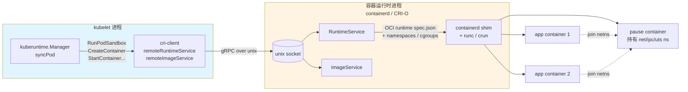
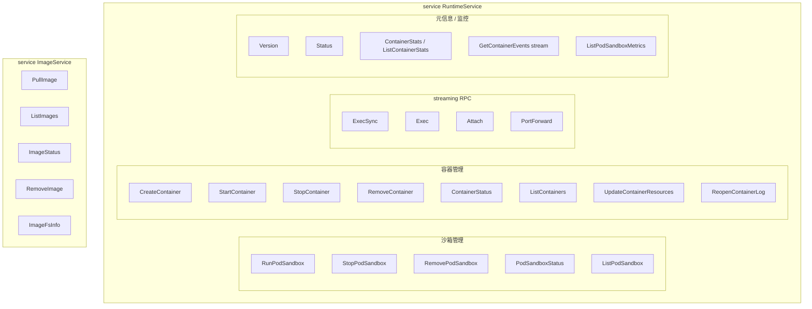
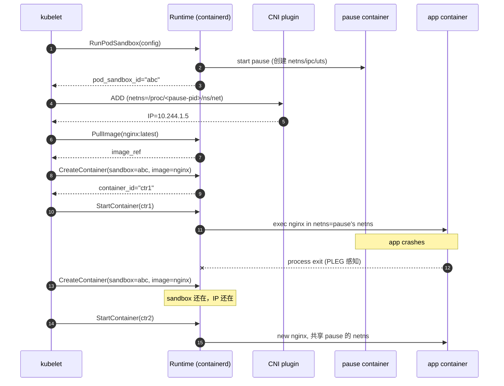
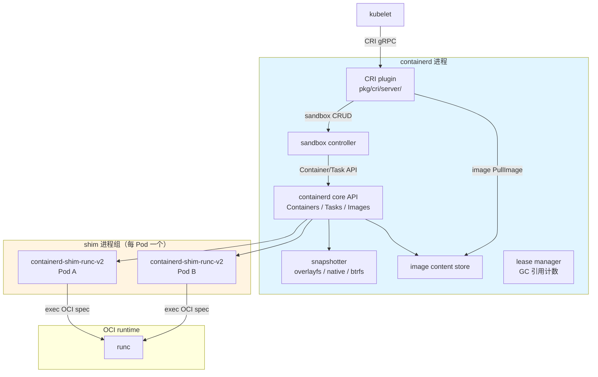
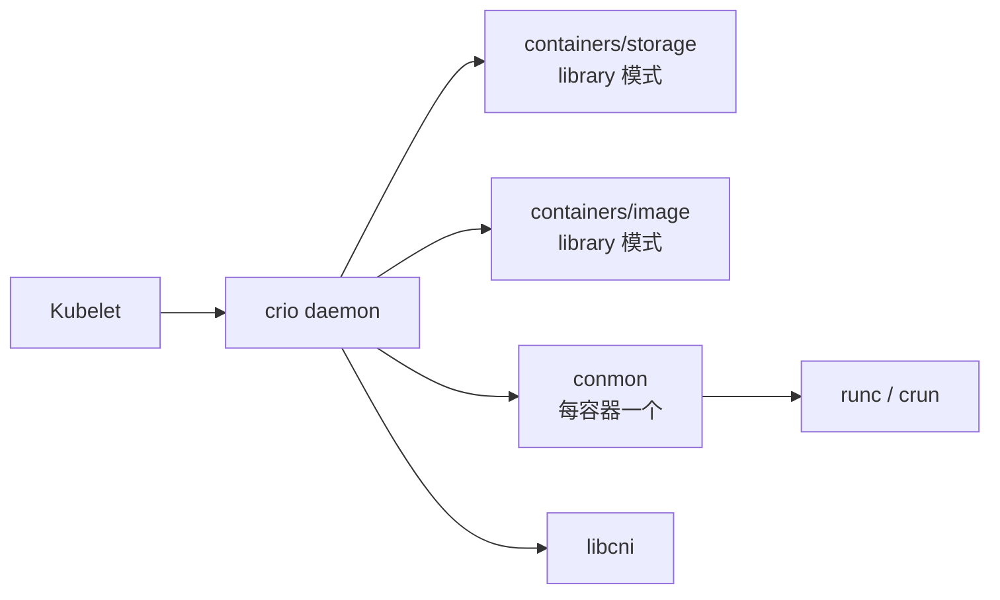
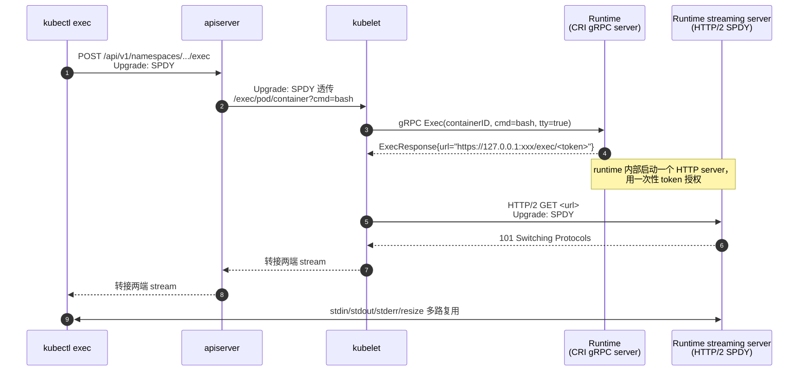

#kubernetes #cri #containerd #源码导读

相关笔记：[[kubelet-cri-source]] | [[oci-runtime]] | [[kubernetes-basics]] | [[docker-basics]] | [[cni-source]] | [[k8s-development-roadmap]] | [[k8s-interview]] | [[demo-fake-cri]]

## 概述

**CRI（Container Runtime Interface）** 是 kubelet 与底层容器运行时（containerd / CRI-O / 历史上还有 dockershim）之间的 **gRPC 接口契约**，最早由 KEP-0014（2016）提出，目的是把 kubelet 代码里硬编码的 docker 调用彻底剥离出来，让容器运行时变成"可插拔的下层组件"。每个节点上 kubelet 作为 gRPC client，通过一个 unix socket（默认 `/run/containerd/containerd.sock` 或 `/var/run/crio/crio.sock`）连接到本机运行时进程，这个进程实现两个 service：`RuntimeService`（沙箱 / 容器 / Exec 全套生命周期）和 `ImageService`（拉镜像 / 列镜像）。本篇是 CRI 的源码导读，与 [[kubelet-cri-source]] **互补**——那篇聚焦 kubelet 内部的 `syncLoop`、`PodConfig`、`podWorkers`、`PLEG` 如何驱动 syncPod 调用 CRI；本篇则深入 **CRI proto 本身的契约**、**`staging/src/k8s.io/cri-client` 客户端实现**、**sandbox + container 双层模型为什么这样设计**、**containerd CRI plugin 和 CRI-O 两种主流实现的内部差异**、**Exec/Attach/PortForward 的"两阶段 streaming"机制**，以及 **dockershim 从 v1.20 deprecate 到 v1.24 移除的全过程**。最后给出一个 `cloud-native/kubernetes/demos/fake-cri/` 下的最小可运行 fake CRI server，可以直接被 `crictl` 探测，用来"骗"kubelet 启动或做单元测试。CRI proto 路径基于 `k8s.io/cri-api/pkg/apis/runtime/v1/api.proto`（v1.31+，2138 行），客户端代码基于 `k8s.io/cri-client/pkg/`（v1.31+）。



这张图里最值得记住的两点：
1. **CRI 跨进程**——kubelet 和运行时是两个独立进程，通过本机 unix socket 通信。kubelet 升级/重启完全不影响容器；运行时升级理论上需要重启容器但 containerd 已经做到了 `restart=zero downtime`（shim 单独活着）。
2. **pause 容器持有命名空间**——业务容器加入 pause 的 netns/ipc/uts，所以业务容器 crash 不会丢 IP（除非整个 sandbox 销毁）。这是 sandbox/container 双层模型的核心。

## 一、CRI 的历史演进

理解 CRI 必须先理解它为什么会出现。早期 K8s（v1.0 ~ v1.5）的 kubelet 在 `pkg/kubelet/dockertools/` 里硬编码 docker 调用，要支持 rkt 就再硬编码一份 `rkttools/`，每加一个运行时就要在主干 PR 一遍。

| 时间 | 事件 | 影响 |
|------|------|------|
| 2016-06 | KEP-0014 提出 CRI | 设计 gRPC 接口契约，把运行时切出主干 |
| 2016-12 (v1.5) | CRI alpha，**dockershim 内置在 kubelet 里** | 兼容 docker 后端，kubelet 内部把 CRI 调用翻译成 docker API |
| 2017 (v1.7-1.8) | CRI-O 1.0 发布；containerd 1.0 集成 CRI plugin | 出现两个原生 CRI 运行时 |
| 2020-12 (v1.20) | dockershim **deprecated**，社区公告将移除 | 大量讨论："不让用 docker 了？" |
| 2022-04 (v1.24) | dockershim **被移除** | kubelet 不再内置 docker 适配器 |
| 2022 | Mirantis 推出 **cri-dockerd** | 外置 docker→CRI 适配器，让坚持用 docker 的人继续用 |
| 2023+ | containerd / CRI-O 成为 K8s 主流选择 | 云厂商默认 containerd（GKE、EKS、AKS 默认） |

需要澄清一个常见误解："dockershim 移除 ≠ docker 不能跑 K8s"——`cri-dockerd` 作为外部进程继续把 CRI 调用翻译成 docker API 调用，但多了一跳（kubelet → cri-dockerd → dockerd → containerd → runc），性能和复杂度都不如直接用 containerd（kubelet → containerd → runc）。所以新集群基本都用 containerd 直连。

## 二、CRI gRPC 契约总览

CRI proto 在 `staging/src/k8s.io/cri-api/pkg/apis/runtime/v1/api.proto`，定义了两个 service。



### RuntimeService 的 30+ 个 RPC

直接看 api.proto 头部的 service 声明（节选最关键的 RPC）：

```proto
// 文件: staging/src/k8s.io/cri-api/pkg/apis/runtime/v1/api.proto:24-50
service RuntimeService {
    // Version returns the runtime name, runtime version, and runtime API version.
    rpc Version(VersionRequest) returns (VersionResponse) {}

    // RunPodSandbox creates and starts a pod-level sandbox. Runtimes must ensure
    // the sandbox is in the ready state on success.
    rpc RunPodSandbox(RunPodSandboxRequest) returns (RunPodSandboxResponse) {}
    // StopPodSandbox stops any running process that is part of the sandbox and
    // reclaims network resources (e.g., IP addresses) allocated to the sandbox.
    // If there are any running containers in the sandbox, they must be forcibly
    // terminated.
    // This call is idempotent, and must not return an error if all relevant
    // resources have already been reclaimed. kubelet will call StopPodSandbox
    // at least once before calling RemovePodSandbox. It will also attempt to
    // reclaim resources eagerly, as soon as a sandbox is not needed. Hence,
    // multiple StopPodSandbox calls are expected.
    rpc StopPodSandbox(StopPodSandboxRequest) returns (StopPodSandboxResponse) {}
    // RemovePodSandbox removes the sandbox. If there are any running containers
    // in the sandbox, they must be forcibly terminated and removed.
    // This call is idempotent, and must not return an error if the sandbox has
    // already been removed.
    rpc RemovePodSandbox(RemovePodSandboxRequest) returns (RemovePodSandboxResponse) {}
    // PodSandboxStatus returns the status of the PodSandbox. If the PodSandbox is not
    // present, returns an error.
    rpc PodSandboxStatus(PodSandboxStatusRequest) returns (PodSandboxStatusResponse) {}
    // ListPodSandbox returns a list of PodSandboxes.
    rpc ListPodSandbox(ListPodSandboxRequest) returns (ListPodSandboxResponse) {}
```

注释里有几句很关键的契约：
- `StopPodSandbox` 必须 **idempotent**——多次调用必须返回成功，不能因为"已经停了"而报错。kubelet 在 Pod 删除流程里会反复调，运行时不允许把它当作错误。
- `RemovePodSandbox` 也必须幂等，且 kubelet 保证"先 Stop 再 Remove"——这就给运行时实现了一个简化空间：Remove 时如果发现没 Stop，可以选择强删而不是返回错误。

紧接着的容器管理段：

```proto
// 文件: staging/src/k8s.io/cri-api/pkg/apis/runtime/v1/api.proto:52-80
    // CreateContainer creates a new container in specified PodSandbox
    rpc CreateContainer(CreateContainerRequest) returns (CreateContainerResponse) {}
    // StartContainer starts the container.
    rpc StartContainer(StartContainerRequest) returns (StartContainerResponse) {}
    // StopContainer stops a running container with a grace period (i.e., timeout).
    // This call is idempotent, and must not return an error if the container has
    // already been stopped.
    // The runtime must forcibly kill the container after the grace period is
    // reached.
    rpc StopContainer(StopContainerRequest) returns (StopContainerResponse) {}
    // RemoveContainer removes the container. If the container is running, the
    // container must be forcibly removed.
    // This call is idempotent, and must not return an error if the container has
    // already been removed.
    rpc RemoveContainer(RemoveContainerRequest) returns (RemoveContainerResponse) {}
    // ListContainers lists all containers by filters.
    rpc ListContainers(ListContainersRequest) returns (ListContainersResponse) {}
    // ContainerStatus returns status of the container. If the container is not
    // present, returns an error.
    rpc ContainerStatus(ContainerStatusRequest) returns (ContainerStatusResponse) {}
    // UpdateContainerResources updates ContainerConfig of the container synchronously.
    // If runtime fails to transactionally update the requested resources, an error is returned.
    rpc UpdateContainerResources(UpdateContainerResourcesRequest) returns (UpdateContainerResourcesResponse) {}
    // ReopenContainerLog asks runtime to reopen the stdout/stderr log file
    // for the container. This is often called after the log file has been
    // rotated. If the container is not running, container runtime can choose
    // to either create a new log file and return nil, or return an error.
    // Once it returns error, new container log file MUST NOT be created.
    rpc ReopenContainerLog(ReopenContainerLogRequest) returns (ReopenContainerLogResponse) {}
```

`CreateContainer` 和 `StartContainer` **故意分开两个 RPC**——这是 CRI 的一个显式设计决定，让 kubelet 可以在 Create 完成、Start 之前插入额外动作（典型用途：把容器加入 cgroup，挂载某些只在 init 阶段需要的 volume，对接 Device Plugin 的 Allocate）。docker 的 `docker create` + `docker start` 本来就是分开的；CRI 沿用了这个范式而非合并成一个 `RunContainer`。

`ReopenContainerLog` 是日志切割场景的关键 RPC：logrotate 切完日志后必须通知 runtime 重新打开 fd，否则 runtime 还在写老的 inode。

接下来是 streaming RPC 组（详见 [§ Streaming RPC](#八streaming-rpc-详解exec--attach--portforward)）：

```proto
// 文件: staging/src/k8s.io/cri-api/pkg/apis/runtime/v1/api.proto:82-89
    // ExecSync runs a command in a container synchronously.
    rpc ExecSync(ExecSyncRequest) returns (ExecSyncResponse) {}
    // Exec prepares a streaming endpoint to execute a command in the container.
    rpc Exec(ExecRequest) returns (ExecResponse) {}
    // Attach prepares a streaming endpoint to attach to a running container.
    rpc Attach(AttachRequest) returns (AttachResponse) {}
    // PortForward prepares a streaming endpoint to forward ports from a PodSandbox.
    rpc PortForward(PortForwardRequest) returns (PortForwardResponse) {}
```

注意 `Exec` / `Attach` / `PortForward` 三个 RPC **不是真正的 bidirectional streaming**——它们的 response 只包含一个 URL（见后文），实际数据流走的是另一条 HTTP/2 SPDY 连接。`ExecSync` 是一个独立的同步版本，用于 probe（liveness/readiness exec probe）这种短命令场景，避免每次起 streaming 连接的开销。

### ImageService 的 5 个 RPC

```proto
// 文件: staging/src/k8s.io/cri-api/pkg/apis/runtime/v1/api.proto:143-166
service ImageService {
    // ListImages lists existing images.
    rpc ListImages(ListImagesRequest) returns (ListImagesResponse) {}
    // ImageStatus returns the status of the image. If the image is not
    // present, returns a response with ImageStatusResponse.Image set to
    // nil.
    rpc ImageStatus(ImageStatusRequest) returns (ImageStatusResponse) {}
    // PullImage pulls an image with authentication config.
    rpc PullImage(PullImageRequest) returns (PullImageResponse) {}
    // RemoveImage removes the image.
    // This call is idempotent, and must not return an error if the image has
    // already been removed.
    // Note that if the image is referenced by multiple tags (even across different repositories
    // if they resolve to the same image digest), removing the image by a single tag
    // will remove all of its tags. For example, if `repo/image:v1` and `another_repo/image:latest`
    // point to the same image, removing `repo/image:v1` will also remove `another_repo/image:latest`.
    // The next call to ListImages, ImageStatus, ImageFsInfo will not return this image.
    // The resources (e.g. disk space) may be cleaned asynchronously
    // and not guaranteed to be cleaned up by the time this method returns.
    rpc RemoveImage(RemoveImageRequest) returns (RemoveImageResponse) {}
    // ImageFSInfo returns information of the filesystem that is used to store images.
    // Usage information may include images that were removed, but are still being cleaned up.
    rpc ImageFsInfo(ImageFsInfoRequest) returns (ImageFsInfoResponse) {}
}
```

`ImageService` 和 `RuntimeService` **在 proto 层是两个独立 service**，但在 containerd / CRI-O 的实现里它们注册到**同一个 gRPC server、共用一个 socket**。这是个"逻辑分层 / 物理共址"的设计——kubelet 端 `cri-client` 也分成 `remoteRuntimeService` 和 `remoteImageService` 两个对象，但两者可以指向同一个 endpoint（默认 `--container-runtime-endpoint` 一个参数同时用于两个 service）。

`RemoveImage` 的注释里有个易被忽视的契约：删除一个 tag 会**删除所有指向同一 digest 的 tag**。这是 OCI image store 的共性，但应用层（比如 GC 策略）经常踩这个坑。

### 关键 schema：PodSandboxConfig

```proto
// 文件: staging/src/k8s.io/cri-api/pkg/apis/runtime/v1/api.proto:474-521
// PodSandboxConfig holds all the required and optional fields for creating a
// sandbox.
message PodSandboxConfig {
    // Metadata of the sandbox. This information will uniquely identify the
    // sandbox, and the runtime should leverage this to ensure correct
    // operation. The runtime may also use this information to improve UX, such
    // as by constructing a readable name.
    PodSandboxMetadata metadata = 1;
    // Hostname of the sandbox. Hostname could only be empty when the pod
    // network namespace is NODE.
    string hostname = 2;
    // Path to the directory on the host in which container log files are
    // stored.
    // By default the log of a container going into the LogDirectory will be
    // hooked up to STDOUT and STDERR. However, the LogDirectory may contain
    // binary log files with structured logging data from the individual
    // containers. For example, the files might be newline separated JSON
    // structured logs, systemd-journald journal files, gRPC trace files, etc.
    // E.g.,
    //     PodSandboxConfig.LogDirectory = `/var/log/pods/<NAMESPACE>_<NAME>_<UID>/`
    //     ContainerConfig.LogPath = `containerName/Instance#.log`
    string log_directory = 3;
    // DNS config for the sandbox.
    DNSConfig dns_config = 4;
    // Port mappings for the sandbox.
    repeated PortMapping port_mappings = 5;
    // Key-value pairs that may be used to scope and select individual resources.
    map<string, string> labels = 6;
    // Unstructured key-value map that may be set by the kubelet to store and
    // retrieve arbitrary metadata. This will include any annotations set on a
    // pod through the Kubernetes API.
    map<string, string> annotations = 7;
    // Optional configurations specific to Linux hosts.
    LinuxPodSandboxConfig linux = 8;
    // Optional configurations specific to Windows hosts.
    WindowsPodSandboxConfig windows = 9;
}
```

几个 kubelet ↔ 运行时的隐式约定：
- `log_directory` 形如 `/var/log/pods/<NAMESPACE>_<NAME>_<UID>/`——这是 kubelet 创建的目录，运行时必须把容器 stdout/stderr 写到这里。`kubectl logs` 后端读的就是这个路径，**完全不经过 CRI 数据面**。
- `labels` / `annotations` 必须原样回显（PodSandboxStatus 返回时不能改）——这是 kubelet 用来反查 Pod 身份的"标签集合"。
- `LinuxPodSandboxConfig.cgroup_parent`（见下）让 kubelet 控制 cgroup 树形结构；运行时只是"在指定 cgroup 下"创建容器。

```proto
// 文件: staging/src/k8s.io/cri-api/pkg/apis/runtime/v1/api.proto:442-455
message LinuxPodSandboxConfig {
    // Parent cgroup of the PodSandbox.
    // The cgroupfs style syntax will be used, but the container runtime can
    // convert it to systemd semantics if needed.
    string cgroup_parent = 1;
    // LinuxSandboxSecurityContext holds sandbox security attributes.
    LinuxSandboxSecurityContext security_context = 2;
    // Sysctls holds linux sysctls config for the sandbox.
    map<string, string> sysctls = 3;
    // Optional overhead represents the overheads associated with this sandbox
    LinuxContainerResources overhead = 4;
    // Optional resources represents the sum of container resources for this sandbox
    LinuxContainerResources resources = 5;
}
```

`overhead` 字段是 RuntimeClass 的 overhead 机制——比如 Kata Containers 起一个 VM 本身要 256 MB 内存，这部分要从 Pod 资源里减掉。kubelet 把它写在 sandbox 配置里，运行时按这个值预留 cgroup 配额。

### 关键 schema：ContainerConfig

```proto
// 文件: staging/src/k8s.io/cri-api/pkg/apis/runtime/v1/api.proto:1134-1195
message ContainerConfig {
    ContainerMetadata metadata = 1 ;
    // Image to use.
    ImageSpec image = 2;
    // Command to execute (i.e., entrypoint for docker)
    repeated string command = 3;
    // Args for the Command (i.e., command for docker)
    repeated string args = 4;
    // Current working directory of the command.
    string working_dir = 5;
    // List of environment variable to set in the container.
    repeated KeyValue envs = 6;
    // Mounts for the container.
    repeated Mount mounts = 7;
    // Devices for the container.
    repeated Device devices = 8;
    // Key-value pairs that may be used to scope and select individual resources.
    map<string, string> labels = 9;
    // Unstructured key-value map that may be used by the kubelet to store and
    // retrieve arbitrary metadata.
    map<string, string> annotations = 10;
    // Path relative to PodSandboxConfig.LogDirectory for container to store
    // the log (STDOUT and STDERR) on the host.
    string log_path = 11;

    // Variables for interactive containers, these have very specialized
    // use-cases (e.g. debugging).
    bool stdin = 12;
    bool stdin_once = 13;
    bool tty = 14;

    // Configuration specific to Linux containers.
    LinuxContainerConfig linux = 15;
    // Configuration specific to Windows containers.
    WindowsContainerConfig windows = 16;

    // CDI devices for the container.
    repeated CDIDevice CDI_devices = 17;

    // The custom stop signal for the container
    Signal stop_signal = 18;
}
```

要点对照：
- `command` ↔ docker 的 `entrypoint`；`args` ↔ docker 的 `cmd`——CRI 显式重命名为符合 K8s PodSpec 字段。
- `mounts` 是 kubelet 已经在主机上准备好的路径（典型路径 `/var/lib/kubelet/pods/<UID>/volumes/...`），运行时只负责把这些路径 bind mount 进容器。kubelet 在调 `CreateContainer` 之前已经通过 volumeManager + CSI driver 把宿主机路径准备好。
- `devices` 是 Device Plugin 框架填充的（GPU、RDMA 等）；`CDI_devices` 是 KEP-3063 引入的新机制（Container Device Interface），让设备厂商通过描述文件而不是 kubelet 内置逻辑来声明设备。
- `log_path` 是相对路径（`containerName/0.log`），与 PodSandboxConfig.log_directory 拼接成绝对路径——这样 sandbox 销毁时整个目录可以一起清。

## 三、sandbox 与 container 的双层模型

这是 CRI 设计里最不直观的一点：**为什么 RunPodSandbox 和 CreateContainer 分开**？

### 单层模型的问题

如果只有 `CreateContainer`：

- Pod 内多个容器要**共享 network namespace**（同一 IP，可以 `localhost` 互访）——必须有人先创建 netns，其他容器 join 进来。
- 这个"先创建"的人退出后 netns 应该保留还是销毁？Linux 的 netns 引用计数机制要求至少一个进程持有它。
- 如果第一个业务容器创建 netns，那它 crash 之后所有 Pod 内容器丢 IP。

### 双层模型的解决方案

CRI 引入 **sandbox**：

1. kubelet 先调 `RunPodSandbox`，运行时启动一个**最小进程**（`pause` 容器，C 程序，只睡眠 + 收 SIGTERM）持有 netns / ipc / uts。
2. 紧接着 kubelet 调 CNI 给 sandbox 配网（CNI 拿到 netns path 是 pause 容器的）。详见 [[cni-source]]。
3. 然后 `CreateContainer + StartContainer` 每个业务容器——运行时让业务容器**加入 sandbox 的 namespace**。
4. 业务容器 crash → kubelet 调 `CreateContainer` 重建一个新业务容器，**继续 join 同一个 sandbox**，**IP 不变**。



这种"sandbox 是 namespace 持有者"的设计与 docker 的 `--net=container:xxx` 完全等价，只是 CRI 把它正式化成 proto 字段。

> 历史小注：pause 容器的设计可以追溯到 Borg/lmctfy 时代，K8s 沿用并改名。pause 二进制只有几 KB，源码在 `build/pause/`，是一个 C 程序，主要逻辑就是注册 SIGTERM/SIGINT handler 然后 `pause()` 系统调用睡眠。

### sandbox 不重建的代价

后果之一：业务容器 image pull 失败时 sandbox 已经起来了，CNI 已经分配了 IP——这就是为什么 `ImagePullBackOff` 状态的 Pod 还是有 IP 的。kubelet 的 `syncPod` 路径会一直保留 sandbox，直到 Pod 整体被删除或者 sandbox 自身 NOTREADY。

后果之二：sandbox 残留的 zombie 资源——pause 进程、netns、cgroup、CNI 分配的 IP——必须由 `StopPodSandbox + RemovePodSandbox` 严格回收。早期 dockershim 有过"sandbox 删了但 CNI 没回收 IP"的 bug，最终导致 IP 池耗尽。

## 四、CRI 客户端：remote_runtime.go 源码导读

`staging/src/k8s.io/cri-client/pkg/remote_runtime.go` 是 kubelet 端的 gRPC client wrapper，把每个 CRI RPC 包装成一个 Go 方法，并加上超时、日志、错误降噪。

### 结构体与连接建立

```go
// 文件: staging/src/k8s.io/cri-client/pkg/remote_runtime.go:45-62
// remoteRuntimeService is a gRPC implementation of internalapi.RuntimeService.
type remoteRuntimeService struct {
    timeout       time.Duration
    runtimeClient runtimeapi.RuntimeServiceClient
    // Cache last per-container error message to reduce log spam
    logReduction *logreduction.LogReduction
    conn         *grpc.ClientConn
}

const (
    // How frequently to report identical errors
    identicalErrorDelay = 1 * time.Minute

    // connection parameters
    maxBackoffDelay      = 3 * time.Second
    baseBackoffDelay     = 100 * time.Millisecond
    minConnectionTimeout = 5 * time.Second
)
```

`logReduction` 这个字段值得一提：如果某个容器持续报错（比如 image 一直拉不下来），kubelet 每秒都会 syncPod 一次，每次都会调 CRI 拿到同一个错误。如果原样打日志会把 stderr 撑爆。`logreduction.LogReduction` 实现了"同一 containerID 的同一 error message 1 分钟内只打一次"。

`NewRemoteRuntimeService` 负责把 endpoint 字符串（`unix:///run/containerd/containerd.sock`）解析成 gRPC 连接：

```go
// 文件: staging/src/k8s.io/cri-client/pkg/remote_runtime.go:82-137
func NewRemoteRuntimeService(ctx context.Context, endpoint string, connectionTimeout time.Duration, tp trace.TracerProvider) (internalapi.RuntimeService, error) {
    logger := klog.FromContext(ctx)
    logger.V(3).Info("Connecting to runtime service", "endpoint", endpoint)
    addr, dialer, err := util.GetAddressAndDialer(endpoint)
    if err != nil {
        return nil, err
    }
    ctx, cancel := context.WithTimeout(ctx, connectionTimeout)
    defer cancel()

    var dialOpts []grpc.DialOption
    dialOpts = append(dialOpts,
        grpc.WithTransportCredentials(insecure.NewCredentials()),
        grpc.WithAuthority("localhost"),
        grpc.WithContextDialer(dialer),
        grpc.WithDefaultCallOptions(grpc.MaxCallRecvMsgSize(maxMsgSize)))
    if tp != nil {
        tracingOpts := []otelgrpc.Option{
            otelgrpc.WithMessageEvents(otelgrpc.ReceivedEvents, otelgrpc.SentEvents),
            otelgrpc.WithPropagators(propagation.NewCompositeTextMapPropagator(propagation.TraceContext{}, propagation.Baggage{})),
            otelgrpc.WithTracerProvider(tp),
        }
        dialOpts = append(dialOpts,
            grpc.WithStatsHandler(otelgrpc.NewClientHandler(tracingOpts...)))
    }

    connParams := grpc.ConnectParams{
        Backoff: backoff.DefaultConfig,
    }
    connParams.MinConnectTimeout = minConnectionTimeout
    connParams.Backoff.BaseDelay = baseBackoffDelay
    connParams.Backoff.MaxDelay = maxBackoffDelay
    dialOpts = append(dialOpts,
        grpc.WithConnectParams(connParams),
    )

    conn, err := grpc.DialContext(ctx, addr, dialOpts...)
    if err != nil {
        logger.Error(err, "Connect remote runtime service failed", "address", addr)
        return nil, err
    }

    service := &remoteRuntimeService{
        timeout:      connectionTimeout,
        logReduction: logreduction.NewLogReduction(identicalErrorDelay),
        conn:         conn,
    }

    if err := service.validateServiceConnection(ctx, conn, endpoint); err != nil {
        return nil, fmt.Errorf("validate service connection: %w", err)
    }

    return service, nil
}
```

几个细节：
- `util.GetAddressAndDialer(endpoint)`——把 `unix:///run/containerd/containerd.sock` 拆成 socket path + 一个返回 `net.Conn` 的 dialer 函数。这个 helper 在 `cri-client/pkg/util/util_unix.go`。
- `insecure.NewCredentials()`——unix socket 本来就靠文件系统权限保护，**不需要 TLS**。这与 [[csi-source]] 里 CSI socket 是一样的。
- `grpc.WithAuthority("localhost")`——unix socket 没有真正的 host，给 gRPC 一个占位 authority。
- `MaxCallRecvMsgSize`——`maxMsgSize` 是 16 MB，CRI 单次调用响应不能超过这个量。`ListContainers` 在节点容器特别多时可能撞上限。
- `grpc.DialContext` 已经被 grpc-go 标记为 deprecated，新代码应该用 `grpc.NewClient`——cri-client 还没切（写本文时，v1.31）。

`validateServiceConnection` 在拿到 conn 之后立刻调一次 `Version`：

```go
// 文件: staging/src/k8s.io/cri-client/pkg/remote_runtime.go:148-159
func (r *remoteRuntimeService) validateServiceConnection(ctx context.Context, conn *grpc.ClientConn, endpoint string) error {
    logger := klog.FromContext(ctx)
    logger.V(4).Info("Validating the CRI v1 API runtime version")
    r.runtimeClient = runtimeapi.NewRuntimeServiceClient(conn)

    if _, err := r.runtimeClient.Version(ctx, &runtimeapi.VersionRequest{}); err != nil {
        return fmt.Errorf("validate CRI v1 runtime API for endpoint %q: %w", endpoint, err)
    }

    logger.V(2).Info("Validated CRI v1 runtime API")
    return nil
}
```

这是个"立刻探测"：gRPC `DialContext` 默认是 lazy 的（连接到第一次 RPC 才建立），不主动握手就发现不了 socket 错配 / 服务还没起 / proto 不兼容。kubelet 启动早期就在这里 fail-fast。

### RunPodSandbox：故意翻倍 timeout

```go
// 文件: staging/src/k8s.io/cri-client/pkg/remote_runtime.go:206-239
func (r *remoteRuntimeService) RunPodSandbox(ctx context.Context, config *runtimeapi.PodSandboxConfig, runtimeHandler string) (string, error) {
    // Use 2 times longer timeout for sandbox operation (4 mins by default)
    // TODO: Make the pod sandbox timeout configurable.
    timeout := r.timeout * 2

    logger := klog.FromContext(ctx)
    logger.V(10).Info("[RemoteRuntimeService] RunPodSandbox", "config", config, "runtimeHandler", runtimeHandler, "timeout", timeout)

    ctx, cancel := context.WithTimeout(ctx, timeout)
    defer cancel()

    resp, err := r.runtimeClient.RunPodSandbox(ctx, &runtimeapi.RunPodSandboxRequest{
        Config:         config,
        RuntimeHandler: runtimeHandler,
    })

    if err != nil {
        logger.Error(err, "RunPodSandbox from runtime service failed")
        return "", err
    }

    podSandboxID := resp.PodSandboxId

    if podSandboxID == "" {
        errorMessage := fmt.Sprintf("PodSandboxId is not set for sandbox %q", config.Metadata)
        err := errors.New(errorMessage)
        logger.Error(err, "RunPodSandbox failed")
        return "", err
    }

    logger.V(10).Info("[RemoteRuntimeService] RunPodSandbox Response", "podSandboxID", podSandboxID)

    return podSandboxID, nil
}
```

要点：
- `timeout := r.timeout * 2`——sandbox 创建涉及 CNI ADD（可能下载 IPAM、调用云厂商 API 分配 ENI）、镜像 pull、namespace 创建，比普通 RPC 慢。默认 r.timeout=2min（kubelet 启动参数），sandbox 给到 4min。
- `podSandboxID == ""` 的防御性检查——proto 不会强制非空，但 kubelet 拿到空 ID 后续根本没法用，所以提前 fail。
- `runtimeHandler` 字段对接 RuntimeClass（KEP-585），让 kubelet 告诉运行时"用 runc 还是 kata"。
- 这个函数**没做幂等检查**——kubelet 端 `kuberuntime_manager.go` 通过 ListPodSandbox 比对 sandbox 是否已存在，所以这层不需要再判。

### CreateContainer + StartContainer：分两步

```go
// 文件: staging/src/k8s.io/cri-client/pkg/remote_runtime.go:340-388
func (r *remoteRuntimeService) CreateContainer(ctx context.Context, podSandBoxID string, config *runtimeapi.ContainerConfig, sandboxConfig *runtimeapi.PodSandboxConfig) (string, error) {
    logger := klog.FromContext(ctx)
    logger.V(10).Info("[RemoteRuntimeService] CreateContainer", "podSandboxID", podSandBoxID, "timeout", r.timeout)
    ctx, cancel := context.WithTimeout(ctx, r.timeout)
    defer cancel()

    return r.createContainerV1(ctx, podSandBoxID, config, sandboxConfig)
}

func (r *remoteRuntimeService) createContainerV1(ctx context.Context, podSandBoxID string, config *runtimeapi.ContainerConfig, sandboxConfig *runtimeapi.PodSandboxConfig) (string, error) {
    logger := klog.FromContext(ctx)
    resp, err := r.runtimeClient.CreateContainer(ctx, &runtimeapi.CreateContainerRequest{
        PodSandboxId:  podSandBoxID,
        Config:        config,
        SandboxConfig: sandboxConfig,
    })
    if err != nil {
        logger.Error(err, "CreateContainer in sandbox from runtime service failed", "podSandboxID", podSandBoxID)
        return "", err
    }

    logger.V(10).Info("[RemoteRuntimeService] CreateContainer", "podSandboxID", podSandBoxID, "containerID", resp.ContainerId)
    if resp.ContainerId == "" {
        errorMessage := fmt.Sprintf("ContainerId is not set for container %q", config.Metadata)
        err := errors.New(errorMessage)
        logger.Error(err, "CreateContainer failed")
        return "", err
    }

    return resp.ContainerId, nil
}

// StartContainer starts the container.
func (r *remoteRuntimeService) StartContainer(ctx context.Context, containerID string) (err error) {
    logger := klog.FromContext(ctx)
    logger.V(10).Info("[RemoteRuntimeService] StartContainer", "containerID", containerID, "timeout", r.timeout)
    ctx, cancel := context.WithTimeout(ctx, r.timeout)
    defer cancel()

    if _, err := r.runtimeClient.StartContainer(ctx, &runtimeapi.StartContainerRequest{
        ContainerId: containerID,
    }); err != nil {
        logger.Error(err, "StartContainer from runtime service failed", "containerID", containerID)
        return err
    }
    logger.V(10).Info("[RemoteRuntimeService] StartContainer Response", "containerID", containerID)

    return nil
}
```

注意 `CreateContainerRequest` 同时携带 **`Config` 和 `SandboxConfig`**——sandbox config 已经在 `RunPodSandbox` 时给过运行时一次了，这里再传一次是因为：
1. 运行时实现可能没有把 sandbox config 持久化（无状态运行时），需要每次 create container 时再拿到。
2. 让 RPC 自包含——单看 `CreateContainerRequest` 不需要回查 sandbox 状态。

`StartContainer` 极简——只传 `ContainerId`，因为所有配置已经在 Create 阶段固化。Start 等价于 OCI runtime 的 `runc start <id>`。

### Exec：拿 URL 不拿数据

```go
// 文件: staging/src/k8s.io/cri-client/pkg/remote_runtime.go:567-593
func (r *remoteRuntimeService) Exec(ctx context.Context, req *runtimeapi.ExecRequest) (*runtimeapi.ExecResponse, error) {
    logger := klog.FromContext(ctx)
    logger.V(10).Info("[RemoteRuntimeService] Exec", "timeout", r.timeout)
    ctx, cancel := context.WithTimeout(ctx, r.timeout)
    defer cancel()

    return r.execV1(ctx, req)
}

func (r *remoteRuntimeService) execV1(ctx context.Context, req *runtimeapi.ExecRequest) (*runtimeapi.ExecResponse, error) {
    resp, err := r.runtimeClient.Exec(ctx, req)
    logger := klog.FromContext(ctx)
    if err != nil {
        logger.Error(err, "Exec cmd from runtime service failed", "containerID", req.ContainerId, "cmd", req.Cmd)
        return nil, err
    }
    logger.V(10).Info("[RemoteRuntimeService] Exec Response")

    if resp.Url == "" {
        errorMessage := "URL is not set"
        err := errors.New(errorMessage)
        logger.Error(err, "Exec failed")
        return nil, err
    }

    return resp, nil
}
```

`resp.Url` 才是关键——kubelet 拿到这个 URL 后会**关闭 gRPC 这条连接，转去拨这个 URL**走 SPDY/HTTP2。详见 §八。

### Status：runtime / network ready 探测

```go
// 文件: staging/src/k8s.io/cri-client/pkg/remote_runtime.go:694-724
func (r *remoteRuntimeService) Status(ctx context.Context, verbose bool) (*runtimeapi.StatusResponse, error) {
    ctx, cancel := context.WithTimeout(ctx, r.timeout)
    defer cancel()

    return r.statusV1(ctx, verbose)
}

func (r *remoteRuntimeService) statusV1(ctx context.Context, verbose bool) (*runtimeapi.StatusResponse, error) {
    resp, err := r.runtimeClient.Status(ctx, &runtimeapi.StatusRequest{
        Verbose: verbose,
    })
    if err != nil {
        logger := klog.FromContext(ctx)
        logger.Error(err, "Status from runtime service failed")
        return nil, err
    }
```

`StatusResponse` 内部有两个核心 condition：`RuntimeReady` 和 `NetworkReady`。kubelet 每隔几秒调一次 `Status`，任一为 false 就把节点标记成 `NotReady`，调度器据此停止往该节点投 Pod。`NetworkReady` 通常意味着 CNI 配置文件已经被运行时读到（containerd 通过 `cni.conf_dir` 监控）。

## 五、CRI 客户端：remote_image.go 源码导读

`remote_image.go` 比 `remote_runtime.go` 简单很多——5 个 RPC，文件 254 行。

### 结构与连接

```go
// 文件: staging/src/k8s.io/cri-client/pkg/remote_image.go:42-104
type remoteImageService struct {
    timeout     time.Duration
    imageClient runtimeapi.ImageServiceClient
    conn        *grpc.ClientConn
}

// NewRemoteImageService creates a new internalapi.ImageManagerService.
func NewRemoteImageService(ctx context.Context, endpoint string, connectionTimeout time.Duration, tp trace.TracerProvider) (internalapi.ImageManagerService, error) {
    logger := klog.FromContext(ctx)
    logger.V(3).Info("Connecting to image service", "endpoint", endpoint)
    addr, dialer, err := util.GetAddressAndDialer(endpoint)
    if err != nil {
        return nil, err
    }

    ctx, cancel := context.WithTimeout(ctx, connectionTimeout)
    defer cancel()

    var dialOpts []grpc.DialOption
    dialOpts = append(dialOpts,
        grpc.WithTransportCredentials(insecure.NewCredentials()),
        grpc.WithAuthority("localhost"),
        grpc.WithContextDialer(dialer),
        grpc.WithDefaultCallOptions(grpc.MaxCallRecvMsgSize(maxMsgSize)))
```

`NewRemoteImageService` 和 `NewRemoteRuntimeService` 的代码几乎完全一致——同样的 dial options、同样的 backoff 参数。唯一区别是 `validateServiceConnection` 调的是 `ImageFsInfo`（任何无副作用 RPC 都行）而不是 `Version`。

注意 kubelet 用 `--image-service-endpoint` 单独配置 image service 的 socket，**但绝大多数时候和 runtime endpoint 同一个值**。containerd 和 CRI-O 都把两个 service 注册到同一个 gRPC server。如果不显式设置 image endpoint，kubelet 默认复用 runtime endpoint。

### PullImage：image_ref 是结果

```go
// 文件: staging/src/k8s.io/cri-client/pkg/remote_image.go:182-220
func (r *remoteImageService) PullImage(ctx context.Context, image *runtimeapi.ImageSpec, auth *runtimeapi.AuthConfig, podSandboxConfig *runtimeapi.PodSandboxConfig) (string, error) {
    ctx, cancel := context.WithCancel(ctx)
    defer cancel()

    return r.pullImageV1(ctx, image, auth, podSandboxConfig)
}

func (r *remoteImageService) pullImageV1(ctx context.Context, image *runtimeapi.ImageSpec, auth *runtimeapi.AuthConfig, podSandboxConfig *runtimeapi.PodSandboxConfig) (string, error) {
    resp, err := r.imageClient.PullImage(ctx, &runtimeapi.PullImageRequest{
        Image:         image,
        Auth:          auth,
        SandboxConfig: podSandboxConfig,
    })
    if err != nil {
        logger := klog.FromContext(ctx)
        logger.Error(err, "PullImage from image service failed", "image", image.Image)

        // We can strip the code from unknown status errors since they add no value
        // and will make them easier to read in the logs/events.
        //
        // It also ensures that checking custom error types from pkg/kubelet/images/types.go
        // works in `imageManager.EnsureImageExists` (pkg/kubelet/images/image_manager.go).
        statusErr, ok := status.FromError(err)
        if ok && statusErr.Code() == codes.Unknown {
            return "", errors.New(statusErr.Message())
        }

        return "", err
    }

    if resp.ImageRef == "" {
        logger := klog.FromContext(ctx)
        logger.Error(errors.New("PullImage failed"), "ImageRef of image is not set", "image", image.Image)
        errorMessage := fmt.Sprintf("imageRef of image %q is not set", image.Image)
        return "", errors.New(errorMessage)
    }

    return resp.ImageRef, nil
}
```

要点：
- **没有 timeout**——只有 `WithCancel`。镜像大可能十几分钟才拉完，固定 timeout 会经常 fail；上层 `imageManager` 根据 backoff 决定何时取消。
- `Auth` 字段来自 kubelet 解析 Pod 上的 `imagePullSecrets`——`AuthConfig` 里那一组 `username/password/auth/identity_token/registry_token` 全是 `debug_redact = true`（见 proto:1631-1641），日志里会自动脱敏。
- 返回的 `ImageRef` 是**运行时定义的唯一 ID**（containerd 用 sha256 digest，CRI-O 也用 digest），后续 `CreateContainer` 时引用就是这个值——不是 image name。
- `codes.Unknown` 的剥离是给上层 `imageManager.EnsureImageExists` 用的：它要根据 error message 字符串判断 `ErrImagePull`、`ImageNeverPull`、`RegistryUnavailable` 等，gRPC 把 message 包在 status 里会破坏字符串匹配。

### ListImages：filter 是可选

```go
// 文件: staging/src/k8s.io/cri-client/pkg/remote_image.go:128-147
func (r *remoteImageService) ListImages(ctx context.Context, filter *runtimeapi.ImageFilter) ([]*runtimeapi.Image, error) {
    ctx, cancel := context.WithTimeout(ctx, r.timeout)
    defer cancel()

    return r.listImagesV1(ctx, filter)
}

func (r *remoteImageService) listImagesV1(ctx context.Context, filter *runtimeapi.ImageFilter) ([]*runtimeapi.Image, error) {
    resp, err := r.imageClient.ListImages(ctx, &runtimeapi.ListImagesRequest{
        Filter: filter,
    })
    if err != nil {
        logger := klog.FromContext(ctx)
        logger.Error(err, "ListImages with filter from image service failed", "filter", filter)
        return nil, err
    }

    return resp.Images, nil
}
```

ImageGC（kubelet `pkg/kubelet/images/image_gc_manager.go`）每分钟调一次 `ListImages` 拿到所有 image + size，再对比 `ListContainers` 拿到的 in-use image，把没人用且超过 grace period 的删掉。`Filter` 字段一般传 nil，全量返回。

### ImageStatus：探测 image 是否已 cache

```go
// 文件: staging/src/k8s.io/cri-client/pkg/remote_image.go:150-179
func (r *remoteImageService) ImageStatus(ctx context.Context, image *runtimeapi.ImageSpec, verbose bool) (*runtimeapi.ImageStatusResponse, error) {
    ctx, cancel := context.WithTimeout(ctx, r.timeout)
    defer cancel()

    return r.imageStatusV1(ctx, image, verbose)
}

func (r *remoteImageService) imageStatusV1(ctx context.Context, image *runtimeapi.ImageSpec, verbose bool) (*runtimeapi.ImageStatusResponse, error) {
    resp, err := r.imageClient.ImageStatus(ctx, &runtimeapi.ImageStatusRequest{
        Image:   image,
        Verbose: verbose,
    })
    if err != nil {
        logger := klog.FromContext(ctx)
        logger.Error(err, "Get ImageStatus from image service failed", "image", image.Image)
        return nil, err
    }

    if resp.Image != nil {
        if resp.Image.Id == "" || resp.Image.Size == 0 {
            errorMessage := fmt.Sprintf("Id or size of image %q is not set", image.Image)
            err := errors.New(errorMessage)
            logger := klog.FromContext(ctx)
            logger.Error(err, "ImageStatus failed", "image", image.Image)
            return nil, err
        }
    }

    return resp, nil
}
```

`imageManager.EnsureImageExists` 流程：先 `ImageStatus(image)`，如果 `resp.Image != nil` 就直接复用；否则才 `PullImage`。这是 `imagePullPolicy: IfNotPresent` 行为的根。

## 六、containerd CRI plugin 架构

> 以下代码引用基于 **containerd 1.7+** 源码（`containerd/containerd` repo），不在本地，**行号近似**，主要用于讲清架构层次。

containerd 的整体结构：



层次解释：

1. **CRI plugin** (`containerd/pkg/cri/`) —— containerd 的一个 in-process plugin，提供 CRI gRPC service。它本身**不直接操作容器**，而是把 CRI 概念翻译成 containerd 原生 API。kubelet 看到的 `RunPodSandbox` 在这里被翻译成 "create container with image=pause + create task + start task"。
2. **sandbox controller** —— containerd 1.7 把 sandbox 提升为顶层概念（之前是 CRI plugin 内部的"特殊容器"）。引入这层是为了支持 Kata、gVisor 这类 VM-sandbox runtime——它们的 sandbox 是一个 VM，不是普通容器。
3. **containerd core** —— 提供 `Containers`、`Tasks`、`Images`、`Snapshots`、`Content` 等基础 API。CRI plugin 只是众多消费者之一（CLI `ctr`、`nerdctl` 也用同一组 API）。
4. **snapshotter** —— containerd 的镜像存储层，支持 overlayfs、native（拷贝）、btrfs、zfs、stargz（懒加载）。`CreateContainer` 时 snapshotter 给容器准备 rootfs。
5. **shim** —— `containerd-shim-runc-v2` 每个 Pod 一个独立进程，作为容器的"父进程代理"。containerd daemon 重启时 shim 仍在，容器不死。这是 containerd 相对早期 docker 最重要的架构演进。
6. **runc** —— 最终调 `runc create + runc start`，把 OCI spec.json 转化成 namespace + cgroup + 进程。详见 [[oci-runtime]]。

### CRI plugin 的关键文件

| 路径 | 职责 |
|------|------|
| `pkg/cri/server/server.go` | 注册 RuntimeService + ImageService 到 gRPC server |
| `pkg/cri/server/sandbox_run.go` | `RunPodSandbox` 实现：起 pause 容器 + 创建 task + 调用 CNI |
| `pkg/cri/server/container_create.go` | `CreateContainer` 实现：生成 OCI spec + create snapshot |
| `pkg/cri/server/container_start.go` | `StartContainer` 实现：create + start task |
| `pkg/cri/server/streaming.go` | Exec/Attach/PortForward 的 streaming server（HTTP/SPDY） |
| `pkg/cri/store/sandbox/` | sandbox 内存索引 |
| `pkg/cri/store/container/` | container 内存索引 |

containerd 选择**在内存里维护 sandbox/container 索引**而不是落盘——重启时通过 list containerd 原生容器并按 label 筛选重建索引。这意味着 containerd 重启不会丢容器状态（容器还在 shim 里跑），但内存索引有几秒重建窗口。

### 与 docker 模式的对比

| 维度 | docker（已废弃 K8s 后端） | containerd |
|------|--------------------------|-------------|
| 进程模型 | dockerd → containerd → shim → runc | containerd → shim → runc |
| 跳数 | 4 跳 | 3 跳 |
| 高层概念 | image、network、volume、build | 仅 container + task + snapshot |
| build 支持 | 内置 | 不支持，靠 BuildKit |
| K8s 适配 | 需要 dockershim / cri-dockerd | 原生 CRI plugin |
| daemon 重启 | docker daemon 重启会有问题 | shim 单独活，daemon 重启不影响容器 |

containerd 的极简哲学：把所有"用户友好"特性（build、compose、network 编排）抽出去，core 只关心容器运行时本身。这与 K8s 的"调度+网络+存储编排"职责完美互补——所以 containerd 后来居上成为 K8s 默认选择。

## 七、CRI-O 简介

> 以下基于 **CRI-O 1.30+**（`cri-o/cri-o` repo），不在本地，行号近似。

CRI-O 比 containerd 更激进——它是 **专门为 K8s 设计的 CRI 实现**，没有 daemon CLI、没有 build、没有兼容 docker。



| 维度 | CRI-O | containerd |
|------|-------|-------------|
| 设计目标 | 只为 K8s 实现 CRI | 通用容器运行时 |
| 用户 CLI | 仅 `crictl`（CRI 标准工具） | 还有 `ctr`、`nerdctl` |
| 大小 | 二进制更小 | 略大（plugin 多） |
| Image / Storage | 用 podman 同一套 library | 自己实现 |
| 监工进程 | conmon（每容器一个 C 进程） | shim（每 Pod 一个 Go 进程） |
| 主流发行版 | RHEL / OpenShift 默认 | GKE / EKS / Docker Desktop 默认 |
| 演进风格 | 严格跟着 CRI / K8s 版本走 | 自己也维护非 K8s 用户群 |

**conmon vs shim 的差别**：CRI-O 的 conmon 是 C 写的，每个容器一个，只负责 stdin/stdout/stderr 转发 + 等容器退出。containerd shim 是 Go 写的，每个 sandbox 一个，承担更多（attach、exec 转发、task lifecycle）。CRI-O 的设计假设"K8s 不需要 attach/exec 持久连接的高密度场景"，所以 conmon 更轻。

实际工程选择：如果你跑 OpenShift / Red Hat 全家桶就用 CRI-O；其他情况下 containerd 是事实标准。两者性能差距在 1% 量级，工程语境下无差别。

## 八、Streaming RPC 详解：Exec / Attach / PortForward

`kubectl exec -it pod -- bash` 的数据流是 CRI 设计里最巧妙的部分。

### 问题：gRPC 不适合长连接 + TTY

`Exec` 本质需要 **bidirectional streaming + TTY resize 信号 + stdin 输入 / stdout 输出 / stderr 输出三流分离**。gRPC 的 streaming 能做到双向，但：
- `kubectl exec` 客户端是 K8s 用户 CLI，走 HTTPS 到 API server，再由 API server 转发——多一跳变成 client → apiserver → kubelet → runtime，gRPC 在这条链路上中间环节不好穿透。
- 历史包袱：K8s 早期 `kubectl exec` 走 SPDY（HTTP/1.1 over TLS 的多路复用扩展），现在迁移到 WebSocket。CRI 不想被这个协议选择绑死。

### 解决方案：两阶段连接



CRI `Exec` RPC 只完成第 3-4 步：runtime 准备好一个临时 endpoint，把 URL 给 kubelet；后续真正的数据流走 SPDY/WebSocket。两个好处：
1. **CRI 不需要在 gRPC 里携带音视频/TTY 数据**——proto 永远短小；高吞吐数据走 HTTP/2。
2. **协议演进解耦**——runtime 可以独立把 SPDY 升级到 WebSocket，不需要改 CRI proto。

`ExecResponse` 的 proto 只有一行：

```proto
// 文件: staging/src/k8s.io/cri-api/pkg/apis/runtime/v1/api.proto:1506-1530
message ExecRequest {
    // ID of the container in which to execute the command.
    string container_id = 1;
    // Command to execute.
    repeated string cmd = 2;
    // Whether to exec the command in a TTY.
    bool tty = 3;
    // Whether to stream stdin.
    // One of `stdin`, `stdout`, and `stderr` MUST be true.
    bool stdin = 4;
    // Whether to stream stdout.
    // One of `stdin`, `stdout`, and `stderr` MUST be true.
    bool stdout = 5;
    // Whether to stream stderr.
    // One of `stdin`, `stdout`, and `stderr` MUST be true.
    // If `tty` is true, `stderr` MUST be false. Multiplexing is not supported
    // in this case. The output of stdout and stderr will be combined to a
    // single stream.
    bool stderr = 6;
}

message ExecResponse {
    // Fully qualified URL of the exec streaming server.
    string url = 1;
}
```

`Attach` 和 `PortForward` 的 response 也只是一个 URL；`PortForward` 的 request 带 `pod_sandbox_id + repeated int32 port`（**注意是 sandbox 级别，不是 container 级别**——port forward 进入 Pod 的 netns，与具体容器无关）。

### token 安全模型

streaming URL 里的 token 是 runtime 一次性生成的，containerd 实现见 `pkg/cri/streaming/`。token 写在 URL path 里，验证时只允许同一个 host 的连接（防止 URL 泄漏被外部利用）。kubelet 在 v1.31+ 还支持把 streaming server 端口绑定到 localhost only。

### 为什么 ExecSync 单独存在

`ExecSync` 不返回 URL，而是直接返回 stdout/stderr/exit_code：

```proto
// 文件: staging/src/k8s.io/cri-api/pkg/apis/runtime/v1/api.proto:1486-1504
message ExecSyncResponse {
    // Captured command stdout output.
    // The runtime should cap the output of this response to 16MB.
    // If the stdout of the command produces more than 16MB, the remaining output
    // should be discarded, and the command should proceed with no error.
    bytes stdout = 1;
    // Captured command stderr output.
    bytes stderr = 2;
    // Exit code the command finished with. Default: 0 (success).
    int32 exit_code = 3;
}
```

为什么要两个 RPC？**exec probe 场景**——kubelet 每秒可能调几十次 exec 检查 `command: ["/bin/healthcheck"]`，如果每次都走 streaming 连接，开销巨大（建 SPDY 连接、握手、close）。`ExecSync` 是个"原子 RPC"：一次请求拿到完整结果，runtime 内部仍然走 streaming 但客户端看到的是简单 gRPC。注意 16 MB 的 stdout / stderr 上限——超出会被丢弃，这是 CVE-2022-1708 / CVE-2022-31030 的后果（恶意容器可以靠 exec probe 撑爆 kubelet 内存）。

## 九、手写简化复现：mini fake CRI server

下面这段 ~100 行 Go 骨架展示了"启动一个最小 CRI gRPC server"的关键步骤。完整可编译版本在 `cloud-native/kubernetes/demos/fake-cri/`。

```go
package main

import (
    "context"
    "fmt"
    "log"
    "net"
    "os"
    "os/signal"
    "sync"
    "syscall"
    "time"

    "google.golang.org/grpc"
    runtimeapi "k8s.io/cri-api/pkg/apis/runtime/v1"
)

const sockPath = "/tmp/fake-cri.sock"

// fakeRuntime 用 in-memory map 存 sandbox，假装实现 RuntimeService。
type fakeRuntime struct {
    runtimeapi.UnimplementedRuntimeServiceServer
    mu        sync.Mutex
    sandboxes map[string]*runtimeapi.PodSandbox // id -> sandbox
}

func (f *fakeRuntime) Version(_ context.Context, _ *runtimeapi.VersionRequest) (*runtimeapi.VersionResponse, error) {
    return &runtimeapi.VersionResponse{
        Version:           "0.1.0",
        RuntimeName:       "fake-cri",
        RuntimeVersion:    "v0.0.1",
        RuntimeApiVersion: "v1",
    }, nil
}

func (f *fakeRuntime) RunPodSandbox(_ context.Context, req *runtimeapi.RunPodSandboxRequest) (*runtimeapi.RunPodSandboxResponse, error) {
    f.mu.Lock()
    defer f.mu.Unlock()
    id := fmt.Sprintf("sandbox-%d", time.Now().UnixNano())
    f.sandboxes[id] = &runtimeapi.PodSandbox{
        Id:        id,
        Metadata:  req.Config.Metadata,
        State:     runtimeapi.PodSandboxState_SANDBOX_READY,
        CreatedAt: time.Now().UnixNano(),
        Labels:    req.Config.Labels,
    }
    log.Printf("RunPodSandbox: %s (pod=%s)", id, req.Config.Metadata.Name)
    return &runtimeapi.RunPodSandboxResponse{PodSandboxId: id}, nil
}

func (f *fakeRuntime) ListPodSandbox(_ context.Context, _ *runtimeapi.ListPodSandboxRequest) (*runtimeapi.ListPodSandboxResponse, error) {
    f.mu.Lock()
    defer f.mu.Unlock()
    list := make([]*runtimeapi.PodSandbox, 0, len(f.sandboxes))
    for _, s := range f.sandboxes {
        list = append(list, s)
    }
    return &runtimeapi.ListPodSandboxResponse{Items: list}, nil
}

func (f *fakeRuntime) Status(_ context.Context, _ *runtimeapi.StatusRequest) (*runtimeapi.StatusResponse, error) {
    return &runtimeapi.StatusResponse{
        Status: &runtimeapi.RuntimeStatus{
            Conditions: []*runtimeapi.RuntimeCondition{
                {Type: runtimeapi.RuntimeReady, Status: true},
                {Type: runtimeapi.NetworkReady, Status: true},
            },
        },
    }, nil
}

func main() {
    _ = os.Remove(sockPath)
    lis, err := net.Listen("unix", sockPath)
    if err != nil {
        log.Fatal(err)
    }
    server := grpc.NewServer()
    runtimeapi.RegisterRuntimeServiceServer(server, &fakeRuntime{
        sandboxes: map[string]*runtimeapi.PodSandbox{},
    })

    go func() {
        sigc := make(chan os.Signal, 1)
        signal.Notify(sigc, syscall.SIGTERM, syscall.SIGINT)
        <-sigc
        server.GracefulStop()
    }()
    log.Printf("fake-cri listening on %s", sockPath)
    if err := server.Serve(lis); err != nil {
        log.Fatal(err)
    }
}
```

运行后用 `crictl --runtime-endpoint unix:///tmp/fake-cri.sock version` 应该能拿到 `fake-cri v0.0.1`。详细配置和完整版本（含 Stop/Remove/PodSandboxStatus）见 `demos/fake-cri/`。

这个 fake 实现的用途：
- 给 kubelet 单元测试 mock 用（避免起真 runtime）。
- 教学场景下让学生看清 CRI 的"最小可工作集"——三个 RPC 就够 kubelet 进入 `NodeReady`。
- 开发 CRI 工具（crictl、e2e 测试框架）时的本地占位。

## 十、常见陷阱与排错

### 1. Pod restart 时 sandbox 不重建

`kubectl describe pod` 看到 RESTARTS=5 但 Pod IP 始终不变——这是正常的。只有以下场景才会重建 sandbox：
- `PodSandboxStatus.State == NOTREADY`（pause 进程被 OOMKiller 杀掉，少见）。
- Pod 整体被删除并重建。
- kubelet 重启后通过 `kuberuntime_manager.computePodActions` 检测到 sandbox 缺失。

业务容器单独重启（liveness 探针失败 / Exit non-zero）不会动 sandbox。

### 2. ErrImagePull / ImagePullBackOff 的来源

kubelet `pkg/kubelet/images/image_manager.go` 调 `remoteImageService.PullImage`，gRPC 错误经过 `codes.Unknown` 剥离后变成裸 message 字符串，再被 image_manager 翻译成 Pod status：

- 镜像不存在 → `ErrImageNeverPull` 或 `ErrImagePull`
- 重试中 → `ImagePullBackOff`
- registry 不可达 → `RegistryUnavailable`

排错路径："看 Event → 看 kubelet 日志（`-v=4` 能看到 PullImage 的完整 error） → 进 runtime 看 containerd `crictl pull` 复现"。

### 3. sandbox 留下的 zombie 资源

`kubectl delete pod` 后 `crictl pods` 还能看到 NOTREADY 的 sandbox，常见原因：
- CNI DEL 失败（典型：calico controller 不在）—— kubelet 会反复重试 `StopPodSandbox`，每次都让 runtime 调 CNI DEL，DEL 不返回成功就不删 sandbox。
- runtime 与 kubelet 状态不一致——`crictl rmp <sandbox-id> --force` 强删。
- netns 文件残留（`/run/netns/cni-xxx`）——`ip netns del` 手工清。

### 4. dockershim 移除后老节点升级

K8s 1.24+ 节点如果还配 `--container-runtime=docker`，kubelet 直接拒绝启动。修复路径有二：
- 装 `cri-dockerd` 把它当作 CRI socket（`--container-runtime-endpoint=unix:///var/run/cri-dockerd.sock`）。
- 卸载 docker，装 containerd。

云厂商节点池基本都默认 containerd，自建集群升级前一定要先核对节点 runtime。

### 5. crictl 与 docker CLI 命令对照

| docker | crictl | 备注 |
|--------|--------|------|
| `docker ps` | `crictl ps` | 只显示容器 |
| `docker ps -a` | `crictl ps -a` | 含已退出 |
|  | `crictl pods` | sandbox（docker 没有这个概念） |
| `docker images` | `crictl images` |  |
| `docker pull <image>` | `crictl pull <image>` |  |
| `docker logs <id>` | `crictl logs <id>` |  |
| `docker exec -it <id> sh` | `crictl exec -it <id> sh` |  |
| `docker inspect <id>` | `crictl inspect <id>` |  |
| `docker rm -f <id>` | `crictl rm -f <id>` |  |

最常踩的坑：crictl 默认连 `unix:///var/run/dockershim.sock`（早期默认），新版必须用 `--runtime-endpoint unix:///run/containerd/containerd.sock` 或配置 `/etc/crictl.yaml`。

### 6. CRI 是同步还是异步的？

所有 CRI RPC 在 proto 层都是 **同步** unary RPC——客户端调一次返回一次结果。但运行时实现可以选择"提交后立即返回"，把真正工作 offload 到后台：
- containerd 的 `RunPodSandbox` 是真正同步——返回时 sandbox 已经 ready。
- 早期 dockershim 也有"create 完立刻返回，start 真正异步"的实现。
- `PullImage` 通常**真正同步阻塞**——直到镜像拉完才返回，所以 timeout 设计成 `WithCancel` 而不是固定超时。

只有 `GetContainerEvents` 是 server streaming（持续推容器状态变化）。其他都是 unary。

## 十一、面试要点

**Q1: 为什么 K8s 需要 CRI？没有它会怎样？**
早期 kubelet 代码里硬编码 docker 调用，要加 rkt 就在主干 import rkttools，每加一种运行时主干就臃肿一次。CRI 把"运行时调用"抽成 gRPC 接口契约，让运行时变成可插拔的下层进程。后来 docker 在容器领域市占率下降、containerd/CRI-O 兴起，CRI 让 K8s 顺利切换运行时；2022 年 v1.24 移除 dockershim 也是借这层抽象完成的。

**Q2: sandbox 和 container 是什么区别？为什么 CRI 要分两层？**
sandbox 是 Pod 级别的"namespace 持有者"（实际就是 pause 容器），持有 net/ipc/uts namespace；container 是业务进程容器，加入 sandbox 的 namespace。分两层是因为 Pod 内多容器要共享 IP，必须有人持有 netns；如果让业务容器持有，业务容器 crash 就丢 IP。分开后业务容器可以独立重启、sandbox 保持 IP 不变。

**Q3: RunPodSandbox 里到底做了什么？CNI 在哪一步被调？**
RunPodSandbox 在 runtime 内部做四件事：① 启动 pause 容器创建 netns/ipc/uts；② 创建 cgroup；③ 调用 CNI ADD 给 netns 配 IP/路由（CNI 不在 CRI proto 里，在 runtime 内部）；④ 把 sandbox 状态置 READY。kubelet 在 RunPodSandbox **返回成功后**才开始 PullImage + CreateContainer。CNI 完全是 runtime 的实现细节，kubelet 看不到。详见 [[cni-source]]。

**Q4: dockershim 什么时候移除？现在怎么继续用 docker 当 K8s 后端？**
v1.20（2020.12）deprecated，v1.24（2022.04）移除。继续用 docker 的路径是 Mirantis 维护的 `cri-dockerd`：一个外部进程，把 CRI gRPC 调用翻译成 docker API。但多一跳（kubelet → cri-dockerd → dockerd → containerd → runc），新集群基本都直连 containerd。

**Q5: containerd 和 CRI-O 的区别？**
containerd 是通用容器运行时（也被 nerdctl、ctr 使用），CRI 只是它的一个 plugin；CRI-O 是专为 K8s 设计、只实现 CRI 的极简运行时。containerd 用 shim（每 sandbox 一个 Go 进程）做 task 监控，CRI-O 用 conmon（每容器一个 C 进程）；containerd 自带 image/snapshot store，CRI-O 复用 podman 的 containers/storage、containers/image 库。RHEL/OpenShift 默认 CRI-O，云厂商（GKE/EKS/AKS）默认 containerd。性能上没有显著差异。

**Q6: kubectl exec 走 CRI 的哪个 RPC？数据流怎么走？**
走 CRI `Exec` RPC，但这个 RPC **只返回一个 URL，不传数据**。完整流：kubectl → apiserver（SPDY upgrade）→ kubelet → CRI `Exec`(container_id, cmd) → runtime 返回 streaming URL → kubelet 拨这个 URL 走 HTTP/2 SPDY → 数据通过 SPDY 多路复用（stdin/stdout/stderr/resize 四个 stream）双向传输。这是个"控制面 gRPC + 数据面 HTTP/2"的分层设计——CRI proto 不需要承担音视频/TTY 数据流。

**Q7: PLEG 怎么感知容器变化？为什么不用 CRI 的 stream？**
PLEG（Pod Lifecycle Event Generator，详见 [[kubelet-cri-source]]）每秒 `ListContainers + ListPodSandbox`，diff 出"新的退出 / 新的运行"事件推给 syncLoop。CRI 1.27+ 加了 `GetContainerEvents` server streaming RPC（"event-driven PLEG"），但默认还是 polling 模式——因为 stream 在 runtime 重启时连接会断，PLEG 还是要靠 list 兜底；保留 polling 让架构更稳健。Evented PLEG 在 v1.27 alpha、v1.30 beta，目前生产仍以 polling 为主。

**Q8: pause 容器到底干嘛？我能不能不要它？**
pause 容器是 Pod 内多容器**共享 net/ipc/uts namespace 的载体**——namespace 是 Linux 内核的概念，必须有进程持有，pause 是那个"sleep + 收 SIGCHLD"的极简持有者。没有它就要让某个业务容器持有，那个容器 crash 就丢 IP。pause 二进制只有几 KB（C 程序，源码在 `build/pause/`），开销可忽略。在 hostNetwork=true 的 Pod 里也有 pause（它仍然持有 ipc/uts），但不持有 net。

**Q9: CRI 是同步的还是异步的？StopPodSandbox 失败会怎样？**
所有 CRI RPC 在 proto 层都是同步 unary（除了 `GetContainerEvents` 是 server streaming）。但运行时实现可以"提交后异步执行"，proto 不约束。Stop/Remove 系列必须 **idempotent**——多次调用必须都成功，因为 kubelet 会反复重试。如果 `StopPodSandbox` 失败（典型：CNI DEL 返回错误），kubelet 在下次 syncPod 继续重试，sandbox 一直 NOTREADY 直到 CNI 恢复或者强删。

**Q10: 如果 CRI sock 不通会发生什么？kubelet 怎么处理？**
`cri-client` 在 `NewRemoteRuntimeService` 的 `validateServiceConnection` 阶段就会 fail（调 `Version` 失败），kubelet 启动直接退出。运行时启动后，kubelet 每秒钟调一次 `Status`，连续失败会把节点 condition 设置成 `Ready=False`、reason=`KubeletNotReady`，调度器停止往该节点投 Pod。kubelet 不会主动重启容器运行时（这是 systemd / 节点 init 系统的职责），但会把 runtime 错误指数退避重试（`syncLoop` 里的 `runtimeErrors`，base=100ms, max=5s）。

## 十二、参考资料

- KEP-0014 Container Runtime Interface: <https://github.com/kubernetes/enhancements/tree/master/keps/sig-node/2040-kubelet-cri>
- cri-api repo（proto 上游）: <https://github.com/kubernetes/cri-api>
- cri-tools（crictl）: <https://github.com/kubernetes-sigs/cri-tools>
- containerd CRI integration: <https://github.com/containerd/containerd/blob/main/docs/cri/README.md>
- CRI-O: <https://github.com/cri-o/cri-o>
- cri-dockerd: <https://github.com/Mirantis/cri-dockerd>
- KEP-3386 Evented PLEG: <https://github.com/kubernetes/enhancements/tree/master/keps/sig-node/3386-kubelet-evented-pleg>
- KEP-3063 CDI: <https://github.com/kubernetes/enhancements/tree/master/keps/sig-node/3063-dynamic-resource-allocation>
- KEP-585 RuntimeClass: <https://github.com/kubernetes/enhancements/tree/master/keps/sig-node/585-runtime-class>
- Dockershim 移除 FAQ: <https://kubernetes.io/blog/2022/02/17/dockershim-faq/>
