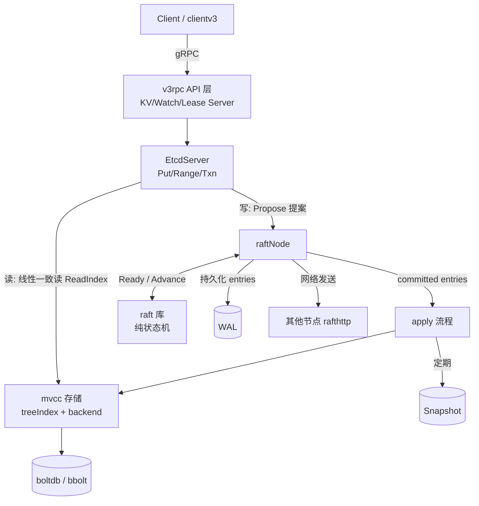
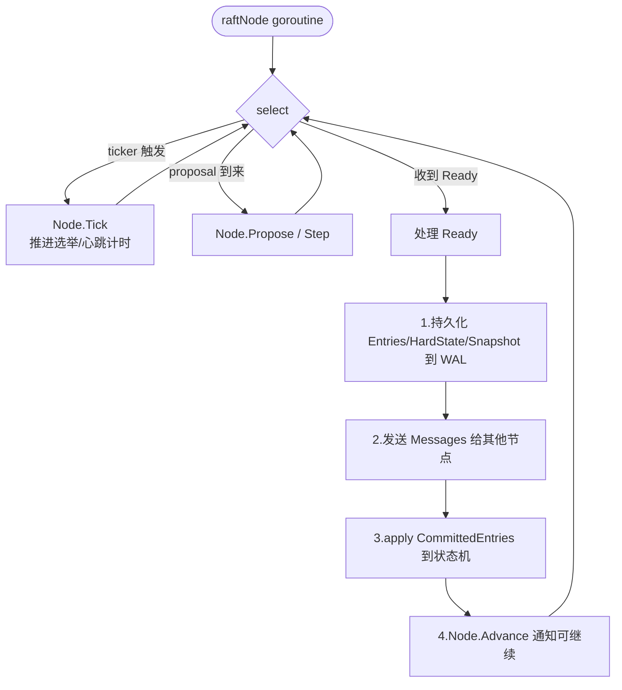
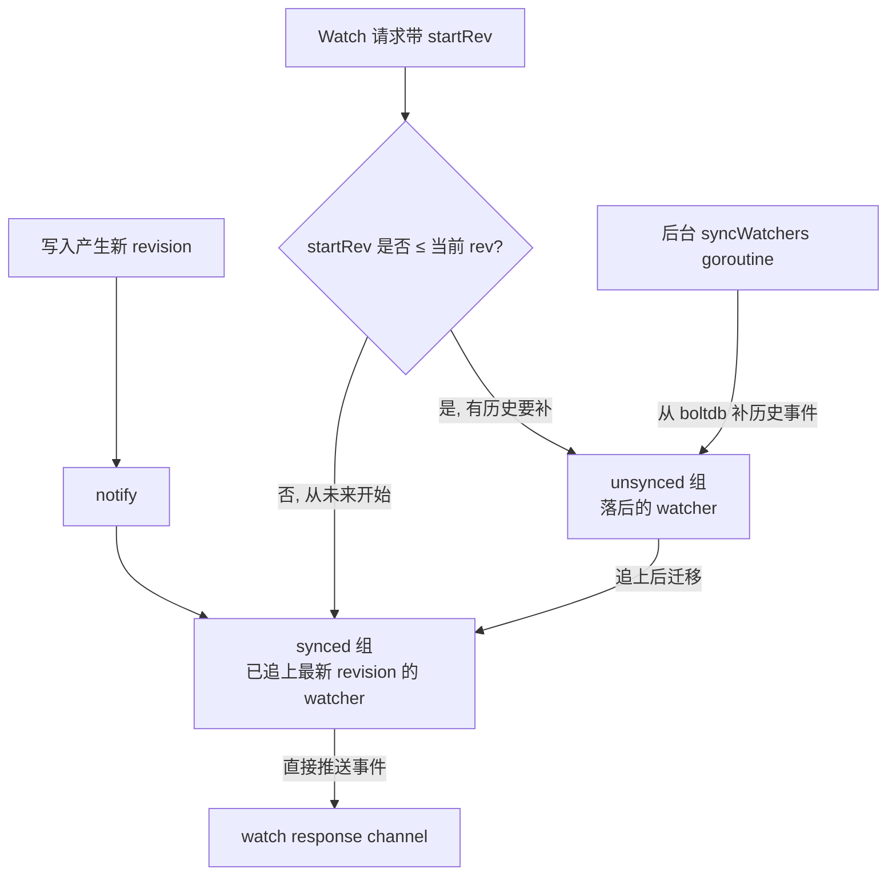

#etcd #raft #源码导读

相关笔记：[[etcd]] | [[kubernetes-basics]] | [[client-go-source]] | [[k8s-interview]] | [[k8s-development-roadmap]] | [[demo-raftexample-walkthrough]]

## 概述

本篇是对 etcd（`etcd-io/etcd`，以 v3.5 / v3.6 主干为参照）的源码导读，目标是从「能读懂」的角度梳理 etcd 的内部结构。etcd 在架构上是一个分层系统：最上层是 gRPC API（基于 protobuf 定义的 KV / Watch / Lease / Lock 等服务），中间是 `EtcdServer` 负责把客户端请求翻译成 Raft 提案（propose），底层是一个**独立、纯净、可单独使用的 Raft 共识库**（`go.etcd.io/raft`），再往下是持久化三件套：WAL（write-ahead log，先写日志）、Snapshot（快照，压缩日志体积）、boltdb（嵌入式 B+tree KV 引擎，作为 MVCC 后端）。理解 etcd 源码的关键有两点：一是 Raft 库被设计成一个**纯状态机**，它不碰网络、不碰磁盘，只通过 `Ready` 结构体把「需要做的副作用」吐给上层；二是 etcd 的存储层是**多版本（MVCC）**的，每次写入产生一个新的 revision，K8s 的 `resourceVersion` 正是直接映射到 etcd 的 revision 之上。

## 源码目录结构

etcd v3.4 之后仓库拆分为多个 Go module，主要目录：

| 路径 | 作用 |
| --- | --- |
| `raft/`（已独立为 `go.etcd.io/raft` 仓库） | 纯 Raft 共识算法库，无网络/无存储依赖 |
| `contrib/raftexample/` | 基于 raft 库的最小可运行示例，**学习 raft 的最佳入口** |
| `server/etcdserver/` | `EtcdServer` 主体，`server.go` 是核心；`raft.go` 是 raftNode 封装 |
| `server/etcdserver/api/v3rpc/` | gRPC API 层，把 protobuf 请求转给 EtcdServer |
| `server/storage/wal/` | WAL 实现，预写日志与崩溃恢复 |
| `server/storage/mvcc/` | MVCC 存储引擎、watchableStore、treeIndex |
| `server/storage/backend/` | boltdb 后端封装（`bbolt`） |
| `server/lease/` | Lease（租约/TTL）实现，`lessor` |
| `api/etcdserverpb/` | protobuf 生成的请求/响应定义 |
| `client/v3/` | 官方 Go 客户端 clientv3 |

## 整体架构



读写两条路径泾渭分明：

- **写路径**：必须走 Raft，先 propose、待多数派 commit 后才能 apply 到状态机。
- **读路径**：默认是线性一致读（linearizable），通过 ReadIndex 机制确认 leader 身份后直接读 mvcc，不需要走日志复制。

## Raft 模块：纯状态机设计

etcd 把 Raft 算法实现成一个**与网络、存储完全解耦**的库。它不创建 goroutine 发网络包，也不写磁盘，所有副作用都以数据的形式交给调用方。这种设计让 raft 库可测试、可复用（CockroachDB 等项目也用它）。

### raft.Node 接口

`raft/node.go` 中的 `Node` 是上层与 raft 交互的唯一接口。下面是从 K8s 代码库里 vendor 的真实源码（`vendor/go.etcd.io/raft/v3/node.go`，行号已核对）：

```go
// raft/v3/node.go:131-243
// Node represents a node in a raft cluster.
type Node interface {
    // Tick 推进逻辑时钟，选举超时 / 心跳超时都以 tick 为单位
    Tick()
    // Campaign 强制转 Candidate 发起选举
    Campaign(ctx context.Context) error
    // Propose 提交一条普通日志（写请求 data）
    Propose(ctx context.Context, data []byte) error
    // ProposeConfChange 提交配置变更（增删节点）
    ProposeConfChange(ctx context.Context, cc pb.ConfChangeI) error
    // Step 把收到的 raft 消息喂给状态机（来自其他节点 / 来自本地）
    Step(ctx context.Context, msg pb.Message) error
    // Ready 返回一个 channel，每次有副作用要处理时会有一条 Ready 流出
    // 上层处理完后必须调用 Advance（除非启用 AsyncStorageWrites）
    Ready() <-chan Ready
    // Advance 通知 raft：上一批 Ready 已处理完，可以推进
    Advance()
    // ApplyConfChange 把 CommittedEntries 中观察到的 ConfChange 应用到本地配置
    ApplyConfChange(cc pb.ConfChangeI) *pb.ConfState
    // ReadIndex 发起一次线性一致读的 index 确认，结果通过 Ready.ReadStates 返回
    ReadIndex(ctx context.Context, rctx []byte) error
    // Status / ReportUnreachable / ReportSnapshot / Stop ...
}
```

`Node` 故意做得很小——所有副作用（写盘、发网络、apply）都不在这里，全部通过 `Ready()` 这个 channel 流向上层。

### Ready 结构体

```go
// raft/v3/node.go:49-115（节选）
// Ready encapsulates the entries and messages that are ready to read,
// be saved to stable storage, committed or sent to other peers.
type Ready struct {
    // 软状态：当前 Leader、节点角色（不需持久化）
    *SoftState

    // 硬状态：Term / Vote / Commit，必须在发送 Messages 之前持久化
    pb.HardState

    // ReadIndex 的结果，appliedIndex 追上后即可服务线性一致读
    ReadStates []ReadState

    // 需要先写入 WAL 的新日志条目（持久化优先于发送 Messages）
    Entries []pb.Entry

    // 需要持久化的快照（leader 给 follower 装快照时也会出现在这里）
    Snapshot pb.Snapshot

    // 已被多数派提交、可以 apply 到状态机的日志
    CommittedEntries []pb.Entry

    // 要发给其他节点的消息（在非异步模式下，必须在 Entries 落盘之后发送）
    Messages []pb.Message

    // 是否要 fsync。心跳之类的非关键 Ready 可以走非持久化路径
    MustSync bool
}
```

字段注释里反复强调 **"BEFORE Messages are sent"**：raft 用注释把「先持久化、后通信」这条铁律写进了类型定义。

### node.run() 事件循环

raft 库内部跑一个 goroutine 不停在「时钟 / 收发消息 / 吐 Ready / 等 Advance」之间多路选择。这是整个库的心脏：

```go
// raft/v3/node.go:343-454（节选，去掉 confchange / lead 切换的分支）
func (n *node) run() {
    var propc chan msgWithResult
    var readyc chan Ready
    var advancec chan struct{}
    var rd Ready
    r := n.rn.raft

    for {
        // 上一批 Ready 已 Advance（advancec == nil）且现在有新数据要吐
        // 就预先填充 rd，并把 readyc 武装上
        if advancec == nil && n.rn.HasReady() {
            rd = n.rn.readyWithoutAccept()
            readyc = n.readyc
        }

        select {
        case pm := <-propc:                  // 本地 Propose 进来
            m := pm.m
            m.From = r.id
            r.Step(m)
        case m := <-n.recvc:                 // 收到其他节点发来的 raft 消息
            r.Step(m)
        case <-n.tickc:                      // 时钟 tick
            n.rn.Tick()
        case readyc <- rd:                   // 把 Ready 推给上层
            n.rn.acceptReady(rd)
            advancec = n.advancec            // 等上层处理完调 Advance
            readyc = nil
        case <-advancec:                     // 上层 Advance 完毕，进入下一轮
            n.rn.Advance(rd)
            rd = Ready{}
            advancec = nil
        case <-n.stop:
            close(n.done)
            return
        }
    }
}
```

**核心节奏**：`readyc <- rd` 成功推送后，把 `readyc` 设为 `nil` 关闭这个 case，并把 `advancec` 设为真正的 channel——也就是说 raft 库**必须等上层调用 `Advance()` 才会进入下一轮**。这就是「raft 把控制权完整交给上层」的具体实现。

### tick / Ready / Advance 主循环



`raft/raft.go` 内部维护 `StateType`（Follower / Candidate / Leader）状态机，`tick` 在 Follower/Candidate 上是选举计时器、在 Leader 上是心跳计时器。`raft/raftexample` 中的 `raftNode.serveChannels()` 是这个循环最干净的示范实现，**强烈建议从 raftexample 入手**——它只有几百行，麻雀虽小却完整演示了 propose、WAL、snapshot、网络 transport 的接线方式。

### Leader 选举与日志复制

- **选举**：Follower 在 election timeout 内没收到 Leader 心跳，自增 Term 转为 Candidate，向其他节点发 `MsgVote`；获得多数票即成为 Leader。`raft/raft.go` 的 `becomeLeader/becomeFollower/becomeCandidate` 实现状态切换。
- **日志复制**：Leader 通过 `MsgApp`（AppendEntries）把日志发给 Follower，每个 Follower 维护 `Progress`（`raft/tracker/progress.go`）记录其 `Match`/`Next` 索引。
- **committed index**：当某条日志被多数派 Follower 的 `Match` 覆盖，Leader 推进 `commitIndex`；这些日志进入下一次 `Ready` 的 `CommittedEntries`，由上层 apply。

### 手写简化复现：Ready loop pattern

把 etcd raft 库的「Ready 信封 + Advance 握手」模式抽象出来，最小可教学版本如下。它去掉了所有真实算法（选举、日志冲突、ConfChange），只保留**上层 ↔ raft 的接线方式**——你能从中看到：raft 库为什么是「纯状态机 + Ready 协议」，以及为什么上层必须先持久化、再发消息、再 apply。

```go
package miniraft

import (
    "context"
    "fmt"
    "time"
)

// Entry 是一条 raft 日志条目，对应 etcd raftpb.Entry
type Entry struct {
    Index uint64
    Term  uint64
    Data  []byte
}

// Message 是要发给其他节点的消息，对应 etcd raftpb.Message
type Message struct {
    To      uint64
    Type    string  // "MsgApp" / "MsgHeartbeat" / ...
    Entries []Entry
}

// Ready 封装一次推进产生的所有副作用——和 etcd Ready 字段顺序一一对应
type Ready struct {
    Entries          []Entry   // 必须先持久化到 WAL
    Messages         []Message // 持久化之后才能发
    CommittedEntries []Entry   // 已被多数派提交，可以 apply 到状态机
}

// Node 接口模仿 raft.Node，只暴露最小集
type Node interface {
    Tick()
    Propose(ctx context.Context, data []byte) error
    Ready() <-chan Ready
    Advance()
}

type node struct {
    propc    chan []byte
    tickc    chan struct{}
    readyc   chan Ready
    advancec chan struct{}
    stop     chan struct{}

    pending   []Entry // 还没持久化的日志
    committed []Entry // 已 commit、待上层 apply 的日志
    nextIdx   uint64
}

func New() Node {
    n := &node{
        propc: make(chan []byte, 16), tickc: make(chan struct{}, 1),
        readyc: make(chan Ready), advancec: make(chan struct{}),
        stop: make(chan struct{}), nextIdx: 1,
    }
    go n.run()
    return n
}

func (n *node) Tick()                                  { n.tickc <- struct{}{} }
func (n *node) Propose(_ context.Context, d []byte) error { n.propc <- d; return nil }
func (n *node) Ready() <-chan Ready                    { return n.readyc }
func (n *node) Advance()                               { n.advancec <- struct{}{} }

func (n *node) run() {
    var rd Ready
    var readyc chan Ready
    var advancec chan struct{}

    for {
        // 仅当上一批 Advance 完成、且有内容可吐时，才武装 readyc——这是 etcd 的同款节奏
        if advancec == nil && len(n.pending) > 0 {
            // 单机简化：日志一旦写入就视为多数派 commit
            rd = Ready{
                Entries:          n.pending,                       // 上层负责落 WAL
                Messages:         []Message{{To: 2, Type: "MsgApp", Entries: n.pending}},
                CommittedEntries: n.pending,                       // 上层负责 apply
            }
            n.pending = nil
            readyc = n.readyc
        }
        select {
        case data := <-n.propc:
            n.pending = append(n.pending, Entry{Index: n.nextIdx, Term: 1, Data: data})
            n.nextIdx++
        case <-n.tickc:
            // 真实库里这里会驱动选举 / 心跳；演示版只是占位
        case readyc <- rd:                  // 推 Ready；推送成功后关闭这个 case，等 Advance
            readyc = nil
            advancec = n.advancec
        case <-advancec:                    // 上层处理完一批，进入下一轮
            rd = Ready{}
            advancec = nil
        case <-n.stop:
            return
        }
    }
}

// ---- 上层使用方：演示「先持久化、再发消息、再 apply、最后 Advance」的强制顺序 ----
func DriverDemo(n Node) {
    go func() {
        for rd := range n.Ready() {
            // 1) 持久化：把 Entries 写 WAL 并 fsync
            for _, e := range rd.Entries {
                fmt.Printf("[WAL] append idx=%d data=%s\n", e.Index, e.Data)
            }
            // 2) 发送：在 Entries 落盘后才发出去
            for _, m := range rd.Messages {
                fmt.Printf("[NET] send to=%d type=%s entries=%d\n", m.To, m.Type, len(m.Entries))
            }
            // 3) apply：把 CommittedEntries 喂给状态机
            for _, e := range rd.CommittedEntries {
                fmt.Printf("[APPLY] idx=%d data=%s\n", e.Index, e.Data)
            }
            // 4) Advance：通知 raft 库可以推进
            n.Advance()
        }
    }()
    n.Propose(context.Background(), []byte("hello"))
    time.Sleep(50 * time.Millisecond)
}
```

把这段代码与上文 `raft/v3/node.go:343-454` 的 `node.run` 并列读，会发现**事件循环的骨架完全同构**：`if advancec == nil && hasReady { 武装 readyc }` → `readyc <- rd` 推送后置空 readyc 并武装 advancec → 等 `<-advancec` 才进入下一轮。真实 etcd 的复杂之处都在 `select` 的其它分支（confchange、leader 切换、本地 step），而这条「Ready → Advance 握手」的主轴是一致的。

## EtcdServer：连接 Raft 与存储

`server/etcdserver/server.go` 中的 `EtcdServer` 是核心。它内部组合了 `raftNode`（`server/etcdserver/raft.go`，对 raft 库的封装）和 `applierV3`（apply 执行器）。

### run 主循环

`EtcdServer.run()` 是服务端的「心脏」，它启动 `raftNode` 并消费其产出的 apply 任务。下面是真实代码（`vendor/go.etcd.io/etcd/server/v3/etcdserver/server.go`，行号已核对）：

```go
// server/etcdserver/server.go:767-867（节选）
func (s *EtcdServer) run() {
    lg := s.Logger()

    sn, err := s.r.raftStorage.Snapshot()
    if err != nil {
        lg.Panic("failed to get snapshot from Raft storage", zap.Error(err))
    }

    // 用 FIFO 调度器异步、有序地处理 apply 包
    sched := schedule.NewFIFOScheduler(lg)

    // 把回调注入 raftNode：leader 切换、提交 index 更新都通过这里通知 EtcdServer
    rh := &raftReadyHandler{
        getLead:              func() (lead uint64) { return s.getLead() },
        updateLead:           func(lead uint64) { s.setLead(lead) },
        updateLeadership:     func(newLeader bool) { /* leader 切换：暂停 / 恢复 compactor、lessor demote */ },
        updateCommittedIndex: func(ci uint64) { /* 维护已 committed 但未 apply 的 index */ },
    }
    s.r.start(rh)  // 启动 raftNode 的 Ready 循环（内部就是上面那个 tick/Ready/Advance）

    ep := etcdProgress{
        confState:           sn.Metadata.ConfState,
        diskSnapshotIndex:   sn.Metadata.Index,
        memorySnapshotIndex: sn.Metadata.Index,
        appliedt:            sn.Metadata.Term,
        appliedi:            sn.Metadata.Index,
    }

    var expiredLeaseC <-chan []*lease.Lease
    if s.lessor != nil {
        expiredLeaseC = s.lessor.ExpiredLeasesC()
    }

    for {
        select {
        case ap := <-s.r.apply():   // raftNode 投递一批待 apply（CommittedEntries + snapshot）
            f := schedule.NewJob("server_applyAll",
                func(context.Context) { s.applyAll(&ep, &ap) })
            sched.Schedule(f)
        case leases := <-expiredLeaseC:
            s.revokeExpiredLeases(leases)
        case err := <-s.errorc:
            lg.Warn("server error", zap.Error(err))
            return
        case <-s.stop:
            return
        }
    }
}
```

`raftNode.start()`（`server/etcdserver/raft.go`）内部跑前面那个 tick/Ready/Advance 循环：它处理 `Ready`、写 WAL、调用 transport 发消息，然后把 `CommittedEntries` + Snapshot 打包成 `apply` 结构通过 `s.r.apply()` channel 投给 `EtcdServer.run()`。这里看到的 `applyAll` 就是「把 raft 已提交的日志真正落到 mvcc」的入口。

### apply 已提交日志

`applyEntries → apply → applyEntryNormal` 这条链路把每条 raft 日志解码成具体请求并执行：

```go
func (s *EtcdServer) applyEntryNormal(e *raftpb.Entry, ...) {
    var raftReq pb.InternalRaftRequest
    pbutil.MustUnmarshal(&raftReq, e.Data)
    // 根据请求类型分发：Put / DeleteRange / Txn / LeaseGrant ...
    ar := s.uberApply.Apply(&raftReq, ...)
    // apply 完成后用 e.Index 通知等待该 index 的客户端 goroutine
}
```

关键点：客户端的写请求 goroutine 在 `Propose` 之后会阻塞等待，apply 完成后通过 `wait` 机制（`pkg/wait`，以日志 index 为 key）被唤醒并拿到结果。这就是「写请求要等到 apply 完成才返回」的实现方式。

## 存储与 MVCC

etcd v3 的存储是**多版本并发控制（MVCC）**的，这与 v2 的纯内存树有本质区别。代码在 `server/storage/mvcc/`。

### revision：main 与 sub

每次事务写入分配一个全局递增的 `revision`，它由两部分组成：

```go
type revision struct {
    main int64 // 事务级递增，每个写事务 +1
    sub  int64 // 同一事务内多个 key 的子序号，从 0 递增
}
```

boltdb 中的 key 不是用户的原始 key，而是 `revision` 编码后的字节串，value 是序列化的 `mvccpb.KeyValue`。这意味着**同一个用户 key 的多次修改在 boltdb 里是多条不同 revision 的记录**，etcd 因此天然保留历史版本，支持「读某个历史 revision 的值」和 watch 历史事件。

下面是真实的 Put 实现（`vendor/go.etcd.io/etcd/server/v3/storage/mvcc/kvstore_txn.go`，行号已核对）：

```go
// server/storage/mvcc/kvstore_txn.go:196-235（节选）
func (tw *storeTxnWrite) put(key, value []byte, leaseID lease.LeaseID) {
    rev := tw.beginRev + 1               // 本事务的主版本号 = 上一次提交后的 currentRev + 1
    c := rev                              // CreateRevision 默认就是当前 rev
    oldLease := lease.NoLease

    // 如果 key 之前存在，沿用它的 CreateRevision、读出旧的 lease 绑定
    _, created, ver, err := tw.s.kvindex.Get(key, rev)
    if err == nil {
        c = created.Main
        oldLease = tw.s.le.GetLease(lease.LeaseItem{Key: string(key)})
    }

    // 关键：构造 boltdb 的物理 key —— 它不是用户 key，而是 (main, sub) revision 的编码
    ibytes := NewRevBytes()
    idxRev := Revision{Main: rev, Sub: int64(len(tw.changes))}  // sub 按本事务内 put 次序递增
    ibytes = RevToBytes(idxRev, ibytes)

    ver = ver + 1
    kv := mvccpb.KeyValue{
        Key:            key,
        Value:          value,
        CreateRevision: c,
        ModRevision:    rev,
        Version:        ver,
        Lease:          int64(leaseID),
    }
    d, _ := kv.Marshal()

    // 1) 写入 boltdb：物理 key 是 revision 字节串，value 是序列化后的 KeyValue
    tw.tx.UnsafeSeqPut(schema.Key, ibytes, d)
    // 2) 更新内存 treeIndex：把用户 key 关联到这个新的 revision
    tw.s.kvindex.Put(key, idxRev)
    // 3) 记录到 changes（事务 End 时用来通知 watcher）
    tw.changes = append(tw.changes, kv)
    // 4) lease 的 attach/detach（省略）...
}
```

事务 `End()`（同文件 182-194 行）才真正递增 `currentRev`——`rev` 的可见性以事务边界为单位，事务内多个 put 共享一个 main、用 sub 区分。

### treeIndex：内存中的 key → revisions 索引

光有 boltdb 还不够——给定用户 key 怎么找到它对应的 revision？`server/storage/mvcc/index.go` 维护一个内存中的 B 树 `treeIndex`，每个节点 `keyIndex` 记录某个 key 的所有 revision 历史（generations）：

```mermaid
flowchart LR
    subgraph 内存 treeIndex（B-tree）
        K1["keyIndex: /foo<br/>generations: rev3, rev7, rev12"]
        K2["keyIndex: /bar<br/>generations: rev5"]
    end
    subgraph boltdb（B+tree, 磁盘）
        R3["key=rev3 → {/foo, v1}"]
        R7["key=rev7 → {/foo, v2}"]
        R12["key=rev12 → {/foo, v3}"]
        R5["key=rev5 → {/bar, vX}"]
    end
    K1 -.查 rev.-> R3
    K1 -.查 rev.-> R7
    K1 -.查 rev.-> R12
    K2 -.-> R5
```

一次 `Range` 查询 `/foo`：先在 `treeIndex` 里按 key 找到目标 revision，再用该 revision 去 boltdb 里取真正的 value。`treeIndex` 在节点启动时通过遍历 boltdb 全量重建。

### backend 与 boltdb

`server/storage/backend/` 封装了 `bbolt`（boltdb 的 etcd 维护分支）。所有 KV 都存在名为 `key` 的 bucket 里。backend 提供 `BatchTx`（批量写事务，定期 commit 以提升吞吐）和 `ReadTx`（读事务），并有一个 buffer 缓存最近写入，使读不必每次都打到磁盘。

### compaction（压缩）

由于每次写都留历史，boltdb 会无限膨胀，必须 compaction。`mvcc` 的 `Compact(rev)` 会删除 `rev` 之前的旧版本（保留每个 key 在该点的最新值），`treeIndex` 同步裁剪 `keyIndex` 的旧 generation。compaction 之后，watch 一个早于 compactRev 的 revision 会收到 `ErrCompacted`。K8s 的 apiserver 默认每 5 分钟触发一次 etcd compaction。

## WAL：预写日志与崩溃恢复

`server/storage/wal/` 实现 write-ahead log。在 `Ready` 中拿到的 `Entries`/`HardState`/`Snapshot` 必须先**顺序追加写入 WAL 文件并 fsync**，然后才允许发送消息、apply 日志。

WAL 文件由一连串 record 组成，record 类型包括：`entryType`（raft 日志条目）、`stateType`（HardState）、`snapshotType`（快照元信息指针）、`crcType`（校验）。WAL 文件按固定大小（默认 64MB）滚动切分。

**崩溃恢复**流程（节点重启时）：

1. 读取最新的 Snapshot 文件，恢复出一个基准状态与对应的 `(index, term)`。
2. 从 WAL 中**回放 snapshot 之后的所有 entries**，把 HardState 与日志重新喂给 raft 库。
3. raft 库据此恢复内存状态，节点重新加入集群。

因为「先写 WAL 再 apply」，即使在 apply 中途宕机，重启后回放 WAL 也能把状态机恢复到一致点——这就是 WAL 的意义。Snapshot 的作用是**截断 WAL**：日志无限增长不可接受，定期对状态机打快照后，快照点之前的 WAL 就可以丢弃。

## Watch 机制

`server/storage/mvcc/watchable_store.go` 中的 `watchableStore` 在普通 `store` 之上包了 watch 能力。它内部维护两组 watcher：



- **synced**：数据已同步到最新 revision 的 watcher，新写入直接通过 `notify` 推送。
- **unsynced**：watcher 起始 revision 落后于当前，需要从 boltdb 把历史区间的事件读出来补发。后台 `syncWatchers()` goroutine 持续处理 unsynced，补完后迁移到 synced。

watcher 按 key 单点（map）和 range 区间（`adt` 包的 IntervalTree）两种方式索引。**watch on a revision** 是 etcd v3 相对 v2 的关键升级：因为 MVCC 保留了历史，只要 `startRev` 没被 compaction 掉，watch 就能从任意历史点开始回放事件，不再有 v2「1000 条历史事件窗口」的限制。

下面是 `notify` 的真实实现（`vendor/go.etcd.io/etcd/server/v3/storage/mvcc/watchable_store.go`，行号已核对）：

```go
// server/storage/mvcc/watchable_store.go:493-517
func (s *watchableStore) notify(rev int64, evs []mvccpb.Event) {
    victim := make(watcherBatch)
    // newWatcherBatch 在 synced 组里按 key 索引找到「关心 evs 中事件」的 watcher
    for w, eb := range newWatcherBatch(&s.synced, evs) {
        if eb.revs != 1 {
            s.store.lg.Panic("unexpected multiple revisions in watch notification", ...)
        }
        // 尝试非阻塞发送到 watcher 的 channel
        if w.send(WatchResponse{WatchID: w.id, Events: eb.evs, Revision: rev}) {
            pendingEventsGauge.Add(float64(len(eb.evs)))
        } else {
            // 慢 watcher：channel 满了，挪到 victim，下次由 syncWatchers 重试
            w.victim = true
            victim[w] = eb
            s.synced.delete(w)
            slowWatcherGauge.Inc()
        }
        w.minRev = rev + 1                 // 推进 watcher 已消费的最小 rev
    }
    s.addVictim(victim)
}
```

而落后的 watcher 由 `syncWatchers` 后台补：

```go
// server/storage/mvcc/watchable_store.go:347-391（节选）
func (s *watchableStore) syncWatchers(evs []mvccpb.Event) (int, []mvccpb.Event) {
    s.mu.Lock(); defer s.mu.Unlock()
    if s.unsynced.size() == 0 { return 0, nil }

    curRev := s.store.currentRev
    compactionRev := s.store.compactMainRev

    // 从 unsynced 里挑一批 watcher，算出它们整体需要的最小 rev
    wg, minRev := s.unsynced.choose(maxWatchersPerSync, curRev, compactionRev)
    // 从 boltdb 把 [minRev, curRev+1) 区间内的事件全捞出来
    evs = rangeEventsWithReuse(s.store.lg, s.store.b, evs, minRev, curRev+1)

    wb := newWatcherBatch(wg, evs)
    for w := range wg.watchers {
        if w.minRev < compactionRev { continue }       // 已被 compact，跳过留给下轮
        w.minRev = max(curRev+1, w.minRev)
        eb, ok := wb[w]
        if !ok {
            // 这批事件里没有它关心的，认定它已经追上 currentRev
            s.synced.add(w); s.unsynced.delete(w)
            continue
        }
        // 推送历史事件；推送成功就把 watcher 迁到 synced（省略尾段）
        w.send(WatchResponse{WatchID: w.id, Events: eb.evs, Revision: curRev})
    }
    // ...
}
```

两段一起看就理解了 etcd 的 watch 模型：**新写入走 `notify` 推 synced 组；落后的、被 compact 兜底、慢消费者全部走 `syncWatchers` 由后台 100ms 周期重试**。这是「不阻塞写路径、但又保证最终所有 watcher 拿到事件」的经典做法。

## Lease：租约与 TTL

`server/lease/lessor.go` 实现租约。一个 `Lease` 有唯一 ID 和 TTL，多个 key 可以挂在同一个 lease 上；lease 过期时，挂在它上面的所有 key 被一次性删除。

- `lessor` 用一个最小堆（`LeaseExpiredNotifier`）按到期时间组织 lease，后台周期检查。
- lease 的续约（`KeepAlive`）和过期删除本身也要走 Raft——过期删除由 Leader 发起 `LeaseRevoke` 提案，保证所有节点状态一致。

K8s 对 lease 的两个典型用法：① **Event 对象的 TTL**，事件挂 lease 实现自动过期清理；② **Lease 资源做选主**（`coordination.k8s.io/Lease`，kube-controller-manager / kube-scheduler 的 leader election 即基于此）。

## 线性一致读：ReadIndex

如果直接读 Leader 的本地状态，可能读到「旧 Leader」的过期数据（脑裂时旧 Leader 还不知道自己已被取代）。etcd 默认提供**线性一致读**，实现机制是 ReadIndex：

1. 收到读请求时，Leader 记录当前的 `commitIndex` 为 `readIndex`。
2. Leader 向多数派发一轮心跳（`MsgHeartbeat`），确认自己**此刻仍是合法 Leader**。
3. 收到多数派心跳响应后，Leader 等待自己的 `appliedIndex` 追上 `readIndex`。
4. 此时再读 mvcc，保证读到的是「不早于请求发起时刻」的已提交数据。

代码在 `EtcdServer.linearizableReadLoop()`，它调用 raft 库的 `Node.ReadIndex()`，结果通过 `Ready.ReadStates` 返回。相比「读也走一条 raft 日志」，ReadIndex 省掉了日志持久化开销，更轻量。设置 `WithSerializable()` 则退化为本地读（可能读到 stale 数据，但延迟最低）。

## Kubernetes 如何使用 etcd

> 这部分简述，详见 [[etcd]]。

- apiserver 的存储层（`k8s.io/apiserver/pkg/storage/etcd3`）把每种资源对象以 `/registry/<resource>/<namespace>/<name>` 为 key 存进 etcd，value 是序列化后的对象。
- **`resourceVersion` 直接映射到 etcd 的 revision**。客户端 List 拿到的 `resourceVersion` 就是当时的 etcd revision，Watch 时带上它即可从该 revision 续传，这正是 Informer 增量同步的底层依据（见 [[informer]]）。
- apiserver 内部有一层 **watch cache**：所有客户端的 watch 不直接打到 etcd，而是 apiserver 自己对 etcd 维持一个 watch，把事件缓存后分发给众多客户端，极大降低 etcd 的 watch 连接压力。
- compaction 由 apiserver 周期触发，避免 etcd 历史版本无限膨胀。

### K8s apiserver 怎么用 etcd 的 Watch

`staging/src/k8s.io/apiserver/pkg/storage/etcd3/watcher.go` 中的 `watcher.Watch` 是 apiserver 与 etcd 之间「Watch 接线」的唯一入口。`*store.Watch` 经过一层包装后最终调用到这里，开一个 goroutine 跑 `watchChan.run`，里面再开 `startWatching`——这才是真正把 clientv3 的 Watch channel 接到 apiserver 内部事件流的地方（行号已核对，对应 K8s master 2026-03 的代码）：

```go
// staging/src/k8s.io/apiserver/pkg/storage/etcd3/watcher.go:106-127
func (w *watcher) Watch(ctx context.Context, key string, rev int64, opts storage.ListOptions) (watch.Interface, error) {
    if opts.Recursive && !strings.HasSuffix(key, "/") {
        return nil, fmt.Errorf(`recursive key needs to end with "/"`)
    }
    startWatchRV, err := w.getStartWatchResourceVersion(ctx, rev, opts)
    if err != nil { return nil, err }
    wc := w.createWatchChan(ctx, key, startWatchRV, opts.Recursive, opts.ProgressNotify, opts.Predicate)
    go wc.run(isInitialEventsEndBookmarkRequired(opts), areInitialEventsRequired(rev, opts))
    utilflowcontrol.WatchInitialized(ctx)
    return wc, nil
}
```

真正消费 etcd 事件的逻辑在 `startWatching`：

```go
// staging/src/k8s.io/apiserver/pkg/storage/etcd3/watcher.go:355-438（节选）
func (wc *watchChan) startWatching(watchClosedCh chan struct{},
    initialEventsEndBookmarkRequired, forceInitialEvents bool) {

    // 1) 起始 rev 不能超过 etcd 当前最大 rev——避免「未来读」
    if wc.initialRev > 0 && forceInitialEvents {
        currentStorageRV, err := wc.watcher.getCurrentStorageRV(wc.ctx)
        if err != nil { wc.sendError(err); return }
        if uint64(wc.initialRev) > currentStorageRV {
            wc.sendError(storage.NewTooLargeResourceVersionError(...))
            return
        }
    }

    // 2) 用 clientv3 起一个真正的 etcd Watch。WithRev 是关键：从 initialRev+1 续传，
    //    这正是 K8s resourceVersion 能「断线续传」的底层依据
    opts := []clientv3.OpOption{
        clientv3.WithRev(wc.initialRev + 1),
        clientv3.WithPrevKV(),                       // 想要 OldValue 来计算 Update 的 diff
    }
    if wc.recursive       { opts = append(opts, clientv3.WithPrefix()) }
    if wc.progressNotify  { opts = append(opts, clientv3.WithProgressNotify()) }

    wch := wc.watcher.client.Watch(wc.ctx, wc.key, opts...)

    // 3) 主循环：每条 etcd WatchResponse 拆成多个 *event 塞进 incomingEventChan，
    //    下游 processEvents 再把它解码成 watch.Event 推给上层（apiserver 的 watch cache / 直连客户端）
    for wres := range wch {
        if wres.Err() != nil {                       // 例如 ErrCompacted：起始 rev 已被 compact
            logWatchChannelErr(wres.Err())
            wc.sendError(wres.Err())
            return
        }
        if wres.IsProgressNotify() {                 // bookmark：纯 rev 推进，无事件
            wc.queueEvent(progressNotifyEvent(wres.Header.GetRevision()))
            continue
        }
        for _, e := range wres.Events {
            parsedEvent, err := parseEvent(e)        // 把 clientv3 Event 转成 K8s 内部 *event
            if err != nil { wc.sendError(err); return }
            wc.queueEvent(parsedEvent)               // 入 incomingEventChan，processEvents 异步消费
        }
    }
    close(watchClosedCh)
}
```

这段代码就是「K8s ↔ etcd 接线」最直接的证据：

- `clientv3.WithRev(wc.initialRev + 1)` 把 K8s 的 `resourceVersion` 翻译成 etcd 的 `revision`——所以前面说的「resourceVersion 就是 etcd revision」不是抽象比喻，是一行 `WithRev` 代码。
- `ErrCompacted` 直接冒泡：apiserver 客户端看到的 `Gone (410)`、Informer 看到的 "too old resource version" 都源自这里 etcd 抛出的 compaction 错误。
- `parseEvent` 把 etcd 的 `mvccpb.KeyValue`（前面 `kvstore_txn.go` 写入的那一份）反序列化成 `runtime.Object`——存储层多版本数据的「往返路径」在这里闭合。

## 面试要点

| 问题 | 回答要点 |
| --- | --- |
| **etcd 的整体分层架构？** | gRPC API（v3rpc）→ EtcdServer → raft 共识库 → WAL + Snapshot + boltdb(MVCC)。写走 raft，读走 ReadIndex。 |
| **为什么说 etcd 的 raft 库是「纯状态机」？** | raft 库不碰网络也不碰磁盘，只通过 `Ready` 结构把待持久化日志、待发消息、待 apply 日志交给上层；上层处理完调 `Advance`。这样 raft 可单测、可复用。 |
| **处理 Ready 的顺序为什么不能乱？** | 必须先持久化 Entries/HardState 到 WAL，再发 Messages，再 apply CommittedEntries。先落盘后发送，保证「承诺过的日志一定不丢」。 |
| **etcd v3 的 MVCC 是怎么实现的？** | 每次写分配全局递增 revision（main/sub），boltdb 以 revision 为 key 存多版本数据；内存 treeIndex（B 树）维护用户 key → revisions 的映射。查询先查 treeIndex 定位 revision，再读 boltdb。 |
| **WAL 和 Snapshot 各解决什么问题？** | WAL 保证崩溃后可回放恢复一致状态（先写日志后 apply）；Snapshot 对状态机打快照，从而截断 WAL，防止日志无限增长。重启时 = 加载 snapshot + 回放其后的 WAL。 |
| **watch 的 synced / unsynced 是什么？** | synced 是已追上最新 revision 的 watcher，新写入直接推送；unsynced 是起始 revision 落后的 watcher，由后台 goroutine 从 boltdb 补历史事件，追上后迁移到 synced。 |
| **etcd 怎么保证线性一致读？** | ReadIndex：Leader 记录当前 commitIndex，发一轮心跳确认自己仍是合法 Leader，等 appliedIndex 追上后再读 mvcc。比「读也走日志」更轻量。 |
| **compaction 的作用？不做会怎样？** | 删除指定 revision 之前的历史版本，回收 boltdb 空间。不做则 boltdb 无限膨胀；compaction 后 watch 早于 compactRev 的 revision 会报 ErrCompacted。 |
| **K8s 的 resourceVersion 和 etcd 是什么关系？** | resourceVersion 直接就是 etcd 的 revision。List 返回当时 revision，Watch 带上它即可增量续传，是 Informer 的底层基础。 |
| **想读 etcd 源码从哪入手？** | 先读 `contrib/raftexample`（几百行，完整演示 raft 库接线），再读 `server/etcdserver/server.go` 的 run 循环和 `raft.go`，最后看 `server/storage/mvcc`。 |
