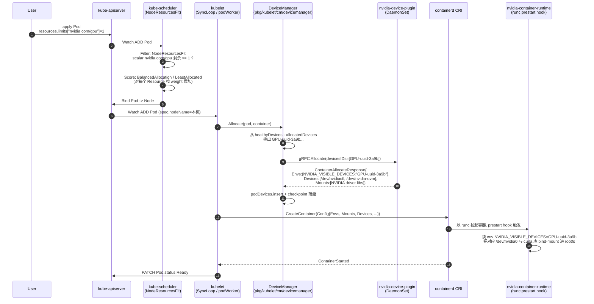

#kubernetes #gpu #scheduler #device-plugin #ai-infra #源码导读

相关笔记：[[gpu-scheduling]] | [[scheduler-framework-source]] | [[kubelet-cri-source]] | [[k8s-development-roadmap]] | [[demo-fake-gpu]] | [[hami-source]] | [[hami-learning-path]] | [[k8s-interview]]

## 概述

本篇是 GPU 调度的端到端源码导读，串联 [[scheduler-framework-source]] 的扩展点流水线和 [[kubelet-cri-source]] 的 Device Plugin 框架，专门聚焦「一个请求 `nvidia.com/gpu: 1` 的 Pod 从 apply 到容器内 `nvidia-smi` 看到设备」这条完整链路。概念层细节（Time-Slicing / MIG / vGPU、GPU Operator、训练任务示例）见 [[gpu-scheduling]]，本篇不再重复；Device Plugin 注册握手通用流程见 [[kubelet-cri-source]]，本篇只补充 GPU 特有的部分。

K8s 当前把 GPU 建模为 **Extended Resource**：一个由厂商命名的标量资源（如 `nvidia.com/gpu`），通过 Device Plugin 上报数量进入 Node `status.capacity`/`allocatable`。调度链路因此被切成三段：

1. **Scheduler**：在 NodeResourcesFit 插件里只比对「请求数量 vs Node allocatable」，**不感知具体哪块 GPU、不感知 NVLink 拓扑**。
2. **kubelet DeviceManager**：Pod 落到本节点后，从 `healthyDevices - allocatedDevices` 算出空闲池，挑 N 个具体设备 ID，调插件 `Allocate`。
3. **Device Plugin（NVIDIA k8s-device-plugin）**：返回 `Envs: {NVIDIA_VISIBLE_DEVICES=<uuid>}`、可选 `Mounts`、可选 `Devices`。kubelet 把它们合并进 CRI `CreateContainer`，由 `nvidia-container-runtime` (runc 的 prestart hook) 看 env 动态把 `/dev/nvidiaX` 与 driver 库注入容器。

这个三段式有两个明显短板：(a) **无拓扑感知**——8 卡机里给一个 4 卡 Pod 可能挑到跨 NVLink 域的卡；(b) **无共享语义**——一块 GPU 默认整卡分配，Time-Slicing/MPS 只能靠 plugin 端「把 1 张卡伪装成 N 张」来绕，调度器仍以为分了 N 张物理卡。**DRA（Dynamic Resource Allocation，KEP-3063 / KEP-4381）** 把设备从「scalar resource 数字」升级为「带 attributes/capacity 的对象 + CEL 选择器」，目标就是从根上修这两条。本文末尾给出 DRA 的源码切入点。

文中所有源码片段基于 `kubernetes/kubernetes` master 分支（2026-03 快照，Go 1.26），行号为当前真实行号。

## 整体调度链路



注意三个分工点：
- **2-3** 之间 Scheduler 决策只看 scalar 数字。
- **6-8** 之间 DeviceManager 决定具体 UUID，Device Plugin 不参与「选哪块」，只参与「怎么注入」。
- **10-11** 之间真正把 `/dev/nvidiaX` mount 进容器的是 `nvidia-container-runtime` 的 prestart hook，不是 kubelet——这也是为什么 Device Plugin 返回 envs 比直接返回 Mounts 更主流（见后文）。

## Scheduler 侧：Extended Resource 调度

Scheduler 对 GPU 的全部认知都在 NodeResourcesFit 插件里。Filter 阶段：

```go
// 文件: pkg/scheduler/framework/plugins/noderesources/fit.go:612-645
func (f *Fit) Filter(ctx context.Context, cycleState fwk.CycleState, pod *v1.Pod, nodeInfo fwk.NodeInfo) *fwk.Status {
    s, err := getPreFilterState(cycleState)
    if err != nil {
        return fwk.AsStatus(err)
    }

    var draManager fwk.SharedDRAManager
    if f.enableDRAExtendedResource {
        draManager = f.handle.SharedDRAManager()
    }

    opts := ResourceRequestsOptions{
        EnablePodLevelResources:   f.enablePodLevelResources,
        EnableDRAExtendedResource: f.enableDRAExtendedResource,
    }

    insufficientResources := fitsRequest(s, nodeInfo, f.ignoredResources, f.ignoredResourceGroups, draManager, opts)

    if len(insufficientResources) != 0 {
        failureReasons := make([]string, 0, len(insufficientResources))
        statusCode := fwk.Unschedulable
        for i := range insufficientResources {
            failureReasons = append(failureReasons, insufficientResources[i].Reason)
            if insufficientResources[i].Unresolvable {
                statusCode = fwk.UnschedulableAndUnresolvable
            }
        }
        return fwk.NewStatus(statusCode, failureReasons...)
    }
    return nil
}
```

真正比对 GPU 数量的逻辑在 `fitsRequest`，分支落在 `ScalarResources` 这段：

```go
// 文件: pkg/scheduler/framework/plugins/noderesources/fit.go:728-759
for rName, rQuant := range podRequest.ScalarResources {
    if rQuant == 0 {
        continue
    }

    if v1helper.IsExtendedResourceName(rName) {
        // 命中 ignored list (如 cluster autoscaler 临时忽略某些 ER) 就跳过
        var rNamePrefix string
        if ignoredResourceGroups.Len() > 0 {
            rNamePrefix = strings.Split(string(rName), "/")[0]
        }
        if ignoredExtendedResources.Has(string(rName)) || ignoredResourceGroups.Has(rNamePrefix) {
            continue
        }
    }

    if shouldDelegateResourceToDRA(rName, nodeInfo, draManager, opts) {
        // 新: 该 ER 已被 DRA DeviceClass 接管, NodeResourcesFit 不再处理
        continue
    }
    if rQuant > (nodeInfo.GetAllocatable().GetScalarResources()[rName] - nodeInfo.GetRequested().GetScalarResources()[rName]) {
        insufficientResources = append(insufficientResources, InsufficientResource{
            ResourceName: rName,
            Reason:       fmt.Sprintf("Insufficient %v", rName),
            Requested:    podRequest.ScalarResources[rName],
            Used:         nodeInfo.GetRequested().GetScalarResources()[rName],
            Capacity:     nodeInfo.GetAllocatable().GetScalarResources()[rName],
            Unresolvable: rQuant > nodeInfo.GetAllocatable().GetScalarResources()[rName],
        })
    }
}
```

注意 `nvidia.com/gpu` 在这里被当作一个普通 `ResourceName` 处理：插件不知道它是 GPU，只看 `allocatable - requested >= rQuant`。`Unresolvable` 用于 `PostFilter` 抢占——如果连整机 `Capacity` 都不够，抢占其它 Pod 也没用，标记为不可解。

Score 阶段同样是「按数字加权」。`BalancedAllocation` 插件用的是「各资源使用率方差越小越好」的思路：

```go
// 文件: pkg/scheduler/framework/plugins/noderesources/balanced_allocation.go:204-218
func balancedResourceScorer(requested, allocated, allocatable []int64) int64 {
    // 把每个资源的 requested/allocatable 算成 fraction, 求方差; 方差越小越均衡
    scoreWithPod := balancedResourceScore(requested, allocatable)
    scoreWithoutPod := balancedResourceScore(allocated, allocatable)
    // 输出"加入 Pod 后均衡度的改进"映射到 [MaxNodeScore/2, MaxNodeScore]
    return fwk.MaxNodeScore/2 + (fwk.MaxNodeScore/2+scoreWithPod-scoreWithoutPod)/2
}
```

`LeastAllocated` 是另一种思路——空闲多的节点得高分：

```go
// 文件: pkg/scheduler/framework/plugins/noderesources/least_allocated.go:30-46
func leastResourceScorer(resources []config.ResourceSpec) func([]int64, []int64, []int64) int64 {
    return func(requested, _, allocable []int64) int64 {
        var nodeScore, weightSum int64
        for i := range requested {
            if allocable[i] == 0 {
                continue
            }
            weight := resources[i].Weight                  // ← 由 KubeSchedulerConfiguration 指定每种资源的权重
            resourceScore := leastRequestedScore(requested[i], allocable[i])
            nodeScore += resourceScore * weight
            weightSum += weight
        }
        if weightSum == 0 {
            return 0
        }
        return nodeScore / weightSum
    }
}
```

把 GPU 加进 Scheduler 打分的标准做法：在 `KubeSchedulerConfiguration.profiles[].pluginConfig` 里给 `NodeResourcesFit` 配 `resources: [{name: nvidia.com/gpu, weight: 5}]`，让 GPU 资源的均衡度/利用率参与打分，避免空闲 GPU 节点被 CPU/Memory 类任务先占满。

**关键认知**：Scheduler 完全不知道 NVLink、PCIe Switch、MIG profile 这些概念，所有「拓扑感知」要么在 kubelet 侧的 Topology Manager 做（NUMA 粒度），要么靠 Volcano / Koordinator 等替代 scheduler 加扩展点，要么靠 DRA 重写资源模型——这是 DRA 的核心动机之一。

## kubelet 侧：DeviceManager 分配具体设备

Scheduler 把 Pod 绑到 Node 后，kubelet `SyncLoop` 通过 `syncPod -> containerManager.Allocate -> DeviceManager.Allocate` 进入 `ManagerImpl.Allocate`。这一段在 [[kubelet-cri-source]] 的 Device Plugin 章节已经走过一遍，本节聚焦 GPU 场景下三个特别要紧的细节：(1) 入口分发；(2) 空闲池选择；(3) checkpoint 持久化。

### Allocate 入口分发

```go
// 文件: pkg/kubelet/cm/devicemanager/manager.go:366-404
func (m *ManagerImpl) Allocate(pod *v1.Pod, container *v1.Container) error {
    ctx := context.TODO()
    if _, ok := m.devicesToReuse[string(pod.UID)]; !ok {
        m.devicesToReuse[string(pod.UID)] = make(map[string]sets.Set[string])
    }
    // 跨 Pod 清理: 上一个 Pod 还残留在 devicesToReuse 里会导致状态污染
    for podUID := range m.devicesToReuse {
        if podUID != string(pod.UID) {
            delete(m.devicesToReuse, podUID)
        }
    }
    // init container 先分配, 普通 init 用完释放给业务 container 复用; sidecar 类型 (restartable init) 持续占用
    for _, initContainer := range pod.Spec.InitContainers {
        if container.Name == initContainer.Name {
            if err := m.allocateContainerResources(ctx, pod, container, m.devicesToReuse[string(pod.UID)]); err != nil {
                return err
            }
            if !podutil.IsRestartableInitContainer(&initContainer) {
                m.podDevices.addContainerAllocatedResources(string(pod.UID), container.Name, m.devicesToReuse[string(pod.UID)])
            } else {
                m.podDevices.removeContainerAllocatedResources(string(pod.UID), container.Name, m.devicesToReuse[string(pod.UID)])
            }
            return nil
        }
    }
    // 业务容器分配
    if err := m.allocateContainerResources(ctx, pod, container, m.devicesToReuse[string(pod.UID)]); err != nil {
        return err
    }
    m.podDevices.removeContainerAllocatedResources(string(pod.UID), container.Name, m.devicesToReuse[string(pod.UID)])
    return nil
}
```

GPU 场景下 init container 复用很常见：一个 init container 用 GPU 解压模型权重、业务 container 用 GPU 推理，复用同一张卡可以避免 8 卡机里少占一张。

### devicesToAllocate：从空闲池选具体设备

`allocateContainerResources` 内部对每个 ER 调一次 `devicesToAllocate` 算出本次该选的具体 ID 集合：

```go
// 文件: pkg/kubelet/cm/devicemanager/manager.go:582-670 (节选关键片段)
func (m *ManagerImpl) devicesToAllocate(ctx context.Context, podUID, contName, resource string, required int, reusableDevices sets.Set[string]) (sets.Set[string], error) {
    logger := klog.FromContext(ctx)
    m.mutex.Lock()
    defer m.mutex.Unlock()
    needed := required
    // 1) 容器重启场景: podDevices 里已有上次分配的设备, 复用即可
    devices := m.podDevices.containerDevices(podUID, contName, resource)
    if devices != nil {
        needed = needed - devices.Len()
        if needed != 0 {
            // Pod 资源量在 admit 后理论不变, 不变就说明出 bug 了, 直接报错
            return nil, fmt.Errorf("pod %q container %q changed request for resource %q from %d to %d", podUID, contName, resource, devices.Len(), required)
        }
    }
    // 2) kubelet 重启场景: 容器还在运行就什么都不做 (设备已经在用了)
    if !m.sourcesReady.AllReady() && m.isContainerAlreadyRunning(logger, podUID, contName) {
        return nil, nil
    }
    // 3) 校验资源已注册且至少有一个健康设备
    healthyDevices, hasRegistered := m.healthyDevices[resource]
    if !hasRegistered {
        return nil, fmt.Errorf("cannot allocate unregistered device %s", resource)
    }
    if healthyDevices.Len() == 0 {
        return nil, fmt.Errorf("no healthy devices present; cannot allocate unhealthy devices %s", resource)
    }
    if !healthyDevices.IsSuperset(devices) {
        return nil, fmt.Errorf("previously allocated devices are no longer healthy; cannot allocate unhealthy devices %s", resource)
    }
    if needed == 0 {
        return nil, nil
    }
    // 4) 算出空闲池: healthy - allocated, 然后通过 GetPreferredAllocation 让插件给拓扑建议 (略)
    //    最终 allocateRemainingFrom 把选中的 deviceID 写入 m.allocatedDevices[resource]
    // ...
}
```

「空闲池」的计算公式即 `m.healthyDevices[resource] - m.allocatedDevices[resource]`。当 `GetPreferredAllocationAvailable=true` 时，DeviceManager 会先把候选池和需要的数量打包给插件，让插件按拓扑给出最优 N 张——这是 NVIDIA Device Plugin 自 v0.10 起支持的 NVLink/NUMA 感知关键点：插件知道哪些卡在同一个 NVLink 域，可以把 4 张同域卡推荐给一个 4 卡 Pod。但**这只发生在「已被 Scheduler 选中的这一台 Node 内部」**，跨 Node 拓扑 Scheduler 不感知，所以单机 8 卡里调度结果可能依然碎片化。

### checkpoint：kubelet 重启不丢分配

DeviceManager 在内存里维护 `podDevices`（`<podUID, container, resource> -> {deviceIDs, allocResp}`），并周期 dump 到磁盘 checkpoint（默认 `/var/lib/kubelet/device-plugins/kubelet_internal_checkpoint`）：

```go
// 文件: pkg/kubelet/cm/devicemanager/pod_devices.go:201-228
func (pdev *podDevices) toCheckpointData(logger klog.Logger) []checkpoint.PodDevicesEntry {
    var data []checkpoint.PodDevicesEntry
    pdev.RLock()
    defer pdev.RUnlock()
    for podUID, containerDevices := range pdev.devs {
        for conName, resources := range containerDevices {
            for resource, devices := range resources {
                if devices.allocResp == nil {
                    logger.Error(nil, "Can't marshal allocResp, allocation response is missing", ...)
                    continue
                }
                // 把 Device Plugin 当初返回的 envs/mounts/devices 整段序列化
                allocResp, err := proto.Marshal(devices.allocResp)
                if err != nil {
                    logger.Error(err, "Can't marshal allocResp", ...)
                    continue
                }
                data = append(data, checkpoint.PodDevicesEntry{
                    PodUID:        podUID,
                    ContainerName: conName,
                    ResourceName:  resource,
                    DeviceIDs:     devices.deviceIds,
                    AllocResp:     allocResp,
                })
            }
        }
    }
    return data
}
```

kubelet 重启时调 `fromCheckpointData` 还原。这样即便插件 Pod 重启、原 `Allocate` RPC 无法重放，容器仍能拿到上次分配的 GPU。Bug 多发区：插件升级时改了设备 ID 命名规则（如从 minor number 改成 UUID），checkpoint 里旧 ID 在新 `healthyDevices` 中找不到 → `previously allocated devices are no longer healthy` → 节点上所有 GPU 容器全部驱逐。NVIDIA Device Plugin 文档明确警告升级前要 drain 节点就是这个原因。

### Topology Manager：NUMA 感知协作

`pkg/kubelet/cm/topologymanager/topology_manager.go` 暴露的 `HintProvider` 接口是 CPU Manager / Memory Manager / DeviceManager 协作的契约：

```go
// 文件: pkg/kubelet/cm/topologymanager/topology_manager.go:103-124
type HintProvider interface {
    // 每个资源类型 (cpu, memory, nvidia.com/gpu) 给出一组候选的 NUMA 亲和方案
    GetTopologyHints(pod *v1.Pod, container *v1.Container) map[string][]TopologyHint
    GetPodTopologyHints(pod *v1.Pod) map[string][]TopologyHint
    AllocatePod(pod *v1.Pod) error
    Allocate(pod *v1.Pod, container *v1.Container) error
}

type TopologyHint struct {
    NUMANodeAffinity bitmask.BitMask  // 二进制位图: 第 i 位为 1 表示该方案占用 NUMA Node i
    Preferred        bool             // true 表示该方案"完全落在期望的最小 NUMA 集合"
}
```

时序：kubelet 在 `admitPod` 阶段调用每个 HintProvider 的 `GetTopologyHints`，把所有资源的 hints 列表做笛卡尔积合并，按当前策略（`none` / `best-effort` / `restricted` / `single-numa-node`）选一个 merged hint；然后再让每个 HintProvider 按这个 merged hint 走 `Allocate`。DeviceManager 实现 `GetTopologyHints` 的逻辑在 `pkg/kubelet/cm/devicemanager/topology_hints.go`，本质是问插件 `GetPreferredAllocation` 拿不同 NUMA 亲和的候选组合，转换成 `TopologyHint`。

**对 GPU 的实际影响**：开启 `restricted` 策略后，Topology Manager 会尽量把 CPU + GPU + 内存都摆在同一个 NUMA Node 内（典型双路服务器 GPU 物理上挂在某个 CPU socket 的 PCIe Root Complex 下）。如果 plugin 不支持 `TopologyInfo`，所有 GPU 的 NUMA 都为「未知」，hint 合并会退化到没区别。

## Device Plugin 侧：NVIDIA 实现速览

NVIDIA k8s-device-plugin 代码不在 `kubernetes/kubernetes` 仓内（在 [NVIDIA/k8s-device-plugin](https://github.com/NVIDIA/k8s-device-plugin)），但实现思路完全围绕本仓 `pluginapi` 的契约展开。核心三段：

### 1. ListAndWatch：用 NVML 枚举 GPU

```go
// 伪代码示意 (NVIDIA k8s-device-plugin 思路)
import "github.com/NVIDIA/go-nvml/pkg/nvml"

func (p *NvidiaPlugin) ListAndWatch(_ *pluginapi.Empty, srv pluginapi.DevicePlugin_ListAndWatchServer) error {
    nvml.Init()
    count, _ := nvml.DeviceGetCount()
    var devs []*pluginapi.Device
    for i := 0; i < count; i++ {
        d, _ := nvml.DeviceGetHandleByIndex(i)
        uuid, _ := d.GetUUID()                 // 如 "GPU-3a9b4d..."
        numaNode, _ := d.GetNumaNode()         // 取自 sysfs
        devs = append(devs, &pluginapi.Device{
            ID:     uuid,
            Health: pluginapi.Healthy,
            Topology: &pluginapi.TopologyInfo{
                Nodes: []*pluginapi.NUMANode{{ID: int64(numaNode)}},
            },
        })
    }
    srv.Send(&pluginapi.ListAndWatchResponse{Devices: devs})
    // 周期巡检 XID / ECC, 不健康时移出列表并 Send 新全量
    ticker := time.NewTicker(30 * time.Second)
    for { select { case <-ticker.C: p.healthCheckAndPushIfChanged(srv) /* ... */ } }
}
```

### 2. Allocate：返回 envs 而不是直接 mount 设备

```go
// 伪代码: NVIDIA 风格 Allocate 不挂 /dev/nvidia0, 全靠 envs 让 nvidia-container-runtime 注入
func (p *NvidiaPlugin) Allocate(_ context.Context, req *pluginapi.AllocateRequest) (*pluginapi.AllocateResponse, error) {
    resp := &pluginapi.AllocateResponse{}
    for _, creq := range req.ContainerRequests {
        // creq.DevicesIDs 是 DeviceManager 已经选好的 UUID 列表
        car := &pluginapi.ContainerAllocateResponse{
            Envs: map[string]string{
                // 灵魂 env: nvidia-container-runtime 的 prestart hook 读这个值,
                // 把对应 /dev/nvidiaN + cuda 库 bind-mount 进容器 rootfs.
                "NVIDIA_VISIBLE_DEVICES": strings.Join(creq.DevicesIDs, ","),
                "NVIDIA_DRIVER_CAPABILITIES": "compute,utility",
            },
            // 注意: 默认 NVIDIA 插件 *不* 返回 Devices: 真实设备节点交给 hook 注入
            // 仅当显式开启 "passDeviceSpecs" 模式才会显式列出 /dev/nvidia0 等
            Devices: nil,
            Mounts:  nil,
        }
        resp.ContainerResponses = append(resp.ContainerResponses, car)
    }
    return resp, nil
}
```

### 关键设计：为什么 Allocate 不直接 mount /dev/nvidiaX？

> [!question]- 参考答案（点击展开）
>
> 如果让插件直接返回 `DeviceSpec{HostPath:/dev/nvidia0, ContainerPath:/dev/nvidia0, Permissions:"rwm"}`，看起来更直观。NVIDIA 不这么做的原因有三个：
>
> 1. **Driver 库版本耦合**：容器内的 CUDA toolkit 必须匹配宿主机驱动版本。把 driver 库（`libnvidia-ml.so.535.x`、`libcuda.so` 等）也挂进去，路径数量、版本号每次都不同——固定写在 `Allocate` 里维护性差。`nvidia-container-runtime` 的 prestart hook 用 `libnvidia-container.so` 动态读宿主机 driver 版本，把对应库一次性 bind-mount 进容器，这套机制独立于 K8s。
> 2. **DeviceSpec 的 permissions 是 cgroup 设备权限位**：写错了会导致容器无法访问；让 runtime 来处理更稳。
> 3. **支持 MIG / vGPU 这类「虚拟设备」**：MIG instance 在宿主机表现为 `/dev/nvidia-caps/nvidia-cap*` 一组节点，纯靠 plugin 静态列举容易漏。runtime hook 按 env 中的 MIG UUID 动态解析更可靠。
>
> 代价：依赖 container runtime 链路里有 `nvidia-container-runtime` 这个二进制，containerd 必须配 `runtimes.nvidia` 段。GPU Operator 自动改写这段配置，否则需要运维手动 `nvidia-ctk runtime configure --runtime=containerd`。

## GPU 共享方案对比

下表是几种主流方案与「调度模型」的关系——重点看每种方案在 K8s 视角下是什么形态：

| 方案 | 隔离粒度 | K8s 资源模型 | 实现位置 |
| :--- | :--- | :--- | :--- |
| **Time-Slicing** | 无（CUDA stream 轮转） | 1 物理卡上报为 N 个 `nvidia.com/gpu` | NVIDIA Device Plugin 配置项，纯软件复制 |
| **MPS (CUDA Multi-Process Service)** | 进程级显存软隔离 | 同 Time-Slicing，上报为 N 卡 | NVIDIA Device Plugin + MPS daemon (`nvidia-cuda-mps-control`) |
| **MIG (Multi-Instance GPU)** | 硬件级 SM + 显存分区 | 资源名变成 `nvidia.com/mig-3g.40gb: N` | A100/H100 硬件，nvidia-smi 预切分；plugin 把每个 MIG instance 上报为独立资源 |
| **vGPU** | Hypervisor 级 | 同 `nvidia.com/gpu`，但每卡是 vGPU instance | NVIDIA vGPU 商业许可 + GRID driver |
| **HAMi / 第三方虚拟化** | CUDA 拦截层 | 自定义资源如 `nvidia.com/gpumem-percentage` | 替换 Device Plugin + 拦截 libcuda 调用 |

**Time-Slicing 是怎么"骗"调度器的**：plugin 在 `ListAndWatch` 里把同一个物理 UUID 重复上报 N 次（或加 suffix 如 `GPU-xxx::0` .. `GPU-xxx::3`），kubelet 数到 N 个设备，Scheduler 以为这台机器有 N 张卡。`Allocate` 时 plugin 把 N 个虚拟 ID 都映射回同一个物理 UUID，`NVIDIA_VISIBLE_DEVICES` 写真实 UUID——这样 N 个容器都看到完整一张物理卡，依赖 CUDA driver 自己做时间片轮转。**完全没有显存隔离**，一个容器 OOM 全卡崩。

**MIG 在调度上的差异**：MIG instance 有独立的 SM 数和显存，nvidia-smi 预先把卡切成几个 instance，每种 profile 对应一个独立的资源名。Pod 必须明确写 `nvidia.com/mig-3g.40gb: 1`，不能写 `nvidia.com/gpu: 1`——所以调度器看到的是「多种不同 ER」，不存在「跨 profile 调度」。

## DRA：下一代资源框架

DRA（Dynamic Resource Allocation）由 KEP-3063 引入、KEP-4381 重构为「Structured Parameters」模式，1.30 进入 beta，1.34 GA。目标是把设备从「scalar resource 数字」升级为「带 attributes/capacity 的对象 + CEL 选择器 + 共享语义」，根上解决 Device Plugin 的三个痛点：

1. **拓扑感知**：调度器能看到设备的 attributes（如 `nvidia.com/gpu.product=H100`、`pcieRoot=0000:af`、`nvlinkDomain=2`），可写 CEL 表达式约束「4 张同 NVLink 域的 H100」。
2. **共享语义**：一个 ResourceClaim 可被多个容器引用，对应一张卡被多个容器共享（如 MPS / MIG / Time-Slicing 的原生表达）。
3. **结构化参数**：参数不再是 plugin 内部黑盒，而是 K8s API 对象（DeviceClass / ResourceClaim），调度器能解析。

### 类型版本演进

```bash
$ ls /Users/noedgeai/github/kubernetes/staging/src/k8s.io/api/resource/
OWNERS    v1    v1alpha3    v1beta1    v1beta2
```

当前 master 已有 `v1`（即 GA 版本）。核心类型在 `resource/v1/types.go`：

### ResourceSlice：节点上报「我有哪些设备」

```go
// 文件: staging/src/k8s.io/api/resource/v1/types.go:77-88, 100-111
type ResourceSlice struct {
    metav1.TypeMeta `json:",inline"`
    metav1.ObjectMeta `json:"metadata,omitempty" protobuf:"bytes,1,opt,name=metadata"`
    Spec ResourceSliceSpec `json:"spec" protobuf:"bytes,2,name=spec"`
}

type ResourceSliceSpec struct {
    // DRA driver 名 (类比 CSI driver), 如 "gpu.nvidia.com"
    Driver string `json:"driver" protobuf:"bytes,1,name=driver"`
    // 该 slice 描述哪台节点上的设备 (NodeName) 或哪个 pool
    // ... NodeName / NodeSelector / Pool / Devices 字段省略
}
```

每个 DRA driver 在每台节点上发布一个或多个 `ResourceSlice`，里面是该节点拥有的 `Device` 列表。

### Device：单个设备的结构化描述

```go
// 文件: staging/src/k8s.io/api/resource/v1/types.go:292-314 (节选)
type Device struct {
    // 设备名, DNS label, 在 pool 内唯一
    Name string `json:"name" protobuf:"bytes,1,name=name"`

    // 结构化属性: GPU 型号、PCIe 拓扑、NVLink 域、固件版本... 全部对调度器可见
    // 例如: {"productName": "H100-SXM5-80GB", "pcieRoot": "0000:af", "nvlinkDomain": 2}
    Attributes map[QualifiedName]DeviceAttribute `json:"attributes,omitempty" protobuf:"bytes,2,rep,name=attributes"`

    // 容量: 显存大小、SM 数量 (可被 ResourceClaim 部分申请)
    // 例如: {"memory": "80Gi", "smCount": 132}
    Capacity map[QualifiedName]DeviceCapacity `json:"capacity,omitempty" protobuf:"bytes,3,rep,name=capacity"`
    // ConsumesCounters / NodeName / Taints 等省略
}
```

### ResourceClaim：Pod 要的设备

```go
// 文件: staging/src/k8s.io/api/resource/v1/types.go:809-830
type ResourceClaim struct {
    metav1.TypeMeta `json:",inline"`
    metav1.ObjectMeta `json:"metadata,omitempty" protobuf:"bytes,1,opt,name=metadata"`
    Spec ResourceClaimSpec `json:"spec" protobuf:"bytes,2,name=spec"`
    Status ResourceClaimStatus `json:"status,omitempty" protobuf:"bytes,3,opt,name=status"`
}

type ResourceClaimSpec struct {
    // Devices: 用 DeviceClaim 描述"要几张满足什么选择器的设备"
    Devices DeviceClaim `json:"devices" protobuf:"bytes,1,name=devices"`
    // 老的 Controller 字段在 1.32 后 tombstoned
}
```

### DeviceClass：管理员预定义的"设备策略"

```go
// 文件: staging/src/k8s.io/api/resource/v1/types.go:1836-1853
type DeviceClass struct {
    metav1.TypeMeta `json:",inline"`
    metav1.ObjectMeta `json:"metadata,omitempty" protobuf:"bytes,1,opt,name=metadata"`
    // DeviceClassSpec 内含 Selectors (CEL) 与 Config (传给 driver 的配置), 类比 PVC 的 StorageClass
    Spec DeviceClassSpec `json:"spec" protobuf:"bytes,2,name=spec"`
}
```

类比关系（很重要）：

| 旧（Device Plugin） | 新（DRA） | 类比 PVC |
| :--- | :--- | :--- |
| `nvidia.com/gpu: 1` （scalar request） | `ResourceClaim` 引用 `DeviceClass` | `PVC.spec.storageClassName` |
| Device Plugin 的 `ListAndWatch` | `ResourceSlice`（管控面对象） | `PV` 由 CSI 创建 |
| `Allocate` RPC | DRA driver 的 `NodePrepareResources` | CSI `NodeStageVolume` / `NodePublishVolume` |

### DRA Scheduler 插件

```bash
$ ls /Users/noedgeai/github/kubernetes/pkg/scheduler/framework/plugins/dynamicresources/
allocateddevices.go     claims.go    dra_manager.go    dynamicresources.go
extendeddynamicresources.go         nodeallocatabledynamicresources.go    OWNERS
```

核心 plugin 在 `dynamicresources.go`：

```go
// 文件: pkg/scheduler/framework/plugins/dynamicresources/dynamicresources.go:653-692 (节选)
func (pl *DynamicResources) Filter(ctx context.Context, cs fwk.CycleState, pod *v1.Pod, nodeInfo fwk.NodeInfo) *fwk.Status {
    if !pl.enabled {
        return nil
    }
    state, err := getStateData(cs)
    if err != nil {
        return statusError(klog.FromContext(ctx), err)
    }
    if state.claims.empty() {
        return nil
    }

    logger := klog.FromContext(ctx)
    node := nodeInfo.Node()
    // 先处理 Extended Resource -> DRA 桥接 (允许 nvidia.com/gpu 走 DRA 后端)
    nodeExtendedResourceClaim, containerResourceRequestMappings, status := pl.filterExtendedResources(state, pod, nodeInfo, logger)
    if status != nil {
        return status
    }
    if nodeExtendedResourceClaim == nil && state.claims.noUserClaim() {
        return nil
    }

    var unavailableClaims []int
    for index, claim := range state.claims.all() {
        // 已分配的 claim: 检查节点选择器是否匹配
        if nodeSelector := state.informationsForClaim[index].availableOnNodes; nodeSelector != nil && !nodeSelector.Match(node) {
            unavailableClaims = append(unavailableClaims, index)
            continue
        }
        if claim.Status.Allocation == nil {
            continue   // 未分配的 claim 由 PreFilter/Reserve 路径处理
        }
        // ... 检查节点是否能容纳已分配 claim 的资源, 不能则加入 unavailableClaims
    }
    // ... 略
}
```

```go
// 文件: pkg/scheduler/framework/plugins/dynamicresources/dynamicresources.go:955-985 (节选)
func (pl *DynamicResources) Reserve(ctx context.Context, cs fwk.CycleState, pod *v1.Pod, nodeName string) (status *fwk.Status) {
    if !pl.enabled {
        return nil
    }
    state, err := getStateData(cs)
    if err != nil {
        return statusError(klog.FromContext(ctx), err)
    }
    if state.claims.empty() {
        return nil
    }
    // Reserve 阶段: 把 PreFilter 选出的"哪个 claim 用哪台节点的哪些设备"落到 cycleState
    // PreBind 时再原子地写入 ResourceClaim.status.allocation (apiserver 这层做最终一致)
    // ... 略
}
```

**与传统调度路径的区别**：DRA plugin 接管「设备选择」与「设备分配」全流程——Filter 阶段在调度器内做拓扑/CEL 匹配，Reserve 阶段记录"打算给这台节点这些设备"，PreBind 阶段把决定原子写到 `ResourceClaim.status.allocation`。kubelet 侧不再走 `DeviceManager.Allocate`，而是走 DRA driver 的 `NodePrepareResources` gRPC（在 `kubelet.sock` 旁边新开一个 socket）。所以 GPU 厂商要支持 DRA，需要发布一个 DRA driver（也叫 DRA plugin，区别于老 Device Plugin），同时维护 ResourceSlice 上报与 NodePrepareResources。

## 手写简化复现

下面是一个最小可运行的 fake-GPU device plugin 骨架，用 `pluginapi` 真实类型，覆盖 `ListAndWatch` + `Allocate` + `NVIDIA 风格 envs 注入` 的 SHAPE。完整可部署版本见同目录 [[demo-fake-gpu]]。

```go
package main

import (
    "context"
    "fmt"
    "net"
    "os"
    "strings"
    "time"

    "google.golang.org/grpc"
    pluginapi "k8s.io/kubelet/pkg/apis/deviceplugin/v1beta1"
)

const (
    resourceName = "fake-gpu.k8s.io/gpu"
    kubeletSock  = pluginapi.DevicePluginPath + "kubelet.sock"
    pluginSock   = pluginapi.DevicePluginPath + "fake-gpu.sock"
)

type FakeGPU struct {
    pluginapi.UnimplementedDevicePluginServer
    devices []*pluginapi.Device // 4 个 fake GPU, UUID 风格 ID
}

func newFakeGPU() *FakeGPU {
    var devs []*pluginapi.Device
    for i := 0; i < 4; i++ {
        devs = append(devs, &pluginapi.Device{
            ID:     fmt.Sprintf("GPU-00000000-0000-0000-0000-00000000000%d", i),
            Health: pluginapi.Healthy,
        })
    }
    return &FakeGPU{devices: devs}
}

func (p *FakeGPU) GetDevicePluginOptions(_ context.Context, _ *pluginapi.Empty) (*pluginapi.DevicePluginOptions, error) {
    return &pluginapi.DevicePluginOptions{PreStartRequired: false}, nil
}

func (p *FakeGPU) ListAndWatch(_ *pluginapi.Empty, srv pluginapi.DevicePlugin_ListAndWatchServer) error {
    srv.Send(&pluginapi.ListAndWatchResponse{Devices: p.devices})
    <-srv.Context().Done()
    return nil
}

// Allocate: 学 NVIDIA 风格, 返回 NVIDIA_VISIBLE_DEVICES env, 让"runtime 注入设备"模型清晰可见
func (p *FakeGPU) Allocate(_ context.Context, req *pluginapi.AllocateRequest) (*pluginapi.AllocateResponse, error) {
    resp := &pluginapi.AllocateResponse{}
    for _, creq := range req.ContainerRequests {
        resp.ContainerResponses = append(resp.ContainerResponses, &pluginapi.ContainerAllocateResponse{
            Envs: map[string]string{
                "NVIDIA_VISIBLE_DEVICES":     strings.Join(creq.DevicesIDs, ","),
                "NVIDIA_DRIVER_CAPABILITIES": "compute,utility",
                "FAKE_GPU_DEVICES":           strings.Join(creq.DevicesIDs, ","),
            },
        })
    }
    return resp, nil
}

func (p *FakeGPU) PreStartContainer(context.Context, *pluginapi.PreStartContainerRequest) (*pluginapi.PreStartContainerResponse, error) {
    return &pluginapi.PreStartContainerResponse{}, nil
}

func main() {
    _ = os.Remove(pluginSock)
    lis, _ := net.Listen("unix", pluginSock)
    s := grpc.NewServer()
    pluginapi.RegisterDevicePluginServer(s, newFakeGPU())
    go s.Serve(lis)
    time.Sleep(time.Second)
    conn, _ := grpc.Dial("unix://"+kubeletSock, grpc.WithInsecure(), grpc.WithBlock())
    pluginapi.NewRegistrationClient(conn).Register(context.Background(), &pluginapi.RegisterRequest{
        Version: pluginapi.Version, Endpoint: "fake-gpu.sock", ResourceName: resourceName,
    })
    select {}
}
```

部署后，Pod 这样消费：

```yaml
resources:
  limits:
    fake-gpu.k8s.io/gpu: 1
```

容器里 `env | grep NVIDIA_VISIBLE` 即可看到 `GPU-00000000-...`，演示了「Allocate 返回 env → CRI CreateContainer 注入 env → 容器进程看到 → 真实 runtime 据此挂载设备」这条链路——只是 fake 版本没有 `nvidia-container-runtime` 真去 mount。

## 故障排查清单

| 症状 | 一句话定位 |
| :--- | :--- |
| `kubectl describe node` 中没有 `nvidia.com/gpu` capacity | Device Plugin Pod 未 Running，或 hostPath 没挂 `/var/lib/kubelet/device-plugins`，或 plugin 还没成功 `Register`（看 plugin 日志找 `registered with kubelet`） |
| Pod 一直 Pending，事件 `Insufficient nvidia.com/gpu` | DeviceManager 还没收到 `ListAndWatch` 数据，或者所有 GPU 已被占用；`kubectl describe node` 比对 capacity / allocatable / requests |
| Pod 已 Bound 但容器 CrashLoopBackOff，错误 `could not select device driver` | containerd 没配 `runtimes.nvidia`，缺 `nvidia-container-runtime`；用 `nvidia-ctk runtime configure` 或装 GPU Operator |
| 容器里 `nvidia-smi` 报 `command not found` 或 `Failed to initialize NVML` | `NVIDIA_DRIVER_CAPABILITIES` 没设 `utility`，或 driver 库未注入（runtime hook 没生效，或 `NVIDIA_VISIBLE_DEVICES=void`） |
| kubelet 重启后 GPU 容器全部 evict，日志 `previously allocated devices are no longer healthy` | 插件升级换了设备 ID 命名规则，checkpoint 里旧 ID 在新 `healthyDevices` 里找不到；删 `kubelet_internal_checkpoint` 后重启 |
| 多卡训练 NCCL 慢 / hang | 拓扑感知没生效，跨 NVLink 域走 PCIe；开 Topology Manager `restricted` + `GetPreferredAllocationAvailable=true` 的 plugin，或上 DRA / Volcano |
| `kubectl exec` 进容器看不到 GPU 但 `Allocate` 看着成功 | 检查 `kubectl get pod -o yaml` 里容器的 env 是不是真有 `NVIDIA_VISIBLE_DEVICES`；没有就是 DeviceManager → kuberuntime 合并环节有问题 |

## 面试要点

**Q1: GPU 调度链路里 Scheduler 和 kubelet 各负责什么？**

> [!question]- 参考答案（点击展开）
>
> Scheduler 只做**数量级调度**——通过 NodeResourcesFit 插件的 Filter 阶段比对「Pod.requests.nvidia.com/gpu」与「Node.allocatable.nvidia.com/gpu - 已用」，把 Pod 绑定到数量够的 Node。**具体哪块 GPU 给哪个容器**完全由 kubelet 侧 DeviceManager + Device Plugin 决定：DeviceManager 从 `healthyDevices - allocatedDevices` 算出空闲池，可选调用插件 `GetPreferredAllocation` 拿拓扑建议，最后调插件 `Allocate` 拿到 envs/mounts/devices 合并进 CRI `CreateContainer`。Scheduler 完全不知道 NVLink、PCIe、MIG profile 这些概念。

**Q2: GPU 是不可压缩资源意味着什么？为什么 requests 必须等于 limits？**

> [!question]- 参考答案（点击展开）
>
> 「不可压缩」指资源被分配后无法在运行时动态收回——CPU 可以靠 CFS 调度切片、Memory 可以靠 OOM kill 收回，但一块 GPU 在原生模式下只能整卡分配给一个容器（除非走 MIG / MPS / Time-Slicing）。K8s 对 Extended Resource 强制 `requests == limits`，因为：(1) 不能像 CPU 那样 burstable，超 limits 没有意义；(2) admission 与调度阶段必须知道确切的占用数，否则 capacity 账目对不上。具体校验在 apiserver 的 `LimitRanger` / `Validation` 阶段。

**Q3: 为什么 NVIDIA Device Plugin 的 Allocate 一般只返回 envs，不直接 mount /dev/nvidiaX？**

> [!question]- 参考答案（点击展开）
>
> 三个原因：(1) 驱动版本耦合——容器内 CUDA 必须匹配宿主 driver 版本，要挂的 `.so` 文件路径和名字每次都不同，交给 `nvidia-container-runtime` 的 prestart hook 动态处理更稳；(2) cgroup 设备权限位（`DeviceSpec.Permissions`）写错会导致访问失败，由 runtime 统一处理更安全；(3) MIG / vGPU 这类虚拟设备节点动态生成，静态列举容易遗漏。代价是部署链路里必须有 `nvidia-container-runtime`，containerd 配置里得有 `runtimes.nvidia` 段——这是 GPU Operator 帮你做的事。

**Q4: Time-Slicing、MPS、MIG 在调度模型上有什么区别？**

> [!question]- 参考答案（点击展开）
>
> **Time-Slicing** 和 **MPS** 在 K8s 调度器看来一样——plugin 把 1 张物理卡上报为 N 个 `nvidia.com/gpu`，调度器以为有 N 张，实际 N 个容器共享同一卡（无显存隔离，OOM 互相影响）。两者差别在 CUDA 层：Time-Slicing 是 driver 自带的时间片轮转，MPS 需要起 `nvidia-cuda-mps-control` daemon、进程级合并 CUDA context、有一定空间隔离。**MIG** 完全不同：硬件级把 GPU 切成多个独立 instance，每个有专属 SM 和显存，每个 instance 上报为独立资源名（如 `nvidia.com/mig-3g.40gb`），调度器看到的是「多种 ER」，没有共享语义、不能跨 profile 调度。

**Q5: DRA 解决了 Device Plugin 哪些问题？**

> [!question]- 参考答案（点击展开）
>
> 三个核心：(1) **拓扑感知**——设备从 scalar number 变成带 attributes / capacity 的 `ResourceSlice.Device`，调度器能用 CEL 表达式选「同 NVLink 域的 4 张 H100」；(2) **共享语义**——一个 `ResourceClaim` 可被多个 Pod / 容器引用，原生表达 MPS / MIG / Time-Slicing；(3) **结构化参数**——参数走 K8s API 对象（DeviceClass / ResourceClaim）而非 plugin 内部黑盒，调度器/admission 可解析校验。代价：driver 实现复杂度高，从老 Device Plugin 迁移需要厂商重新开发 DRA driver（实现 `NodePrepareResources` + 维护 ResourceSlice）。

**Q6: kubelet 重启后已分配的 GPU 怎么不丢？**

> [!question]- 参考答案（点击展开）
>
> DeviceManager 在每次 Allocate 之后把 `<podUID, containerName, resource> -> {deviceIDs, allocResp}` 序列化到 `/var/lib/kubelet/device-plugins/kubelet_internal_checkpoint`（见 `podDevices.toCheckpointData`）。重启时从 checkpoint 恢复 `podDevices`，容器无需重新 Allocate 就能继续运行。注意大坑：plugin 升级若改了设备 ID 命名规则（如 minor number → UUID），checkpoint 里的旧 ID 在新 `healthyDevices` 里找不到，会触发 `previously allocated devices are no longer healthy` 把所有 GPU 容器 evict——所以 NVIDIA 文档要求升级前先 drain 节点。

**Q7: GetPreferredAllocation 是干什么的？为什么 NVIDIA plugin 必须支持？**

> [!question]- 参考答案（点击展开）
>
> DeviceManager 选具体设备 ID 时，可以先把候选池 + 需要的数量打包给 plugin，让 plugin 按拓扑给出最优组合——这就是 `GetPreferredAllocation` RPC。NVIDIA plugin 据此把同一 NVLink 域的卡尽量分配给同一 Pod，因为跨 NVLink 域的卡走 PCIe 通信，NCCL 性能差几倍。开启条件：plugin `GetDevicePluginOptions` 返回 `GetPreferredAllocationAvailable=true`，DeviceManager 才会调。但要注意这只在「调度后单 Node 内部」生效，跨 Node 拓扑 Scheduler 看不到，所以单机 8 卡场景可能依然碎片化。

**Q8: 描述一个 Pod 请求 `nvidia.com/gpu: 2` 后从 apply 到 nvidia-smi 看到设备的完整链路。**

> [!question]- 参考答案（点击展开）
>
> 1. apply Pod → apiserver；
> 2. Scheduler watch 到 Pod，NodeResourcesFit Filter 找到 `allocatable - requested >= 2` 的 Node，Score 阶段按各 Resource weight 打分，绑定；
> 3. kubelet `syncPod` → `containerManager.Allocate` → `DeviceManager.Allocate(pod, container)`；
> 4. DeviceManager 从 `healthyDevices - allocatedDevices` 算空闲池，可选调 `GetPreferredAllocation`，最终挑 2 个 UUID，调 plugin `Allocate`；
> 5. plugin 返回 `Envs: {NVIDIA_VISIBLE_DEVICES: "GPU-aaa,GPU-bbb", NVIDIA_DRIVER_CAPABILITIES: "compute,utility"}`，DeviceManager 把它存到 `podDevices` 并 dump checkpoint；
> 6. kuberuntime `startContainer` 把 envs 合并进 CRI `CreateContainerRequest.Config`；
> 7. containerd CRI plugin 用 nvidia runtime 拉起容器，`nvidia-container-runtime` 的 prestart hook 读 env 把 `/dev/nvidia{0,1}` + driver 库 bind-mount 进 rootfs；
> 8. 容器进程 execve 用户 entrypoint，`nvidia-smi` 通过 `/dev/nvidiactl` + `libnvidia-ml.so` 查询 GPU。

**Q9: Topology Manager 在 GPU 场景做了什么？**

> [!question]- 参考答案（点击展开）
>
> 协调 CPU Manager、Memory Manager、DeviceManager 三个 `HintProvider`，按策略（`none` / `best-effort` / `restricted` / `single-numa-node`）把它们的 NUMA 亲和方案合并成一个共识 hint。GPU 物理上挂在某个 CPU socket 的 PCIe Root Complex 下，跨 NUMA 访问会显著降低吞吐。`restricted` 策略下若无法满足共识就 admission 失败；`single-numa-node` 强制所有资源在同一 NUMA。生效前提：DeviceManager 能从 plugin 拿到 `Device.Topology.Nodes` 信息，NVIDIA plugin 从 v0.10 起会读 sysfs 填上 NUMA Node ID。

**Q10: 为什么要给 GPU 节点打 taint？**

> [!question]- 参考答案（点击展开）
>
> GPU 节点贵且专用，必须避免被普通 CPU/Memory 任务占据。标准做法：节点打 `taint: nvidia.com/gpu=true:NoSchedule`，GPU 工作负载在 Pod spec 里写 `tolerations: [{key: nvidia.com/gpu, operator: Exists, effect: NoSchedule}]` 才能调度过来。配合 `nodeSelector: {nvidia.com/gpu.product: ...}`（由 NVIDIA GFD 自动打的 label）可以进一步选 GPU 型号。结合 PriorityClass，确保高优先级训练任务能抢占低优先级推理任务。
