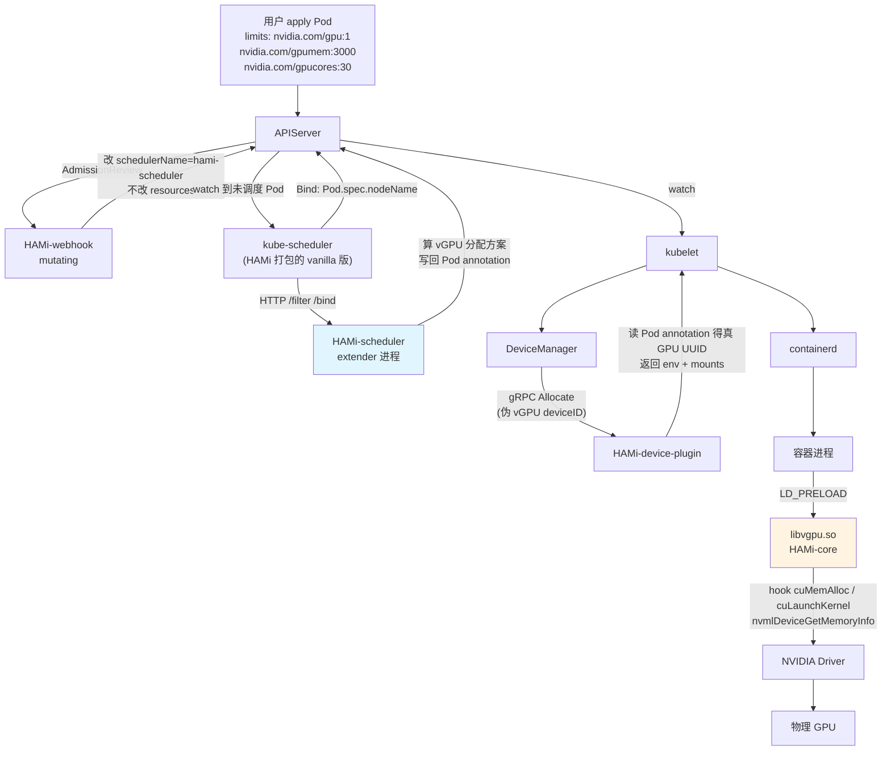
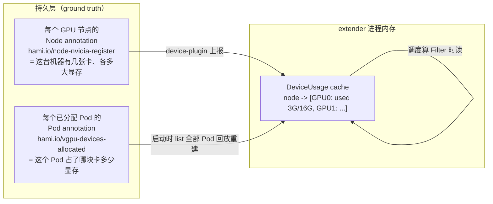
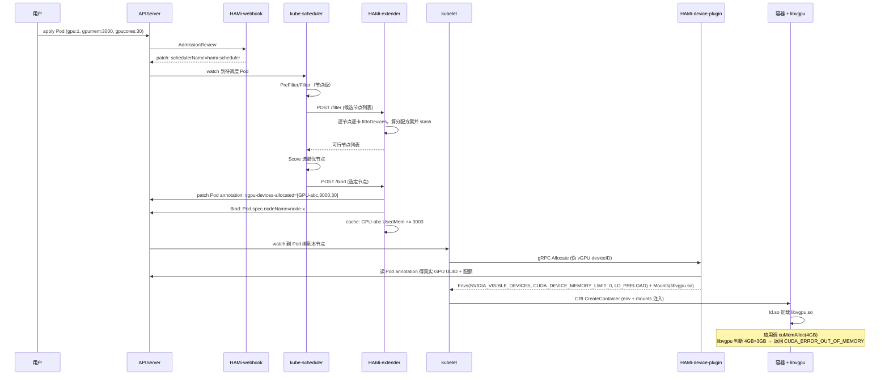

#kubernetes #gpu #hami #ai-infra #源码导读

相关笔记：[[hami-learning-path]] | [[gpu-scheduling-source]] | [[gpu-scheduling]] | [[scheduler-framework-source]] | [[kubelet-cri-source]] | [[controller-runtime-source]] | [[demo-hami-mac]] | [[demo-fake-gpu]] | [[learn-k8s-via-hami]] | [[k8s-development-roadmap]] | [[k8s-interview]]

## 概述

本篇是 **HAMi（Heterogeneous AI computing Virtualization middleware，CNCF Sandbox）** 的源码导读笔记，主线是回答一个问题：**一块物理 GPU，HAMi 怎么把它「虚拟」成多份，让多个 Pod 按显存/算力配额共享，而不是原生 NVIDIA Device Plugin 那样整卡独占？**

原生 `nvidia-device-plugin` 有两个硬伤：(1) 资源粒度是「整卡」——`nvidia.com/gpu: 1` 就是一整张卡；(2) kube-scheduler 只看 `nvidia.com/gpu` 这个**整数计数**，看不到显存大小、算力百分比。HAMi 不改 kube-scheduler 二进制、不改 NVIDIA 驱动，用 **四个组件协同**把整卡切成 vGPU：

| 组件 | 进程形态 | 干的事 | 对应已学 K8s 机制 |
| :--- | :--- | :--- | :--- |
| **HAMi-webhook** | 与 scheduler 同 Pod | mutating webhook：把声明了 `nvidia.com/gpumem` 的 Pod 改写 `schedulerName`、注入 annotation | [[controller-runtime-source]] Webhook |
| **HAMi-scheduler** | Deployment（vanilla kube-scheduler + extender） | scheduler-extender：Filter 选节点、Bind 时把 vGPU 分配方案写回 Pod annotation | [[scheduler-framework-source]] Extender |
| **HAMi-device-plugin** | DaemonSet | 把 1 张物理卡 `ListAndWatch` 上报为 N 份；`Allocate` 注入配额 env + `LD_PRELOAD` | [[kubelet-cri-source]] Device Plugin |
| **HAMi-core（libvgpu.so）** | 容器内动态库 | `LD_PRELOAD` 进每个容器，hook CUDA Driver API / NVML，按配额拦截 | LD_PRELOAD / 动态链接（新知识） |



整张图最容易看漏的三点：
1. **webhook 不改 `resources`，只改 `schedulerName` + 注 annotation**。`nvidia.com/gpumem`、`nvidia.com/gpucores` 这些是 HAMi 自定义的 Extended Resource，webhook 把它们「翻译」成 annotation 让 extender 读，真正的整数资源 `nvidia.com/gpu` 留给 kubelet DeviceManager 走标准流程。
2. **「哪台节点 + 哪块物理卡 + 切多少」是 extender 在 Bind 阶段决定的**，结论写在 Pod annotation 上。device-plugin 的 `Allocate` 只是被动读 annotation，不做决策。
3. **真正的「配额隔离」不在 K8s 层，在容器内的 libvgpu.so**。K8s 层（webhook + scheduler + device-plugin）只负责「账本」——谁该拿多少、调度到哪；真正「让应用申请超过 3GB 显存就 OOM」是 libvgpu hook `cuMemAlloc` 实现的。

> 行号说明：HAMi 主仓 `github.com/Project-HAMi/HAMi`、libvgpu 仓 `github.com/Project-HAMi/HAMi-core` 不在本地 `~/github` 下，下文给出**目录与函数名**，clone 后可补精确行号。版本基于 HAMi v2.4.x 的代码结构。

---

## 一、HAMi-webhook：把 vGPU 请求「翻译」给 extender

### 1.1 它解决什么

用户写的 Pod 长这样：

```yaml
resources:
  limits:
    nvidia.com/gpu: 1          # 要 1 个 vGPU 设备
    nvidia.com/gpumem: 3000    # 显存 3000 MiB
    nvidia.com/gpucores: 30    # 算力 30%
```

但 kube-scheduler 默认调度器（`default-scheduler`）根本不认识 `gpumem` / `gpucores` 的语义——它只会把 `nvidia.com/gpu: 1` 当普通整数资源。如果什么都不做，这个 Pod 会被 default-scheduler 用「只看数量」的逻辑调走，HAMi 的精细调度就插不上手。

**webhook 的职责：拦截这类 Pod，把它「劫持」给 HAMi-scheduler。**

### 1.2 入口与核心逻辑

代码在主仓 `pkg/scheduler/webhook.go`（webhook 和 extender 打包在同一个进程、同一个 Pod 里）。它实现 controller-runtime 的 `admission.Handler` 接口：

```go
// pkg/scheduler/webhook.go  —— 伪代码骨架
type webhook struct{}

func (h *webhook) Handle(ctx context.Context, req admission.Request) admission.Response {
    pod := &corev1.Pod{}
    decoder.Decode(req, pod)

    // (1) 判断这个 Pod 是否「要 vGPU」—— 遍历所有 container 的 resources
    hasResource := false
    for _, c := range pod.Spec.Containers {
        if resourceRequested(c, "nvidia.com/gpumem") ||
           resourceRequested(c, "nvidia.com/gpu") {
            hasResource = true
        }
    }
    if !hasResource {
        return admission.Allowed("no vGPU resource, skip")
    }

    // (2) 已经指定了别的非 default 调度器 -> 尊重用户，不抢
    if pod.Spec.SchedulerName != "" && pod.Spec.SchedulerName != "default-scheduler" {
        return admission.Allowed("custom scheduler, skip")
    }

    // (3) 核心改写：把调度器换成 HAMi 的
    pod.Spec.SchedulerName = "hami-scheduler"

    // (4) 打标记，便于 extender / device-plugin 识别
    //     某些版本还会注入 nodeSelector 或把 privileged Pod 排除
    return admission.PatchResponseFromRaw(req.Object.Raw, marshal(pod))
}
```

**几个关键设计点**：

- **webhook 不动 `resources`**。`nvidia.com/gpumem` 这些字段一路原样保留，留给 extender 解析。webhook 只改 `schedulerName`。
- **`MutatingWebhookConfiguration` 一定要配 `namespaceSelector` 排除 `kube-system`**（[[controller-runtime-source]] 第 8 节讲过死锁）。否则 webhook 自己的 Pod 重启时，webhook 还没起来 → 它自己创建不出来 → 死锁。HAMi 的 helm chart 默认把 `failurePolicy` 设为 `Ignore` 来兜底。
- **为什么用 webhook 而不是让用户自己写 `schedulerName`**：透明。用户像用原生 GPU 一样写 yaml，HAMi 自动接管，迁移成本为零。这跟 Istio sidecar 注入是同一类「无侵入」设计。

### 1.3 产出

到此为止，一个「要 vGPU 的 Pod」进 etcd 时已经被打上 `schedulerName: hami-scheduler`。default-scheduler 看到 `schedulerName` 不是自己，主动忽略；HAMi-scheduler 看到是自己的，接管。

---

## 二、HAMi-scheduler：vGPU 虚拟调度的核心

这是「虚拟调度」四个字真正发生的地方。HAMi-scheduler 进程 = **一个 vanilla kube-scheduler + 一个 extender HTTP server**。

### 2.1 为什么是 Extender 而不是 Framework Plugin

先复习 [[scheduler-framework-source]] 第 9 节的对比。HAMi 选 Extender：

| 维度 | Framework Plugin | Extender（HAMi 选这个） |
| :--- | :--- | :--- |
| 是否要重编译 kube-scheduler | 要（编进二进制） | 不要（HTTP 回调） |
| 部署/升级 | 跟 scheduler 绑死 | 独立进程，独立升级 |
| 性能 | 进程内调用，零开销 | 多一次 HTTP RTT（~ms 级） |
| 扩展点 | 11 个全都能插 | 只有 Filter / Prioritize / Bind / Preempt |
| 能否拿到设备粒度信息 | 能（但要自己建 informer） | 能（extender 自己维护 cache） |

HAMi 选 Extender 的理由：**GPU Pod 创建不频繁**（不像无状态 web Pod 一秒几百个），多一次 HTTP RTT 完全可接受；换来的是「不用 fork 维护一个 kube-scheduler 二进制」「能独立发版」。代价是扩展点少，但 GPU 调度只需要 Filter（选节点）+ Bind（定卡），够用。

kube-scheduler 怎么知道要回调 extender？靠 `KubeSchedulerConfiguration` 里的 `extenders` 字段：

```yaml
# HAMi helm 渲染出来的 scheduler config
apiVersion: kubescheduler.config.k8s.io/v1
kind: KubeSchedulerConfiguration
profiles:
  - schedulerName: hami-scheduler
extenders:
  - urlPrefix: "https://127.0.0.1:443"
    filterVerb: filter
    bindVerb: bind
    nodeCacheCapable: true
    managedResources:
      - name: nvidia.com/gpu
        ignoredByScheduler: true   # 关键：让 default 的 NodeResourcesFit 不要管这个资源
```

`ignoredByScheduler: true` 这一行很关键——它告诉 vanilla scheduler「`nvidia.com/gpu` 这个资源你别用 NodeResourcesFit 算了，交给 extender」。否则 scheduler 自己的整数资源检查会和 extender 打架。

### 2.2 vGPU 的「状态」存在哪——这是理解 HAMi 调度的关键

原生 kube-scheduler 用 `Cache.AssumePod` 在内存里维护「飞行中」的乐观状态（[[scheduler-framework-source]] 第 4 节）。但 **HAMi-scheduler extender 跑在独立进程里，碰不到 kube-scheduler 的内存 Cache**。它怎么知道「节点 A 的 GPU-0 还剩多少显存」？

HAMi 的答案是 **两层状态**：



- **device-plugin 在每个 GPU 节点把「这台机器有什么卡」写进 Node annotation**（`hami.io/node-nvidia-register`），内容是序列化的 GPU 列表（UUID、型号、总显存、总算力）。
- **每个被调度成功的 Pod，extender 把「它占了哪块卡、多少显存」写进 Pod annotation**（`hami.io/vgpu-devices-allocated`）。
- **extender 进程启动时**，`list` 全集群所有带 HAMi annotation 的 Pod，回放重建内存里的 `DeviceUsage` cache。**所以 extender 重启不丢账**——因为账本的 ground truth 是 etcd 里的 Pod annotation，不是进程内存。

> 对照思考：为什么 HAMi 不能复用 kube-scheduler 的 Cache？因为 extender 是独立进程。为什么用 annotation 而不是新建 CRD？annotation 零成本、跟着 Pod 生命周期自动 GC（Pod 删了 annotation 跟着没），不用额外写 controller 维护 CRD。

代码位置：`pkg/scheduler/` 下的 `nodes.go`（节点 GPU 信息）、`pods.go`（Pod 占用回放）、`scheduler.go`（cache 维护）。

### 2.3 Filter：从节点级筛到 GPU 级

kube-scheduler 完成自己的 PreFilter/Filter 后，对剩下的候选节点发一个 HTTP POST 到 extender 的 `/filter`：

```go
// pkg/scheduler/routes/route.go  —— extender filter handler 伪代码
func (r *router) filter(w http.ResponseWriter, req *http.Request) {
    var args extenderv1.ExtenderArgs
    json.NewDecoder(req.Body).Decode(&args)
    pod := args.Pod
    candidateNodes := args.Nodes.Items

    // (1) 从 Pod 解析它要多少 vGPU 资源
    request := decodePodDevices(pod)
    // request = { count: 1, memreq: 3000MiB, coresreq: 30 }

    var filtered []corev1.Node
    failedReasons := map[string]string{}

    for _, node := range candidateNodes {
        // (2) 从内存 cache 拿这个节点的所有物理 GPU 当前占用
        devices := r.cache.GetNodeDevices(node.Name)

        // (3) 核心：能不能从这个节点的某些 GPU 上「凑出」request
        allocated, ok := fitInDevices(devices, request)
        if !ok {
            failedReasons[node.Name] = "no GPU has enough memory/cores"
            continue
        }
        filtered = append(filtered, node)

        // (4) 把「打算怎么分」缓存起来，留给 Bind 阶段用
        r.stashAllocation(pod, node.Name, allocated)
    }

    json.NewEncoder(w).Encode(&extenderv1.ExtenderFilterResult{
        Nodes:       &corev1.NodeList{Items: filtered},
        FailedNodes: failedReasons,
    })
}
```

`fitInDevices` 是真正「切卡」的算法：

```go
// 伪代码：在一个节点的多张物理卡里，凑出 request 要的 vGPU
func fitInDevices(devices []*DeviceUsage, req ContainerRequest) ([]Allocation, bool) {
    // devices 已按某种策略排序（binpack: 剩余少的优先 / spread: 剩余多的优先）
    var result []Allocation
    need := req.count
    for _, d := range devices {
        if need == 0 { break }
        // 这块物理卡剩余显存 / 算力 够不够这次请求？
        if d.TotalMem-d.UsedMem >= req.memreq &&
           d.TotalCore-d.UsedCore >= req.coresreq &&
           d.UsedCount < d.MaxSplitCount {        // 一卡最多切几份也有上限
            result = append(result, Allocation{
                UUID: d.UUID, Mem: req.memreq, Cores: req.coresreq,
            })
            need--
        }
    }
    return result, need == 0
}
```

**关键点**：
- Filter 不只回答「这个节点行不行」，它顺便算出「具体用这个节点的哪块卡、切多少」，把这个方案 stash 起来。这跟原生 scheduler「Filter 只做布尔判断」不同——因为 extender 没有后续的 Reserve 扩展点，必须在 Filter 时就把方案备好。
- `binpack` / `spread` 策略体现在 `devices` 的**排序**上：binpack 把「剩余资源少」的卡排前面，优先填满一张卡（省卡）；spread 反过来，优先铺开（均衡、降低单卡故障影响）。helm value `devicePlugin.deviceSplitCount` 和 scheduler 的 `nodeSchedulerPolicy` / `gpuSchedulerPolicy` 控制。

### 2.4 Bind：把分配方案钉死在 Pod annotation 上

scheduler 选定最终节点后，对 extender 发 `/bind`：

```go
// pkg/scheduler/routes/route.go  —— extender bind handler 伪代码
func (r *router) bind(w http.ResponseWriter, req *http.Request) {
    var args extenderv1.ExtenderBindingArgs
    json.NewDecoder(req.Body).Decode(&args)

    // (1) 取出 Filter 阶段 stash 的分配方案
    allocation := r.popAllocation(args.PodName, args.Node)
    // allocation = [ {UUID: GPU-abc..., Mem: 3000, Cores: 30} ]

    // (2) 关键：把方案写进 Pod annotation —— 这是 device-plugin 唯一的信息来源
    patch := annotationPatch(map[string]string{
        "hami.io/vgpu-devices-allocated": encode(allocation),
        "hami.io/vgpu-devices-to-allocate": encode(allocation),
    })
    kubeClient.CoreV1().Pods(ns).Patch(podName, patch)

    // (3) 真正执行 Bind：创建 Binding 对象，Pod.spec.nodeName = node
    kubeClient.CoreV1().Pods(ns).Bind(&corev1.Binding{
        Target: corev1.ObjectReference{Kind: "Node", Name: args.Node},
    })

    // (4) 更新内存 cache：这块卡的 UsedMem += 3000
    r.cache.AddPodDevices(args.Node, allocation)
}
```

这一步是整条链路的「枢纽」：
- **`hami.io/vgpu-devices-allocated` annotation 是 extender 和 device-plugin 之间唯一的通信信道**。extender 在控制面决策，device-plugin 在节点上执行，两者不直接 RPC，靠 Pod 这个对象「传纸条」。
- Bind 之后 cache 立刻 `+= used`，相当于原生 scheduler 的 `AssumePod` ——下一个 Pod 调度时就看到这块卡已经少了 3000 MiB。
- 如果 extender 多副本：靠 **leader election** 选主，只有 leader 处理 filter/bind，避免两个副本对同一张卡并发分配。

### 2.5 调度阶段小结

```
用户 apply Pod
  → webhook 改 schedulerName=hami-scheduler
  → kube-scheduler 跑自己的 PreFilter/Filter（节点级，CPU/内存/亲和性）
  → POST extender /filter：逐节点逐卡判断 vGPU 能否满足，算出分配方案并 stash
  → kube-scheduler 跑 Score 选最优节点
  → POST extender /bind：把分配方案写进 Pod annotation + 真正 Bind + 更新 cache
  → Pod.spec.nodeName 已定，annotation 已带「用哪块卡多少显存」
```

**到这里，「虚拟调度」已经完成**——HAMi 在不改 kube-scheduler 的前提下，让调度决策从「节点 + 整数卡」细化到了「节点 + 具体物理卡 UUID + 显存 MiB + 算力 %」。剩下的是节点侧怎么落地。

---

## 三、HAMi-device-plugin：1 张物理卡上报成 N 份

调度决策有了，但 kubelet 怎么知道「这个 Pod 该绑哪块卡」？这是 device-plugin 的活。代码在 `pkg/device-plugin/nvidiadevice/`。

### 3.1 ListAndWatch：把 1 张卡上报 N 次

对照 [[demo-fake-gpu]]：原生 NVIDIA plugin 一张物理卡上报一个 device。HAMi 不一样——它把**同一张物理卡上报 `deviceSplitCount` 次**（默认 10）：

```go
// pkg/device-plugin/nvidiadevice/.../register.go  —— 伪代码
func (p *NvidiaDevicePlugin) getDevices() []*pluginapi.Device {
    var devs []*pluginapi.Device
    physicalGPUs := nvml.GetAllGPUs()      // NVML 枚举真实物理卡
    for _, gpu := range physicalGPUs {
        for i := 0; i < deviceSplitCount; i++ {     // 默认 10
            devs = append(devs, &pluginapi.Device{
                ID:     fmt.Sprintf("%s-%d", gpu.UUID, i),  // 伪 vGPU ID
                Health: pluginapi.Healthy,
            })
        }
    }
    return devs
}
```

结果：一台 8 卡机器，kubelet 看到的 `nvidia.com/gpu` capacity 是 `8 × 10 = 80`。**注意：显存/算力维度不体现在这个数字里**——数量只是「这张卡还能被几个容器共享」的上限。真正的显存隔离由 webhook(账) + extender(调度) + libvgpu(执行) 三方完成。

device-plugin 还会**把这台机器的真实 GPU 信息（UUID、型号、总显存、总算力）写进 Node annotation** `hami.io/node-nvidia-register`，供 extender 的 cache 读取（§ 2.2）。

### 3.2 Allocate：读 annotation，注入 env + libvgpu

kubelet 的 DeviceManager 从 80 个伪 vGPU 里随便挑一个 ID（比如 `GPU-abc...-3`），调 device-plugin 的 `Allocate`。但**伪 ID 里的物理 UUID 不一定是 extender 选的那块卡**——所以 device-plugin 不能信 kubelet 给的 ID，得去读 extender 写的 annotation：

```go
// pkg/device-plugin/nvidiadevice/.../server.go  —— Allocate 伪代码
func (p *NvidiaDevicePlugin) Allocate(ctx context.Context,
    reqs *pluginapi.AllocateRequest) (*pluginapi.AllocateResponse, error) {

    // (1) 找到「当前正在分配、还没拿到设备」的那个 HAMi Pod
    //     靠 kubelet 调 Allocate 的时序 + Pod annotation 状态机匹配
    pod := getPendingPod()

    // (2) 从 Pod annotation 拿 extender 算好的真实分配方案
    allocation := decode(pod.Annotations["hami.io/vgpu-devices-to-allocate"])
    // allocation = [ {UUID: GPU-真实选中, Mem: 3000, Cores: 30} ]

    resp := &pluginapi.AllocateResponse{}
    for i, dev := range allocation {
        car := &pluginapi.ContainerAllocateResponse{
            Envs: map[string]string{
                // nvidia-container-runtime 据此挂 /dev/nvidiaX —— 用真实 UUID
                "NVIDIA_VISIBLE_DEVICES": dev.UUID,
                // libvgpu 据此知道显存/算力上限（X = 容器内可见 GPU index）
                fmt.Sprintf("CUDA_DEVICE_MEMORY_LIMIT_%d", i): fmt.Sprintf("%dm", dev.Mem),
                fmt.Sprintf("CUDA_DEVICE_SM_LIMIT_%d", i):     fmt.Sprintf("%d", dev.Cores),
                // 关键：让容器启动时加载 libvgpu.so
                "LD_PRELOAD": "/usr/local/vgpu/libvgpu.so",
            },
            Mounts: []*pluginapi.Mount{
                // 把宿主机的 libvgpu.so 挂进容器
                {ContainerPath: "/usr/local/vgpu/libvgpu.so",
                 HostPath: "/usr/local/vgpu/libvgpu.so", ReadOnly: true},
                // 共享内存目录，多容器共享一卡时算力协调用
                {ContainerPath: "/tmp/vgpu", HostPath: "/tmp/vgpu/<pod-uid>"},
            },
        }
        resp.ContainerResponses = append(resp.ContainerResponses, car)
    }
    // (3) 把 Pod annotation 状态从 to-allocate 翻成 allocated
    markAllocated(pod)
    return resp, nil
}
```

**对照 [[demo-fake-gpu]] 只返回 `NVIDIA_VISIBLE_DEVICES`**，HAMi 的 Allocate 多了三样东西，正是「虚拟化」的落点：
1. `CUDA_DEVICE_MEMORY_LIMIT_X` / `CUDA_DEVICE_SM_LIMIT_X`——给 libvgpu 的配额。
2. `LD_PRELOAD=/usr/local/vgpu/libvgpu.so`——让容器一启动就加载 hook 库。
3. `Mounts` 把 libvgpu.so 和共享内存目录挂进容器。

> [[demo-hami-mac]] 在 Mac 上复现的就是这一步：你能在 `kubectl logs` 里亲眼看到这三个 env 被注入容器。差别只是 demo 注入的 libvgpu 路径下没有真实的 .so 文件（Mac 没 CUDA）。

---

## 四、HAMi-core（libvgpu.so）：容器内的真实隔离

前三块都是 K8s 层的「记账 + 调度 + 注入」。**真正让「申请超过 3GB 显存就失败」发生的，是这块 C 库。** 代码在独立仓库 `github.com/Project-HAMi/HAMi-core`。

### 4.1 LD_PRELOAD 拦截原理

```
容器进程启动
  → 动态链接器 ld.so 先加载 LD_PRELOAD 指向的 libvgpu.so
  → libvgpu.so 里定义了和 libcuda.so 同名的符号 cuMemAlloc / cuLaunchKernel ...
  → 后续业务进程（PyTorch / TensorFlow）调 cuMemAlloc 时，
    符号解析命中的是 libvgpu 的版本，不是真正的 libcuda.so
  → libvgpu 在自己的版本里做配额判断，再用 dlsym(RTLD_NEXT,...) 转调真正的 libcuda.so
```

这套机制不需要改 NVIDIA 驱动（驱动闭源、改不了），也对应用透明（PyTorch 不用改一行代码）。[[demo-hami-mac]] 的 `libvgpu-hook-demo/` 用 50 行 C hook `malloc` 演示了完全相同的机制。

### 4.2 显存拦截：hook cuMemAlloc

HAMi-core 仓库 `src/cuda/memory.c` 一带：

```c
// 伪代码 —— 显存配额拦截
CUresult cuMemAlloc_v2(CUdeviceptr *dptr, size_t bytesize) {
    // 从共享内存读「当前这张卡这个容器已用多少」
    size_t used = get_gpu_memory_usage();
    size_t limit = get_limit_from_env();  // CUDA_DEVICE_MEMORY_LIMIT_0

    if (used + bytesize > limit) {
        // 假装 OOM —— 应用收到的是标准 CUDA OOM 错误，不是 SIGKILL
        return CUDA_ERROR_OUT_OF_MEMORY;
    }

    // 配额够，转调真正的 libcuda.so
    CUresult r = real_cuMemAlloc_v2(dptr, bytesize);
    if (r == CUDA_SUCCESS) {
        add_gpu_memory_usage(bytesize);   // 记账到共享内存
    }
    return r;
}
```

同时 hook NVML 的 `nvmlDeviceGetMemoryInfo` ——让容器内跑 `nvidia-smi` 看到的「总显存 / 已用显存」也是配额后的假数据，否则应用一看「这卡明明有 80GB」就会尝试申请更多。

### 4.3 算力拦截：hook cuLaunchKernel（不是物理切分）

显存是硬配额（超了就 OOM），算力是**软限流**——HAMi 不能物理切分 SM（那是 MIG 才有的硬件能力），它的做法是「在 kernel 启动前按比例 sleep」：

```c
// 伪代码 —— 算力软限流
CUresult cuLaunchKernel(CUfunction f, ...) {
    // 维护一个滑动窗口的 GPU 利用率统计
    while (current_utilization() > sm_limit /* CUDA_DEVICE_SM_LIMIT_0 = 30 */) {
        usleep(SOME_INTERVAL);   // 拖一会儿，把时间片让给同卡其他容器
    }
    return real_cuLaunchKernel(f, ...);
}
```

- 这是「时间片」式共享：30% 的配额 ≈ 「这个容器的 kernel 大约只占用 30% 的 GPU 时间」。
- 多个容器共享一张卡时，它们各自的 libvgpu 通过**共享内存**（`/tmp/vgpu` 挂进来的目录，或 `/dev/shm`）交换「我现在用了多少」，协同限流。这就是 § 3.2 Allocate 里要挂共享内存目录的原因。
- 跟 MIG 的本质区别：MIG 是硬件把 GPU 切成隔离的 instance（A100/H100 才有），强隔离、性能确定；HAMi 是软件层时间片，弱隔离、可能有抖动，但**消费级显卡也能用、零硬件依赖**。

### 4.4 HAMi-core 目录速查

| 目录 | 干什么 |
| :--- | :--- |
| `src/cuda/` | hook CUDA Driver API（`cuMemAlloc` / `cuLaunchKernel` / `cuMemGetInfo` …） |
| `src/nvml/` | hook NVML（`nvmlDeviceGetMemoryInfo` 等，骗 `nvidia-smi`） |
| `src/multiprocess/` | 多容器/多进程共享内存协调，限流统计 |
| `src/allocator/` | 显存记账逻辑 |
| `src/hook.c` | `LD_PRELOAD` 入口、`constructor` 初始化、`dlsym(RTLD_NEXT,...)` 拿真符号 |

---

## 五、端到端时序总图



---

## 六、HAMi 与其他 GPU 共享方案对比

| 方案 | 隔离层 | 显存隔离 | 算力隔离 | 硬件要求 | 强隔离 |
| :--- | :--- | :--- | :--- | :--- | :--- |
| **HAMi** | 软件（LD_PRELOAD hook CUDA API） | 硬配额（超额返回 OOM） | 软限流（kernel 前 sleep） | 无（消费卡也行） | 弱 |
| **NVIDIA MIG** | 硬件（GPU 物理分区） | 物理隔离 | 物理隔离 | A100/H100/A30 等 | 强 |
| **NVIDIA MPS** | NVIDIA 自带（合并 CUDA context） | 无（仅 `CUDA_MPS_PINNED_DEVICE_MEM_LIMIT` 部分支持） | 按比例（`CUDA_MPS_ACTIVE_THREAD_PERCENTAGE`） | 较新驱动 | 弱 |
| **NVIDIA vGPU** | 商业虚拟化（hypervisor 层） | 强 | 强 | 需 license + 数据中心卡 | 强 |
| **阿里 cGPU / 腾讯 qGPU** | 内核模块（拦截 ioctl） | 硬配额 | 较强 | 厂商云环境，闭源 | 中 |

HAMi 的定位：**零硬件依赖、零驱动改动、对应用透明**的软件方案。代价是弱隔离——它拦的是用户态 CUDA API，应用如果绕过（比如自己 `LD_PRELOAD=/dev/null`，或直接调 ioctl）就突破了配额。所以 HAMi 适合「内部可信工作负载的资源复用」，不适合「多租户强安全隔离」。

---

## 七、几个深入问题

**Q1：extender 多副本时，怎么避免两个副本同时把同一张卡分给两个 Pod？**
leader election。只有 leader 处理 filter/bind。即便如此，Bind 后写 annotation 和更新 cache 之间有窗口——HAMi 靠「Bind 成功后立刻 `cache += used`」+「下次启动从 Pod annotation 回放」保证最终一致。

**Q2：kubelet 重启会不会丢账？**
不会。账本 ground truth 是 Pod annotation（存在 etcd）。device-plugin 重启后重新 `ListAndWatch`，extender 重启后重新 list Pod 回放 cache。内存态都是可重建的派生数据。

**Q3：Pod 没声明 `nvidia.com/gpumem` 只写了 `nvidia.com/gpu: 1` 会怎样？**
看配置。HAMi 有 `defaultMem` / `defaultCores` 兜底（webhook 或 device-plugin 侧补默认值）；也可配成「不写 gpumem 就当整卡」。[[demo-hami-mac]] 用进程环境变量 `HAMI_MAC_DEFAULT_MEM` 模拟了这个兜底。

**Q4：为什么 device-plugin 不能信 kubelet 传给 Allocate 的 deviceID？**
因为 device-plugin 上报的是「伪 vGPU ID」（`UUID-0..9`），kubelet 的 DeviceManager 从池子里随便挑——挑中的伪 ID 里的物理 UUID 不一定等于 extender 选的卡。真实分配方案只在 Pod annotation 里，所以 Allocate 必须去读 annotation。

**Q5：HAMi 的「虚拟调度」和原生 GPU 调度的本质区别？**
原生：scheduler 只看 `nvidia.com/gpu` 整数，kubelet DeviceManager 整卡分配。HAMi：调度粒度细化到「物理卡 UUID + 显存 MiB + 算力 %」，且这个细粒度决策发生在 extender（控制面），通过 annotation 下发给 device-plugin（节点面）执行，再由 libvgpu（容器内）强制配额。**一句话：把「整数计数调度」升级成「多维资源向量 + 设备级 binpack」。**

**Q6：DRA（Dynamic Resource Allocation）出来后 HAMi 会被取代吗？**
DRA 解决的是「资源建模和申请的 API 形态」（用 ResourceClaim 代替 Extended Resource），它让「怎么描述/申请一块 vGPU」更标准。但「怎么真的把卡切开」还是要厂商提供 driver——HAMi 的 libvgpu hook 这套机制可以平移到 DRA driver 之上。所以 DRA 更可能是 HAMi 的「新上层 API」，而非替代品。详见 [[gpu-scheduling-source]] 的 DRA 章节。

---

## 八、配套实践

- **跑 demo**：[[demo-hami-mac]] —— Mac 上 kind 复现 webhook→extender→device-plugin 链路（libvgpu 那步用 [[demo-hami-mac]] 的 `libvgpu-hook-demo/` malloc hook 替代）。
- **学习路径**：[[hami-learning-path]] —— 6 阶段、4-6 周的完整学习计划，含「跑通最小集群」「自己画架构图」等可验证产出。
- **以 HAMi 学 K8s**：[[learn-k8s-via-hami]] —— 反过来用 HAMi 当线索串 K8s 12 个核心机制。
- **读真实源码**：`git clone https://github.com/Project-HAMi/HAMi` 和 `https://github.com/Project-HAMi/HAMi-core`，对照本文 § 1-4 的目录/函数名定位。

## 面试要点

| 问题 | 回答要点 |
| :--- | :--- |
| **HAMi 怎么实现 GPU 虚拟调度？** | 四组件协同：webhook 把 GPU Pod 的 schedulerName 改成 hami-scheduler；extender 在 Filter/Bind 阶段按「物理卡 UUID + 显存 + 算力」做设备级 binpack，结论写进 Pod annotation；device-plugin 把 1 卡上报为 N 份、Allocate 时读 annotation 注入配额 env + LD_PRELOAD；libvgpu.so 在容器内 hook CUDA API 强制配额。 |
| **HAMi 为什么用 Extender 而不是 Framework Plugin？** | 不用重编译 kube-scheduler、可独立部署升级；GPU Pod 创建不频繁，多一次 HTTP RTT 可接受。代价是扩展点少（只有 Filter/Bind），但 GPU 调度够用。 |
| **HAMi 的 vGPU 占用状态存在哪？extender 重启会丢吗？** | 两层：ground truth 是 Pod annotation（`hami.io/vgpu-devices-allocated`，存 etcd）+ Node annotation（节点 GPU 清单）；extender 进程内存里有 DeviceUsage cache。重启不丢——启动时 list 全部 HAMi Pod 回放重建 cache。 |
| **为什么 HAMi 不复用 kube-scheduler 的 Cache？** | extender 是独立进程，碰不到 kube-scheduler 的内存 Cache。所以自己用 annotation + in-memory cache 维护「飞行中状态」。 |
| **device-plugin 怎么把 1 张卡变 N 份？** | ListAndWatch 里把同一物理卡的 UUID 加后缀上报 deviceSplitCount 次（默认 10）。kubelet 看到的 capacity = 物理卡数 × 10。显存/算力维度不在这个数字里。 |
| **device-plugin 的 Allocate 为什么要读 Pod annotation？** | kubelet 传给 Allocate 的是「伪 vGPU ID」，里面的物理 UUID 不一定是 extender 选中的卡。真实分配方案（哪块卡、多少显存）只在 extender 写的 Pod annotation 里。 |
| **HAMi 怎么让容器看到「假的」显存上限？** | LD_PRELOAD 加载 libvgpu.so，hook `cuMemAlloc`（超配额返回 CUDA_ERROR_OUT_OF_MEMORY）和 `nvmlDeviceGetMemoryInfo`（让 nvidia-smi 看到配额后的假值）。 |
| **HAMi 的算力隔离是物理切分吗？** | 不是。物理切分要 MIG。HAMi 在 `cuLaunchKernel` 前按当前利用率 sleep，做时间片软限流，多容器通过共享内存协调。 |
| **HAMi vs MIG vs MPS vs vGPU？** | HAMi=软件 hook，零硬件依赖、弱隔离；MIG=硬件分区，强隔离但要 A100+；MPS=NVIDIA 合并 context，算力可分但显存隔离弱；vGPU=商业 hypervisor 方案，强隔离要 license。 |
| **HAMi 的隔离边界在哪？有什么风险？** | 拦的是用户态 CUDA API，可信工作负载场景够用；但应用若绕过 LD_PRELOAD 或直接调 ioctl 就能突破配额——不适合多租户强安全隔离。另外超配额是返回 OOM 错误而非 SIGKILL，应用要自己处理。 |
| **DRA 出来 HAMi 还有意义吗？** | DRA 解决资源建模/申请的 API 形态，但「怎么切卡」仍需厂商 driver。HAMi 的 libvgpu hook 机制可平移到 DRA 之上，DRA 更像 HAMi 的新上层 API 而非替代品。 |
