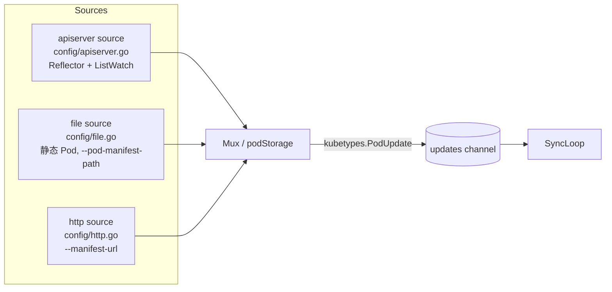
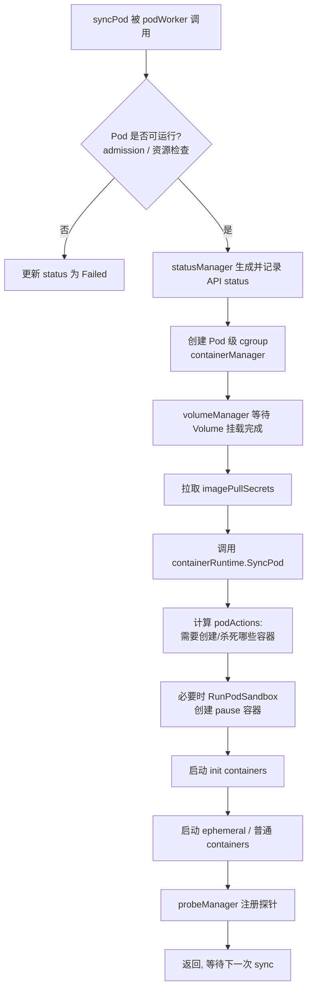
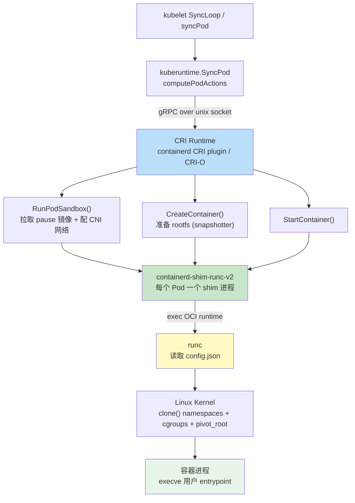
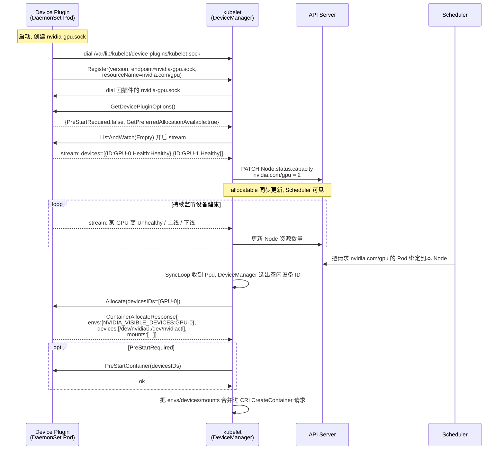

#kubernetes #kubelet #cri #device-plugin #源码导读

相关笔记：[[oci-runtime]] | [[gpu-scheduling]] | [[kubernetes-basics]] | [[client-go-source]] | [[k8s-interview]] | [[k8s-development-roadmap]] | [[demo-device-plugin]]

## 概述

kubelet 是运行在每个 Node 上的核心 agent，负责把 API Server 中 `spec.nodeName` 指向本机的 Pod 真正拉起并维持在期望状态。它本身不直接操作容器，而是通过 **CRI（Container Runtime Interface）** 这套 gRPC 接口与底层容器运行时（containerd / CRI-O）通信，再由运行时调用 OCI runtime（runc）落地为 Linux 进程。本篇是一篇源码导读，按三条主线展开：(1) kubelet 的内部架构——`SyncLoop` 主循环、`PodConfig` 多源聚合、`podWorkers` 并发执行、`PLEG` 容器事件感知、`syncPod` 单 Pod 收敛流程；(2) CRI 的 gRPC 契约——`RuntimeService` 与 `ImageService` 两组 service、`RunPodSandbox`/`CreateContainer`/`StartContainer` 等关键 RPC、sandbox（pause 容器）模型，以及 containerd CRI plugin / CRI-O / 已移除的 dockershim 三种实现；(3) Device Plugin 框架——第三方设备厂商如何通过 `/var/lib/kubelet/device-plugins/kubelet.sock` 向 kubelet 注册，`ListAndWatch` 上报设备、`Allocate` 在容器创建前返回设备挂载/环境变量，使 GPU 等硬件以 Extended Resource 形式出现在 Node capacity 中。文中代码路径均基于 `kubernetes/kubernetes` 主干（v1.29 左右）。

## kubelet 整体架构

### 启动入口与组件装配

kubelet 的二进制入口在 `cmd/kubelet/kubelet.go`，主体逻辑在 `cmd/kubelet/app/server.go` 的 `RunKubelet`。最终构造的核心结构体是 `pkg/kubelet/kubelet.go` 中的 `Kubelet`。它聚合了一组相互协作的子组件：

| 组件 | 源码位置 | 职责 |
| :--- | :--- | :--- |
| `PodConfig` | `pkg/kubelet/config/` | 聚合 apiserver / file / http 三类 Pod 来源，输出统一的 update channel |
| `podManager` | `pkg/kubelet/pod/` | 内存中维护「期望 Pod」集合（含 mirror pod） |
| `podWorkers` | `pkg/kubelet/pod_workers.go` | 每个 Pod 一个 goroutine，串行执行该 Pod 的 sync |
| `PLEG` | `pkg/kubelet/pleg/` | Pod Lifecycle Event Generator，感知容器实际状态变化 |
| `containerRuntime` | `pkg/kubelet/kuberuntime/` | 泛化运行时管理器，封装 CRI 调用 |
| `containerManager` | `pkg/kubelet/cm/` | 管理 cgroup、CPU/Memory/Topology Manager、Device Plugin |
| `volumeManager` | `pkg/kubelet/volumemanager/` | 挂载/卸载 Volume |
| `statusManager` | `pkg/kubelet/status/` | 把 Pod status 回写 API Server |
| `probeManager` | `pkg/kubelet/prober/` | 执行 liveness / readiness / startup 探针 |

### SyncLoop 主循环

kubelet 的「心脏」是 `SyncLoop`（`pkg/kubelet/kubelet.go` 中的 `syncLoop` / `syncLoopIteration`）。它是一个 select 多路复用循环，从多个 channel 接收事件，每个事件最终都收敛到「让某个 Pod 达到期望状态」。

```go
// 文件: pkg/kubelet/kubelet.go:2613-2654
func (kl *Kubelet) syncLoop(ctx context.Context, updates <-chan kubetypes.PodUpdate, handler SyncHandler) {
    logger := klog.FromContext(ctx)
    logger.Info("Starting kubelet main sync loop")
    // syncTicker 每秒一次，触发对「待 sync」Pod 的全量扫描
    syncTicker := time.NewTicker(time.Second)
    defer syncTicker.Stop()
    housekeepingTicker := time.NewTicker(housekeepingPeriod)
    defer housekeepingTicker.Stop()
    plegCh := kl.pleg.Watch()                       // 从 PLEG 拿事件 channel
    const (
        base   = 100 * time.Millisecond
        max    = 5 * time.Second
        factor = 2
    )
    duration := base
    if kl.dnsConfigurer != nil && kl.dnsConfigurer.ResolverConfig != "" {
        kl.dnsConfigurer.CheckLimitsForResolvConf(klog.FromContext(ctx))
    }

    for {
        // runtime 不健康时退避重试，避免空转
        if err := kl.runtimeState.runtimeErrors(); err != nil {
            logger.Error(err, "Skipping pod synchronization")
            time.Sleep(duration)
            duration = time.Duration(math.Min(float64(max), factor*float64(duration)))
            continue
        }
        duration = base

        kl.syncLoopMonitor.Store(kl.clock.Now())     // 心跳, 给 PLEG/HealthCheck 看
        if !kl.syncLoopIteration(ctx, updates, handler, syncTicker.C, housekeepingTicker.C, plegCh) {
            break
        }
        kl.syncLoopMonitor.Store(kl.clock.Now())
    }
}
```

`syncLoop` 本身是一个无限 `for` 循环，外层只负责处理 runtime 错误退避和心跳更新；真正的事件分发在每轮调用的 `syncLoopIteration` 里。把它单独抽出来的好处是单测可以构造各 channel 直接驱动一轮。

```go
// 文件: pkg/kubelet/kubelet.go:2688-2742
func (kl *Kubelet) syncLoopIteration(ctx context.Context, configCh <-chan kubetypes.PodUpdate, handler SyncHandler,
    syncCh <-chan time.Time, housekeepingCh <-chan time.Time, plegCh <-chan *pleg.PodLifecycleEvent) bool {
    logger := klog.FromContext(ctx)
    select {
    case u, open := <-configCh:
        // 1) PodConfig 来源: apiserver / file / http
        if !open {
            logger.Error(nil, "Update channel is closed, exiting the sync loop")
            return false
        }
        switch u.Op {
        case kubetypes.ADD:
            handler.HandlePodAdditions(ctx, u.Pods)
        case kubetypes.UPDATE:
            handler.HandlePodUpdates(ctx, u.Pods)
        case kubetypes.REMOVE:
            handler.HandlePodRemoves(ctx, u.Pods)
        case kubetypes.RECONCILE:
            handler.HandlePodReconcile(ctx, u.Pods)
        case kubetypes.DELETE:
            // DELETE 走 UPDATE 路径, 走优雅删除
            handler.HandlePodUpdates(ctx, u.Pods)
        }
        kl.sourcesReady.AddSource(u.Source)

    case e := <-plegCh:
        // 2) PLEG 事件: 容器状态变化 (started/died/removed)
        if isSyncPodWorthy(e) {
            if pod, ok := kl.podManager.GetPodByUID(e.ID); ok {
                handler.HandlePodSyncs(ctx, []*v1.Pod{pod})
            }
        }
        if e.Type == pleg.ContainerDied {
            if containerID, ok := e.Data.(string); ok {
                kl.cleanUpContainersInPod(ctx, e.ID, containerID)
            }
        }
    // ... case <-syncCh / <-housekeepingCh / livenessManager.Updates() 省略
    }
    return true
}
```

关键点：`SyncLoop` 本身不做重活，它只是把事件分发给 `SyncHandler`。`SyncHandler` 的实现把 Pod 推送给对应的 `podWorker`，真正的容器操作发生在 worker 的 goroutine 里。注意 `select` 的 case 在多 channel 同时就绪时是「伪随机」选取的——源码注释专门强调了这一点，写 kubelet 相关代码时不要依赖处理顺序。

### PodConfig：多源 Pod 聚合

kubelet 的 Pod 不止来自 API Server，还可以来自本地静态文件和 HTTP endpoint。`pkg/kubelet/config/config.go` 的 `PodConfig` 把三类来源合并成单一 update channel：



- **apiserver source**：通过 client-go 的 `ListWatch` + `Reflector` 监听绑定到本机的 Pod（`spec.nodeName==本机`），见 [[client-go-source]]。
- **file source**：扫描 `--pod-manifest-path` 目录，用于 **静态 Pod（static pod）**，如 kubeadm 部署的 control plane 组件。静态 Pod 由 kubelet 直接管理，kubelet 会在 API Server 上创建对应的只读 **mirror pod**。
- **http source**：从 `--manifest-url` 周期拉取 Pod manifest，使用较少。

每个 source 用 `kubetypes.PodUpdate{Op, Pods, Source}` 表达增量，`SET` 操作表示该 source 的全量快照。

### podWorkers：单 Pod 串行执行

`pkg/kubelet/pod_workers.go` 的 `podWorkers` 保证 **同一个 Pod 的操作串行、不同 Pod 并发**。每个 Pod 对应一个 `podSyncStatus` 和一个独立 goroutine（`podWorkerLoop`）。`SyncHandler` 调用 `UpdatePod` 把最新期望塞进 worker 的 channel，worker 取出后根据 Pod 当前所处的生命周期阶段调用不同的 sync 函数：

```go
// pkg/kubelet/pod_workers.go 中 worker 根据状态分派（简化）
switch {
case update.WorkType == TerminatedPod:
    err = p.podSyncStatuses[...].terminatedWork()      // 资源清理
case update.WorkType == TerminatingPod:
    err = p.syncTerminatingPodFn(ctx, pod, ...)         // 优雅停止容器
default:
    err = p.syncPodFn(ctx, updateType, pod, mirrorPod, status)  // 收敛到期望状态
}
```

三个核心回调最终指向 `Kubelet`：`syncPod`、`syncTerminatingPod`、`syncTerminatedPod`。

### PLEG：Pod Lifecycle Event Generator

kubelet 需要知道容器「实际」状态（如容器自己崩溃退出），但又不能为每个 Pod 都频繁地全量查询运行时。PLEG（`pkg/kubelet/pleg/`）解决这个问题：

- **Generic PLEG（`generic.go`）**：默认实现。每隔 `relistPeriod`（默认 1s）调用一次 CRI 的 `ListPodSandbox` + `ListContainers`，与上一次快照 diff，对每个状态变化生成 `PodLifecycleEvent`（`ContainerStarted` / `ContainerDied` / `ContainerRemoved` 等），写入 `plegCh`。
- **Evented PLEG（`evented.go`）**：1.26+ 的特性门控。利用 CRI 的 `GetContainerEvents` 流式接口直接接收运行时推送的事件，减少 relist 轮询开销，但仍保留 relist 作为兜底。

PLEG 健康状态会反映到 Node 的 `Ready` condition——relist 长时间未完成会触发经典的 `PLEG is not healthy` 报错。

```go
// 文件: pkg/kubelet/pleg/generic.go:292-330
func (g *GenericPLEG) Relist() {
    g.relistLock.Lock()
    defer g.relistLock.Unlock()

    ctx := context.Background()
    g.logger.V(5).Info("GenericPLEG: Relisting")

    // 记录两次 relist 之间的间隔, 暴露为 PLEGRelistInterval 指标
    if lastRelistTime := g.getRelistTime(); !lastRelistTime.IsZero() {
        metrics.PLEGRelistInterval.Observe(metrics.SinceInSeconds(lastRelistTime))
    }

    timestamp := g.clock.Now()
    defer func() {
        // 单次 relist 耗时, 暴露为 PLEGRelistDuration; 这是 "PLEG is not healthy" 的关键指标
        metrics.PLEGRelistDuration.Observe(metrics.SinceInSeconds(timestamp))
    }()

    // 通过 CRI 拿到当前所有 Pod (内部走 ListPodSandbox + ListContainers)
    podList, err := g.runtime.GetPods(ctx, true)
    if err != nil {
        g.logger.Error(err, "GenericPLEG: Unable to retrieve pods")
        return
    }

    g.updateRelistTime(timestamp)

    pods := kubecontainer.Pods(podList)
    updateRunningPodAndContainerMetrics(pods)
    g.podRecords.setCurrent(pods)                // 把这次结果存为 "current"

    // 对每个 Pod 比对 old vs current, 生成 PodLifecycleEvent
    for pid := range g.podRecords {
        g.reconcilePodRecord(ctx, pid)
    }

    // 等所有 pod 都 inspect 完, 才统一更新 cache 时间戳
    g.cache.UpdateTime(timestamp)
}
```

`reconcilePodRecord` 内部用 `computeEvents` 比对每个容器的 old/current 状态，得出 `ContainerStarted` / `ContainerDied` / `ContainerRemoved` / `ContainerChanged` 等事件，再 `select` 非阻塞写入 `eventChannel`——如果 channel 满了直接丢弃并 `metrics.PLEGDiscardEvents.Inc()`，所以这个 channel 在繁忙节点上是排查事件丢失的重点。

### syncPod：单 Pod 收敛流程

`syncPod`（`pkg/kubelet/kubelet.go`）是把「一个 Pod」从当前状态收敛到期望状态的核心函数，主要步骤：



`containerRuntime.SyncPod` 在 `pkg/kubelet/kuberuntime/kuberuntime_manager.go`，它先通过 `computePodActions` 对比期望与现状，得出一个 `podActions`（要不要重建 sandbox、要杀哪些容器、要起哪些容器），再据此调用 CRI。这是「声明式收敛」思想在 kubelet 内部的体现。

```go
// 文件: pkg/kubelet/kuberuntime/kuberuntime_manager.go:1446-1547
func (m *kubeGenericRuntimeManager) SyncPod(ctx context.Context, pod *v1.Pod, podStatus *kubecontainer.PodStatus, pullSecrets []v1.Secret, backOff *flowcontrol.Backoff, restartAllContainers bool) (result kubecontainer.PodSyncResult) {
    logger := klog.FromContext(ctx)
    // Step 1: 对比 spec 与 podStatus, 算出本次要做的动作集合
    //   - CreateSandbox: 是否需要重建 pause 容器
    //   - KillPod:       是否需要杀掉整个 Pod
    //   - ContainersToKill / ContainersToStart: 需要操作的容器
    podContainerChanges := m.computePodActions(ctx, pod, podStatus, restartAllContainers)
    logger.V(3).Info("computePodActions got for pod", "podActions", podContainerChanges, "pod", klog.KObj(pod))
    if podContainerChanges.CreateSandbox {
        ref, err := ref.GetReference(legacyscheme.Scheme, pod)
        if err != nil {
            logger.Error(err, "Couldn't make a ref to pod", "pod", klog.KObj(pod))
        }
        if podContainerChanges.SandboxID != "" {
            // sandbox 变更 (例如 hostNetwork 改了) -> 老 sandbox 被记录为 SandboxChanged 事件
            m.recorder.WithLogger(logger).Eventf(ref, v1.EventTypeNormal, events.SandboxChanged, "Pod sandbox changed, it will be killed and re-created.")
        }
    }

    // Step 2: 如果 sandbox 变更, 先杀掉整个 Pod
    if podContainerChanges.KillPod {
        killResult := m.killPodWithSyncResult(ctx, pod, kubecontainer.ConvertPodStatusToRunningPod(m.runtimeName, podStatus), nil)
        result.AddPodSyncResult(killResult)
        if killResult.Error() != nil {
            return
        }
        if podContainerChanges.CreateSandbox {
            m.purgeInitContainers(ctx, pod, podStatus)
        }
    } else {
        // Step 3: 杀掉本次不需要保留的容器 (比如 image 改了的)
        for containerID, containerInfo := range podContainerChanges.ContainersToKill {
            if err := m.killContainer(ctx, pod, containerID, containerInfo.name, containerInfo.message, containerInfo.reason, nil, nil); err != nil {
                return
            }
        }
    }

    // Step 4: 必要时 RunPodSandbox 创建 pause 容器并配 CNI 网络
    podSandboxID := podContainerChanges.SandboxID
    if podContainerChanges.CreateSandbox {
        podSandboxID, _, _ = m.createPodSandbox(ctx, pod, podContainerChanges.Attempt)
        // ... 失败处理 / 拿到 Pod IP 写回 result
    }
    // Step 5: 启动 init containers
    // Step 6: 启动 ephemeral / 普通 containers
    //   每个容器走 PullImage -> CreateContainer -> StartContainer
    //   见后文 startContainer 中对 CRI 客户端的调用
    return
}
```

这段就是 CRI 调用的「总调度」：先 `computePodActions` 算出差分，再按 KillPod -> KillContainers -> RunPodSandbox -> StartInitContainers -> StartContainers 的顺序逐步收敛。每一步底下最终都会落到 CRI gRPC 调用。

## containerManager 与运行时管理器

### containerManager

`pkg/kubelet/cm/container_manager.go` 的 `ContainerManager` 管理 Node 上与「资源」相关的一切：

- **cgroup 层级**：为 kubepods、各 QoS class、各 Pod 创建 cgroup（`cm/cgroup_manager_linux.go`）。
- **CPU Manager**：`cm/cpumanager/`，为 Guaranteed Pod 做 CPU 独占绑定（`static` policy）。
- **Memory Manager**：`cm/memorymanager/`，NUMA 感知的内存分配。
- **Topology Manager**：`cm/topologymanager/`，协调 CPU/Memory/Device 的 NUMA 亲和性，见 [[gpu-scheduling]]。
- **Device Manager**：`cm/devicemanager/`，Device Plugin 框架的 kubelet 侧实现（详见后文）。

### kuberuntime：泛化运行时管理器

kubelet 不直接依赖某一种运行时，`pkg/kubelet/kuberuntime/` 下的 `kubeGenericRuntimeManager` 是对 CRI 的封装层，实现了 `Runtime` 接口（`pkg/kubelet/container/runtime.go`）。它持有两个 CRI 客户端：

```go
// pkg/kubelet/kuberuntime/kuberuntime_manager.go （简化）
type kubeGenericRuntimeManager struct {
    runtimeName     string
    runtimeService  internalapi.RuntimeService   // CRI RuntimeService 客户端
    imageService    internalapi.ImageManagerService // CRI ImageService 客户端
    // ...
}
```

`internalapi.RuntimeService` 的 gRPC 客户端实现现在抽到了独立模块 `staging/src/k8s.io/cri-client/`（早期版本曾在 `pkg/kubelet/cri/remote/`），通过 Unix socket（如 `unix:///run/containerd/containerd.sock`）连接运行时。kubelet 与运行时之间的所有交互都收敛到这个 gRPC 通道上。看 `RunPodSandbox` 与 `CreateContainer` 这两个最关键的 RPC 包装：

```go
// 文件: staging/src/k8s.io/cri-client/pkg/remote_runtime.go:206-239
func (r *remoteRuntimeService) RunPodSandbox(ctx context.Context, config *runtimeapi.PodSandboxConfig, runtimeHandler string) (string, error) {
    // sandbox 涉及拉 pause 镜像 + 配 CNI 网络, 比普通 RPC 慢, 给 2 倍超时
    timeout := r.timeout * 2

    logger := klog.FromContext(ctx)
    logger.V(10).Info("[RemoteRuntimeService] RunPodSandbox", "config", config, "runtimeHandler", runtimeHandler, "timeout", timeout)

    ctx, cancel := context.WithTimeout(ctx, timeout)
    defer cancel()

    // 真正的 gRPC 调用: kubelet -> containerd CRI plugin / CRI-O
    resp, err := r.runtimeClient.RunPodSandbox(ctx, &runtimeapi.RunPodSandboxRequest{
        Config:         config,            // PodSandboxConfig: name/namespace/UID, labels, hostname, DNS, port mappings, linux config (cgroup parent, namespace mode)
        RuntimeHandler: runtimeHandler,    // 多运行时场景 (如 kata) 指定 handler
    })
    if err != nil {
        logger.Error(err, "RunPodSandbox from runtime service failed")
        return "", err
    }

    podSandboxID := resp.PodSandboxId      // 返回的 sandbox ID, 后续 CreateContainer 必须带上
    if podSandboxID == "" {
        return "", errors.New(fmt.Sprintf("PodSandboxId is not set for sandbox %q", config.Metadata))
    }
    return podSandboxID, nil
}
```

```go
// 文件: staging/src/k8s.io/cri-client/pkg/remote_runtime.go:340-370
func (r *remoteRuntimeService) CreateContainer(ctx context.Context, podSandBoxID string, config *runtimeapi.ContainerConfig, sandboxConfig *runtimeapi.PodSandboxConfig) (string, error) {
    logger := klog.FromContext(ctx)
    logger.V(10).Info("[RemoteRuntimeService] CreateContainer", "podSandboxID", podSandBoxID, "timeout", r.timeout)
    ctx, cancel := context.WithTimeout(ctx, r.timeout)
    defer cancel()
    return r.createContainerV1(ctx, podSandBoxID, config, sandboxConfig)
}

func (r *remoteRuntimeService) createContainerV1(ctx context.Context, podSandBoxID string, config *runtimeapi.ContainerConfig, sandboxConfig *runtimeapi.PodSandboxConfig) (string, error) {
    logger := klog.FromContext(ctx)
    // ContainerConfig 里有 Image、Command/Args、Envs、Mounts、Devices、Linux 资源限制等
    // 注意必须带上 PodSandboxId, 运行时据此把容器加入到 pause 容器的 namespace
    resp, err := r.runtimeClient.CreateContainer(ctx, &runtimeapi.CreateContainerRequest{
        PodSandboxId:  podSandBoxID,
        Config:        config,
        SandboxConfig: sandboxConfig,
    })
    if err != nil {
        logger.Error(err, "CreateContainer in sandbox from runtime service failed", "podSandboxID", podSandBoxID)
        return "", err
    }
    if resp.ContainerId == "" {
        return "", errors.New(fmt.Sprintf("ContainerId is not set for container %q", config.Metadata))
    }
    return resp.ContainerId, nil
}
```

可以看到：CRI 客户端只是 gRPC stub 的一层薄包装，加了超时、日志和返回值校验，本身没有什么业务逻辑——这是 CRI 设计的核心：所有运行时差异都被推给 server 端实现，client 端尽量「透明」。

## CRI（Container Runtime Interface）

### CRI 是什么

CRI 是 Kubernetes 在 1.5 引入、用于解耦 kubelet 与具体容器运行时的一组 **gRPC 接口标准**。在 CRI 之前，每支持一种运行时就要往 kubelet 里塞一份适配代码（如最初的 dockershim）；有了 CRI，任何实现了这套接口的运行时都能被 kubelet 直接使用，运行时变成「可插拔」。

proto 定义在 `staging/src/k8s.io/cri-api/pkg/apis/runtime/v1/api.proto`（对外发布为 `k8s.io/cri-api`）。它定义两个 gRPC service：

### RuntimeService 与 ImageService

```proto
// 文件: staging/src/k8s.io/cri-api/pkg/apis/runtime/v1/api.proto:23-140 (节选)

// Runtime service defines the public APIs for remote container runtimes
service RuntimeService {
    // Version returns the runtime name, runtime version, and runtime API version.
    rpc Version(VersionRequest) returns (VersionResponse) {}

    // RunPodSandbox creates and starts a pod-level sandbox. Runtimes must ensure
    // the sandbox is in the ready state on success.
    rpc RunPodSandbox(RunPodSandboxRequest) returns (RunPodSandboxResponse) {}
    // StopPodSandbox stops any running process that is part of the sandbox and
    // reclaims network resources (e.g., IP addresses) allocated to the sandbox.
    rpc StopPodSandbox(StopPodSandboxRequest) returns (StopPodSandboxResponse) {}
    // RemovePodSandbox removes the sandbox. If there are any running containers
    // in the sandbox, they must be forcibly terminated and removed.
    rpc RemovePodSandbox(RemovePodSandboxRequest) returns (RemovePodSandboxResponse) {}
    // PodSandboxStatus returns the status of the PodSandbox.
    rpc PodSandboxStatus(PodSandboxStatusRequest) returns (PodSandboxStatusResponse) {}
    // ListPodSandbox returns a list of PodSandboxes.
    rpc ListPodSandbox(ListPodSandboxRequest) returns (ListPodSandboxResponse) {}

    // CreateContainer creates a new container in specified PodSandbox
    rpc CreateContainer(CreateContainerRequest) returns (CreateContainerResponse) {}
    // StartContainer starts the container.
    rpc StartContainer(StartContainerRequest) returns (StartContainerResponse) {}
    // StopContainer stops a running container with a grace period.
    rpc StopContainer(StopContainerRequest) returns (StopContainerResponse) {}
    // RemoveContainer removes the container.
    rpc RemoveContainer(RemoveContainerRequest) returns (RemoveContainerResponse) {}
    // ListContainers lists all containers by filters.
    rpc ListContainers(ListContainersRequest) returns (ListContainersResponse) {}
    // ContainerStatus returns status of the container.
    rpc ContainerStatus(ContainerStatusRequest) returns (ContainerStatusResponse) {}
    // UpdateContainerResources updates ContainerConfig synchronously.
    rpc UpdateContainerResources(UpdateContainerResourcesRequest) returns (UpdateContainerResourcesResponse) {}

    // 运维 / 流式
    rpc ExecSync(ExecSyncRequest) returns (ExecSyncResponse) {}
    rpc Exec(ExecRequest) returns (ExecResponse) {}
    rpc Attach(AttachRequest) returns (AttachResponse) {}
    rpc PortForward(PortForwardRequest) returns (PortForwardResponse) {}
    rpc ContainerStats(ContainerStatsRequest) returns (ContainerStatsResponse) {}
    rpc ListContainerStats(ListContainerStatsRequest) returns (ListContainerStatsResponse) {}
    rpc PodSandboxStats(PodSandboxStatsRequest) returns (PodSandboxStatsResponse) {}
    rpc Status(StatusRequest) returns (StatusResponse) {}

    // Evented PLEG: 让 kubelet 不再轮询, 直接订阅运行时推送的容器事件
    rpc GetContainerEvents(GetEventsRequest) returns (stream ContainerEventResponse) {}
}

// 文件: staging/src/k8s.io/cri-api/pkg/apis/runtime/v1/api.proto:142-166 (节选)
service ImageService {
    rpc ListImages(ListImagesRequest) returns (ListImagesResponse) {}
    rpc ImageStatus(ImageStatusRequest) returns (ImageStatusResponse) {}
    rpc PullImage(PullImageRequest) returns (PullImageResponse) {}
    rpc RemoveImage(RemoveImageRequest) returns (RemoveImageResponse) {}
    rpc ImageFsInfo(ImageFsInfoRequest) returns (ImageFsInfoResponse) {}
}
```

### Sandbox / pause 容器模型

CRI 把「Pod」抽象成 **PodSandbox**。一个 sandbox 对应 Pod 的「环境」——共享的 Linux namespace（network、IPC、有时 PID）、cgroup 父节点、网络配置（IP）。业务容器只是「加入」这个 sandbox 的 namespace。

sandbox 的物理载体就是经典的 **pause 容器**（`registry.k8s.io/pause`）：

- pause 容器先创建并 hold 住 network/IPC namespace，它的进程只是 `pause()` 阻塞，几乎不耗资源。
- 所有业务容器通过 `NamespaceOption` 指定加入 pause 容器的 namespace。
- 即使业务容器全部崩溃重启，namespace（和 Pod IP）由 pause 容器保持不变。

这就是为什么 `crictl pods` 看到的 sandbox 数量与 Pod 数量一致，而 `docker ps` 时代每个 Pod 都能看到一个 `k8s_POD_xxx` 的 pause 容器。

### kubelet -> CRI -> runc 完整链路



调用链文字版（参见 [[oci-runtime]]）：

```
kubelet --CRI gRPC--> containerd(CRI plugin) --task--> containerd-shim-runc-v2 --exec--> runc --> 容器进程
```

### CRI 的实现

| 实现 | 形态 | 说明 |
| :--- | :--- | :--- |
| **containerd** | 内置 CRI plugin（`io.containerd.grpc.v1.cri`） | 主流选择。kubelet 直连 `containerd.sock`，由 CRI plugin 翻译成 containerd 原生 API，再经 shim 调 runc |
| **CRI-O** | 原生 CRI 实现 | 专为 K8s 设计的轻量运行时，OpenShift 默认。不做镜像构建、不做 Swarm |
| **dockershim** | kubelet 内置适配层（已移除） | 1.20 弃用、1.24 正式移除。曾把 CRI 调用翻译成 Docker API，链路 `kubelet→dockershim→dockerd→containerd→runc` 多了两跳 |
| **cri-dockerd** | 独立进程 | Mirantis 维护，把 dockershim 抽出为外部 CRI 服务，给仍想用 Docker 的用户 |

containerd 与 runc、shim 的关系详见 [[oci-runtime]]。要点：每个 Pod 的 sandbox 对应一个 `containerd-shim-runc-v2` 进程，shim 作为容器进程的父进程，使 containerd / kubelet 可独立重启而不影响容器；runc 是真正调用 `clone()` 创建 namespace 的 OCI runtime，创建完即退出。

### crictl 调试

`crictl` 直连 CRI socket，是绕开 kubelet 排查运行时问题的标准工具：

```bash
# 列出 sandbox（≈ Pod）与容器
crictl pods
crictl ps -a
# 查看 sandbox / 容器详情（含 namespace、网络、挂载）
crictl inspectp <pod-id>
crictl inspect <container-id>
# 镜像与日志
crictl images
crictl logs <container-id>
```

## Device Plugin 机制

### 框架定位

Device Plugin（K8s 1.8 引入，1.10 GA）让 GPU、FPGA、RDMA 网卡、高性能 NIC 等 **厂商专有硬件** 能被 kubelet 感知和分配，而 **无需修改 kubelet 源码**。它把硬件抽象为 **Extended Resource**（如 `nvidia.com/gpu`），通过 Node 的 `status.capacity` / `status.allocatable` 参与调度。kubelet 侧的实现是 `pkg/kubelet/cm/devicemanager/`。

### proto 契约

Device Plugin 的 gRPC 定义在 `staging/src/k8s.io/kubelet/pkg/apis/deviceplugin/v1beta1/api.proto`，包含两个 service：

```proto
// 文件: staging/src/k8s.io/kubelet/pkg/apis/deviceplugin/v1beta1/api.proto:1-66

syntax = "proto3";
package v1beta1;
option go_package = "k8s.io/kubelet/pkg/apis/deviceplugin/v1beta1";

// Registration is the service advertised by the Kubelet
// Only when Kubelet answers with a success code to a Register Request
// may Device Plugins start their service
service Registration {
    rpc Register(RegisterRequest) returns (Empty) {}
}

message DevicePluginOptions {
    // 容器启动前是否需要先调用 PreStartContainer (例如重置 GPU)
    bool pre_start_required = 1;
    // 是否支持 GetPreferredAllocation, 给 DeviceManager 拓扑建议
    bool get_preferred_allocation_available = 2;
}

message RegisterRequest {
    string version       = 1;  // Device Plugin API 版本, 当前为 "v1beta1"
    string endpoint      = 2;  // 插件自己的 unix socket 文件名 (与 kubelet 共享目录)
    string resource_name = 3;  // Extended Resource 名, 必须是 DNS Label, 如 "nvidia.com/gpu"
    DevicePluginOptions options = 4;
}

message Empty {}

// DevicePlugin is the service advertised by Device Plugins
service DevicePlugin {
    // 协商可选能力, kubelet 注册成功后会立刻调一次
    rpc GetDevicePluginOptions(Empty) returns (DevicePluginOptions) {}

    // 长连接 stream: 插件持续上报设备列表与健康状态
    // 状态有变化时插件主动 Send 新的全量列表; kubelet 据此更新 Node.status.capacity
    rpc ListAndWatch(Empty) returns (stream ListAndWatchResponse) {}

    // 可选: kubelet 把候选 deviceIDs 给插件, 让插件按拓扑给出最优组合
    rpc GetPreferredAllocation(PreferredAllocationRequest) returns (PreferredAllocationResponse) {}

    // 容器创建前调用: 插件返回该容器要用的设备节点 / 挂载 / 环境变量
    // kubelet 把它们合并进 CRI CreateContainer 的 ContainerConfig
    rpc Allocate(AllocateRequest) returns (AllocateResponse) {}

    // 可选: 由 pre_start_required 控制, 容器启动前在插件侧准备设备
    rpc PreStartContainer(PreStartContainerRequest) returns (PreStartContainerResponse) {}
}
```

`AllocateResponse` 的 message 结构（同文件 165 行附近）才是真正注入容器的「合同」：

```proto
// 文件: staging/src/k8s.io/kubelet/pkg/apis/deviceplugin/v1beta1/api.proto:165-212 (节选)
message AllocateResponse {
    repeated ContainerAllocateResponse container_responses = 1;
}
message ContainerAllocateResponse {
    map<string, string> envs = 1;     // 注入容器的环境变量, 如 NVIDIA_VISIBLE_DEVICES=GPU-xxx
    repeated Mount mounts    = 2;     // 额外挂载, 如 /usr/local/nvidia 库目录
    repeated DeviceSpec devices = 3;  // 容器内可见的设备节点 /dev/xxx
    map<string, string> annotations = 4; // 传给运行时的 annotation
    repeated CDIDevice cdi_devices = 5;  // 新: CDI (Container Device Interface) 设备
}
message Mount {
    string container_path = 1;
    string host_path = 2;
    bool   read_only = 3;
}
message DeviceSpec {
    string container_path = 1;  // 容器内路径, 如 /dev/nvidia0
    string host_path = 2;       // 宿主机路径
    string permissions = 3;     // cgroup 设备权限组合, "rwm" 中的若干
}
```

### 注册路径与 socket

kubelet 在 `/var/lib/kubelet/device-plugins/` 目录下暴露一个固定 socket 作为注册入口；每个设备插件再创建自己的 socket：

```
/var/lib/kubelet/device-plugins/kubelet.sock        # kubelet 的 Registration service 入口
/var/lib/kubelet/device-plugins/nvidia-gpu.sock     # NVIDIA 插件自己的 DevicePlugin service
```

设备插件以 DaemonSet 部署，把宿主机的 `/var/lib/kubelet/device-plugins` 目录 `hostPath` 挂进容器（见 [[gpu-scheduling]] 的 DaemonSet 示例），这样插件容器才能同时「连到 kubelet.sock」和「创建自己的 sock」。**kubelet 重启后 kubelet.sock 会被重建，插件需通过 fsnotify/inotify 监听该事件并重新 `Register`**。

### 注册 + ListAndWatch + Allocate 握手时序



### kubelet 侧：DeviceManager 如何消费

`pkg/kubelet/cm/devicemanager/manager.go` 的 `ManagerImpl` 是 kubelet 侧实现：

- 启动一个 gRPC server 在 `kubelet.sock` 上提供 `Registration` service（`server.go`）。
- 每注册一个插件，建立一个 `endpoint`（`endpoint.go`），并起 goroutine 跑该插件的 `ListAndWatch` stream，把上报的设备写入内存 `healthyDevices` / `unhealthyDevices`。
- `GetCapacity()` 把设备数量汇报给 `statusManager`，最终写到 Node `status.capacity`。
- Pod 调度到本节点后，`syncPod` 路径会触发 `Allocate(pod, container)`：DeviceManager 从空闲设备里挑出 N 个（可先调 `GetPreferredAllocation` 让插件给拓扑建议），调用插件的 `Allocate` RPC，把返回的 envs/mounts/devices 缓存进 `podDevices`。
- 容器创建时，`kuberuntime` 通过 `GetDeviceRunContainerOptions` 取出这些选项，合并进 CRI `CreateContainer` 的 `LinuxContainerConfig`（`Devices`、`Envs`、`Mounts`），见 `pkg/kubelet/kuberuntime/kuberuntime_container.go`。

下面是 kubelet 侧 `Allocate` 入口的真实源码：

```go
// 文件: pkg/kubelet/cm/devicemanager/manager.go:366-404
func (m *ManagerImpl) Allocate(pod *v1.Pod, container *v1.Container) error {
    ctx := context.TODO()
    // devicesToReuse: 同一个 Pod 的 init container 用完释放的设备, 业务 container 可以复用
    if _, ok := m.devicesToReuse[string(pod.UID)]; !ok {
        m.devicesToReuse[string(pod.UID)] = make(map[string]sets.Set[string])
    }
    // 清掉其它 Pod 残留的 reuse 记录, 避免内存泄漏
    for podUID := range m.devicesToReuse {
        if podUID != string(pod.UID) {
            delete(m.devicesToReuse, podUID)
        }
    }
    // init container 先分配, kubelet 保证调用顺序是先 init 后业务
    for _, initContainer := range pod.Spec.InitContainers {
        if container.Name == initContainer.Name {
            if err := m.allocateContainerResources(ctx, pod, container, m.devicesToReuse[string(pod.UID)]); err != nil {
                return err
            }
            if !podutil.IsRestartableInitContainer(&initContainer) {
                // 普通 init 用完, 设备进入可复用池
                m.podDevices.addContainerAllocatedResources(string(pod.UID), container.Name, m.devicesToReuse[string(pod.UID)])
            } else {
                // sidecar 类型 (restartable init) 持续运行, 不释放设备
                m.podDevices.removeContainerAllocatedResources(string(pod.UID), container.Name, m.devicesToReuse[string(pod.UID)])
            }
            return nil
        }
    }
    // 业务 container 分配
    if err := m.allocateContainerResources(ctx, pod, container, m.devicesToReuse[string(pod.UID)]); err != nil {
        return err
    }
    m.podDevices.removeContainerAllocatedResources(string(pod.UID), container.Name, m.devicesToReuse[string(pod.UID)])
    return nil
}
```

真正干活的是 `allocateContainerResources`（同文件第 839 行起），它会：(1) 解析 container 的 `resources.limits` 找出请求的 Extended Resource；(2) 从 `healthyDevices` 减去 `allocatedDevices` 算出空闲池；(3) 调插件的 `Allocate` RPC 拿到 envs/mounts/devices；(4) 把结果存进 `podDevices`，等容器创建时由 `kuberuntime` 取走。

注意分工：**Scheduler 只做数量级调度（哪个 Node 还有几块 GPU），具体哪块 GPU 给哪个容器由 kubelet 侧 DeviceManager + Device Plugin 决定**。这一点与 [[gpu-scheduling]] 一致。

### NVIDIA Device Plugin 实例

以 `nvidia/k8s-device-plugin` 为例，它的 `Allocate` 实现大致做这些事：

- 入参是 DeviceManager 选中的 GPU UUID 列表（如 `GPU-3a9b...`）。
- 返回 `envs`：`NVIDIA_VISIBLE_DEVICES=GPU-3a9b...`，供 NVIDIA Container Toolkit 在容器启动时注入对应 GPU。
- 视模式返回 `devices`：把 `/dev/nvidia0`、`/dev/nvidiactl`、`/dev/nvidia-uvm` 等设备节点暴露给容器。
- `ListAndWatch` 周期用 NVML 查询每块 GPU 的健康状态（XID 错误、ECC 错误等），不健康的设备从上报列表移除，kubelet 随即下调 capacity。

Time-Slicing 模式下，一块物理 GPU 会被「复制」成多个上报 ID（如 `GPU-3a9b...::0` ~ `::3`），使 capacity 翻倍——细节见 [[gpu-scheduling]]。

### 手写简化复现：最小 Device Plugin 骨架

下面这段是一个能跑通注册握手的最简实现，覆盖 `GetDevicePluginOptions` / `ListAndWatch` / `Allocate` / `PreStartContainer` 四个 RPC，省略错误处理与 kubelet 重启重连。重点是看清「监听自己的 socket -> Register 给 kubelet -> ListAndWatch 上报 -> Allocate 返回挂载」这个 SHAPE：

```go
package main

import (
    "context"
    "net"
    "os"
    "time"

    "google.golang.org/grpc"
    pluginapi "k8s.io/kubelet/pkg/apis/deviceplugin/v1beta1"
)

const (
    resourceName = "example.com/foo"
    kubeletSock  = pluginapi.DevicePluginPath + "kubelet.sock" // /var/lib/kubelet/device-plugins/kubelet.sock
    pluginSock   = pluginapi.DevicePluginPath + "example-foo.sock"
)

// FooPlugin 实现 pluginapi.DevicePluginServer (4 个 RPC)
type FooPlugin struct{ devices []*pluginapi.Device }

func (p *FooPlugin) GetDevicePluginOptions(context.Context, *pluginapi.Empty) (*pluginapi.DevicePluginOptions, error) {
    return &pluginapi.DevicePluginOptions{PreStartRequired: false}, nil
}
func (p *FooPlugin) ListAndWatch(_ *pluginapi.Empty, srv pluginapi.DevicePlugin_ListAndWatchServer) error {
    // 长连接 stream: 先发一次全量, 之后状态变化时再 srv.Send
    return srv.Send(&pluginapi.ListAndWatchResponse{Devices: p.devices})
}
func (p *FooPlugin) Allocate(_ context.Context, req *pluginapi.AllocateRequest) (*pluginapi.AllocateResponse, error) {
    resp := &pluginapi.AllocateResponse{}
    for range req.ContainerRequests {
        // 每个容器返回 envs + 设备节点; 真实插件会按 DevicesIDs 算出 host 路径
        resp.ContainerResponses = append(resp.ContainerResponses, &pluginapi.ContainerAllocateResponse{
            Envs:    map[string]string{"FOO_VISIBLE_DEVICES": "foo-0"},
            Devices: []*pluginapi.DeviceSpec{{ContainerPath: "/dev/foo0", HostPath: "/dev/foo0", Permissions: "rw"}},
        })
    }
    return resp, nil
}
func (p *FooPlugin) PreStartContainer(context.Context, *pluginapi.PreStartContainerRequest) (*pluginapi.PreStartContainerResponse, error) {
    return &pluginapi.PreStartContainerResponse{}, nil
}
func (p *FooPlugin) GetPreferredAllocation(context.Context, *pluginapi.PreferredAllocationRequest) (*pluginapi.PreferredAllocationResponse, error) {
    return &pluginapi.PreferredAllocationResponse{}, nil
}

func main() {
    // 1) 在自己的 socket 上启动 DevicePlugin gRPC server
    _ = os.Remove(pluginSock)
    lis, _ := net.Listen("unix", pluginSock)
    s := grpc.NewServer()
    pluginapi.RegisterDevicePluginServer(s, &FooPlugin{devices: []*pluginapi.Device{{ID: "foo-0", Health: pluginapi.Healthy}}})
    go s.Serve(lis)
    time.Sleep(time.Second)

    // 2) 连 kubelet.sock, 调 Register 把自己挂上去
    conn, _ := grpc.Dial("unix://"+kubeletSock, grpc.WithInsecure(), grpc.WithBlock())
    defer conn.Close()
    pluginapi.NewRegistrationClient(conn).Register(context.Background(), &pluginapi.RegisterRequest{
        Version: pluginapi.Version, Endpoint: "example-foo.sock", ResourceName: resourceName,
    })
    select {} // 生产实现还需 fsnotify 监听 kubelet.sock 重建后重新 Register
}
```

完整可运行版本（含 fsnotify 重连、DaemonSet 部署）见 [[demo-device-plugin]]，部署后 Pod 即可这样申请：

```yaml
resources:
  limits:
    example.com/foo: 1   # Extended Resource, requests 必须等于 limits
```

## 面试要点

**Q1: kubelet 的 SyncLoop 在做什么？事件来源有哪些？**

> [!question]- 参考答案（点击展开）
>
> `SyncLoop` 是 kubelet 的主循环，本质是一个 select 多路复用。事件来源包括：`PodConfig` 的配置变更（apiserver/file/http 三类 Pod 来源）、`PLEG` 的容器实际状态变化事件、定时 sync（默认 1s 全量 reconcile）、探针结果变化、周期性 housekeeping 清理。它本身不做重活，只把事件分发给 `SyncHandler`，再推给对应 Pod 的 `podWorker` goroutine 串行执行。

**Q2: PLEG 是什么？为什么需要它？`PLEG is not healthy` 怎么回事？**

> [!question]- 参考答案（点击展开）
>
> PLEG（Pod Lifecycle Event Generator）负责让 kubelet 感知容器的「实际」状态变化（如容器自己崩溃退出）。它每隔约 1s 调用 CRI 的 `ListPodSandbox`+`ListContainers` 做一次 relist，与上次快照 diff 生成生命周期事件。相比为每个 Pod 单独轮询，relist 把查询开销摊薄。当 relist 长时间无法完成（运行时卡死、CRI socket 无响应）时，节点 `Ready` condition 会变为 `PLEG is not healthy`，导致 Node `NotReady`。

**Q3: CRI 是什么？它解决了什么问题？**

> [!question]- 参考答案（点击展开）
>
> CRI 是 kubelet 与容器运行时之间的 gRPC 接口标准，含 `RuntimeService`（Pod sandbox / container 生命周期）与 `ImageService`（镜像）两组 service。在 CRI 之前 kubelet 要为每种运行时内置适配代码（dockershim）；CRI 把运行时变成可插拔——任何实现该接口的运行时（containerd、CRI-O）都能被直接使用，无需改 kubelet。

**Q4: PodSandbox / pause 容器是什么？为什么需要它？**

> [!question]- 参考答案（点击展开）
>
> CRI 把 Pod 抽象为 PodSandbox——Pod 内容器共享的环境（network/IPC namespace、cgroup 父节点、Pod IP）。它的物理载体是 pause 容器：pause 进程只调 `pause()` 阻塞，几乎不耗资源，但它先创建并 hold 住 namespace，业务容器通过 `NamespaceOption` 加入。这样即使业务容器全部崩溃重启，namespace 和 Pod IP 仍由 pause 容器保持不变。

**Q5: 描述 kubelet 创建一个 Pod 调用 CRI 的关键 RPC 顺序。**

> [!question]- 参考答案（点击展开）
>
> `kuberuntime.SyncPod` 先 `computePodActions` 算出动作集合，然后：(1) `RunPodSandbox` 创建 pause 容器并配 CNI 网络；(2) 对 init 容器和业务容器分别 `PullImage`（必要时）→ `CreateContainer` → `StartContainer`。运行时再经 containerd-shim-runc-v2 调用 runc，由 runc `clone()` 出 namespace、配 cgroup、`pivot_root`、`execve` 用户进程。

**Q6: 为什么 K8s 1.24 移除 dockershim？移除后用 Docker 镜像还行吗？**

> [!question]- 参考答案（点击展开）
>
> dockershim 是 kubelet 内置的 Docker 适配层，链路 `kubelet→dockershim→dockerd→containerd→runc` 多了 dockerd 这一跳，且 Docker 的镜像构建、Swarm 等能力 K8s 用不上，维护成本高、故障面大。移除后直连 containerd / CRI-O，链路更短。Docker 构建的镜像符合 OCI 标准，在任何 CRI 运行时上都能正常运行，不受影响。

**Q7: Device Plugin 的工作原理？要实现哪些 gRPC 接口？**

> [!question]- 参考答案（点击展开）
>
> Device Plugin 让厂商硬件以 Extended Resource 形式被 kubelet 感知，无需改 kubelet 源码。插件以 DaemonSet 部署，通过 `/var/lib/kubelet/device-plugins/kubelet.sock` 调 `Register` 注册资源名。需实现 `DevicePlugin` service：`GetDevicePluginOptions`(协商能力)、`ListAndWatch`(流式上报设备与健康状态)、`Allocate`(容器创建前返回设备挂载/env/设备节点)，可选 `GetPreferredAllocation`(拓扑建议) 和 `PreStartContainer`。

**Q8: Device Plugin 的 ListAndWatch 和 Allocate 分别在什么时候被调用？**

> [!question]- 参考答案（点击展开）
>
> `ListAndWatch` 是一个长连接 stream，注册成功后 kubelet 立即调用，插件先发全量设备列表，之后设备健康状态变化时再 push；kubelet 据此更新 Node `status.capacity`/`allocatable`。`Allocate` 在 Pod 已被调度到本节点、kubelet 准备创建容器前调用——DeviceManager 先选出空闲设备 ID，再调插件 `Allocate`，把返回的 envs/mounts/devices 合并进 CRI `CreateContainer` 请求。

**Q9: GPU 调度中 Scheduler 和 kubelet/Device Plugin 的分工？**

> [!question]- 参考答案（点击展开）
>
> Scheduler 只做数量级调度——判断哪个 Node 的 `allocatable` 中 `nvidia.com/gpu` 够用，把 Pod 绑定上去（NodeResourcesFit 插件）。具体哪块物理 GPU 分配给容器由 kubelet 侧 DeviceManager + Device Plugin 的 `Allocate` 决定。Scheduler 不感知 GPU 拓扑（NVLink 等），拓扑感知需 Topology Manager 或 Volcano 等增强方案。

**Q10: kubelet 重启后 Device Plugin 为什么要重新注册？**

> [!question]- 参考答案（点击展开）
>
> kubelet 重启会重建 `kubelet.sock`，并清空内存中已注册的插件 endpoint。设备插件需要用 fsnotify/inotify 监听 `kubelet.sock` 文件的重建事件，一旦检测到就重新发起 `Register`，否则 kubelet 无法再感知该插件上报的设备，对应的 Extended Resource 会从 Node capacity 中消失。
