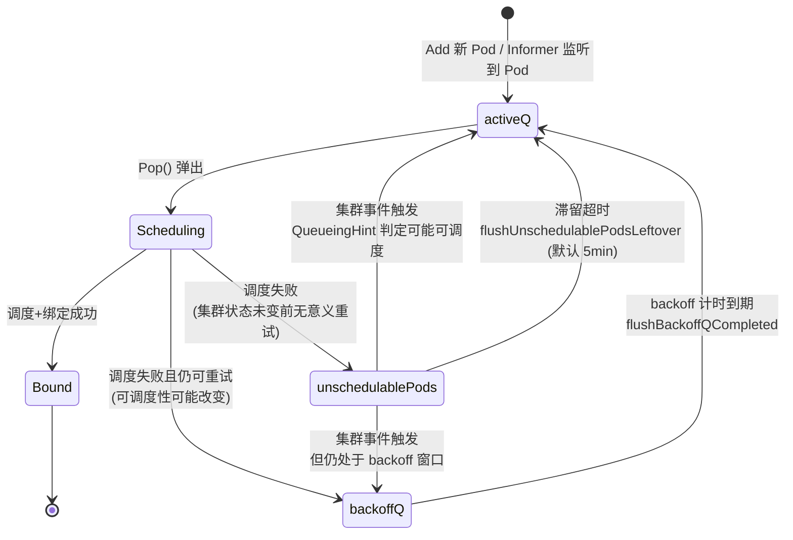
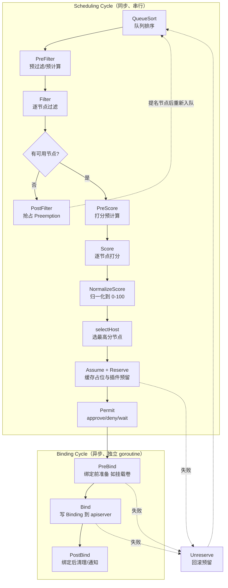

#kubernetes #scheduler #源码导读

相关笔记：[[scheduler-deep-dive#关键机制：Assume 与 Bind|Assume 与 Bind]] | [[scheduler-podgroup-source]] | [[gpu-scheduling]] | [[client-go-source]] | [[k8s-interview]] | [[k8s-development-roadmap]] | [[demo-scheduler-plugin]]

> 源码基线：本地 `kubernetes/kubernetes` commit `c59911870d6`（`v1.37.0-beta.0` 之后的开发版本），复核日期 2026-08-13。路径、签名和默认值在其他版本可能不同。

## 概述

本篇是 kube-scheduler 的源码导读笔记，聚焦 `kubernetes/kubernetes` 仓库下的 `pkg/scheduler` 包。kube-scheduler 从 v1.19 开始全面采用 **Scheduling Framework** 架构：调度逻辑被拆解为一系列有序的 **扩展点（Extension Point）**，每个扩展点上挂载若干 **Plugin**，整个调度流程由 framework 串联驱动。一次 Pod 的调度被划分为同步的 **scheduling cycle**（QueueSort → PreFilter → Filter → PostFilter → PreScore → Score → NormalizeScore → Assume → Reserve → Permit）和异步的 **binding cycle**（PreBind → Bind → PostBind）；其中 Assume 是 Scheduler 的框架动作，不是 Plugin 扩展点。scheduling cycle 串行执行保证调度决策的一致性，binding cycle 异步执行避免被慢速的 apiserver 写入拖累吞吐。待调度 Pod 经由 Informer 进入三级 **scheduling queue**（activeQ / backoffQ / unschedulablePods），由 `Scheduler.ScheduleOne` 逐个取出处理。本文按"调度器骨架 → 调度队列 → 扩展点流水线 → CycleState 数据传递 → Filter/Score 细节 → Assume/Reserve/Permit → 端到端实例走查 → 自定义插件开发"的顺序通读源码，并给出一个自定义 Score 插件的完整骨架。

## 一、调度器骨架：scheduler.go 与 ScheduleOne

kube-scheduler 的核心类型定义在 `pkg/scheduler/scheduler.go` 中的 `Scheduler` 结构体，其关键字段包括：

- `Cache`：`internalcache.Cache`，本地调度缓存，保存所有 Node 及其上 Pod 的快照（assume 机制依赖它）。
- `SchedulingQueue`：`internalqueue.SchedulingQueue`，三级调度队列。
- `Profiles`：`map[string]framework.Framework`，按 `schedulerName` 索引的 framework 实例，每个 profile 对应一套启用的插件。
- `nextPod`：从队列弹出下一个待调度 Pod 的函数。
- `client`：访问 apiserver 的 clientset。

调度器主循环由 `Scheduler.Run` 启动，核心是 `wait.UntilWithContext(ctx, sched.ScheduleOne, 0)`，即不停地调用 `ScheduleOne`。`ScheduleOne` 定义在 `pkg/scheduler/schedule_one.go`，是单次调度的入口，逻辑骨架如下：

```go
// pkg/scheduler/schedule_one.go（简化）
func (sched *Scheduler) ScheduleOne(ctx context.Context) {
    // 1. 从 activeQ 取出下一个 Pod；activeQ 为空时阻塞
    podInfo, err := sched.NextPod(logger)
    pod := podInfo.Pod

    // 2. 按 pod.Spec.SchedulerName 选出对应 profile（framework 实例）
    fwk, err := sched.frameworkForPod(pod)

    // 3. 执行同步的 scheduling cycle
    scheduleResult, assumedPodInfo, status :=
        sched.schedulingCycle(ctx, state, fwk, podInfo, start, podsToActivate)
    if !status.IsSuccess() {
        sched.FailureHandler(...)   // 失败：进入 backoffQ / unschedulablePods
        return
    }

    // 4. 异步执行 binding cycle（单独 goroutine）
    go func() {
        status := sched.bindingCycle(ctx, state, fwk, scheduleResult,
            assumedPodInfo, start, podsToActivate)
        if !status.IsSuccess() {
            sched.handleBindingCycleError(...)  // 失败：Unreserve + 重新入队
        }
    }()
}
```

关键点：**scheduling cycle 是串行的**（保证同一时刻只有一个 Pod 在做调度决策，避免对同一节点资源的并发误判），**binding cycle 在独立 goroutine 中异步执行**（绑定慢不会阻塞下一个 Pod 的调度）。两者之间靠 **assume**（写本地 cache）衔接——详见后文与 [[scheduler-deep-dive#关键机制：Assume 与 Bind|Assume 与 Bind]]。

## 二、Scheduling Queue：三级队列与状态流转

调度队列定义在 `pkg/scheduler/backend/queue/scheduling_queue.go`（旧版本路径为 `pkg/scheduler/internal/queue/`），实现类型为 `PriorityQueue`，内部有三个子结构：

| 队列 | 数据结构 | 作用 |
|------|----------|------|
| **activeQ** | 基于 `QueueSort` 插件比较函数的优先级 heap | 真正待调度的 Pod，`Pop()` 从这里取 |
| **backoffQ** | 按 backoff 到期时间排序的 heap | 调度失败的 Pod，退避一段时间后再回 activeQ，防止失败 Pod 高频空转 |
| **unschedulablePods** | map | 当前无法调度的 Pod，等待集群状态变化（QueueingHint 命中）才被"激活" |

三级队列的状态流转：



设计要点：

- **activeQ 的排序**由 `QueueSort` 插件决定（默认 `PrioritySort`：先比 `pod.Spec.Priority`，再比入队时间戳）。整个调度器只能启用一个 QueueSort 插件。
- **backoff** 采用指数退避（`podInitialBackoffDuration` 默认 1s，`podMaxBackoffDuration` 默认 10s），防止注定失败的 Pod 反复占用 CPU。
- **unschedulablePods → activeQ 的回流**由 **QueueingHint** 机制控制（KEP-4247）：插件声明自己关心哪些集群事件（如 `NodeAdd`、`PodDelete`），只有相关事件发生且 hint 返回 `Queue` 时，对应的 unschedulable Pod 才被移回 activeQ。这避免了"任何事件都把所有 Pod 重新入队"的惊群效应。
- `flushUnschedulablePodsLeftover` 是兜底：即便没有事件命中，滞留过久的 Pod 也会被强制移回，避免永久饿死。

## 三、Scheduling Framework 扩展点流水线

framework 的接口契约定义在 `pkg/scheduler/framework/interface.go`，每个扩展点对应一个 Go interface，插件按需实现一个或多个。完整流水线如下：



各扩展点职责与所属周期：

| 扩展点                | 周期         | 接口（interface.go）                      | 职责                                                            | 失败后果                                                   |
| ------------------ | ---------- | ------------------------------------- | ------------------------------------------------------------- | ------------------------------------------------------ |
| **QueueSort**      | 队列         | `QueueSortPlugin.Less`                | 决定 activeQ 中 Pod 顺序，全局唯一                                      | —                                                      |
| **PreFilter**      | Scheduling | `PreFilterPlugin.PreFilter`           | 预计算并写入 CycleState；可返回节点子集裁剪 Filter 范围                         | 返回 `Unschedulable`/`UnschedulableAndUnresolvable` 直接终止 |
| **Filter**         | Scheduling | `FilterPlugin.Filter`                 | 判断单个 Node 是否能放下该 Pod（等价旧 Predicates）                          | 该节点被剔除                                                 |
| **PostFilter**     | Scheduling | `PostFilterPlugin.PostFilter`         | Filter 后无可用节点时触发，默认实现是 `DefaultPreemption` 抢占                 | 抢占成功则提名节点，否则 Pod Unschedulable                         |
| **PreScore**       | Scheduling | `PreScorePlugin.PreScore`             | Score 前的共享数据预计算                                               | 终止调度周期                                                 |
| **Score**          | Scheduling | `ScorePlugin.Score`                   | 给单个 Node 打分（等价旧 Priorities），原始分范围由插件自定                        | 终止调度周期                                                 |
| **NormalizeScore** | Scheduling | `ScoreExtensions.NormalizeScore`      | 把本插件所有节点的原始分归一化到 `[0,100]`                                    | 终止调度周期                                                 |
| **Reserve**        | Scheduling | `ReservePlugin.Reserve` / `Unreserve` | 在选中节点上预留资源（如 PV 绑定占位）                                         | 触发所有插件的 `Unreserve` 回滚                                 |
| **Permit**         | Scheduling | `PermitPlugin.Permit`                 | 决定是否放行进入 binding：`approve` / `deny` / `wait(timeout)`         | `deny` 触发 Unreserve；`wait` 进入等待                        |
| **PreBind**        | Binding    | `PreBindPlugin.PreBind`               | 绑定前的实际操作，如把 PVC 绑到 PV                                         | 触发 Unreserve，Pod 重新入队                                  |
| **Bind**           | Binding    | `BindPlugin.Bind`                     | 调用 apiserver 创建 `Binding` 对象；多个 Bind 插件按序尝试，第一个不返回 `Skip` 的生效 | 触发 Unreserve                                           |
| **PostBind**       | Binding    | `PostBindPlugin.PostBind`             | 绑定成功后的清理/通知，纯 informational                                   | 无（不影响结果）                                               |

`framework.Status` 是贯穿所有扩展点的返回类型，常见 `Code`：`Success`、`Error`、`Unschedulable`（Pod 暂不可调度，集群变化后可重试）、`UnschedulableAndUnresolvable`（重试也无意义，跳过 PostFilter 抢占）、`Wait`、`Skip`。

## 四、Plugin Registry 与 Profiles

### 插件注册

所有内置插件通过 `Registry`（`map[string]PluginFactory`）注册。`pkg/scheduler/framework/plugins/registry.go` 中的 `NewInTreeRegistry()` 列出全部 in-tree 插件工厂：

```go
// pkg/scheduler/framework/plugins/registry.go（节选）
func NewInTreeRegistry() runtime.Registry {
    return runtime.Registry{
        noderesources.Name:       noderesources.NewFit,
        nodeaffinity.Name:        nodeaffinity.New,
        podtopologyspread.Name:   podtopologyspread.New,
        tainttoleration.Name:     tainttoleration.New,
        interpodaffinity.Name:    interpodaffinity.New,
        volumebinding.Name:       volumebinding.New,
        defaultbinder.Name:       defaultbinder.New,
        defaultpreemption.Name:   defaultpreemption.New,
        queuesort.Name:           queuesort.New,
        // ...
    }
}
```

`PluginFactory` 签名为 `func(ctx, args runtime.Object, handle framework.Handle) (framework.Plugin, error)`。`framework.Handle` 是插件访问调度器能力的入口（提供 `SnapshotSharedLister()`、`ClientSet()`、`SharedInformerFactory()`、`RunFilterPlugins()` 等）。

### KubeSchedulerConfiguration 与 Profiles

调度器行为由 `KubeSchedulerConfiguration` 配置，核心是 `profiles` 列表。一个 profile 对应一个 `schedulerName` 和一套插件启用/禁用配置：

```yaml
apiVersion: kubescheduler.config.k8s.io/v1
kind: KubeSchedulerConfiguration
profiles:
  # profile 1：默认调度器
  - schedulerName: default-scheduler
    plugins:
      score:
        enabled:
          - name: NodeResourcesBalancedAllocation
            weight: 2
        disabled:
          - name: ImageLocality          # 禁用某个内置插件
    pluginConfig:
      - name: NodeResourcesFit
        args:
          scoringStrategy:
            type: LeastAllocated
  # profile 2：自定义调度器，复用同一进程
  - schedulerName: my-gpu-scheduler
    plugins:
      filter:
        enabled:
          - name: MyGPUPlugin            # 自定义插件
      score:
        enabled:
          - name: MyGPUPlugin
```

要点：

- **一个 kube-scheduler 进程可以承载多个 profile**，Pod 通过 `spec.schedulerName` 选择走哪个 profile。它们共享同一个调度队列和缓存，但插件配置各异。
- `plugins.<extensionPoint>.enabled` / `disabled` 控制每个扩展点上的插件；`disabled` 中写 `"*"` 可关闭全部默认插件。
- `pluginConfig` 给插件传参（对应 `PluginFactory` 的 `args runtime.Object`），如 `NodeResourcesFit` 的 `scoringStrategy`。
- 每个 profile 在调度器初始化时被 `frameworkruntime.NewFramework`（`pkg/scheduler/framework/runtime/framework.go`）实例化为一个 `framework.Framework`，存入 `Scheduler.Profiles`。

## 五、CycleState：跨扩展点的数据传递

同一个 Pod 在一次调度周期内，多个扩展点之间需要共享数据（例如 PreFilter 算出的中间结果给 Filter 用）。framework 用 `CycleState`（`pkg/scheduler/framework/cycle_state.go`）承载这些数据，**每次调度周期 new 一个，周期结束即丢弃**。

```go
// pkg/scheduler/framework/cycle_state.go（简化）
type CycleState struct {
    storage     sync.Map           // key -> StateData
    recordPluginMetrics bool
}

type StateData interface {
    Clone() StateData              // Score 阶段并行读取时需要
}

func (c *CycleState) Write(key StateKey, val StateData) { c.storage.Store(key, val) }
func (c *CycleState) Read(key StateKey) (StateData, error) { ... }
```

典型用法——`InterPodAffinity` 插件在 PreFilter 里把"已存在 Pod 的拓扑统计"算好写入 CycleState，Filter/Score 阶段直接读取，避免对每个节点重复遍历全集群 Pod：

```go
// 插件自定义的 StateData
type preFilterState struct {
    topologyToMatchedTermCount topologyToMatchedTermCount
}
func (s *preFilterState) Clone() framework.StateData { /* 深拷贝 */ }

// PreFilter 阶段写入
func (pl *InterPodAffinity) PreFilter(ctx, state *framework.CycleState, pod *v1.Pod, ...) {
    s := computeState(pod)
    state.Write(preFilterStateKey, s)
    return nil, nil
}

// Filter 阶段读取
func (pl *InterPodAffinity) Filter(ctx, state *framework.CycleState, pod *v1.Pod, nodeInfo *framework.NodeInfo) *framework.Status {
    s, _ := state.Read(preFilterStateKey)
    // 用 s 做判断 ...
}
```

注意：Score 阶段是并行的，若多个 goroutine 读同一份 StateData 且会修改，需要靠 `Clone()` 隔离。读-only 场景可直接共用。

## 六、Filter 与 Score 细节

### NodeInfo 快照

调度决策不直接读 Informer cache，而是读一份 **snapshot**。`ScheduleOne` 在每个调度周期开始时通过 `sched.Cache.UpdateSnapshot()` 把内部 cache 物化成 `internalcache.Snapshot`（`pkg/scheduler/backend/cache/snapshot.go`），其中每个节点是一个 `framework.NodeInfo`，聚合了该节点的 `*v1.Node`、其上所有 Pod、已用资源（`Requested`）、可分配资源（`Allocatable`）、端口占用等。**整个调度周期内 snapshot 不变**，保证 Filter/Score 决策一致。

### Filter 流程与并行

Filter 阶段由 `findNodesThatPassFilters`（`schedule_one.go`）驱动，对 snapshot 中的所有节点逐个跑 `RunFilterPlugins`。关键优化：

- **并行**：通过 `framework.Parallelizer`（封装 `pkg/scheduler/framework/parallelize/parallelism.go` 的 `parallelize.Until`）把节点切成 chunk 并发跑 Filter，默认并行度由 `KubeSchedulerConfiguration.parallelism`（默认 16）控制。
- **提前停止**：找到 `numFeasibleNodesToFind` 个可用节点后即停止（大集群下不必过滤所有节点），该数量由 `percentageOfNodesToScore` 决定。
- **节点轮询起点**：用 `nextStartNodeIndex` 在不同调度周期间轮换起始下标，并按 zone 交错，使候选节点在拓扑上分布均匀。

```go
// findNodesThatPassFilters（简化）
checkNode := func(i int) {
    nodeInfo := nodes[(sched.nextStartNodeIndex + i) % len(nodes)]
    status := fwk.RunFilterPluginsWithNominatedPods(ctx, state, pod, nodeInfo)
    if status.IsSuccess() {
        feasibleNodes[idx] = nodeInfo  // 原子收集
    }
}
fwk.Parallelizer().Until(ctx, len(nodes), checkNode, ...)
```

### Score 流程与归一化

通过 Filter 的节点进入 `prioritizeNodes`：先跑 `PreScore`，再并行跑 `RunScorePlugins`。每个 Score 插件对每个节点返回一个原始分；之后调用该插件的 `NormalizeScore`（如果实现了 `ScoreExtensions`）把原始分映射到 `[0,100]`；最后按 profile 中配置的 **weight** 加权求和：

```
finalScore(node) = Σ  weight_i × normalizedScore_i(node)
                  i∈Score插件
```

`selectHost` 选出总分最高的节点；若有并列最高分，会在并列节点中**随机选一个**（避免热点，逻辑见 `selectHost` 的 reservoir sampling）。

## 七、Assume / Reserve / Permit：乐观绑定

选出目标节点后，进入 scheduling cycle 的尾声：

1. **Assume**：`sched.assume(assumedPod, host)` 把 Pod 的 `Spec.NodeName` 设为目标节点，并写入 `Scheduler.Cache`（`Cache.AssumePod`）。此后该节点的剩余资源在缓存里立即减去这个 Pod 的 request——**下一个 Pod 的调度立刻能看到最新状态，无需等 apiserver 确认**。这是调度器吞吐的关键，详见 [[scheduler-deep-dive#关键机制：Assume 与 Bind|Assume 与 Bind]]。
2. **Reserve**：调用所有 `ReservePlugin.Reserve`，登记插件自己的预留状态。典型如 `VolumeBinding` 插件在此把 PVC 与 PV 的绑定关系记入缓存。任意 Reserve 失败 → 已成功的插件全部 `Unreserve`，同时 `ForgetPod` 回滚 Assume。
3. **Permit**：调用所有 `PermitPlugin.Permit`，返回三种结果之一：
   - `approve`：放行，进入 binding cycle。
   - `deny`：拒绝，触发 Unreserve，Pod 重新入队。
   - `wait(timeout)`：Pod 进入 `waitingPods` 等待。常用于 **Gang Scheduling**——一组 Pod 互相等待，凑齐后由某个插件统一 `AllowWaitingPod` 放行，否则超时一起 deny。

assume 与 bind 的关系：assume 只动本地 cache（不持久化、非阻塞），bind 才真正写 apiserver。若 binding cycle 失败，`unreserveAndForget` 会先回滚 Reserve 插件，再通过 `Cache.ForgetPod` 撤销 assume。旧版本曾使用 assumed Pod TTL 做额外兜底；本笔记当前基线的 `backend/cache` 不再保存逐 Pod 的过期时间，因此不要把“默认 30s”当作跨版本事实。

## 八、端到端调度实例走查

前七节把扩展点逐个拆开讲了，这一节用具体场景把它们串成一条线。8.1 走一个普通 Pod 的常规调度，8.2 走一个用了 `WaitForFirstConsumer` 存储卷的 Pod——后者会看到调度器为什么得"管存储的事"。

### 8.1 普通 Pod 的端到端走查

#### 场景设定

集群 3 个 Node：

| Node | 总 CPU | 已用 CPU | label | 已有 `app=web` 的 Pod |
| :--- | :--- | :--- | :--- | :--- |
| node-a | 4 核 | 3.5 核 | `disktype=ssd` | 2 个 |
| node-b | 8 核 | 2 核 | `disktype=hdd` | 1 个 |
| node-c | 8 核 | 1 核 | `disktype=ssd` | 0 个 |

待调度的 Pod `web-4`：引用 `priorityClassName: high-priority`（value=1000），请求 `cpu: 2`，并带一条 **软** 反亲和（`preferredDuringScheduling`，`topologyKey=hostname`，selector `app=web`）——尽量别和其他 web Pod 挤同一台。

```yaml
spec:
  priorityClassName: high-priority      # 准入控制器把 pod.Spec.Priority 填成 1000
  containers:
  - name: app
    resources: { requests: { cpu: "2" } }
  affinity:
    podAntiAffinity:
      preferredDuringSchedulingIgnoredDuringExecution:
      - weight: 100
        podAffinityTerm:
          labelSelector: { matchLabels: { app: web } }
          topologyKey: kubernetes.io/hostname
```

#### 逐扩展点走查

**第 0 步 · activeQ 排序（QueueSort）**——`web-4` 经 Informer 进 activeQ。此刻队里还有个 `batch-job`（priority=0）。`PrioritySort.Less` 先比 `pod.Spec.Priority`：1000 > 0，`web-4` 排到队首。`ScheduleOne` 循环 `Pop()` 弹出 `web-4`，为它 `new` 一个 `CycleState`，流水线开始。

**第 1 步 · PreFilter（跑 1 次）**——只跟 Pod 自身有关的预计算，结果写进 CycleState：

- `NodeResourcesFit`：把 `web-4` 所有容器 request 加总 = CPU 2 核，写入 CycleState。
- `InterPodAffinity`：扫全集群，统计带 `app=web` 的 Pod 在各 hostname 的分布（a:2 / b:1 / c:0），写入 CycleState。

没有插件返回 `Unschedulable`，继续。

**第 2 步 · Filter（每个 Node 跑一次，跨 Node 并行）**——`Fit.Filter` 从 CycleState 读出"要 2 核"，做布尔判定：

| Node | 可用 CPU | 够 2 核？ | 结果 |
| :--- | :--- | :--- | :--- |
| node-a | 0.5 核 | ❌ | 淘汰 |
| node-b | 6 核 | ✅ | 通过 |
| node-c | 7 核 | ✅ | 通过 |

候选 Node 收缩为 `[node-b, node-c]`。软反亲和是 `preferred`，**不在 Filter 淘汰**，留给 Score。

**第 3 步 · PostFilter**——Filter 后候选非空，**抢占不触发**，跳过。（若候选为空，这里才跑 `DefaultPreemption`，去驱逐 priority 比 `web-4` 低的运行中 Pod。）

**第 4 步 · PreScore（跑 1 次）**——输入是已通过 Filter 的 `[node-b, node-c]`。`InterPodAffinity` 的 PreScore 基于这个候选集算反亲和打分要用的拓扑统计（b 上 1 个 web Pod、c 上 0 个），写入 CycleState。

**第 5 步 · Score + NormalizeScore（每个候选 Node 跑一次，并行）**——假设启用两个 Score 插件，归一化到 0-100：

| Node   | `NodeResourcesBalancedAllocation`<br/>（越空闲越高分） | `InterPodAffinity`<br/>（web Pod 越少越高分） |
| :----- | :--------------------------------------------- | :------------------------------------- |
| node-b | 调度后 50% 使用率 → 50                               | 已有 1 个 → 0                             |
| node-c | 调度后 37.5% 使用率 → 80                             | 已有 0 个 → 100                           |

**第 6 步 · 加权求和**——两插件 weight 均为 1：

```
node-b = 50×1 + 0×1   = 50
node-c = 80×1 + 100×1 = 180   ← 胜出
```

**第 7 步 · Assume → Reserve → Permit → Bind**——

1. `Assume`：`web-4.Spec.NodeName = node-c` 写进 Scheduler cache，并从 node-c 的可用资源视图中扣除 2 核，防止下一个 Pod 误判资源仍可用。
2. `Reserve`：运行 Reserve 插件；普通 CPU 不需要额外的插件私有预留，本例没有额外动作。
3. `Permit`：无 gang scheduling，直接 approve。
4. binding cycle（异步 goroutine）：`Bind` 向 apiserver 写 `Binding` 对象，kubelet 监听到后拉起容器。若 Bind 失败 → `Unreserve` 回滚插件状态、`ForgetPod` 回滚 Assume，`web-4` 回 backoffQ 重来。

#### 每步在「选什么」一览

| 步骤                  | 这步在选               | 本例结果                                     |
| :------------------ | :----------------- | :--------------------------------------- |
| activeQ 排序          | Pod 之间谁先调度         | `web-4`（prio 1000）先于 `batch-job`（prio 0） |
| PreFilter           | —（预计算存 CycleState） | 算出"要 2 核" + web Pod 拓扑分布                 |
| Filter              | 哪些 Node 能用（布尔淘汰）   | 淘汰 node-a，剩 b、c                          |
| PostFilter          | 候选为空才抢占            | 跳过                                       |
| PreScore            | —（基于候选集预计算）        | 算出反亲和拓扑统计                                |
| Score + 加权          | 哪个 Node 最好（打分）     | node-c 180 > node-b 50                   |
| Assume/Reserve/Bind | 缓存占位、插件预留并异步绑定 | `web-4` 落在 node-c                        |

一条线读下来能看清三个「选」的分工：**Priority 只在第 0 步决定 Pod 顺序；Filter 做布尔淘汰（能/不能）；Score 才是真正打分，且打给 Node 不是打给 Pod。**

### 8.2 用了 WaitForFirstConsumer 存储卷的 Pod

8.1 里 `web-4` 不带存储卷。一旦 Pod 引用了一个 `volumeBindingMode: WaitForFirstConsumer` 的 PVC，调度器还得多管一件事：**决定这块 PV 该在哪里创建**。这就是调度器为什么内置 `VolumeBinding` 插件。

#### 为什么调度器要管存储

存在一个鸡生蛋问题：

- PV 在哪个 AZ/Zone 创建 ← 取决于 Pod 调度到哪个 Node；
- Pod 调度到哪个 Node ← 取决于它的 PV 在哪个 AZ（得能挂上）。

`volumeBindingMode: Immediate`：PVC 一创建就立刻动态 provision PV（比如落在 AZ-a），调度器之后被迫只能把 Pod 调到 AZ-a；AZ-a 没资源就 Pod pending、死锁。

`volumeBindingMode: WaitForFirstConsumer`：把顺序倒过来——**先让调度器挑 Node，再在该 Node 所在 AZ 造 PV**。代价是挑 Node 时调度器必须把"卷能不能在这个 Node 满足"纳入决策。所以这段逻辑天然属于调度器，由 `VolumeBinding` 插件承担。

#### VolumeBinding 插件在各扩展点做什么

`VolumeBinding` 是个多扩展点插件（`framework.go` 插件注册表里的 `volumebinding.Name`），Pod 引用 `WaitForFirstConsumer` 的 PVC 时：

| 扩展点 | VolumeBinding 的动作 |
| :--- | :--- |
| **PreFilter** | 把 Pod 的 PVC 分两类：已绑定的（`pvc.Spec.VolumeName` 非空）当硬约束；未绑定的标记"待定"留给 Filter 逐 Node 试。 |
| **Filter** | 对每个候选 Node 判断"卷能否满足"：① 集群里有没有现成、未占用、拓扑允许在此 Node 用的 PV；② 没有的话，PVC 的 StorageClass 能不能在**这个 Node 的拓扑域**动态 provision。两条都不满足 → 该 Node 被淘汰。 |
| **Score**（可选） | `VolumeCapacityPriority` 特性开启时，给"能复用现成 PV / 容量更贴合"的 Node 加分，减少不必要的动态创建。 |
| **Reserve** | Node 选定后，把决策写进插件自己的 assume cache：复用的 PV 标记"已被预定"，待创建的记"待在某 AZ 造"。**此刻还没写 apiserver**，只内存占坑，让下一个抢同一 PV 的 Pod 在 Filter 阶段就能看到。 |
| **PreBind** | 真正落库：给待动态创建的 PVC 打上 `volume.kubernetes.io/selected-node: <node>` 注解 → external-provisioner sidecar 监听到，调 CSI `CreateVolume` 在该 Node 的 AZ 造盘、建 PV、完成绑定。`PreBind` **阻塞等待** PVC 变 `Bound` 才放行 `Bind`。 |
| **Unreserve** | PreBind 卷绑定失败/超时 → 清掉 Reserve 阶段的缓存占位，Pod 回 backoffQ 重来。 |

#### 整条时间线

```
PVC 创建 ────── 啥也不做，PVC 一直 Pending（这就是 "WaitForFirstConsumer" 的字面意思）
   │
Pod 创建并引用该 PVC
   │
调度器 ScheduleOne 取出 Pod
   ├─ PreFilter   VolumeBinding：分类 PVC（已绑 / 未绑）
   ├─ Filter      VolumeBinding：逐 Node 判断"卷在此 Node 能否满足"，淘汰不行的
   ├─ Score       （可选）倾向能复用现成 PV 的 Node
   ├─ Reserve     VolumeBinding：内存里假绑定 PV / 记下待造
   │              ── scheduling cycle 结束，转入异步 binding cycle ──
   └─ PreBind     VolumeBinding：给 PVC 打 selected-node 注解，
                  阻塞等 external-provisioner 在该 AZ 造出 PV、PVC 变 Bound
   ▼
Bind           Pod 绑到 Node，kubelet 挂卷、起容器
```

一句话：`WaitForFirstConsumer` 把"PV 在哪造"的决定权交给调度器——**Filter 让"卷能否满足"参与 Node 淘汰、Reserve 内存假绑定、PreBind 打 `selected-node` 注解触发 external-provisioner 在正确 AZ 真正造盘**。CSI 侧的配套见 [[csi-source]]。

## 九、自定义调度插件开发

### 实现 Plugin 接口

每个插件至少实现 `framework.Plugin`（只有一个 `Name()` 方法），再按需实现具体扩展点接口。下面是一个自定义 **Score 插件** 的完整骨架——它倾向于把 Pod 调度到带特定 label 的节点上：

```go
package myplugin

import (
    "context"
    "fmt"

    v1 "k8s.io/api/core/v1"
    "k8s.io/apimachinery/pkg/runtime"
    "k8s.io/kubernetes/pkg/scheduler/framework"
)

const Name = "MyPreferredLabelScore"

// MyScorePlugin 实现 framework.ScorePlugin
type MyScorePlugin struct {
    handle framework.Handle
}

// 编译期断言：确保接口被正确实现
var _ framework.ScorePlugin = &MyScorePlugin{}

// New 是 PluginFactory，注册时传入
func New(_ context.Context, _ runtime.Object, h framework.Handle) (framework.Plugin, error) {
    return &MyScorePlugin{handle: h}, nil
}

// Name 实现 framework.Plugin
func (pl *MyScorePlugin) Name() string { return Name }

// Score 对单个节点打分，返回原始分（范围由插件自定）
func (pl *MyScorePlugin) Score(ctx context.Context, state *framework.CycleState,
    pod *v1.Pod, nodeName string) (int64, *framework.Status) {

    nodeInfo, err := pl.handle.SnapshotSharedLister().NodeInfos().Get(nodeName)
    if err != nil {
        return 0, framework.NewStatus(framework.Error,
            fmt.Sprintf("get node %q: %v", nodeName, err))
    }

    // 业务逻辑：带 preferred=true 的节点给高分
    if nodeInfo.Node().Labels["scheduling.example.com/preferred"] == "true" {
        return 100, nil
    }
    return 0, nil
}

// ScoreExtensions 返回归一化扩展；不需要归一化可返回 nil
func (pl *MyScorePlugin) ScoreExtensions() framework.ScoreExtensions {
    return pl
}

// NormalizeScore 把本插件所有节点的原始分映射到 [0, framework.MaxNodeScore]
func (pl *MyScorePlugin) NormalizeScore(ctx context.Context, state *framework.CycleState,
    pod *v1.Pod, scores framework.NodeScoreList) *framework.Status {

    var highest int64
    for _, s := range scores {
        if s.Score > highest {
            highest = s.Score
        }
    }
    if highest == 0 {
        return nil // 全 0，无需归一化
    }
    for i := range scores {
        scores[i].Score = scores[i].Score * framework.MaxNodeScore / highest
    }
    return nil
}
```

若要实现 Filter 插件，则实现 `framework.FilterPlugin`：

```go
func (pl *MyFilterPlugin) Filter(ctx context.Context, state *framework.CycleState,
    pod *v1.Pod, nodeInfo *framework.NodeInfo) *framework.Status {
    if needGPU(pod) && nodeInfo.Node().Labels["accelerator"] == "" {
        return framework.NewStatus(framework.Unschedulable, "node has no GPU")
    }
    return nil // nil 等价于 Success
}
```

### 构建自定义调度器二进制

利用 `cmd/kube-scheduler/app` 包提供的 `NewSchedulerCommand`，用 `WithPlugin` 把自定义插件工厂注入 out-of-tree registry：

```go
// main.go
package main

import (
    "os"

    "k8s.io/component-base/cli"
    "k8s.io/kubernetes/cmd/kube-scheduler/app"

    "example.com/myscheduler/myplugin"
)

func main() {
    command := app.NewSchedulerCommand(
        app.WithPlugin(myplugin.Name, myplugin.New),
        // 可同时注册多个：app.WithPlugin(otherplugin.Name, otherplugin.New),
    )
    code := cli.Run(command)
    os.Exit(code)
}
```

编译出的二进制行为与原生 kube-scheduler 完全一致，只是多了可用的自定义插件。要让某个 profile 真正使用它，需在 `KubeSchedulerConfiguration` 的 `plugins` 里把它 `enabled`（见第四节示例）。

### 作为第二调度器部署

把自定义调度器作为集群中的 **第二个调度器** 运行（与 default-scheduler 共存），通常以 Deployment 部署在 `kube-system`，并通过 `--config` 挂载配置：

```yaml
apiVersion: kubescheduler.config.k8s.io/v1
kind: KubeSchedulerConfiguration
profiles:
  - schedulerName: my-gpu-scheduler        # 自定义调度器名
    plugins:
      filter:
        enabled: [{ name: MyGPUFilter }]
      score:
        enabled: [{ name: MyPreferredLabelScore, weight: 5 }]
leaderElection:
  leaderElect: true
  resourceName: my-gpu-scheduler           # 与 default 分开选主，避免冲突
  resourceNamespace: kube-system
```

业务 Pod 通过 `spec.schedulerName` 指定由它调度：

```yaml
apiVersion: v1
kind: Pod
metadata:
  name: gpu-job
spec:
  schedulerName: my-gpu-scheduler          # 不写则走 default-scheduler
  containers:
    - name: app
      image: nvidia/cuda:12.0-base
```

注意点：第二调度器必须用独立的 `leaderElection.resourceName`，否则会与 default-scheduler 抢同一把锁；多个调度器各自维护缓存与队列，若它们能调度到相同节点，理论上存在并发误判风险（生产中通常按节点 label / Pod schedulerName 划清边界）。相比之下，若只是新增插件而不需要独立进程，直接在默认调度器里多加一个 profile 更安全。GPU 相关的实际插件实践见 [[gpu-scheduling]]。

## 十、源码片段精读（K8s commit c59911870d6，Go 1.26）

下面把前文反复提到的关键函数定位到具体文件与行号，配合源码片段精读。所有路径相对仓库根 `kubernetes/kubernetes`，行号取自当前 master 分支。

### 10.1 调度主循环：`Scheduler.ScheduleOne`

```go
// 文件: pkg/scheduler/schedule_one.go:67-96
func (sched *Scheduler) ScheduleOne(ctx context.Context) {
    logger := klog.FromContext(ctx)
    podInfo, err := sched.NextPod(logger)
    if err != nil {
        utilruntime.HandleErrorWithLogger(logger, err, "Error while retrieving next pod from scheduling queue")
        return
    }
    // pod could be nil when schedulerQueue is closed
    if podInfo == nil || podInfo.Pod == nil {
        return
    }
    if sched.genericWorkloadEnabled && podInfo.Pod.Spec.SchedulingGroup != nil {
        podGroupInfo, err := sched.podGroupInfoForPod(ctx, podInfo)
        if err != nil {
            podFwk, err := sched.frameworkForPod(podInfo.Pod)
            if err != nil {
                klog.FromContext(ctx).Error(err, "Error occurred")
                sched.SchedulingQueue.Done(podInfo.Pod.UID)
                return
            }
            sched.FailureHandler(ctx, podFwk, podInfo, fwk.AsStatus(err), nil, time.Now())
            return
        }
        sched.scheduleOnePodGroup(ctx, podGroupInfo)
    } else {
        sched.scheduleOnePod(ctx, podInfo)
    }
}
```

要点：`ScheduleOne` 本身只做"取下一个 Pod、按是否为 `SchedulingGroup` 分流到 Pod 组调度或单 Pod 调度"两件事。普通 Pod 走 `scheduleOnePod`，那里才真正构造 `CycleState` 并触发 scheduling/binding cycle。Pod 组调度（gang scheduling 的内置雏形）是 1.30+ 引入的新分支，由 `SchedulingGroup` Spec 字段触发。

```go
// 文件: pkg/scheduler/schedule_one.go:99-148
func (sched *Scheduler) scheduleOnePod(ctx context.Context, podInfo *framework.QueuedPodInfo) {
    logger := klog.FromContext(ctx)
    pod := podInfo.Pod
    logger = klog.LoggerWithValues(logger, "pod", klog.KObj(pod))
    ctx = klog.NewContext(ctx, logger)
    logger.V(4).Info("About to try and schedule pod", "pod", klog.KObj(pod))

    fwk, err := sched.frameworkForPod(pod)
    if err != nil {
        logger.Error(err, "Error occurred")
        sched.SchedulingQueue.Done(pod.UID)
        return
    }
    if sched.skipPodSchedule(ctx, fwk, pod) {
        sched.SchedulingQueue.Done(pod.UID)
        return
    }

    start := time.Now()
    state := framework.NewCycleState()
    state.SetRecordPluginMetrics(rand.Intn(100) < pluginMetricsSamplePercent)

    podsToActivate := framework.NewPodsToActivate()
    state.Write(framework.PodsToActivateKey, podsToActivate)

    schedulingCycleCtx, cancel := context.WithCancel(ctx)
    defer cancel()

    scheduleResult, assumedPodInfo, status := sched.schedulingCycle(
        schedulingCycleCtx, state, fwk, podInfo, start, podsToActivate)
    if !status.IsSuccess() {
        sched.FailureHandler(schedulingCycleCtx, fwk, assumedPodInfo, status,
            scheduleResult.nominatingInfo, start)
        return
    }

    // bind the pod to its host asynchronously (we can do this b/c of the assumption step above).
    go sched.runBindingCycle(ctx, state, fwk, scheduleResult, assumedPodInfo, start, podsToActivate)
}
```

要点：`scheduleOnePod` 里能清晰看到三段式：先由 `frameworkForPod` 按 `pod.Spec.SchedulerName` 选 framework，再串行跑 `schedulingCycle`，最后用 `go sched.runBindingCycle(...)` 把 binding 异步丢给 goroutine。`state := framework.NewCycleState()` 是每个 Pod 一份的瞬时状态容器；`PodsToActivate` 用来让插件在调度过程中主动激活其他被压住的 Pod。

### 10.2 Scheduling Cycle：`Scheduler.schedulingCycle`

```go
// 文件: pkg/scheduler/schedule_one.go:175-198
func (sched *Scheduler) schedulingCycle(
    ctx context.Context,
    state fwk.CycleState,
    schedFramework framework.Framework,
    podInfo *framework.QueuedPodInfo,
    start time.Time,
    podsToActivate *framework.PodsToActivate,
) (ScheduleResult, *framework.QueuedPodInfo, *fwk.Status) {
    if err := sched.Cache.UpdateSnapshot(klog.FromContext(ctx), sched.nodeInfoSnapshot); err != nil {
        return ScheduleResult{nominatingInfo: clearNominatedNode}, podInfo, fwk.AsStatus(err)
    }

    scheduleResult, status := sched.schedulingAlgorithm(ctx, state, schedFramework, podInfo, start)
    if !status.IsSuccess() {
        return scheduleResult, podInfo, status
    }

    assumedPodInfo, status := sched.prepareForBindingCycle(ctx, state, schedFramework,
        podInfo, podsToActivate, scheduleResult)
    if !status.IsSuccess() {
        return ScheduleResult{nominatingInfo: clearNominatedNode}, assumedPodInfo, status
    }

    return scheduleResult, assumedPodInfo, nil
}
```

要点：scheduling cycle 在最开始通过 `Cache.UpdateSnapshot` 把缓存物化成 snapshot，**整个周期之后所有 Filter/Score 看到的节点状态都是这份不可变快照**。`schedulingAlgorithm` 内部跑 PreFilter/Filter/PostFilter/PreScore/Score 并选出 host；`prepareForBindingCycle` 内部按 Assume → Reserve → Permit 推进。

`schedulingAlgorithm` 内部对 `RunFilterPlugins` 的调用位于 `findNodesThatPassFilters`：

```go
// 文件: pkg/scheduler/schedule_one.go:776-862（节选）
func (sched *Scheduler) findNodesThatPassFilters(
    ctx context.Context,
    fwk framework.Framework,
    state fwk.CycleState,
    pod *v1.Pod,
    diagnosis *framework.Diagnosis,
    nodes []fwk.NodeInfo,
) ([]fwk.NodeInfo, error) {
    // ...
    checkNode := func(i int) {
        nodeInfo := nodes[(sched.nextStartNodeIndex+i)%len(nodes)]
        status := fwk.RunFilterPluginsWithNominatedPods(ctx, state, pod, nodeInfo)
        if status.Code() == framework.Error {
            errCh.SendErrorWithCancel(status.AsError(), cancel)
            return
        }
        if status.IsSuccess() {
            length := atomic.AddInt32(&feasibleNodesLen, 1)
            if length > numNodesToFind { /* 提前结束 */ cancel() } else { feasibleNodes[length-1] = nodeInfo }
        } else { /* 记录失败原因到 diagnosis */ }
    }
    fwk.Parallelizer().Until(ctx, len(nodes), checkNode, metrics.Filter)
    // ...
}
```

`RunFilterPluginsWithNominatedPods` 是包装层，处理"如果该节点有被抢占提名的 Pod，要先把它们加入 NodeInfo 再跑 Filter"的语义。真正的核心是下面的 `RunFilterPlugins`。

### 10.3 Binding Cycle：`Scheduler.bindingCycle`

```go
// 文件: pkg/scheduler/schedule_one.go:397-503（节选）
func (sched *Scheduler) bindingCycle(
    ctx context.Context,
    state fwk.CycleState,
    schedFramework framework.Framework,
    scheduleResult ScheduleResult,
    assumedPodInfo *framework.QueuedPodInfo,
    start time.Time,
    podsToActivate *framework.PodsToActivate) *fwk.Status {
    logger := klog.FromContext(ctx)
    assumedPod := assumedPodInfo.Pod

    // ...（PreBindPreFlight + 写 NominatedNodeName，1.32 之后的优化）

    // Run "permit" plugins.
    if status := schedFramework.WaitOnPermit(ctx, assumedPod); !status.IsSuccess() {
        if status.IsRejected() { /* 构造 FitError 返回 */ }
        return status
    }

    sched.SchedulingQueue.Done(assumedPod.UID)

    // Run "prebind" plugins.
    if status := schedFramework.RunPreBindPlugins(ctx, state, assumedPod, scheduleResult.SuggestedHost); !status.IsSuccess() {
        return status
    }

    // Run "bind" plugins.
    if status := sched.bind(ctx, schedFramework, assumedPod, scheduleResult.SuggestedHost, state); !status.IsSuccess() {
        return status
    }

    logger.V(2).Info("Successfully bound pod to node",
        "pod", klog.KObj(assumedPod), "node", scheduleResult.SuggestedHost)
    metrics.PodScheduled(schedFramework.ProfileName(), metrics.SinceInSeconds(start))

    // Run "postbind" plugins.
    schedFramework.RunPostBindPlugins(ctx, state, assumedPod, scheduleResult.SuggestedHost)
    return nil
}
```

要点：binding cycle 的顺序是 **WaitOnPermit → PreBind → Bind → PostBind**。`WaitOnPermit` 阻塞直到 Permit 阶段返回 `wait` 的所有插件都 approve 或 timeout，是 gang scheduling 的关键交汇点。注释里有一句很重要：**"Any failures after this point cannot lead to the Pod being considered unschedulable"**——`Permit` 是调度/绑定流程里最后一次能把 Pod 判定为 Unschedulable 的点，之后任何失败都会回到 backoffQ 而非 unschedulablePods。

### 10.4 Plugin 接口：`framework/interface.go`

注意：自 1.31 起 framework 的核心接口被搬到 staging 仓 `k8s.io/kube-scheduler/framework`（被 `pkg/scheduler/framework` 通过 `fwk "k8s.io/kube-scheduler/framework"` 重导出）。下面的源码位于 staging 路径，但等价于历史上 `pkg/scheduler/framework/interface.go` 的同名声明：

```go
// 文件: staging/src/k8s.io/kube-scheduler/framework/interface.go:435-438
// Plugin is the parent type for all the scheduling framework plugins.
type Plugin interface {
    Name() string
}
```

```go
// 文件: staging/src/k8s.io/kube-scheduler/framework/interface.go:540-565
type FilterPlugin interface {
    Plugin
    // Filter is called by the scheduling framework.
    // All FilterPlugins should return "Success" to declare that
    // the given node fits the pod. If Filter doesn't return "Success",
    // it will return "Unschedulable", "UnschedulableAndUnresolvable" or "Error".
    //
    // "Error" aborts pod scheduling and puts the pod into the backoff queue.
    //
    // For the node being evaluated, Filter plugins should look at the passed
    // nodeInfo reference for this particular node's information (e.g., pods
    // considered to be running on the node) instead of looking it up in the
    // NodeInfoSnapshot because we don't guarantee that they will be the same.
    Filter(ctx context.Context, state CycleState, pod *v1.Pod, nodeInfo NodeInfo) *Status
}
```

```go
// 文件: staging/src/k8s.io/kube-scheduler/framework/interface.go:606-626
// ScoreExtensions is an interface for Score extended functionality.
type ScoreExtensions interface {
    // NormalizeScore is called for all node scores produced by the same plugin's "Score"
    // method. A successful run of NormalizeScore will update the scores list and return
    // a success status.
    NormalizeScore(ctx context.Context, state CycleState, p *v1.Pod, scores NodeScoreList) *Status
}

// ScorePlugin is an interface that must be implemented by "Score" plugins to rank
// nodes that passed the filtering phase.
type ScorePlugin interface {
    Plugin
    // Score is called on each filtered node. It must return success and an integer
    // indicating the rank of the node. All scoring plugins must return success or
    // the pod will be rejected.
    Score(ctx context.Context, state CycleState, p *v1.Pod, nodeInfo NodeInfo) (int64, *Status)

    // ScoreExtensions returns a ScoreExtensions interface if it implements one, or nil if does not.
    ScoreExtensions() ScoreExtensions
}
```

要点：每个扩展点都是 `Plugin` 的"嵌入 + 一个方法"的组合。一个具体的插件 struct 可以同时实现多个扩展点接口——例如 `NodeResourcesFit` 同时是 `PreFilterPlugin`、`FilterPlugin`、`ScorePlugin`。`ScoreExtensions()` 返回 `nil` 表示该插件不需要 NormalizeScore，常用于 0/1 离散打分插件。

### 10.5 Framework 实现：`RunFilterPlugins` 与 `RunScorePlugins`

```go
// 文件: pkg/scheduler/framework/runtime/framework.go:1078-1111
func (f *frameworkImpl) RunFilterPlugins(
    ctx context.Context,
    state fwk.CycleState,
    pod *v1.Pod,
    nodeInfo fwk.NodeInfo,
) *fwk.Status {
    logger := klog.FromContext(ctx)
    verboseLogs := logger.V(4).Enabled()
    if verboseLogs {
        logger = klog.LoggerWithName(logger, "Filter")
    }

    for _, pl := range f.filterPlugins {
        if state.GetSkipFilterPlugins().Has(pl.Name()) {
            continue
        }
        ctx := ctx
        if verboseLogs {
            logger := klog.LoggerWithName(logger, pl.Name())
            ctx = klog.NewContext(ctx, logger)
        }
        if status := f.runFilterPlugin(ctx, pl, state, pod, nodeInfo); !status.IsSuccess() {
            if !status.IsRejected() {
                // Filter plugins are not supposed to return any status other than
                // Success or Unschedulable.
                status = fwk.AsStatus(fmt.Errorf("running %q filter plugin: %w", pl.Name(), status.AsError()))
            }
            status.SetPlugin(pl.Name())
            return status
        }
    }
    return nil
}
```

要点：`RunFilterPlugins` 是**单节点维度**的——对某个 nodeInfo 串行跑完所有 filter 插件，**任何一个返回 non-Success 就立即返回失败**（短路语义）。并行性发生在外层 `findNodesThatPassFilters` 的"跨节点"并行上，而不是"跨插件"并行。`state.GetSkipFilterPlugins()` 是 PreFilter 阶段可以填充的"本周期跳过这些 Filter 插件"的优化集合。

```go
// 文件: pkg/scheduler/framework/runtime/framework.go:1320-1427（节选）
func (f *frameworkImpl) RunScorePlugins(ctx context.Context, state fwk.CycleState, pod *v1.Pod, nodes []fwk.NodeInfo) (ns []fwk.NodePluginScores, status *fwk.Status) {
    // ... metrics setup ...
    allNodePluginScores := make([]fwk.NodePluginScores, len(nodes))
    plugins := make([]fwk.ScorePlugin, 0, numPlugins)
    pluginToNodeScores := make(map[string]fwk.NodeScoreList, numPlugins)
    for _, pl := range f.scorePlugins { /* 跳过 SkipScorePlugins，初始化 */ }

    // Run Score method for each node in parallel.
    f.Parallelizer().Until(ctx, len(nodes), func(index int) {
        nodeInfo := nodes[index]
        nodeName := nodeInfo.Node().Name
        for _, pl := range plugins {
            s, status := f.runScorePlugin(ctx, pl, state, pod, nodeInfo)
            if !status.IsSuccess() { /* 取消并报错 */ return }
            pluginToNodeScores[pl.Name()][index] = fwk.NodeScore{Name: nodeName, Score: s}
        }
    }, metrics.Score)

    // Run NormalizeScore method for each ScorePlugin in parallel.
    f.Parallelizer().Until(ctx, len(plugins), func(index int) {
        pl := plugins[index]
        if pl.ScoreExtensions() == nil { return }
        nodeScoreList := pluginToNodeScores[pl.Name()]
        if status := f.runScoreExtension(ctx, pl, state, pod, nodeScoreList); !status.IsSuccess() {
            /* 取消并报错 */
        }
    }, metrics.Score)

    // Apply score weight for each ScorePlugin in parallel, then build allNodePluginScores.
    f.Parallelizer().Until(ctx, len(nodes), func(index int) {
        nodePluginScores := fwk.NodePluginScores{Name: nodes[index].Node().Name, Scores: make([]fwk.PluginScore, len(plugins))}
        for i, pl := range plugins {
            weight := f.scorePluginWeight[pl.Name()]
            score := pluginToNodeScores[pl.Name()][index].Score
            if score > fwk.MaxNodeScore || score < fwk.MinNodeScore { /* 报错 */ }
            weightedScore := score * int64(weight)
            nodePluginScores.Scores[i] = fwk.PluginScore{Name: pl.Name(), Score: weightedScore}
            nodePluginScores.TotalScore += weightedScore
        }
        allNodePluginScores[index] = nodePluginScores
    }, metrics.Score)

    return allNodePluginScores, nil
}
```

要点：Score 阶段有**三轮并行**——(1) 每个节点上跑所有 Score 插件得原始分；(2) 每个 ScorePlugin 跑 `NormalizeScore` 把本插件结果映射到 `[0, 100]`；(3) 每个节点应用 `weight` 加权求和。`f.scorePluginWeight` 来自 `KubeSchedulerConfiguration.profiles[].plugins.score.enabled[].weight`。最终的 `TotalScore` 就是 `selectHost` 选最高分节点的依据。

### 10.6 内置插件实例：`NodeResourcesFit.Filter`

```go
// 文件: pkg/scheduler/framework/plugins/noderesources/fit.go:612-645
func (f *Fit) Filter(ctx context.Context, cycleState fwk.CycleState, pod *v1.Pod, nodeInfo fwk.NodeInfo) *fwk.Status {
    s, err := getPreFilterState(cycleState)
    if err != nil {
        return fwk.AsStatus(err)
    }

    var draManager fwk.SharedDRAManager
    if f.enableDRAExtendedResource {
        draManager = f.handle.SharedDRAManager()
    }

    opts := ResourceRequestsOptions{
        EnablePodLevelResources:   f.enablePodLevelResources,
        EnableDRAExtendedResource: f.enableDRAExtendedResource,
    }

    insufficientResources := fitsRequest(s, nodeInfo, f.ignoredResources, f.ignoredResourceGroups, draManager, opts)

    if len(insufficientResources) != 0 {
        failureReasons := make([]string, 0, len(insufficientResources))
        statusCode := fwk.Unschedulable
        for i := range insufficientResources {
            failureReasons = append(failureReasons, insufficientResources[i].Reason)
            if insufficientResources[i].Unresolvable {
                statusCode = fwk.UnschedulableAndUnresolvable
            }
        }
        return fwk.NewStatus(statusCode, failureReasons...)
    }
    return nil
}
```

要点：`Fit.Filter` 是教科书式的 Filter 插件实现——(1) `getPreFilterState` 从 `CycleState` 取出 PreFilter 阶段算好的"Pod 总 request"，避免每个节点重算；(2) `fitsRequest` 跑核心比对（CPU/内存/GPU/HugePage/扩展资源）；(3) 任何资源 `Unresolvable=true`（例如 Pod 请求的扩展资源该节点根本不提供）就把状态升级为 `UnschedulableAndUnresolvable`，让上层跳过 PostFilter 抢占。这是 Filter 阶段几乎所有"资源类"插件的模板。

### 10.7 Cache：`AssumePod` 与 `BindPod`

```go
// 文件: pkg/scheduler/backend/cache/cache.go:397-410
func (cache *cacheImpl) AssumePod(logger klog.Logger, pod *v1.Pod) error {
    key, err := framework.GetPodKey(pod)
    if err != nil {
        return err
    }

    cache.mu.Lock()
    defer cache.mu.Unlock()
    if _, ok := cache.podStates[key]; ok {
        return fmt.Errorf("pod %v(%v) is in the cache, so can't be assumed", key, klog.KObj(pod))
    }

    return cache.addPod(logger, pod, true)
}
```

要点：`AssumePod` 的核心是调用 `addPod(pod, assumePod=true)`——把 Pod 加进缓存里某节点的 NodeInfo，并立即扣减 `Requested`，让下一个 Pod 的 Filter/Score 看到的资源是已扣除的。`assumePod=true` 会同时在 `cache.assumedPods` 里登记，后续 BindPod 完成会从中移除；若 binding 失败则由 `ForgetPod` 回滚。如果同一 Pod 已经存在于缓存中（例如 informer 已经把绑定后的 Pod 同步进来），重复 assume 是非法的，直接报错。

```go
// 文件: pkg/scheduler/backend/cache/cache.go:903-913
func (cache *cacheImpl) BindPod(binding *v1.Binding) (<-chan error, error) {
    // Don't store anything in the cache, as the pod is already assumed, and in case of a binding failure, it will be forgotten.
    onFinish := make(chan error, 1)
    err := cache.apiDispatcher.Add(apicalls.Implementations.PodBinding(binding), fwk.APICallOptions{
        OnFinish: onFinish,
    })
    if fwk.IsUnexpectedError(err) {
        return onFinish, err
    }
    return onFinish, nil
}
```

要点：BindPod 之所以"什么都不存"是因为 assume 阶段已经把这份状态写进 cache 了，BindPod 只负责把 `Binding` 对象通过 `apiDispatcher` 异步写到 apiserver（1.32+ 引入的 APIDispatcher 抽象，便于把多个 apiserver 调用合批/限流）；`onFinish` channel 让 `bindingCycle` 可以等待 apiserver 确认。绑定失败时上层调 `ForgetPod`，把 assume 时增加的资源回滚出来。

### 10.8 PriorityQueue.Pop 与 activeQ/backoffQ 衔接

```go
// 文件: pkg/scheduler/backend/queue/scheduling_queue.go:1005-1012
// Pop removes the head of the active queue and returns it. It blocks if the
// activeQ is empty and waits until a new item is added to the queue. It
// increments scheduling cycle when a pod is popped.
// Note: This method should NOT be locked by the p.lock at any moment,
// as it would lead to scheduling throughput degradation.
func (p *PriorityQueue) Pop(logger klog.Logger) (*framework.QueuedPodInfo, error) {
    return p.activeQ.pop(logger)
}
```

`PriorityQueue.Pop` 是个轻封装，真正的阻塞与跨队列回退逻辑在 `activeQueue.unlockedPop`：

```go
// 文件: pkg/scheduler/backend/queue/active_queue.go:313-352（节选）
func (aq *activeQueue) unlockedPop(logger klog.Logger) (*framework.QueuedPodInfo, error) {
    var pInfo *framework.QueuedPodInfo
    for aq.queue.Len() == 0 {
        // backoffQPopper is non-nil only if SchedulerPopFromBackoffQ feature is enabled.
        // In case of non-empty backoffQ, try popping from there.
        if aq.backoffQPopper != nil && aq.backoffQPopper.lenBackoff() != 0 {
            break
        }
        // When the queue is empty, invocation of Pop() is blocked until new item is enqueued.
        if aq.closed {
            return nil, nil
        }
        aq.cond.Wait()
    }
    pInfo, err := aq.queue.Pop()
    if err != nil {
        if aq.backoffQPopper == nil {
            return nil, err
        }
        // Try to pop from backoffQ when activeQ is empty.
        pInfo, err = aq.backoffQPopper.popBackoff()
        if err != nil {
            return nil, err
        }
    }
    err = aq.unlockedMovePodToInFlight(pInfo)
    if err != nil {
        return aq.unlockedPop(logger) // duplicated, retry
    }
    return pInfo, nil
}
```

backoffQ → activeQ 的回流由后台 goroutine 推动，对应 `PriorityQueue.flushBackoffQCompleted`：

```go
// 文件: pkg/scheduler/backend/queue/scheduling_queue.go:968-981
func (p *PriorityQueue) flushBackoffQCompleted(logger klog.Logger) {
    p.lock.Lock()
    defer p.lock.Unlock()
    activated := false
    podsCompletedBackoff := p.backoffQ.popAllBackoffCompleted(logger)
    for _, pInfo := range podsCompletedBackoff {
        if added := p.moveToActiveQ(logger, pInfo, framework.BackoffComplete, true); added {
            activated = true
        }
    }
    if activated {
        p.activeQ.broadcast()
    }
}
```

要点：`flushBackoffQCompleted` 由 `PriorityQueue.Run` 在后台周期性触发（对齐到 backoff 时间窗口），把所有"退避已到期"的 Pod 批量搬回 activeQ 并广播条件变量，唤醒阻塞在 `Pop` 上的调度循环。`SchedulerPopFromBackoffQ` feature gate 启用后，activeQ 空时还可以直接从 backoffQ 借调一个 Pod（`backoffQPopper.popBackoff()`），进一步提高调度器在 backoff 风暴下的利用率。

## 十一、手写简化复现：50 行调度框架

为了把上一节的接口理顺，下面用 ~50 行 Go 代码做一个"教学版 scheduling framework"。它**不**真正调度 K8s Pod，只演示插件接口、Framework 串联、Filter 短路、Score 加权这几条核心机制：

```go
package miniframework

import (
    "context"
    "sort"
)

// ---------- 模型 ----------
type Pod struct{ Name string; CPURequest int }
type Node struct{ Name string; CPUFree int; Labels map[string]string }

// ---------- 插件接口 ----------
type Plugin interface{ Name() string }

type FilterPlugin interface {
    Plugin
    Filter(ctx context.Context, pod *Pod, node *Node) error // 返回 nil 表示通过
}

type ScorePlugin interface {
    Plugin
    Score(ctx context.Context, pod *Pod, node *Node) int64 // 原始分，范围由插件自定
}

// ---------- Framework ----------
type Framework struct {
    Filters []FilterPlugin
    Scores  []struct {
        P      ScorePlugin
        Weight int64
    }
}

// RunFilters 串行跑所有 filter 插件，任意一个失败立即短路（与 K8s 行为一致）。
func (f *Framework) RunFilters(ctx context.Context, pod *Pod, node *Node) error {
    for _, p := range f.Filters {
        if err := p.Filter(ctx, pod, node); err != nil {
            return err // 节点不可用
        }
    }
    return nil
}

// RunScores 对每个候选节点累加 weight*score，返回按总分降序的节点列表。
func (f *Framework) RunScores(ctx context.Context, pod *Pod, nodes []*Node) []*Node {
    type scored struct{ n *Node; s int64 }
    res := make([]scored, len(nodes))
    for i, n := range nodes {
        var total int64
        for _, sp := range f.Scores {
            total += sp.Weight * sp.P.Score(ctx, pod, n)
        }
        res[i] = scored{n, total}
    }
    sort.SliceStable(res, func(i, j int) bool { return res[i].s > res[j].s })
    out := make([]*Node, len(res))
    for i, r := range res { out[i] = r.n }
    return out
}

// Schedule 是一次完整调度：先 Filter，剩下的 Score，取最高分。
func (f *Framework) Schedule(ctx context.Context, pod *Pod, nodes []*Node) *Node {
    feasible := make([]*Node, 0, len(nodes))
    for _, n := range nodes {
        if f.RunFilters(ctx, pod, n) == nil {
            feasible = append(feasible, n)
        }
    }
    if len(feasible) == 0 { return nil }
    return f.RunScores(ctx, pod, feasible)[0]
}

// ---------- 示例插件 ----------
type CPUFit struct{}
func (CPUFit) Name() string { return "CPUFit" }
func (CPUFit) Filter(_ context.Context, pod *Pod, node *Node) error {
    if node.CPUFree < pod.CPURequest { return errInsufficient }
    return nil
}

type LabelScore struct{ Key, Value string }
func (LabelScore) Name() string { return "LabelScore" }
func (l LabelScore) Score(_ context.Context, _ *Pod, node *Node) int64 {
    if node.Labels[l.Key] == l.Value { return 100 }
    return 0
}

var errInsufficient = &Err{"insufficient cpu"}
type Err struct{ msg string }
func (e *Err) Error() string { return e.msg }
```

它和真实 framework 的对应关系：

| 教学版 | K8s 真实实现 |
|--------|--------------|
| `Plugin.Name()` | `fwk.Plugin.Name()`（`interface.go:436`） |
| `FilterPlugin.Filter(ctx, pod, node) error` | `fwk.FilterPlugin.Filter(ctx, state, pod, nodeInfo) *Status`（`interface.go:540`） |
| `ScorePlugin.Score → int64` | `fwk.ScorePlugin.Score → (int64, *Status)`（`interface.go:617`） |
| `Framework.RunFilters` 串行短路 | `frameworkImpl.RunFilterPlugins`（`framework.go:1078`） |
| `Framework.RunScores` 加权求和 | `frameworkImpl.RunScorePlugins`（`framework.go:1320`） |
| 单 `Schedule` 入口先 filter 再 score | `Scheduler.schedulingCycle` 内部的 `schedulingAlgorithm`（`schedule_one.go:256`） |
| 缺：CycleState、NormalizeScore、Reserve/Permit、并行 Until、snapshot、queue、assume/bind 异步化 |  完整 framework 才有 |

教学版省略的关键能力：**CycleState 跨扩展点共享**、**NormalizeScore 归一化**、**Reserve/Unreserve 回滚**、**Permit wait/deny**、**并行 + 提前停止**、**snapshot 一致性**、**assume + bind 异步衔接**。读完真实源码再回看这 50 行，会很清楚 K8s scheduler "多出来"的那些组件分别在解决什么工程问题。

完整可运行的真实自定义插件 demo 见 [[demo-scheduler-plugin]]：用真实 framework SDK 注册一个 `NodeLabelScore` 插件并作为第二调度器部署。

## 面试要点

**Q1: kube-scheduler 的 scheduling cycle 和 binding cycle 有什么区别？为什么这样拆？**

> [!question]- 参考答案（点击展开）
>
> scheduling cycle（QueueSort→...→Permit）是**同步串行**的，保证同一时刻只有一个 Pod 在做调度决策，避免对同一节点资源的并发误判；binding cycle（PreBind→Bind→PostBind）在**独立 goroutine 异步**执行。拆分的原因是 binding 涉及写 apiserver、挂载卷等慢操作，异步化后绑定慢不会阻塞下一个 Pod 的调度决策，靠 assume 机制衔接两者。

**Q2: Scheduling Framework 有哪些扩展点，分别属于哪个周期？**

> [!question]- 参考答案（点击展开）
>
> Scheduling cycle：QueueSort、PreFilter、Filter、PostFilter、PreScore、Score、NormalizeScore、Reserve、Permit。Binding cycle：PreBind、Bind、PostBind。此外 Reserve/PreBind/Bind 失败会触发 Unreserve 回滚。接口契约定义在 `pkg/scheduler/framework/interface.go`。

**Q3: 调度队列为什么要分三级？unschedulablePods 里的 Pod 怎么回到 activeQ？**

> [!question]- 参考答案（点击展开）
>
> activeQ 是真正待调度的优先级 heap；backoffQ 放调度失败、退避中的 Pod，做指数退避防止失败 Pod 空转；unschedulablePods 放当前无法调度的 Pod。回流靠 QueueingHint：插件声明关心哪些集群事件（NodeAdd、PodDelete 等），只有相关事件发生且 hint 判定"可能可调度"时才把对应 Pod 移回 activeQ，避免惊群；另有 `flushUnschedulablePodsLeftover`（默认 5min）兜底防饿死。

**Q4: 插件之间如何跨扩展点传递数据？**

> [!question]- 参考答案（点击展开）
>
> 通过 `CycleState`（`pkg/scheduler/framework/cycle_state.go`），每次调度周期 new 一个、结束即丢弃。插件定义实现了 `StateData` 接口的结构体，PreFilter/PreScore 阶段 `Write` 进去，Filter/Score 阶段 `Read` 出来。典型如 InterPodAffinity 在 PreFilter 算好拓扑统计，避免每个节点重复遍历全集群 Pod。Score 并行场景下需要 `Clone()` 隔离。

**Q5: Filter 和 Score 阶段如何保证大集群下的性能？**

> [!question]- 参考答案（点击展开）
>
> 调度决策基于一份不变的 snapshot（`internalcache.Snapshot`，每个节点是 `NodeInfo`）。Filter 用 `Parallelizer` 并行（默认 parallelism=16），并在找到足够数量可用节点后提前停止（由 `percentageOfNodesToScore` 决定），节点轮询起点在周期间轮换并按 zone 交错。Score 也并行，最终分 = Σ(weight × 归一化分)，并列最高分随机选一个。

**Q6: assume 机制是什么？和 bind 什么关系？**

> [!question]- 参考答案（点击展开）
>
> assume 是把选中的 Pod 在 `Scheduler.Cache` 里"乐观地"标记为已绑定到目标节点（`Cache.AssumePod`），立即扣减该节点缓存里的剩余资源，让下一个 Pod 的调度不必等 apiserver 确认。bind 才真正写 `Binding` 对象到 apiserver。binding 失败时 `unreserveAndForget` 回滚插件状态并撤销 assume；不要把旧版本的 assumed Pod TTL 默认值当作当前稳定契约。

**Q7: Permit 扩展点的 wait 有什么用？**

> [!question]- 参考答案（点击展开）
>
> Permit 可返回 approve / deny / wait(timeout)。`wait` 让 Pod 进入 waitingPods 等待，主要用于 Gang Scheduling——一组 Pod 互相等待，凑齐后由插件统一 `AllowWaitingPod` 放行，否则超时一起 deny。批调度框架（如 Coscheduling、Volcano 思路）就基于这个扩展点实现。

**Q8: 怎么开发并部署一个自定义调度插件？**

> [!question]- 参考答案（点击展开）
>
> 实现 `framework.Plugin` 加具体扩展点接口（如 `ScorePlugin`/`FilterPlugin`），写一个 `PluginFactory`（`New` 函数）。用 `app.NewSchedulerCommand` + `app.WithPlugin` 注入插件、编译出自定义调度器二进制。然后在 `KubeSchedulerConfiguration` 的某个 profile 里 `enabled` 该插件。可作为第二调度器部署（独立 `leaderElection.resourceName`），Pod 通过 `spec.schedulerName` 选择；若无需独立进程，直接给默认调度器加一个 profile 更安全。

**Q9: 一个 kube-scheduler 进程能跑多个调度器吗？**

> [!question]- 参考答案（点击展开）
>
> 能。`KubeSchedulerConfiguration.profiles` 可配置多个 profile，每个 profile 一个 `schedulerName` 和一套插件配置，对应 `Scheduler.Profiles` 里一个 `framework.Framework` 实例。它们共享同一调度队列与缓存，Pod 靠 `spec.schedulerName` 路由到对应 profile。这是比"部署多个调度器进程"更轻量、更不易出错的多调度策略方案。

**Q10: Framework Plugin 和 Scheduler Extender 怎么选？**

> [!question]- 参考答案（点击展开）
>
> Framework Plugin 是进程内 Go 代码，覆盖全部扩展点、性能好，但要重新编译调度器；Extender 是 HTTP webhook，只能扩展 Filter/Score/Bind，有网络延迟和单点风险，但无需改调度器代码。生产环境深度定制优先 Framework Plugin，Extender 仅用于对接遗留系统或轻量扩展。

**Q11: PreFilter / PreScore 和 Filter / Score 是什么关系？为什么要拆出 Pre 阶段？**

> [!question]- 参考答案（点击展开）
>
> Filter / Score 是**逐 Node 跑**的（Filter 跑 N 次、Score 跑 M 次，且跨 Node 并行）；PreFilter / PreScore 每个调度周期只跑 1 次。凡是只跟 Pod 自身有关、与具体 Node 无关的计算，放进 Pre 阶段算一次、`Write` 进 CycleState，Filter / Score 直接 `Read`，把"每 Node 重复"降为"每 Pod 一次"。典型：`NodeResourcesFit` 在 PreFilter 把容器 request 加总成"Pod 总需求"；`InterPodAffinity` 在 PreFilter 算好全集群拓扑统计。PreFilter 还能返回 `Unschedulable` 直接终止周期，或裁剪 Node 子集；PreScore 的输入是"已通过 Filter 的 Node 集"。

**Q12: Reserve 扩展点是干什么的？和 Assume 有什么区别？**

> [!question]- 参考答案（点击展开）
>
> Assume 是 Scheduler 框架动作，先把 Pod 的 `Spec.NodeName` 写进 `Scheduler.Cache` 并立即扣减该 Node 缓存里的剩余资源。随后 Reserve 扩展点让插件登记自己的预留状态，并提供失败时的 `Unreserve` 回滚钩子；最典型的使用者是 `VolumeBinding`，在此预留 PV。两者都属于“绑定前在内存占坑”，但一个维护 Scheduler 的 Pod/Node 资源账本，一个维护插件私有状态；Reserve 或后续阶段失败时还要 `ForgetPod` 回滚 Assume。

**Q13: `volumeBindingMode: WaitForFirstConsumer` 下调度器做了什么？**

> [!question]- 参考答案（点击展开）
>
> 它把"PV 在哪个 AZ 创建"的决定权交给调度器，解决 PV 与 Pod 跨 AZ 的鸡生蛋问题。调度器内置的 `VolumeBinding` 插件在多个扩展点接管：PreFilter 分类 PVC（已绑/未绑）；Filter 逐 Node 判断"现成 PV 能否复用 / StorageClass 能否在该 Node 拓扑域动态 provision"，不满足就淘汰该 Node；Reserve 在内存里假绑定 PV；PreBind 给待创建的 PVC 打 `volume.kubernetes.io/selected-node` 注解，触发 external-provisioner 在选中 Node 的 AZ 真正造盘，并阻塞等 PVC 变 `Bound` 才放行 Bind。对比 `Immediate`——PVC 一创建就造 PV，反过来把 Pod 锁死在某个 AZ。
