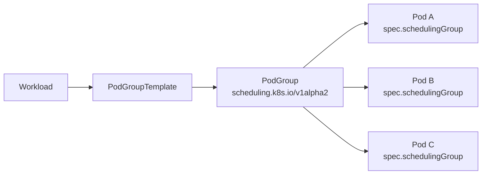
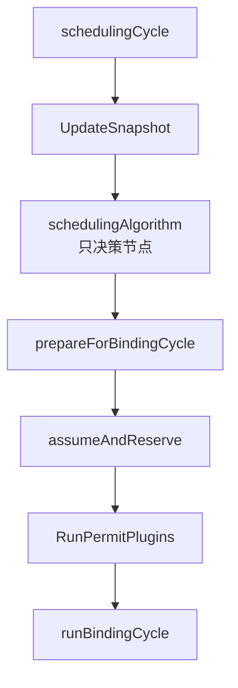
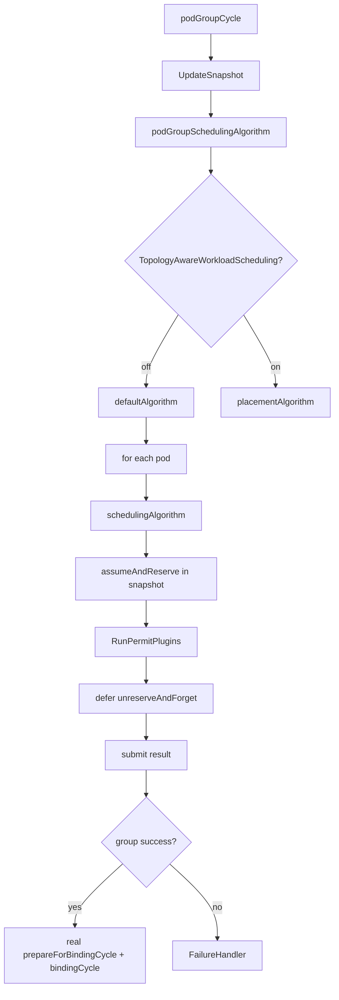

#kubernetes #scheduler #podgroup #gang-scheduling #源码导读

相关笔记：[[scheduler-framework-source]] | [[scheduler-deep-dive#关键机制：Assume 与 Bind|Assume 与 Bind]] | [[volcano-source]] | [[gpu-scheduling-source]] | [[k8s-development-roadmap]] | [[demo-scheduler-plugin]]

## 概述

本篇是 kube-scheduler PodGroup 调度的学习路径，基于 Kubernetes `v1.36.1` 源码。它适合接在 [[scheduler-framework-source]] 之后阅读：先理解单 Pod 的 `ScheduleOne -> schedulingCycle -> bindingCycle`，再看 1.36 引入的 GenericWorkload / PodGroup / GangScheduling 如何把调度单位从「一个 Pod」扩展到「一组 Pod」。

先纠正两个容易从二手文章里带入的误差：

1. `v1.36.1` 的 API 是 `scheduling.k8s.io/v1alpha2`，不是 `v1alpha3`。`Pod.Spec.SchedulingGroup` 在 core/v1，指向同 namespace 下的 PodGroup。
2. `v1.36.1` 的入口仍是 `sched.NextPod()`，不是最终抽象形态的 `NextEntity()`。真实代码是在 `ScheduleOne` 里发现 Pod 带 `spec.schedulingGroup` 后，通过 `podGroupInfoForPod()` 把同组未调度 Pod 从队列里捞出来，再进入 `scheduleOnePodGroup()`。

这些特性在 1.36 仍是 Alpha 方向，关键门控包括 `GenericWorkload`、`GangScheduling`、`TopologyAwareWorkloadScheduling`、`WorkloadAwarePreemption`。关掉 `GenericWorkload` 后，调度器仍退化为原来的单 Pod 世界。

## 学习路径

### 0. 前置知识

- 读完 [[scheduler-framework-source]] 的 `ScheduleOne`、调度队列、Reserve / Permit、binding cycle。
- 读完 [[scheduler-deep-dive#关键机制：Assume 与 Bind|Assume 与 Bind]]，搞清 assume 只写调度器内存，bind 才写 API Server。
- 对比 [[volcano-source]]，知道 gang scheduling 为什么需要「全有或全无」。

### 1. API 与 FeatureGate

| 主题 | 位置 |
|------|------|
| PodGroup / Workload API | `staging/src/k8s.io/api/scheduling/v1alpha2/types.go` |
| Pod 的 SchedulingGroup 字段 | `pkg/apis/core/types.go` |
| FeatureGate 清理逻辑 | `pkg/api/pod/util.go` |
| Gang 插件注册名 | `pkg/scheduler/framework/plugins/names/names.go` |

重点看三层对象：

- `Workload`：上层工作负载视角，包含最多 8 个 `PodGroupTemplate`。
- `PodGroup`：运行时调度组，`Spec.SchedulingPolicy` 决定 Basic 还是 Gang。
- `Pod.Spec.SchedulingGroup`：Pod 到 PodGroup 的引用，字段不可变。



### 2. 单 Pod 主链路重构

| 函数 | 位置 | 看点 |
|------|------|------|
| `ScheduleOne` | `pkg/scheduler/schedule_one.go:65` | 单 Pod / PodGroup 分派 |
| `schedulingCycle` | `pkg/scheduler/schedule_one.go:180` | 刷新快照、决策、落地分离 |
| `prepareForBindingCycle` | `pkg/scheduler/schedule_one.go:200` | `assumeAndReserve` 后再 Permit |
| `unreserveAndForget` | `pkg/scheduler/schedule_one.go:361` | PodGroup 模拟态从 snapshot 回滚 |
| `bindingCycle` | `pkg/scheduler/schedule_one.go:396` | `PreBindPreFlight`、提前 `Done()`、prebind 抢占保护 |

1.36 的重构核心不是「调度算法变了」，而是把老的大函数拆成可复用积木：



为什么要拆？因为 PodGroup 模拟整组时，需要对每个 Pod 复用 `schedulingAlgorithm` 和 `assumeAndReserve`，但不能马上进入真实 Permit / Bind。

### 3. PodGroup 入口

| 函数 | 位置 | 看点 |
|------|------|------|
| `scheduleOnePodGroup` | `pkg/scheduler/schedule_one_podgroup.go:45` | 整组调度入口 |
| `frameworkForPodGroup` | `pkg/scheduler/schedule_one_podgroup.go:82` | 组内 Pod 必须同一个 `schedulerName` |
| `podGroupInfoForPod` | `pkg/scheduler/schedule_one_podgroup.go:121` | 从 PodGroupState 拿同组 unscheduled Pods |
| `PopSpecificPod` | `pkg/scheduler/backend/queue/scheduling_queue.go:1014` | 从队列里捞同组 Pod |

`v1.36.1` 的真实入口：

```text
ScheduleOne
  ├─ NextPod() -> QueuedPodInfo
  ├─ if GenericWorkload && pod.spec.schedulingGroup != nil
  │    ├─ podGroupInfoForPod()
  │    │    ├─ Cache.PodGroupStates().Get(namespace, podGroupName)
  │    │    └─ SchedulingQueue.PopSpecificPod(otherPods)
  │    └─ scheduleOnePodGroup()
  └─ else scheduleOnePod()
```

这说明 1.36.1 还不是一个完全泛化的 `NextEntity()` 队列模型，而是在单 Pod 队列模型上叠了一层 PodGroup 聚合逻辑。学习时按真实代码记，不要把设计稿或文章伪代码当源码事实。

### 4. 整组算法：在 snapshot 里模拟

| 函数 | 位置 | 看点 |
|------|------|------|
| `podGroupCycle` | `pkg/scheduler/schedule_one_podgroup.go:221` | 刷新快照、跑算法、按需整组抢占、提交结果 |
| `podGroupSchedulingAlgorithm` | `pkg/scheduler/schedule_one_podgroup.go:769` | 按 TopologyAwareWorkloadScheduling 分派 |
| `podGroupSchedulingDefaultAlgorithm` | `pkg/scheduler/schedule_one_podgroup.go:352` | 按顺序调度组内 Pod |
| `podGroupPodSchedulingAlgorithm` | `pkg/scheduler/schedule_one_podgroup.go:404` | 单个成员的决策 + 临时 assume |
| `submitPodGroupAlgorithmResult` | `pkg/scheduler/schedule_one_podgroup.go:495` | 可行 Pod 进入真实绑定周期，其余打回队列 |

默认算法的关键语义：

1. 使用同一份 `nodeInfoSnapshot`。
2. 按 `QueuedPodGroupInfo.QueuedPodInfos` 的稳定顺序处理成员。
3. 每个 Pod 先跑标准 `schedulingAlgorithm`。
4. 成功后调用 `assumeAndReserve` 临时占位，让后面的 Pod 能看到前面的 Pod 已经占资源。
5. 用 `defer revertFn()` 在整组算法结束时统一撤销模拟占位。
6. 只有整组结果成功时，`submitPodGroupAlgorithmResult` 才把每个 Pod 切回普通 cycle state，并进入真实 `prepareForBindingCycle`。



`unreserveAndForget` 的分支是整组模拟的根基：

- 普通单 Pod：`Cache.ForgetPod()`，回滚真实调度缓存。
- PodGroup 模拟阶段：`nodeInfoSnapshot.ForgetPod()`，只撤销快照里的临时占位，并恢复被 assume 清掉的 nominated 信息。

### 5. GangScheduling 插件

| 函数 | 位置 | 看点 |
|------|------|------|
| `GangScheduling.PreEnqueue` | `pkg/scheduler/framework/plugins/gangscheduling/gangscheduling.go:119` | PodGroup 不存在或可见 Pod 不够 `MinCount` 时拒绝入队 |
| `GangScheduling.Permit` | `pkg/scheduler/framework/plugins/gangscheduling/gangscheduling.go:158` | 已调度数不足 `MinCount` 时等待，凑齐后 Allow 全组 |
| `EventsToRegister` | `pkg/scheduler/framework/plugins/gangscheduling/gangscheduling.go:73` | PodAdd / PodGroupAdd 可能让 gang 重新入队 |

`v1.36.1` 里没有 `PlacementFeasible` 扩展点；gang 的强制点主要是 `PreEnqueue` 和 `Permit`：

- `PreEnqueue` 管入队前：PodGroup 不存在，或 gang 策略下同组 Pod 总数小于 `MinCount`，就返回 `UnschedulableAndUnresolvable`。
- `Permit` 管绑定前：调度 / assume 后的 Pod 数小于 `MinCount`，返回 `Wait`，默认等 5 分钟；凑齐后调用 waiting pod 的 `Allow()`。

绑定阶段还要 Permit 的原因：整组算法只是规划期，真实绑定是多个 Pod 各自进入异步 binding cycle。Permit 是执行期的闸门，防止只绑定一部分 Pod。

### 6. Topology-aware placement 与 workload-aware preemption

拓扑感知源码入口：

| 函数 / 接口 | 位置 |
|-------------|------|
| `podGroupSchedulingPlacementAlgorithm` | `pkg/scheduler/schedule_one_podgroup.go:650` |
| `findBestPlacement` | `pkg/scheduler/schedule_one_podgroup.go:718` |
| `PlacementGeneratePlugin` | `staging/src/k8s.io/kube-scheduler/framework/interface.go:764` |
| `PlacementScorePlugin` | `staging/src/k8s.io/kube-scheduler/framework/interface.go:789` |
| `TopologyPlacement` | `pkg/scheduler/framework/plugins/topologyaware/topology_placement.go` |

开启 `TopologyAwareWorkloadScheduling` 后，整组算法多了一层 placement 搜索：生成候选 placement，在每个 placement 上跑整组模拟，撤销后换下一个；多个方案都可行时，用 `PlacementScore` 选最优。

整组抢占源码入口：

| 函数 | 位置 | 看点 |
|------|------|------|
| `runWorkloadAwarePreemption` | `pkg/scheduler/schedule_one_podgroup.go:255` | 备份快照、跑 PodGroupPostFilter、还原快照 |
| `DefaultPreemption.PodGroupPostFilter` | `pkg/scheduler/framework/plugins/defaultpreemption/default_preemption.go:467` | 默认整组抢占实现 |

注意限制：`v1.36.1` 中如果 PodGroup 带 topology scheduling constraints，workload-aware preemption 会直接返回不支持。这是 Alpha 特性常见的组合限制。

## 源码阅读顺序

1. `schedule_one.go:65`：看 `ScheduleOne` 如何路由到 PodGroup。
2. `schedule_one_podgroup.go:121`：看 `podGroupInfoForPod` 如何聚合同组 Pod。
3. `schedule_one_podgroup.go:221`：看整组 cycle 的主干。
4. `schedule_one_podgroup.go:352`：看默认整组算法如何逐个 Pod 模拟。
5. `schedule_one.go:361`：看 `unreserveAndForget` 为什么区分 snapshot 和真实 cache。
6. `gangscheduling.go:119` / `:158`：看 gang 的两个强制点。
7. `schedule_one_podgroup.go:650`：再看 topology-aware placement。
8. `schedule_one_podgroup.go:255`：最后看 workload-aware preemption。

## 与 Volcano 的对比

| 维度 | kube-scheduler 1.36 PodGroup | Volcano |
|------|------------------------------|---------|
| 成熟度 | Alpha，默认关闭 | 面向 batch / HPC / AI 的成熟调度器 |
| 主循环 | 仍以 `ScheduleOne` 为入口，PodGroup 是扩展路径 | 每个 `schedule-period` 开一个 Session |
| 原子性手段 | snapshot 模拟 + Permit 闸门 | Statement 批量 Commit / Discard |
| gang 表达 | `PodGroup.Spec.SchedulingPolicy.Gang.MinCount` | `PodGroup.minMember / minResources` |
| 插件体系 | Scheduling Framework 扩展点 | Session Action + Plugin 回调表 |
| 适用心智 | 把原生 scheduler 扩到 workload-aware | 独立 batch scheduler |

结论：1.36 的 PodGroup 是原生 kube-scheduler 往 batch / AI 训练场景靠拢的一步，但不是 Volcano 的等价替代。面试时可以说清楚：原生方案的优势是和 Scheduling Framework、DRA、Preemption、Autoscaler 生态收敛；Volcano 的优势是 batch 语义更完整、队列 / 公平 / 回收能力更成熟。

## 动手练习

1. 在本地 Kubernetes 源码执行：

```bash
git checkout v1.36.1
rg -n "func \\(sched \\*Scheduler\\) ScheduleOne|scheduleOnePodGroup|podGroupSchedulingDefaultAlgorithm|GangScheduling" pkg/scheduler
```

2. 手画一张图：`ScheduleOne -> podGroupInfoForPod -> podGroupCycle -> podGroupSchedulingDefaultAlgorithm -> submitPodGroupAlgorithmResult`。
3. 修改 `GangScheduling.Permit` 的日志级别或 message，跑对应单测理解 `Wait / Allow`。
4. 写一个最小 PodGroup YAML，明确标出：

```yaml
apiVersion: scheduling.k8s.io/v1alpha2
kind: PodGroup
spec:
  schedulingPolicy:
    gang:
      minCount: 3
```

5. 对照 [[volcano-source]]，回答同一个分布式训练任务在原生 PodGroup 和 Volcano 里分别怎么保证 gang。

## 面试要点

### Q: Kubernetes 1.36 的 PodGroup 是什么？解决什么问题？

> [!question]- 参考答案（点击展开）
>
> PodGroup 是 `scheduling.k8s.io/v1alpha2` 的 Alpha API，用来表达一组 Pod 的调度语义。它解决分布式训练、MPI、Spark 等 workload 的「全有或全无」诉求：组内至少 `MinCount` 个 Pod 同时可调度并通过 Permit，才允许进入绑定。

### Q: 1.36.1 的调度入口是不是 `NextEntity()`？

> [!question]- 参考答案（点击展开）
>
> 不是。`v1.36.1` 真实代码仍是 `sched.NextPod()`。如果 Pod 开启 `GenericWorkload` 且带 `spec.schedulingGroup`，`ScheduleOne` 调 `podGroupInfoForPod()` 聚合同组未调度 Pod，再进入 `scheduleOnePodGroup()`。`NextEntity()` 更像后续演进方向或文章里的抽象化描述。

### Q: PodGroup 调度为什么要把 `schedulingAlgorithm` 和 `prepareForBindingCycle` 拆开？

> [!question]- 参考答案（点击展开）
>
> 因为整组调度需要先规划，不能边规划边真实绑定。`schedulingAlgorithm` 只算节点；`assumeAndReserve` 可以在 snapshot 里临时占位；整组成功后才调用真实 `prepareForBindingCycle` 进入 Permit / Bind。这个拆分让单 Pod 和 PodGroup 复用同一套 Filter / Score / Reserve / Permit / Bind 逻辑。

### Q: `unreserveAndForget` 在 PodGroup 场景为什么不能直接 `Cache.ForgetPod()`？

> [!question]- 参考答案（点击展开）
>
> PodGroup 规划阶段的 assume 只是快照模拟，不应该污染真实 scheduler cache。`state.IsPodGroupSchedulingCycle()` 为 true 时，`unreserveAndForget` 只从 `nodeInfoSnapshot` 撤销 Pod，并恢复 nominated 信息；普通单 Pod 才从真实 cache 里 forget。

### Q: gang scheduling 在 1.36.1 由哪些扩展点保证？

> [!question]- 参考答案（点击展开）
>
> 主要是 `PreEnqueue` 和 `Permit`。`PreEnqueue` 防止 PodGroup 不存在或可见 Pod 数小于 `MinCount` 的 Pod 进入 activeQ；`Permit` 在绑定前卡住各 Pod，直到已 assume / scheduled 的同组 Pod 达到 `MinCount`，再 Allow 所有 waiting pod。

### Q: TopologyAwareWorkloadScheduling 做了什么？

> [!question]- 参考答案（点击展开）
>
> 它把整组调度从「单个隐式 placement」升级为「多个候选 placement」。插件先生成 placement，调度器在每个 placement 上跑整组模拟，找出可行方案；多个方案都可行时再用 PlacementScore 选最优。典型场景是要求整组 Pod 落在同一个 rack / zone 等拓扑域。

### Q: WorkloadAwarePreemption 和普通抢占有什么差异？

> [!question]- 参考答案（点击展开）
>
> 普通抢占是单 Pod PostFilter。Workload-aware preemption 用 `PodGroupPostFilter`，先备份 snapshot，假设移除一批 victim 后重新跑整组算法，确认整组可行后再让 Pod 带 nominated 信息回队列等待抢占完成。它评估的是整组可行性，不是单个 Pod 的可行性。

### Q: 原生 PodGroup 是否可以替代 Volcano？

> [!question]- 参考答案（点击展开）
>
> 不能简单替代。原生 PodGroup 是 1.36 Alpha，优势是和 kube-scheduler 原生框架收敛；Volcano 是独立 batch scheduler，Session / Action / Plugin、Queue、公平、回收、Job 语义更成熟。生产选择取决于是否需要完整 batch 调度能力，而不是只看 gang。
