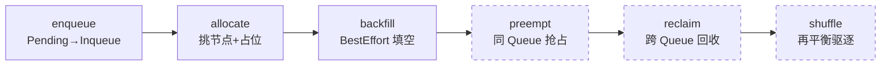
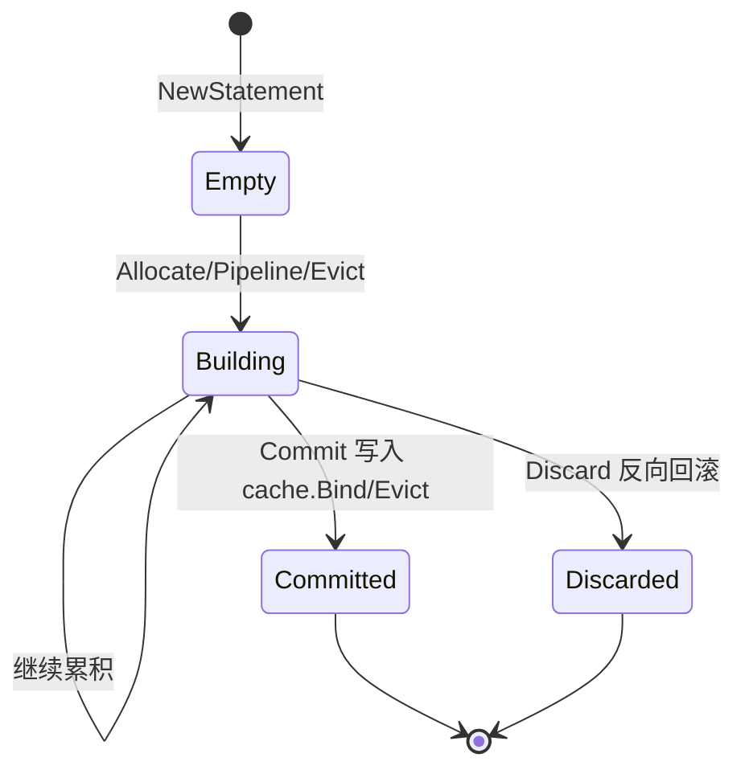
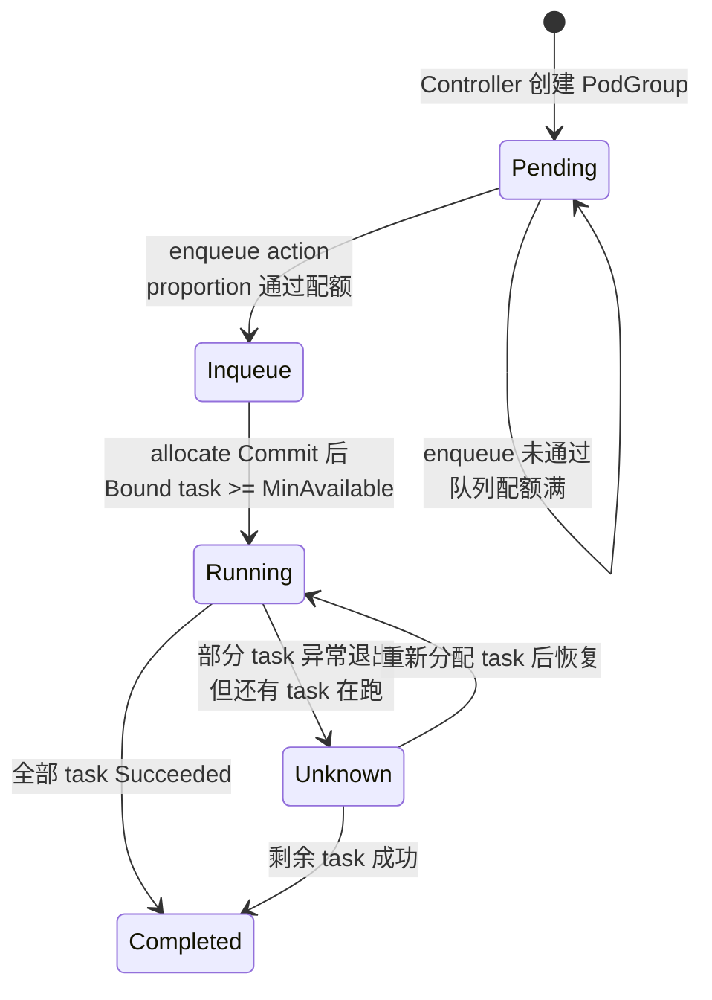
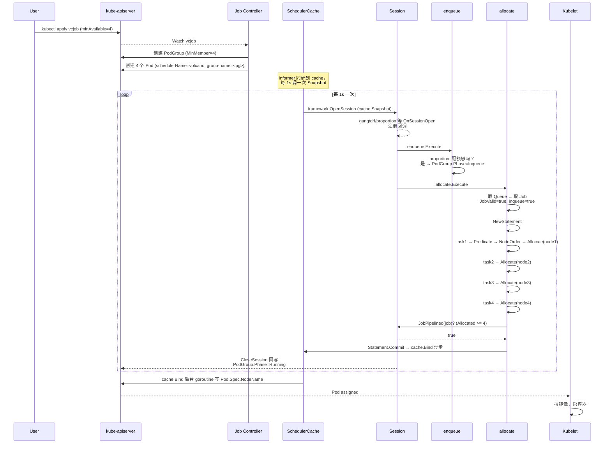
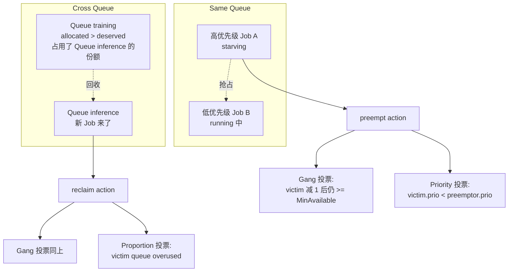

#kubernetes #scheduler #volcano #ai-infra #源码导读

相关笔记：[[scheduler-framework-source]] | [[scheduler-deep-dive#关键机制：Assume 与 Bind|Assume 与 Bind]] | [[gpu-scheduling]] | [[gpu-scheduling-source]] | [[hami-source]] | [[k8s-development-roadmap]] | [[demo-scheduler-plugin]]

## 概述

本篇是 Volcano 调度器的源码导读笔记，聚焦 `github.com/volcano-sh/volcano` 仓库下的 `pkg/scheduler` 和 `pkg/controllers` 两个目录。Volcano 是 CNCF 孵化项目，定位是 Kubernetes **batch scheduler**，面向 AI 训练、HPC、Spark/MPI/Ray 等"成组任务"场景。它和默认 `kube-scheduler` 最大的语义差异在于：kube-scheduler 是 **per-Pod、事件驱动**（`Scheduler.ScheduleOne` 逐 Pod 处理，详见 [[scheduler-framework-source]]），Volcano 则是 **per-Session、周期驱动**——每隔 `schedule-period`（默认 1s）打一次集群快照，开一个 `Session`，在 Session 内顺序执行多个 **Action**（`enqueue → allocate → backfill`，可选 `preempt → reclaim → shuffle`），每个 Action 通过 **Plugin** 注册的回调函数（约 30 张回调表，如 `JobOrderFn / JobReadyFn / PreemptableFn / OverusedFn`）做决策。**Session + Action + Plugin** 是理解 Volcano 的三个核心抽象。

Volcano 调度的最小单位不是 Pod，而是 **PodGroup**（Gang Scheduling 的载体）和 **Job**（多角色批任务）。Pod 通过 `scheduling.k8s.io/group-name` 注解关联到 PodGroup，PodGroup 的 `minMember` / `minResources` 决定"这一组 Pod 要不要、能不能调度"。整个调度执行链路用 `Statement`（类似 SQL 事务）批量 `Allocate / Pipeline / Evict`，最后整体 `Commit` 或 `Discard`，保证 Gang 语义下的原子性。

本文按"架构总览 → Scheduler 主循环 → Session/Snapshot → Action 流水线 → Plugin 体系 → Gang/DRF/Proportion 源码精读 → Statement 事务 → PodGroup 状态机 → Controller 链路 → 端到端走查 → 抢占与回收 → 自定义 Plugin 开发 → 踩坑/排查"通读源码，并给出一个 Volcano 自定义 Plugin 的完整骨架。所有源码位置基于 volcano-sh/volcano master 分支（2026 年 5 月），关键文件的行号可能随版本漂移，但函数名稳定。

## 一、架构总览：和 kube-scheduler 的差异

Volcano 完全不复用 kube-scheduler 的 Scheduling Framework，而是自己实现了一套并行的调度框架。两者关键差异：

| 维度 | kube-scheduler | Volcano |
|------|----------------|---------|
| 调度粒度 | 单个 Pod | PodGroup / Job |
| 驱动方式 | 事件驱动（activeQ Pop） | 周期驱动（默认 1s 一次 Session） |
| 决策结构 | Framework + Extension Point + Plugin | Session + Action + Plugin（回调注册） |
| 假定（assume）机制 | Cache.AssumePod 单 Pod | Statement 批量 Allocate/Pipeline/Evict，整体 Commit/Discard |
| 排序粒度 | QueueSort 单全局优先级 | JobOrder / QueueOrder / TaskOrder / SubJobOrder 多级 |
| 队列语义 | 弱（只是 activeQ heap） | 强（Queue CRD + Proportion/Capacity 配额 + DRF 公平） |
| 抢占 | PostFilter 扩展点 | preempt action（同 Queue）+ reclaim action（跨 Queue） |
| 多调度器共存 | `pod.spec.schedulerName` 路由 | 同上，默认 schedulerName=`volcano` |

下图是 Volcano 组件全景：

```mermaid
flowchart TD
    U[用户提交 vcjob/PodGroup/Pod] --> A[kube-apiserver]
    A --> JC[Job Controller<br/>pkg/controllers/job]
    A --> PGC[PodGroup Controller<br/>pkg/controllers/podgroup]
    JC -->|创建 PodGroup + Pods| A
    PGC -->|为原生 Pod 兜底创建 PodGroup| A

    A --> Inf[Informer]
    Inf --> SC[SchedulerCache<br/>pkg/scheduler/cache]
    SC -->|Snapshot 深拷贝| Sess[Session<br/>每个 schedule-period 一次]

    subgraph Session 内顺序执行
        Sess --> Enq[enqueue action]
        Enq --> Alloc[allocate action]
        Alloc --> BF[backfill action]
        BF --> Pre[preempt action 可选]
        Pre --> Rec[reclaim action 可选]
    end

    Sess -.|OpenSession 时| Plug[Plugins<br/>gang/drf/proportion/priority/predicates/nodeorder/...]
    Plug -.|注册回调到 Session| Sess

    Alloc -->|Statement.Commit| SC
    SC -->|cache.Bind 异步| A
    A --> Kubelet
```

注意三点：

- **Snapshot**（`cache.Snapshot`）每个 Session 一份独立深拷贝，Session 内的所有决策都基于这份快照，避免周期内集群变化扰动决策。
- **Plugin 不直接执行调度**，它们在 `OnSessionOpen` 时把自己的回调函数（`JobReadyFn / PreemptableFn / NodeOrderFn / OverusedFn` 等）注册到 Session 的对应表里；Action 在执行时调用 `ssn.JobReady(job)` 等语义化方法，内部会按 Tier 顺序遍历回调，按"全部通过"或"任一拒绝"等策略汇总结果。
- **Statement 是 Volcano 版的 assume**：Action 在 Session 内的所有 Allocate/Pipeline/Evict 都是先记到 Statement 里，只有 Gang 满足时才 `Commit`（真正写 Cache 并触发 bind），否则 `Discard` 回滚——这是 Gang Scheduling 原子性的关键。

## 二、Scheduler 主循环：scheduler.go 与 runOnce

入口在 `cmd/scheduler/main.go`，做的只有三件事：解析 flags、跑 leader election、调 `app.Run(s)`。关键的副作用是 `_ "volcano.sh/volcano/pkg/scheduler/actions"` 和 `_ "volcano.sh/volcano/pkg/scheduler/plugins"` 两个空白导入，触发各 action / plugin 在 init 函数里调 `framework.RegisterAction()` 和 `framework.RegisterPluginBuilder()`。

`pkg/scheduler/scheduler.go` 里的 `Scheduler` 结构体字段：

```go
// pkg/scheduler/scheduler.go（简化）
type Scheduler struct {
    cache          schedcache.Cache       // 本地缓存 + informer
    actions        []framework.Action     // 启用的 actions，顺序敏感
    plugins        []conf.Tier            // Tier1 / Tier2 / ... 分层 plugin
    configurations []conf.Configuration   // plugin 级 arguments
    schedulePeriod time.Duration          // 默认 1s
    fileWatcher    filewatcher.FileWatcher
}
```

`Scheduler.Run` 启动主循环：

```go
// pkg/scheduler/scheduler.go（简化）
func (pc *Scheduler) Run(stopCh <-chan struct{}) {
    pc.loadSchedulerConf()      // 从 ConfigMap 或文件读 actions+tiers+configurations
    go pc.watchSchedulerConf(stopCh)
    pc.cache.SetMetricsConf(pc.metricsConf)
    pc.cache.Run(stopCh)        // 启 informer，灌满本地 cache
    pc.cache.WaitForCacheSync(stopCh)

    // 核心：每隔 schedulePeriod 跑一次 runOnce
    go wait.Until(pc.runOnce, pc.schedulePeriod, stopCh)
}

func (pc *Scheduler) runOnce() {
    actions := pc.actions
    plugins := pc.plugins
    configurations := pc.configurations

    ssn := framework.OpenSession(pc.cache, plugins, configurations)
    defer framework.CloseSession(ssn)

    for _, action := range actions {
        actionStartTime := time.Now()
        action.Execute(ssn)
        metrics.UpdateActionDuration(action.Name(), metrics.Duration(actionStartTime))
    }
}
```

关键点：

- **`schedulePeriod` 默认 1 秒**，在 `cmd/scheduler/app/options/options.go` 里定义为 `defaultSchedulerPeriod = time.Second`，可以用 `--schedule-period` 改。这意味着 Volcano 不是事件驱动——一个 Pod 创建后，最坏需要等 1 秒才进入下一轮 Session。
- **actions/plugins 在每次 runOnce 开始时拷贝**，所以 ConfigMap 改完不需要重启，下一周期自动生效（`watchSchedulerConf` 监听文件变化）。
- **OpenSession/CloseSession 是 Session 的生命周期边界**，所有 Statement 写入要么在 CloseSession 之前 Commit，要么因 panic 自动 Discard。

默认配置在 `pkg/scheduler/util.go` 的 `DefaultSchedulerConf`：

```yaml
actions: "enqueue, allocate, backfill"
tiers:
  - plugins:
      - name: priority
      - name: gang
      - name: conformance
  - plugins:
      - name: overcommit
      - name: drf
      - name: predicates
      - name: proportion
      - name: nodeorder
```

只有显式打开 `preempt` 和 `reclaim` 才会有抢占——这是新手最常踩的坑：默认 actions 不包含 preempt，高优先级任务不会自动抢占低优先级。

## 三、Session 与 Snapshot：每周期一份独立视图

Session 是 Volcano 调度的"工作台"，定义在 `pkg/scheduler/framework/session.go`：

```go
// pkg/scheduler/framework/session.go（精简）
type Session struct {
    UID types.UID

    // 集群视图（来自 cache.Snapshot 的深拷贝）
    Jobs       map[JobID]*JobInfo
    Nodes      map[string]*NodeInfo
    NodeList   []*NodeInfo
    Queues     map[QueueID]*QueueInfo
    HyperNodes map[string]*HyperNodeInfo

    // 配置
    Tiers          []conf.Tier
    Configurations []conf.Configuration
    plugins        map[string]Plugin

    // ~30 张回调表，由 plugins 在 OnSessionOpen 时注册
    jobOrderFns       map[string]api.CompareFn
    queueOrderFns     map[string]api.CompareFn
    taskOrderFns      map[string]api.CompareFn
    predicateFns      map[string]api.PredicateFn
    nodeOrderFns      map[string]api.NodeOrderFn
    preemptableFns    map[string]api.EvictableFn
    reclaimableFns    map[string]api.EvictableFn
    overusedFns       map[string]api.ValidateFn
    jobReadyFns       map[string]api.ValidateFn
    jobPipelinedFns   map[string]api.ValidateFn
    jobValidFns       map[string]api.ValidateExFn
    jobEnqueueableFns map[string]api.ValidateFn
    jobStarvingFns    map[string]api.ValidateFn
    // ...
}
```

`openSession` 的关键逻辑（`framework/session.go:166`）：

```go
func openSession(cache schedcache.Cache) *Session {
    ssn := &Session{ UID: uuid.NewUUID(), cache: cache, /* ... */ }
    cache.OnSessionOpen(ssn)
    snapshot := cache.Snapshot()      // 深拷贝整套集群视图
    ssn.Jobs = snapshot.Jobs
    ssn.Nodes = snapshot.Nodes
    ssn.Queues = snapshot.Queues
    // ... 灌进 Session
    return ssn
}
```

`SchedulerCache.Snapshot`（`pkg/scheduler/cache/cache.go:1467`）做了完整的 deep-copy：每个 NodeInfo、JobInfo、PodGroup 都是独立副本。一次 Snapshot 在中型集群（几千节点、上万 Pod）通常占几百毫秒，是 Volcano 单 Session 的主要开销。

`framework.OpenSession`（`framework/framework.go:34`）在 openSession 之上注入 plugins：

```go
func OpenSession(cache schedcache.Cache, tiers []conf.Tier, configurations []conf.Configuration) *Session {
    ssn := openSession(cache)
    ssn.Tiers = tiers
    ssn.Configurations = configurations

    for _, tier := range tiers {
        for _, plg := range tier.Plugins {
            if pb, found := GetPluginBuilder(plg.Name); found {
                plugin := pb(plg.Arguments)
                ssn.plugins[plg.Name] = plugin
                onSessionOpenStart := time.Now()
                plugin.OnSessionOpen(ssn)   // plugin 在这里注册回调
                metrics.UpdatePluginDuration(plg.Name, OnSessionOpen, time.Since(onSessionOpenStart))
            }
        }
    }
    return ssn
}
```

**Tier 是优先级层**：Tier 1 的 plugin 先注册，回调按 Tier 顺序遍历。许多语义化方法（如 `ssn.PredicateForAllocateAction`）采用"短路"逻辑——Tier 1 拒绝就不再问 Tier 2。这给了"硬约束（gang/priority）放 Tier 1，软约束（drf/proportion/nodeorder）放 Tier 2"的分层语义。

`CloseSession`（`framework/framework.go:61`）做收尾：

```go
func CloseSession(ssn *Session) {
    for _, plg := range ssn.plugins {
        plg.OnSessionClose(ssn)     // gang 在这里打印 starving job 告警
    }
    closeSession(ssn)               // session.go:552，回写 PodGroup phase、刷脏 job
}
```

## 四、Action 流水线

`pkg/scheduler/actions/factory.go` 在 init 时注册所有 action：`enqueue / allocate / backfill / preempt / reclaim / shuffle`。每个 action 实现接口：

```go
// pkg/scheduler/framework/interface.go
type Action interface {
    Name() string
    Initialize()
    Execute(ssn *Session)
    UnInitialize()
}
```



虚线框表示**默认不启用**，需要在 ConfigMap 显式加入 `actions:` 列表。

### 4.1 enqueue：把 Pending PodGroup 改为 Inqueue

`pkg/scheduler/actions/enqueue/enqueue.go:30`：

```go
// 精简
func (e *Action) Execute(ssn *framework.Session) {
    queues := util.NewPriorityQueue(ssn.QueueOrderFn)   // proportion/drf 决定队列顺序
    jobsMap := map[QueueID]*util.PriorityQueue{}

    for _, job := range ssn.Jobs {
        if job.PodGroup.Status.Phase == scheduling.PodGroupPending {
            // 入队列
        }
    }

    for { // 轮流从每个 queue 取 job
        queue := queues.Pop()
        job := jobsMap[queue.UID].Pop()
        if job.PodGroup.Spec.MinResources == nil || ssn.JobEnqueueable(job) {
            job.PodGroup.Status.Phase = scheduling.PodGroupInqueue
            ssn.Jobs[job.UID] = job
        }
    }
}
```

`ssn.JobEnqueueable(job)` 投票给 `jobEnqueueableFns`，**proportion plugin 在这里把关**：检查 `queue.allocated + queue.inqueue + job.MinResources <= realCapability`，防止 Inqueue Job 总量超出队列配额。

设计意图：Inqueue 是个"入场券"。一个 PodGroup 必须先被 enqueue action 改为 Inqueue，allocate action 才会考虑它。这一层是**队列配额的入口控制点**，能避免大量 Pending Job 在 allocate 阶段反复尝试浪费 CPU。

### 4.2 allocate：核心调度循环

`pkg/scheduler/actions/allocate/allocate.go:122`：

```go
func (alloc *Action) Execute(ssn *framework.Session) {
    queues, jobsByQueue, tasksNoHardTopology := alloc.buildAllocateContext(ssn)
    alloc.allocateResources(queues, jobsByQueue, ssn)
}

// allocate.go:240 allocateResources（精简到只剩骨架）
func (alloc *Action) allocateResources(queues, jobsByQueue, ssn) {
    for !queues.Empty() {
        queue := queues.Pop()
        if ssn.Overused(queue) { continue }       // proportion: allocated > deserved
        jobs := jobsByQueue[queue.UID]
        if jobs.Empty() { continue }
        job := jobs.Pop()
        if !ssn.JobValid(job).Pass { continue }   // gang: ValidTaskNum >= MinAvailable
        if job.PodGroup.Status.Phase != scheduling.PodGroupInqueue { continue }

        stmt := framework.NewStatement(ssn)
        alloc.allocateForJob(stmt, job, ssn)

        if ssn.JobPipelined(job) {
            stmt.Commit()           // gang ready 才提交
        } else {
            stmt.Discard()          // 否则整组回滚
        }

        queues.Push(queue)          // 队列回插，下一轮继续
    }
}
```

`allocateForJob`（`allocate.go:350`）的核心：

```go
for !tasks.Empty() {
    task := tasks.Pop()
    predicateNodes, fitErrors := predicateHelper.PredicateNodes(task, allNodes, ssn.PredicateForAllocateAction, true)
    if len(predicateNodes) == 0 { continue }
    nodeScores, _ := util.PrioritizeNodes(task, predicateNodes, ssn.BatchNodeOrderFn, ssn.NodeOrderMapFn, ssn.NodeOrderReduceFn)
    node := util.SelectBestNodeAndScore(nodeScores)
    if node == nil { continue }

    if !task.InitResreq.LessEqual(node.FutureIdle(), api.Zero) {
        // 资源不够但可以 pipeline（等其它占位 task 释放）
        stmt.Pipeline(task, node.Name)
    } else {
        stmt.Allocate(task, node)   // 占位成功
    }
}
```

注意三层"假定"语义：

- `stmt.Allocate(task, node)`：资源够，task 占位到 node，写入 Statement。
- `stmt.Pipeline(task, node)`：资源不够但可能被其它占位释放，挂到 pipeline 列表，等 Commit 时若仍不行整体 Discard。
- `stmt.Commit()`：Gang 满足（`ssn.JobPipelined` 通过）才真正写回 cache，触发 cache.Bind 异步绑定。

### 4.3 backfill：BestEffort 填空

`pkg/scheduler/actions/backfill/backfill.go:58` 处理**无资源请求**的 Pod（`task.InitResreq` 为空），跳过资源比较直接 Allocate。意图是：BestEffort Pod 不占资源，先放进去避免浪费节点。这个 action 不参与 Gang 判断（BestEffort 一般不组成 Job）。

### 4.4 preempt：同 Queue 抢占

`pkg/scheduler/actions/preempt/preempt.go:101`：

```go
for _, queue := range queues {
    preemptors := preemptorsMap[queue.UID]
    for !preemptors.Empty() {
        preemptorJob := preemptors.Pop()
        if !ssn.JobStarving(preemptorJob) { continue }   // 还没 starving 就不抢

        for !preemptorTasks.Empty() {
            preemptor := preemptorTasks.Pop()
            assigned := preempt(ssn, stmt, preemptor, func(victims []*TaskInfo) []*TaskInfo {
                return ssn.Preemptable(preemptor, victims)  // 让 gang+priority 投票
            })
            if assigned && ssn.JobPipelined(preemptorJob) {
                stmt.Commit()
                break
            }
        }
    }
}
```

抢占的核心是 `ssn.Preemptable(preemptor, victims)`，由 gang 和 priority plugin 共同把关：

- **priority**：只允许 `victim.Priority < preemptor.Priority` 的 task 进 victims。
- **gang**：每个 victim job 的 ReadyTaskNum 减 1 后，必须仍 `> MinAvailable`，否则会破坏其它任务的 Gang，拒绝抢占。

这就是为什么"Gang 任务很难被抢占"——它会拖累整个 Job 的可运行性。

### 4.5 reclaim：跨 Queue 回收

`pkg/scheduler/actions/reclaim/reclaim.go:56`。preempt 是同 queue 内的优先级抢占，reclaim 是**跨 queue 的配额回收**：A queue 用了 B queue 的"deserved 但暂未使用"的份额，B queue 来了新任务时可以把 A 的 task 驱逐回收。

判断核心：proportion plugin 的 `OverusedFn`（`pkg/scheduler/plugins/proportion/proportion.go:319`）：

```go
overused := attr.deserved.LessEqual(attr.allocated)
```

即 queue 的实际 allocated 已经超过 deserved 配额，被认为是 reclaim 的候选源。

## 五、Plugin 体系：30 张回调表

`pkg/scheduler/plugins/factory.go` 在 init 注册所有 plugin builder：drf、gang、deviceshare、predicates、priority、nodeorder、conformance、binpack、resource-strategy-fit、tdm、overcommit、sla、task-topology、numaaware、cdp、rescheduling、usage、pdb、nodegroup、network-topology-aware、proportion、capacity、extender、resourcequota。

Plugin 接口很简洁：

```go
// pkg/scheduler/framework/interface.go
type Plugin interface {
    Name() string
    OnSessionOpen(ssn *Session)
    OnSessionClose(ssn *Session)
}
```

所有复杂度集中在 `OnSessionOpen` 里——plugin 在这里调 `ssn.AddJobOrderFn / AddPreemptableFn / AddOverusedFn / ...` 注册回调。Session 的语义化方法（如 `ssn.JobReady(job)`）按 Tier 遍历回调，按汇总策略返回结果。

### 5.1 Gang Plugin：Gang Scheduling 的核心

`pkg/scheduler/plugins/gang/gang.go`：

```go
func (gp *gangPlugin) OnSessionOpen(ssn *framework.Session) {
    // JobValid：能不能进入调度（PodGroup 创建的 task 数够不够 MinAvailable）
    ssn.AddJobValidFn(gp.Name(), func(obj interface{}) *api.ValidateResult {
        job := obj.(*api.JobInfo)
        valid := job.CheckTaskValid() && job.CheckSubJobValid()
        if valid && job.ValidTaskNum() >= job.MinAvailable {
            return nil
        }
        return &api.ValidateResult{ Pass: false, Reason: "not enough valid tasks" }
    })

    // JobReady：已分配 task 数 >= MinAvailable，可以 Commit
    ssn.AddJobReadyFn(gp.Name(), func(obj interface{}) bool {
        job := obj.(*api.JobInfo)
        return job.CheckTaskReady() && job.CheckSubJobReady() && job.IsReady()
    })

    // JobPipelined：Allocated + Pipelined task 数 >= MinAvailable
    ssn.AddJobPipelinedFn(gp.Name(), func(obj interface{}) bool {
        job := obj.(*api.JobInfo)
        return job.CheckTaskPipelined() && job.CheckSubJobPipelined() && job.IsPipelined()
    })

    // JobStarving：还差几个 task 才 ready（preempt 触发条件）
    ssn.AddJobStarvingFns(gp.Name(), func(obj interface{}) bool {
        return obj.(*api.JobInfo).IsStarving()
    })

    // PreemptableFn 和 ReclaimableFn：保护 Gang，victim 减 1 后必须仍 >= MinAvailable
    preemptableFn := func(preemptor *api.TaskInfo, preemptees []*api.TaskInfo) ([]*api.TaskInfo, int) {
        var victims []*api.TaskInfo
        jobOccupied := map[api.JobID]int32{}
        for _, p := range preemptees {
            job := ssn.Jobs[p.Job]
            if _, ok := jobOccupied[p.Job]; !ok {
                jobOccupied[p.Job] = job.ReadyTaskNum()
            }
            if jobOccupied[p.Job] > job.MinAvailable {
                jobOccupied[p.Job]--
                victims = append(victims, p)
            }
        }
        return victims, util.Permit
    }
    ssn.AddPreemptableFn(gp.Name(), preemptableFn)
    ssn.AddReclaimableFn(gp.Name(), preemptableFn)

    // JobOrderFn：未 Ready 的 Job 优先（让正在凑 Gang 的 Job 先拿资源）
    ssn.AddJobOrderFn(gp.Name(), func(l, r interface{}) int {
        lReady := l.(*api.JobInfo).IsReady()
        rReady := r.(*api.JobInfo).IsReady()
        if !lReady && rReady { return -1 }
        if lReady && !rReady { return 1 }
        return 0
    })
}
```

**`JobReady` 的实现**（`pkg/scheduler/api/job_info.go:1024 CheckTaskReady`）是 Gang 语义的核心，它实现了 **min(taskMinAvailable) 综合判断**：

```go
// pkg/scheduler/api/job_info.go（精简）
func (ji *JobInfo) CheckTaskReady() bool {
    if ji.MinAvailable < ji.TaskMinAvailableTotal {
        return true   // 降级：只看 Job 级 MinAvailable
    }
    occupiedMap := ji.getJobAllocatedRoles()
    for role, minNum := range ji.TaskMinAvailable {
        if occupiedMap[role] < minNum {
            return false  // 某个 role 的 minNum 没满足
        }
    }
    return true
}
```

设计意图：一个 PyTorch DDP Job 可能定义 `master: minAvailable=1, worker: minAvailable=4`，必须每个 role 都达标才能开训。但如果用户只设了 Job 级 `MinAvailable=3`，比 task minNum 之和小，就降级为只看总数。

### 5.2 DRF Plugin：Dominant Resource Fairness

`pkg/scheduler/plugins/drf/drf.go:566`：

```go
// 计算主导资源份额：max(allocated_i / total_i)
func (drf *drfPlugin) calculateShare(allocated, total *api.Resource) (string, float64) {
    res := float64(0)
    domResName := ""
    for _, rn := range total.ResourceNames() {
        share := helpers.Share(allocated.Get(rn), total.Get(rn))
        if share > res {
            res = share
            domResName = string(rn)
        }
    }
    return domResName, res
}
```

DRF 的核心思想：在多资源（CPU/Memory/GPU）场景下，谁的"主导资源占比"最小，谁就先调度。例如 A 用了 5% GPU、20% CPU，B 用了 50% Memory、10% CPU，A 的 share=0.2 < B 的 share=0.5，A 优先。

`JobOrderFn`（`drf.go:388`）和 `QueueOrderFn`（`drf.go:278`）都基于 share 比较，share 小的优先。`OnSessionOpen` 注册 EventHandler，在 Allocate/Evict 时增减 `attr.allocated` 并重算 share。

### 5.3 Proportion Plugin：队列配额

`pkg/scheduler/plugins/proportion/proportion.go`：

```go
type queueAttr struct {
    queueID     api.QueueID
    name        string
    weight      int32
    share       float64
    deserved    *api.Resource    // 按权重应得
    allocated   *api.Resource    // 实际占用
    request     *api.Resource    // 待请求
    inqueue     *api.Resource    // 已 Inqueue 的 job 待分配
    capability  *api.Resource    // 用户设的上限
    guarantee   *api.Resource    // 保底
    realCapability *api.Resource // min(capability, totalResource-Σ guarantee)
}
```

`OnSessionOpen` 里**迭代分配 deserved**（`proportion.go:215`）：

```go
remaining := totalResource.Clone()
for !meet.Complete() {
    for _, attr := range queueAttrs {
        if attr.allocated.LessEqual(attr.deserved) {
            increment := remaining * (attr.weight / totalWeight)
            attr.deserved.Add(increment)
            // 但不超过 realCapability，不小于 guarantee
        }
    }
}
```

设计意图：deserved 不是简单 `total * weight/totalWeight`，而是**多轮迭代分配**——某些 queue 因为 capability 上限达不到全部份额，剩余资源会按权重再分给其它 queue。

回调注册：

- `AddOverusedFn`：`overused = deserved <= allocated`（reclaim 的源端识别）。
- `AddAllocatableFn` / `AddPreemptiveFn`：检查 `futureUsed <= deserved`（不允许超过配额）。
- `AddJobEnqueueableFn`：`allocated + inqueue + job.MinResources <= realCapability`（控制 Inqueue 总量）。

### 5.4 其它常用 Plugin

| Plugin | 关键回调 | 作用 |
|--------|---------|------|
| **priority** | JobOrderFn / TaskOrderFn / PreemptableFn | 按 `priorityClass.value` 排序，低优先级可被抢占 |
| **predicates** | PredicateFn | 复用 k8s scheduler 的 NodeAffinity/PodAffinity/Taint 等 |
| **nodeorder** | NodeOrderFn | 节点打分（leastRequested / balancedResource / podAffinity 等） |
| **binpack** | NodeOrderFn | 紧凑打包打分（高 utilization 节点高分） |
| **overcommit** | JobEnqueueableFn | 队列资源超分配，inqueue 资源放大 |
| **conformance** | PreemptableFn | 保护 system-cluster-critical Pod 不被抢 |
| **sla** | JobOrderFn | 按等待时长加权，避免长时间饿死 |
| **capacity** | （proportion 的层级版本） | 支持父子 queue 的层级配额 |
| **task-topology** | TaskOrderFn / NodeOrderFn | 把 master/worker 尽量放到一起或拉开（亲和/反亲和） |
| **numa-aware** | PredicateFn | NUMA 感知调度 |
| **tdm** | （time-division） | 节点的时段化调度，到期驱逐 |

## 六、Statement：Volcano 版的 assume/commit

`pkg/scheduler/framework/statement.go`：

```go
type operation struct {
    name TaskName
    args interface{}
}

type Statement struct {
    operations []operation
    ssn        *Session
}

const (
    Evict    = 0
    Pipeline = 1
    Allocate = 2
)
```



关键方法：

- **`Allocate(task, node)`**（`statement.go:242`）：在 Session 内更新 NodeInfo 资源占用 + TaskInfo.Status=Allocated + JobInfo.TaskStatusIndex 重建，并把 `{Allocate, task}` 推入 operations。
- **`Pipeline(task, nodeName)`**（`statement.go:146`）：类似 Allocate 但 task.Status=Pipelined，且节点资源不要求 idle，可以"叠"在其它 Pipeline 之上。
- **`Evict(reclaimee, reason)`**（`statement.go:72`）：标记 task.Status=Releasing。
- **`Discard()`**（`statement.go:357`）：按 operations 倒序回滚——`Allocate → UnAllocate`、`Pipeline → UnPipeline`、`Evict → UnEvict`，把 Session 状态恢复到 NewStatement 时。
- **`Commit()`**（`statement.go:384`）：顺序提交：对 Evict 操作调 `ssn.cache.Evict`（真正发 K8s 删 Pod 请求），对 Allocate 调 `ssn.cache.Bind`（异步绑定 Pod 到 Node）。

**这是 Gang Scheduling 的原子性来源**：allocate action 在一个 Statement 内尝试给整个 Job 分配 task，只有 `ssn.JobPipelined(job)` 通过（Allocated + Pipelined 数 >= MinAvailable）才 Commit，否则 Discard——绝不会出现"调度了一半 task、另一半 pending"导致 GPU 空占的情况。

`cache.Bind` 是异步的，参考 [[scheduler-deep-dive#关键机制：Assume 与 Bind|Assume 与 Bind]] 里默认 kube-scheduler 的 assume 机制——Volcano 这里类似，Statement Commit 后 Pod 在 Session 视图里已经 "Allocated"，真正的 Binding 通过 cache 后台 goroutine 写 K8s。

## 七、PodGroup 状态机

PodGroup Phase 定义在 `volcano-sh/apis/pkg/apis/scheduling/types.go`：

```go
const (
    PodGroupPending   PodGroupPhase = "Pending"
    PodGroupInqueue   PodGroupPhase = "Inqueue"
    PodGroupRunning   PodGroupPhase = "Running"
    PodGroupUnknown   PodGroupPhase = "Unknown"
    PodGroupCompleted PodGroupPhase = "Completed"
)
```



转换触发点：

- **Pending → Inqueue**：`pkg/scheduler/actions/enqueue/enqueue.go:84` 直接写 `job.PodGroup.Status.Phase = scheduling.PodGroupInqueue`。
- **Inqueue/Running 回写**：`pkg/scheduler/framework/session.go:574 getPodGroupPhase`，在 `CloseSession` 时根据 Job 内实际 task 状态计算回写：
  ```go
  // 精简
  switch {
  case bound + succeeded >= minAvailable:    Running
  case succeeded == taskTotal:               Completed
  case failed > 0 && bound < minAvailable:   Unknown
  default:                                   保持原状态
  }
  ```

注意 Phase 不是 task 状态的简单聚合，而是从 Job 维度看"这一组 Pod 整体处于什么阶段"。

## 八、TaskInfo 与 JobInfo：调度数据模型

`pkg/scheduler/api/types.go:32` 的 TaskStatus 是位图枚举：

```go
const (
    Pending TaskStatus = 1 << iota
    Allocated   // Statement.Allocate 后
    Pipelined   // Statement.Pipeline 后
    Binding     // cache.Bind 调用中
    Bound       // K8s API 已 Bind
    Running     // kubelet 已起容器
    Releasing   // Statement.Evict 后
    Succeeded
    Failed
    Unknown
)
```

`pkg/scheduler/api/job_info.go:341` 的 JobInfo 关键字段：

```go
type JobInfo struct {
    UID JobID
    Name, Namespace string

    Queue QueueID
    Priority int32

    MinAvailable          int32                       // PodGroup.Spec.MinMember
    TaskMinAvailable      map[TaskID]int32            // task 级 minAvailable
    TaskMinAvailableTotal int32                       // Σ TaskMinAvailable

    Tasks            map[TaskID]*TaskInfo
    TaskStatusIndex  map[TaskStatus]TasksMap         // 按状态分组的索引
    PodGroup         *PodGroup
}
```

Gang 判断的关键函数：

| 函数 | 文件:行 | 一句话 |
|------|---------|--------|
| `CheckTaskValid` | job_info.go:992 | task 数（含 Pending）够不够 MinAvailable |
| `CheckTaskReady` | job_info.go:1024 | Bound task 数够不够（按 role 综合） |
| `CheckTaskPipelined` | job_info.go:1039 | Allocated+Pipelined task 数够不够 |
| `CheckTaskStarving` | job_info.go:1074 | 当前差几个 task 才 ready |
| `ValidTaskNum` | job_info.go:1096 | 总有效 task 数 |
| `ReadyTaskNum` | job_info.go:844 | Bound+Running+Succeeded 数 |
| `NeedContinueAllocating` | job_info.go:918 | 综合 min(role) 判断要不要继续分配 |

`UpdateTaskStatus`（`job_info.go:651`）维护 TaskStatusIndex，每次 Statement 操作都会调它。

## 九、Controller 链路：vcjob → PodGroup + Pods

`pkg/controllers/job/job_controller.go` 是 Volcano 自己的 Job CRD 控制器：

```go
// pkg/controllers/job/job_controller.go:94
type jobcontroller struct {
    kubeClient    kubernetes.Interface
    vcClient      vcclientset.Interface
    queueList     []workqueue.TypedRateLimitingInterface[any]
    cache         jobcache.Cache
    // ...
}
```

监听 vcjob/pod/podgroup，按 hash 分桶到 worker queue，每个 worker 跑 `processNextReq` 调入状态机（`pkg/controllers/job/state/`）。

主调谐流程 `syncJob`（`job_controller_actions.go:343`）：

```go
func (cc *jobcontroller) syncJob(jobInfo, updateStatus) error {
    job := jobInfo.Job

    // 1. 首次创建：分配 UID/初始化 Plugins
    if !isInitiated(job) {
        job = cc.initiateJob(job)   // :285
    }

    // 2. 创建/更新 PodGroup
    cc.createOrUpdatePodGroup(job)  // :785，min(taskMinAvailable.sum) 算 MinMember

    // 3. 按 task spec 创建 pod
    for _, ts := range job.Spec.Tasks {
        for i := 0; i < ts.Replicas; i++ {
            pod := createJobPod(job, &ts, i)
            // 给 pod 注入 scheduling.k8s.io/group-name=<podgroup name>
            // 注入 schedulerName=volcano
            cc.kubeClient.CoreV1().Pods(ns).Create(ctx, pod)
        }
    }
}
```

**关键的资源链路**：vcjob 创建的 Pod 自动带 `scheduling.k8s.io/group-name` 注解，scheduler 读 informer 时通过注解关联到 PodGroup。

`pkg/controllers/podgroup/pg_controller.go` 处理另一种场景：**用户用原生 Deployment/StatefulSet 但希望走 Volcano 调度**。它给这些 pod 自动生成 PodGroup（默认 MinMember=1），通过 `addPod / addReplicaSet / addStatefulSet` 注解继承策略。

## 十、端到端走查：一个 PyTorch DDP Job 的完整链路

假设用户提交一个 4 节点 × 8 卡的训练任务，每节点 1 个 pod，`minAvailable: 4`：



**关键差异点**（和默认 kube-scheduler 比）：

- 4 个 Pod 是**同一个 Statement 内一次性 Allocate**，要么 4 个全成功 Commit，要么 0 个（Discard）。绝不会出现 3 个 Bound + 1 个 Pending 的中间状态。
- 如果集群只有 3 个节点能用，4 个 task 凑不齐，Statement Discard，4 个 Pod 都保持 Pending，等下一周期再试——空占 GPU 的问题就被消除了。

**`WaitForFirstConsumer` 场景**：Volcano 早期版本不支持 PVC 的 WaitForFirstConsumer，因为 allocate 只占位不绑定，PVC 不会被触发。新版（1.5+）通过 `pkg/scheduler/util/predicates` 集成 k8s 的 VolumeBinding 框架解决，但仍是踩坑点——见后文。

## 十一、抢占与回收：preempt vs reclaim



两者都用 Statement 的 `Evict + Pipeline` 模式：先标 victim 为 Releasing（异步发删 Pod 请求），同时把 preemptor 标为 Pipelined 占住对应资源。只有 Gang 满足才 Commit，否则连 victim 都不动（回滚）。

**生产坑**：preempt 默认不在 actions 列表里。如果业务期望高优先级抢占，必须在 ConfigMap 显式打开：

```yaml
actions: "enqueue, allocate, preempt, backfill"
```

否则即便 priorityClass 设了，也不会抢——这是新手必踩的坑。

## 十二、自定义 Plugin 开发：完整骨架

写一个 plugin 让"GPU 利用率低的节点优先"（实际 GPU 利用率从 DCGM exporter 拉，这里只演示 NodeOrderFn 的注册形式）：

```go
package gpuutil

import (
    "volcano.sh/volcano/pkg/scheduler/api"
    "volcano.sh/volcano/pkg/scheduler/framework"
)

const PluginName = "gpu-util"

type gpuUtilPlugin struct {
    arguments framework.Arguments
}

func New(arguments framework.Arguments) framework.Plugin {
    return &gpuUtilPlugin{ arguments: arguments }
}

func (g *gpuUtilPlugin) Name() string { return PluginName }

func (g *gpuUtilPlugin) OnSessionOpen(ssn *framework.Session) {
    nodeOrderFn := func(task *api.TaskInfo, node *api.NodeInfo) (float64, error) {
        util := getGPUUtilization(node.Name)  // 从外部拉，0~100
        // 低利用率 → 高分
        return 100.0 - util, nil
    }
    ssn.AddNodeOrderFn(g.Name(), nodeOrderFn)
}

func (g *gpuUtilPlugin) OnSessionClose(ssn *framework.Session) {}

// init 在 plugins/factory.go 加一行：
// framework.RegisterPluginBuilder(gpuutil.PluginName, gpuutil.New)
```

部署方式：fork volcano，把 plugin 包加入 `pkg/scheduler/plugins/factory.go` 的 import，重新编译镜像替换 volcano-scheduler。ConfigMap 里 `tiers:` 加上：

```yaml
- plugins:
    - name: gpu-util
```

下一周期生效。

如果不想 fork 主仓，可以用 **extender plugin**（`pkg/scheduler/plugins/extender/`）：通过 HTTP webhook 实现自定义逻辑，volcano 把 NodeOrder/Predicate/Preempt 请求发到你的 HTTP 服务。代价是网络往返延迟，适合非热点路径。

## 十三、踩坑与排查清单

### 13.1 PodGroup 一直 Pending

排查顺序：

1. `kubectl get podgroup <name> -o yaml` 看 `status.conditions`，proportion plugin 会写明"queue X allocated + inqueue + job.MinResources > realCapability"。
2. 检查 Queue 配额：`kubectl get queue <name> -o yaml`，对比 `status.allocated` 和 `spec.capability`。
3. 默认 enqueue action 在啊？`kubectl get configmap -n volcano-system volcano-scheduler-configmap -o yaml`，看 `actions:` 字段。
4. 集群总资源够吗？如果 PodGroup.MinResources 比集群总 allocatable 还大，永远 Pending。

### 13.2 PodGroup 卡在 Inqueue

allocate action 算不出来。常见原因：

- **Predicate 失败**：增加 scheduler 日志级别（`--v=4`），看 `predicate failed` 关键字。常见是 NodeAffinity/Toleration/Taint 配错。
- **Gang 不满足**：`kubectl get podgroup <name>`，看 `status.running` 数。如果一直 < MinMember，说明节点容量不够 Statement 攒齐。
- **WaitForFirstConsumer PVC**：老版本（< 1.5）不支持，task 永远在 PreFilter 阶段被拒。

### 13.3 高优先级 Job 不抢占

90% 概率是 `preempt` 不在 actions 列表。次要原因：

- victim 没 PriorityClass，或 priority 值不比 preemptor 低。
- gang plugin 拒绝：victim 也是 Gang Job，减 1 后破坏 MinAvailable。

### 13.4 调度慢

`schedulePeriod=1s` 是吞吐瓶颈。一次 Session 包含 Snapshot 深拷贝（几百毫秒 @ 千节点）+ Allocate 主循环。优化方向：

- 调大 `--schedule-period`（牺牲响应时间换吞吐）。
- 减少启用的 plugin，特别是 nodeorder 里的 podaffinity（O(N²)）。
- 使用 capacity plugin 替代 proportion，避免迭代分配 deserved。

### 13.5 和 HAMi/MIG 配合

HAMi（[[hami-source]]）作为 device plugin 提供 vGPU 资源（如 `nvidia.com/vgpu`），Volcano 通过 predicates plugin 检查节点资源足够。**坑**：HAMi 的 device plugin 是在 Pod Bind 后才介入分配具体 device id，而 Volcano 的 Statement.Allocate 只看到资源数量。如果 Volcano 把多个 task 都 Allocate 到同一节点但实际 device 不够，会出现 Pod 反复 ContainerCreating 失败。解决方案：配置 HAMi 的 scheduler-extender 模式，或用 deviceshare plugin。

### 13.6 PodGroup 显示 Running 但 Pod 还在 Pending

`getPodGroupPhase` 是基于 Session 内 Job 视图算的，而 Pod 真正运行依赖 cache.Bind → kubelet。两者有秒级延迟。检查：

- `cache.Bind` 是否成功（看 scheduler 日志 `Successfully bound`）。
- Pod NodeName 是否已写入（`kubectl get pod -o wide`）。
- kubelet 是否拉镜像中（`kubectl describe pod`）。

## 十四、面试要点

### Q1：Volcano 和 kube-scheduler 最本质的区别是什么？

A：**调度的最小单位**和**驱动方式**。kube-scheduler 是 per-Pod 事件驱动（`ScheduleOne` 逐 Pod 处理），每个 Pod 独立决策；Volcano 是 per-Session 周期驱动（默认 1s 一次 `runOnce`），打集群快照后在 Session 内顺序跑 `enqueue → allocate → backfill → (preempt) → (reclaim)`，最小单位是 **PodGroup**（多个 Pod 的原子组）。这个差异决定了 Volcano 天然支持 Gang Scheduling——一组 Pod 通过 Statement 批量 Allocate，只有 Gang 满足才 Commit，否则整体 Discard，绝不会出现"半启动"的状态。

### Q2：Statement 在 Volcano 里扮演什么角色？为什么需要它？

A：Statement 是 Volcano 版的"事务"，定义在 `pkg/scheduler/framework/statement.go`。allocate action 在一个 Statement 内尝试给整个 Job 分配多个 task，每个 `stmt.Allocate(task, node)` 只在 Session 视图里"假定"占位，并不真正写 K8s。只有 `ssn.JobPipelined(job)` 通过（Allocated + Pipelined task 数 >= MinAvailable）才调 `stmt.Commit()`，触发 `cache.Bind` 异步绑定；否则 `stmt.Discard()` 按反向操作回滚整个 Statement。**这是 Gang Scheduling 原子性的实现基础**——如果不用 Statement，allocate 边占位边 bind，一旦中途失败已经 bind 的 Pod 就空占资源了。

### Q3：Gang Scheduling 的 `JobReady` 是怎么判断的？

A：在 `pkg/scheduler/plugins/gang/gang.go` 注册的 `JobReadyFn` 里，最终调到 `pkg/scheduler/api/job_info.go:1024 CheckTaskReady`。逻辑分两层：

1. 如果 Job 级 `MinAvailable < Σ TaskMinAvailable`，降级只看 Job 级 ready 数；
2. 否则按 role 综合判断——对每个 task role，已分配数必须 >= 该 role 的 minAvailable（典型场景：PyTorch DDP 的 master 必须 1 个、worker 必须 N 个，缺一不可）。

设计意图是支持多角色 Gang——只有所有 role 都达标，才算这一组 Job ready。

### Q4：Volcano 的抢占（preempt）和回收（reclaim）有什么区别？

A：粒度不同。preempt 是**同 Queue 内的优先级抢占**——`actions/preempt/preempt.go` 找 starving 的 preemptor，让 `ssn.Preemptable` 决定哪些低优 task 可被驱逐，由 gang + priority plugin 共同把关。reclaim 是**跨 Queue 的配额回收**——`actions/reclaim/reclaim.go` 用 proportion plugin 的 OverusedFn 找出 `allocated > deserved` 的 queue，把它"借用"的资源还给真正应得的 queue。两者都用 Statement 的 `Evict + Pipeline` 模式。**关键坑**：两个 action 默认都不在 ConfigMap 的 `actions:` 列表，不开启它们 Volcano 不会主动抢占。

### Q5：DRF 是怎么工作的？为什么 GPU 集群常用它？

A：DRF（Dominant Resource Fairness）是 `pkg/scheduler/plugins/drf/drf.go` 的核心。对每个 Job 或 Queue 计算 `share = max(allocated[res] / total[res])`，即所有资源维度中占比最大的那一个。`JobOrderFn` 和 `QueueOrderFn` 都按 share 升序排序，share 小的优先调度。在多资源场景（CPU/Memory/GPU）下，避免某个 Job 因为只占大量 GPU 但 CPU/Memory 很少，就被算成"占用少"而无限优先——它的 GPU share 已经很大了。GPU 集群通常瓶颈是 GPU，DRF 能让 GPU 用量大的 Job 礼让 CPU/Memory 密集型 Job，反之亦然。

### Q6：Volcano 的 `--schedule-period`（默认 1s）意味着什么？

A：意味着 Volcano **本质上不是事件驱动的实时调度器**。一个 Pod 创建后，最坏等 1s 才进入下一个 Session 被考虑；同样，节点资源释放后也要等 1s 才被重新利用。这是 batch scheduler 的设计取舍：批任务通常对调度延迟不敏感（任务跑几小时几天），但对 Gang 原子性和队列公平性强敏感，**用响应时间换决策一致性**。在线服务（Web/微服务）应继续用 kube-scheduler，因为它的 ScheduleOne 是事件驱动的。如果调度延迟成为瓶颈，可以减小 schedule-period（如 500ms），代价是 Snapshot 深拷贝开销翻倍。

### Q7：写一个 Volcano 自定义 Plugin 需要做什么？

A：实现 `Plugin` 接口（`Name / OnSessionOpen / OnSessionClose`），在 `OnSessionOpen` 里调 `ssn.AddXxxFn` 注册需要的回调（如 `NodeOrderFn / PredicateFn / JobOrderFn / PreemptableFn`）。然后在 `pkg/scheduler/plugins/factory.go` 加 import 并调 `framework.RegisterPluginBuilder(name, builder)`，重新编译 scheduler 镜像。ConfigMap 的 `tiers:` 列表里加上 plugin name，下一周期生效（不用重启）。不想 fork 主仓的话，用 extender plugin 走 HTTP webhook 实现，代价是网络延迟。

### Q8：Volcano 和 Kueue / YuniKorn 的边界在哪？

A：

- **Volcano**：自带完整调度器（scheduler binary），有 Job CRD（多 task role），Gang/DRF/Proportion 都是核心能力。强项：AI 训练、HPC、MPI、Ray 这种"成组任务"。
- **Kueue**：不是调度器，是**准入控制器** + 配额管理器。它复用原生 kube-scheduler 和原生 Job/Kubeflow，自己负责"什么时候让 Job 进入调度队列"。强项：和 Kubeflow/Ray Operator 生态集成。
- **YuniKorn**：来自 Apache，原生支持层级队列和 Spark/Flink 场景，定位接近 Volcano 但更偏 Hadoop 生态。

判断：需要 Gang + 多角色 Job 直接选 Volcano；只想加配额管理但继续用原生 Job 选 Kueue；大数据生态主选 YuniKorn。

### Q9：Session 内的 plugin 回调是怎么注册的？为什么有 Tier 概念？

A：Session 内大约有 30 张回调表（map[plugin_name]callback），如 `jobOrderFns / predicateFns / preemptableFns` 等。Plugin 在 `OnSessionOpen` 时调 `ssn.AddJobOrderFn(pluginName, fn)` 把自己的实现挂上去。当 action 需要决策时（如 `ssn.JobReady(job)`），按 Tier 顺序遍历回调，按 plugin 的 `EnabledXxx` 配置和"短路"/"投票"策略汇总结果。**Tier 的意义**是把硬约束（gang/priority/conformance）放 Tier 1、软约束（drf/proportion/nodeorder）放 Tier 2——Tier 1 拒绝就不会问 Tier 2，硬约束有更高否决权。例如 gang 拒绝抢占（victim 减 1 后破坏 MinAvailable），priority 即便允许也无效。

### Q10：Volcano 怎么和 GPU device plugin（如 HAMi、NVIDIA device plugin）配合？

A：device plugin 在 kubelet 层面工作，向 K8s 通告 `nvidia.com/gpu` 这种扩展资源。Volcano 的 predicates plugin 调用 k8s 的标准 NodeFit 算法检查节点资源（包括 extended resources）够不够。但 device 的**具体 device id 分配是 kubelet bind 后才发生**——这意味着 Volcano 的 Statement 只能看到"数量"，看不到"哪张卡"。如果是 HAMi 的 vGPU（一张物理卡切多个虚拟卡），需要用 Volcano 的 **deviceshare plugin** 或 HAMi 的 scheduler-extender 模式，让 Volcano 在调度阶段就能感知 device 拓扑（NVLink、MIG slice），否则可能出现 task allocate 到节点但 HAMi 实际分不出来。MIG（Multi-Instance GPU）场景需要 numa-aware + deviceshare 联动，详见 [[gpu-scheduling-source]] 和 [[hami-source]]。
