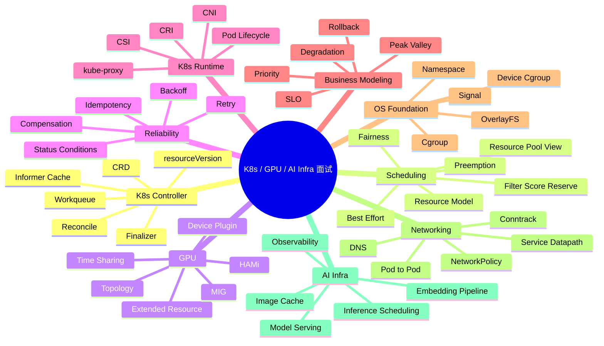
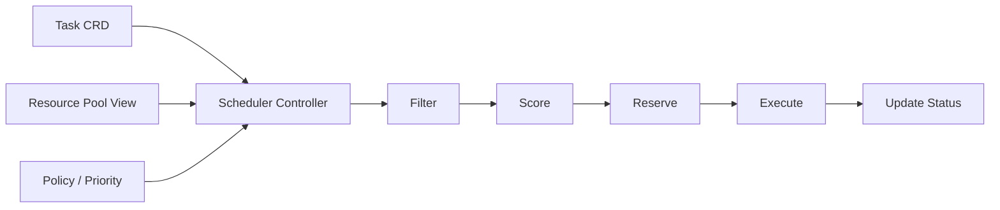
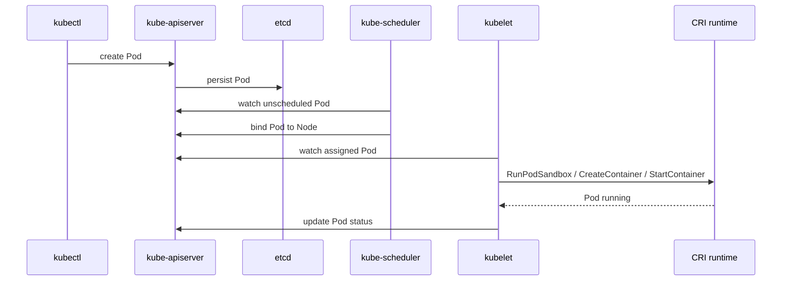

#kubernetes #gpu #ai-infra #面试 #系统设计

相关笔记：[[k8s-development-roadmap]] | [[progress]] | [[controller-runtime-source]] | [[scheduler-framework-source]] | [[gpu-scheduling]] | [[gpu-scheduling-source]] | [[kubelet-cri-source]] | [[hami-source]] | [[hami-learning-path]] | [[kube-proxy]] | [[cni]] | [[csi]] | [[network-model]] | [[service]] | [[namespace]] | [[cgroup]] | [[oci-runtime]] | [[probes]]

## 概述

这是一份面向 **K8s / GPU / AI Infra** 岗位的模块化面试题库。它不按单场面试组织，而是按长期稳定的知识域组织：每次新的面试材料都拆成问题，追加到对应模块。

每个模块包含四类内容：

1. **知识点地图**：这个模块需要掌握哪些概念和设计边界。
2. **高频题目**：面试中常见的问法。
3. **参考答案**：可以直接口述的回答骨架。
4. **设计延伸**：继续深挖时应该展开的系统设计点。

## 总知识地图



## 模块一：K8s Controller / Operator

### 知识点地图

| 知识点 | 必须掌握的问题 |
| --- | --- |
| CRD | `spec`、`status`、`conditions` 怎么拆 |
| Reconcile | 为什么要求幂等，如何保证最终收敛 |
| Informer / cache | list-watch、local cache、indexer、API Server 压力 |
| Workqueue | 去重、限速、重试、`Forget` |
| `resourceVersion` | 乐观锁、watch 增量、conflict 处理 |
| Finalizer | 外部资源清理、删除流程阻塞 |

### Q1：为什么用 Operator，而不是普通后端服务？

**参考答案**：

当业务对象有明确生命周期，并且需要和 Kubernetes 资源持续对齐时，Operator 更合适。CRD 负责表达期望状态，Controller 通过 reconcile 循环把实际状态推进到期望状态。相比普通服务，Operator 复用了 Kubernetes 的 API、watch、cache、事件、状态更新和 RBAC 模型，更适合异步、长流程、最终一致的控制面系统。

**设计延伸**：

- `spec` 只放用户期望，不放运行中状态。
- `status` 只由 controller 更新，用 `conditions` 表达阶段和失败原因。
- reconcile 不能假设事件只来一次，必须幂等。
- 外部资源创建后要用 finalizer 保证删除时可清理。

### Q2：CRD 的 `spec/status/conditions` 应该怎么设计？

**参考答案**：

`spec` 表达用户想要什么，`status` 表达系统已经做到什么，`conditions` 表达系统为什么处于当前状态。对于调度类任务，`spec` 应包含资源需求、优先级、运行时长、截止时间和 workload 引用；`status` 应包含 phase、已分配资源、调度结果、最近更新时间；`conditions` 用来表达 `Scheduled`、`Running`、`Failed`、`ResourceAvailable` 等可观测状态。

**设计延伸**：

```yaml
spec:
  priority: 100
  resource:
    gpuType: A100
    gpuCount: 2
  deadline: "2026-06-11T22:00:00Z"
  maxDuration: 2h
  workloadRef:
    namespace: batch
    name: refresh-dataset
status:
  phase: Pending
  allocation:
    nodeName: node-a
    devices:
      - GPU-0
      - GPU-1
  conditions:
    - type: Scheduled
      status: "False"
      reason: InsufficientGPU
      message: no A100 device is currently available
```

### Q3：Informer cache 和全量 list 有什么区别？

**参考答案**：

全量 list 每次都向 API Server 拉取对象，规模变大后会增加 API Server 和 etcd 压力。Informer 的模式是先 list 建立本地快照，再通过 watch 增量更新本地 cache。controller 调度或计算视图时优先读 cache，关键写入仍走 API Server。这样可以降低读压力，也能通过 indexer 构建面向调度的本地索引。

**设计延伸**：

- 如果按 GPU 型号调度，可以给本地 cache 建 `gpuType -> node/device` 索引。
- 如果需要强一致，调度前要对候选资源做二次确认或资源预留。
- controller-runtime client 默认读 cache，但 direct API reader 会绕过 cache。

### Q4：`resourceVersion` 和乐观锁是什么关系？

**参考答案**：

`resourceVersion` 是 Kubernetes 对象的版本标识。更新对象时，如果带着旧版本提交，而对象已被其他 controller 或用户更新，API Server 会返回 conflict。这和乐观锁语义一致：先读取版本，基于版本计算变更，提交时校验版本是否仍然有效。

**设计延伸**：

- conflict 后不能盲目覆盖，应重新 get 最新对象再重算。
- watch 依赖 resourceVersion 接收增量事件。
- watch 断开或版本过旧时可能遇到 `410 Gone`，需要重新 list。

### Q5：workqueue 里的 retry、backoff、Forget 怎么理解？

**参考答案**：

workqueue 用 key 去重，并通过 rate limiter 控制失败重试。处理成功后要清理失败历史；失败时根据错误类型决定是否重新入队。`Forget` 的语义是清理该 key 的失败计数，否则后续重试退避可能异常。controller-runtime 封装了细节，但设计上仍要区分成功、可重试失败和不可重试失败。

**设计延伸**：

| 结果 | 动作 | 语义 |
| --- | --- | --- |
| 成功 | Forget / no requeue | 状态已收敛 |
| 可重试失败 | requeue with backoff | 外部系统暂时不可用 |
| 不可重试失败 | update condition | 参数错误或资源永久不可用 |

## 模块二：调度系统设计

### 知识点地图

| 知识点 | 必须掌握的问题 |
| --- | --- |
| 资源建模 | 资源如何表达、上报、预留和释放 |
| 调度流程 | Filter、Score、Reserve、Bind 的职责 |
| 资源池视图 | cache、心跳、TTL、过期处理 |
| 并发控制 | 多任务抢同一资源如何避免 |
| best-effort | 如何定义最终收敛和失败状态 |
| 调度策略 | binpack、spread、priority、fairness、preemption |

### Q1：如何设计一个 GPU 离线任务调度系统？

**参考答案**：

可以分成四层：API 层用 CRD 接收任务；资源视图层维护节点和 GPU 的可用状态；调度层根据需求做过滤和打分；执行层把调度结果转成下游平台或 K8s 资源操作。系统应采用状态机驱动，每一步结果写入 status，通过 reconcile 保证最终收敛。

**设计延伸**：



### Q2：资源池视图如何构建？

**参考答案**：

资源池视图可以由节点侧 agent 或 device plugin 上报，也可以由 controller 从已有 Node、Pod、Device CRD 中汇聚。每条资源记录要包含节点、设备 ID、卡型、健康状态、占用状态和最后更新时间。调度时要过滤过期心跳，并对候选资源做预留或二次确认，避免使用陈旧视图。

**设计延伸**：

| 设计点 | 取舍 |
| --- | --- |
| 心跳频率 | 越短越实时，但控制面压力越大 |
| TTL | 太短容易误判，太长容易使用过期资源 |
| 本地 cache | 读性能好，但需要处理一致性 |
| 资源预留对象 | 状态可观测，但 API 对象数增加 |

### Q3：如何避免多个任务调度到同一张 GPU？

**参考答案**：

不能只依赖内存里的资源池视图。更稳妥的方式是显式建模资源预留，例如 `GPUAllocation` 或 lease 对象。调度器选择资源后，用 resourceVersion 做乐观更新，更新成功才算预留成功；更新失败说明资源被其他任务抢占，需要重新调度。

**设计延伸**：

- 单副本 controller 只能降低并发风险，不能替代一致性设计。
- 多副本 controller 要靠 leader election 和 API 乐观锁。
- 预留成功但执行失败时，要释放 allocation。

### Q4：best-effort 调度如何设计才不等于“随缘”？

**参考答案**：

best-effort 的含义是不保证立即成功，但要保证状态可观测、可重试、可收敛。系统需要明确每个任务状态：等待资源、已预留、执行中、运行中、完成、失败。失败要区分可重试和不可重试，并写入 condition。这样用户知道任务是继续等待、已经失败，还是需要人工处理。

**设计延伸**：

| 状态 | 含义 |
| --- | --- |
| Pending | 等待调度 |
| Reserved | 已预留资源 |
| Executing | 正在调用外部系统 |
| Running | 任务已运行 |
| Succeeded | 正常完成 |
| Failed | 终态失败 |

### Q5：调度策略用 binpack 还是 spread？

**参考答案**：

取决于目标。binpack 倾向把任务压到少量节点上，有利于释放整机或整卡资源；spread 倾向分散负载，有利于降低热点和故障影响。GPU 离线任务如果目标是回收碎片并提高利用率，通常先考虑 binpack；如果任务对稳定性敏感或会引入显著 IO/网络压力，则需要引入 spread 或打散约束。

**设计延伸**：

- GPU 型号匹配是硬过滤。
- GPU 数量、剩余时长、业务优先级可作为打分项。
- 节点温度、功耗、网络拓扑、NUMA 也可能影响调度。

## 模块三：GPU 资源接入与虚拟化

### 知识点地图

| 知识点 | 必须掌握的问题 |
| --- | --- |
| Device Plugin | 注册、上报、分配、健康检查 |
| Extended Resource | GPU 作为 K8s 扩展资源如何申请 |
| 卡型建模 | resource name、label、annotation 的边界 |
| MIG | 硬件级切分的隔离和限制 |
| 时间片共享 | 软件层共享的隔离和稳定性 |
| HAMi | device-plugin、webhook、scheduler-extender、CUDA API 拦截 |

### Q1：Device Plugin 如何把 GPU 接入 K8s？

**参考答案**：

Device Plugin 在每个 GPU 节点上运行，向 kubelet 注册资源名，然后通过 `ListAndWatch` 持续上报设备列表和健康状态。Pod 请求对应扩展资源后，kubelet 在创建容器前调用 plugin 的 `Allocate`，plugin 返回设备路径、环境变量、mount、CDI 等信息，最终让容器能访问对应 GPU。

**设计延伸**：

- `Register`：告诉 kubelet 资源名和 socket。
- `ListAndWatch`：持续上报设备健康状态。
- `Allocate`：为容器分配设备并返回注入信息。
- kubelet 重启后 plugin 要重新注册。

### Q2：GPU 型号放资源名、label 还是 annotation？

**参考答案**：

如果卡型是 Pod 申请资源的一部分，应该体现在扩展资源名里，例如 `nvidia.com/a100`。如果卡型用于调度选择，可以放 Node label，例如 `gpu.model=A100`。annotation 更适合描述性信息或辅助查询，不适合作为强调度约束。

**设计延伸**：

| 建模方式 | 适合场景 | 注意点 |
| --- | --- | --- |
| 扩展资源名 | Pod 明确申请某类卡 | 资源类型变多 |
| Node label | 节点选择、亲和性、调度过滤 | label 要可信 |
| Node annotation | 展示、元数据、调试 | 不建议作为强约束 |

### Q3：MIG、时间片、HAMi 的差异是什么？

**参考答案**：

MIG 是硬件级切分，隔离强、性能稳定，但粒度固定且依赖特定 NVIDIA GPU。时间片共享是软件调度层面的复用，灵活但隔离弱。HAMi 这类方案通过 device-plugin、scheduler-extender、webhook 和 CUDA API 拦截实现显存和算力限制，粒度更细，但要关注兼容性、绕过风险和性能抖动。

**设计延伸**：

| 方案 | 层次 | 优点 | 风险 |
| --- | --- | --- | --- |
| MIG | 硬件 | 隔离强 | 依赖硬件，粒度固定 |
| 时间片 | 调度/运行时 | 实现灵活 | 性能抖动，隔离弱 |
| HAMi | API/运行时 | 粒度细 | 兼容性和绕过风险 |

### Q4：GPU 分时调度和 GPU 虚拟化是什么关系？

**参考答案**：

GPU 分时调度解决的是“什么时候、把哪些 GPU 资源给哪些任务使用”，重点在峰谷复用和资源编排。GPU 虚拟化解决的是“单张 GPU 如何被多个任务共享”，重点在隔离、限额和运行时控制。两者可以结合，但不是同一个问题。

**设计延伸**：

- 分时调度可以只做整卡级复用。
- vGPU 可以提高单卡利用率，但会引入隔离和性能问题。
- 在线业务和离线任务混部时，要定义抢占和回收策略。

## 模块四：可靠性与异常流程

### 知识点地图

| 知识点 | 必须掌握的问题 |
| --- | --- |
| 幂等 | 重试为什么不会重复执行 |
| Retry | 哪些错误应该重试 |
| Backoff | 如何避免打爆下游 |
| Compensation | 半成功状态如何恢复 |
| Conditions | 用户如何看到失败原因 |
| Observability | 指标、日志、事件、告警如何设计 |

### Q1：外部执行失败为什么不能简单不重试？

**参考答案**：

外部执行失败要先分类。参数错误、资源不存在属于不可重试错误，应写入终态 condition；网络超时、下游限流、服务临时不可用属于可重试错误，应带退避重试。如果完全不重试，系统很容易卡在中间状态；如果盲目重试，又可能重复执行。因此外部调用必须带幂等 key。

**设计延伸**：

```text
validate request
  -> call external API with idempotency key
  -> success: update status
  -> retryable error: requeue with backoff
  -> terminal error: set Failed condition
```

### Q2：执行到一半失败怎么处理？

**参考答案**：

这类系统通常不能做强事务，要通过状态机和补偿实现最终一致。每个外部动作都要能查询状态，并能重复提交或撤销。比如资源已腾挪但任务提交失败，就需要触发资源归还；任务已启动但 status 更新失败，则只需要重试 status 更新。

**设计延伸**：

| 阶段 | 失败处理 |
| --- | --- |
| 校验失败 | 直接终态失败 |
| 调用超时 | 查询外部状态后决定重试 |
| 资源已释放，任务未启动 | 补偿归还资源 |
| 任务已启动，状态未更新 | 重试状态回写 |

### Q3：状态如何对用户可观测？

**参考答案**：

CRD status 应包含 phase、conditions、最近一次调度时间、失败 reason 和 message。Controller 还应该打 Kubernetes event，暴露关键 metrics，例如调度成功率、重试次数、资源池过期节点数、外部 API 延迟。这样用户和平台都能判断系统是在等待、失败还是持续重试。

**设计延伸**：

- condition 适合表达当前状态。
- event 适合表达状态变化历史。
- metrics 适合做系统级告警。
- log 适合排查单次 reconcile。

## 模块五：K8s 核心链路

### 知识点地图

| 知识点 | 必须掌握的问题 |
| --- | --- |
| Pod 创建 | API Server、etcd、scheduler、kubelet 如何协作 |
| CRI | kubelet 如何创建 sandbox 和 container |
| CNI | Pod IP 和 netns 何时创建 |
| CSI | volume 何时 attach/mount |
| Service | kube-proxy / eBPF 如何转发 ClusterIP |
| Pod 网络 | pause 容器和共享 network namespace |

### Q1：kubectl 创建 Pod 的完整流程是什么？

**参考答案**：

kubectl 请求到 API Server，经过认证、鉴权、准入后写入 etcd。Scheduler watch 到未绑定节点的 Pod 后，执行过滤、打分并绑定节点。目标节点 kubelet watch 到分配给自己的 Pod，调用 CRI 创建 sandbox 和容器，同时触发 CNI 配网、CSI 挂载，最后回写 Pod status。

**设计延伸**：



### Q2：Pod 内多个容器如何共享网络？

**参考答案**：

Pod 内多个容器共享同一个 network namespace。运行时先创建 pause/sandbox 容器，CNI 给这个 sandbox 配网，后续业务容器加入同一个 netns。因此同一 Pod 内容器可以通过 `localhost` 通信，端口也会冲突。Pod 间通信走 CNI，Service 通信走 kube-proxy/IPVS 或 eBPF Service 转发。

**设计延伸**：

- Pod 内：共享 netns，localhost。
- Pod 间：Pod IP，CNI 数据面。
- Service：ClusterIP，kube-proxy/eBPF。
- 外部访问：Ingress/Gateway/LoadBalancer。

### Q3：CRI、CNI、CSI 在 Pod 创建中分别做什么？

**参考答案**：

CRI 是 kubelet 和容器运行时的接口，负责创建 sandbox、拉镜像、创建和启动容器。CNI 由运行时在 sandbox 创建时调用，负责创建网卡、分配 Pod IP、配置路由。CSI 负责持久卷的 attach、stage、publish，把存储挂载到 Pod 目录。

**设计延伸**：

| 接口 | 解决什么 | 典型动作 |
| --- | --- | --- |
| CRI | 容器生命周期 | RunPodSandbox、CreateContainer、StartContainer |
| CNI | Pod 网络 | ADD、DEL、IPAM、veth |
| CSI | Pod 存储 | ControllerPublish、NodeStage、NodePublish |

## 模块六：AI Infra 平台方向

### 知识点地图

| 知识点 | 必须掌握的问题 |
| --- | --- |
| 镜像缓存 | 大模型镜像冷启动和分发如何优化 |
| 推理调度 | 模型实例如何按 GPU、显存、QPS 调度 |
| Embedding pipeline | 图像/文本向量化链路如何工程化 |
| 模型服务 | 在线推理、批处理、离线任务边界 |
| 可观测性 | QPS、延迟、显存、GPU 利用率 |
| 成本优化 | 峰谷复用、弹性扩缩、混部 |

### Q1：AI 平台里的 K8s 二开通常做什么？

**参考答案**：

常见方向包括 Operator、调度器扩展、Device Plugin、镜像缓存、模型服务编排、推理任务调度、资源可观测性和成本优化。重点不是写普通业务 CRUD，而是把模型服务、GPU 资源、镜像分发、弹性扩缩和平台稳定性接到 Kubernetes 控制面上。

**设计延伸**：

- 大模型镜像缓存：解决冷启动和带宽压力。
- GPU 调度：解决异构卡型、显存、拓扑、利用率。
- 推理服务：解决 QPS、延迟、批处理、弹性伸缩。
- 平台控制器：用 CRD 表达模型服务、推理任务、数据处理任务。

### Q2：如何判断岗位是真 K8s / AI Infra，而不是普通业务开发？

**参考答案**：

要反问团队的核心系统边界：是否维护 Operator、scheduler plugin、device plugin、image cache、model serving controller；是否需要处理 GPU 异构、镜像冷启动、推理调度、K8s 升级和控制器稳定性。如果主要工作是业务接口、页面和数据库 CRUD，那就不是偏底层的 K8s / AI Infra 岗。

**设计延伸：可反问问题**

1. 当前维护哪些 K8s 控制器或调度组件？
2. GPU 节点规模和卡型是否异构？
3. 调度优化发生在 kube-scheduler plugin，还是业务侧调度层？
4. 镜像缓存主要解决冷启动、带宽还是大模型镜像分发？
5. 是否涉及推理服务调度、embedding pipeline、KV cache 或 batch inference？
6. 新人前 3 个月主要修 bug，还是参与底层组件设计？

## 模块七：业务场景与系统边界

### 知识点地图

| 知识点 | 必须掌握的问题 |
| --- | --- |
| 业务目标 | 系统到底优化利用率、成本、稳定性还是交付效率 |
| SLO / SLA | 在线业务能接受多大延迟、错误率和恢复时间 |
| 峰谷识别 | 只看 QPS 是否足够，是否还要看延迟、队列和 GPU 利用率 |
| 混部风险 | 离线任务如何避免影响在线推理 |
| 优先级 | 在线、准实时、离线任务如何分级 |
| 回滚策略 | 资源腾挪后发现业务抖动如何快速恢复 |

### Q1：如果让你设计 GPU 峰谷复用，业务指标怎么选？

**参考答案**：

不能只看 QPS。QPS 只能说明请求量，不能说明服务是否还有余量。更合理的判断要结合 P95/P99 延迟、错误率、排队长度、GPU 利用率、显存占用、模型实例数、冷启动时间和业务优先级。只有当在线业务满足 SLO，并且连续一段时间低于回收阈值，才允许把资源借给离线任务。

**设计延伸**：

- 阈值要有滞回区间，避免资源频繁抢占和归还。
- 回收资源前要确认离线任务可中断或可检查点恢复。
- 高优先级业务要支持立即抢占离线任务。
- 资源归还要考虑模型加载、预热和流量切回时间。

### Q2：在线推理和离线刷库混部，最核心的业务风险是什么？

**参考答案**：

核心风险是离线任务抢占了在线业务的资源余量，导致延迟抖动、错误率升高或扩容来不及。GPU 场景还要关注显存碎片、模型预热、PCIe/NVLink 拓扑、磁盘和网络 IO 抢占。混部系统不能只做调度成功，还要保证在线业务能快速拿回资源。

**设计延伸**：

| 风险 | 防护方式 |
| --- | --- |
| 在线延迟升高 | SLO 触发回收，优先级抢占 |
| 离线任务不可中断 | checkpoint、分片任务、幂等提交 |
| 模型冷启动慢 | 镜像缓存、模型预热、保留 buffer |
| IO 抢占 | 限速、分池、按业务隔离节点 |

### Q3：如果面试官问“这个项目的业务价值是什么”，怎么回答？

**参考答案**：

可以从资源、成本和稳定性三个角度回答。资源上，提高低峰时段 GPU 利用率；成本上，把原本闲置的在线资源复用于离线任务，减少额外采购或排队等待；稳定性上，通过优先级、抢占、状态机和回滚机制保证在线业务优先。不要只说“提高利用率”，还要说明不影响在线 SLO 是系统边界。

**设计延伸**：

- 量化指标：GPU 利用率、离线任务完成时长、在线 P99、抢占次数、资源归还耗时。
- 业务边界：哪些任务允许混部，哪些任务必须独占。
- 组织边界：平台负责资源编排，业务方负责任务幂等和可中断能力。

### Q4：业务方说“晚上 QPS 低，把 GPU 都拿走”，你会怎么反问？

**参考答案**：

要先确认业务低峰是否稳定、是否有突发流量、是否有定时任务、告警回滚标准是什么、资源归还需要多久、离线任务能否被中断。QPS 低不等于资源一定可回收，因为模型加载、缓存命中、突发流量和下游依赖也会影响在线稳定性。

**设计延伸：可反问问题**

1. 在线服务的 P99 和错误率 SLO 是多少？
2. 低峰窗口是否固定，是否存在突发活动或批量请求？
3. 抢占离线任务后，GPU 多久能归还给在线业务？
4. 模型重新加载和预热需要多久？
5. 离线任务是否支持 checkpoint 和幂等重试？

## 模块八：操作系统与容器底层

### 知识点地图

| 知识点 | 必须掌握的问题 |
| --- | --- |
| Namespace | 容器隔离了哪些视图，Pod 共享哪些 namespace |
| Cgroup | CPU、内存、设备访问如何限制和统计 |
| OverlayFS | 镜像层和容器可写层如何工作 |
| OCI runtime | containerd、runc、shim 的边界 |
| Device cgroup | GPU 设备文件如何暴露给容器 |
| Signal / PID 1 | 容器进程退出、僵尸进程和优雅终止 |

### Q1：容器和虚拟机的本质区别是什么？

**参考答案**：

容器不是模拟一台完整机器，而是在同一个宿主机内核上用 namespace 隔离进程看到的视图，用 cgroup 限制资源，再通过 rootfs 和 union filesystem 提供文件系统环境。虚拟机通常有独立 guest kernel，隔离更强但启动和资源开销更大。

**设计延伸**：

- namespace 解决“看见什么”：pid、net、mnt、uts、ipc、user。
- cgroup 解决“能用多少”：CPU、memory、pids、devices。
- rootfs / OverlayFS 解决“文件系统长什么样”。
- seccomp、AppArmor、SELinux 负责限制系统调用和访问权限。

### Q2：Pod 里的 pause 容器有什么作用？

**参考答案**：

pause 容器是 Pod sandbox 的承载进程。运行时先创建 sandbox，再把业务容器加入同一个 network namespace。这样 Pod 内多个容器共享同一个 IP、端口空间和 localhost。pause 还提供一个稳定的 namespace 锚点，避免业务容器重启时 Pod 网络命名空间被销毁。

**设计延伸**：

- Pod 内容器端口会冲突，因为共享 netns。
- CNI 是给 sandbox 配网，不是给每个业务容器单独配网。
- Pod 重启单个容器时，Pod IP 通常保持不变。

### Q3：GPU 是怎么被放进容器里的？

**参考答案**：

GPU 最终是宿主机上的设备文件和驱动能力。K8s 通过 Device Plugin 把 GPU 作为扩展资源上报；Pod 被调度后，kubelet 调用 `Allocate` 获取设备分配结果；运行时再把 `/dev/nvidia*`、驱动库、环境变量或 CDI 设备注入容器，同时通过 device cgroup 控制容器能访问哪些设备。

**设计延伸**：

- 只挂载设备文件不等于资源隔离，显存和算力限制还需要运行时或虚拟化方案。
- device cgroup 控制设备访问权限，不负责调度公平性。
- NVIDIA Container Runtime / CDI 负责把设备和依赖注入到 OCI spec。

### Q4：容器内进程收到 SIGTERM 后，K8s 是怎么终止 Pod 的？

**参考答案**：

删除 Pod 时，kubelet 先执行 `preStop`，然后向容器主进程发送 SIGTERM，并等待 `terminationGracePeriodSeconds`。如果超时还没退出，再发送 SIGKILL。应用要正确处理 SIGTERM，停止接收新请求、等待 in-flight 请求完成、释放资源后退出。

**设计延伸**：

- readiness probe 应该先摘流量，再做优雅退出。
- PID 1 进程要正确转发信号和回收子进程。
- GPU 任务要在退出时释放锁、checkpoint 或更新任务状态。

## 模块九：网络基础与 K8s 数据面

### 知识点地图

| 知识点 | 必须掌握的问题 |
| --- | --- |
| Pod 网络模型 | 每个 Pod 一个 IP，Pod 间原则上直接互通 |
| CNI | veth、IPAM、route、overlay/underlay |
| Service | ClusterIP 如何转发到 Endpoint |
| kube-proxy / eBPF | iptables、IPVS、eBPF 数据面差异 |
| DNS | Service name 如何解析 |
| NetworkPolicy | 隔离规则由谁真正执行 |
| conntrack / MTU | 网络疑难问题常见根因 |

### Q1：Pod 访问另一个节点上的 Pod，网络路径是什么？

**参考答案**：

容器流量先从 Pod netns 的 eth0 出来，经过 veth pair 到宿主机侧，再由 CNI 配置的路由或隧道转发到目标节点。目标节点解封装或路由后，把包送进目标 Pod 的 veth。不同 CNI 数据面不同：Flannel VXLAN 走 overlay 封装，Calico 常见模式走三层路由或 BGP，Cilium 可以用 eBPF 接管转发和策略。

**设计延伸**：

- 同节点 Pod 通常通过本机 bridge、veth 或 eBPF 转发。
- 跨节点要关注路由、封装、MTU 和安全组。
- overlay 简化网络要求，但有封装开销和 MTU 问题。

### Q2：Pod 访问 Service 的完整路径是什么？

**参考答案**：

Pod 先通过 DNS 把 Service name 解析成 ClusterIP，然后访问 ClusterIP。节点上的 kube-proxy 使用 iptables 或 IPVS 把 ClusterIP 转发到某个 Endpoint Pod；如果是 Cilium 等 eBPF 数据面，Service 转发可以由 eBPF 程序完成。Service 解决的是稳定入口和负载均衡，不是给 Pod 配 IP。

**设计延伸**：

| 层次 | 作用 |
| --- | --- |
| CoreDNS | Service name 到 ClusterIP |
| Service | 稳定虚拟 IP 和端口 |
| EndpointSlice | 后端 Pod 地址集合 |
| kube-proxy / eBPF | ClusterIP 到 Pod IP 的转发 |

### Q3：NetworkPolicy 为什么创建了不一定生效？

**参考答案**：

NetworkPolicy 只是 Kubernetes API 对象，真正执行要依赖支持策略的 CNI。比如 Calico、Cilium 支持网络策略，而 Flannel 默认不支持完整 NetworkPolicy。如果 CNI 不实现策略控制，创建 policy 也不会产生预期隔离效果。

**设计延伸**：

- 默认情况下 Pod 之间通常是互通的。
- 一旦某个 Pod 被 ingress policy 选中，未显式允许的入方向流量会被拒绝。
- 策略排查要看 selector 是否匹配、namespaceSelector 是否正确、CNI 是否支持。

### Q4：线上 Pod 访问 Service 偶发超时，你会怎么排查？

**参考答案**：

先确定是 DNS、Service 转发、Pod 网络还是应用问题。按链路排查：确认 CoreDNS 解析是否稳定；检查 Service selector 和 EndpointSlice 是否正确；看 kube-proxy/IPVS/eBPF 状态；进入 Pod netns 测试目标 Pod IP 是否可达；检查 CNI 日志、节点路由、conntrack 是否打满、MTU 是否异常；最后结合应用日志和延迟指标判断是否是服务端处理慢。

**设计延伸**：

```text
DNS -> Service -> EndpointSlice -> node datapath -> Pod IP -> application
```

- `nslookup` / `dig` 判断解析问题。
- 直连 Pod IP 可以绕过 Service，定位数据面层级。
- `tcpdump` 能判断包是否到达目标节点或目标 Pod。
- conntrack 表满会导致看似随机的连接失败。

## 模块十：常见薄弱点与补强方向

| 薄弱点 | 面试风险 | 补强方向 |
| --- | --- | --- |
| 只会描述项目流程 | 缺少系统设计深度 | 补 CRD、状态机、异常流程 |
| 只讲技术不讲业务价值 | 被认为不理解平台目标 | 补 SLO、成本、利用率、业务边界 |
| 全量 list 讲不清 | 被质疑扩展性 | 补 informer/cache/indexer |
| 失败不重试 | 被质疑健壮性 | 补幂等、retry、backoff、compensation |
| GPU 分时和 vGPU 混淆 | 概念边界不清 | 区分整卡复用、单卡切分、API 拦截 |
| Device Plugin 只知道上报 | 不了解 kubelet 交互 | 补 Register、ListAndWatch、Allocate |
| Pod 网络讲成 kube-proxy | K8s 基础扣分 | 补 pause/netns/CNI/Service 边界 |
| OS 只知道名词 | 底层深度不足 | 补 namespace、cgroup、OCI runtime、device cgroup |
| 网络排障没有链路 | 排查能力显弱 | 按 DNS、Service、Endpoint、CNI、路由、conntrack 分层 |
| 岗位理解只看 JD | 匹配度表达弱 | 反问真实组件、规模、职责边界 |

## 后续追加规则

以后每来一份新面试材料，按这个规则处理：

1. 不保存流水账，先抽取真实问题。
2. 把问题归入已有知识模块。
3. 每个问题补齐参考答案和设计延伸。
4. 如果出现新知识域，再新增模块。
5. 如果发现学习路线缺口，回链到对应领域笔记、`internals/` 源码导读或 [[progress]]。
