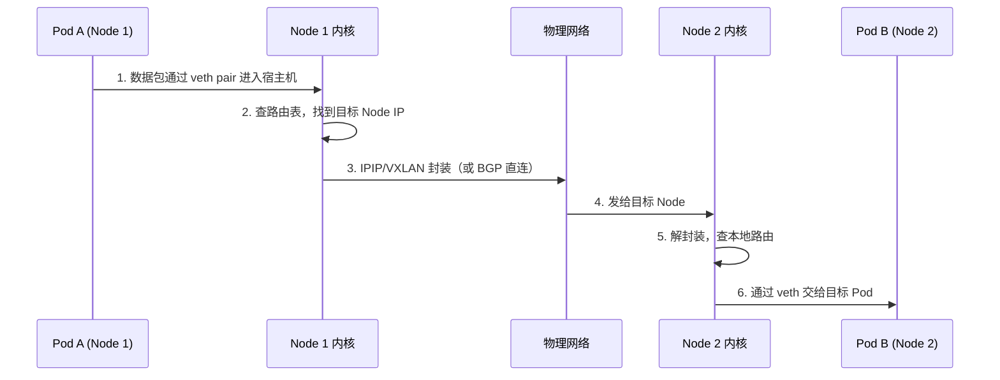

#kubernetes #cni #calico

相关笔记：[[cni]] | [[network-model]] | [[cilium]]

## Calico 概述

Calico 是一个强大的 CNI 插件，不仅给 Pod 分配 IP，还支持跨节点通信、网络策略、安全隔离。

### 核心能力

1. 给每个 Pod 分配可路由 IP（无 NAT）
2. 建立路由/封装隧道（BGP、IPIP、VXLAN）
3. 实现 NetworkPolicy（控制谁能访问谁）

## 核心组件

| 组件 | 作用说明 |
| --- | --- |
| calico-cni | 在 Pod 启动时设置网络连接（veth pair + IP） |
| calico-node | 每个节点的核心组件，包含 Felix、BGP 或隧道逻辑 |
| Felix | 管理 iptables、防火墙规则，执行策略控制 |
| BIRD / GoBGP | 节点间的路由同步（用于 BGP 模式） |
| Typha（可选） | 减轻 etcd 压力，适用于大集群 |

## 三种跨节点通信模式

| 模式 | 原理 |
| --- | --- |
| BGP（默认） | 各节点之间通过 BGP 协议同步路由，性能最佳 |
| IPIP | IP-in-IP 封装，穿越网络不通的场景 |
| VXLAN | 使用 VXLAN 封装数据帧，适用于云厂商环境 |

## Pod 跨节点通信流程

以 Calico 为例，Pod 跨节点通信的完整流程如下：



### 详细步骤

1. Pod 启动时 calico-cni 插件创建 veth pair 并分配 IP
2. calico-node 设置路由（BGP / IPIP）或封装规则
3. Pod 访问目标 Pod IP，Linux 路由表找到目标 Node IP
4. 使用 IPIP / VXLAN 封装（或直连）发给目标 Node
5. 解封装后通过 veth 交给目标 Pod 接收

## 安装与配置

```bash
# 安装 Calico（使用 operator 方式）
kubectl create -f https://raw.githubusercontent.com/projectcalico/calico/v3.27.0/manifests/tigera-operator.yaml
kubectl create -f https://raw.githubusercontent.com/projectcalico/calico/v3.27.0/manifests/custom-resources.yaml

# 查看 Calico 运行状态
kubectl get pod -n kube-system -l k8s-app=calico-node

# 安装 calicoctl
kubectl apply -f https://raw.githubusercontent.com/projectcalico/calico/v3.27.0/manifests/calicoctl.yaml

# 查看节点 BGP 状态
calicoctl node status

# 查看 IP 池
calicoctl get ippool -o wide

# 查看工作负载的 endpoint
calicoctl get workloadendpoint -A
```

## 网络排查指南

当 Pod 不能通信时，按以下步骤逐一排查：

| 步骤 | 检查点 | 命令 |
| --- | --- | --- |
| 1 | 检查 Pod 是否 Ready | `kubectl get pod -o wide` |
| 2 | 测试网络连通性 | `kubectl exec pod-a -- ping <pod-b-ip>` |
| 3 | 判断是否跨节点 | `kubectl get pod -o wide` 查看 Node 列 |
| 4 | 查看路由表和封装接口 | `ip route` / `ip a` 查看 tunl0 或 caliXXX |
| 5 | 检查 NetworkPolicy 是否拦截 | `kubectl get networkpolicy -A` |
| 6 | 检查 Calico 运行状态 | `kubectl get pod -n kube-system -l k8s-app=calico-node` |

### 实战排查命令

```bash
# 1. 查看 Pod 的 IP 和所在节点
kubectl get pod -o wide

# 2. Pod 内 ping 另一个 Pod
kubectl exec pod-a -- ping 10.244.2.5

# 3. Pod 内 curl 服务
kubectl exec pod-a -- curl 10.244.2.5:80

# 4. 查看节点的路由表
ip route

# 5. 查看节点的网络接口（是否有 caliXXX、tunl0）
ip a

# 6. 查看所有网络策略
kubectl get networkpolicy -A

# 7. 查看 iptables 策略（注意看 cali 前缀的链）
iptables -L -n -v

# 8. 查看 calico-node 日志
kubectl logs -n kube-system -l k8s-app=calico-node
```

## 面试要点

**Q: Calico 的核心功能是什么？**

A: Calico 是 Kubernetes 中常用的 CNI 插件，负责给 Pod 分配 IP 并建立通信路由。它默认使用 BGP 同步路由，也支持 IPIP 和 VXLAN 隧道，配合 Felix 设置 iptables，实现网络访问控制。

**Q: Pod 无法通信时如何排查？**

A: 排查思路是：先确认 Pod 状态，然后测试网络连通性，检查是否跨节点，再看路由表和封装接口是否正常，最后排查是否有 NetworkPolicy 拦截，并查看 calico-node 是否运行正常。

**Q: Calico BGP 模式和 IPIP/VXLAN 模式如何选择？**

A: BGP 模式性能最佳（无封装开销），适合网络环境支持 BGP 的场景；IPIP 适合跨子网但性能开销小于 VXLAN；VXLAN 兼容性最好，适合云厂商环境（不支持 BGP 或 IPIP 的网络）。
