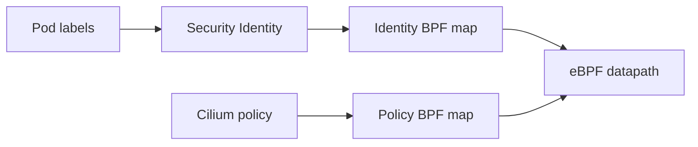

#kubernetes #cni #cilium #ebpf

相关笔记：[[cilium]] | [[cni]] | [[network-model]] | [[kube-proxy]] | [[cni-troubleshooting]] | [[calico]] | [[k8s-interview]]

## 概述

Cilium 是基于 eBPF 的 Kubernetes 网络、Service 转发、安全策略与可观测性方案。它仍然是 CNI 插件，但和传统 bridge/iptables 插件的差异在于：它把大量数据面逻辑放进内核 eBPF program，并用 BPF map 保存 endpoint、identity、Service、policy 等状态。

学习 Cilium 要抓住三条线：

1. **CNI 入网线**：Pod 创建时通过 CNI ADD 接入网络。
2. **eBPF 数据线**：包在 TC/XDP/socket 等 hook 上被 BPF program 处理。
3. **身份与策略线**：Pod label 被转成 identity，NetworkPolicy/CiliumNetworkPolicy 被转成策略 map。

## 核心组件

| 组件 | 职责 |
| --- | --- |
| `cilium-agent` | 每节点一份，管理 endpoint、加载 BPF program、维护 BPF map |
| `cilium-operator` | 集群级控制逻辑，如 IPAM、CRD 管理、垃圾回收 |
| `cilium-cni` | CNI 插件二进制，负责 Pod ADD/DEL 时与 agent 协作 |
| Hubble | 基于 Cilium flow event 的网络可观测性 |
| Envoy | L7 policy、Gateway/API 网关等七层能力的执行面 |

## Endpoint 与 identity

Cilium 不只按 IP 做策略，它会把 Pod label 集合分配成一个 numeric identity。



这个模型的好处是：策略判断不必只依赖 IP 地址。Pod 重建后 IP 变了，只要 label identity 不变，策略语义仍然稳定。

## 数据面入口

Cilium 常见的数据面 hook：

| 位置 | 用途 |
| --- | --- |
| TC ingress/egress | Pod veth 流量处理、策略判断、转发 |
| XDP | 更早的包处理点，适合高性能 drop / load balancing |
| socket hook | 加速本机进程到 Service 的连接处理 |
| cgroup hook | 连接级策略和透明代理相关能力 |

不要把 eBPF 理解成“更快的 iptables”。更准确地说，它是可验证、可加载到内核 hook 的小程序，Cilium 用它实现网络转发、负载均衡、安全策略和观测事件。

## kube-proxy replacement

开启 kube-proxy replacement 后，Cilium 会接管 Service 转发：

```text
Service / EndpointSlice watch
        |
        v
cilium-agent updates BPF LB map
        |
        v
eBPF program selects backend endpoint
```

此时排查 Service 不要再只看 `iptables-save | grep KUBE-SERVICES`，要看：

```bash
cilium status
cilium service list
cilium bpf lb list
```

如果集群里还运行 kube-proxy，则要确认是否存在双重转发或配置不一致。

## NetworkPolicy 与 L7 策略

Cilium 支持 Kubernetes 原生 NetworkPolicy，也支持 CiliumNetworkPolicy 扩展。

| 策略层级 | 典型能力 |
| --- | --- |
| L3 | 按 endpoint identity、namespace、CIDR 放行 |
| L4 | 按 TCP/UDP 端口放行 |
| L7 | 按 HTTP method/path/header、Kafka topic 等放行 |

L7 策略通常需要 Envoy 参与。面试里要说清楚：L7 能力不是“所有包都在 eBPF 里完整解析 HTTP”，而是 eBPF 与 userspace proxy 协作。

## 与 Calico 的核心差异

| 维度 | Calico | Cilium |
| --- | --- | --- |
| 主要数据面 | 路由/BGP、iptables/nftables/eBPF 取决于模式 | eBPF 为核心 |
| Service 替代 kube-proxy | 不是传统主线能力 | 核心能力之一 |
| 策略模型 | NetworkPolicy / GlobalNetworkPolicy | NetworkPolicy / CiliumNetworkPolicy |
| 可观测性 | 基础日志和 flow 工具 | Hubble flow 可观测性强 |
| 学习重点 | BGP、IPPool、Felix、路由 | BPF map、endpoint、identity、policy |

## 排查入口

```bash
cilium status
cilium endpoint list
cilium endpoint get <endpoint-id>
cilium service list
cilium policy get
cilium monitor
hubble observe
```

常见问题：

| 现象 | 检查点 |
| --- | --- |
| Pod 无法入网 | cilium-agent 是否 ready，CNI 配置是否指向 cilium-cni |
| Service 不通 | `cilium service list`、BPF LB map、EndpointSlice |
| 某方向流量被拒 | endpoint policy verdict、identity、policy selector |
| DNS 被阻断 | egress policy 是否放行 kube-dns |
| 性能异常 | MTU、tunnel/direct routing 模式、BPF map pressure |

## 面试要点

### Q: Cilium 为什么能替代 kube-proxy？

> [!question]- 参考答案（点击展开）
>
> kube-proxy 的核心职责是把 Service VIP 转发到后端 endpoint。Cilium watch Service/EndpointSlice 后，把负载均衡状态写入 BPF map，再由 eBPF program 在内核路径上完成 backend 选择和转发，因此可以不依赖 iptables/IPVS。

### Q: Cilium 的 identity 有什么价值？

> [!question]- 参考答案（点击展开）
>
> identity 把 Pod label 集合映射成稳定的安全身份，策略可以基于身份而不是易变的 IP 判断。Pod 重建或迁移后，只要 label 语义不变，策略仍然成立。

### Q: Cilium 的 L7 策略是不是纯 eBPF 实现？

> [!question]- 参考答案（点击展开）
>
> 不是。eBPF 负责流量识别、重定向和内核态快速路径；复杂 L7 解析通常交给 Envoy 等 userspace proxy。它是协作模型，不是把完整 HTTP 代理塞进 eBPF。
