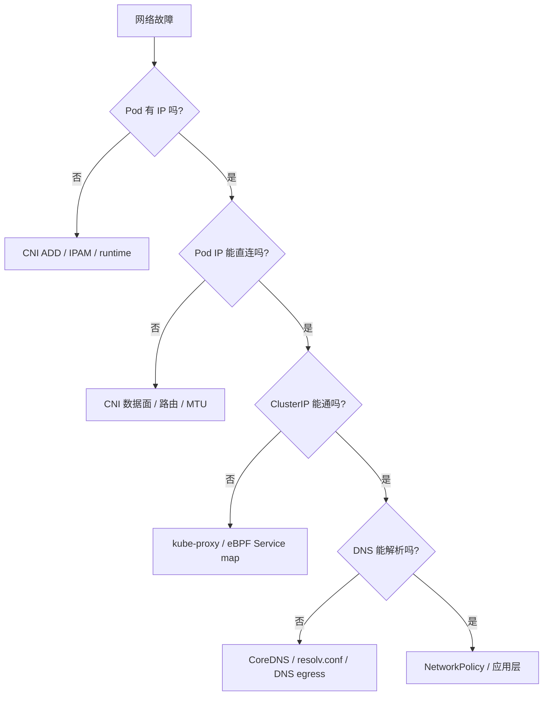

#kubernetes #cni #troubleshooting

相关笔记：[[cni]] | [[cni-source]] | [[network-model]] | [[kube-proxy]] | [[calico]] | [[cilium-deep-dive]] | [[k8s-interview]]

## 概述

CNI 排障不要从“插件坏了”开始猜。正确做法是先把链路拆成四段：

1. Pod sandbox 是否创建成功。
2. runtime 是否成功调用 CNI `ADD`。
3. Pod IP、veth、路由、iptables/BPF 规则是否正确。
4. Service、DNS、NetworkPolicy 是否影响访问路径。

核心边界：**Pod 没拿到 IP，多半在 CNI ADD 之前或 ADD 内部；Pod 有 IP 但跨节点不通，多半在 CNI 数据面；ClusterIP 不通，多半在 kube-proxy 或 eBPF Service 转发；域名不通，多半在 CoreDNS。**



## 先看症状归类

| 现象 | 主要怀疑点 |
| --- | --- |
| Pod 卡在 `ContainerCreating` | CNI ADD 失败、镜像/volume 失败、sandbox 创建失败 |
| Pod 有 IP，同节点互通，跨节点不通 | CNI 跨节点数据面：VXLAN、BGP、路由、MTU |
| Pod IP 互通，Service 不通 | kube-proxy / Cilium Service map / EndpointSlice |
| Service 能通，域名不通 | CoreDNS、Pod DNS 配置、NetworkPolicy egress |
| 只有某个 namespace 不通 | NetworkPolicy、CNI policy controller |
| 大包不通，小包能通 | MTU、隧道封装、路径 PMTU |

## 第一层：Pod sandbox 与 CNI ADD

先看 Pod event：

```bash
kubectl describe pod <pod-name> -n <namespace>
```

关注 event 里的关键词：

| 关键词 | 含义 |
| --- | --- |
| `FailedCreatePodSandBox` | kubelet 调 CRI 创建 sandbox 失败 |
| `failed to setup network` | runtime 调 CNI ADD 失败 |
| `no CNI configuration file` | `/etc/cni/net.d/` 没有有效配置 |
| `failed to find plugin` | `/opt/cni/bin/` 缺插件二进制 |
| `IPAM` / `no IP addresses available` | IP 池耗尽或 IPAM 状态异常 |

节点侧看 kubelet 和 runtime：

```bash
journalctl -u kubelet -n 200 --no-pager
crictl pods
crictl inspectp <pod-sandbox-id>
```

如果使用 containerd：

```bash
journalctl -u containerd -n 200 --no-pager
```

## 第二层：节点 CNI 配置

在问题节点上检查：

```bash
ls -l /etc/cni/net.d/
ls -l /opt/cni/bin/
cat /etc/cni/net.d/*.conf
cat /etc/cni/net.d/*.conflist
```

重点看：

- `type` 是否能在 `/opt/cni/bin/` 找到同名二进制。
- `cniVersion` 是否被插件支持。
- `ipam.type` 是否存在。
- 多插件链里 `portmap`、`bandwidth` 等辅助插件是否齐全。
- 配置文件是否残留多个 CNI 插件，runtime 读到了错误的第一个配置。

## 第三层：Pod netns、veth、路由

确认 Pod IP：

```bash
kubectl get pod <pod-name> -n <namespace> -o wide
```

进入 Pod 看网卡和路由：

```bash
kubectl exec -n <namespace> <pod-name> -- ip addr
kubectl exec -n <namespace> <pod-name> -- ip route
kubectl exec -n <namespace> <pod-name> -- cat /etc/resolv.conf
```

在节点上看 veth 和路由：

```bash
ip link
ip addr
ip route
bridge link
```

如果是 bridge 类插件，应该能看到 host 侧 veth 挂到 bridge 上；如果是 Calico BGP 模式，重点看路由表和 cali 接口；如果是 Cilium，重点看 endpoint 与 BPF map。

## 第四层：跨节点数据面

跨节点不通时，先确定包有没有出本节点：

```bash
tcpdump -ni any host <remote-pod-ip>
```

常见插件的检查入口：

| 插件 | 检查点 |
| --- | --- |
| Flannel VXLAN | `flannel.1`、节点路由、VXLAN 端口、MTU |
| Calico BGP | `calicoctl node status`、BIRD/Felix 日志、路由表 |
| Calico VXLAN/IPIP | `tunl0` 或 VXLAN 接口、IPPool 模式 |
| Cilium | `cilium status`、`cilium endpoint list`、`cilium monitor`、BPF map |

MTU 是高频问题：VXLAN/IPIP/WireGuard 都会增加包头，底层网络 MTU 不够时会出现“大包不通、小包通”。

## 第五层：Service 与 DNS

Pod IP 能通但 Service 不通：

```bash
kubectl get svc,endpointslice -n <namespace>
kubectl describe svc <service-name> -n <namespace>
```

看 Service selector 是否选中了 Pod，EndpointSlice 里 endpoint 是否 ready。

iptables kube-proxy：

```bash
iptables-save -t nat | grep <cluster-ip>
```

Cilium kube-proxy replacement：

```bash
cilium service list
cilium bpf lb list
```

DNS 不通：

```bash
kubectl -n kube-system get pod -l k8s-app=kube-dns -o wide
kubectl -n kube-system logs deploy/coredns
kubectl exec -n <namespace> <pod-name> -- nslookup kubernetes.default.svc.cluster.local
```

## NetworkPolicy 排查

NetworkPolicy 是“默认允许，命中隔离后按规则允许”。因此要先判断 namespace / Pod 是否已经被 ingress 或 egress policy 选中。

```bash
kubectl get networkpolicy -A
kubectl describe networkpolicy <policy-name> -n <namespace>
kubectl get pod <pod-name> -n <namespace> --show-labels
```

排查思路：

1. 看 policy 的 `podSelector` 是否选中目标 Pod。
2. 看 ingress / egress 是否都需要放行。
3. 看 namespaceSelector / podSelector 的 label 是否匹配。
4. 看 DNS egress 是否被误封。
5. 看当前 CNI 是否真的实现 NetworkPolicy。

## 面试要点

### Q: Pod 一直 ContainerCreating，提示 failed to setup network，怎么查？

> [!question]- 参考答案（点击展开）
>
> 先看 `kubectl describe pod` event，确认是 CNI ADD 失败；再到节点看 kubelet/containerd 日志；检查 `/etc/cni/net.d` 配置、`/opt/cni/bin` 插件、IPAM 状态和 CNI DaemonSet 日志。不要先查 Service，因为 Pod 还没完成入网。

### Q: Pod IP 能跨节点 ping，但 ClusterIP 不通，说明什么？

> [!question]- 参考答案（点击展开）
>
> CNI Pod 网络大概率是通的，问题转向 Service 数据面：EndpointSlice、kube-proxy iptables/IPVS 规则，或者 Cilium 的 BPF service map。

### Q: 怎么判断是 DNS 问题还是网络问题？

> [!question]- 参考答案（点击展开）
>
> 先直接访问 Service ClusterIP 或 Pod IP；如果 IP 通、域名不通，查 CoreDNS 和 Pod `/etc/resolv.conf`；如果 IP 也不通，回到 CNI/kube-proxy/NetworkPolicy 链路。
