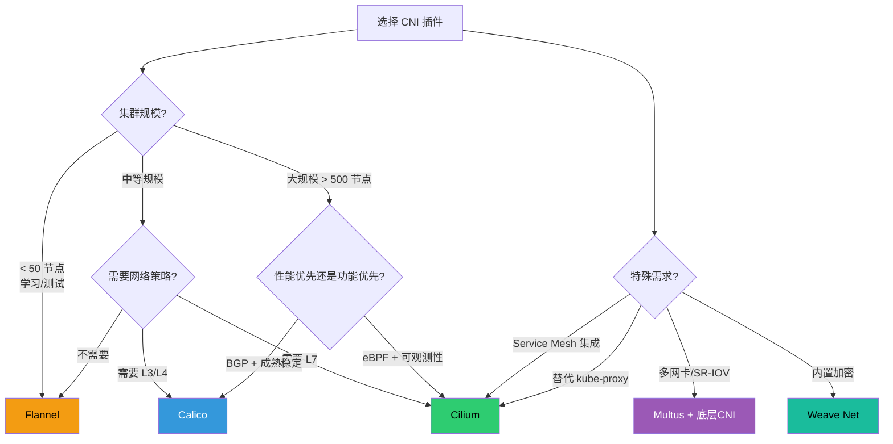

#kubernetes #cni

相关笔记：[[kubernetes-basics]] | [[csi]] | [[service]] | [[kube-proxy]] | [[network-model]] | [[k8s-interview]] | [[calico]] | [[cilium]] | [[cilium-deep-dive]] | [[flannel]] | [[weave]] | [[multus]] | [[cni-source]] | [[cni-troubleshooting]] | [[demo-cni-bridge]]

## CNI 概述

CNI（Container Network Interface）是一种标准接口，用于为容器（Pod）分配 IP、配置路由、连接网络。

### CNI 接口规范

CNI 插件本质上是一个可执行文件，kubelet 在创建/删除 Pod 时调用它，传入标准化的参数：

- **ADD**：Pod 创建时调用，分配 IP、创建 veth pair、设置路由
- **DEL**：Pod 删除时调用，清理网络资源
- **CHECK**：检查网络是否正常
- **VERSION**：返回支持的 CNI 版本

### CNI 工作流程

1. kubelet 创建 Pod 的 network namespace
2. kubelet 调用 CNI 插件的 ADD 命令
3. CNI 插件创建 veth pair，一端在 Pod 内（eth0），一端在宿主机
4. CNI 插件通过 IPAM 分配 IP 地址给 Pod
5. CNI 插件设置路由规则，确保 Pod 间可以通信

## CNI 插件概览

| 插件 | 特点 |
| --- | --- |
| Flannel | 简单，VXLAN 封装，适合小规模集群 |
| **Calico** | 功能最全，支持路由 + 策略控制 |
| **Cilium** | 基于 eBPF，性能高，支持 L7 策略和 Service Mesh |
| Weave Net | 内置加密，部署简单，适合中小集群 |
| Multus | 多网卡支持，电信/边缘计算场景 |
| Kube-OVN | 支持 L2/L3，企业级方案 |

各插件详解：

- **Calico**：详见 [[calico]]
- **Cilium**：详见 [[cilium]]
- **Flannel**：详见 [[flannel]]
- **Weave Net**：详见 [[weave]]
- **Multus**：详见 [[multus]]

## CNI 选型指南

### 按场景选型

### 对比表

| 维度 | Flannel | Calico | Cilium | Weave Net | Multus |
| --- | --- | --- | --- | --- | --- |
| **复杂度** | 低 | 中 | 中高 | 低 | 高（需搭配其他 CNI） |
| **NetworkPolicy** | 不支持 | L3/L4 | L3/L4/L7 | 基础 L3/L4 | 取决于底层 CNI |
| **性能** | 中 | 高（BGP 模式） | 最高（eBPF） | 中 | 取决于底层技术 |
| **加密** | 不支持 | WireGuard（可选） | WireGuard/IPsec | 内置 NaCl 加密 | 取决于底层 CNI |
| **可观测性** | 无 | 基础 | Hubble（强） | 基础 | 无 |
| **替代 kube-proxy** | 不支持 | 不支持 | 支持 | 不支持 | 不支持 |
| **Service Mesh** | 不支持 | 不支持 | 原生支持 | 不支持 | 不支持 |
| **多网卡** | 不支持 | 不支持 | 不支持 | 不支持 | 核心功能 |
| **内核要求** | 低 | 低 | 高（≥ 5.4，推荐 ≥ 5.10） | 低 | 取决于底层技术 |
| **社区活跃度** | 低（维护模式） | 高 | 最高 | 低（Weaveworks 已关闭） | 中 |

### 性能对比参考

> 以下数据为社区基准测试的大致范围，实际表现取决于内核版本、网卡、负载类型等因素。

| 指标 | Flannel (VXLAN) | Calico (BGP) | Cilium (eBPF) |
| --- | --- | --- | --- |
| TCP 吞吐量 | ~8 Gbps | ~9.5 Gbps | ~9.8 Gbps |
| 延迟（P99） | ~120 μs | ~80 μs | ~60 μs |
| 每节点内存占用 | ~30 MB | ~80 MB | ~150 MB |
| 每节点 CPU 占用 | 低 | 中 | 中（eBPF 编译时高） |
| 万级 Service 下的表现 | 明显下降 | 有所下降（iptables） | 几乎无影响（BPF map） |

### 推荐选型方案

| 场景 | 推荐 CNI | 理由 |
| --- | --- | --- |
| 学习/测试/小集群 | Flannel | 最简单，几乎零配置 |
| 生产环境通用 | Calico | 成熟稳定，功能全面，社区支持好 |
| 大规模 + 高性能 | Cilium | eBPF 在大规模集群优势明显，kube-proxy replacement 减少瓶颈 |
| 安全要求高 | Cilium / Calico | Cilium 支持 L7 策略 + WireGuard；Calico 支持 GlobalNetworkPolicy |
| Service Mesh 需求 | Cilium | 无 sidecar 方案，减少资源开销和延迟 |
| 电信/5G/边缘计算 | Multus + SR-IOV | 多网卡是刚需，需要数据面/控制面分离 |
| 需要加密且追求简单 | Weave Net | 内置加密，一键部署（注意 Weaveworks 已关闭，长期维护存疑） |

## 面试要点

**Q: CNI 是什么？它解决什么问题？**

> [!question]- 参考答案（点击展开）
>
> CNI 是容器网络接口规范，定义了 kubelet 与网络插件之间的标准接口。CNI 插件负责给 Pod 分配 IP、创建网络接口（veth pair）、设置路由，确保 Pod 间可以通信。

**Q: 常见 CNI 插件如何选型？**

> [!question]- 参考答案（点击展开）
>
> 小规模/学习用 Flannel；生产通用选 Calico（BGP + NetworkPolicy）；大规模高性能选 Cilium（eBPF）；需要多网卡选 Multus；需要加密选 Weave Net 或开启 Calico/Cilium 的 WireGuard。

**Q: eBPF 相比 iptables 有什么优势？**

> [!question]- 参考答案（点击展开）
>
> iptables 逐条匹配规则（O(n)），规则随 Service 数量线性增长；eBPF 使用 hash map 查找（O(1)），在内核最早的处理点拦截数据包，支持 JIT 编译为机器码，性能接近 native。详见 [[cilium]]。

## 深入学习

- **源码导读**：[[cni-source]] —— CNI 协议（env + stdin/stdout JSON）、libcni、`containernetworking/plugins` 的 bridge/host-local 源码、containerd 调 CNI 的端到端时序、Calico/Cilium/Flannel 数据面入口。
- **可运行 demo**：[[demo-cni-bridge]] —— 100 行 bash 实现 CNI bridge 插件，Mac 上 `./run-in-docker.sh` 一键跑通 ADD/DEL + veth + 互 ping。
