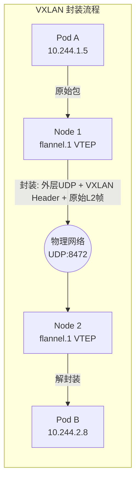

#kubernetes #cni #flannel

相关笔记：[[cni]] | [[network-model]] | [[calico]]

## Flannel 概述

Flannel 是最简单的 CNI 插件之一，由 CoreOS 开发，专注于为 Pod 提供 overlay 网络。

## VXLAN 模式 vs host-gw 模式

Flannel 支持多种后端（backend），最常用的是 VXLAN 和 host-gw：

| 对比项 | VXLAN 模式 | host-gw 模式 |
| --- | --- | --- |
| 原理 | 使用 VXLAN 隧道封装 L2 帧，跨节点通信走 UDP 封装 | 将对端节点 IP 设为网关，直接修改路由表 |
| 封装开销 | 有（VXLAN header 约 50 bytes） | 无，直接路由 |
| 性能 | 中等（封装/解封装有 CPU 开销） | 高（接近裸机网络性能） |
| 网络要求 | 节点间只要 L3 可达即可 | **节点必须在同一个 L2 网段**（二层直连） |
| 适用环境 | 跨子网、云环境、大多数场景 | 裸金属、同子网部署 |



## 安装

```bash
# 安装 Flannel
kubectl apply -f https://github.com/flannel-io/flannel/releases/latest/download/kube-flannel.yml

# 验证 Flannel Pod 运行状态
kubectl get pod -n kube-flannel

# 查看 flannel 网络配置
cat /run/flannel/subnet.env
```

## 适用场景

- 小规模集群（< 100 节点）
- 学习/开发/测试环境
- 不需要 NetworkPolicy
- 追求最简单的部署和运维

## 局限性

- 不支持 NetworkPolicy（需要配合 Calico policy-only 模式使用）
- 没有加密通信能力
- 不支持 L7 策略
- 功能单一，只解决 Pod 间通信问题
- 大规模集群性能一般

## 面试要点

**Q: 什么场景下应该选择 Flannel 而不是 Calico 或 Cilium？**

> [!question]- 参考答案（点击展开）
>
> Flannel 适用于小规模集群（< 100 节点）、不需要 NetworkPolicy、追求简单部署的场景。它的优势是配置极简、资源占用低、易于理解和排查。但它不支持网络策略，功能上远不如 Calico 和 Cilium。

**Q: Flannel 的 VXLAN 和 host-gw 模式有什么区别？**

> [!question]- 参考答案（点击展开）
>
> VXLAN 通过 UDP 封装实现跨子网通信，兼容性好但有封装开销；host-gw 直接修改路由表，性能接近裸机但要求节点在同一 L2 网段。
