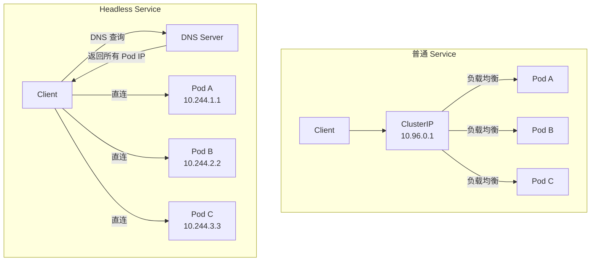

#kubernetes #service

相关笔记：[[service]] | [[kubernetes-basics]] | [[k8s-interview]]

## Headless Service 概述

在 Kubernetes 中，Headless Service 是一种特殊的服务类型，它的 `clusterIP` 设置为 `None`，没有虚拟的 IP 地址。它不会通过一个统一的入口来访问应用程序，而是通过 DNS 直接将流量导向每个 Pod。

## Headless Service vs 普通 Service



### 对比表

| 特点            | 普通 Service         | Headless Service   |
| ------------- | ------------------ | ------------------ |
| **ClusterIP** | 有（通过 ClusterIP 访问） | 无（clusterIP: None） |
| **负载均衡**      | 自动负载均衡，流量分发到 Pods  | 没有负载均衡，直接访问具体 Pod  |
| **DNS 解析**    | 解析到一个虚拟 IP         | 解析到多个 Pod 的 IP 地址  |
| **适用场景**      | 无状态应用，如 Web 服务     | 有状态应用，如数据库、缓存等     |

## 详细区别

### ClusterIP（虚拟 IP）

- **普通 Service**: 每个服务会分配一个虚拟 IP 地址，所有的请求都会通过这个虚拟 IP 进入，Kubernetes 自动将流量分发到不同的 Pod
- **Headless Service**: 没有虚拟 IP，直接通过 DNS 解析得到每个 Pod 的 IP 地址，客户端可以通过 DNS 直接访问特定的 Pod

### 负载均衡

- **普通 Service**: Kubernetes 会自动负载均衡，流量在后端 Pods 之间均匀分配。客户端不需要关心具体访问哪个 Pod
- **Headless Service**: 没有负载均衡，DNS 会返回所有 Pods 的 IP 地址，客户端自行选择连接到其中一个 Pod

### 适用场景

- **普通 Service**: 适合无状态的应用，比如普通的 Web 应用，你不需要知道具体的服务器
- **Headless Service**: 适合有状态的应用，比如需要知道具体每个 Pod 地址的数据库或缓存服务（如 ZooKeeper、Kafka），它们需要让客户端直接连接到特定的 Pod

### DNS 解析

- **普通 Service**: DNS 解析返回的是一个虚拟 IP 地址
- **Headless Service**: DNS 解析会返回所有 Pod 的 IP 地址

## YAML 示例

```yaml
apiVersion: v1
kind: Service
metadata:
  name: my-headless-svc
spec:
  clusterIP: None          # 关键：设置为 None
  selector:
    app: my-stateful-app
  ports:
    - port: 80
      targetPort: 8080
```

## 基于 Service 的服务发现

Kubernetes 内建了 DNS 服务，使得集群中的服务能够自动发现彼此。当你创建一个服务时，Kubernetes 会为它生成一个 DNS 名称。

### 普通 Service 的 DNS

`servicename.namespace.svc.cluster.local` 解析为 ClusterIP 地址，客户端通过这个地址访问服务。

### Headless Service 的 DNS

`pod-0.servicename.namespace.svc.cluster.local` 解析为 Pod 0 的 IP 地址，客户端可以直接访问该 Pod。

```bash
# 查看 Headless Service 的 DNS 解析结果
kubectl exec -it test-pod -- nslookup my-headless-svc

# 结果会返回所有后端 Pod 的 IP
# Name: my-headless-svc.default.svc.cluster.local
# Address: 10.244.1.5
# Address: 10.244.2.8
# Address: 10.244.3.3
```
