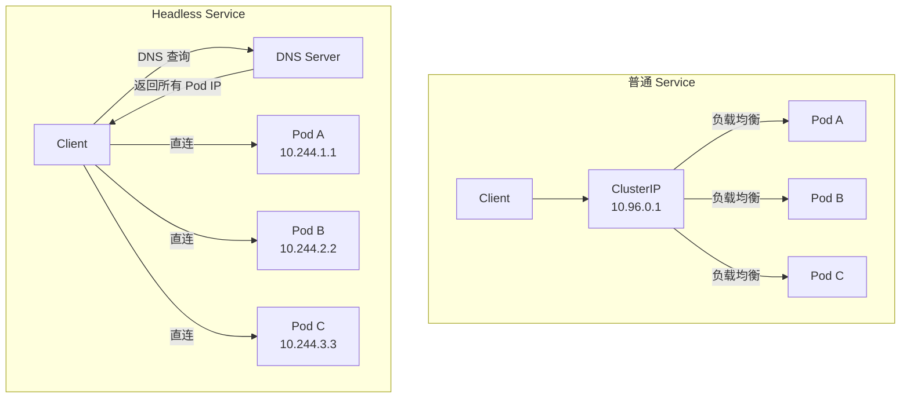

#kubernetes #service

相关笔记：[[service]] | [[kubernetes-basics]] | [[k8s-interview]]

## Headless Service 概述

在 Kubernetes 中，Headless Service 是一种特殊的服务类型，它的 `clusterIP` 设置为 `None`，没有虚拟的 IP 地址。它不会通过一个统一的入口来访问应用程序，而是通过 DNS 直接将流量导向每个 Pod。

## Headless Service vs 普通 Service



### 对比表

| 特点            | 普通 Service         | Headless Service   |
| ------------- | ------------------ | ------------------ |
| **ClusterIP** | 有（通过 ClusterIP 访问） | 无（clusterIP: None） |
| **负载均衡**      | 自动负载均衡，流量分发到 Pods  | 没有负载均衡，直接访问具体 Pod  |
| **DNS 解析**    | 解析到一个虚拟 IP         | 解析到多个 Pod 的 IP 地址  |
| **适用场景**      | 无状态应用，如 Web 服务     | 有状态应用，如数据库、缓存等     |

## 详细区别

### ClusterIP（虚拟 IP）

- **普通 Service**: 每个服务会分配一个虚拟 IP 地址，所有的请求都会通过这个虚拟 IP 进入，Kubernetes 自动将流量分发到不同的 Pod
- **Headless Service**: 没有虚拟 IP，直接通过 DNS 解析得到每个 Pod 的 IP 地址，客户端可以通过 DNS 直接访问特定的 Pod

### 负载均衡

- **普通 Service**: Kubernetes 会自动负载均衡，流量在后端 Pods 之间均匀分配。客户端不需要关心具体访问哪个 Pod
- **Headless Service**: 没有负载均衡，DNS 会返回所有 Pods 的 IP 地址，客户端自行选择连接到其中一个 Pod

### 适用场景

- **普通 Service**: 适合无状态的应用，比如普通的 Web 应用，你不需要知道具体的服务器
- **Headless Service**: 适合有状态的应用，比如需要知道具体每个 Pod 地址的数据库或缓存服务（如 ZooKeeper、Kafka），它们需要让客户端直接连接到特定的 Pod

### DNS 解析

- **普通 Service**: DNS 解析返回的是一个虚拟 IP 地址
- **Headless Service**: DNS 解析会返回所有 Pod 的 IP 地址

## YAML 示例

```yaml
apiVersion: v1
kind: Service
metadata:
  name: my-headless-svc
spec:
  clusterIP: None          # 关键：设置为 None
  selector:
    app: my-stateful-app
  ports:
    - port: 80
      targetPort: 8080
```

## 基于 Service 的服务发现

Kubernetes 内建了 DNS 服务，使得集群中的服务能够自动发现彼此。当你创建一个服务时，Kubernetes 会为它生成一个 DNS 名称。

### 普通 Service 的 DNS

`servicename.namespace.svc.cluster.local` 解析为 ClusterIP 地址，客户端通过这个地址访问服务。

### Headless Service 的 DNS

`pod-0.servicename.namespace.svc.cluster.local` 解析为 Pod 0 的 IP 地址，客户端可以直接访问该 Pod。

```bash
# 查看 Headless Service 的 DNS 解析结果
kubectl exec -it test-pod -- nslookup my-headless-svc

# 结果会返回所有后端 Pod 的 IP
# Name: my-headless-svc.default.svc.cluster.local
# Address: 10.244.1.5
# Address: 10.244.2.8
# Address: 10.244.3.3
```

## 面试要点

### 高频问题

**Q: 什么是 Headless Service？它和普通 Service 最本质的区别是什么？**
A: Headless Service 是 `clusterIP: None` 的特殊 Service，不分配虚拟 IP（VIP），也不经过 kube-proxy 做负载均衡。普通 Service 的 DNS 解析返回单个 ClusterIP，由内核（iptables/IPVS）转发到后端；Headless Service 的 DNS 解析直接返回所有就绪 Pod 的 IP 列表（A/AAAA 记录），客户端自己选择连哪个 Pod。

**Q: 为什么 StatefulSet 一定要配合 Headless Service？**
A: StatefulSet 需要每个 Pod 有稳定、可预测的网络标识。Headless Service 配合 `serviceName` 字段，为每个 Pod 生成形如 `<pod-name>.<service-name>.<namespace>.svc.cluster.local`（如 `web-0.nginx.default.svc.cluster.local`）的稳定 DNS 子域，即使 Pod 重建、IP 变化，域名仍解析到新 IP。数据库、ZooKeeper、Kafka 等有状态集群依赖这个固定标识做节点互相发现和选主。

**Q: Headless Service 的 DNS 解析会返回什么？普通 Service 呢？**
A: Headless Service 对 `<service>.<namespace>.svc.cluster.local` 的查询返回所有 Ready Pod 的 IP（多条 A 记录），客户端拿到全量列表自行决定连接；同时（在 StatefulSet 场景下）每个 Pod 还有独立的 `<pod-name>.<service>.<namespace>.svc.cluster.local` 记录。普通 Service 只返回一个 ClusterIP。可以用 `nslookup` 或 `dig` 验证两者差异。

**Q: Headless Service 没有 ClusterIP，那它还经过 kube-proxy 吗？流量怎么走？**
A: 不经过。因为没有 ClusterIP，kube-proxy 不会为它创建 iptables/IPVS 规则，没有 DNAT 和负载均衡。客户端从 DNS 拿到 Pod IP 后直连 Pod，流量是端到端的，少一层转发，延迟更低，但负载均衡和故障转移要客户端自己实现。

**Q: Headless Service 一定要配 selector 吗？没有 selector 会怎样？**
A: 不一定。带 selector 时，DNS 自动返回匹配且 Ready 的 Pod IP。不带 selector 时，需要手动创建同名 Endpoints/EndpointSlice，DNS 会返回你手填的地址，常用于把外部数据库、跨集群服务以 K8s service 名暴露给集群内部。

**Q: Headless Service 对 Pod 的 readiness 是怎么处理的？未就绪的 Pod 会出现在 DNS 里吗？**
A: 默认只有 Ready 的 Pod 才会被加入 DNS 解析结果。如果希望 Pod 在未就绪甚至刚启动时也能被解析到（StatefulSet 集群初始化阶段节点互相发现常需要），可以设置 `publishNotReadyAddresses: true`，这样未就绪地址也会写入 EndpointSlice 并被 DNS 返回。

**Q: 客户端从 Headless Service 拿到多个 Pod IP，负载均衡谁来做？**
A: K8s 不做，由客户端负责。DNS 返回多条记录时客户端可做轮询（很多 DNS 库会轮转记录顺序），或在应用层维护连接池、按业务逻辑选节点（如分片路由、就近连接、主从区分）。这正是有状态服务想要的——客户端需要明确知道连的是哪个具体节点。

### 面试加分点

- 能区分 Service 类型与 Headless 的关系：Headless 不是独立的 type，而是 ClusterIP 类型下 `clusterIP: None` 的特例；ExternalName 同样没有 ClusterIP，但它返回的是 CNAME 记录指向外部域名，而非 Pod IP。
- 理解 DNS 记录细节：带 selector 的 Headless Service 会为每个 Ready Pod 生成 A/AAAA 记录；若为普通 Pod 设置了 `hostname`/`subdomain`（subdomain 与 Headless Service 同名），还会得到稳定的 `<hostname>.<subdomain>.<namespace>.svc.cluster.local` A 记录。命名端口则额外暴露 `_port._proto.<service>...` 形式的 SRV 记录（SRV 用于端口发现，与上面的 A 记录是两类记录，别混为一谈）。
- 清楚 `publishNotReadyAddresses` 的演进：它取代了早期的 `service.alpha.kubernetes.io/tolerate-unready-endpoints` 注解（该注解约在 1.11 弃用），解决有状态集群启动期节点尚未 Ready 却需要彼此发现的鸡生蛋问题。
- 知道 EndpointSlice 的意义：大规模场景下单个 Endpoints 对象过大会有性能瓶颈，K8s 1.19 起 EndpointSlice GA 并默认承载后端地址，Headless Service 的 DNS 解析也基于它。
- 能指出 Headless Service 的局限：没有 VIP 意味着客户端要承担服务发现和容错，DNS 缓存（TTL）可能导致 Pod 扩缩容后客户端短时间连到已删除地址，生产中需配合合理的 DNS TTL 或客户端重连/健康检查。
- 实战经验：Pod 默认 `ndots:5` 的 resolv.conf 配置会让短域名查询放大成多次 search 域补全请求，调用 Headless Service 时用 FQDN（带末尾的 `.cluster.local` 或结尾的 `.`）或调整 ndots 可减少无谓 DNS 查询。
