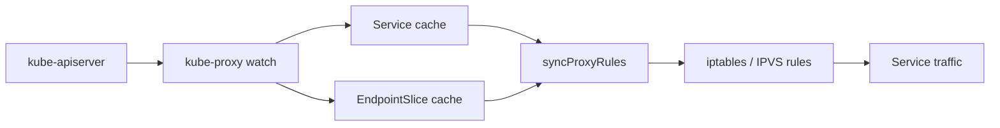
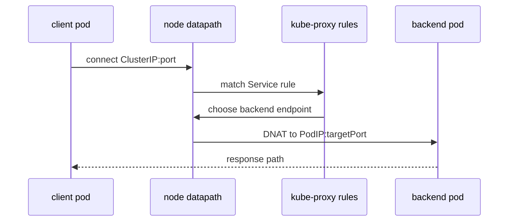

#kubernetes #networking #service

相关笔记：[[service]] | [[network-model]] | [[cni]] | [[cilium-deep-dive]] | [[cni-troubleshooting]] | [[k8s-interview]]

## 概述

`kube-proxy` 负责把 Kubernetes Service 这个逻辑抽象落到每个 Node 的数据面规则里。它不创建 Pod 网卡，也不分配 Pod IP；这些属于 CNI。它做的是监听 Service / EndpointSlice 变化，然后在节点上维护转发规则，让访问 ClusterIP / NodePort / LoadBalancer VIP 的流量能被转发到后端 Pod。

一句话边界：

- **CNI**：解决 Pod 怎么接入网络、Pod IP 怎么分配、跨节点 Pod 怎么互通。
- **kube-proxy**：解决 Service VIP 怎么转发到后端 Pod。
- **CoreDNS**：解决 Service 名字怎么解析到 ClusterIP 或 Headless 后端地址。
- **Ingress / Gateway**：解决集群外七层流量怎么进入 Service。

## 控制面输入

kube-proxy 主要 watch 两类对象：

| 对象 | 作用 |
| --- | --- |
| `Service` | 决定 VIP、端口、协议、session affinity、externalTrafficPolicy |
| `EndpointSlice` | 决定后端 Pod IP、端口、ready/terminating 状态、拓扑信息 |

控制循环可以简化成：



关键点：kube-proxy 是**每个节点一份**的 DaemonSet。每个节点都维护完整的 Service 转发表，但只在本节点的数据面生效。

## 三种数据面模式

### iptables 模式

iptables 模式通过 NAT 链把 Service VIP DNAT 到某个后端 Pod IP。

典型路径：

```text
packet -> PREROUTING/OUTPUT -> KUBE-SERVICES -> KUBE-SVC-xxxx -> KUBE-SEP-yyyy -> DNAT to PodIP
```

特点：

- 实现简单，兼容性好。
- 规则数量随 Service / Endpoint 增长。
- 负载均衡本质是 iptables statistic 随机匹配。
- 排障时重点看 `nat` 表里的 `KUBE-*` 链。

### IPVS 模式

IPVS 模式把 Service VIP 建成 Linux IPVS virtual server，把 Pod IP 建成 real server。

特点：

- 大规模 Service 下查找和转发效率更好。
- 支持更多负载均衡算法。
- 仍然需要少量 iptables 规则做入口捕获和 masquerade。
- 排障时同时看 `ipvsadm` 和 iptables。

### eBPF 替代 kube-proxy

Cilium 这类 CNI 可以在 eBPF 数据面里实现 Service 转发，从而不再运行 kube-proxy。此时 Service 转发规则不在 `KUBE-SERVICES` 里，而在 BPF program 和 BPF map 里。

注意：这不是 Kubernetes Service 抽象消失了，而是 Service 的**节点数据面实现**从 kube-proxy 换成了 CNI/eBPF。

## ClusterIP 转发链路



如果 client 和 backend 在同一节点，流量通常只经过本节点规则；如果 backend 在其他节点，后续跨节点转发由 CNI 数据面负责。

## NodePort 与 externalTrafficPolicy

`NodePort` 在每个节点打开一个端口，把 `<NodeIP>:nodePort` 转发到 Service 后端。

`externalTrafficPolicy` 决定外部流量的保源地址和节点选择：

| 策略 | 行为 | 代价 |
| --- | --- | --- |
| `Cluster` | 任意节点都可接收流量，再转发到任意后端 | 可能 SNAT，源 IP 不保真 |
| `Local` | 只转发到本节点本地后端 | 保留源 IP，但节点无本地后端会丢流量 |

面试里常问的陷阱：`externalTrafficPolicy: Local` 不是为了性能，而是为了**保留源 IP**和避免跨节点二次转发；代价是负载均衡器必须只把流量打到有本地 endpoint 的节点。

## 排查命令

```bash
kubectl get svc,endpointslice -A
kubectl describe svc <service-name>
kubectl -n kube-system logs ds/kube-proxy
```

iptables 模式：

```bash
iptables-save -t nat | grep KUBE-SERVICES
iptables-save -t nat | grep <service-name>
iptables-save -t nat | grep <cluster-ip>
```

IPVS 模式：

```bash
ipvsadm -Ln
ipvsadm -Ln --stats
ip route get <pod-ip>
```

Cilium kube-proxy replacement：

```bash
cilium status
cilium service list
cilium bpf lb list
```

## 常见问题

| 现象 | 优先检查 |
| --- | --- |
| Service 无法访问 | Service selector 是否匹配 Pod、EndpointSlice 是否有 ready endpoint |
| ClusterIP 能通，DNS 名不通 | CoreDNS、Pod `/etc/resolv.conf`、Service FQDN |
| NodePort 外部不通 | 节点防火墙、安全组、nodePort 范围、externalTrafficPolicy |
| 只有跨节点不通 | CNI 路由/隧道/BGP，而不是 kube-proxy |
| kube-proxy replacement 下查不到 iptables | 看 Cilium BPF map，不要继续找 `KUBE-*` 链 |

## 面试要点

### Q: kube-proxy 和 CNI 的边界是什么？

A: CNI 负责 Pod 入网和 Pod 间连通；kube-proxy 负责把 Service VIP 转成后端 Pod IP。Service 选后端之后，跨节点包怎么走仍然依赖 CNI 数据面。

### Q: iptables 和 IPVS 模式差异是什么？

A: iptables 模式用 NAT 链规则逐步匹配并 DNAT；IPVS 模式把 Service 建成 virtual server，把 endpoint 建成 real server。IPVS 在大规模 Service / Endpoint 下更适合，但仍需要 iptables 做入口捕获和 SNAT 辅助。

### Q: Cilium 替代 kube-proxy 后，Service 还存在吗？

A: Service API 仍然存在，只是节点转发实现从 kube-proxy 的 iptables/IPVS 变成 eBPF program + BPF map。排障时要看 Cilium 的 service map，而不是 `KUBE-SERVICES`。

