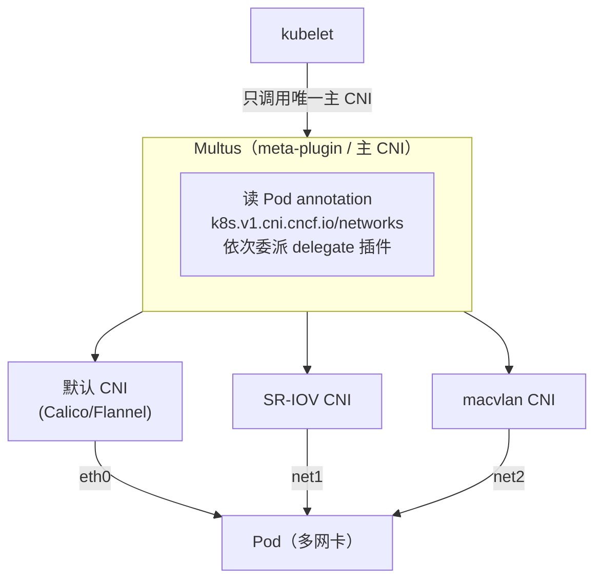

#kubernetes #cni #multus

相关笔记：[[cni]] | [[network-model]] | [[calico]] | [[cilium]]

## Multus CNI 概述

Multus 不是传统意义的 CNI 插件，而是一个 **meta-plugin**（元插件），它允许一个 Pod 同时拥有多个网络接口（多网卡）。

## 工作原理

标准 Kubernetes 只允许每个 Pod 有一个 CNI 插件提供一个网络接口（eth0）。Multus 作为主 CNI 被调用后，会依次调用其他 CNI 插件来创建额外的网络接口。



kubelet 仍然只认一个主 CNI；Multus 把自己伪装成主 CNI，再按 annotation 把请求分发给各个 delegate 插件，每个插件给 Pod 加一块网卡。

## NetworkAttachmentDefinition 示例

```yaml
# 定义一个 SR-IOV 网络
apiVersion: k8s.cni.cncf.io/v1
kind: NetworkAttachmentDefinition
metadata:
  name: sriov-net
  annotations:
    k8s.v1.cni.cncf.io/resourceName: intel.com/sriov_netdevice
spec:
  config: |
    {
      "type": "sriov",
      "cniVersion": "0.3.1",
      "vlan": 100,
      "ipam": {
        "type": "host-local",
        "subnet": "10.56.217.0/24"
      }
    }
---
# Pod 使用多网卡
apiVersion: v1
kind: Pod
metadata:
  name: multi-nic-pod
  annotations:
    k8s.v1.cni.cncf.io/networks: sriov-net
spec:
  containers:
    - name: app
      image: myapp:latest
      resources:
        requests:
          intel.com/sriov_netdevice: "1"
        limits:
          intel.com/sriov_netdevice: "1"
```

上面的 Pod 会有两个网络接口：`eth0`（默认 CNI 提供）和 `net1`（SR-IOV 网络）。

## MACVLAN 网络示例

```yaml
apiVersion: k8s.cni.cncf.io/v1
kind: NetworkAttachmentDefinition
metadata:
  name: macvlan-net
spec:
  config: |
    {
      "cniVersion": "0.3.1",
      "type": "macvlan",
      "master": "eth0",
      "mode": "bridge",
      "ipam": {
        "type": "host-local",
        "subnet": "192.168.1.0/24",
        "rangeStart": "192.168.1.200",
        "rangeEnd": "192.168.1.250"
      }
    }
```

## 多网卡技术对比

| 技术 | 说明 | 场景 |
| --- | --- | --- |
| **SR-IOV** | 网卡硬件虚拟化，Pod 直接使用物理网卡的 Virtual Function | 高性能网络 I/O（接近裸机性能） |
| **DPDK** | 用户态网络驱动，绕过内核协议栈 | 电信数据面、包处理 |
| **MACVLAN** | 在同一物理网卡上创建多个虚拟 MAC 地址 | Pod 需要直接出现在物理网络中 |
| **IPVLAN** | 类似 MACVLAN 但共享 MAC 地址 | 对 MAC 地址数量有限制的环境 |

## 电信/边缘计算场景

5G 核心网（5GC）的 UPF（User Plane Function）是 Multus 的典型使用场景：

- **N3 接口**（到 gNB）：需要高吞吐量，使用 SR-IOV 直通
- **N6 接口**（到 Data Network）：需要与外部网络互通
- **N4 接口**（到 SMF）：控制面通信，使用普通 CNI 即可

每个接口走不同的网络，Multus 让一个 Pod 同时接入所有这些网络。

## 安装

```bash
# 安装 Multus CNI
kubectl apply -f https://raw.githubusercontent.com/k8snetworkplumbingwg/multus-cni/master/deployments/multus-daemonset-thick.yml

# 验证 Multus Pod 运行状态
kubectl get pod -n kube-system -l app=multus

# 查看已定义的 NetworkAttachmentDefinition
kubectl get net-attach-def -A
```

## 面试要点

**Q: Multus CNI 解决什么问题？**

> [!question]- 参考答案（点击展开）
>
> Multus 允许一个 Pod 同时接入多个网络（多网卡），解决了标准 CNI 只能给 Pod 分配一个网络接口的限制。典型场景是电信/5G 核心网中，控制面和数据面需要走不同网络，或者需要 SR-IOV 直通网卡获取接近裸机的网络性能。

**Q: SR-IOV 和 DPDK 有什么区别？**

> [!question]- 参考答案（点击展开）
>
> SR-IOV 是网卡硬件虚拟化技术，Pod 直接使用物理网卡的 Virtual Function，仍然走内核协议栈但性能接近裸机；DPDK 是用户态网络驱动，完全绕过内核协议栈，适合电信数据面的高吞吐包处理场景。
