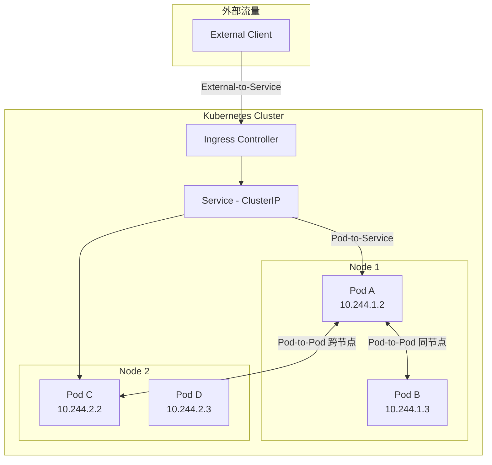
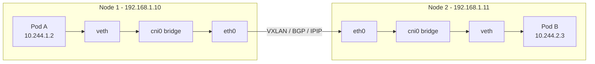
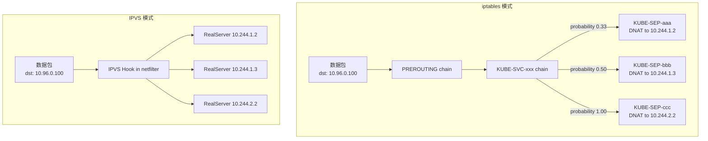
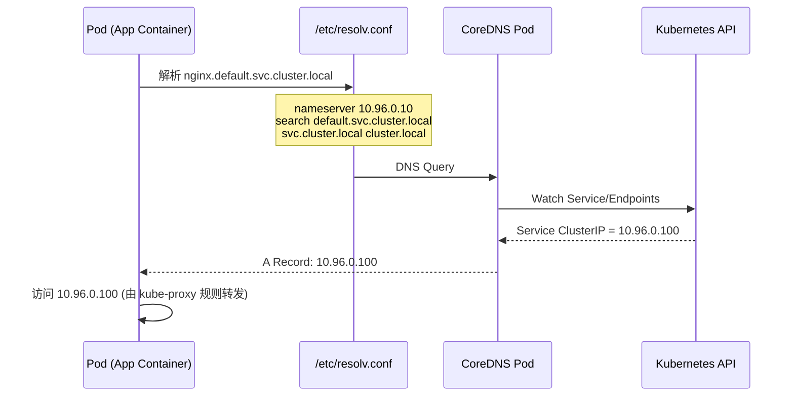
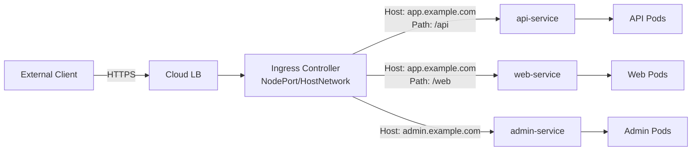

#kubernetes #networking

相关笔记：[[cni]] | [[service]] | [[headless-service]] | [[k8s-interview]]

## Kubernetes 网络模型概述

Kubernetes 对集群网络有一套清晰的设计约束，称为 **Kubernetes Network Model**。所有 CNI 插件都必须满足以下三大原则：

### 三大原则

| 原则 | 说明 |
| --- | --- |
| **Pod-to-Pod** | 所有 Pod 之间可以直接通信，无需 NAT（不管是否在同一个 Node 上） |
| **Pod-to-Service** | Pod 通过 ClusterIP / DNS 名称访问 Service，由 kube-proxy 实现负载均衡 |
| **External-to-Service** | 集群外部流量通过 NodePort / LoadBalancer / Ingress 进入集群 |

补充约束：
- 每个 Pod 拥有独立的 IP 地址（IP-per-Pod）
- Pod 内所有容器共享同一个 Network Namespace（通过 pause 容器实现）
- Node 上的 agent（kubelet、kube-proxy）可以和该 Node 上所有 Pod 通信



## Pod 网络

### 核心概念

- **veth pair**：一对虚拟网络设备，一端在 Pod 的 Network Namespace 中（`eth0`），另一端在 Host 的 Root Namespace 中（`vethXXX`）
- **cni0 / cbr0 bridge**：Linux 网桥，连接同一 Node 上所有 Pod 的 veth 端
- **pause 容器**：Pod 中第一个启动的容器，创建并持有 Network Namespace，其他容器加入该 Namespace

### 同节点 Pod 通信

同一 Node 上的 Pod 通过 Linux bridge 直接通信，不经过任何封装或路由：

```
Pod A (eth0) --> vethA --> cni0 bridge --> vethB --> Pod B (eth0)
```

流程：
1. Pod A 发包到 `eth0`，通过 veth pair 到达 Host 上的 `vethA`
2. `vethA` 连接在 `cni0` 网桥上，bridge 查 MAC 表找到 `vethB`
3. 数据包通过 `vethB` 到达 Pod B 的 `eth0`

### 跨节点 Pod 通信

不同 Node 上的 Pod 通信需要 CNI 插件提供 overlay 或路由方案：



| 方式 | 代表 CNI | 原理 |
| --- | --- | --- |
| VXLAN（Overlay） | Flannel, Calico | 将 Pod 包封装在 UDP 中，通过 Node 网络传输 |
| BGP（路由） | Calico | 直接在 Node 之间交换路由表，无封装开销 |
| IPIP（隧道） | Calico | IP-in-IP 封装，比 VXLAN 轻量 |
| eBPF | Cilium | 在内核层直接转发，跳过 iptables |

### 调试命令

```bash
# 查看 Pod 的 veth pair
kubectl exec <pod> -- ip addr

# 在 Node 上查看 bridge 连接
brctl show cni0

# 查看 Node 上的路由表
ip route | grep 10.244

# 抓包分析跨节点流量
tcpdump -i eth0 -nn host 10.244.2.3

# 查看 veth pair 对应关系
ip link show type veth
```

## Service 网络

### ClusterIP 实现原理

ClusterIP 是一个**虚拟 IP**，不绑定在任何网卡上。它的流量转发完全由 kube-proxy 通过 iptables 或 IPVS 规则实现。

流程：
1. 用户创建 Service，API Server 分配 ClusterIP（如 `10.96.0.100`）
2. Endpoints Controller 监听 Pod 变化，维护 Endpoints 列表
3. kube-proxy 监听 Service + Endpoints 变化，在每个 Node 上生成转发规则
4. Pod 访问 ClusterIP 时，数据包在**内核态**被 DNAT 到真实的 Pod IP

### iptables vs IPVS



| 对比维度 | iptables | IPVS |
| --- | --- | --- |
| 实现方式 | DNAT 规则链，逐条匹配 | 内核级哈希表查找 |
| 时间复杂度 | O(n)，规则越多越慢 | O(1)，性能稳定 |
| 负载均衡算法 | 随机（基于 probability） | rr / wrr / lc / sh 等多种算法 |
| 适用规模 | < 1000 Service | 大规模集群 |
| 会话保持 | 需要额外 iptables 规则 | 原生支持 |
| 调试工具 | `iptables -t nat -L` | `ipvsadm -Ln` |

### 调试命令

```bash
# 查看 iptables 中 Service 的 DNAT 规则
iptables -t nat -L KUBE-SERVICES -n | grep <clusterIP>

# 追踪具体 Service 的转发链
iptables -t nat -L KUBE-SVC-XXXXXX -n

# IPVS 模式下查看虚拟服务器
ipvsadm -Ln

# 查看 Endpoints
kubectl get endpoints <service-name>

# 验证 kube-proxy 模式
kubectl logs -n kube-system <kube-proxy-pod> | grep "Using"
```

## kube-proxy 三种模式

### 1. userspace 模式（已废弃）

最早期的实现，流量从内核态 -> 用户态（kube-proxy 进程） -> 内核态，性能极差：

- kube-proxy 监听一个随机端口
- iptables 将 ClusterIP 流量 redirect 到该端口
- kube-proxy 在用户态做负载均衡后转发到 Pod

### 2. iptables 模式（默认）

完全在内核态完成转发，不经过 kube-proxy 进程：

- kube-proxy 只负责**写规则**，不参与数据转发
- 通过 `random` 模块实现概率负载均衡
- 缺点：规则数量 = O(Service × Endpoints)，大集群下规则膨胀严重

### 3. IPVS 模式（推荐大集群使用）

基于 Linux 内核的 IPVS（IP Virtual Server）模块：

- kube-proxy 将 Service 配置为 IPVS virtual server
- 用 `ipset` 存储 ClusterIP 集合，避免大量 iptables 规则
- 支持多种负载均衡算法：Round Robin、Least Connection、Source Hashing 等

启用方式：
```yaml
# kube-proxy ConfigMap
apiVersion: v1
kind: ConfigMap
metadata:
  name: kube-proxy
  namespace: kube-system
data:
  config.conf: |
    mode: "ipvs"
    ipvs:
      scheduler: "rr"
```

## CoreDNS

CoreDNS 是 Kubernetes 集群内的 DNS 服务器，负责 Service 发现与名称解析。

### DNS 记录格式

| 资源类型 | DNS 格式 | 示例 |
| --- | --- | --- |
| 普通 Service | `<svc>.<ns>.svc.cluster.local` | `nginx.default.svc.cluster.local` |
| Headless Service | `<pod-name>.<svc>.<ns>.svc.cluster.local` | `web-0.nginx.default.svc.cluster.local` |
| Pod（可选） | `<pod-ip-dashed>.<ns>.pod.cluster.local` | `10-244-1-2.default.pod.cluster.local` |
| ExternalName | CNAME 记录 | 指向外部域名 |

### DNS 解析流程



### 短域名解析搜索链

Pod 中访问 `nginx` 时，会依次尝试：
1. `nginx.default.svc.cluster.local`
2. `nginx.svc.cluster.local`
3. `nginx.cluster.local`

这由 `/etc/resolv.conf` 中的 `search` 配置决定，可通过 Pod spec 的 `dnsPolicy` 和 `dnsConfig` 自定义。

### CoreDNS 配置（Corefile）

```
.:53 {
    errors
    health {
        lameduck 5s
    }
    ready
    kubernetes cluster.local in-addr.arpa ip6.arpa {
        pods insecure
        fallthrough in-addr.arpa ip6.arpa
        ttl 30
    }
    prometheus :9153
    forward . /etc/resolv.conf
    cache 30
    loop
    reload
    loadbalance
}
```

### 调试命令

```bash
# 在 Pod 内测试 DNS 解析
kubectl exec -it <pod> -- nslookup nginx.default.svc.cluster.local

# 使用 debug 容器
kubectl run dnsutils --image=tutum/dnsutils --rm -it -- dig nginx.default.svc.cluster.local

# 查看 CoreDNS 日志
kubectl logs -n kube-system -l k8s-app=kube-dns

# 查看 Pod 的 DNS 配置
kubectl exec <pod> -- cat /etc/resolv.conf
```

## Ingress 和 Gateway API

### Ingress

Ingress 是 L7（HTTP/HTTPS）层的流量入口，通过 Ingress Controller（如 Nginx Ingress、Traefik）实现反向代理和路由。



#### Ingress YAML 示例

```yaml
apiVersion: networking.k8s.io/v1
kind: Ingress
metadata:
  name: app-ingress
  annotations:
    nginx.ingress.kubernetes.io/rewrite-target: /
    nginx.ingress.kubernetes.io/ssl-redirect: "true"
spec:
  ingressClassName: nginx
  tls:
  - hosts:
    - app.example.com
    secretName: app-tls-secret
  rules:
  - host: app.example.com
    http:
      paths:
      - path: /api
        pathType: Prefix
        backend:
          service:
            name: api-service
            port:
              number: 80
      - path: /web
        pathType: Prefix
        backend:
          service:
            name: web-service
            port:
              number: 80
```

### Gateway API

Gateway API 是 Ingress 的下一代替代方案（从 v1.0 GA 开始），提供更强的表达能力和角色分离：

| 对比维度 | Ingress | Gateway API |
| --- | --- | --- |
| API 成熟度 | Stable，功能有限 | v1.0+ GA，功能丰富 |
| 协议支持 | HTTP/HTTPS | HTTP, HTTPS, TCP, UDP, gRPC, TLS |
| 角色分离 | 单一资源 | GatewayClass / Gateway / HTTPRoute 三层分离 |
| 跨 Namespace | 不原生支持 | ReferenceGrant 实现安全跨 Namespace 引用 |
| Header 修改 | 依赖 annotation | 原生 RequestHeaderModifier |

核心资源：
- **GatewayClass**：定义网关实现（类似 StorageClass）
- **Gateway**：定义监听端口和协议（基础设施团队管理）
- **HTTPRoute / TCPRoute**：定义路由规则（应用团队管理）

```yaml
apiVersion: gateway.networking.k8s.io/v1
kind: HTTPRoute
metadata:
  name: app-route
spec:
  parentRefs:
  - name: my-gateway
  hostnames:
  - "app.example.com"
  rules:
  - matches:
    - path:
        type: PathPrefix
        value: /api
    backendRefs:
    - name: api-service
      port: 80
```

## NetworkPolicy

NetworkPolicy 是 Kubernetes 原生的**网络策略**资源，用于控制 Pod 之间以及 Pod 与外部的流量。

> 注意：NetworkPolicy 需要 CNI 插件支持（如 Calico、Cilium），Flannel 默认不支持。

### 默认行为

- 没有任何 NetworkPolicy 时：所有 Pod 之间可以自由通信（全开放）
- 一旦某个 Pod 被任何 NetworkPolicy 选中：未被显式允许的流量将被**拒绝**

### NetworkPolicy YAML 示例

```yaml
# 示例 1：只允许同 Namespace 内带 role=frontend 标签的 Pod 访问 role=backend 的 80 端口
apiVersion: networking.k8s.io/v1
kind: NetworkPolicy
metadata:
  name: backend-allow-frontend
  namespace: production
spec:
  podSelector:
    matchLabels:
      role: backend
  policyTypes:
  - Ingress
  ingress:
  - from:
    - podSelector:
        matchLabels:
          role: frontend
    ports:
    - protocol: TCP
      port: 80
---
# 示例 2：默认拒绝所有入站流量（Zero Trust 起点）
apiVersion: networking.k8s.io/v1
kind: NetworkPolicy
metadata:
  name: default-deny-ingress
  namespace: production
spec:
  podSelector: {}
  policyTypes:
  - Ingress
---
# 示例 3：允许特定 CIDR 的 Egress 流量
apiVersion: networking.k8s.io/v1
kind: NetworkPolicy
metadata:
  name: allow-external-db
  namespace: production
spec:
  podSelector:
    matchLabels:
      app: api-server
  policyTypes:
  - Egress
  egress:
  - to:
    - ipBlock:
        cidr: 10.0.0.0/24
    ports:
    - protocol: TCP
      port: 3306
```

### 调试命令

```bash
# 查看 Namespace 下所有 NetworkPolicy
kubectl get networkpolicy -n production

# 查看具体策略详情
kubectl describe networkpolicy backend-allow-frontend -n production

# 测试连通性
kubectl exec -n production <frontend-pod> -- curl -s --max-time 3 http://<backend-pod-ip>:80

# Calico 下查看实际 iptables 规则
iptables -L -n | grep cali
```

## 常见 CNI 插件对比

| 特性 | Calico | Flannel | Cilium | Weave |
| --- | --- | --- | --- | --- |
| **数据平面** | iptables / eBPF | VXLAN / host-gw | eBPF | VXLAN / fastdp |
| **NetworkPolicy** | 完整支持 | 不支持 | 完整支持（L3-L7） | 支持 |
| **路由方式** | BGP / IPIP / VXLAN | VXLAN / host-gw | eBPF 直接路由 | 自动选择 |
| **性能** | 高（BGP 模式最优） | 中等 | 最高（eBPF） | 中等 |
| **加密** | WireGuard | 不支持 | WireGuard / IPsec | IPsec（内置） |
| **可观测性** | 一般 | 弱 | 强（Hubble） | 一般 |
| **L7 策略** | 不支持 | 不支持 | 支持（HTTP/gRPC/Kafka） | 不支持 |
| **适用场景** | 通用，大规模生产集群 | 学习、小规模集群 | 高性能、安全要求高 | 小规模、快速部署 |
| **复杂度** | 中 | 低 | 高 | 低 |

选型建议：
- **学习/测试**：Flannel（最简单）
- **通用生产环境**：Calico（功能全面、社区成熟）
- **高性能/安全敏感**：Cilium（eBPF 加持，L7 策略）
- **快速部署小集群**：Weave（零配置）

## 面试要点

### 高频问题

**Q: Kubernetes 网络模型的核心要求是什么？**
> 所有 Pod 之间可直接通信，无需 NAT；每个 Pod 有独立 IP；Node 上的进程可以和 Pod 通信。

**Q: 同节点 Pod 如何通信？跨节点呢？**
> 同节点通过 Linux bridge（cni0）直接二层转发。跨节点取决于 CNI 插件：Flannel 用 VXLAN 封装，Calico 用 BGP 路由或 IPIP 隧道，Cilium 用 eBPF。

**Q: ClusterIP 是如何实现的？**
> ClusterIP 是虚拟 IP，不绑定在任何网卡上。kube-proxy 在每个 Node 上生成 iptables DNAT 规则或 IPVS 虚拟服务器，将访问 ClusterIP 的流量在内核态转发到后端 Pod。

**Q: iptables 和 IPVS 有什么区别？**
> iptables 逐条匹配规则，O(n) 复杂度，大集群下性能下降；IPVS 基于内核哈希表，O(1) 查找，支持多种负载均衡算法（rr, lc, sh），适合大规模集群。

**Q: kube-proxy 三种模式的区别？**
> userspace（已废弃，用户态转发）→ iptables（默认，内核态规则链）→ IPVS（推荐大集群，内核级哈希 + 多种调度算法）。

**Q: Pod 内的 DNS 是怎么解析的？**
> Pod 的 `/etc/resolv.conf` 指向 CoreDNS（ClusterIP 10.96.0.10），域名按 `search` 配置补全后发往 CoreDNS，CoreDNS 通过 Watch Kubernetes API 返回 Service 对应的 ClusterIP。

**Q: NetworkPolicy 的默认行为？**
> 默认全开放。一旦 Pod 被某条 NetworkPolicy 选中，则未被显式允许的方向（Ingress/Egress）流量会被拒绝。

**Q: Calico、Flannel、Cilium 怎么选？**
> 小集群/学习用 Flannel；通用生产环境用 Calico（BGP 路由 + NetworkPolicy）；高性能/需要 L7 策略用 Cilium（eBPF）。

### 排查思路速查

| 问题现象 | 排查方向 |
| --- | --- |
| Pod 无法访问 Service | 检查 Endpoints 是否为空、kube-proxy 是否正常、iptables/IPVS 规则是否存在 |
| 跨节点 Pod 不通 | 检查 CNI 插件状态、Node 间网络是否通、路由表是否正确 |
| DNS 解析失败 | 检查 CoreDNS Pod 是否 Running、`/etc/resolv.conf` 配置、CoreDNS 日志 |
| NetworkPolicy 不生效 | 确认 CNI 是否支持（Flannel 不支持）、检查 podSelector 是否匹配 |
| Service 负载不均 | 检查 kube-proxy 模式（iptables 随机分配）、考虑切换 IPVS + 合适的调度算法 |
