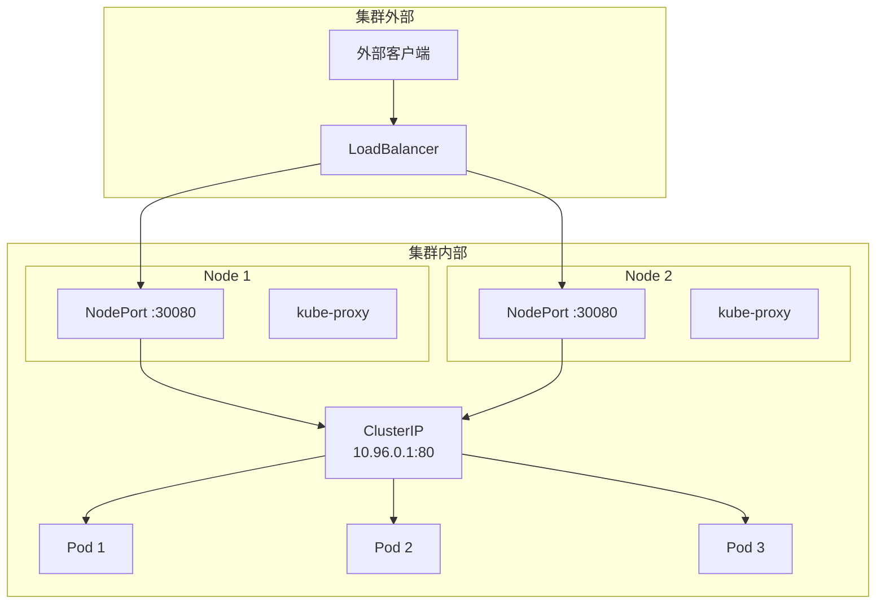

#service

相关笔记：[[kubernetes-basics]] | [[headless-service]] | [[cni]] | [[kube-proxy]] | [[network-model]] | [[k8s-interview]]

## Service 概述

Service 是将多个 Pod 划分到同一个逻辑组中，并统一向外提供服务的抽象。Pod 通过 Label Selector 加入到指定的 Service 中。

Service 相当于一个负载均衡器，用户请求会先到达 Service，再由 Service 转发到它内部的某个 Pod 上。

## Service 类型

通过 `services.spec.type` 字段来指定 Service 类型：



### ClusterIP

用于**集群内部**访问。该类型会为 Service 分配一个 ClusterIP，集群内部请求先到达 Service，再由 Service 转发到其内部的某个 Pod 上。

```yaml
apiVersion: v1
kind: Service
metadata:
  name: my-service
spec:
  type: ClusterIP
  selector:
    app: my-app
  ports:
    - port: 80
      targetPort: 8080
```

### NodePort

用于**集群外部**访问。该类型会将 Service 的 Port 映射到集群的每个 Node 节点上，然后在集群之外就能通过 Node 节点上的映射端口访问到这个 Service。

```yaml
apiVersion: v1
kind: Service
metadata:
  name: my-service
spec:
  type: NodePort
  selector:
    app: my-app
  ports:
    - port: 80
      targetPort: 8080
      nodePort: 30080    # 范围 30000-32767
```

### LoadBalancer

用于**集群外部**访问。该类型是在所有 Node 节点前又挂了一个负载均衡器，作为集群外部访问的统一入口。外部流量会先到达 LoadBalancer，再由它转发到集群的 Node 节点上，通过 NodePort 再转发给对应的 Service，最后由 Service 转发到后端 Pod 中。

```yaml
apiVersion: v1
kind: Service
metadata:
  name: my-service
spec:
  type: LoadBalancer
  selector:
    app: my-app
  ports:
    - port: 80
      targetPort: 8080
```

### ExternalName

创建一个 DNS 别名（即 CNAME）并指向到某个 Service Name 上，当有请求访问这个 CNAME 时会自动解析到这个 Service Name 上。

```yaml
apiVersion: v1
kind: Service
metadata:
  name: my-service
spec:
  type: ExternalName
  externalName: my.database.example.com
```

## 常用命令

```bash
# 查看所有 Service
kubectl get svc

# 查看 Service 详情
kubectl describe svc my-service

# 查看 Service 对应的 Endpoints
kubectl get endpoints my-service
```

## 面试要点

### 高频问题

**Q: Service 和 Pod 是怎么关联起来的？**
A: Service 通过 `spec.selector` 里的 Label Selector 匹配一组 Pod。Endpoints Controller 会持续监听匹配的 Pod，把它们的 IP:Port 写入同名的 Endpoints（或 EndpointSlice）对象。Service 本身不直接保存 Pod 列表，真正的后端地址存在 Endpoints/EndpointSlice 中，kube-proxy 据此生成转发规则。

**Q: Service 的几种类型有什么区别？**
A: ClusterIP 只在集群内访问，分配一个虚拟 IP；NodePort 在每个 Node 上开放 30000-32767 范围的端口供外部访问，底层仍依赖 ClusterIP；LoadBalancer 在 NodePort 之上由云厂商挂一个外部负载均衡器作为统一入口；ExternalName 不分配 IP、不做代理，只是返回一条 CNAME 记录把请求引向外部域名。默认情况下它们是层层叠加的关系（LoadBalancer 包含 NodePort，NodePort 包含 ClusterIP）。

**Q: ClusterIP 是真实存在的 IP 吗？请求是怎么到达 Pod 的？**
A: ClusterIP 是一个虚拟 IP（VIP），不绑定在任何网卡上，集群里 ping 不通也无法抓到它的包。kube-proxy 监听 Service/Endpoints 变化，在每个节点上配置 iptables 或 IPVS 规则，当流量发往 ClusterIP:Port 时通过 DNAT 改写目标地址，负载均衡到某个后端 Pod IP。

**Q: kube-proxy 的 iptables 模式和 IPVS 模式有什么区别？**
A: iptables 模式用链式规则做 DNAT，规则数量随 Service 数量线性增长，匹配是 O(n)，Service 很多时性能下降明显，且默认基于 `statistic` 模块按概率随机选后端，而非严格轮询。IPVS 是内核中独立的 L4 负载均衡子系统（LVS），挂在 netfilter 钩子上、用自己的哈希表保存规则，查找复杂度接近 O(1)，支持 rr/lc/sh 等多种调度算法，在大规模集群下性能和可扩展性更好，但需要内核加载 ip_vs 等模块。

**Q: NodePort 的端口范围是多少？流量经过哪些转发？**
A: 默认范围是 30000-32767（可通过 apiserver 的 `--service-node-port-range` 调整）。外部请求访问 `NodeIP:NodePort` 后，由该节点的 kube-proxy 规则转到 ClusterIP，再 DNAT 到后端 Pod。注意默认情况下任意节点的 NodePort 都能访问到所有后端 Pod，可能产生一次额外的跨节点跳转和 SNAT。

**Q: ExternalName 和其他 Service 类型有什么本质不同？**
A: ExternalName 不创建 ClusterIP、不创建 Endpoints、也不用 selector，kube-proxy 完全不参与。它只在 CoreDNS 层面返回一条 CNAME 记录，把集群内对该 Service 域名的解析重定向到外部域名（如 `my.database.example.com`），常用于把外部数据库等服务以集群内统一域名的方式暴露给应用。

**Q: 为什么有时 Service 有 IP 却访问不通？怎么排查？**
A: 最常见原因是 Endpoints 为空，即 selector 没匹配到 Pod、或 Pod 因 readinessProbe 未通过而处于未就绪状态。先 `kubectl get endpoints <svc>`（或 `get endpointslices`）看是否有后端地址；再检查 Service selector 与 Pod label 是否一致、`targetPort` 是否对得上容器监听端口；最后排查 DNS（CoreDNS）、NetworkPolicy 或 kube-proxy 是否正常。

### 面试加分点

- 能区分 `port`（Service 暴露端口）、`targetPort`（Pod 容器端口）、`nodePort`（节点映射端口）三者的含义，并说明 `targetPort` 可以写成 Pod 端口的 name。
- 了解 Endpoints 在大规模集群（单 Service 后端 Pod 很多）下会因为全量更新导致性能问题，K8s 1.17 起以 beta 引入 EndpointSlice 把后端分片以降低 apiserver 和 kube-proxy 的更新开销，1.21 起 GA 并成为默认。
- 知道 `externalTrafficPolicy: Local` 可以保留客户端源 IP 并避免二次跨节点转发，代价是只把流量发给本节点上的 Pod，可能导致负载不均；对应还有 `internalTrafficPolicy`。
- 能说明 Headless Service（`clusterIP: None`）不分配 VIP、不做负载均衡，DNS 直接返回所有 Pod IP，常配合 StatefulSet 给每个 Pod 提供稳定的网络标识。
- 了解 Service 的服务发现两种方式：环境变量注入（Pod 启动时已存在的 Service 才会注入，有顺序依赖）和 DNS（CoreDNS 提供 `<svc>.<ns>.svc.cluster.local`，更推荐）。
- 清楚 LoadBalancer 在裸金属环境没有云厂商 controller 时会一直处于 Pending，可用 MetalLB 等方案补齐，或改用 Ingress/Gateway API 做七层入口。
