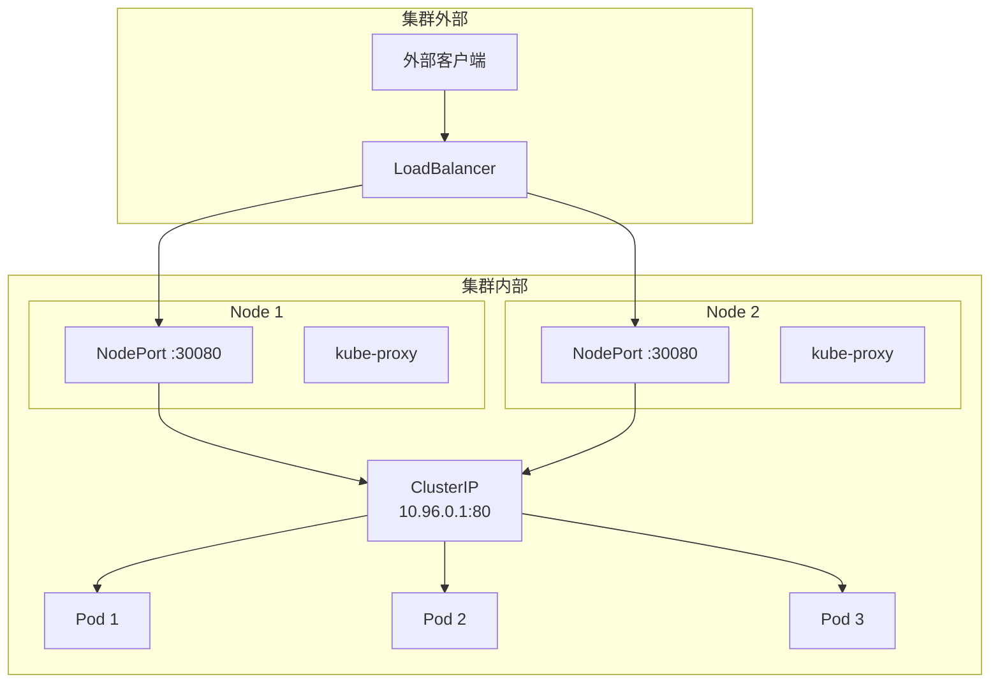

#service

相关笔记：[[kubernetes-basics]] | [[headless-service]] | [[cni]] | [[k8s-interview]]

## Service 概述

Service 是将多个 Pod 划分到同一个逻辑组中，并统一向外提供服务的抽象。Pod 通过 Label Selector 加入到指定的 Service 中。

Service 相当于一个负载均衡器，用户请求会先到达 Service，再由 Service 转发到它内部的某个 Pod 上。

## Service 类型

通过 `services.spec.type` 字段来指定 Service 类型：



### ClusterIP

用于**集群内部**访问。该类型会为 Service 分配一个 ClusterIP，集群内部请求先到达 Service，再由 Service 转发到其内部的某个 Pod 上。

```yaml
apiVersion: v1
kind: Service
metadata:
  name: my-service
spec:
  type: ClusterIP
  selector:
    app: my-app
  ports:
    - port: 80
      targetPort: 8080
```

### NodePort

用于**集群外部**访问。该类型会将 Service 的 Port 映射到集群的每个 Node 节点上，然后在集群之外就能通过 Node 节点上的映射端口访问到这个 Service。

```yaml
apiVersion: v1
kind: Service
metadata:
  name: my-service
spec:
  type: NodePort
  selector:
    app: my-app
  ports:
    - port: 80
      targetPort: 8080
      nodePort: 30080    # 范围 30000-32767
```

### LoadBalancer

用于**集群外部**访问。该类型是在所有 Node 节点前又挂了一个负载均衡器，作为集群外部访问的统一入口。外部流量会先到达 LoadBalancer，再由它转发到集群的 Node 节点上，通过 NodePort 再转发给对应的 Service，最后由 Service 转发到后端 Pod 中。

```yaml
apiVersion: v1
kind: Service
metadata:
  name: my-service
spec:
  type: LoadBalancer
  selector:
    app: my-app
  ports:
    - port: 80
      targetPort: 8080
```

### ExternalName

创建一个 DNS 别名（即 CNAME）并指向到某个 Service Name 上，当有请求访问这个 CNAME 时会自动解析到这个 Service Name 上。

```yaml
apiVersion: v1
kind: Service
metadata:
  name: my-service
spec:
  type: ExternalName
  externalName: my.database.example.com
```

## 常用命令

```bash
# 查看所有 Service
kubectl get svc

# 查看 Service 详情
kubectl describe svc my-service

# 查看 Service 对应的 Endpoints
kubectl get endpoints my-service
```
