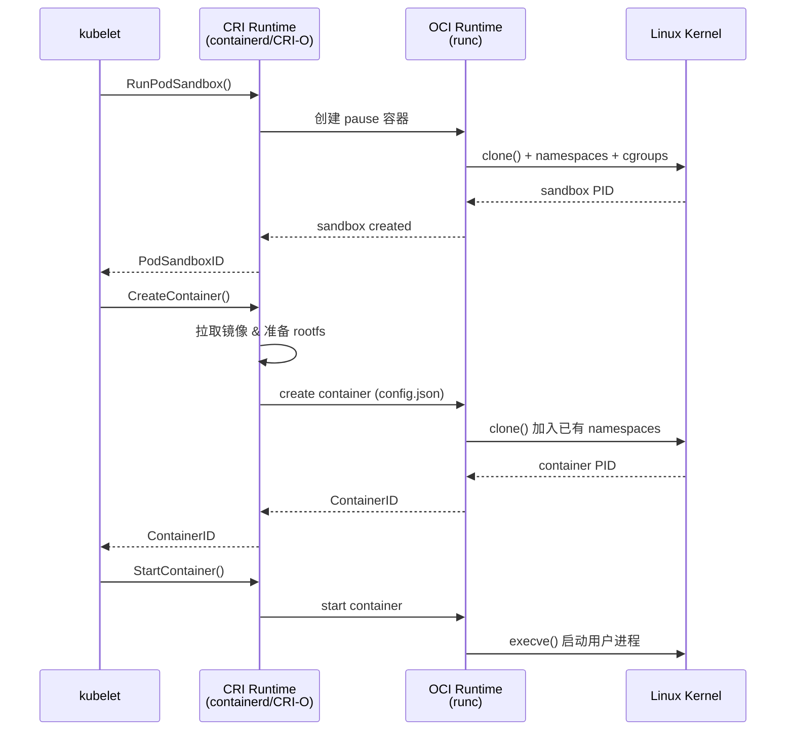
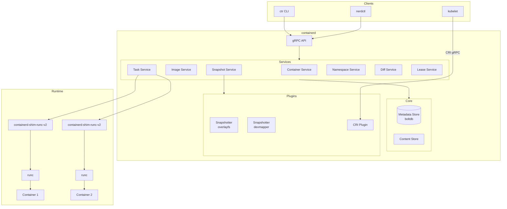
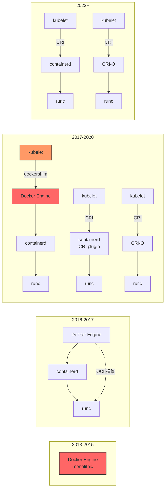

#kubernetes #oci #container-runtime

相关笔记：[[kubernetes-basics]] | [[cni]] | [[csi]]

## OCI (Open Container Initiative) 规范

OCI 是 Linux Foundation 下的一个开放治理项目，旨在制定容器行业标准。2015 年由 Docker、CoreOS 等公司共同发起，主要包含两个核心规范：

### image-spec（镜像规范）

定义了容器镜像的格式和内容，确保不同工具构建的镜像可以在任何兼容的 runtime 上运行。

核心概念：

| 概念 | 说明 |
| :--- | :--- |
| Image Manifest | 描述镜像的元数据，包含 config 和 layers 的引用 |
| Image Index | 多架构镜像的索引（如同时支持 amd64/arm64） |
| Image Layout | 镜像在本地文件系统上的目录结构 |
| Filesystem Layer | 以 tar 归档表示的文件系统变更集（changeset），使用 union filesystem 叠加 |
| Image Configuration | 包含运行时参数（Env、Cmd、Entrypoint 等）和 layer 的有序列表 |

一个 OCI image manifest 的简化结构：

```json
{
  "schemaVersion": 2,
  "mediaType": "application/vnd.oci.image.manifest.v1+json",
  "config": {
    "mediaType": "application/vnd.oci.image.config.v1+json",
    "digest": "sha256:abc123...",
    "size": 7023
  },
  "layers": [
    {
      "mediaType": "application/vnd.oci.image.layer.v1.tar+gzip",
      "digest": "sha256:def456...",
      "size": 32654
    }
  ]
}
```

### runtime-spec（运行时规范）

定义了如何从 filesystem bundle 运行一个容器，规定了容器的生命周期和配置格式。

核心内容：

- **config.json**：容器运行的完整配置，包括 root filesystem 路径、挂载点、进程参数、Linux namespaces、cgroups 等
- **Container Lifecycle**：creating → created → running → stopped
- **Linux-specific**：namespaces（pid, net, mnt, uts, ipc, user, cgroup）、cgroups、seccomp、AppArmor 等

```json
{
  "ociVersion": "1.0.2",
  "process": {
    "terminal": false,
    "user": { "uid": 0, "gid": 0 },
    "args": ["/bin/sh"],
    "env": ["PATH=/usr/local/sbin:/usr/local/bin:/usr/sbin:/usr/bin:/sbin:/bin"],
    "cwd": "/"
  },
  "root": {
    "path": "rootfs",
    "readonly": true
  },
  "linux": {
    "namespaces": [
      { "type": "pid" },
      { "type": "network" },
      { "type": "ipc" },
      { "type": "uts" },
      { "type": "mount" }
    ]
  }
}
```

## CRI (Container Runtime Interface)

CRI 是 Kubernetes 定义的一组 gRPC 接口，kubelet 通过 CRI 与底层容器运行时通信，从而实现运行时的可插拔。

### CRI 的两个核心 Service

- **RuntimeService**：负责 Pod 和 Container 的生命周期管理（创建/启动/停止/删除 Pod sandbox 和 container）
- **ImageService**：负责镜像的拉取、查询、删除

### CRI 调用流程

当 kubelet 需要创建一个 Pod 时，完整的调用链路如下：



### crictl 常用命令

`crictl` 是 CRI 兼容的命令行调试工具，类似于 docker CLI：

```bash
# 配置 crictl 使用 containerd
cat > /etc/crictl.yaml <<EOF
runtime-endpoint: unix:///run/containerd/containerd.sock
image-endpoint: unix:///run/containerd/containerd.sock
timeout: 10
debug: false
EOF

# 查看运行中的容器
crictl ps

# 查看所有 Pod
crictl pods

# 查看镜像列表
crictl images

# 拉取镜像
crictl pull docker.io/library/nginx:latest

# 查看容器日志
crictl logs <container-id>

# 进入容器
crictl exec -it <container-id> /bin/sh

# 查看容器详细信息（输出 JSON）
crictl inspect <container-id>

# 查看 Pod sandbox 详细信息
crictl inspectp <pod-id>
```

## containerd 架构与核心组件

containerd 是一个工业级的容器运行时，强调简单性、健壮性和可移植性。它管理宿主机上容器的完整生命周期：镜像传输和存储、容器执行和监控、底层存储和网络。

### 整体架构



### 核心组件详解

#### containerd-shim

shim 是 containerd 与 OCI runtime 之间的中间层，每个容器对应一个 shim 进程。

关键作用：
- **容器进程的父进程**：shim 作为容器进程的直接父进程，负责收集 exit status、等待子进程退出（避免 zombie process）
- **解耦 containerd**：即使 containerd 重启或升级，容器仍然正常运行，因为 shim 是独立进程
- **stdio 管理**：保持容器的 stdin/stdout/stderr 持续可用
- **向 containerd 报告状态**：通过 ttrpc 协议上报容器状态

当前默认使用 `containerd-shim-runc-v2`，采用单一 shim 进程管理同一 Pod 内所有容器。

#### Snapshotter

Snapshotter 是 containerd 的存储抽象层，负责管理容器的 rootfs。类似于 Docker 的 storage driver，但设计更加简洁。

常见 snapshotter 实现：

| Snapshotter | 说明 |
| :--- | :--- |
| overlayfs | 默认，使用 Linux OverlayFS，性能好且成熟 |
| native | 简单的文件拷贝，兼容性最好 |
| devmapper | 使用 devicemapper thin provisioning，适合生产环境块存储 |
| stargz | 支持 lazy pulling，按需加载镜像层 |
| nydus | 阿里开源的按需加载方案，优化镜像分发 |

#### Content Store

Content Store 以 content-addressable 方式存储所有不可变数据（镜像层、config、manifest 等），使用 SHA256 digest 作为 key。数据存储在 `/var/lib/containerd/io.containerd.content.v1.content/` 目录下。

### containerd 配置

```toml
# /etc/containerd/config.toml
version = 2

[grpc]
  address = "/run/containerd/containerd.sock"

[plugins."io.containerd.grpc.v1.cri"]
  sandbox_image = "registry.k8s.io/pause:3.9"

  [plugins."io.containerd.grpc.v1.cri".containerd]
    default_runtime_name = "runc"

    [plugins."io.containerd.grpc.v1.cri".containerd.runtimes.runc]
      runtime_type = "io.containerd.runc.v2"

      [plugins."io.containerd.grpc.v1.cri".containerd.runtimes.runc.options]
        SystemdCgroup = true

  [plugins."io.containerd.grpc.v1.cri".registry]
    [plugins."io.containerd.grpc.v1.cri".registry.mirrors]
      [plugins."io.containerd.grpc.v1.cri".registry.mirrors."docker.io"]
        endpoint = ["https://mirror.example.com"]

[plugins."io.containerd.grpc.v1.cri".cni]
  bin_dir = "/opt/cni/bin"
  conf_dir = "/etc/cni/net.d"
```

```bash
# 生成默认配置
containerd config default > /etc/containerd/config.toml

# 重启 containerd
systemctl restart containerd

# 查看 containerd 状态
systemctl status containerd

# 使用 ctr 查看 namespace
ctr namespace ls

# 查看 k8s namespace 下的容器
ctr -n k8s.io containers ls
```

## runc：OCI 参考实现

runc 是 OCI runtime-spec 的参考实现，最初由 Docker 贡献。它是一个轻量级的 CLI 工具，直接调用 Linux kernel API 来创建和运行容器。

### runc 创建容器的过程

1. 读取 `config.json`，解析容器配置
2. 创建 Linux namespaces（通过 `clone()` 系统调用）
3. 配置 cgroups 资源限制
4. 设置 rootfs（通过 `pivot_root()` 或 `chroot()`）
5. 配置安全特性（seccomp、AppArmor、capabilities drop）
6. 执行用户指定的 entrypoint（通过 `execve()`）

### 底层 Linux 技术

```
容器 = Namespaces（隔离） + Cgroups（资源限制） + Union FS（文件系统）
```

**Namespaces**：提供进程级别的资源隔离

| Namespace | 隔离内容 | 对应 clone flag |
| :--- | :--- | :--- |
| PID | 进程 ID | CLONE_NEWPID |
| Network | 网络栈（接口、路由、iptables） | CLONE_NEWNET |
| Mount | 挂载点 | CLONE_NEWNS |
| UTS | 主机名和域名 | CLONE_NEWUTS |
| IPC | 进程间通信（信号量、消息队列） | CLONE_NEWIPC |
| User | 用户和组 ID 映射 | CLONE_NEWUSER |
| Cgroup | Cgroup root 目录 | CLONE_NEWCGROUP |

**Cgroups**：限制、记录和隔离进程组的资源使用

- `cpu`：CPU 时间片分配
- `memory`：内存使用上限、OOM 行为
- `blkio`/`io`：块设备 I/O 限速
- `pids`：限制进程数量

### 其他 OCI Runtime

| Runtime | 特点 |
| :--- | :--- |
| runc | 标准参考实现，最广泛使用 |
| crun | C 语言实现，更轻量更快 |
| youki | Rust 语言实现 |
| gVisor (runsc) | Google 出品，内核级沙箱隔离，安全性更高 |
| Kata Containers | 轻量级虚拟机隔离，每个容器一个 VM |
| Firecracker | AWS 出品的 microVM |

## 容器运行时演进

### 演进历程



### 关键时间线

| 时间 | 事件 |
| :--- | :--- |
| 2013 | Docker 发布，容器技术走向主流 |
| 2015 | OCI 成立，Docker 将 libcontainer 捐赠为 runc |
| 2016 | Docker 将容器运行时拆分为 containerd |
| 2017 | CRI 接口定义，containerd 1.0 发布，CRI-O 1.0 发布 |
| 2018 | containerd 捐赠给 CNCF |
| 2020.12 | Kubernetes 1.20 宣布弃用 dockershim |
| 2022.05 | Kubernetes 1.24 正式移除 dockershim |

### Docker vs containerd vs CRI-O

| 特性 | Docker Engine | containerd | CRI-O |
| :--- | :--- | :--- | :--- |
| 定位 | 完整的容器平台 | 通用容器运行时 | 专为 Kubernetes 设计的轻量 runtime |
| CRI 支持 | 需要 dockershim 适配 | 内置 CRI plugin | 原生 CRI 实现 |
| 镜像构建 | 支持（docker build） | 不支持（需要 buildkit） | 不支持 |
| Swarm 编排 | 支持 | 不支持 | 不支持 |
| CLI 工具 | docker | ctr / nerdctl | crictl |
| 资源占用 | 较高（多一层 dockerd） | 中等 | 最低 |
| 适用场景 | 开发环境、CI/CD | K8s 生产环境（主流） | K8s 生产环境（OpenShift 默认） |

### 为什么 Kubernetes 弃用 dockershim

在使用 Docker 作为容器运行时时，调用链是：

```
kubelet → dockershim → dockerd → containerd → runc
```

问题：
1. **多了一层不必要的抽象**：Docker 提供了很多 K8s 不需要的功能（如 docker build、swarm），增加了复杂度和维护负担
2. **dockershim 维护成本高**：dockershim 是 kubelet 内部的代码，K8s 社区需要持续维护这个适配层
3. **性能损耗**：每次容器操作都要经过 dockerd 中转，多了一跳
4. **故障面扩大**：dockerd 出问题会影响所有容器，而 containerd + shim 模型中每个容器有独立的 shim 进程

弃用后的调用链更简洁：

```
kubelet → CRI → containerd → runc
```

> 注意：弃用 dockershim 不等于弃用 Docker 镜像。Docker 构建的镜像符合 OCI 标准，仍然可以在任何 CRI 兼容的运行时上运行。

## 面试要点

### 高频问题

**Q: OCI 是什么？包含哪些规范？**

> [!question]- 参考答案（点击展开）
>
> OCI 是容器行业的开放标准，包含 image-spec（定义镜像格式）和 runtime-spec（定义如何运行容器）。确保不同厂商的实现可以互操作。

**Q: CRI 的作用是什么？**

> [!question]- 参考答案（点击展开）
>
> CRI 是 Kubernetes 定义的 gRPC 接口标准，使 kubelet 能以统一方式与不同容器运行时交互，实现运行时的可插拔。包含 RuntimeService 和 ImageService 两组接口。

**Q: containerd 和 Docker 的关系？**

> [!question]- 参考答案（点击展开）
>
> containerd 最初是 Docker 拆分出来的核心组件。Docker Engine = dockerd（高层管理）+ containerd（容器运行时）+ runc（OCI runtime）。K8s 场景下可以直接使用 containerd，跳过 dockerd 这一层。

**Q: 为什么 K8s 1.24 移除了 dockershim？**

> [!question]- 参考答案（点击展开）
>
> 核心原因是减少不必要的抽象层。Docker 是一个完整的平台，K8s 只需要其中的容器运行时能力。通过 CRI 直连 containerd，调用链更短、性能更好、故障面更小、维护成本更低。Docker 构建的 OCI 标准镜像不受影响。

**Q: containerd-shim 的作用？**

> [!question]- 参考答案（点击展开）
>
> shim 作为容器进程的父进程，(1) 使 containerd 可以独立重启而不影响容器运行，(2) 回收容器的 exit status 避免 zombie process，(3) 维持容器的 stdio 流。

**Q: runc 底层用了哪些 Linux 技术？**

> [!question]- 参考答案（点击展开）
>
> 主要三个：Namespaces（PID/Network/Mount/UTS/IPC/User/Cgroup 七种，提供隔离）、Cgroups（CPU/Memory/IO 等资源限制）、Union Filesystem（层叠式文件系统如 OverlayFS，实现镜像的分层存储）。

**Q: containerd 和 CRI-O 怎么选？**

> [!question]- 参考答案（点击展开）
>
> containerd 是通用容器运行时，生态更丰富（如 buildkit、nerdctl），是大多数 K8s 发行版的默认选择。CRI-O 专为 K8s 设计，更轻量，是 OpenShift 的默认 runtime。两者都是 CNCF 毕业项目，生产环境都可靠。
