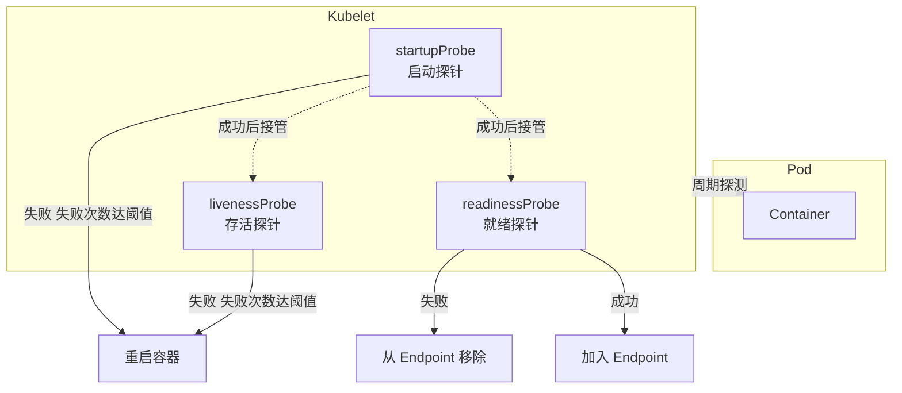
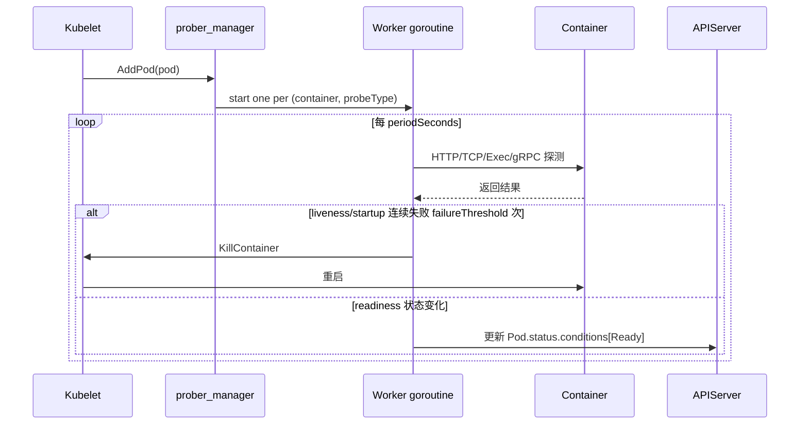

#kubernetes #probe

相关笔记：[[kubernetes-basics]] | [[k8s-interview]] | [[service]] | [[scheduler-deep-dive]]

## 探针概述

探针（Probe）是由 **kubelet** 对容器执行的定期诊断，用来判断容器的运行状态、是否可对外服务、是否完成启动。kubelet 通过探针的返回结果决定是否重启容器、是否将 Pod 从 Service 的 Endpoint 列表中摘除。

K8s 提供三种探针：

| 探针 | 失败后果 | 用途 | 是否影响 Service 流量 |
| :---: | --- | --- | :---: |
| **livenessProbe** 存活探针 | kubelet 按 restartPolicy **重启容器** | 检测容器是否"卡死"，需要重启自愈 | 否（不直接影响） |
| **readinessProbe** 就绪探针 | Pod 从 **Endpoint 列表移除** | 检测容器是否准备好接收流量 | 是 |
| **startupProbe** 启动探针 | kubelet 按 restartPolicy **重启容器** | 保护慢启动应用，绕过 liveness/readiness 提前杀容器 | 否 |

> startupProbe 在 1.18 GA。一旦 startupProbe 成功，liveness/readiness 才会接管；这之前另外两个探针被禁用。

## 探针类型架构图



## 三种探测方式（Handler）

每个探针都可以选择以下三种方式之一执行：

| Handler | 成功判定 | 适用场景 |
| --- | --- | --- |
| **httpGet** | 状态码 **200-399** | HTTP 服务，最常用，可携带 path / port / headers |
| **tcpSocket** | TCP 三次握手成功 | 非 HTTP 服务（如 MySQL、Redis、gRPC 早期） |
| **exec** | 命令退出码为 **0** | 检查文件/进程/自定义脚本 |
| **grpc** (1.24+ GA) | 实现 gRPC Health Checking Protocol 返回 SERVING | gRPC 服务原生健康检查 |

## 关键参数

```yaml
livenessProbe:
  httpGet:
    path: /healthz
    port: 8080
  initialDelaySeconds: 15   # 容器启动后等待 N 秒才开始探测，避免应用还没起来就被打死
  periodSeconds: 10         # 探测间隔，默认 10s，最小 1s
  timeoutSeconds: 1         # 单次探测超时，默认 1s
  successThreshold: 1       # 连续成功 N 次算成功；liveness/startup 必须为 1
  failureThreshold: 3       # 连续失败 N 次算失败，默认 3
  terminationGracePeriodSeconds: 30  # 1.21+，liveness 失败后给容器的优雅停机时长
```

记忆口诀：**`initial → period → timeout → success → failure`**（初始延迟 → 周期 → 单次超时 → 成功阈值 → 失败阈值）。

## 完整 YAML 示例

```yaml
apiVersion: v1
kind: Pod
metadata:
  name: probe-demo
spec:
  containers:
  - name: app
    image: myapp:v1
    ports:
    - containerPort: 8080

    # 启动探针：给慢启动应用最多 5 * 30 = 150s 的启动窗口
    startupProbe:
      httpGet:
        path: /healthz
        port: 8080
      failureThreshold: 30
      periodSeconds: 5

    # 存活探针：探测应用是否卡死，失败则重启
    livenessProbe:
      httpGet:
        path: /healthz
        port: 8080
      periodSeconds: 10
      failureThreshold: 3

    # 就绪探针：探测是否可接流量，失败则摘出 Endpoint
    readinessProbe:
      httpGet:
        path: /ready
        port: 8080
      periodSeconds: 5
      failureThreshold: 2
```

## kubelet 内部实现要点

1. **prober_manager** 为每个容器的每种探针启动独立 `worker` goroutine，按 `periodSeconds` 周期触发。
2. 探测结果写入 `results.Manager`（liveness、readiness、startup 三套 cache）。
3. **liveness/startup 失败** → 触发 `killContainer` → 由 `kuberuntime` 按 restartPolicy 重启。
4. **readiness 状态变化** → 更新 Pod `status.conditions[Ready]` → 经 endpoints-controller 写回 Service Endpoint。
5. 探针**默认隐式成功**：未配置则视为永远健康。



## 生产实践与坑点

### 1. liveness 与 readiness 探测路径要分开
- `/healthz`（liveness）：只检查进程/线程是否能响应，不依赖下游
- `/ready`（readiness）：检查 DB / 缓存 / 下游依赖是否就绪
- **反例**：liveness 也检查 DB → DB 抖动 → 全量 Pod 被 kubelet 重启 → 雪崩

### 2. 慢启动应用必须用 startupProbe
- 没有 startupProbe 之前，只能把 `initialDelaySeconds` 调大，但运行期还会受同样长的延迟影响
- startupProbe 成功后才放行 liveness/readiness，启动窗口 = `failureThreshold * periodSeconds`

### 3. exec 探针成本高
- 每次 exec 都 fork 一个进程，频繁探测在节点上 CPU 占用明显
- 高密度部署优先选 `httpGet` / `tcpSocket`

### 4. tcpSocket 的误判
- TCP 端口能连通 ≠ 应用真正可用（应用 hang 死时端口仍监听）
- 关键业务用 httpGet 走 L7 判断

### 5. 探针不能依赖 Service 自身
- readiness 探针通过 Service 访问自身会出现循环依赖
- 探针目标必须是容器内部 `localhost:port`

### 6. terminationGracePeriodSeconds
- 在 1.21+，可在 livenessProbe 上单独设置，让 liveness 失败后给应用更短/更长的优雅停机时间

## 面试要点

1. **三种探针的区别？**

   > [!question]- 参考答案（点击展开）
   >
   > liveness 失败 → 重启容器；readiness 失败 → 摘出 Endpoint 不重启；startup 用于保护慢启动应用，成功前禁用其他两个。

2. **没有 startupProbe 怎么处理慢启动？**

   > [!question]- 参考答案（点击展开）
   >
   > 调大 liveness/readiness 的 `initialDelaySeconds`，但缺点是运行期延迟也大；startupProbe 是更优解。

3. **三种 Handler 怎么选？**

   > [!question]- 参考答案（点击展开）
   >
   > HTTP 服务 → httpGet；TCP 长连接服务 → tcpSocket；脚本/文件检查 → exec；gRPC → grpc（1.24+）。

4. **readiness 失败时容器会重启吗？**

   > [!question]- 参考答案（点击展开）
   >
   > 不会。只是从 Service Endpoint 移除，流量不再调度过来；容器仍在运行。

5. **liveness probe 检查 DB 连接会有什么问题？**

   > [!question]- 参考答案（点击展开）
   >
   > DB 故障会导致所有副本 liveness 失败被重启，引发雪崩。liveness 应只检查自身进程健康。

6. **kubelet 是如何执行探针的？**

   > [!question]- 参考答案（点击展开）
   >
   > prober_manager 给每个 (container, probeType) 启动独立 worker goroutine，按 periodSeconds 周期触发，结果写入 results.Manager，再驱动重启或更新 Pod Ready condition。

7. **探针对 Pod restartPolicy 的影响？**

   > [!question]- 参考答案（点击展开）
   >
   > liveness/startup 失败触发 `KillContainer`，是否真的重启取决于 Pod.spec.restartPolicy（Always / OnFailure / Never）。

8. **successThreshold 对 liveness 为什么必须是 1？**

   > [!question]- 参考答案（点击展开）
   >
   > liveness 探测的是"是否存活"，只要一次成功就证明存活；连续多次成功才算成功的语义不合理。

9. **failureThreshold = 3 意味着多久才会被判失败？**

   > [!question]- 参考答案（点击展开）
   >
   > 至少 `periodSeconds * failureThreshold` 秒。默认 10s * 3 = 30s 才会触发重启。

10. **探针失败的 Pod 会重新调度到其他节点吗？**

    > [!question]- 参考答案（点击展开）
    >
    > 不会。liveness 只是原地重启容器；除非 Pod 被删除（如 Deployment 滚动），调度才介入。
