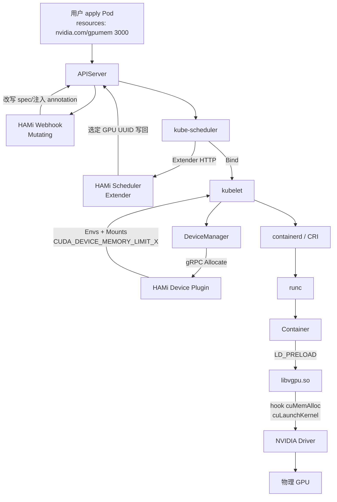
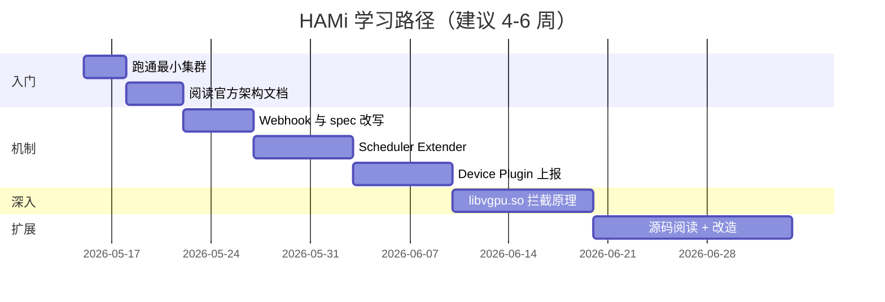

#kubernetes #gpu #hami #ai-infra #学习计划

相关笔记：[[hami-source]] | [[gpu-scheduling-source]] | [[gpu-scheduling]] | [[scheduler-framework-source]] | [[kubelet-cri-source]] | [[controller-runtime-source]] | [[demo-fake-gpu]] | [[demo-hami-mac]] | [[learn-k8s-via-hami]] | [[k8s-development-roadmap]]

## 概述

HAMi（Heterogeneous AI computing Virtualization middleware，CNCF Sandbox 项目）是 K8s 上的 GPU 虚拟化与共享中间件，解决原生 NVIDIA Device Plugin「整卡分配 + 调度器只看数量」的两大痛点。它通过 **scheduler-extender + 自定义 device-plugin + mutating webhook + LD_PRELOAD 的 libvgpu.so** 四件套实现显存/算力按需切分。本笔记给出一条由浅入深的学习路径，把它拆成 6 个阶段，每个阶段有可验证的产出。

## HAMi 的四块组件与你已有笔记的对应关系



| HAMi 组件 | 干什么 | 已有笔记 | 难度 |
| --- | --- | --- | --- |
| HAMi-webhook | mutating webhook 改 Pod spec、注入 env | [[controller-runtime-source]] | ★★ |
| HAMi-scheduler | scheduler-extender，按显存/算力做 Filter+Score | [[scheduler-framework-source]] | ★★★ |
| HAMi-device-plugin | 把 1 块物理卡上报为 N 块虚拟卡 | [[kubelet-cri-source]] [[demo-fake-gpu]] | ★★ |
| HAMi-core (libvgpu.so) | C/CUDA 库，hook CUDA API 做配额隔离 | 无（新知识） | ★★★★ |

四块组件里，**前三块都对应你已经过过源码的 K8s 机制**，第四块是新知识（CUDA / LD_PRELOAD / NVML）—— 这意味着你不是从零学 HAMi，而是把已有的 K8s 知识落地到一个真实的工业项目上。

## Mac（无 GPU）实操方案

> **TL;DR**：HAMi 4 块组件里有 3 块在 Mac + kind 上能完整跑（webhook / scheduler / device-plugin），只有第 4 块 libvgpu.so 必须真 NVIDIA driver。配套 demo 见 [[demo-hami-mac]]（fake device plugin + LD_PRELOAD env 注入）和 [libvgpu-hook-demo](../demos/hami-mac/libvgpu-hook-demo/README.md)（50 行 C 的 malloc hook 模拟 cuMemAlloc 配额）。把它们都跑一遍 = 80% 的 HAMi 学习量。

### 为什么 kwok 不合适做主力 demo

直觉上，kwok（Kubernetes WithOut Kubelet）是 Mac 无硬件首选 —— 它能虚拟出几百个 Node、几千个 Pod，不烧本机资源。**但它把 kubelet 这一层断掉了**，对 HAMi 是致命的：

| 维度 | kwok | kind + fake device plugin |
| :--- | :--- | :--- |
| 模拟节点规模 | ✅ 可造千节点 | ❌ 受本机资源限制 |
| 真 kubelet | ❌ 无 | ✅ 有 |
| Device Plugin gRPC 链路 | ❌ 无 kubelet 反向 dial | ✅ 完整跑 |
| Allocate 注入的 env 在容器里 `echo` 出来 | ❌ Pod 不真跑 | ✅ 能 |
| HAMi-webhook 改 Pod spec | ✅ 真 APIServer 可以 | ✅ |
| HAMi-scheduler extender Filter/Bind | ✅ | ✅ |
| 适合学的内容 | 调度策略压测 | 端到端机制 |

HAMi 的核心机制是 **Allocate 时通过 env 注入 LD_PRELOAD + 配额** —— 这一步必须有真 kubelet + 真 CRI + 真容器进程，kwok 一个都没有。

**结论**：主线用 [[demo-hami-mac]]（kind + fake device plugin + 真 HAMi 控制面）；kwok 留给后面"想看 HAMi-scheduler 在 100 节点下的 spread vs binpack 策略"这类大规模场景（见阶段 4）。

### 每个阶段在 Mac 上能 / 不能验证什么

| 阶段 | Mac 上能验证 | 必须真 GPU |
| :--- | :--- | :--- |
| 0 先决条件 | ✅ 全部（概念） | — |
| 1 跑通最小集群 | ✅ 用 [[demo-hami-mac]] 替代「同卡共享」演示 env 注入 | ❌ 真显存隔离 |
| 2 架构文档 | ✅ 全部 | — |
| 3 webhook 源码 | ✅ 全部（可自己起一个 webhook，APIServer 行为完全一致） | — |
| 4 scheduler extender 源码 | ✅ 主线（kind）+ 可选大规模（kwok） | — |
| 5 device plugin 源码 | ✅ 全部（[[demo-hami-mac]] 就是这一阶段的"实物对照"） | — |
| 6 libvgpu hook | ⚠️ 部分：用 [libvgpu-hook-demo](../demos/hami-mac/libvgpu-hook-demo/README.md) 的 malloc hook 验证 LD_PRELOAD 机制；真 hook CUDA API 必须真 GPU | ✅ 真 hook 必须 |

### Mac 用户的推荐学习节奏

如果你只关心 K8s 这一侧（不深入 CUDA C），**做完阶段 1-5 + 阶段 6 的 malloc hook demo 就够了**。剩下阶段 6 的真 CUDA hook 部分等有 GPU 资源时再做：

- vast.ai / RunPod / Lambda：消费卡 1-2 美元/小时，跑 2 小时做 demo 足够
- 公司 / 学校的 GPU 服务器借 1 个 Pod
- 阿里云 / 腾讯云 spot 实例：T4 大约 1 元/小时

**配套总结文档**：[[learn-k8s-via-hami]] 把这条学习路径反过来用 —— 以 HAMi 为线索，一步步学透 K8s 的 12 个核心机制（APIServer / Informer / Controller / Webhook / Scheduler / DeviceManager / CRI / LD_PRELOAD）。如果你 K8s 基础还不扎实，先看那一篇。

## 6 阶段学习路径



---

### 阶段 0：先决条件检查（半天）

读完这些再开始，否则后面会卡：

- ✅ 已读 [[gpu-scheduling]]：理解 Extended Resource、Device Plugin 注册流程
- ✅ 已读 [[gpu-scheduling-source]]：理解 Scheduler 只看数量、DeviceManager 在 kubelet 侧分设备
- ✅ 已跑过 [[demo-fake-gpu]]：知道 `ListAndWatch` 怎么上报、`Allocate` 怎么注入 env
- ✅ 知道什么是 Mutating Webhook（[[controller-runtime-source]] Webhook 章节）
- ✅ 大致清楚 CUDA 是什么（用户态库，应用调 `libcuda.so` 跟 GPU 驱动通信）

**产出**：在脑子里能画出 GPU Pod 的端到端链路（用户 → APIServer → Scheduler → kubelet → DeviceManager → Device Plugin → CRI → 容器）。

---

### 阶段 1：跑通最小集群（1-3 天）

**目标**：先让它跑起来，不求懂。

> **Mac 无 GPU 用户**：直接跳到下面 **1.4 Mac 替代方案**，跑 [[demo-hami-mac]]。完了再回来读 1.1-1.3 理解真实环境部署，等有 GPU 时再补 1.1-1.3 的实操。

#### 1.1 准备环境（真 GPU 路径）

- 一台带 NVIDIA GPU 的机器（消费卡 RTX 30/40 系列都行，云上租也可）
- 已装 NVIDIA Driver（`nvidia-smi` 能跑）
- 已装 nvidia-container-toolkit（容器里能 `nvidia-smi`）
- k8s 集群（kind / minikube + GPU passthrough，或裸机单机 kubeadm）

#### 1.2 部署 HAMi

```bash
helm repo add hami-charts https://project-hami.github.io/HAMi/
helm install hami hami-charts/hami \
  --set scheduler.kubeScheduler.imageTag=<your-k8s-version> \
  -n kube-system
```

确认三个组件起来：

```bash
kubectl get pods -n kube-system | grep hami
# hami-device-plugin-xxxxx        Running
# hami-scheduler-xxxxx             Running   # 注意：这是 kube-scheduler + extender
# 还有一个 webhook（在 hami-scheduler Pod 里跑）
```

#### 1.3 跑两个共享 Pod

```yaml
# pod-a.yaml
apiVersion: v1
kind: Pod
metadata:
  name: gpu-a
spec:
  containers:
  - name: app
    image: nvidia/cuda:12.2.0-runtime-ubuntu22.04
    command: ["sleep", "infinity"]
    resources:
      limits:
        nvidia.com/gpu: 1
        nvidia.com/gpumem: 3000      # 3GB 显存
        nvidia.com/gpucores: 30      # 30% SM 利用率
```

apply 两份（gpu-a / gpu-b），看是否都被调度到同一张物理卡：

```bash
kubectl exec gpu-a -- nvidia-smi
kubectl exec gpu-b -- nvidia-smi
# 两个容器应该看到同一块 GPU，但 used memory 各自 ≤3GB
```

**产出**：截图保留，记住「同卡共享 + 显存隔离」的实际效果。

#### 1.4 Mac 替代方案（无 GPU）

跑 [[demo-hami-mac]]：

```bash
cd cloud-native/kubernetes/demos/hami-mac
go mod tidy && go build ./... && docker build -t learning-notes/hami-mac:latest .
kind create cluster --name hami-mac
kind load docker-image learning-notes/hami-mac:latest --name hami-mac
kubectl apply -f daemonset.yaml
kubectl describe node | grep nvidia.com/gpu   # 期望: 40
kubectl apply -f pod-hami-consumer.yaml
kubectl logs hami-consumer
```

**期望看到**：`LD_PRELOAD=/usr/local/vgpu/libvgpu.so` + `CUDA_DEVICE_MEMORY_LIMIT_0=3000m` + `CUDA_DEVICE_SM_LIMIT_0=30` 三个 HAMi 标志性 env 出现在容器里。**这等价于阶段 1 的"产出"** —— 你看到了 HAMi 之所以是 HAMi 的核心 contract，只是后端是 fake 的没有真显存隔离。

要看真"同卡共享 + 显存隔离"的实际效果，必须真 GPU（云上租 1 小时也行）。

---

### 阶段 2：架构与文档（3-5 天）

**目标**：知道每个组件分别在干什么，建立"地图"。

#### 2.1 必读文档

- [HAMi 官方文档](https://project-hami.github.io/) 整站浏览
- `Architecture.md` —— 整体架构
- `develop-environment-set-up.md` —— 本地开发环境（之后会用到）
- 看 `examples/` 目录下所有 yaml，理解每种用法

#### 2.2 自己画两张图

不抄官方图，**自己画**：

1. **静态部署图**：HAMi 的 Pod 都跑在哪？scheduler 是怎么"替换"原生 kube-scheduler 的？（提示：HAMi 跑的是 vanilla kube-scheduler + 通过 `--config` 配置 extender HTTP 回调）

   > [!question]- 参考答案（点击展开）
   > 控制面运行 HAMi scheduler Pod，其中仍是 vanilla `kube-scheduler`，只是通过 `KubeSchedulerConfiguration` 把 Filter/Bind 等决策回调给同 Pod/服务中的 Extender；Mutating Webhook 也由该控制面组件提供。每个 GPU Node 运行 Device Plugin DaemonSet，容器侧再挂载 `libvgpu.so`。所以它不是替换 Scheduler 算法内核，而是换一个配置了 Extender 的 Scheduler 实例。详见 [[hami-source#五、端到端时序总图]]。

2. **动态调度图**：一个 GPU Pod 从 `kubectl apply` 到容器里能跑 CUDA 程序，经过哪些组件、按什么顺序

   > [!question]- 参考答案（点击展开）
   > API Server Admission 先调用 HAMi Webhook 改写 `schedulerName`；HAMi Scheduler 调 Extender 读取节点/设备账本并选出物理 GPU，把分配结果写进 Pod annotation；目标节点 kubelet 通过 Device Plugin `Allocate` 读取该结果，返回真实设备、环境变量和 `libvgpu.so` mount；CRI Runtime 创建容器后，动态链接器加载 hook 库，CUDA/NVML 调用才受到显存/算力配额约束。详见 [[hami-source#五、端到端时序总图]]。

画完和本笔记最前面的 mermaid 图对照。能解释清楚再进下一阶段。

#### 2.3 关键概念清单

读完文档应该能答：

**问题：HAMi 用的是 framework plugin 还是 extender？为什么这么选？**

> [!question]- 参考答案（点击展开）
>
> HAMi 以 Scheduler Extender 的 HTTP 回调接入 vanilla `kube-scheduler`，而非编译进 Framework Plugin。这样可独立部署和升级；代价是扩展点较少、每次调度多一次网络调用。它适合 GPU Pod 创建频率较低、但需要设备级资源决策的场景。详见 [[hami-source#2.1 为什么是 Extender 而不是 Framework Plugin]]、[[scheduler-framework-source#九、自定义调度插件开发]]。

**问题：一张物理卡被切成多份后，`nvidia-smi` 在 kubelet 上看是 1 张还是 N 张？为什么？**

> [!question]- 参考答案（点击展开）
>
> kubelet 的 `nvidia.com/gpu` capacity 可被 HAMi Device Plugin 上报成 N 个伪 vGPU ID；但宿主机 `nvidia-smi` 看到的仍是物理卡。前者是 Kubernetes 的可分配资源视图，后者来自 NVML 的硬件视图，二者不能混为一谈。详见 [[hami-source#3.1 ListAndWatch：把 1 张卡上报 N 次]]。

**问题：HAMi 是怎么让容器里看到"假的"显存上限的？**

> [!question]- 参考答案（点击展开）
>
> Device Plugin 的 `Allocate` 注入 `LD_PRELOAD` 和显存配额环境变量；容器启动后 `libvgpu.so` 拦截 CUDA/NVML 的相关调用，超额申请返回 CUDA OOM，并改写 `nvidia-smi` 所见的内存信息。这是软件层配额，不是物理显存分区。详见 [[hami-source#四、HAMi-core（libvgpu.so）：容器内的真实隔离]]。

**问题：Pod 没声明 `nvidia.com/gpumem` 时 HAMi 怎么处理？**

> [!question]- 参考答案（点击展开）
>
> 取决于 HAMi 的部署配置：可以由 webhook / Device Plugin 补 `defaultMem`、`defaultCores`，也可按整卡语义处理。不能假设所有集群都会拒绝或给固定配额，应先检查实际 Helm values 与 Pod 改写后的 resources/annotations。详见 [[hami-source#七、几个深入问题]]、[[demo-hami-mac]]。

**产出**：手画的两张架构图 + 4 个问题的答案，写在你的笔记里。

---

### 阶段 3：源码 1 — Webhook 与 spec 改写（3-5 天）

**目标**：读懂 HAMi 第一块组件（最简单）。

#### 3.1 仓库与目录

```bash
git clone https://github.com/Project-HAMi/HAMi
cd HAMi
# 主代码: github.com/Project-HAMi/HAMi
# 关键目录:
#   pkg/scheduler/             scheduler-extender + webhook（合在一个进程里）
#   pkg/device/                各厂商 device-plugin 上报逻辑
#   pkg/device-plugin/         device-plugin server
#   cmd/                       入口
```

#### 3.2 看 Webhook 入口

在 `cmd/scheduler/main.go` 找到启动 webhook server 的代码，跟着读：

- webhook 注册了哪个路径？`/webhook/mutate`？

  > [!question]- 参考答案（点击展开）
  > 路径必须以当前 HAMi 版本的 `MutatingWebhookConfiguration.webhooks[].clientConfig.service.path` 和进程注册代码为准，不能从示例名猜测。阅读时先用该配置反查 server mux/manager 的注册位置，再验证 Service、port 和 certificate 是否一致；`/webhook/mutate` 只是待验证输入。

- 是不是用 controller-runtime 的 `webhook.Admission`？

  > [!question]- 参考答案（点击展开）
  > 本笔记审查的 HAMi v2.4.x 代码结构使用 controller-runtime 的 admission 包并实现 `admission.Handler`。这是实现选择，不是 Kubernetes Webhook API 的强制要求；升级 HAMi 后应重新核对 import、handler 注册和 `AdmissionReview` 版本。

- `Default()` / `Handle()` 函数在哪？

  > [!question]- 参考答案（点击展开）
  > 该版本主入口在 `pkg/scheduler/webhook.go` 的 `Handle(ctx, admission.Request)`，负责 decode Pod、判断是否接管并返回 Patch；它不是依靠 `CustomDefaulter.Default()` 完成主流程。精确函数名和路径要以克隆的目标 tag 为准。详见 [[hami-source#1.2 入口与核心逻辑]]。

#### 3.3 读 mutating 逻辑

定位 webhook 的核心函数（搜 `MutatingWebhookConfiguration` 关键字找到处理函数），读 30-50 行核心改写逻辑。**重点关注**：

- 哪些字段被改写了？（容器 `resources`、`schedulerName`、annotations）

  > [!question]- 参考答案（点击展开）
  > 在本笔记的 v2.4.x 边界中，Webhook 的关键改写是把目标 Pod 的 `spec.schedulerName` 指向 HAMi Scheduler；用户声明的 `nvidia.com/gpu`、`gpumem`、`gpucores` 仍保留给后续调度解析。不要把 Extender/Bind 阶段写入的设备分配 annotation 误算成 Admission 阶段行为。

- 注入了哪些 annotation？典型如 `hami.io/vgpu-devices-to-allocate`、`hami.io/vgpu-node`

  > [!question]- 参考答案（点击展开）
  > 最终设备选择类 annotation 由 Scheduler/Extender 在选卡和 Bind 链路写入，作为 Device Plugin `Allocate` 的 ground truth；Webhook 主要负责接管调度。具体 key 会随 HAMi 版本演进，必须对照目标 tag 的常量定义和实际 `kubectl get pod -o yaml`，不能把示例 key 当永久协议。

- 哪些 Pod 不处理？（namespaceSelector / Pod 已经有特定 annotation）

  > [!question]- 参考答案（点击展开）
  > Admission 配置先通过 `namespaceSelector` 排除系统/不接管命名空间；Handler 再跳过没有支持 GPU 资源请求、或已明确指定其他 Scheduler 的 Pod。是否还有 privileged、特定 annotation 等例外取决于版本与 Helm values，验证方式是同时查看 Webhook 配置、Handler 分支和实际 Admission Patch。

#### 3.4 联系到你已学的

- 这个 webhook 用 controller-runtime 的方式注册，对应 [[controller-runtime-source]] 第 8 节 `admission.Webhook.Handle`
- 改写 Pod resources 的模式跟 Istio sidecar 注入是同一类做法

**产出**：用一段流程图说明 "用户 apply Pod 后到进 etcd 之前，webhook 做了哪 5 件事"。

---

### 阶段 4：源码 2 — Scheduler Extender（5-7 天）

**目标**：读懂 HAMi 怎么调度 vGPU。

#### 4.1 Extender vs Framework Plugin

先复习 [[scheduler-framework-source]] 第 9 节末尾："Framework Plugin 与 Scheduler Extender 怎么选"。HAMi 用 Extender，因为：

- 不用重新编译 kube-scheduler
- 可独立部署/升级
- 性能损失（多一次 HTTP 回调）对 GPU 调度可接受 —— GPU Pod 通常不会很频繁

#### 4.2 找 Extender 入口

`pkg/scheduler/routes/` 或 `pkg/scheduler/scheduler.go` 找到 HTTP 路由：

- `/filter` —— 过滤可用节点
- `/bind` —— 绑定时写回选中的 GPU UUID

跟着读 `Filter` 的实现：

1. 从 Pod annotation 拿到需要的显存/算力
2. 遍历候选节点，对每个节点的每块 GPU 检查 `freeMemory >= request && freeCores >= request`
3. 用打分逻辑选最优节点 + 最优卡（spread / binpack 策略可配）
4. 把选中的 GPU UUID 列表写回 Pod annotation（关键！）

#### 4.3 调度状态从哪来

HAMi 没用 etcd 存 GPU 状态，而是把每个节点的 GPU 占用记录在 **Pod annotation** + **本地 in-memory cache**。读 `pkg/scheduler/nodes.go` 或 `pkg/scheduler/policy.go` 看缓存怎么维护。

这里有个有趣的对照：原生 Scheduler 用 `Cache.AssumePod` 维护乐观状态（[[scheduler-framework-source]] 第 4 节），HAMi 用 annotation —— **两套不同的"飞行中状态"机制**，思考为什么 HAMi 不能复用 K8s Cache（提示：extender 跑在独立进程里）。

#### 4.4 关键问题

读完应该能答：

**问题：多个 HAMi-scheduler 副本怎么避免对同一卡的并发分配？**

> [!question]- 参考答案（点击展开）
>
> 通过 leader election 让单个 leader 处理 Filter/Bind；Bind 后马上把分配写入 Pod annotation 并更新内存 cache。annotation 是可回放的事实来源，但 leader 切换和写入之间仍要按实际版本的并发控制与失败恢复验证，不能把它当强事务。详见 [[hami-source#2.4 Bind：把分配方案钉死在 Pod annotation 上]]、[[hami-source#七、几个深入问题]]。

**问题：节点上 GPU 占用怎么 reconcile？kubelet 重启会不会丢账？**

> [!question]- 参考答案（点击展开）
>
> 节点 GPU 清单在 Node annotation，已分配的设备与配额在 Pod annotation；HAMi-scheduler 重启后可 list Pod 回放重建 cache。kubelet / Device Plugin 的设备分配也有自己的重连与 checkpoint 路径，因此应区分 HAMi 的调度账本与 kubelet 的本地设备状态。详见 [[hami-source#2.2 vGPU 的「状态」存在哪——这是理解 HAMi 调度的关键]]、[[gpu-scheduling-source#kubelet 侧：DeviceManager 分配具体设备]]。

**问题：spread / binpack 是怎么选的？**

> [!question]- 参考答案（点击展开）
>
> 策略体现在候选 GPU 的排序：binpack 优先剩余资源少的卡以尽量填满、释放整卡；spread 优先剩余资源多的卡以分散负载。选择取决于资源碎片回收、热点和故障隔离目标，不能脱离工作负载直接断言哪种更优。详见 [[hami-source#2.3 Filter：从节点级筛到 GPU 级]]。

**产出**：手画 HAMi Filter 的伪代码（不超过 30 行），能跑一遍 dry-run。

#### 4.5 进阶：用 kwok 做百节点级调度策略压测

如果你想看 HAMi-scheduler 的 `spread` vs `binpack` 在不同集群规模下的实际效果，**这是 kwok 唯一合适的用武之地**：

```bash
# 1) 安装 kwok 控制器, 让 kwok 接管所有打了 type=kwok 的 Node
helm install kwok kwok/kwok --version 0.5.0 -n kube-system

# 2) 造 100 个虚拟 Node, 每个 capacity nvidia.com/gpu = 40
for i in $(seq 1 100); do
  cat <<EOF | kubectl apply -f -
apiVersion: v1
kind: Node
metadata:
  name: kwok-gpu-$i
  labels:
    type: kwok
    node.kubernetes.io/exclude-from-external-load-balancers: ""
  annotations:
    node.alpha.kubernetes.io/ttl: "0"
spec: {}
status:
  capacity:
    cpu: "32"
    memory: 64Gi
    pods: "110"
    nvidia.com/gpu: "40"
  allocatable:
    cpu: "32"
    memory: 64Gi
    pods: "110"
    nvidia.com/gpu: "40"
  conditions:
  - type: Ready
    status: "True"
EOF
done

# 3) 部署真 HAMi-scheduler (chart), 让它接管 nvidia.com/gpu 调度
# 4) 批量 apply 200 个 GPU Pod, 切换 binpack/spread 配置, 观察分布
```

**能学到什么**：
- HAMi-scheduler 在 100 节点 + 200 Pod 下的调度延迟（每个 Filter 多少 ms）
- spread / binpack 策略对节点利用率的实际影响（前者均匀、后者集中）
- leader election 切换时调度行为

**学不到什么**：
- ❌ Allocate env 注入（kwok Pod 不真跑容器）
- ❌ libvgpu 实际生效
- ❌ webhook 改 Pod 后的下游 kubelet 行为

→ kwok 只测调度面，**不要把它当 HAMi 主线 demo**。学机制还是用 [[demo-hami-mac]] 的 kind 路径。

---

### 阶段 5：源码 3 — Device Plugin（3-5 天）

**目标**：读懂 1 卡变 N 卡的上报，以及 Allocate 时注入了什么。

#### 5.1 入口

`pkg/device-plugin/nvidiadevice/` 或 `cmd/device-plugin/main.go`。

#### 5.2 ListAndWatch：1 → N

对照你的 [[demo-fake-gpu]]：HAMi 的 device-plugin 在 `ListAndWatch` 里**把同一块物理卡上报多次**（默认每张卡切 10 份，可配）：

```go
// 伪代码
for _, gpu := range nvmlGPUs() {
    for i := 0; i < splitCount; i++ {
        devices = append(devices, &pluginapi.Device{
            ID:     fmt.Sprintf("%s-%d", gpu.UUID, i),
            Health: pluginapi.Healthy,
        })
    }
}
```

kubelet 看到 Node 上有 10× 真实 GPU 数的"设备"，于是 `nvidia.com/gpu` capacity 是 10×N。**显存/算力维度的限制不在数量里，由 webhook + libvgpu 协作完成**。

#### 5.3 Allocate：注入什么 env

读 Allocate 实现，关注返回的 env：

```
NVIDIA_VISIBLE_DEVICES=<真实 GPU UUID>       # 给 nvidia-container-runtime 看
CUDA_DEVICE_MEMORY_LIMIT_0=3000m              # 给 libvgpu 看
CUDA_DEVICE_SM_LIMIT_0=30
LD_PRELOAD=/usr/local/vgpu/libvgpu.so         # 关键！容器启动后被 hook
```

**对比** [[demo-fake-gpu]] 里只返回 `NVIDIA_VISIBLE_DEVICES`：HAMi 多注入了 `LD_PRELOAD` 和配额上限，这是它实现配额的入口。

#### 5.4 关键问题

**问题：容器里 `nvidia-smi` 看到的"显存上限"是怎么变成 3GB 的？**

> [!question]- 参考答案（点击展开）
>
> `Allocate` 注入配额与 `LD_PRELOAD`；`libvgpu.so` 再 hook NVML 的内存查询，使 `nvidia-smi` 读到的是按容器配额折算后的值。显示值是用户态观测虚拟化，物理 GPU 的真实总显存并未改变。详见 [[hami-source#4.2 显存拦截：hook cuMemAlloc]]。

**问题：如果 Pod 不申请 `nvidia.com/gpumem`，会发生什么？**

> [!question]- 参考答案（点击展开）
>
> 行为由部署策略决定：可能补默认显存/算力，也可能采用整卡或拒绝策略。应以 webhook 改写结果、scheduler 日志和集群配置为准；[[demo-hami-mac]] 只模拟默认值注入，不证明真实 GPU 的隔离效果。详见 [[hami-source#七、几个深入问题]]。

**产出**：把 [[demo-fake-gpu]] 改造成"1 卡上报 4 份" + 在 Allocate 里注入 `LD_PRELOAD` env（即使没 libvgpu，看 env 注入工作即可）—— 这就是 [[demo-hami-mac]] 做的事，可以直接拿它当参考实现对照自己改的版本。

---

### 阶段 6：源码 4 — libvgpu.so 拦截原理（10-14 天）

**目标**：理解 HAMi 真正的护城河 —— CUDA hook。

**这是最难的一阶段**，需要 C / CUDA 基础。如果只做 K8s 不做 AI 基础设施，可以**只读到能解释清楚机制**就够了，不必读全部 C 代码。

#### 6.1 LD_PRELOAD 基础

先理解 LD_PRELOAD 是什么：

```bash
# 一个 30 秒入门示例
cat > hook.c << 'EOF'
#include <stdio.h>
#include <stdlib.h>
char *getenv(const char *name) {
    fprintf(stderr, "[hook] getenv(%s) called\n", name);
    return NULL;  // 假装环境变量都不存在
}
EOF
gcc -shared -fPIC hook.c -o hook.so
LD_PRELOAD=./hook.so ls    # ls 调 getenv("LANG") 都被截获了
```

**原理**：动态链接器先加载 `LD_PRELOAD` 指向的库，里面的同名函数会盖住后续库（包括 libc）的同名函数。HAMi 用这个机制盖住 `libcuda.so` 的关键 API。

#### 6.2 HAMi-core 仓库

```bash
git clone https://github.com/Project-HAMi/HAMi-core
# 这是独立仓库，纯 C，目录:
#   src/multiprocess/        多 GPU 进程协调
#   src/memory/              显存拦截
#   src/utilization/         算力拦截（SM 时间片）
#   src/hook.c               入口
```

#### 6.3 显存拦截怎么做

读 `src/memory/`：HAMi hook 了这几个 CUDA Driver API：

```c
CUresult cuMemAlloc(CUdeviceptr *dptr, size_t bytesize) {
    if (used_memory + bytesize > CUDA_DEVICE_MEMORY_LIMIT) {
        return CUDA_ERROR_OUT_OF_MEMORY;   // 假装 OOM
    }
    used_memory += bytesize;
    return real_cuMemAlloc(dptr, bytesize);
}
```

外加 hook `nvmlDeviceGetMemoryInfo` 让 `nvidia-smi` 看到的也是假数据。

#### 6.4 算力拦截怎么做

读 `src/utilization/`：HAMi 在 `cuLaunchKernel` 之前 sleep —— 即"按比例占用时间片"，**不是 SM 物理切分**（那是 MIG 才能做）。

```c
CUresult cuLaunchKernel(...) {
    while (current_utilization > CUDA_DEVICE_SM_LIMIT) {
        usleep(...);   // 拖时间，让别的进程跑
    }
    return real_cuLaunchKernel(...);
}
```

监控数据放在共享内存（`/dev/shm/`），多个容器共享同一物理卡时通过共享内存协商。

#### 6.5 关键问题

**问题：HAMi 和 MIG / vGPU / MPS 的区别？**

> [!question]- 参考答案（点击展开）
>
> HAMi 通过用户态 hook 做显存配额和算力软限流；MIG 是硬件实例分区；MPS 是 NVIDIA 多进程服务；vGPU 通常指带驱动和许可证体系的商业虚拟化。它们在隔离强度、硬件依赖和性能确定性上不同，不能只按“能共享 GPU”视为等价。详见 [[hami-source#六、HAMi 与其他 GPU 共享方案对比]]。

**问题：为什么用 `LD_PRELOAD` 而不是修改 NVIDIA 驱动？**

> [!question]- 参考答案（点击展开）
>
> HAMi 需要在不修改闭源 NVIDIA 驱动的条件下拦截用户态 CUDA/NVML 调用。动态链接器优先加载 `LD_PRELOAD` 指定库，hook 再通过 `dlsym(RTLD_NEXT, ...)` 调真实实现；这是一种用户态拦截，不是内核或驱动级隔离。详见 [[hami-source#4.1 LD_PRELOAD 拦截原理]]。

**问题：HAMi 对应用层是完全透明的吗？**

> [!question]- 参考答案（点击展开）
>
> 对走被 hook CUDA/NVML 路径的常见框架通常近似透明，但不是安全边界：应用可改变 `LD_PRELOAD`，也可能直接使用未覆盖的 API。部署时还要验证 CUDA、NVML、容器运行时和框架版本兼容性。详见 [[hami-source#四、HAMi-core（libvgpu.so）：容器内的真实隔离]]。

**产出**：手写一段 50 行 C 代码，实现一个简化版 `malloc` hook 限制堆内存（不用碰 CUDA，先用 malloc 练 LD_PRELOAD）—— 这就是 [libvgpu-hook-demo](../demos/hami-mac/libvgpu-hook-demo/README.md) 那个 demo，Mac 用户用 `./run-in-docker.sh` 一键跑（Mac 上 libSystem 拦不住 malloc，必须 Linux 容器）。

---

## 阶段对照检查表

跟着学的时候，对自己提这些问题：

| 阶段 | 关键问题 | 通过标准 |
| --- | --- | --- |
| 1 | 跑了 HAMi 集群没？同卡共享生效没？ | 两个 Pod 在同一张物理卡且各自显存隔离 |
| 2 | 能默写架构吗？ | 不看文档画完整调度时序图 |
| 3 | webhook 改写了什么？ | 列出 5 个注入项 |
| 4 | Filter 的关键逻辑？ | 30 行伪代码复述 |
| 5 | Allocate 注入哪些 env？ | 列全（NVIDIA_VISIBLE_DEVICES / CUDA_*  / LD_PRELOAD） |
| 6 | LD_PRELOAD 怎么实现配额？ | 写一个 malloc hook demo |

## 学习资源

- 主仓库：https://github.com/Project-HAMi/HAMi
- libvgpu 仓库：https://github.com/Project-HAMi/HAMi-core
- 文档：https://project-hami.github.io/
- CNCF 项目页：https://www.cncf.io/projects/hami/
- 同类对比：
  - Volcano vGPU（也是软件层切分）
  - 阿里云 cGPU（同思路，闭源）
  - 腾讯 qGPU（同思路，闭源）
  - NVIDIA MIG / MPS / vGPU（硬件 / 自带 / 商业方案）

## 完成全部 6 阶段后能做什么

- 给 HAMi 加一个新硬件后端（参考已有的昇腾、寒武纪适配代码）
- 把 HAMi 迁到 DRA（[[gpu-scheduling-source]] 的 DRA 章节，HAMi 还没迁，可作为 contribute 切入点）
- 在公司内基于 HAMi 构建一个 AI 推理调度平台
- 面试时能完整讲清楚 GPU 共享方案的 4 种实现路径（hook / MIG / MPS / vGPU）

## 面试要点

### Q：HAMi 解决了什么？

> [!question]- 参考答案（点击展开）
>
> 原生 NVIDIA Device Plugin 只能整卡分配且 scheduler 只看数量。HAMi 通过软件 hook + 自定义 scheduler + webhook，实现显存/算力级共享，不依赖 MIG（消费卡用不了）。

### Q：HAMi 为什么用 Scheduler Extender 而不是 Framework Plugin？

> [!question]- 参考答案（点击展开）
>
> Extender 独立部署/升级、无需改 kube-scheduler 二进制、GPU 调度对额外 HTTP 延迟不敏感；缺点是性能略低、扩展点少（只有 Filter/Bind），对 GPU 场景够用。

### Q：HAMi 是怎么让容器看到"假的"显存上限的？

> [!question]- 参考答案（点击展开）
>
> 用 LD_PRELOAD 在容器内加载 libvgpu.so，hook 了 cuMemAlloc / nvmlDeviceGetMemoryInfo 等 CUDA API。应用调 cuMemAlloc 超过配额时直接返回 OOM；调 nvidia-smi 看到的也是 hook 后的假值。

### Q：HAMi 是怎么"切"算力的？是 SM 物理切分吗？

> [!question]- 参考答案（点击展开）
>
> 不是。它在 cuLaunchKernel 之前根据当前利用率 sleep，按时间片占用比例软限流。物理切分需要 MIG（A100/H100 等数据中心卡才有）。HAMi 是软件层模拟，消费卡也能跑。

### Q：HAMi 的 Device Plugin 怎么实现"1 卡变 N 卡"？

> [!question]- 参考答案（点击展开）
>
> 在 ListAndWatch 里把同一块物理 GPU 上报 N 次（不同的伪 ID）。kubelet 看到的 capacity 就是 N×物理卡数。具体哪份给哪个 Pod 由 HAMi Scheduler 决定，再通过 annotation 传给 Device Plugin 在 Allocate 时返回真实 UUID。

### Q：HAMi 和 MIG / MPS / vGPU 的区别？

> [!question]- 参考答案（点击展开）
>
> MIG：硬件级分区，A100+ 才有，性能最强但卡型有限。MPS：NVIDIA 自带的多进程合并 context，能算力共享但无配额隔离。vGPU：NVIDIA 商业虚拟化方案，需许可证。HAMi：纯软件 hook，零硬件依赖、零驱动改动，但不如 MIG 强隔离。

### Q：HAMi 多副本调度怎么避免对同一卡并发分配？

> [!question]- 参考答案（点击展开）
>
> leader election 选主，只有 leader 处理 Filter/Bind；同时把已分配的 vGPU 记到 Pod annotation 上，作为 ground truth，重启后从 annotation 回放重建本地 cache。

### Q：DRA 出来后 HAMi 还有意义吗？

> [!question]- 参考答案（点击展开）
>
> DRA 解决资源建模和拓扑感知，但具体怎么"切" GPU 还是要厂商提供。HAMi 的 libvgpu hook 这套机制可以无缝迁移到 DRA 之上 —— DRA 只是上层 API 形态变化，软件层 hook 实现仍是它的护城河。

### Q：学习 HAMi 需要哪些前置知识？

> [!question]- 参考答案（点击展开）
>
> K8s：Device Plugin、Scheduler Extender、Mutating Webhook；Linux：LD_PRELOAD、动态链接；NVIDIA：CUDA Driver API、NVML、nvidia-container-runtime；Go + 一点 C。

### Q：HAMi 在生产中的常见坑？

> [!question]- 参考答案（点击展开）
>
> ① 多容器共享一卡时 OOM kill 行为：超配额是返回 CUDA_ERROR_OUT_OF_MEMORY 而非 SIGKILL，应用要处理。② nvidia-container-toolkit 版本兼容性。③ leader 切换时短暂的调度卡顿。④ 监控指标得自己接，DCGM 看到的是物理卡总量不是 vGPU 切片。
