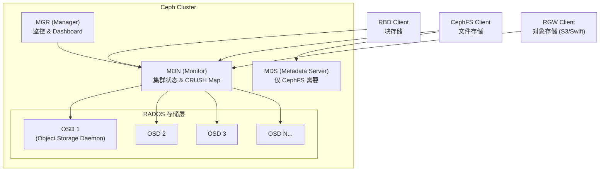
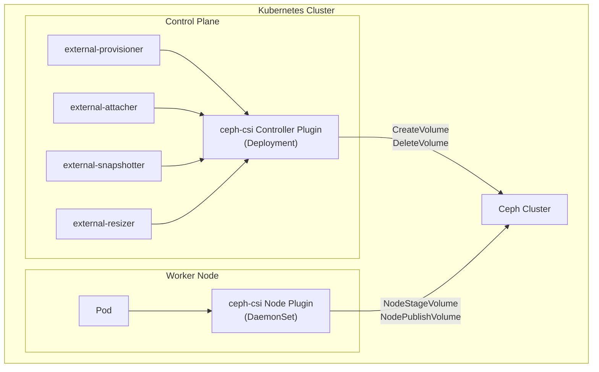

#kubernetes #csi #ceph

相关笔记：[[csi]] | [[longhorn]] | [[k8s-interview]]

## Ceph 概述

Ceph 是目前 Kubernetes 生态中最主流的分布式存储系统之一，提供块存储（RBD）、文件存储（CephFS）和对象存储（RGW）三种统一接口。ceph-csi 是 Ceph 官方维护的 CSI 驱动，支持 RBD 和 CephFS 两种 provisioner。

## Ceph 架构



### 核心组件

| 组件 | 作用 | 备注 |
| --- | --- | --- |
| **RADOS** | 底层对象存储引擎，所有存储类型的基础 | Reliable Autonomic Distributed Object Store |
| **OSD** | 每块磁盘对应一个 OSD daemon，负责数据读写和副本同步 | 通常 3 副本，也支持 Erasure Coding |
| **MON** | 维护 Cluster Map（包括 OSD Map、CRUSH Map 等），做 quorum 选举 | 至少 3 个，奇数部署 |
| **MDS** | 管理 CephFS 的文件元数据（目录树、权限等） | 仅 CephFS 需要，RBD 不需要 |
| **MGR** | 提供监控、Dashboard、告警等管理功能 | 从 Luminous 版本引入 |

### ceph-csi 在 Kubernetes 中的架构



## RBD vs CephFS 对比

| 特性 | RBD（块存储） | CephFS（文件存储） |
| --- | --- | --- |
| 接口类型 | Block Device | POSIX File System |
| Access Mode | ReadWriteOnce (RWO) | ReadWriteMany (RWX) |
| 使用场景 | 数据库、单 Pod 独占 | 多 Pod 共享文件、日志收集 |
| 性能 | 更高（直接块 I/O） | 稍低（有元数据开销） |
| 是否需要 MDS | 否 | 是 |
| Kubernetes provisioner | `rbd.csi.ceph.com` | `cephfs.csi.ceph.com` |
| 快照支持 | 是 | 是（Ceph Nautilus+） |
| 在线扩容 | 是 | 是 |

**选择建议**：
- 数据库、有状态应用（MySQL、PostgreSQL）→ RBD
- 多 Pod 共享文件（日志、配置、模型文件）→ CephFS
- 同一集群可以同时部署两者，按需使用

## ceph-csi 安装配置

### Helm 安装

```bash
# 1. 添加 ceph-csi Helm repo
helm repo add ceph-csi https://ceph.github.io/csi-charts
helm repo update

# 2. 创建 ceph-csi namespace
kubectl create namespace ceph-csi

# 3. 部署 RBD CSI driver
helm install ceph-csi-rbd ceph-csi/ceph-csi-rbd \
  --namespace ceph-csi \
  --set csiConfig[0].clusterID=<cluster-id> \
  --set csiConfig[0].monitors[0]=<mon1-ip>:6789 \
  --set csiConfig[0].monitors[1]=<mon2-ip>:6789 \
  --set csiConfig[0].monitors[2]=<mon3-ip>:6789

# 4. 部署 CephFS CSI driver（如果需要 RWX）
helm install ceph-csi-cephfs ceph-csi/ceph-csi-cephfs \
  --namespace ceph-csi \
  --set csiConfig[0].clusterID=<cluster-id> \
  --set csiConfig[0].monitors[0]=<mon1-ip>:6789
```

### 验证安装

```bash
# 查看 CSI Driver 是否注册
kubectl get csidrivers | grep ceph

# 查看 CSI 组件 Pod
kubectl get pods -n ceph-csi
```

## StorageClass + PVC 完整示例

```yaml
# Secret：存放 Ceph 集群认证信息
apiVersion: v1
kind: Secret
metadata:
  name: csi-rbd-secret
  namespace: ceph-csi
stringData:
  userID: admin
  userKey: AQBxxxxxxxxxxxxxxxxxxxxxxxxxxxxxxx==
---
# StorageClass：RBD 块存储
apiVersion: storage.k8s.io/v1
kind: StorageClass
metadata:
  name: ceph-block
provisioner: rbd.csi.ceph.com
parameters:
  clusterID: <cluster-id>
  pool: rbd-pool
  imageFormat: "2"
  imageFeatures: layering
  csi.storage.k8s.io/provisioner-secret-name: csi-rbd-secret
  csi.storage.k8s.io/provisioner-secret-namespace: ceph-csi
  csi.storage.k8s.io/node-stage-secret-name: csi-rbd-secret
  csi.storage.k8s.io/node-stage-secret-namespace: ceph-csi
reclaimPolicy: Delete
allowVolumeExpansion: true        # 允许在线扩容
volumeBindingMode: Immediate
---
# PVC 请求 10Gi 块存储
apiVersion: v1
kind: PersistentVolumeClaim
metadata:
  name: mysql-data
spec:
  accessModes:
    - ReadWriteOnce
  storageClassName: ceph-block
  resources:
    requests:
      storage: 10Gi
---
# CephFS StorageClass（多 Pod 共享读写）
apiVersion: storage.k8s.io/v1
kind: StorageClass
metadata:
  name: ceph-filesystem
provisioner: cephfs.csi.ceph.com
parameters:
  clusterID: <cluster-id>
  fsName: cephfs
  pool: cephfs_data
  csi.storage.k8s.io/provisioner-secret-name: csi-cephfs-secret
  csi.storage.k8s.io/provisioner-secret-namespace: ceph-csi
  csi.storage.k8s.io/node-stage-secret-name: csi-cephfs-secret
  csi.storage.k8s.io/node-stage-secret-namespace: ceph-csi
reclaimPolicy: Delete
allowVolumeExpansion: true
---
# CephFS PVC（RWX 多读多写）
apiVersion: v1
kind: PersistentVolumeClaim
metadata:
  name: shared-logs
spec:
  accessModes:
    - ReadWriteMany
  storageClassName: ceph-filesystem
  resources:
    requests:
      storage: 50Gi
```

## Snapshot 示例

```yaml
# 1. VolumeSnapshotClass
apiVersion: snapshot.storage.k8s.io/v1
kind: VolumeSnapshotClass
metadata:
  name: ceph-rbd-snapclass
driver: rbd.csi.ceph.com
deletionPolicy: Delete
parameters:
  clusterID: <cluster-id>
  csi.storage.k8s.io/snapshotter-secret-name: csi-rbd-secret
  csi.storage.k8s.io/snapshotter-secret-namespace: ceph-csi
---
# 2. 创建快照
apiVersion: snapshot.storage.k8s.io/v1
kind: VolumeSnapshot
metadata:
  name: mysql-snapshot-20260407
spec:
  volumeSnapshotClassName: ceph-rbd-snapclass
  source:
    persistentVolumeClaimName: mysql-data
---
# 3. 从快照恢复到新 PVC
apiVersion: v1
kind: PersistentVolumeClaim
metadata:
  name: mysql-data-restored
spec:
  accessModes:
    - ReadWriteOnce
  storageClassName: ceph-block
  resources:
    requests:
      storage: 10Gi
  dataSource:
    name: mysql-snapshot-20260407
    kind: VolumeSnapshot
    apiGroup: snapshot.storage.k8s.io
```

### 快照操作命令

```bash
# 查看快照
kubectl get volumesnapshot
kubectl describe volumesnapshot mysql-snapshot-20260407

# 查看快照内容（底层对象）
kubectl get volumesnapshotcontent
```

## 常用运维命令

```bash
# 查看 CSI 驱动
kubectl get csidrivers | grep ceph

# 查看 PVC/PV 绑定
kubectl get pvc,pv

# 查看 StorageClass
kubectl get sc

# 查看 CSI 插件日志（排查问题）
kubectl logs -n ceph-csi -l app=ceph-csi-rbd --tail=50
kubectl logs -n ceph-csi -l app=ceph-csi-cephfs --tail=50

# 查看 Ceph 集群健康状态（需要 Ceph CLI）
ceph status
ceph osd tree
ceph df
```

## 面试要点

### Q1: Ceph RBD 和 CephFS 的区别？分别在什么场景使用？

RBD 是块存储，提供 ReadWriteOnce 访问模式，适合数据库等需要高性能单 Pod 独占存储的场景。CephFS 是 POSIX 文件系统，支持 ReadWriteMany，适合多 Pod 共享读写文件的场景。RBD 性能更高因为是直接块 I/O，CephFS 有元数据服务器（MDS）的开销但支持多写。

### Q2: Ceph 的 CRUSH Map 是什么？有什么作用？

CRUSH（Controlled Replication Under Scalable Hashing）是 Ceph 的数据分布算法。CRUSH Map 定义了集群的物理拓扑（机房、机架、主机、磁盘），客户端通过 CRUSH 算法直接计算数据所在的 OSD，不需要查询中心化的元数据服务，这是 Ceph 能水平扩展的关键。

### Q3: ceph-csi 的 Controller Plugin 和 Node Plugin 分别做什么？

Controller Plugin 以 Deployment 方式运行，负责 Volume 的生命周期管理（CreateVolume、DeleteVolume、Snapshot、Expand）。Node Plugin 以 DaemonSet 方式运行在每个节点上，负责将 Volume 挂载到 Pod 目录（NodeStageVolume 映射块设备，NodePublishVolume bind mount 到 Pod）。

### Q4: Ceph 集群需要多少个 MON？为什么是奇数？

至少 3 个 MON，建议奇数个（3 或 5）。MON 使用 Paxos 协议做一致性选举，奇数个节点可以在少数节点故障时仍然达成多数派共识（quorum）。例如 3 个 MON 可以容忍 1 个故障，5 个可以容忍 2 个。

### Q5: PVC 挂载失败如何排查？

1. `kubectl describe pvc` 查看 PVC 事件
2. `kubectl describe pod` 查看 Pod 挂载错误
3. 检查 CSI 插件日志：`kubectl logs -n ceph-csi -l app=ceph-csi-rbd`
4. 检查 Ceph 集群状态：`ceph status` 确认 HEALTH_OK
5. 检查 Secret 中的认证信息是否正确
6. 检查 Node 上是否安装了 `ceph-common` 包（RBD kernel module）
