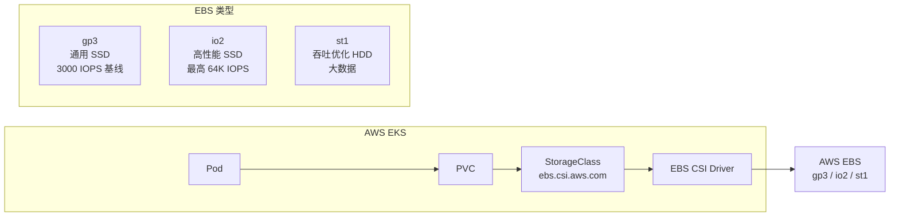
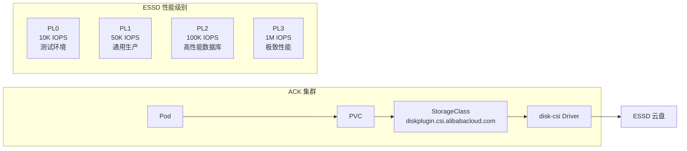
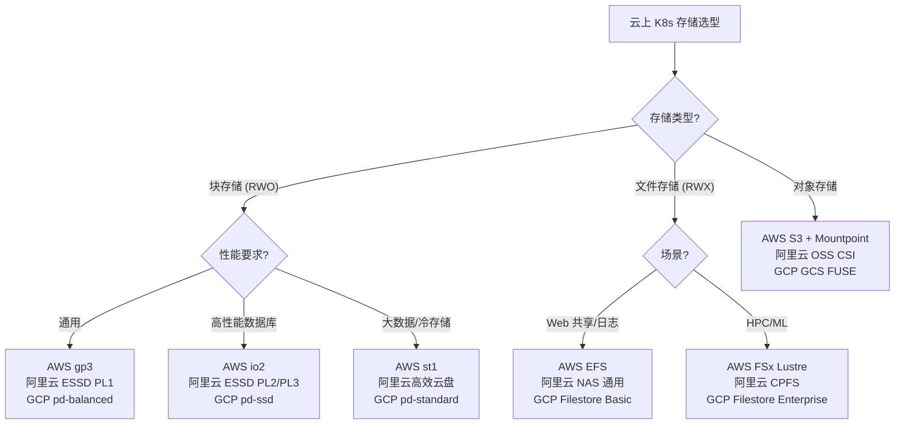

#kubernetes #csi #cloud

相关笔记：[[csi]] | [[ceph-csi]] | [[nfs-csi]] | [[k8s-interview]]

## 云厂商 CSI 概述

各大云厂商都提供了原生的 CSI 驱动，与自家的云存储服务深度集成。使用云厂商 CSI 的优势是**零运维**（存储由云厂商管理）、**与云平台深度集成**（IAM、加密、快照等），缺点是**厂商锁定**。

## AWS CSI 驱动

### 产品矩阵

| CSI Driver | 存储类型 | Access Mode | 特点 |
| --- | --- | --- | --- |
| **EBS CSI** (`ebs.csi.aws.com`) | 块存储 | RWO | gp3/io2 高性能，按需选型 |
| **EFS CSI** (`efs.csi.aws.com`) | 文件存储 (NFS) | RWX | Serverless 弹性，多 AZ 共享 |
| **FSx CSI** | Lustre/NetApp | RWX | HPC 和高性能文件系统 |

### AWS EBS CSI



```yaml
# AWS EBS StorageClass 示例（gp3 通用型）
apiVersion: storage.k8s.io/v1
kind: StorageClass
metadata:
  name: ebs-gp3
provisioner: ebs.csi.aws.com
parameters:
  type: gp3
  iops: "3000"
  throughput: "125"
  encrypted: "true"
volumeBindingMode: WaitForFirstConsumer   # 延迟绑定，保证 Pod 和 PV 在同一 AZ
allowVolumeExpansion: true
```

### AWS EFS CSI

```yaml
# AWS EFS StorageClass 示例（多 Pod 共享）
apiVersion: storage.k8s.io/v1
kind: StorageClass
metadata:
  name: efs-sc
provisioner: efs.csi.aws.com
parameters:
  provisioningMode: efs-ap
  fileSystemId: fs-0123456789abcdef0
  directoryPerms: "700"
---
# EFS PVC（RWX）
apiVersion: v1
kind: PersistentVolumeClaim
metadata:
  name: efs-claim
spec:
  accessModes:
    - ReadWriteMany
  storageClassName: efs-sc
  resources:
    requests:
      storage: 5Gi       # EFS 是弹性的，实际不限大小
```

### 安装 AWS EBS CSI Driver

```bash
# 方式一：EKS Add-on（推荐）
aws eks create-addon \
  --cluster-name my-cluster \
  --addon-name aws-ebs-csi-driver \
  --service-account-role-arn arn:aws:iam::111122223333:role/AmazonEKS_EBS_CSI_DriverRole

# 方式二：Helm
helm repo add aws-ebs-csi-driver https://kubernetes-sigs.github.io/aws-ebs-csi-driver
helm install aws-ebs-csi-driver aws-ebs-csi-driver/aws-ebs-csi-driver \
  --namespace kube-system
```

## 阿里云 CSI 驱动

### 产品矩阵

| CSI Driver | 存储类型 | Access Mode | 特点 |
| --- | --- | --- | --- |
| **disk-csi** (`diskplugin.csi.alibabacloud.com`) | 云盘 | RWO | ESSD 高性能块存储 |
| **nas-csi** (`nasplugin.csi.alibabacloud.com`) | NAS 文件存储 | RWX | 多 Pod 共享，支持极速型 NAS |
| **oss-csi** (`ossplugin.csi.alibabacloud.com`) | 对象存储 | ROX/RWX | 成本低，适合静态资源 |

### 阿里云 ESSD 云盘



```yaml
# 阿里云 ESSD 云盘 StorageClass
apiVersion: storage.k8s.io/v1
kind: StorageClass
metadata:
  name: alicloud-essd
provisioner: diskplugin.csi.alibabacloud.com
parameters:
  type: cloud_essd
  performanceLevel: PL1           # PL0/PL1/PL2/PL3
  encrypted: "true"
reclaimPolicy: Delete
allowVolumeExpansion: true
volumeBindingMode: WaitForFirstConsumer
```

### 阿里云 NAS

```yaml
# 阿里云 NAS StorageClass（共享读写）
apiVersion: storage.k8s.io/v1
kind: StorageClass
metadata:
  name: alicloud-nas
provisioner: nasplugin.csi.alibabacloud.com
parameters:
  server: "xxxxxxx.cn-hangzhou.nas.aliyuncs.com:/share/"
  vers: "4.0"
reclaimPolicy: Retain
mountOptions:
  - noresvport
  - nolock
---
# NAS PVC（RWX）
apiVersion: v1
kind: PersistentVolumeClaim
metadata:
  name: nas-shared
spec:
  accessModes:
    - ReadWriteMany
  storageClassName: alicloud-nas
  resources:
    requests:
      storage: 50Gi
```

## GCP PD CSI

### 产品矩阵

| CSI Driver | 存储类型 | Access Mode | 特点 |
| --- | --- | --- | --- |
| **PD CSI** (`pd.csi.storage.gke.io`) | Persistent Disk | RWO / ROX | pd-standard / pd-ssd / pd-balanced |
| **Filestore CSI** (`filestore.csi.storage.gke.io`) | NFS 文件存储 | RWX | 托管 NFS，多节点共享 |

```yaml
# GCP PD StorageClass（SSD）
apiVersion: storage.k8s.io/v1
kind: StorageClass
metadata:
  name: pd-ssd
provisioner: pd.csi.storage.gke.io
parameters:
  type: pd-ssd
  replication-type: regional-pd     # 区域级冗余
volumeBindingMode: WaitForFirstConsumer
allowVolumeExpansion: true
---
# GCP Filestore StorageClass（RWX）
apiVersion: storage.k8s.io/v1
kind: StorageClass
metadata:
  name: filestore-sc
provisioner: filestore.csi.storage.gke.io
parameters:
  tier: standard
  network: default
volumeBindingMode: WaitForFirstConsumer
```

### 安装 GCP PD CSI

```bash
# GKE 默认已安装 PD CSI Driver
# 如需手动启用：
gcloud container clusters update my-cluster \
  --update-addons=GcePersistentDiskCsiDriver=ENABLED
```

## 各云厂商对比表

### 块存储对比

| 维度 | AWS EBS | 阿里云 ESSD | GCP PD |
| --- | --- | --- | --- |
| 最高 IOPS | 256K (io2) | 1M (PL3) | 100K (pd-ssd) |
| 最高吞吐 | 4 GB/s | 4 GB/s | 1.2 GB/s |
| 加密 | KMS | KMS | CMEK |
| 跨 AZ 冗余 | io2 Block Express | ESSD AutoPL | Regional PD |
| 在线扩容 | 支持 | 支持 | 支持 |
| 快照 | 支持 | 支持 | 支持 |
| 最小容量 | 1 GiB | 20 GiB | 10 GiB |

### 文件存储对比

| 维度 | AWS EFS | 阿里云 NAS | GCP Filestore |
| --- | --- | --- | --- |
| 协议 | NFSv4 | NFSv3/v4, SMB | NFSv3 |
| 弹性扩缩 | 自动 | 手动/极速型自动 | 手动 |
| 多 AZ | 支持 | 支持 | 支持（Enterprise） |
| 性能 | 按需付费 | 通用/极速/CPFS | Basic/Enterprise |
| 适合场景 | Web 内容共享 | 通用共享文件 | ML 训练数据 |

### 选型决策



## 选型建议

| 需求 | AWS 推荐 | 阿里云推荐 | GCP 推荐 |
| --- | --- | --- | --- |
| 数据库（高 IOPS） | EBS io2 / gp3 | ESSD PL2/PL3 | pd-ssd |
| 多 Pod 共享文件 | EFS | NAS 通用型/极速型 | Filestore |
| 大数据、ML 训练 | FSx for Lustre | CPFS（并行文件系统） | Filestore Enterprise |
| 静态资源 / 日志归档 | S3 + Mountpoint | OSS | GCS FUSE |
| 低成本测试 | gp3 | ESSD PL0 | pd-balanced |

### 跨云兼容性注意事项

- **volumeBindingMode: WaitForFirstConsumer** 在所有云厂商中都建议使用，避免 PV 和 Pod 跨 AZ
- StorageClass 的 `provisioner` 字段是云厂商特定的，**不可跨云迁移**
- 如需多云兼容，考虑使用自建存储（Ceph/Longhorn）或抽象层（如 Crossplane）

## 面试要点

### Q1: 为什么云上推荐 WaitForFirstConsumer？

> [!question]- 参考答案（点击展开）
>
> WaitForFirstConsumer 会延迟 PV 的创建和绑定，等 Pod 被调度到具体节点后，再在该节点所在的 AZ 创建 PV。这避免了 PV 在 AZ-a 创建而 Pod 被调度到 AZ-b 导致挂载失败的问题。所有云厂商的块存储（EBS、ESSD、PD）都有 AZ 亲和性限制。

### Q2: AWS EBS gp3 和 io2 如何选择？

> [!question]- 参考答案（点击展开）
>
> gp3 是通用 SSD，基线 3000 IOPS + 125 MB/s 吞吐，可按需额外付费提升，适合大多数工作负载。io2 是高性能 SSD，最高 256K IOPS，适合需要稳定高 IOPS 的数据库（如 Oracle、SAP HANA）。一般先用 gp3，监控 IOPS 不足时再升级 io2。

### Q3: 云厂商的块存储和文件存储分别对应什么 Access Mode？

> [!question]- 参考答案（点击展开）
>
> 块存储（EBS/ESSD/PD）对应 ReadWriteOnce（RWO），一个 PV 只能挂载到一个 Node。文件存储（EFS/NAS/Filestore）对应 ReadWriteMany（RWX），多个 Pod 可以同时读写。选择时根据应用是否需要多 Pod 共享来决定。

### Q4: 如何避免云厂商锁定？

> [!question]- 参考答案（点击展开）
>
> 1. 使用 Kubernetes 原生 PVC/StorageClass 抽象，应用层不直接引用云厂商 API
> 2. 将 StorageClass 定义与应用 YAML 分离，迁移时只改 StorageClass
> 3. 对于自建集群，考虑 Ceph 或 Longhorn 等开源方案
> 4. 使用 Crossplane 等工具做基础设施抽象
