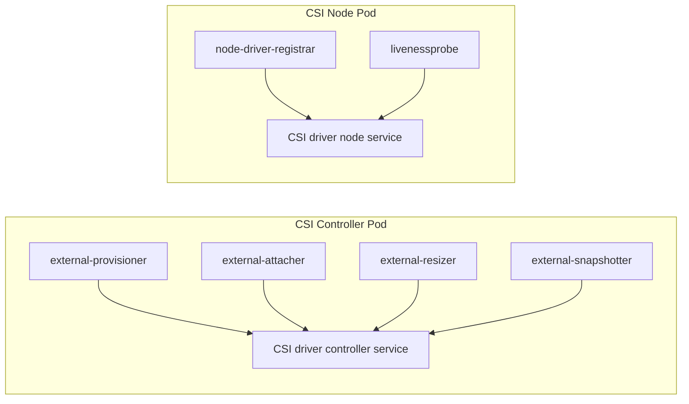

#kubernetes #csi #storage

相关笔记：[[csi]] | [[csi-source]] | [[volume-lifecycle]] | [[csi-troubleshooting]] | [[ceph-csi]] | [[longhorn]] | [[openebs]] | [[k8s-interview]]

## 概述

CSI 规范只定义插件要实现的 gRPC service：Identity、Controller、Node。Kubernetes 里的 sidecar 是 SIG Storage 提供的“翻译层”：它们 watch Kubernetes 对象，把 PVC、VolumeAttachment、VolumeSnapshot 等对象事件翻译成 CSI RPC。

核心结论：**CSI driver 本体不需要直接 watch PVC，也不需要自己写 controller-runtime。sidecar 替它完成 Kubernetes API 层的控制循环。**

## Sidecar 总览

| Sidecar | Watch 对象 | 调用 CSI RPC | 部署位置 |
| --- | --- | --- | --- |
| external-provisioner | PVC / PV / StorageClass | `CreateVolume` / `DeleteVolume` | Controller Pod |
| external-attacher | VolumeAttachment | `ControllerPublishVolume` / `ControllerUnpublishVolume` | Controller Pod |
| external-resizer | PVC capacity | `ControllerExpandVolume` / 触发 node resize | Controller Pod |
| external-snapshotter | VolumeSnapshot / VolumeSnapshotContent | `CreateSnapshot` / `DeleteSnapshot` | Controller Pod |
| node-driver-registrar | kubelet plugin registration socket | `GetPluginInfo` / `NodeGetInfo` | Node Pod |
| livenessprobe | 无 K8s watch | `Probe` | Controller Pod / Node Pod |

## 典型部署形态



Controller Pod 通常是 Deployment 或 StatefulSet；Node Pod 通常是 DaemonSet。远端块存储和云盘一般三大 service 都实现；纯本地存储或简单 NFS 方案可能没有真正的 attach 语义。

## external-provisioner

触发条件：用户创建 PVC，并且 PVC 引用的 StorageClass `provisioner` 等于该 CSI driver name。

职责：

1. watch 需要动态供给的 PVC。
2. 调用 `CreateVolume` 创建后端卷。
3. 根据返回的 `volume_id` 创建 PV。
4. 设置 PV reclaim policy、access mode、volume attributes。

失败边界：

- PVC 一直 Pending，常见原因是 StorageClass 不存在、provisioner name 不匹配、driver `CreateVolume` 失败、拓扑约束无法满足。
- `WaitForFirstConsumer` 下 PVC Pending 不一定是失败，可能是在等 Pod 调度后再创建 PV。

## external-attacher

触发条件：Pod 使用某个 PV 并被调度到节点后，Attach/Detach controller 创建 VolumeAttachment。

职责：

1. watch VolumeAttachment。
2. 调用 `ControllerPublishVolume(volume_id, node_id)`。
3. attach 成功后把 `VolumeAttachment.status.attached` 置为 true。

对 EBS / 云盘类块存储，attach 是真实云 API 操作；对 NFS / CephFS 这类网络文件系统，attach 可能是 no-op。

## external-resizer

触发条件：PVC `spec.resources.requests.storage` 变大。

职责：

1. 调用 `ControllerExpandVolume` 扩后端卷。
2. 更新 PVC/PV 的容量状态。
3. 让 kubelet 在节点侧调用 `NodeExpandVolume` 扩文件系统。

前置条件：

- StorageClass 设置 `allowVolumeExpansion: true`。
- CSI driver 声明并实现扩容能力。
- 文件系统和挂载方式支持对应的在线/离线扩容。

## external-snapshotter

触发条件：用户创建 VolumeSnapshot。

职责：

1. watch VolumeSnapshot / VolumeSnapshotContent。
2. 调用 `CreateSnapshot`。
3. 维护 snapshot handle 与状态。
4. 删除时调用 `DeleteSnapshot`。

注意：Snapshot CRD 和 snapshot-controller 是集群级组件，不是每个 CSI driver 自带的必然能力。driver 侧还要部署 external-snapshotter sidecar 才能把对象事件转成 CSI RPC。

## node-driver-registrar

registrar 不 watch Kubernetes API。它通过 kubelet 的 plugin registration socket 注册 driver，让 kubelet 知道本节点上有这个 CSI plugin。

关键路径：

```text
/var/lib/kubelet/plugins_registry/
/var/lib/kubelet/plugins/<driver-name>/csi.sock
```

如果 registrar 失败，典型现象是：

- CSINode 上没有对应 driver。
- kubelet 找不到 CSI socket。
- Pod mount 阶段报 driver not found。

## livenessprobe

livenessprobe 周期性调用 CSI Identity service 的 `Probe`，再暴露 HTTP health endpoint 给 kubelet liveness probe。它只判断 driver 进程是否可用，不保证后端存储一定健康。

## 面试要点

### Q: CSI sidecar 属于 CSI 规范吗？

A: 不属于。CSI 规范只定义 gRPC 接口；sidecar 是 Kubernetes 为了把 K8s 对象事件翻译成 CSI RPC 提供的控制器组件。

### Q: PVC 创建后是谁调用 CreateVolume？

A: external-provisioner watch 到 PVC 需要动态供给后，调用 CSI Controller service 的 `CreateVolume`。CSI driver 本身通常不直接 watch PVC。

### Q: node-driver-registrar 的作用是什么？

A: 它把 Node Pod 里的 CSI driver 注册给 kubelet，让 kubelet 知道 driver name、socket 路径和节点信息。没有注册成功时，后续 NodeStageVolume/NodePublishVolume 可能根本调不到 driver。

