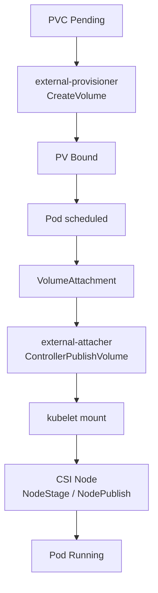

#kubernetes #csi #storage #troubleshooting

相关笔记：[[csi]] | [[csi-sidecars]] | [[volume-lifecycle]] | [[csi-source]] | [[ceph-csi]] | [[longhorn]] | [[k8s-interview]]

## 概述

CSI 排障的关键是按生命周期定位：PVC 没绑定、VolumeAttachment 没 attached、Pod 没 mount、扩容没完成、快照没 ready，分别对应不同控制器和不同 CSI RPC。

不要只看 CSI driver 日志。先看 Kubernetes 对象状态，因为 sidecar 的职责就是把对象状态推进到下一步。

## 总链路



```text
PVC Pending
  -> external-provisioner / CreateVolume
PV Bound
  -> scheduler chooses node
VolumeAttachment
  -> external-attacher / ControllerPublishVolume
kubelet mount
  -> NodeStageVolume / NodePublishVolume
Pod Running
```

## 第一层：PVC Pending

命令：

```bash
kubectl get pvc,pv,sc -A
kubectl describe pvc <pvc-name> -n <namespace>
kubectl get events -n <namespace> --sort-by=.lastTimestamp
```

检查点：

| 检查项 | 说明 |
| --- | --- |
| StorageClass 是否存在 | PVC `storageClassName` 是否拼错 |
| provisioner name | StorageClass.provisioner 是否等于 CSI driver name |
| accessModes | driver 是否支持 RWO/RWX/ROX |
| volumeMode | Filesystem / Block 是否支持 |
| capacity | 后端池容量是否足够 |
| WaitForFirstConsumer | 是否在等 Pod 调度后再创建 PV |
| topology | allowedTopologies 是否和可调度节点匹配 |

看 provisioner 日志：

```bash
kubectl -n <driver-namespace> logs deploy/<controller-name> -c external-provisioner
kubectl -n <driver-namespace> logs deploy/<controller-name> -c <driver-container>
```

## 第二层：PV Bound 但 Pod 卡住

先看 Pod：

```bash
kubectl describe pod <pod-name> -n <namespace>
```

常见 event：

| Event | 方向 |
| --- | --- |
| `AttachVolume.Attach failed` | Controller attach 阶段 |
| `MountVolume.SetUp failed` | Node mount 阶段 |
| `driver name ... not found` | node-driver-registrar 或 CSINode 注册 |
| `timed out waiting for the condition` | attach/mount 长时间未完成 |

看 VolumeAttachment：

```bash
kubectl get volumeattachment
kubectl describe volumeattachment <name>
```

如果 VolumeAttachment 没有 `attached=true`，优先看 external-attacher 和 Controller service。

## 第三层：Attach 失败

Attach 失败对应 `ControllerPublishVolume`。

检查：

```bash
kubectl -n <driver-namespace> logs deploy/<controller-name> -c external-attacher
kubectl -n <driver-namespace> logs deploy/<controller-name> -c <driver-container>
```

高频原因：

- 云盘和节点不在同一 zone。
- 卷已经 attach 到其他节点，RWO 卷不允许多节点挂载。
- 云 API 权限不足。
- node_id 和云厂商实例 ID 不一致。
- 后端存储集群不可用。

如果是 NFS / CephFS 这类网络文件系统，Attach 可能是 no-op，问题更可能在 Mount 阶段。

## 第四层：Mount 失败

Mount 失败对应 kubelet 调 CSI Node service：

- `NodeStageVolume`
- `NodePublishVolume`
- `NodeExpandVolume`

命令：

```bash
kubectl -n <driver-namespace> get pod -o wide
kubectl -n <driver-namespace> logs <node-plugin-pod> -c node-driver-registrar
kubectl -n <driver-namespace> logs <node-plugin-pod> -c <driver-container>
journalctl -u kubelet -n 200 --no-pager
```

节点路径检查：

```bash
mount | grep kubelet
findmnt | grep kubelet
ls -l /var/lib/kubelet/plugins_registry/
ls -l /var/lib/kubelet/plugins/
```

常见原因：

| 原因 | 说明 |
| --- | --- |
| driver 未注册 | CSINode 缺 driver，registrar 或 socket 路径异常 |
| 节点缺依赖 | iSCSI、NFS client、ceph-common、nvme 工具缺失 |
| 权限不足 | Node Pod 没有 privileged / hostPath mount |
| 文件系统错误 | mkfs、fsck、mount option 不兼容 |
| SELinux/AppArmor | 挂载或设备访问被拦截 |

## 第五层：扩容失败

扩容涉及 Controller 和 Node 两段：

1. external-resizer 调 `ControllerExpandVolume` 扩后端卷。
2. kubelet 调 `NodeExpandVolume` 扩节点文件系统。

命令：

```bash
kubectl describe pvc <pvc-name> -n <namespace>
kubectl get pvc <pvc-name> -n <namespace> -o yaml
kubectl -n <driver-namespace> logs deploy/<controller-name> -c external-resizer
```

看 PVC condition：

- `Resizing`：后端扩容中。
- `FileSystemResizePending`：后端已扩，等待节点侧文件系统扩容。

## 第六层：Snapshot 失败

命令：

```bash
kubectl get volumesnapshot,volumesnapshotcontent -A
kubectl describe volumesnapshot <snapshot-name> -n <namespace>
kubectl get volumesnapshotclass
```

检查：

- Snapshot CRD 是否安装。
- snapshot-controller 是否运行。
- VolumeSnapshotClass.driver 是否匹配 CSI driver。
- driver 是否部署 external-snapshotter。
- 后端是否支持快照。

## 快速定位表

| 卡住位置 | 看什么对象 | 看哪个组件 |
| --- | --- | --- |
| PVC Pending | PVC / StorageClass / events | external-provisioner |
| PV 已绑定但 Attach 失败 | VolumeAttachment | external-attacher / Controller service |
| Pod Mount 失败 | Pod events / kubelet logs / CSINode | Node plugin / node-driver-registrar |
| Resize 失败 | PVC conditions | external-resizer / Node plugin |
| Snapshot 失败 | VolumeSnapshot / VolumeSnapshotContent | snapshot-controller / external-snapshotter |

## 面试要点

### Q: PVC Pending 怎么排查？

A: 先 `describe pvc` 看 event，再检查 StorageClass、provisioner name、access mode、volume mode、容量、topology 和 WaitForFirstConsumer。然后看 external-provisioner 和 driver Controller service 日志。

### Q: Pod 挂载 PVC 失败，应该先看 attacher 还是 kubelet？

A: 先看 Pod event 和 VolumeAttachment。如果 VolumeAttachment 没 attached，查 external-attacher/ControllerPublishVolume；如果已经 attached 但 mount 失败，查 kubelet、node-driver-registrar 和 Node service。

### Q: FileSystemResizePending 表示什么？

A: 后端卷通常已经扩容，但节点侧文件系统还没完成 resize。需要 kubelet 在挂载卷的节点上调用 `NodeExpandVolume`，或者等待 Pod 重新挂载触发文件系统扩容。
