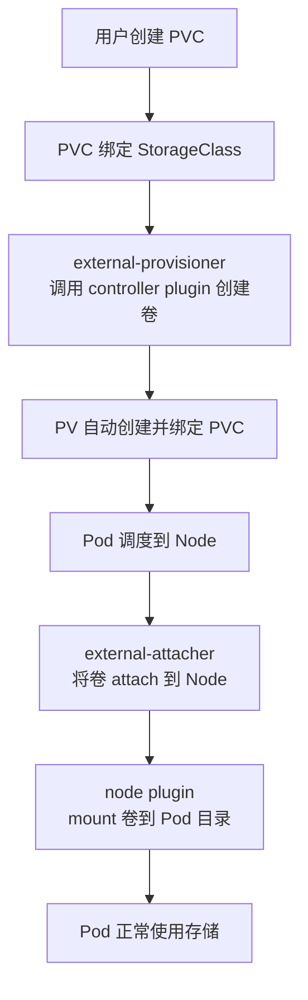
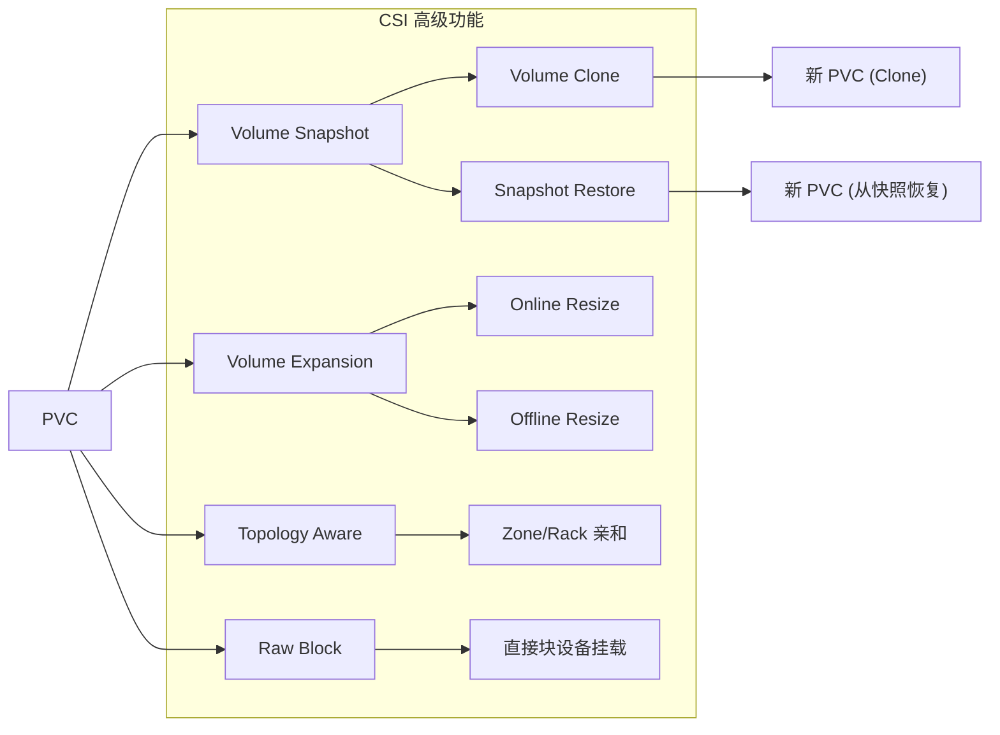
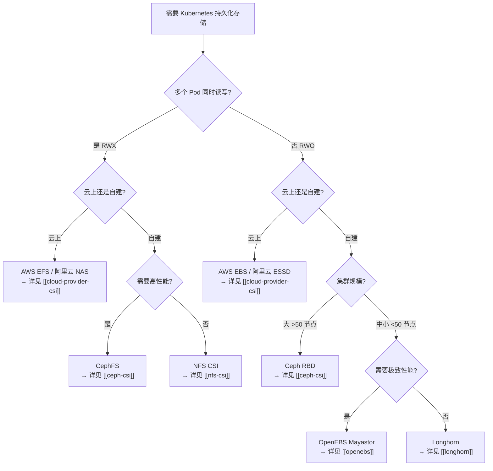

#kubernetes #csi

相关笔记：[[kubernetes-basics]] | [[cni]] | [[service]] | [[k8s-interview]] | [[ceph-csi]] | [[longhorn]] | [[openebs]] | [[nfs-csi]] | [[cloud-provider-csi]] | [[csi-source]]

## CSI 概述

CSI（Container Storage Interface）是 CNCF 制定的一套标准存储插件接口规范，用于让 Kubernetes 和各种存储系统解耦。

- 就像 CNI 是管理网络的插件接口，CSI 是用于挂载和卸载存储卷的插件接口
- 支持动态创建、挂载、扩容、快照、回收等功能
- 允许第三方厂商（如 Ceph、阿里云、腾讯云）编写 CSI 插件，兼容 K8s

### 为什么需要 CSI

早期 Kubernetes 的存储插件是内置的（in-tree），耦合性高，维护困难。CSI 是 out-of-tree 插件机制，插件运行在用户空间，K8s 只调用统一接口，不再关心存储实现细节。

## CSI 核心组成

一个完整的 CSI 插件包括：

| 组件 | 作用 |
| --- | --- |
| **external-provisioner** | 负责处理动态创建 PVC 的请求 |
| **external-attacher** | 将卷附加到节点（attach） |
| **external-snapshotter** | 管理卷快照（可选） |
| **external-resizer** | 处理 PVC 扩容（可选） |
| **node plugin** | 在 Node 上运行，挂载卷到本地目录 |
| **controller plugin** | 管理控制面（创建卷、删除卷、快照等） |

### CSI 接口规范

CSI 定义了三组 gRPC 接口：

| 接口 | 说明 | 典型方法 |
| --- | --- | --- |
| **Identity Service** | 插件身份信息 | GetPluginInfo, GetPluginCapabilities, Probe |
| **Controller Service** | 卷的生命周期管理 | CreateVolume, DeleteVolume, ControllerPublishVolume, CreateSnapshot |
| **Node Service** | 节点上的挂载操作 | NodeStageVolume, NodePublishVolume, NodeGetCapabilities |

## CSI 工作流程

当 Pod 使用 PVC 时，CSI 插件负责给它找一个卷挂上去。完整流程如下：



### 常用操作命令

```bash
# 查看已经加载的 CSI 驱动
kubectl get csidrivers

# 查看卷绑定情况
kubectl get pvc,pv

# 查看 StorageClass
kubectl get sc
```

## 常见 CSI 插件

| 插件名称 | 类型 | 适用场景 | 详细文档 |
| --- | --- | --- | --- |
| **hostPath** | 本地 | 演示/测试环境，非生产 | - |
| **nfs-csi** | 网络文件系统 | 多 Pod 共享读写 | [[nfs-csi]] |
| **ceph-csi (RBD, CephFS)** | 分布式存储 | 云原生环境、高可用 | [[ceph-csi]] |
| **longhorn** | 轻量级分布式存储 | Rancher 等环境 | [[longhorn]] |
| **OpenEBS** | 多引擎存储 | 灵活选型、高性能 | [[openebs]] |
| **云厂商 CSI (EBS/Disk/PD)** | 云盘 | 云上场景 | [[cloud-provider-csi]] |

## CSI 高级功能

### 功能总览流程



### Volume Snapshot 和恢复

Volume Snapshot 可以在不停机的情况下为 PVC 创建时间点快照，用于数据保护和灾备。

```yaml
# 1. 安装 Snapshot CRDs 和 Controller（集群只需装一次）
# kubectl apply -f https://raw.githubusercontent.com/kubernetes-csi/external-snapshotter/master/deploy/kubernetes/snapshot-controller/

# 2. 定义 VolumeSnapshotClass
apiVersion: snapshot.storage.k8s.io/v1
kind: VolumeSnapshotClass
metadata:
  name: ceph-rbd-snapclass
driver: rbd.csi.ceph.com
deletionPolicy: Delete
parameters:
  clusterID: <cluster-id>
  csi.storage.k8s.io/snapshotter-secret-name: csi-rbd-secret
  csi.storage.k8s.io/snapshotter-secret-namespace: ceph-csi
---
# 3. 创建快照
apiVersion: snapshot.storage.k8s.io/v1
kind: VolumeSnapshot
metadata:
  name: mysql-snapshot-20260407
spec:
  volumeSnapshotClassName: ceph-rbd-snapclass
  source:
    persistentVolumeClaimName: mysql-data    # 要快照的 PVC
---
# 4. 从快照恢复到新 PVC
apiVersion: v1
kind: PersistentVolumeClaim
metadata:
  name: mysql-data-restored
spec:
  accessModes:
    - ReadWriteOnce
  storageClassName: ceph-block
  resources:
    requests:
      storage: 10Gi
  dataSource:
    name: mysql-snapshot-20260407
    kind: VolumeSnapshot
    apiGroup: snapshot.storage.k8s.io
```

### Volume Cloning

直接从现有 PVC 克隆出新 PVC，无需先创建 Snapshot（效率更高，但要求同一 StorageClass）。

```yaml
apiVersion: v1
kind: PersistentVolumeClaim
metadata:
  name: mysql-data-clone
spec:
  accessModes:
    - ReadWriteOnce
  storageClassName: ceph-block
  resources:
    requests:
      storage: 10Gi
  dataSource:
    name: mysql-data          # 源 PVC
    kind: PersistentVolumeClaim
```

### Volume Expansion（在线扩容）

前提条件：StorageClass 必须设置 `allowVolumeExpansion: true`。

```bash
# 直接修改 PVC 的 storage 字段即可触发扩容
kubectl patch pvc mysql-data -p '{"spec":{"resources":{"requests":{"storage":"20Gi"}}}}'

# 查看扩容状态
kubectl get pvc mysql-data -o jsonpath='{.status.conditions}'
# FileSystemResizePending → 等待 Pod 重新挂载后自动完成 fs resize
```

扩容流程：
1. 修改 PVC `spec.resources.requests.storage` → external-resizer 检测到变化
2. Controller Plugin 调用 `ControllerExpandVolume` 扩展底层卷
3. Node Plugin 在下次 mount 时调用 `NodeExpandVolume` 扩展文件系统
4. 支持在线扩容的 CSI 驱动（如 ceph-csi）不需要重启 Pod

### Topology-Aware Provisioning

让 PV 在与 Pod 相同的拓扑域（Zone、Region、Rack）中创建，避免跨 AZ 读写带来的延迟和费用。

```yaml
apiVersion: storage.k8s.io/v1
kind: StorageClass
metadata:
  name: ebs-topology
provisioner: ebs.csi.aws.com
parameters:
  type: gp3
volumeBindingMode: WaitForFirstConsumer   # 关键：延迟绑定到 Pod 调度后
allowedTopologies:                        # 可选：限制允许的拓扑域
  - matchLabelExpressions:
      - key: topology.ebs.csi.aws.com/zone
        values:
          - us-east-1a
          - us-east-1b
```

`WaitForFirstConsumer` 的含义：PVC 创建后不立即绑定 PV，等 Pod 被调度到某个 Node 后，再在该 Node 所在的 Zone 创建 PV。这解决了多 AZ 场景下 PV 和 Pod 不在同一 Zone 导致挂载失败的问题。

### Raw Block Volume

某些场景（如数据库自己管理磁盘、高性能 I/O）需要直接使用块设备而非文件系统。

```yaml
# PVC 声明 volumeMode: Block
apiVersion: v1
kind: PersistentVolumeClaim
metadata:
  name: raw-block-pvc
spec:
  accessModes:
    - ReadWriteOnce
  volumeMode: Block                # 关键：Block 而非 Filesystem
  storageClassName: ceph-block
  resources:
    requests:
      storage: 10Gi
---
# Pod 使用 volumeDevices 而非 volumeMounts
apiVersion: v1
kind: Pod
metadata:
  name: raw-block-pod
spec:
  containers:
    - name: app
      image: myapp
      volumeDevices:               # 注意不是 volumeMounts
        - name: data
          devicePath: /dev/xvda    # 块设备路径
  volumes:
    - name: data
      persistentVolumeClaim:
        claimName: raw-block-pvc
```

---

## 存储选型指南

### 按场景对比表

| 场景 | 推荐方案 | Access Mode | 说明 |
| --- | --- | --- | --- |
| **开发测试** | hostPath / Local PV / OpenEBS Local PV | RWO | 零依赖，开箱即用 |
| **生产 - 单读写（数据库）** | [[ceph-csi\|Ceph RBD]] / 云盘 CSI / [[longhorn\|Longhorn]] | RWO | 高可靠、支持快照备份 |
| **生产 - 多读写（共享文件）** | CephFS / [[nfs-csi\|NFS CSI]] / 云厂商 NAS | RWX | 多 Pod 共享读写 |
| **高性能 AI/ML** | [[openebs\|OpenEBS Mayastor]] / FSx Lustre / CPFS | RWO/RWX | NVMe-oF 低延迟，高吞吐 |
| **灾备 & 数据保护** | Ceph RBD + Snapshot / Longhorn Backup | RWO | 快照 + 异地备份到 S3 |
| **边缘 / 资源受限** | [[longhorn\|Longhorn]] / OpenEBS Jiva | RWO | 轻量级，节点少也能跑 |
| **云上环境** | [[cloud-provider-csi\|云厂商 CSI]] | RWO/RWX | 零运维，深度集成 |

### 性能对比（参考基准）

| 方案 | 随机读 IOPS | 随机写 IOPS | 顺序读吞吐 | 适合 |
| --- | --- | --- | --- | --- |
| Local SSD (hostPath) | 100K+ | 80K+ | 2+ GB/s | 极致性能 |
| OpenEBS Mayastor | 50K-80K | 40K-60K | 1-2 GB/s | 高性能分布式 |
| Ceph RBD (SSD) | 20K-40K | 15K-30K | 500MB-1GB/s | 通用生产 |
| Longhorn (SSD) | 10K-20K | 8K-15K | 300-600MB/s | 中小规模 |
| NFS | 5K-10K | 3K-8K | 100-500MB/s | 共享场景 |
| CephFS | 10K-20K | 8K-15K | 300-800MB/s | 共享 + 较高性能 |

> 以上数据为 SSD 介质、万兆网络下的大致范围，实际性能因硬件和配置差异很大，仅供参考。

### 存储选型决策树



---

## 面试 Q&A

### Q1: 什么是 CSI？它解决了什么问题？

CSI 是一套容器存储接口规范，Kubernetes 使用它来动态管理存储卷挂载。它解决了内置插件耦合度高、更新困难的问题，使得第三方可以独立开发和更新存储插件。

### Q2: Kubernetes 中使用 CSI 的流程是怎样的？

用户通过 PVC 请求存储 -> StorageClass 绑定了 CSI 插件 -> CSI 控制器创建卷 -> 节点插件挂载卷 -> Pod 使用挂载的目录作为持久化存储。

### Q3: StorageClass 和 CSI 是什么关系？

StorageClass 是 PVC 和 CSI 插件之间的桥梁，它定义了要用哪个 CSI 插件（provisioner 字段）和存储参数（如 pool、fsType）。PVC 绑定到 StorageClass 后，Kubernetes 会调用对应 CSI 插件来处理存储卷。

### Q4: 如何调试 PVC 挂载失败的问题？

| 检查点 | 命令 |
| --- | --- |
| PVC 状态 | `kubectl describe pvc` |
| PV 状态 | `kubectl get pv` |
| CSI 插件日志 | `kubectl logs -n kube-system -l app=ceph-csi-*` |
| Node 插件状态 | `kubectl get pod -n kube-system -o wide` |
| 事件 | `kubectl describe pod <pod>` 查看挂载失败错误 |

### Q5: CSI 的 Controller Plugin 和 Node Plugin 的区别？

Controller Plugin 以 Deployment 方式运行，负责 Volume 的全局管理操作（创建、删除、快照、扩容），与具体节点无关。Node Plugin 以 DaemonSet 方式运行在每个节点上，负责将 Volume 挂载/卸载到该节点上的 Pod 目录。两者通过 gRPC 接口与 Kubernetes 的 sidecar 容器（provisioner、attacher 等）通信。

### Q6: 生产环境如何选择存储方案？

根据场景选择：云上优先用云厂商 CSI（零运维）；自建集群大规模用 Ceph（功能全面），中小规模用 Longhorn（简单易用）；需要极致性能用 OpenEBS Mayastor；需要 RWX 共享用 CephFS 或 NFS CSI。详见上方存储选型决策树。

## 总结

CSI 是 Kubernetes 的标准存储插件机制，允许将第三方存储系统无缝接入 K8s，实现持久化、共享、动态供给、扩容和快照等能力，是容器存储的基础组件。各存储插件的详细文档见：

- [[ceph-csi]] - Ceph 分布式存储（RBD + CephFS）
- [[longhorn]] - 轻量级云原生块存储
- [[openebs]] - 多引擎云原生存储
- [[nfs-csi]] - NFS 网络文件共享
- [[cloud-provider-csi]] - 云厂商 CSI（AWS / 阿里云 / GCP）
