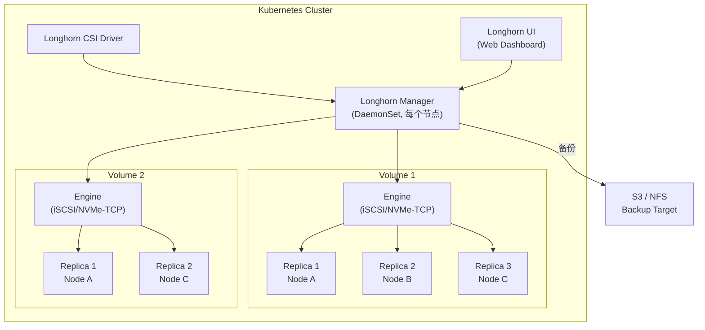
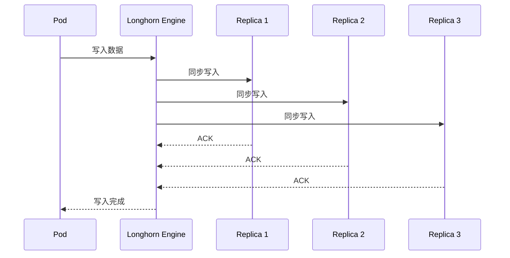
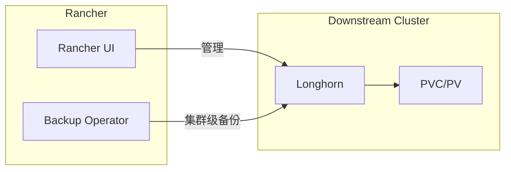

#kubernetes #csi #longhorn

相关笔记：[[csi]] | [[ceph-csi]] | [[k8s-interview]]

## Longhorn 概述

Longhorn 是 Rancher Labs 开源的轻量级云原生分布式块存储，专为 Kubernetes 设计，CNCF Incubating 项目。适合中小规模集群（节点 < 50），部署简单、运维成本低。

## 架构



### 核心组件

| 组件 | 作用 |
| --- | --- |
| **Longhorn Manager** | DaemonSet，运行在每个节点，管理 Volume 生命周期 |
| **Longhorn Engine** | 每个 Volume 对应一个 Engine 进程，负责数据面 I/O（基于 iSCSI 或 NVMe-TCP） |
| **Replica** | 数据副本，默认 3 副本分布在不同节点上 |
| **Longhorn UI** | Web Dashboard，可视化管理 Volume、快照、备份 |
| **CSI Driver** | 实现 CSI 接口，对接 Kubernetes PVC/PV 体系 |

### 数据流



每个 Volume 的 Engine 和 Replica 都是独立的进程/容器（微服务化），某个 Volume 故障不影响其他 Volume。

## 安装配置

### Helm 安装（推荐）

```bash
# 前置要求：每个节点安装 open-iscsi
# Ubuntu: apt install open-iscsi
# CentOS: yum install iscsi-initiator-utils

# Helm 安装
helm repo add longhorn https://charts.longhorn.io
helm repo update
helm install longhorn longhorn/longhorn \
  --namespace longhorn-system \
  --create-namespace \
  --set defaultSettings.defaultReplicaCount=3 \
  --set defaultSettings.defaultDataLocality=best-effort
```

### kubectl 安装（快速体验）

```bash
kubectl apply -f https://raw.githubusercontent.com/longhorn/longhorn/master/deploy/longhorn.yaml
```

### 访问 UI

```bash
# 通过 port-forward 访问 Longhorn Dashboard
kubectl -n longhorn-system port-forward svc/longhorn-frontend 8080:80

# 或创建 Ingress
```

### StorageClass 示例

```yaml
apiVersion: storage.k8s.io/v1
kind: StorageClass
metadata:
  name: longhorn
provisioner: driver.longhorn.io
allowVolumeExpansion: true
reclaimPolicy: Delete
parameters:
  numberOfReplicas: "3"
  staleReplicaTimeout: "2880"      # 48 小时
  dataLocality: "best-effort"       # 尽量把数据放在 Pod 所在节点
  fromBackup: ""
---
apiVersion: v1
kind: PersistentVolumeClaim
metadata:
  name: app-data
spec:
  accessModes:
    - ReadWriteOnce
  storageClassName: longhorn
  resources:
    requests:
      storage: 10Gi
```

## 与 Rancher 集成

Longhorn 是 Rancher 默认推荐的存储方案，在 Rancher UI 中可一键部署。集成后提供：

- **Rancher Dashboard** 中直接管理 Volume，无需单独打开 Longhorn UI
- 与 **Rancher Backup Operator** 联动做集群级备份
- **多集群统一管理**存储资源
- Rancher App Catalog 中一键升级 Longhorn 版本



## 快照与备份

### 快照（Snapshot）

快照是本地的、轻量级的，基于 CoW（Copy-on-Write）实现：

```bash
# 通过 Longhorn UI 点击 Volume → Take Snapshot

# 或通过 kubectl 创建 VolumeSnapshot（需要安装 Snapshot Controller）
```

```yaml
apiVersion: snapshot.storage.k8s.io/v1
kind: VolumeSnapshotClass
metadata:
  name: longhorn-snapclass
driver: driver.longhorn.io
deletionPolicy: Delete
---
apiVersion: snapshot.storage.k8s.io/v1
kind: VolumeSnapshot
metadata:
  name: app-data-snapshot
spec:
  volumeSnapshotClassName: longhorn-snapclass
  source:
    persistentVolumeClaimName: app-data
```

### 备份（Backup）

备份会将数据完整导出到外部目标（S3 / NFS），用于灾备恢复：

```bash
# 配置 S3 备份目标（Settings → Backup Target）
# 格式：s3://bucket-name@region/path/
# 设置 BACKUP_TARGET_CREDENTIAL_SECRET 指向 S3 凭证
```

### 定时备份（RecurringJob）

```yaml
apiVersion: longhorn.io/v1beta2
kind: RecurringJob
metadata:
  name: backup-daily
  namespace: longhorn-system
spec:
  cron: "0 2 * * *"    # 每天凌晨 2 点
  task: backup
  retain: 7             # 保留最近 7 份
  concurrency: 1
---
apiVersion: longhorn.io/v1beta2
kind: RecurringJob
metadata:
  name: snapshot-hourly
  namespace: longhorn-system
spec:
  cron: "0 * * * *"    # 每小时
  task: snapshot
  retain: 24            # 保留最近 24 份
  concurrency: 1
```

## Longhorn vs Ceph 对比

| 维度 | Longhorn | Ceph |
| --- | --- | --- |
| 复杂度 | 低，Helm 一键部署 | 高，需要独立 Ceph 集群 |
| 适用规模 | 中小集群（< 50 节点） | 中大型集群（50+ 节点） |
| 性能（SSD） | 10K-20K IOPS | 20K-40K IOPS |
| Access Mode | RWO | RWO (RBD) + RWX (CephFS) |
| 数据引擎 | iSCSI / NVMe-TCP | librados（原生协议） |
| UI 管理 | 内置 Web UI | 需要额外部署 Dashboard |
| 备份 | 原生支持 S3/NFS | 需要额外工具（如 Velero） |
| 社区生态 | Rancher/SUSE 主导 | 红帽/社区，生态更大 |

## 面试要点

### Q1: Longhorn 的架构特点是什么？

Longhorn 采用微服务化架构，每个 Volume 对应一个独立的 Engine 进程和多个 Replica 进程。Longhorn Manager 以 DaemonSet 方式运行在每个节点上管理 Volume 生命周期。这种设计的好处是故障隔离——某个 Volume 的 Engine 崩溃不影响其他 Volume。

### Q2: Longhorn 的数据写入流程？

Pod 写入数据 → Longhorn Engine 接收 I/O → Engine 同步写入到所有 Replica（默认 3 副本）→ 所有 Replica ACK 后返回写入成功。Engine 和 Replica 之间通过 iSCSI 或 NVMe-TCP 协议通信。

### Q3: Longhorn 适合什么场景？不适合什么场景？

适合：中小规模 K8s 集群（< 50 节点），需要简单易用的分布式块存储，Rancher 生态用户。不适合：大规模集群（性能不如 Ceph）、需要 RWX 多 Pod 共享读写（Longhorn 只支持 RWO）、极致性能需求。

### Q4: Longhorn 的备份和快照有什么区别？

快照（Snapshot）是本地的、基于 CoW 的轻量级操作，速度快但数据仍在本地磁盘上，不能防机器故障。备份（Backup）是将数据完整导出到 S3 或 NFS 等外部存储，可以跨集群恢复，用于灾备。生产环境应同时配置快照（快速回滚）和备份（灾难恢复）。
