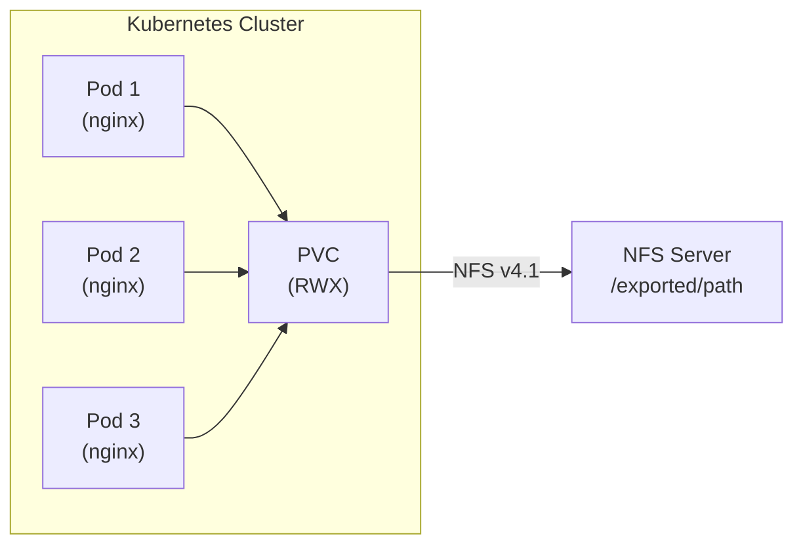
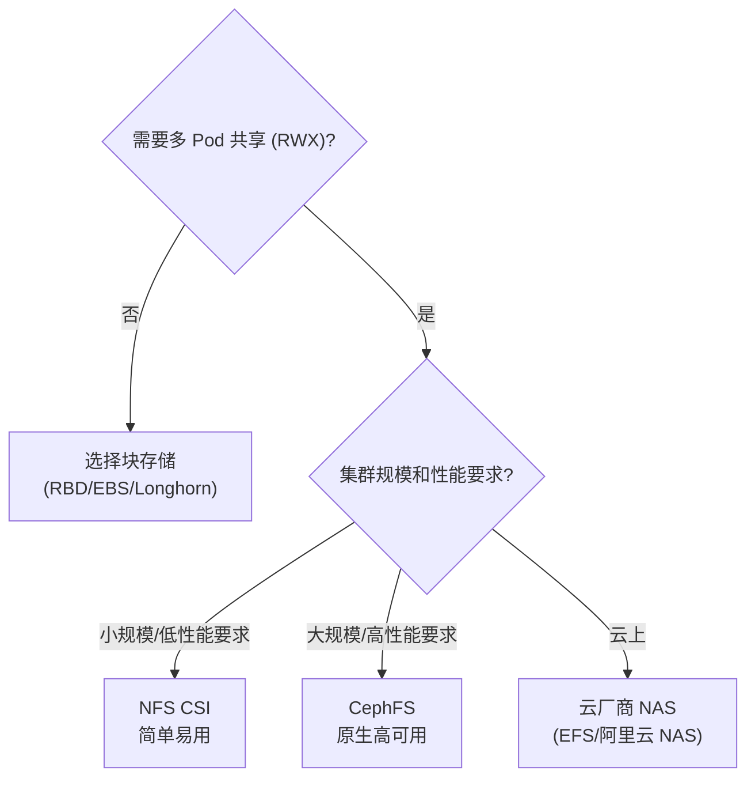
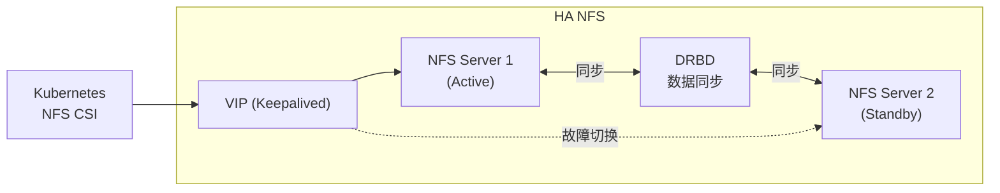

#kubernetes #csi #nfs

相关笔记：[[csi]] | [[ceph-csi]] | [[cloud-provider-csi]] | [[k8s-interview]]

## NFS CSI 概述

NFS 是最经典的网络文件共享协议，NFS CSI Driver 让 Kubernetes 可以通过 CSI 标准接口使用 NFS 存储。最大的优势是支持 **ReadWriteMany（RWX）**，多个 Pod 可以同时读写同一份数据。

## 典型使用场景

- 多个 Pod **共享配置文件、模型文件、媒体资源**
- CI/CD pipeline 中的 **artifact 共享**
- **日志聚合**：多 Pod 写入同一目录
- **内容管理系统**：多个 Web 实例共享上传文件



## 安装配置

### Helm 安装（推荐）

```bash
helm repo add csi-driver-nfs https://raw.githubusercontent.com/kubernetes-csi/csi-driver-nfs/master/charts
helm install csi-driver-nfs csi-driver-nfs/csi-driver-nfs \
  --namespace kube-system \
  --set driver.mountPermissions=0777
```

### kubectl 安装

```bash
curl -skSL https://raw.githubusercontent.com/kubernetes-csi/csi-driver-nfs/master/deploy/install-driver.sh | bash -s master --
```

### 验证安装

```bash
# 确认 CSI Driver 已注册
kubectl get csidrivers nfs.csi.k8s.io

# 查看 NFS CSI Pod
kubectl get pods -n kube-system -l app.kubernetes.io/name=csi-driver-nfs
```

## StorageClass + PVC 示例

### 基础配置

```yaml
# StorageClass：指向已有的 NFS Server
apiVersion: storage.k8s.io/v1
kind: StorageClass
metadata:
  name: nfs-csi
provisioner: nfs.csi.k8s.io
parameters:
  server: nfs-server.example.com     # NFS 服务器地址
  share: /exported/path              # NFS 导出路径
  # subDir: ${pvc.metadata.namespace}/${pvc.metadata.name}  # 可选：按 PVC 自动创建子目录
reclaimPolicy: Delete
volumeBindingMode: Immediate
mountOptions:
  - nfsvers=4.1
  - hard
  - noresvport
---
# PVC（RWX 多 Pod 共享）
apiVersion: v1
kind: PersistentVolumeClaim
metadata:
  name: shared-data
spec:
  accessModes:
    - ReadWriteMany
  storageClassName: nfs-csi
  resources:
    requests:
      storage: 100Gi
```

### 多 Pod 挂载同一 PVC

```yaml
apiVersion: apps/v1
kind: Deployment
metadata:
  name: web-app
spec:
  replicas: 3
  selector:
    matchLabels:
      app: web-app
  template:
    metadata:
      labels:
        app: web-app
    spec:
      containers:
        - name: app
          image: nginx
          volumeMounts:
            - name: shared-storage
              mountPath: /usr/share/nginx/html
      volumes:
        - name: shared-storage
          persistentVolumeClaim:
            claimName: shared-data
```

### 带子目录隔离的 StorageClass

```yaml
apiVersion: storage.k8s.io/v1
kind: StorageClass
metadata:
  name: nfs-csi-subdir
provisioner: nfs.csi.k8s.io
parameters:
  server: nfs-server.example.com
  share: /exported/path
  subDir: ${pvc.metadata.namespace}/${pvc.metadata.name}   # 每个 PVC 自动创建子目录
  onDelete: delete                                          # PVC 删除时清理子目录
reclaimPolicy: Delete
volumeBindingMode: Immediate
mountOptions:
  - nfsvers=4.1
  - hard
```

## NFS vs CephFS 对比

| 维度 | NFS CSI | CephFS |
| --- | --- | --- |
| 部署复杂度 | 低（只需一个 NFS Server） | 高（需要完整 Ceph 集群 + MDS） |
| 性能（IOPS） | 5K-10K | 10K-20K |
| 吞吐量 | 100-500 MB/s | 300-800 MB/s |
| 高可用 | 依赖 NFS Server（单点） | 原生高可用（多 MDS + 多 OSD） |
| 扩展性 | 纵向扩展（NFS Server 硬件） | 横向扩展（加 OSD 节点） |
| 快照支持 | 不支持 | 支持 |
| 在线扩容 | 不支持（NFS 层面不限制大小） | 支持 |
| 适用规模 | 小到中型 | 中到大型 |
| 成本 | 低 | 高（需要更多节点和磁盘） |



## 适用场景和局限

### 适用场景

- **共享文件存储**：多个 Pod 需要 RWX 访问同一数据
- **已有 NFS 基础设施**：企业已有 NFS Server（如 NetApp、Synology NAS）
- **简单部署需求**：不想维护复杂的分布式存储集群
- **非性能敏感场景**：配置文件、静态资源、日志收集

### 局限性

- **单点故障**：NFS Server 本身可能成为单点，需要额外做 HA（如 DRBD + Keepalived）
- **性能瓶颈**：NFS 性能受限于单台 Server 的网络和磁盘 I/O
- **不支持快照**：NFS CSI 不提供 Volume Snapshot 功能
- **不适合高 IOPS 场景**：数据库等需要高随机 I/O 的应用不适合用 NFS
- **文件锁问题**：NFS 的文件锁机制在分布式环境下可能不够可靠

### NFS Server 高可用方案



## 面试要点

### Q1: 什么场景下选择 NFS CSI？

需要 ReadWriteMany（RWX）多 Pod 共享文件、已有 NFS 基础设施、集群规模不大、对性能要求不极端的场景。典型案例：多副本 Web 应用共享上传文件、CI/CD artifact 共享、日志聚合。

### Q2: NFS CSI 的局限是什么？

主要三点：1）NFS Server 是单点，需要额外做 HA；2）性能受限于单台 Server 的网络和磁盘；3）不支持 Volume Snapshot。如果需要高可用的共享文件存储，应考虑 CephFS 或云厂商 NAS。

### Q3: NFS 和 CephFS 如何选择？

小规模、简单部署、已有 NFS 基础设施 → NFS CSI。大规模、高性能要求、需要快照和高可用 → CephFS。云上环境 → 直接用云厂商 NAS（如 AWS EFS、阿里云 NAS）。

### Q4: NFS CSI 的 mountOptions 有哪些常用配置？

- `nfsvers=4.1`：指定 NFS 协议版本（推荐 4.1）
- `hard`：NFS Server 无响应时无限重试（soft 会返回错误）
- `noresvport`：不使用保留端口，避免端口耗尽
- `rsize=1048576,wsize=1048576`：读写缓冲区大小，影响吞吐
- `timeo=600`：超时时间（单位 0.1 秒）
